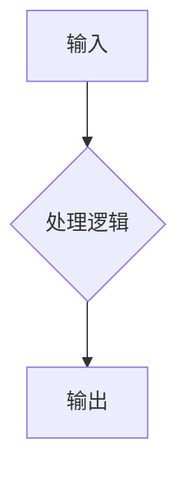

# <% tp.file.title %>

## 📋 基本信息

- **所属课程**：[[课程名称]]
- **章节/模块**：
- **重要程度**：⭐⭐⭐⭐⭐
- **掌握程度**：📚 学习中 / 📖 已理解 / ✅ 已掌握 / 🔄 需复习

---

## 🔍 核心概念

> 用一句话概括这个知识点的核心内容

### 定义

**官方定义**：

**通俗理解**：

### 关键要素

| 要素 | 说明 |
|------|------|
| | |
| | |
| | |

---

## 💡 知识点解析

### 原理与机制



### 核心公式/代码

```math
公式 = 表达式
```

```python
# 示例代码
```

### 图解说明


---

## ⚠️ 常见误区

> [!warning] 注意事项
> 
> - 误区一：
> - 误区二：
> - 误区三：

---

## 📝 例题与练习

### 例题

> [!question] 题目描述
> 
> **解题思路**：
> 
> **答案**：

### 练习题

1. 
2. 
3. 

---

## 🔗 相关知识点

| 关联知识点 | 关系类型 | 说明 |
|-----------|----------|------|
| [[知识点A]] | 前置依赖 | |
| [[知识点B]] | 并列关系 | |
| [[知识点C]] | 延伸拓展 | |

---

## 📚 参考资料

- [参考链接1]()
- [参考链接2]()

---

## 📌 学习笔记

> 在这里记录你的学习心得、思考和疑问

---

*最后更新：<% tp.date.now("YYYY-MM-DD HH:mm") %>*