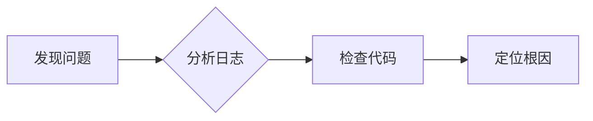

# <% tp.file.title %>

## 📋 问题信息

| 项目 | 内容 |
|------|------|
| **问题类型** | Bug / 性能问题 / 编译错误 / 逻辑错误 / 其他 |
| **发生时间** | |
| **影响范围** | |
| **严重程度** | 🔴 紧急 / 🟡 重要 / 🟢 一般 |
| **状态** | 🔍 排查中 / ✅ 已解决 / ⏳ 待验证 |

---

## 🐛 问题描述

> [!error] 问题概述
> 
> **现象**：
> 
> **复现步骤**：
> 1. 
> 2. 
> 3. 

**错误信息**：

```
粘贴错误日志或堆栈信息
```

---

## 🔍 排查过程

### 第一步：分析可能原因

| 可能原因 | 排查方法 | 结果 |
|----------|----------|------|
| | | |
| | | |
| | | |

### 第二步：定位问题



**关键代码段**：

```python
# 相关代码
```

### 第三步：解决方案

> [!success] 解决方案
> 
> **方案**：
> 
> **修改内容**：

```python
# 修改后的代码
```

---

## 📝 测试验证

**测试步骤**：

1. 
2. 
3. 

**测试结果**：✅ 通过 / ❌ 失败

---

## 💡 经验总结

> [!tip] 经验教训
> 
> - 学到的知识：
> - 以后如何避免：
> - 相关知识点：[[知识点名称]]

---

## 📚 参考资料

- [官方文档]()
- [解决方案链接]()
- [相关讨论]()

---

*最后更新：<% tp.date.now("YYYY-MM-DD HH:mm") %>*