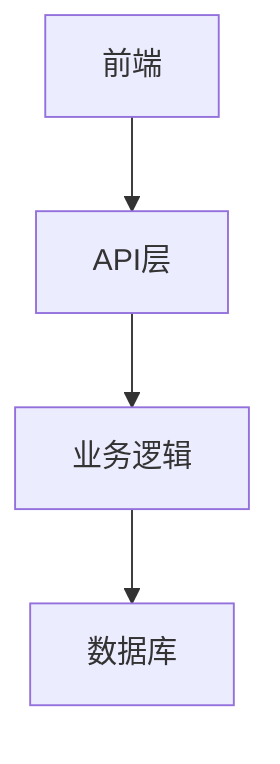

# <% tp.file.title %>

## 📋 项目信息

| 项目 | 内容 |
|------|------|
| **项目名称** | |
| **项目类型** | 课程作业 / 个人项目 / 团队项目 / 竞赛项目 |
| **开始日期** | |
| **结束日期** | |
| **状态** | 📋 规划中 / 🔨 进行中 / ✅ 已完成 / 📦 已归档 |

---

## 🎯 项目目标

> 用 2-3 句话描述项目的核心目标

**具体目标**：
- 目标一：
- 目标二：
- 目标三：

---

## 📐 技术方案

### 技术栈

| 分类 | 技术 | 版本 |
|------|------|------|
| **语言** | | |
| **框架** | | |
| **数据库** | | |
| **工具** | | |

### 架构设计



---

## 📝 任务清单

> [!todo] 待完成任务
> 
> - [ ] 任务一
> - [ ] 任务二
> - [ ] 任务三

> [!done] 已完成任务
> 
> - [x] 任务一
> - [x] 任务二

---

## 📊 进度跟踪

| 阶段 | 进度 | 开始时间 | 结束时间 | 负责人 |
|------|------|----------|----------|--------|
| | | | | |
| | | | | |
| | | | | |

---

## 🐛 问题记录

| 日期 | 问题 | 解决方案 | 状态 |
|------|------|----------|------|
| | | | |
| | | | |

---

## 📚 参考资料

- [技术文档]()
- [学习资源]()
- [示例代码]()

---

## 📁 文件结构

```
项目目录/
├── src/
│   └── ...
├── docs/
│   └── ...
└── README.md
```

---

## 📌 项目总结

> 项目完成后的总结与反思

---

*最后更新：<% tp.date.now("YYYY-MM-DD HH:mm") %>*