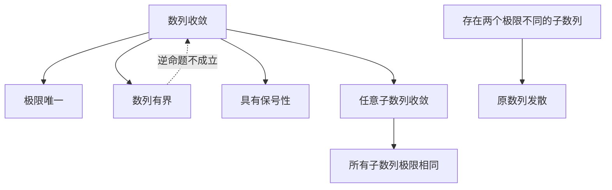

# 第二节：数列的极限

> [!abstract] 本节知识导航
> 本节主要研究当项数 $n$ 无限增大时，数列 $\{x_n\}$ 的变化趋势。
>
> - 数列
> - 数列极限的 $\varepsilon$-$N$ 定义
> - 收敛数列与发散数列
> - 有界数列
> - 极限的唯一性
> - 数列极限的保号性
> - 子数列
> 
> 核心问题是：
>
> $$
> \boxed{\text{当 }n\to\infty\text{ 时，}x_n\text{ 是否无限接近某个确定的数？}}
> $$

---

# 一、极限思想的直观背景

## 1. 圆面积的逐步逼近

极限思想来源于对实际问题进行逐步逼近。

例如，为了求圆的面积，可以依次作圆的内接正六边形、正十二边形、正二十四边形等。

若把内接正多边形的面积依次记为：

$$
A_1,A_2,A_3,\cdots,A_n,\cdots
$$

其中第 $n$ 个多边形的边数为：

$$
6\cdot2^{n-1}
$$

随着 $n$ 不断增大：

- 内接正多边形的边数不断增加；
- 多边形与圆的差别不断减小；
- 多边形面积 $A_n$ 越来越接近圆的面积。

> [!tip] 极限思想
> 每一个有限的 $A_n$ 都仍然只是多边形的面积，并不等于圆的面积。
>
> 但在 $n\to\infty$ 的过程中，$A_n$ 可以无限接近一个确定的数，这个确定的数就是数列 $\{A_n\}$ 的极限。

> [!quote] 核心思想
> 用不断变化的近似量，无限逼近一个确定的精确量。

---

# 二、数列的概念

## 1. 数列的定义

> [!info] 定义｜数列
> 按照某种确定的法则，对每个正整数 $n\in\mathbb N_+$，都有唯一确定的实数 $x_n$ 与之对应。将这些实数按下标排列得到
>
> $$
> x_1,x_2,x_3,\cdots,x_n,\cdots
> $$
>
> 这一有次序的数组称为**数列**，记作 $\{x_n\}$。
>
> - **项**：数列中的每一个数；
> - **一般项（通项）**：数列的第 $n$ 项 $x_n$。
>
> ^sequence-definition

---

## 2. 数列的例子

这些例子用于比较数列的排列特征与通项表达式：

| 例 | 数列的前几项 | 通项 $x_n$ |
|---:|---|---|
| 1 | $\frac12,\frac23,\frac34,\ldots$ | $\frac{n}{n+1}$ |
| 2 | $2,4,8,\ldots$ | $2^n$ |
| 3 | $\frac12,\frac14,\frac18,\ldots$ | $\frac1{2^n}$ |
| 4 | $1,-1,1,-1,\ldots$ | $(-1)^{n+1}$ |
| 5 | $2,\frac12,\frac43,\ldots$ | $\frac{n+(-1)^{n-1}}{n}=1+\frac{(-1)^{n-1}}{n}$ |

---

## 3. 数列与函数的关系

数列可以看作定义在正整数集上的[[第01节 映射与函数#1. 函数的概念|函数]]：$x_n=f(n)$，其中 $n\in\mathbb N_+$。当 $n$ 依次取 $1,2,3,\ldots$ 时，对应的函数值依次为 $x_1,x_2,x_3,\ldots$。

> [!info] 数列与普通函数的区别
> 普通函数的自变量常在某个连续区间内变化，而数列的自变量只能取正整数。
>
> 因此，数列可以看作一个定义域为 $\mathbb N_+$ 的离散函数。

---

## 4. 数列的几何表示

数列 $\{x_n\}$ 可以看成数轴上的一列动点 $x_1,x_2,x_3,\ldots,x_n,\ldots$。

> [!question] 研究目标
> 当 $n$ 无限增大时，数轴上的点 $x_n$ 是否越来越接近某个固定点 $a$？

---

# 三、数列极限的直观含义

考虑数列 $x_n=\frac{n+(-1)^{n-1}}{n}$。将其与 $1$ 作差：

$$
\begin{aligned}
x_n&=1+\frac{(-1)^{n-1}}{n},\\
|x_n-1|&=\left|\frac{(-1)^{n-1}}{n}\right|=\frac1n\to0.
\end{aligned}
$$

因此，$x_n$ 与 $1$ 之间的距离越来越小。

> [!example] 精度与项数
> - 要使 $|x_n-1|<\frac1{100}$，只需 $n>100$；
> - 要使 $|x_n-1|<\frac1{10000}$，只需 $n>10000$。

一般地，无论给定的正数 $\varepsilon$ 多么小，只要 $n$ 足够大，就可以使：

$$
|x_n-1|<\varepsilon
$$

因此 $\boxed{x_n\to1\ (n\to\infty)}$。

---

# 四、数列极限的严格定义

> [!info] 定义｜数列的极限
> 设 $\{x_n\}$ 为一数列。如果存在常数 $a$，对于任意给定的正数 $\varepsilon$，总存在正整数 $N$，使得当 $n>N$ 时，不等式
>
> $$
> |x_n-a|<\varepsilon
> $$
>
> 恒成立，那么称常数 $a$ 是数列 $\{x_n\}$ 的极限，也称数列 $\{x_n\}$ 收敛于 $a$。
>
> 记作：
>
> $$
> \boxed{\lim_{n\to\infty}x_n=a}
> $$
>
> 或：
>
> $$
> \boxed{x_n\to a\quad(n\to\infty)}
> $$
>
> 若不存在这样的常数 $a$，则称数列 $\{x_n\}$ **没有极限**，或称数列 $\{x_n\}$ **发散**。
>
> ^sequence-limit-definition

---

## 1. 用量词表示极限定义

符号：

$$
\forall
$$

表示“对于任意”。

符号：

$$
\exists
$$

表示“存在”。

因此，数列极限的定义可以写为：

$$
\boxed{
\lim_{n\to\infty}x_n=a
\iff
\forall\varepsilon>0,\ 
\exists N\in\mathbb N_+,\ 
\forall n\in\mathbb N_+,\ n>N\Rightarrow
|x_n-a|<\varepsilon
}
$$

> [!warning] 量词顺序不能交换
> 正确顺序是：
>
> $$
> \forall\varepsilon>0
> \quad\longrightarrow\quad
> \exists N
> \quad\longrightarrow\quad
> \forall n\in\mathbb N_+,\ n>N
> $$
>
> 即先任意给定 $\varepsilon$，然后根据这个 $\varepsilon$ 选择一个合适的 $N$。

---

## 2. $\varepsilon$ 和 $N$ 的含义

### $\varepsilon$ 的含义

$\varepsilon$ 表示允许的误差范围。

由于：

$$
|x_n-a|<\varepsilon
$$

等价于：

$$
-\varepsilon<x_n-a<\varepsilon
$$

即：

$$
a-\varepsilon<x_n<a+\varepsilon
$$

所以，$x_n$ 落在点 $a$ 的 $\varepsilon$ 邻域：

$$
(a-\varepsilon,a+\varepsilon)
$$

内。

---

### $N$ 的含义

$N$ 表示从数列的某一项以后，数列的所有项都进入点 $a$ 的 $\varepsilon$ 邻域。

也就是说，当：

$$
n>N
$$

时，所有的 $x_n$ 都满足：

$$
a-\varepsilon<x_n<a+\varepsilon
$$

> [!important] 关键理解
> 极限定义要求的不是“有某些项进入邻域”，而是：
>
> ==从某一项以后，所有项都进入邻域，并且不再跑出去。==

---

## 3. 数列极限的几何意义

在数轴上作点 $a$ 的 $\varepsilon$ 邻域：

$$
(a-\varepsilon,a+\varepsilon)
$$

若：

$$
\lim_{n\to\infty}x_n=a
$$

则对于任意 $\varepsilon>0$，数列中至多只有有限项落在该邻域之外。

换言之：

$$
\boxed{
\text{除有限项外，其余所有项都落在 }
(a-\varepsilon,a+\varepsilon)
\text{ 内}
}
$$

---

## 4. 极限定义中的注意事项

> [!warning] 注意1：$\varepsilon$ 必须是任意正数
> 不能只验证某一个固定的 $\varepsilon$。
>
> 必须对任意：
>
> $$
> \varepsilon>0
> $$
>
> 都能找到符合要求的 $N$。

> [!warning] 注意2：$N$ 可以依赖于 $\varepsilon$
> 当 $\varepsilon$ 越小时，对精度的要求越高，通常需要选择更大的 $N$。
>
> 因此一般写作：
>
> $$
> N=N(\varepsilon)
> $$

> [!warning] 注意3：$N$ 不能依赖于 $n$
> $N$ 必须在确定 $\varepsilon$ 后一次选定，并且对所有 $n>N$ 同时有效。

> [!warning] 注意4：$N$ 不要求唯一
> 只要某个正整数 $N$ 能满足要求，比它更大的正整数通常也能满足要求。

> [!warning] 注意5：前面有限项不影响极限
> 数列极限只研究 $n$ 充分大时的变化趋势。
>
> 改变、增加或删除数列的有限项，不会改变其极限。

---

# 五、利用定义证明数列极限

## 1. $\varepsilon$-$N$ 证明的一般步骤

> [!tip] 标准证明模板
> 要证明：
>
> $$
> \lim_{n\to\infty}x_n=a
> $$
>
> 通常按以下步骤进行：
>
> 1. 任取 $\varepsilon>0$；
> 2. 研究并估计 $|x_n-a|$；
> 3. 解不等式：
>
>    $$
>    |x_n-a|<\varepsilon
>    $$
>
> 4. 得到关于 $n$ 的条件；
> 5. 根据 $\varepsilon$ 选择一个正整数 $N$；
> 6. 说明当 $n>N$ 时，不等式恒成立；
> 7. 根据定义得出极限结论。

可以概括为：

$$
\boxed{
|x_n-a|
\leq\text{一个随 }n\text{ 增大而趋于 }0\text{ 的量}
}
$$

---

## 2. 例1：证明一个交错扰动数列的极限

> [!example] 例1
> 证明数列：
>
> $$
> x_n=\frac{n+(-1)^{n-1}}{n}
> $$
>
> 的极限为 $1$。

### 证明

任取：

$$
\varepsilon>0
$$

计算：

$$
\begin{aligned}
|x_n-1|
&=
\left|
\frac{n+(-1)^{n-1}}{n}-1
\right|\\
&=
\left|
\frac{(-1)^{n-1}}{n}
\right|\\
&=
\frac1n
\end{aligned}
$$

为了使：

$$
|x_n-1|<\varepsilon
$$

只需：

$$
\frac1n<\varepsilon
$$

即：

$$
n>\frac1\varepsilon
$$

可以取：

$$
N=
\left\lfloor\frac1\varepsilon\right\rfloor+1
$$

于是当 $n>N$ 时：

$$
n>\frac1\varepsilon
$$

从而：

$$
|x_n-1|
=
\frac1n
<
\varepsilon
$$

根据数列极限的定义：

> [!success] 结论
> $$
> \boxed{
> \lim_{n\to\infty}
> \frac{n+(-1)^{n-1}}{n}
> =1
> }
> $$

---

## 3. 例2：证明平方反比数列的极限

> [!example] 例2
> 已知：
>
> $$
> x_n=\frac{(-1)^n}{(n+1)^2}
> $$
>
> 证明：
>
> $$
> \lim_{n\to\infty}x_n=0
> $$

### 证明

任取：

$$
\varepsilon>0
$$

有：

$$
\begin{aligned}
|x_n-0|
&=
\left|
\frac{(-1)^n}{(n+1)^2}
\right|\\
&=
\frac1{(n+1)^2}\\
&<
\frac1{n^2}
\end{aligned}
$$

为了使：

$$
\frac1{n^2}<\varepsilon
$$

只需：

$$
n>\frac1{\sqrt\varepsilon}
$$

可以取：

$$
N=
\left\lfloor
\frac1{\sqrt\varepsilon}
\right\rfloor+1
$$

当 $n>N$ 时：

$$
|x_n|
<
\frac1{n^2}
<
\varepsilon
$$

因此：

> [!success] 结论
> $$
> \boxed{
> \lim_{n\to\infty}
> \frac{(-1)^n}{(n+1)^2}
> =0
> }
> $$

> [!tip] 解题特点
> 本题没有直接求解：
>
> $$
> \frac1{(n+1)^2}<\varepsilon
> $$
>
> 而是先进行放缩：
>
> $$
> \frac1{(n+1)^2}<\frac1{n^2}
> $$
>
> 再通过较简单的不等式确定 $N$。

---

## 4. 例3：证明等比数列的极限

> [!example] 例3
> 设：
>
> $$
> |q|<1
> $$
>
> 证明等比数列：
>
> $$
> 1,q,q^2,\cdots,q^{n-1},\cdots
> $$
>
> 的极限为 $0$。

即证明：

$$
\lim_{n\to\infty}q^{n-1}=0
$$

### 情况一：$q=0$

当 $q=0$ 时，数列为：

$$
1,0,0,0,\cdots
$$

显然从第二项开始恒为 $0$，所以：

$$
\lim_{n\to\infty}q^{n-1}=0
$$

### 情况二：$0<|q|<1$

任取：

$$
\varepsilon>0
$$

当 $\varepsilon\geq1$ 时，由于：

$$
|q|^{n-1}<1\leq\varepsilon
$$

只需取一个正整数 $N$ 即可。

下面考虑：

$$
0<\varepsilon<1
$$

有：

$$
|q^{n-1}-0|
=
|q|^{n-1}
$$

要使：

$$
|q|^{n-1}<\varepsilon
$$

两边取自然对数：

$$
(n-1)\ln|q|<\ln\varepsilon
$$

由于：

$$
0<|q|<1
$$

所以：

$$
\ln|q|<0
$$

不等式两边除以负数 $\ln|q|$ 时，不等号方向改变：

$$
n-1>
\frac{\ln\varepsilon}{\ln|q|}
$$

即：

$$
n>
1+\frac{\ln\varepsilon}{\ln|q|}
$$

可以选择一个正整数 $N$，使：

$$
N>
1+\frac{\ln\varepsilon}{\ln|q|}
$$

例如取：

$$
N=
\left\lfloor
1+\frac{\ln\varepsilon}{\ln|q|}
\right\rfloor+1
$$

则当 $n>N$ 时：

$$
|q|^{n-1}<\varepsilon
$$

所以：

> [!success] 结论
> $$
> \boxed{
> |q|<1
> \quad\Longrightarrow\quad
> \lim_{n\to\infty}q^{n-1}=0
> }
> $$

---

# 六、收敛数列的性质

## 1. 性质总览

---

# 七、极限的唯一性

> [!tip] 定理 1｜极限的唯一性
> 如果数列 $\{x_n\}$ 收敛，那么它的极限唯一。
>
> 即一个收敛数列不可能同时收敛于两个不同的常数。
>^limit-uniqueness

## 证明

使用反证法。

假设数列 $\{x_n\}$ 同时满足：

$$
\lim_{n\to\infty}x_n=a
$$

以及：

$$
\lim_{n\to\infty}x_n=b
$$

且不妨设：

$$
a<b
$$

取：

$$
\varepsilon=\frac{b-a}{2}>0
$$

由于：

$$
x_n\to a
$$

所以存在正整数 $N_1$，当 $n>N_1$ 时：

$$
|x_n-a|<\frac{b-a}{2}
$$

由此可得：

$$
x_n<a+\frac{b-a}{2}
=
\frac{a+b}{2}
$$

同理，由于：

$$
x_n\to b
$$

所以存在正整数 $N_2$，当 $n>N_2$ 时：

$$
|x_n-b|<\frac{b-a}{2}
$$

从而：

$$
x_n>b-\frac{b-a}{2}
=
\frac{a+b}{2}
$$

取：

$$
N=\max\{N_1,N_2\}
$$

则当 $n>N$ 时，应同时满足：

$$
x_n<\frac{a+b}{2}
$$

以及：

$$
x_n>\frac{a+b}{2}
$$

产生矛盾。

因此假设不成立。

> [!success] 结论
> $$
> \boxed{\text{收敛数列的极限是唯一的}}
> $$

---

# 八、发散数列的一个典型例子

> [!example] 例4
> 证明数列：
>
> $$
> x_n=(-1)^{n+1}
> $$
>
> 是发散的。

该数列为：

$$
1,-1,1,-1,\cdots
$$

假设该数列收敛，设：

$$
\lim_{n\to\infty}x_n=a
$$

取：

$$
\varepsilon=\frac12
$$

根据极限定义，应存在正整数 $N$，使得当 $n>N$ 时：

$$
|x_n-a|<\frac12
$$

也就是说，从某一项以后，所有项都应位于区间：

$$
\left(a-\frac12,a+\frac12\right)
$$

内。

但数列从始至终不断交替取：

$$
1,\quad -1
$$

两个数之间的距离为：

$$
|1-(-1)|=2
$$

它们不可能同时落在长度为 $1$ 的区间：

$$
\left(a-\frac12,a+\frac12\right)
$$

内。

因此产生矛盾。

> [!success] 结论
> $$
> \boxed{
> \{(-1)^{n+1}\}\text{发散}
> }
> $$

> [!info] 发散原因
> 该数列始终在 $1$ 与 $-1$ 之间振荡，不能无限接近唯一的确定常数。

---

# 九、有界数列

## 1. 有界数列的定义

> [!info] 定义｜有界数列
> 对于数列 $\{x_n\}$，若存在正数 $M$，使对一切正整数 $n$，都有：
>
> $$
> |x_n|\leq M
> $$
>
> 则称数列 $\{x_n\}$ 是有界的。
>
> 这等价于数列的所有项都位于某个闭区间 $[-M,M]$ 内。
>
> 如果不存在这样的正数 $M$，则称数列 $\{x_n\}$ 是无界的。
>
> ^bounded-sequence-definition

---

## 2. 有界数列的例子

### 例1

$$
x_n=\frac{n}{n+1}
$$

因为对于任意正整数 $n$：

$$
0<\frac{n}{n+1}<1
$$

所以：

$$
\left|
\frac{n}{n+1}
\right|
\leq1
$$

可以取：

$$
M=1
$$

因此：

$$
\boxed{
\left\{\frac{n}{n+1}\right\}
\text{是有界数列}
}
$$

---

## 3. 无界数列的例子

考虑：

$$
x_n=2^n
$$

随着 $n$ 无限增大，$2^n$ 可以超过任意给定的正数。

因此不存在正数 $M$，使：

$$
2^n\leq M
$$

对所有正整数 $n$ 都成立。

所以：

$$
\boxed{\{2^n\}\text{是无界数列}}
$$

---

# 十、收敛数列的有界性

> [!tip] 定理 2｜收敛数列的有界性
> 如果数列 $\{x_n\}$ 收敛，那么数列 $\{x_n\}$ 一定有界。
>
> ^convergence-implies-boundedness

## 证明

设：

$$
\lim_{n\to\infty}x_n=a
$$

在极限定义中取：

$$
\varepsilon=1
$$

则存在正整数 $N$，使得当 $n>N$ 时：

$$
|x_n-a|<1
$$

根据三角不等式：

$$
\begin{aligned}
|x_n|
&=
|(x_n-a)+a|\\
&\leq|x_n-a|+|a|\\
&<1+|a|
\end{aligned}
$$

因此，从第 $N+1$ 项开始，所有项均满足：

$$
|x_n|<1+|a|
$$

对于前面的有限项：

$$
x_1,x_2,\cdots,x_N
$$

取：

$$
M=
\max
\left\{
|x_1|,
|x_2|,
\cdots,
|x_N|,
1+|a|
\right\}
$$

则对任意正整数 $n$，都有：

$$
|x_n|\leq M
$$

所以：

> [!success] 结论
> $$
> \boxed{
> \text{收敛数列一定有界}
> }
> $$

---

## 1. 逆命题是否成立？

定理2说明：

$$
\text{收敛}\Longrightarrow\text{有界}
$$

但逆命题：

$$
\text{有界}\Longrightarrow\text{收敛}
$$

并不成立。

例如：

$$
x_n=(-1)^{n+1}
$$

满足：

$$
|x_n|=1
$$

所以该数列有界。

但它不断在 $1$ 和 $-1$ 之间振荡，因此发散。

> [!warning] 重要结论
> $$
> \boxed{
> \text{有界是数列收敛的必要条件，但不是充分条件}
> }
> $$

---

# 十一、收敛数列的保号性

> [!tip] 定理 3｜收敛数列的保号性
> 如果：
>
> $$
> \lim_{n\to\infty}x_n=a
> $$
>
> 且：
>
> $$
> a>0
> $$
>
> 那么存在正整数 $N$，使得当 $n>N$ 时：
>
> $$
> x_n>0
> $$
>
> 类似地，若 $a<0$，则当 $n$ 充分大时：
>
> $$
> x_n<0
> $$
>
> ^limit-sign-preservation

## 证明

只证明：

$$
a>0
$$

的情形。

取：

$$
\varepsilon=\frac a2>0
$$

由于：

$$
x_n\to a
$$

所以存在正整数 $N$，使得当 $n>N$ 时：

$$
|x_n-a|<\frac a2
$$

由绝对值不等式可得：

$$
-\frac a2<x_n-a<\frac a2
$$

从左侧不等式得到：

$$
x_n>a-\frac a2=\frac a2>0
$$

所以，当 $n>N$ 时：

$$
x_n>0
$$

> [!success] 结论
> 若数列极限为正，则数列从某一项以后全部为正；若极限为负，则数列从某一项以后全部为负。

---

## 1. 保号性不是“每一项都同号”

例如数列：

$$
-10,-2,1+\frac13,1+\frac14,1+\frac15,\cdots
$$

虽然前两项为负，但从第三项起可写成 $1+\frac1n$（$n=3,4,5,\ldots$），因此该数列收敛于正数 $1$。

保号性只保证：

$$
\boxed{\text{从某一项以后保持与极限相同的符号}}
$$

而不要求数列的所有项一开始就同号。

---

# 十二、保号性的推论

> [!tip] 推论
> 若数列 $\{x_n\}$ 从某一项起满足：
>
> $$
> x_n\geq0
> $$
>
> 且：
>
> $$
> \lim_{n\to\infty}x_n=a
> $$
>
> 则：
>
> $$
> \boxed{a\geq0}
> $$
>
> 类似地，若从某一项起：
>
> $$
> x_n\leq0
> $$
>
> 则：
>
> $$
> \boxed{a\leq0}
> $$

## 证明

设从第 $N_1$ 项起：

$$
x_n\geq0
$$

反设：

$$
a<0
$$

由数列极限的保号性可知，存在正整数 $N_2$，当 $n>N_2$ 时：

$$
x_n<0
$$

取：

$$
N=\max\{N_1,N_2\}
$$

则当 $n>N$ 时，一方面：

$$
x_n\geq0
$$

另一方面：

$$
x_n<0
$$

产生矛盾。

所以：

$$
a\geq0
$$

---

## 1. 定理与推论的区别

> [!warning] 注意严格不等号与非严格不等号
> 若：
>
> $$
> a>0
> $$
>
> 可以推出数列最终：
>
> $$
> x_n>0
> $$
>
> 但若数列最终：
>
> $$
> x_n>0
> $$
>
> 只能推出：
>
> $$
> a\geq0
> $$
>
> 不能一定推出 $a>0$。

例如：

$$
x_n=\frac1n>0
$$

但：

$$
\lim_{n\to\infty}\frac1n=0
$$

---

# 十三、子数列

## 1. 子数列的定义

> [!info] 定义｜子数列
> 在数列：
>
> $$
> x_1,x_2,x_3,\cdots,x_n,\cdots
> $$
>
> 中任意抽取无穷多项，并保持这些项在原数列中的先后次序，得到的新数列称为原数列的一个子数列。
>
> 若依次抽取原数列的第 $n_1,n_2,n_3,\ldots$ 项，并满足
>
> $$
> n_1<n_2<n_3<\cdots<n_k<\cdots,
> $$
>
> 则得到子数列
>
> $$
> \boxed{x_{n_1},x_{n_2},x_{n_3},\cdots,x_{n_k},\cdots},
> $$
>
> 记作 $\boxed{\{x_{n_k}\}}$。
>
> ^subsequence-definition

---

## 2. 子数列下标的性质

由于：

$$
n_1<n_2<n_3<\cdots
$$

且每个 $n_k$ 都是正整数，因此：

$$
\boxed{n_k\geq k}
$$

这意味着：

$$
k\to\infty
\quad\Longrightarrow\quad
n_k\to\infty
$$

> [!warning] 下标含义
> 在子数列 $\{x_{n_k}\}$ 中：
>
> - $x_{n_k}$ 是子数列的第 $k$ 项；
> - $x_{n_k}$ 是原数列的第 $n_k$ 项。
>
> 一般情况下：
>
> $$
> n_k\neq k
> $$

---

# 十四、收敛数列与子数列的关系

> [!tip] 定理 4｜收敛数列与子数列
> 如果数列 $\{x_n\}$ 收敛于 $a$，那么它的任意子数列 $\{x_{n_k}\}$ 也收敛，并且极限仍然是 $a$。
>
> 即：
>
> $$
> x_n\to a
> \quad\Longrightarrow\quad
> x_{n_k}\to a
> $$
>
> ^subsequence-limit-theorem

## 证明

设：

$$
\lim_{n\to\infty}x_n=a
$$

任取：

$$
\varepsilon>0
$$

由数列极限的定义，存在正整数 $N$，使得当：

$$
n>N
$$

时：

$$
|x_n-a|<\varepsilon
$$

对于任意子数列 $\{x_{n_k}\}$，有：

$$
n_k\geq k
$$

取：

$$
K=N
$$

则当：

$$
k>K
$$

时：

$$
n_k\geq k>N
$$

因此：

$$
|x_{n_k}-a|<\varepsilon
$$

由数列极限的定义：

> [!success] 结论
> $$
> \boxed{
> \lim_{k\to\infty}x_{n_k}=a
> }
> $$

---

# 十五、利用子数列判断数列发散

由定理4可知：

> [!important] 判定结论
> 如果一个数列存在两个子数列，它们分别收敛于两个不同的极限，那么原数列一定发散。

即若：

$$
x_{n_k}\to a
$$

且：

$$
x_{m_k}\to b
$$

其中：

$$
a\neq b
$$

则：

$$
\boxed{\{x_n\}\text{发散}}
$$

## 原因

如果原数列收敛，根据定理4，它的每一个子数列都应收敛于原数列的同一个极限。

现在两个子数列的极限不同，与定理4矛盾，因此原数列不可能收敛。

---

## 1. 典型例子

考虑：

$$
x_n=(-1)^{n+1}
$$

原数列为：

$$
1,-1,1,-1,\cdots
$$

取奇数项子数列：

$$
x_{2k-1}=1
$$

所以：

$$
\lim_{k\to\infty}x_{2k-1}=1
$$

取偶数项子数列：

$$
x_{2k}=-1
$$

所以：

$$
\lim_{k\to\infty}x_{2k}=-1
$$

由于：

$$
1\neq-1
$$

所以原数列发散：

$$
\boxed{
\{(-1)^{n+1}\}\text{发散}
}
$$

---

## 2. 发散数列也可能有收敛子数列

数列：

$$
x_n=(-1)^{n+1}
$$

虽然本身发散，但它的奇数项子数列：

$$
1,1,1,\cdots
$$

收敛于 $1$。

它的偶数项子数列：

$$
-1,-1,-1,\cdots
$$

收敛于 $-1$。

因此：

> [!warning] 易错结论
> “数列存在收敛子数列”不能推出“原数列收敛”。

只有当原数列本身收敛时，才能保证它的所有子数列都收敛于同一个极限。

---

# 十六、本节重要逻辑关系

## 1. 收敛与有界

$$
\boxed{
\text{数列收敛}
\Longrightarrow
\text{数列有界}
}
$$

但：

$$
\boxed{
\text{数列有界}
\not\Longrightarrow
\text{数列收敛}
}
$$

反例：

$$
x_n=(-1)^{n+1}
$$

---

## 2. 收敛与子数列

$$
\boxed{
x_n\to a
\Longrightarrow
\text{任意子数列 }x_{n_k}\to a
}
$$

因此：

$$
\boxed{
\text{存在两个极限不同的子数列}
\Longrightarrow
\text{原数列发散}
}
$$

---

## 3. 极限与符号

若：

$$
x_n\to a>0
$$

则：

$$
\boxed{x_n\text{最终为正}}
$$

若：

$$
x_n\to a<0
$$

则：

$$
\boxed{x_n\text{最终为负}}
$$

若 $x_n$ 最终非负且 $x_n\to a$，则：

$$
\boxed{a\geq0}
$$

---

## 4. 收敛与极限个数

$$
\boxed{
\text{收敛数列的极限唯一}
}
$$

一个数列不可能同时收敛于两个不同的常数。

---

# 十七、常见错误与易混点

> [!warning] 易错点1：把“部分项接近”当成收敛
> 极限要求从某一项以后，所有项都接近 $a$。
>
> 仅有无穷多个项接近 $a$，不能说明原数列收敛于 $a$。

例如：

$$
1,-1,1,-1,\cdots
$$

有无穷多项等于 $1$，但原数列并不收敛于 $1$。

---

> [!warning] 易错点2：认为有界数列一定收敛
> 有界只是收敛的必要条件，而不是充分条件。
>
> 反例：
>
> $$
> (-1)^{n+1}
> $$

---

> [!warning] 易错点3：证明极限时只说“显然趋近”
> 严格证明必须对任意 $\varepsilon>0$，明确说明符合要求的正整数 $N$ 存在。
>
> 最好给出：
>
> $$
> N=N(\varepsilon)
> $$

---

> [!warning] 易错点4：$N$ 中含有 $n$
> $N$ 可以依赖于 $\varepsilon$，但不能依赖于正在变化的下标 $n$。

---

> [!warning] 易错点5：忽略绝对值
> 极限定义使用：
>
> $$
> |x_n-a|<\varepsilon
> $$
>
> 因为 $x_n$ 可能从 $a$ 的左侧、右侧或两侧交替逼近 $a$。

---

> [!warning] 易错点6：认为子数列收敛即可推出原数列收敛
> 发散数列也可能包含收敛子数列。
>
> 只有“所有子数列都收敛到同一个极限”才与原数列收敛相容。

---

> [!warning] 易错点7：保号性要求极限严格大于或小于零
> 若极限：
>
> $$
> a=0
> $$
>
> 则数列不一定最终保持某一固定符号。
>
> 例如：
>
> $$
> x_n=\frac{(-1)^n}{n}\to0
> $$
>
> 但该数列始终正负交替。

---

# 十八、$\varepsilon$-$N$ 证明速查模板

## 模板一：直接求解不等式

要证明：

$$
x_n\to a
$$

先计算：

$$
|x_n-a|
$$

若可以直接得到：

$$
|x_n-a|<\varepsilon
\iff
n>\varphi(\varepsilon)
$$

则可取：

$$
N=\lfloor\varphi(\varepsilon)\rfloor+1
$$

于是当 $n>N$ 时：

$$
|x_n-a|<\varepsilon
$$

---

## 模板二：先放缩再求解

若原式较复杂，可以寻找：

$$
|x_n-a|\leq g(n)
$$

其中：

$$
g(n)\to0
$$

再令：

$$
g(n)<\varepsilon
$$

求出 $n$ 的条件。

例如：

$$
\frac1{(n+1)^2}<\frac1{n^2}
$$

只需保证：

$$
\frac1{n^2}<\varepsilon
$$

即可。

---

## 模板三：指数型数列

对于：

$$
|q|^n,\qquad0<|q|<1
$$

要求：

$$
|q|^n<\varepsilon
$$

可以取对数：

$$
n\ln|q|<\ln\varepsilon
$$

由于：

$$
\ln|q|<0
$$

除以 $\ln|q|$ 时必须改变不等号方向。

---

# 十九、快速复习卡

> [!summary] 定义
> $$
> \lim_{n\to\infty}x_n=a
> $$
>
> 的严格含义是：
>
> $$
> \forall\varepsilon>0,\ 
> \exists N\in\mathbb N_+,\ 
> \forall n\in\mathbb N_+,\ n>N
> \Rightarrow
> |x_n-a|<\varepsilon
> $$

> [!summary] 唯一性
> 收敛数列只有一个极限。

> [!summary] 有界性
> 收敛数列一定有界，但有界数列不一定收敛。

> [!summary] 保号性
> 若极限严格为正或严格为负，则数列最终与极限同号。

> [!summary] 子数列
> 收敛数列的任意子数列都收敛于原数列的同一个极限。

> [!summary] 发散判定
> 若能找到两个极限不同的子数列，则原数列发散。

---

# 二十、自测问题

> [!question]- 1. 数列极限定义中，$\varepsilon$ 和 $N$ 分别表示什么？
> $\varepsilon$ 表示允许的误差；$N$ 表示从第 $N+1$ 项以后，所有项都进入点 $a$ 的 $\varepsilon$ 邻域。

> [!question]- 2. 为什么 $N$ 可以依赖于 $\varepsilon$？
> 因为误差要求越严格，即 $\varepsilon$ 越小，通常需要从更靠后的项开始才能满足要求。

> [!question]- 3. 收敛数列为什么一定有界？
> 因为从某一项以后，所有项都落在极限附近的一个有界区间内，而前面只有有限项，有限个实数也一定有界。

> [!question]- 4. 有界数列是否一定收敛？
> 不一定。例如：
>
> $$
> (-1)^{n+1}
> $$
>
> 有界但发散。

> [!question]- 5. 如何利用子数列证明原数列发散？
> 找到两个子数列，并证明它们分别收敛于两个不同的极限。

> [!question]- 6. 若 $x_n>0$ 对所有 $n$ 成立，且 $x_n\to a$，能否推出 $a>0$？
> 不能，只能推出：
>
> $$
> a\geq0
> $$
>
> 例如：
>
> $$
> x_n=\frac1n>0,\qquad x_n\to0
> $$
