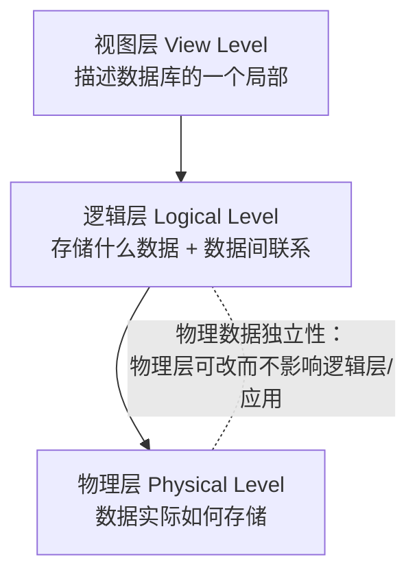

> [!quote] 本章定位
> 第 1 章是全书的绪论。它给出 **DBMS** 的定义与目标，解释“为什么需要数据库系统”（文件处理系统的六大弊端），并建立贯穿全书的四个视角：**数据抽象、数据模型、数据库语言、系统架构与事务**。后续每一章都围绕本章提出的某个概念展开（见文末[[#关键概念与后续章节|后续章节地图]]）。

> [!tip] 先修与关联
> - 先修概览：**信息系统与数据库** [[11-数据库]]（区分物理视图/逻辑视图、五种数据模型、批处理与实时处理）。
> - 本书导航入口：**[[MOC - 数据库系统概念]]**。

---

数据库管理系统（**DataBase-Management System, DBMS**）由一个互相关联的数据的集合和一组用以访问这些数据的程序组成。这个数据集合通常称作**数据库（database）**，其中包含了关于某个企业的信息。DBMS 的主要目标是要提供一种可以方便、高效地存取数据库信息的途径。

设计数据库系统的目的是管理大量信息。对数据的管理既涉及信息存储结构的定义，又涉及信息操作机制的提供。此外，数据库系统还必须提供所存储信息的安全性保证，即使在系统崩溃或有人企图越权访问时也应保障信息的安全性。如果数据将被多用户共享，那么系统还必须设法避免可能产生的异常结果。

> [!note] 全书主线
> 大多数组织中信息至关重要，因而计算机科学家开发了大量用于有效管理数据的概念和技术。这些概念和技术正是本书所关注的。本章简要介绍数据库系统的基本原理，并反复用“大学（university）”作为贯穿全书的示例场景。

## 1.1 数据库系统应用

最早的数据库系统出现在 20 世纪 60 年代，以响应商业数据计算机化管理的需求。与当今的数据库应用相比，这些早期应用相对简单。当今的应用系统包括非常复杂的全球化企业。

新的和老的的所有数据库应用都共享重要的公共元素。应用系统最主要的方向不是执行某些运算的程序，而是数据自身。当今某些最重要的公司之所以重要并不是因为它们的物理资产，而是由于它们所拥有的信息。想象某个银行没有了关于账户和客户的数据，或者某个社交网站丢失了用户之间的联系信息。在这种情况下，这些公司的价值几乎会全部丧失。

数据库系统用于管理如下的数据集合：
- 具有很高价值的数据集合；
- 相对庞大的数据集合；
- 常常同时被多个用户和应用系统访问的数据集合。

最早的数据库应用系统只拥有简单的、精确格式化的、结构化的数据。当今的数据库应用系统可能包括具有复杂联系和更加易变的结构的数据。作为具有结构化数据的应用系统的一个示例，我们考虑大学里关于课程、学生和课程注册的记录。大学保存关于每门课程的同类型的信息：课程标识、课程名、系、课程号等。还类似地保存每名学生的信息：学生标识、姓名、地址、电话等。课程注册是课程标识和学生标识的配对集合。这类信息具有标准的、重复的结构，是 20 世纪 60 年代具有代表性的数据库应用类型。这种简单的大学数据库应用与社交网站截然不同。社交网站的用户上传关于他们自己各种类型的信息，从姓名或出生日期这样的简单项到包含文本、图像、视频和到其他用户的链接的复杂信息。在这些数据中只有有限数量的公共结构。然而，这两种类型的应用共享数据库的基本特性。

当今的数据库系统充分利用数据结构中的公共特征以获取高效性，同时也允许弱结构化的数据和格式非常易变的数据。其结果是，数据库系统是一个大型的复杂的软件系统，它的任务是管理大型的复杂数据集合。

对复杂性进行管理很具挑战性，这种挑战不仅存在数据管理中，也存在于任何领域中。对复杂性进行管理的关键是**抽象（abstraction）**这个概念。抽象使得人们可以使用复杂的设备或系统，而不必了解该设备或系统是如何构造的。例如，一个人只要知道如何操作汽车的控制器，就可以驾驶汽车。但司机不必了解发动机是如何制造和如何运转的。司机只需要抽象地知道发动机是干什么的。类似地，对于大型的复杂的数据集合，数据库系统提供的信息的一个简单抽象的视图，于是用户和应用程序员不必了解数据的存储和组织方式的底层细节。通过提供高层的抽象，数据库系统使得一个企业可以把各种类型的数据组合到企业运行所需的统一的信息仓储中。

> [!example] 代表性应用领域
> - **企业信息**：销售（客户/产品/购买）、会计（付款/余额/资产）、人力资源（雇员/工资/所得税）。
> - **生产制造**：供应链管理、生产跟踪、库存清单、订单。
> - **银行和金融**：银行业（客户/账户/贷款/交易）、信用卡交易、金融业（股票债券持有与实时行情）。
> - **大学**：学生信息、课程注册、成绩。
> - **航空业**：订票与航班（最先以地理分布方式使用数据库的行业之一）。
> - **电信业**：通话/短信/数据记录、账单、预付卡余额、通信网络信息。
> - **基于 Web 的服务**：社交媒体、在线零售、在线广告。
> - **文档数据库**：文章/专利/研究论文集合。
> - **导航系统**：地址与公路/铁路/公交精确路线。

正如以上所列举的，数据库不仅成为每一个企业不可缺少的组成部分，而且也是个人日常活动的很大的组成部分。

随着时间的推移，人们与数据库交互的方式也在发生着变化。早期的数据库是作为办公室后台系统来维护的，用户通过打印的报告和作为输入的纸质表格来与它进行交互。随着数据库系统变得更加复杂，我们开发出了更好的语言供程序员与数据进行交互，并且开发出了使得企业中的最终用户可以对数据进行查询和更新的用户界面。

随着对程序员与数据库交互的接口的改进，以及计算机硬件性能的提升（尽管硬件价格在下降），出现了更复杂的应用系统，这些应用系统使得数据库中的数据能够更直接地与用户相关联，不仅与企业内部的最终用户而且与普通的公众相关联。以往，银行客户在做每一笔交易时都必须与出纳员打交道，而现在自动柜员机（ATM）可以与客户直接交互。当前，几乎每一个企业都使用 Web 应用系统或远程应用系统，使得它的客户可以直接与企业数据库交互，于是也就和企业自身进行了交互。

用户（或客户）可以专注于产品或服务，而不必了解使得这样的交互成为可能的大型数据库的细节。例如，当你阅读一个社交媒体的帖子，或访问一个网上书店并且浏览书籍或收藏音乐时，实际上你正在访问存储在某个数据库中的数据。当你在线输入订单时，你的订单实际上存到了某个数据库中。当你访问一个银行网站并且检索你的银行存款余额和交易信息时，这些信息是从银行的数据库系统中检索出来的。当你访问一个网站时，网站可能会将有关你的信息从某个数据库中检索出来，以选择应该向你推送什么广告。几乎每一个与智能手机的交互都会导致某种数据库访问。此外，关于你的 Web 访问的数据可能存放在一个数据库中。

因此，尽管用户界面隐藏了访问数据库的细节，而且大多数人甚至没有意识到他们正在跟数据库打交道，但实际上对数据库的访问构成了几乎每个人当今日常生活中的一个基本部分。

> [!abstract] 两种使用数据库的方式
> - **联机事务处理（online transaction processing, OLTP）**：大量用户使用数据库，每个用户检索相对少量的数据，进行小的更新。这是绝大多数用户的主要使用方式。
> - **数据分析（data analytics）**：审阅数据，得出结论，并推导出规则或决策程序，以用于驱动业务决策。

例如，银行需要决定是否贷款给一个申请者，在线广告商需要决定将哪一条广告显示给一个特定的用户。这些任务分两步处理。首先，数据分析技术尝试从数据中自动地发现规则和模式并创建**预测模型（predictive model）**。这些模型以个体的属性（“特征”）作为输入，以诸如归还贷款或点击广告的可能性作为输出，然后使用这些预测模型来做出业务决策。

再看另一个示例，生产商和零售商需要对生产什么产品或订购多大数量的物品做出决策；这些决策明显是由对过去数据做分析和对未来趋势做预测的技术来驱动的。错误的决策将导致昂贵的代价，因此组织机构愿意投入大量的金钱来收集或购买所需的数据，并构建可使用这些数据来做出准确预测的系统。

**数据挖掘（data mining）**领域将人工智能研究者和统计分析员所创造的知识发现技术与使之能被用于超大规模数据库的高效的实现技术结合起来。

## 1.2 数据库系统的目标

要理解数据库系统的目标，让我们考虑大学组织中的一个部分。在这个部分中，保存了关于所有教师、学生、系和开设课程的信息，以及一些其他数据。在计算机中保存这些信息的一种方法是将它们存放在操作系统文件中。为了使用户可以操作这些信息，系统中有对文件进行操作的若干应用程序，包括：
- 增加新的学生、教师和课程。
- 为课程注册学生，并产生班级花名册。
- 为学生填写成绩，计算绩点（GPA），产生成绩单。

这些应用程序是由系统程序员根据大学的需求编写的。

随着需求的增长，新的应用程序被加入系统中。例如，某大学决定创建一个新的专业。那么，这个大学就要建立一个新的系并创建新的永久性文件（或在现有文件中添加信息）来记录关于这个系中所有的教师、这个专业的所有学生、开设的课程、学位条件等信息。进而就有可能需要编写新的应用程序来处理这个新专业的特殊规则。也可能会需要编写新的应用程序来处理大学中的新规则。因此，随着时间的推移，越来越多的文件应用程序就会加入系统中。

这类典型的**文件处理系统（file-processing system）**是传统的操作系统所支持的。系统将永久记录存储在多个不同的文件中，需要有不同的应用程序来将记录从有关文件中取出或加入适当的文件中。

> [!failure] 文件处理系统的主要弊端
> - **数据的冗余和不一致性（data redundancy and inconsistency）**：不同文件结构不同、程序语言不同，相同信息可能在多处重复存储。冗余导致存储与访问开销增大，并可能引发**数据不一致性（data inconsistency）**——同一数据的不同副本不一致（如学生地址在音乐系记录中更新，却在别处未更新）。
> - **数据访问困难（difficulty in accessing data）**：传统文件环境不支持方便、高效地获取所需数据；未预见的查询需求往往只能手工抽取或临时编程。
> - **数据孤立（data isolation）**：数据分散在不同格式的文件里，编写新程序检索适当数据很困难。
> - **完整性问题（integrity problem）**：一致性约束（如“系账户余额永不为负”）分散在各程序中，新增或跨文件约束难以维护。
> - **原子性问题（atomicity problem）**：系统故障可能使“借/贷”只完成一半（如转账 500 美元只扣未存），破坏一致性；传统文件处理难以保证原子性。
> - **并发访问异常（concurrent-access anomaly）**：多用户并发更新可能相互干扰。如账户余额 10000 美元，两笔取款（500、100）并发读到旧值 10000 并各自写回 9500/9900，正确值应为 9400；又如课程注册计数并发读到 39 各写回 40，导致计数只 +1 且突破 40 人上限。
> - **安全性问题（security problem）**：并非每个用户都能访问所有数据，但即席加入的程序使安全性约束难以实现。

> [!success] 弊端 → 数据库系统的应对（本章 → 后续章节）
> | 文件处理系统的弊端 | 数据库系统提供的对应机制 |
> | --- | --- |
> | 冗余/不一致 | 集中式[[数据模型]]与[[数据库模式]]、[[数据库规范化]]（第 7 章） |
> | 访问困难 | 声明式[[数据操纵语言]]（[[SQL]]，第 3–5 章） |
> | 数据孤立 | 统一逻辑层[[数据库模式]] |
> | 完整性问题 | [[数据定义语言]] 约束：域约束、[[引用完整性]]、授权（第 3–4 章） |
> | 原子性问题 | [[事务]] 的[[ACID]]（第 17、19 章） |
> | 并发访问异常 | [[并发控制]]（第 18 章） |
> | 安全性问题 | [[数据定义语言]] 的授权（第 4 章） |

以上问题以及一些其他问题促使了 20 世纪 60 年代和 70 年代数据库系统的初始发展和基于文件的应用向基于数据库的应用的变迁。

接下来，我们将看一看数据库系统用以解决上述在文件处理系统中存在的问题的概念和算法。在本书的大部分篇幅中，我们在讨论典型的数据处理应用时总以大学作为实例。

## 1.3 数据视图

数据库系统是一些互相关联的数据以及一组使得用户可以访问和修改这些数据的程序的集合。数据库系统的一个主要目的是给用户提供数据的抽象视图，也就是说，系统隐藏关于数据存储和维护的某些细节。

### 1.3.1 数据模型

> [!definition] 数据模型（data model）
> 描述数据、数据联系、数据语义以及一致性约束的**概念工具的集合**。数据库结构的基础就是数据模型。

数据模型可被划归为四类：

- **关系模型（relational model）**：用表的集合表示数据和数据间的联系。每个表有多个列，每列有唯一的列名；表也称**关系**。它是基于记录的模型，当今使用最广泛。详见 [[关系模型]]（第 2、7 章）。
- **实体-联系模型（entity-relationship model, E-R）**：用称作**实体**的基本对象集合及其联系建模，广泛用于数据库设计。详见 [[实体-联系模型]]（第 6 章）。
- **半结构化数据模型（semi-structured data model）**：允许同类型数据项含有不同的属性集（与前述模型相反，后者要求同类型数据项属性集相同）。JSON 与 XML 常用于表示半结构化数据。详见 [[半结构化数据模型]]（第 8 章）。
- **基于对象的数据模型（object-based data model）**：面向对象编程催生，现已整合进关系数据库（封装、方法、对象标识等概念扩展到关系模型）。详见 [[对象数据模型]]（第 8 章）。

本书的大量篇幅集中在**关系模型**，因为它是大多数数据库应用系统的基础。

### 1.3.2 关系数据模型

在关系模型中，数据以表的形式表示。每个表有多个列，每列有唯一的名字。表的每一行表示一条信息。图 1-1 给出了一个关系数据库示例，它包括两个表：一个表展示了大学教师的详细信息，另一个表展示了大学里各个系的详细信息。

第一个表是 `instructor` 表，表示例如有一个 ID 为 22222 的名叫 Einstein 的教师是物理系的成员，他的年薪是 95 000 美元。第二个表是 `department` 表，表示例如生物系坐落在 Watson 大楼，它的经费预算为 90 000 美元。当然，现实世界的大学会有更多的系和教师。在本书中我们用小型的表来描述概念。相同模式的更大型的示例可以在线获得。

![[Pasted image 20260721173838.png|556]]
**图 1-1 一个关系数据库示例**

### 1.3.3 数据抽象

一个可用的系统必须能高效地检索数据。这种对高效性的需求促使数据库系统开发人员在数据库中使用复杂的数据结构来表示数据。由于许多数据库系统用户并未受过计算机专业训练，系统开发人员通过如下几个层次的**数据抽象（data abstraction）**来对用户屏蔽复杂性，以简化用户与系统的交互。

> [!info] 三层数据抽象
> - **物理层（physical level）**：最低层次的抽象，描述数据实际上是怎样存储的，详细到复杂的底层数据结构。
> - **逻辑层（logical level）**：比物理层稍高的抽象，描述数据库中存储什么数据以及这些数据间存在什么联系，用少量相对简单的结构描述整个数据库。逻辑层用户不必意识到物理层的复杂性。
> - **视图层（view level）**：最高层次的抽象，只描述整个数据库的某个部分，为只需访问一部分数据的用户简化交互；系统可为同一数据库提供多个视图。

三层抽象的关系如下图所示；其中**物理数据独立性（physical data independence）**指物理层可改动而不影响逻辑层与应用程序。



诸如关系模型这样的数据模型的一个重要特性是，它们不仅向数据库用户甚至向数据库应用程序开发人员隐藏了底层实现细节。数据库系统使得应用开发人员能够使用数据模型的抽象来存储和检索数据，并且将抽象操作转换为在底层实现上的操作。

通过与程序设计语言中数据类型的概念进行类比，我们可以弄清各层抽象间的区别。许多高级程序设计语言支持结构化类型的概念。我们可以抽象地描述一个记录类型如下：

```text
type instructor = record
    ID : char (5);
    name : char (20);
    dept_name : char (20);
    salary : numeric (8,2);
end;
```

以上代码定义了一个具有四个字段的新记录类型 `instructor`。每个字段有一个名字和与之相关联的类型。例如，`char(20)` 说明有一个包含 20 个字符的字符串，而 `numeric(8,2)` 说明有一个包含 8 个位数的数字，其中 2 个位数在小数点右边。对一个大学来说，可能包括几个这样的记录类型：
- `department`，包含字段 `dept_name`、`building` 和 `budget`。
- `course`，包含字段 `course_id`、`title`、`dept_name` 和 `credits`。
- `student`，包含字段 `ID`、`name`、`dept_name` 和 `tot_cred`。

在物理层，一个 `instructor`、`department` 或 `student` 记录可能被描述为包含连续的字节的块。编译器对程序设计人员屏蔽了这一层的细节。与此类似，数据库系统对数据库程序设计人员屏蔽了许多最底层的存储细节。而数据库管理员可能了解数据物理组织的某些细节。例如，有许多种将表存储到文件中的可能的方法。一种方法是，将表存储为文件中的一系列记录，用一个特殊的字符（例如逗号）来区分开记录中不同的属性，用另一个特殊的字符（例如换行符）来区分开不同的记录。如果所有的属性都是固定长度的，那么可以另外存储属性的长度，而文件中的区分符就可以不用了。可变长度属性可以用先存储长度、后面紧跟数据的办法来解决。数据库使用一种称作**索引**的数据结构来支持对记录的高效检索；这些也是物理层的构成成分。

在逻辑层，每个这样的记录通过类型定义进行描述，正如前面的代码段所示。在逻辑层上同时还要定义这些记录类型之间的相互关系；这样的相互关系的一个示例是，`instructor` 记录的 `dept_name` 值必须出现在 `department` 表中。程序设计人员正是在这个抽象层次上使用某种程序设计语言进行工作。与此类似，数据库管理员通常也是在这个抽象层次上工作。

![[Pasted image 20260721173911.png|364]]

最后，在视图层，计算机用户看见的是对其屏蔽了数据类型细节的一组应用程序。在视图层上定义了数据库的多个视图，数据库用户看到的是某些或所有视图。除了屏蔽数据库的逻辑层细节以外，视图还提供了防止用户访问数据库的某些部分的安全性机制。例如，大学注册办公室的职员只能看见数据库中关于学生的部分信息，而不能访问涉及教师工资的信息。

### 1.3.4 实例和模式

> [!definition] 实例（instance）与模式（schema）
> - **实例（instance）**：特定时刻存储在数据库中的信息的集合。
> - **模式（schema）**：数据库的总体设计。
>
> 类比：数据库模式对应程序中的变量声明（及类型定义）；变量在某一时刻的值对应模式的一个实例。

按不同的抽象层次划分，数据库系统有几种模式。**物理模式（physical schema）**在物理层描述数据库的设计，**逻辑模式（logical schema）**则在逻辑层描述数据库的设计。数据库在视图层也有几种模式，有时称为**子模式（subschema）**，它描述了数据库的不同视图。

在这些模式中，因为程序员使用逻辑模式来构造数据库应用程序，从其对应用程序的影响来看，逻辑模式是目前最重要的一种模式。物理模式隐藏在逻辑模式之下，并且通常可以在应用程序丝毫不受影响的情况下被轻易地更改。应用程序如果不依赖于物理模式，即使物理模式改变了它们也无需重写，它们就被称为具有**物理数据独立性**。

我们还注意到，有可能建立起有问题的模式，诸如包含不必要的冗余信息等。例如，假设我们将系的财务预算作为教师的一个属性来存储。于是，每当一个系（例如物理系）的财务预算值发生改变，该变化必须被反映到与该系相关联的所有教师的记录中。在第 7 章中，我们将研究如何区分好的模式设计和不好的模式设计。

传统上，逻辑模式即使有改变，也并不频繁。然而，许多较新的数据库应用需要更复杂的逻辑模式，例如，在单个关系中不同的记录可能具有不同的属性。

## 1.4 数据库语言

数据库系统提供**数据定义语言（Data-Definition Language，DDL）**来定义数据库模式，并提供**数据操纵语言（Data-Manipulation Language，DML）**来表达数据库的查询和更新。而实际上，数据定义和数据操纵语言并不是两种互相分离的语言，相反地，它们仅仅是构成了单一的数据库语言（例如 SQL 语言）的不同部分。几乎所有的关系数据库系统都使用 SQL 语言，我们将在第 3～5 章详细介绍 SQL 语言。

### 1.4.1 数据定义语言

数据库模式是通过一系列定义来说明的，这些定义由一种称作数据定义语言的特定语言来表达。DDL 也可用于定义数据的其他特征。

通过一系列特定的 DDL 语句来说明数据库系统所采用的存储结构和访问方式，这种特定的 DDL 称作**数据存储和定义（data storage and definition）语言**。这些语句定义了数据库模式的实现细节，而这些细节对用户来说通常是不可见的。

存储在数据库中的数据值必须满足某些一致性约束。例如，假设大学要求一个系的账户余额必须不能为负值。DDL 语言提供了指明这样的约束的工具。每当数据库被更新时，数据库系统都会检查这些约束。通常，约束可以是关于数据库的任意谓词。然而，如果要测试任意谓词，可能代价比较高。因此，数据库系统仅实现可以以最小代价测试的完整性约束。

> [!note] 常见完整性约束（由 DDL 声明）
> - **域约束（domain constraint）**：每个属性对应于一个可能的取值域（整数、字符、日期/时间等）。声明属性属于某域即约束其取值，是最基本的完整性约束。
> - **引用完整性（referential integrity）**：一个关系中给定属性集的取值必须也出现在另一关系的某一属性集中。例如 `course` 的 `dept_name` 必须出现在 `department` 的 `dept_name` 中。违反时通常拒绝该操作。
> - **授权（authorization）**：区分用户并对不同数据值允许不同访问类型——读（read）、插入（insert）、更新（update）、删除（delete）权限。

正如任何其他程序设计语言一样，对 DDL 语句的处理会产生一些输出。DDL 的输出放在**数据字典（data dictionary）**中，数据字典包含**元数据（metadata）**，元数据是关于数据的数据。可以把数据字典看作一种特殊的表，这种表只能由数据库系统本身（不是常规的用户）来访问和修改。在读取和修改实际的数据前，数据库系统先要参考数据字典。

### 1.4.2 SQL 数据定义语言

> [!warning] SQL 方言说明
> 以下为**标准 SQL** 示例（教材用例，未绑定特定 DBMS 版本与方言）；所用表结构见 [[#1.3.2 关系数据模型|1.3.2]] 图 1-1 的 `department` / `instructor`。实际 DBMS（如 Oracle、PostgreSQL、MySQL）在类型名与约束语法上存在方言差异，后续章节将注明。

SQL 提供了丰富的 DDL 语言，通过它，我们可以定义具有数据类型和完整性约束的表。例如，以下的 SQL DDL 语句定义了 `department` 表：

```sql
create table department
    (dept_name    char (20),
     building     char (15),
     budget       numeric (12,2));
```

上面的 DDL 语句执行的结果就是创建了 `department` 表，该表有 3 个列：`dept_name`、`building` 和 `budget`，每个列有一个与之相关联的数据类型。在第 3 章中我们将更详细地讨论数据类型。

SQL DDL 还支持若干种类型的完整性约束。例如，你可以指明 `dept_name` 属性是主码（primary key），以确保没有两个系会有相同的系名。另一个示例是，你可以指明在任何 `instructor` 记录中出现的 `dept_name` 属性值也必须在 `department` 表的某个记录中出现。我们将在第 3～4 章中讨论 SQL 对完整性约束和授权的支持。

### 1.4.3 数据操纵语言

> [!definition] 数据操纵语言（DML）
> 使得用户可以访问或操纵那些按照某种适当的数据模型组织起来的数据的语言。访问类型包括：检索、插入、删除、修改。

基本上有两种类型的数据操纵语言：
- **过程化的 DML（procedural DML）**：要求用户指定需要什么数据**以及如何获得**这些数据。
- **声明式的 DML（declarative DML）**（也称**非过程化的 DML**）：只要求用户指定需要什么数据，而不必指明如何获得这些数据。

声明式的 DML 通常比过程化的 DML 易学易用。但是，由于用户不必指明如何获得数据，因此数据库系统必须找出一种访问数据的高效途径。

**查询（query）**是要求对信息进行检索的语句。DML 中涉及信息检索的部分称作**查询语言（query language）**。实践中常把查询语言和数据操纵语言作为同义词使用，尽管从技术上来说这并不正确。

目前已有多个在使用的商业性的或者实验性的数据库查询语言。我们在第 3～5 章中将学习最广泛使用的查询语言 SQL。

我们在 1.3 节中讨论的抽象层次不仅可以用于定义或构造数据，而且还可以用于操纵数据。在物理层，我们必须定义可高效访问数据的算法；在更高的抽象层，我们则强调易用性，目标是使人们能够更有效地和系统交互。数据库系统的**查询处理器**部件（我们将在第 15 和 16 章学习）将 DML 的查询语句翻译成数据库系统物理层的动作序列。在第 22 章中我们将研究在越来越普遍的并发和分布式环境中的查询处理过程。

### 1.4.4 SQL 数据操纵语言

> [!warning] SQL 方言说明
> 以下示例为**标准 SQL** 查询（教材用例）。其执行结果基于 [[#1.3.2 关系数据模型|1.3.2]] 图 1-1 的示例数据，已在正文给出预期结果。

SQL 查询语言是非过程化的。一个查询以几个表作为输入（也可能只有一个表），总是仅返回一个表。下面是一个 SQL 查询的示例，它找出历史系的所有教师的名字：

```sql
select instructor.name
from instructor
where instructor.dept_name = 'History';
```

这个查询指定了要从 `instructor` 表中取回 `dept_name` 为 `History` 的那些行，并且这些行的 `name` 属性要显示出来。本查询的执行结果是一个表，它包含单个列 `name`，有若干行，每一行都是 `dept_name` 为 `History` 的一个教师的名字。如果这个查询运行在图 1-1 的表上，那么结果将包括两行，一行的名字是 El Said，另一行的名字是 Califieri。

查询可以涉及不止一个表的信息。例如，下面的查询将找出与经费预算超过 95 000 美元的系相关联的所有教师的 ID 和系名。

```sql
select instructor.ID, department.dept_name
from instructor, department
where instructor.dept_name = department.dept_name and
      department.budget > 95000;
```

如果上述查询运行在图 1-1 的表上，那么系统将会发现，有两个系的经费预算超过 95 000 美元——计算机科学系和金融系；这些系里有 5 位教师。于是，结果将由一个表组成，这个表有两列（`ID`, `dept_name`）和五行（12121, Finance）、（45565, Computer Science）、（10101, Computer Science）、（83821, Computer Science）、（76543, Finance）。

### 1.4.5 从应用程序访问数据库

像 SQL 这样的非过程化查询语言不像一个普适的图灵机那么强大：有一些计算可以用通用的程序设计语言来表达，但无法用 SQL 来表达。SQL 也不支持诸如从用户那儿输入、输出到显示器或在网络上通信这样的动作。这样的计算和动作必须用一种宿主（host）语言来写，比如 C/C++、Java 或 Python，在其中使用嵌入式的 SQL 查询来访问数据库中的数据。**应用程序（application program）**就是用来以这种方式与数据库进行交互的程序。在大学系统的示例中，就是那些使学生能够注册课程、产生课程花名册、计算学生的 GPA、产生工资支票以及完成其他任务的程序。

为了访问数据库，需要将 DML 语句从宿主发送到执行这些语句的数据库。最通用的办法是使用应用程序接口（过程集合），它可以用来将 DML 和 DDL 的语句发送给数据库，再取回结果。开放数据库连接（ODBC）标准定义了用于 C 语言和其他几种语言的应用程序接口。Java 数据库连接（JDBC）标准为 Java 语言提供了相应的接口。

## 1.5 数据库设计

数据库系统被设计用来管理大量的信息。这些大量的信息并不是孤立存在的，而是企业运行的一部分，企业的最终产品可以是从数据库中得到的信息，或者是某种设备或服务，数据库只是对它们起到支持的作用。

数据库设计的主要内容是数据库模式的设计。而设计一个满足被建模的企业的需求的完整的数据库应用环境，还要考虑更多的问题。这里我们着重讨论数据库查询的编写和数据库模式的设计，在后面第 9 章中将讨论应用设计。

高层的数据模型为数据库设计者提供了一个概念框架，来说明数据库用户的数据需求，以及将怎样构造数据库结构以满足这些需求。因此，数据库设计的初始阶段是全面刻画预期的数据库用户的数据需求。为了完成这个任务，数据库设计者必须和领域专家、数据库用户广泛地交流。这个阶段的成果是用户需求说明书文档。

下一步，设计者选择一个数据模型，并运用该选定的数据模型的概念，将那些需求转换成一个数据库的概念模式。在这个**概念设计（conceptual-design）**阶段开发出来的模式提供了企业的详细综述。设计者再复审这个模式，确保满足所有的数据需求并且需求之间没有冲突。在检查过程中设计者还可以去掉一些冗余的特性。这一阶段的重点是描述数据以及它们之间的联系，而不是指定物理的存储细节。

从关系模型的角度来看，概念设计阶段涉及决定数据库中应该包括哪些属性，以及如何组织这些属性到各个表中。前者基本上是业务上的决策，在本书中我们不进一步讨论。而后者主要是计算机科学的问题。解决这个问题的方法主要有两种：一种是使用实体-联系模型（见第 6 章），另一种是采用一套算法（统称为**规范化（normalization）**，它将所有属性集作为输入，生成一组关系表，见第 7 章）。

一个开发完全的概念模式还将指出企业的功能需求。在**功能需求说明（specification of functional requirement）**中，用户描述将在数据之上执行的各种操作（或事务）。操作的示例包括修改或更新数据、查找和取回特定的数据、删除数据等。在概念设计的这个阶段，设计者可以对模式进行复审，确保它满足功能需求。

现在，将抽象数据模型转换到数据库实现的过程进入最后两个设计阶段。在**逻辑设计阶段（logical-design phase）**，设计人员将高阶的概念模式映射到要使用的实现数据库系统的数据模型上。然后设计人员将得到的特定于系统的数据库模式用到后续的**物理设计阶段（physical-design phase）**中，在这个阶段中说明数据库的物理特性，这些特性包括文件组织的形式以及内部的存储结构，这些内容将在第 13 章中讨论。

## 1.6 数据库引擎

数据库系统被划分为多个模块，每个模块完成整个系统的一个功能。数据库系统的功能部件大致可分为**存储管理器**、**查询处理器（query processor）**部件和**事务管理**部件。

存储管理器很重要，因为数据库常常需要大量存储空间。企业数据库的大小通常达到数百个 gigabyte（千兆字节），甚至达到 terabyte（万亿字节）。一个 gigabyte 大约为 $10^9$ 字节，或 $1000$ 个（更准确地说，$1024$ 个）megabyte（兆字节），而一个 terabyte 大约为 $10^{12}$ 字节，或 $100$ 万个 megabyte（更准确地说，$1024$ 个 gigabyte）。最大的企业的数据库规模达到数个 petabyte（千万亿字节）（一个 petabyte 是 $10^{15}$ 字节）。由于计算机主存不可能存储这么多信息，又由于当发生系统崩溃时主存的内容会丢失，因此信息被存储在磁盘中。需要时可以在主存和磁盘间移动数据。由于相对于中央处理器的速度来说数据出入磁盘的速度很慢，因此数据库系统对数据的组织必须满足使磁盘和主存之间数据的移动需求最小化。现在固态硬盘（SSD）被越来越多地应用到数据库存储中。SSD 比传统的磁盘速度快得多，但价格也更加昂贵。

查询处理器也很重要，因为它帮助数据库系统简化和促进了对数据的访问。查询处理器使得数据库用户能够获得很高的性能，同时可以在视图的层次上工作，不必承受了解系统实现的物理层次细节的负担。数据库系统的任务，将在逻辑层上用非过程化语言编写的更新和查询转变成物理层的高效操作序列。

事务管理器同样很重要，因为它使得应用开发人员能够把一系列数据库存取操作当作一个单元来看待，这些存取操作要么全做，要么全都不做。这使得应用开发人员可以在一个更高的抽象层次上思考有关应用的问题，而不需要去考虑管理数据的并发存取和系统故障所造成的影响等底层细节。

传统上数据库引擎是集中式的计算机系统，而当今的并发处理是高效管理海量数据的关键所在。现代的数据库引擎非常注重并发数据存储和并发查询处理。

### 1.6.1 存储管理器

> [!info] 存储管理器（storage manager）
> 负责在数据库中存储的低层数据与应用程序以及向系统提交的查询之间提供接口的部件。它与文件管理器交互，将各种 DML 语句翻译为底层文件系统命令，负责数据的存储、检索和更新。

组成部件：
- **权限及完整性管理器（authorization and integrity manager）**：检测完整性约束，检查用户访问权限。
- **事务管理器（transaction manager）**：保证故障下数据库一致，并保证并发事务不冲突。
- **文件管理器（file manager）**：管理磁盘存储空间分配与磁盘上的数据结构。
- **缓冲区管理器（buffer manager）**：负责数据在磁盘与内存间的移动与缓冲，使数据库可处理比内存大得多的数据。

作为系统物理实现的一部分，存储管理器实现了以下数据结构：
- **数据文件（data file）**：存储数据库自身。
- **数据字典（data dictionary）**：存储关于数据库结构的元数据（特别是模式）。
- **索引（index）**：提供对数据项的快速访问，指向包含特定值的数据项的指针。

我们将在第 12～13 章中讨论存储介质、文件结构和缓冲区管理，在第 14 章中讨论高效访问数据的方法。

### 1.6.2 查询处理器

> [!info] 查询处理器（query processor）
> 简化并促进数据访问的部件，把逻辑层用非过程化语言编写的更新/查询转换为物理层的高效操作序列。

组成部件：
- **DDL 解释器（DDL interpreter）**：解释 DDL 语句并记录到数据字典。
- **DML 编译器（DML compiler）**：将 DML 语句翻译为查询执行引擎能理解的执行方案；并进行**查询优化（query optimization）**——从多个候选执行计划中选出代价最小的。
- **查询执行引擎（query evaluation engine）**：执行由 DML 编译器产生的低级指令。

第 15 章将介绍查询执行，第 16 章将讨论查询优化器从可能的执行策略中进行挑选的方法。

### 1.6.3 事务管理

> [!example] 转账事务（原子性 / 一致性 / 持久性）
> 账户 A 转出 500 美元到账户 B：必须保证两个操作要么都发生、要么都不发生（**原子性**）；A 与 B 余额之和保持不变（**一致性**）；即使系统故障，转账成功后的新值也应保持（**持久性**）。

> [!definition] 事务（transaction）与 ACID
> **事务**是数据库应用中完成单一逻辑功能的操作集合，是一个既具原子性又具一致性的单元。其四个性质（**ACID**）为：
> - **原子性（Atomicity）**：事务要么全部执行，要么根本不发生。
> - **一致性（Consistency）**：事务启动时一致，成功结束时也应一致（暂时不一致允许，但不能在故障中留下不一致状态）。
> - **隔离性（Isolation）**：并发事务的执行互不干扰（隔离级别与并发异常详见 [[并发控制]]，第 18 章）。
> - **持久性（Durability）**：事务成功结束后，其结果永久保持，即使发生故障。

适当地定义各个事务，使之能保持数据库的一致性，这是程序员的职责。例如，资金从账户 A 转到账户 B 这个事务有可能被定义为由两个单独的程序组成：一个对账户 A 执行取出操作，另一个对账户 B 执行存入操作。这两个程序的依次执行可以保持一致性。但是，这两个程序自身都不是把数据库从一个一致的状态转入一个新的状态，因此它们都不是事务。

原子性和持久性的保证是数据库系统自身的职责，确切地说，是**恢复管理器（recovery manager）**的职责。在没有故障发生的情况下，所有事务均成功完成，这时要保证原子性很容易。但是，由于各种各样的故障，事务并不总能成功执行完毕。为了保证原子性，失败的事务必须对数据库状态不产生任何影响。因此，数据库必须被恢复到该失败事务开始执行以前的状态。在这种情况下数据库系统必须进行**故障恢复（failure recovery）**，即它必须检测系统故障并将数据库恢复到故障发生以前的状态。

最后，当几个事务并发地对数据库进行更新时，即使每个单独的事务都是正确的，数据的一致性也可能被破坏。**并发控制管理器（concurrency-control manager）**控制并发事务间的相互影响，保证数据库的一致性。**事务管理器（transaction manager）**包括并发控制管理器和恢复管理器。

事务处理的基本概念将在第 17 章介绍，并发事务的管理将在第 18 章讨论，第 19 章将详细介绍故障恢复。

事务的概念已经被广泛应用在数据库系统和应用系统当中。虽然最初是在金融应用中使用事务，现在事务的概念已经被使用在电信业的实时应用中，以及长时间活动（诸如产品设计或行政业务工作流）的管理中。

## 1.7 数据库和应用体系结构

现在我们可以给出数据库系统各个部分以及它们之间联系的图。图 1-3 展示了一个运行在集中式服务器上的数据库系统的体系结构。这个图概述了不同类型的用户如何与数据库打交道，以及数据库引擎中的各个部分如何互相关联。

![[Pasted image 20260721173954.png|536]]
图 1-3：系统体系结构
*图中展示了用户层（初学者用户、应用程序员、老练用户、数据库管理员）通过应用界面、应用程序、查询工具、管理工具访问系统。数据通过查询处理器（DDL 解释器、DML 编译器、查询执行引擎）以及存储管理器（缓冲区管理器、文件管理器、权限和完整性管理器、事务管理器），最终落盘到磁盘存储（数据文件、数据字典、索引、统计数据）中。*

图 1-3 所示的集中式体系结构可以应用在共享内存的服务器体系结构中，该结构有多个 CPU 进行并行处理，但是所有的 CPU 都访问一个公共的共享内存。为扩展到更大的数据规模和更高的处理速度，研究人员设计了运行在包括多台机器的集群上的并行数据库（parallel database）。更进一步地，**分布式数据库（distributed database）**允许跨地域地对多台分离的机器进行数据存储和查询处理。

在第 20 章我们将讨论现代计算机系统的一般结构，重点讨论并行系统体系结构。第 21～22 章将描述如何充分运用并发和分布式处理来进行查询处理。第 23 章将描述在并发或分布式数据库中进行事务处理会遇到的种种问题，以及如何解决那些问题。问题包括如何存储数据，如何确保多个站点上执行的事务的原子性，如何执行并发控制，以及遇到故障时如何提供高可用性。

现在我们考虑使用数据库作为其后端的应用系统的体系结构。数据库应用系统通常可分为两个或三个部分，如图 1-4 所示。较早一代的数据库应用系统采用**两层体系结构（two-tier architecture）**，其中应用程序驻留在客户机上，通过查询语言语句来调用服务器上的数据库系统功能。

![[Pasted image 20260721174015.png]]
[图 1-4：两层和三层体系结构]

而当今的数据库应用系统采用**三层体系结构（three-tier architecture）**，客户机仅作为一个前端，它并不包含任何直接的数据库调用；Web 浏览器和移动应用是当今最普遍使用的应用客户端。前端与**应用服务器（application server）**进行通信。而应用服务器与数据库系统进行通信以访问数据。应用程序的**业务逻辑（business logic）**被嵌入应用服务器中，而不是分布在多个客户机上。与两层的应用系统相比，三层结构的应用提供了更好的安全性和更高的性能。

## 1.8 数据库用户和管理员

数据库系统的一个主要目标是从数据库中检索信息和往数据库中存储新信息。与数据库打交道的人员可分为数据库用户和数据库管理员。

### 1.8.1 数据库用户和用户界面

根据所期望的与系统交互的方式的不同，数据库系统的用户可以分为四种不同类型。系统为不同类型的用户设计了不同类型的用户界面。

- **初学者用户（naïve user）**：缺少经验的用户，使用事先定义好的用户界面（如 Web 或移动应用、表格界面）同系统交互，也可阅读数据库产生的报表。
  > [!example] 例如一名学生用 Web 界面选课：应用验证身份 → 提供表格 → 回送服务器 → 应用检索数据库确认名额 → 写入花名册。
- **应用程序员（application programmer）**：编写应用程序的计算机专业人员，有多种工具可选来开发界面。
- **老练用户（sophisticated user）**：不编写程序，而用查询语言或数据分析软件表达要求（如分析员提交查询研究数据）。
- **数据库管理员（DBA）**：见下。

### 1.8.2 数据库管理员

使用 DBMS 的一个主要原因是可以对数据和访问这些数据的程序进行集中控制。对系统进行集中控制的人称作**数据库管理员（DataBase Administrator，DBA）**。DBA 的作用包括以下方面。

- **模式定义（schema definition）**：通过 DDL 语句创建初始数据库模式。
- **存储结构及存取方法定义（storage structure and access-method definition）**：说明物理组织与索引创建参数。
- **模式及物理组织的修改（schema and physical-organization modification）**：随机构需求变化或性能需要修改。
- **数据访问授权（granting of authorization for data access）**：通过权限规定不同用户可访问的部分。
- **日常维护（routine maintenance）**：周期性备份到远程服务器；保证足够空闲磁盘空间；监视作业性能。

## 1.9 数据库系统的历史

从商业计算机的出现开始，信息处理就一直推动着计算机的发展。事实上，数据处理任务的自动化早于计算机的出现。早在 20 世纪初人们就用赫尔曼·霍勒瑞斯（Herman Hollerith）发明的穿孔卡片来记录美国的人口普查数据，并且用机械系统来处理这些卡片和列表显示结果。穿孔卡片后来被广泛用作将数据输入计算机的一种手段。

数据存储和处理技术发展的年表如下。

- **20 世纪 50 年代和 60 年代初**：磁带被开发用于数据存储。数据处理包括从一个/多个磁带读取、写到新磁带；数据也可由穿孔卡片输入。磁带（和卡片组）只能顺序读取，迫使数据按特定顺序处理。
- **20 世纪 60 年代末和 70 年代初**：硬盘广泛使用，允许直接访问数据，摆脱顺序访问限制；网状和层次数据模型被开发出来。Edgar Codd 在 1970 年撰写里程碑论文，定义关系模型与非过程化查询方法，关系型数据库由此诞生；Codd 后获 ACM 图灵奖。
- **20 世纪 70 年代末和 80 年代**：System R（IBM）证明可构造高效关系型系统，催生 SQL/DS；加州大学伯克利分校开发 Ingres；Oracle 首个版本发布。到 80 年代初，关系型数据库性能可竞争甚至取代网状/层次模型，自此独占鳌头。
- **20 世纪 90 年代**：决策支持与查询再度成为主要应用；并行数据库产品出现；厂商加入对象-关系支持。互联网爆发使数据库需支持高事务吞吐、$24\times7$ 可用性与 Web 接口。
- **21 世纪第一个十年**：半结构化数据（XML、JSON）重要性上升；空间数据支持增加；开源（PostgreSQL、MySQL）增长；社交网络催生图数据库；数据分析与数据挖掘普及，列存储兴起；MapReduce 架构出现；NoSQL 诞生（轻量数据管理，“not only SQL”，最终一致性）。
- **21 世纪第二个十年**：NoSQL 局限性（弱一致性、缺声明式查询）促使系统演化回支持更严一致性，同时保持高可伸缩性/可用性；企业外包存储与管理到云（DBaaS / SaaS），带来安全与数据所有权新问题。

> [!note] 历史要点
> 数据与数据分析对日常生活的巨大影响使其成为新闻常见内容；个人隐私权与社会知情权的权衡、各国隐私规章、频发的泄露事件，凸显数据安全与治理挑战。

## 1.10 总结

> [!summary] 第 1 章要点
> - **DBMS** = 互相关联的数据集合 + 一组访问程序；主要目标是方便、高效地检索与存储数据。
> - 数据库系统设计用于管理大量信息，并提供安全性与异常规避。
> - 主要目的是向用户**隐藏**存储与维护细节（数据抽象）。
> - **数据模型**是数据库结构的基础；最广泛使用的是**关系模型**，另有 E-R、半结构化、基于对象等模型。
> - **DML** 访问/操纵数据（今多用非过程化）；**DDL** 说明模式与特性。
> - 数据库设计主要是**模式设计**；E-R 模型与**规范化**是主要方法。
> - 系统由**存储管理器、查询处理器、事务管理**三大部件构成。
> - 体系结构可为集中式、并行或分布式；应用多为**三层**结构。
> - 有四类用户；**事务**保证即使故障下数据库也一致（ACID）。

## 关键概念与后续章节

> [!abstract] 本章提出的核心概念（中英文对照）
> | 中文 | 英文 | 本节 | 后续章节（链接） |
> | --- | --- | --- | --- |
> | 数据库管理系统 | DBMS | 引言 | — |
> | 数据模型 | data model | 1.3.1 | [[关系模型]]、[[实体-联系模型]]、[[半结构化数据模型]]、[[对象数据模型]] |
> | 数据抽象 | data abstraction | 1.3.3 | 物理/逻辑/视图层 |
> | 实例 / 模式 | instance / schema | 1.3.4 | [[数据库模式]]、[[数据库规范化]]（第 7 章） |
> | 数据定义语言 | DDL | 1.4.1 | [[数据定义语言]]、[[数据字典]]（第 3–4 章） |
> | 数据操纵语言 | DML | 1.4.3 | [[数据操纵语言]]、[[SQL]]（第 3–5 章） |
> | 事务 / ACID | transaction / ACID | 1.6.3 | [[事务]]、[[并发控制]]（第 17–18 章）、[[故障恢复]]（第 19 章） |
> | 查询优化 | query optimization | 1.6.2 | [[查询优化]]（第 16 章） |
> | 存储/查询/事务管理器 | storage/query/transaction manager | 1.6 | 第 12–14、15–16、17–19 章 |

> [!tip] 导航
> - 先修概览：[[11-数据库]]
> - 本书总入口：[[MOC - 数据库系统概念]]

## 延伸阅读
- 关系模型深入：[[关系模型]]（第 2、7 章，待补充）
- E-R 建模：[[实体-联系模型]]（第 6 章，待补充）
- SQL 语言：[[SQL]]（第 3–5 章，待补充）
- 事务与并发：[[事务]]、[[并发控制]]、[[故障恢复]]（第 17–19 章，待补充）
