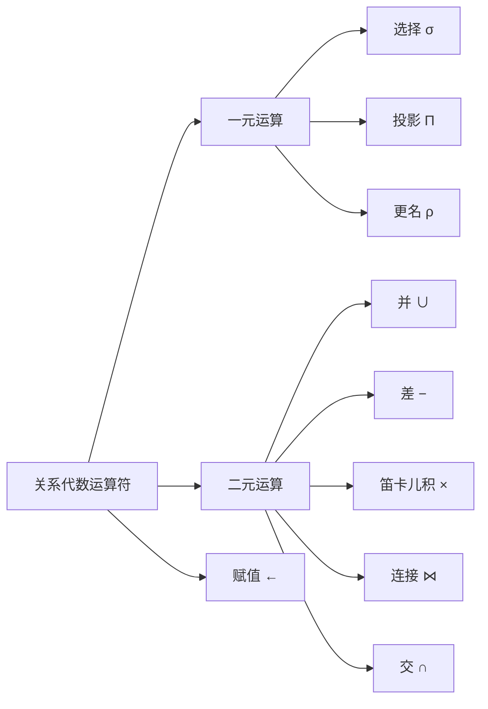

# 第 2 章 关系模型介绍

> [!info] 本节定位
> 关系模型是商用数据处理应用的主干数据模型，其胜出原因在于“以表的简易性简化程序员工作”。本章建立关系模型的基本词汇（关系 / 元组 / 属性 / 码 / 约束）与第一种形式化查询语言——**关系代数**，为后续 [[SQL]]（第 3–5 章）、[[实体-联系模型]]（第 6 章）、[[函数依赖与规范化]]（第 7 章）、[[查询优化]]（第 16 章）与 [[关系演算]]（第 27 章）奠定概念基础。

## 2.1 关系数据库的结构

关系数据库由**表（table）**的集合构成，每张表被赋予一个唯一的名称。例如，图 2-1 中的 `instructor` 表存储了有关教师的信息，含四个列标题：`ID`、`name`、`dept_name`、`salary`；图 2-2 的 `course` 表含 `course_id`、`title`、`dept_name`、`credits`；图 2-3 的 `prereq` 表含 `course_id` 与 `prereq_id`，每行表示“后一门课程以前一门为先修”。

**图 2-1 `instructor` 关系**
![[Pasted image 20260721181720.png|320]]

**图 2-2 `course` 关系**
![[Pasted image 20260721181728.png|476]]
![[Pasted image 20260721181743.png|194]]

> [!definition] 关系 / 元组 / 属性
> - **关系（relation）**：即“表”。表中的一行代表一组值之间的某种联系，表正是联系的集合，这与数学上“关系”的概念直接对应——也是关系数据模型名称的由来。
> - **元组（tuple）**：即“行”。数学上，元组是一组值的序列；$n$ 个值之间的联系用 $n$ 元组表示，对应表中的一行。
> - **属性（attribute）**：即“列”。例如 `instructor` 关系有四个属性：`ID`、`name`、`dept_name`、`salary`。
>
> 相关概念：[[关系]]、[[元组]]、[[属性]]。

由此，`instructor` 关系的一个**实例（instance）**有 12 个元组，对应 12 位教师。

> [!note] 关系实例
> **关系实例（relation instance）**指一个关系的特定状态，即包含的一组特定行。关系实例随时间（增删改）变化，而关系模式相对稳定。

![[Pasted image 20260721181808.png|352]]

> [!definition] 域与原子域
> - **域（domain）**：每个属性允许取值的集合，如 `salary` 的域是全部可能工资值，`name` 的域是全部可能教师姓名。
> - **原子（atomic）**：若域中元素被视为不可再分的单元，则该域是原子的。例如 `phone_number` 若存放“一组电话号码”则非原子；即便存放单个号码，若在使用时拆成国家/地区/本地编号，也按非原子对待。原子性取决于“如何在数据库中使用该域中的元素”，而非域本身。
>
> 相关概念：[[域]]、[[原子域]]。

> [!info] 空值
> **空值（null value）**表示“值未知或不存在”。它会在访问与更新时带来诸多困难，应尽量避免。本章先假设无空值，3.6 节再讨论空值对各运算的影响。

关系是元组的**集合（set）**，元组顺序无关紧要：图 2-1 按序与图 2-4 无序是同一个关系（元组集合相同）。为便于说明，通常按第一个属性的次序显示。

相对严格的关系结构在存储与处理上有重要实际优势，适用于定义明确且较静态的应用；但对“数据及其类型/结构都随时间变化”的场景较受限。结构化数据效率高，但预定义结构受限，现代企业需在二者间取得平衡。

## 2.2 数据库模式

> [!definition] 数据库模式 vs 数据库实例
> - **数据库模式（database schema）**：数据库的逻辑设计。
> - **数据库实例（database instance）**：给定时刻数据库中数据的一个快照。
>
> 类比程序设计语言：**关系** ≈ 变量，**关系模式** ≈ 类型定义；**关系实例** ≈ 变量的值。关系模式不常变化，关系实例随更新而变化。
>
> 相关概念：[[数据库模式]]、[[数据库实例]]、[[关系模式]]、[[关系实例]]。

一个关系模式由“属性列表 + 各属性对应的域”组成（属性的域的精确定义留待第 3 章 [[SQL]]）。同一名称（如 `instructor`）常同时指代模式与实例，含义清楚时直接简用。

![[Pasted image 20260721181816.png|270]]

请考虑 `department` 关系，其模式为：

`department(dept_name, building, budget)`

`dept_name` 同时出现在 `instructor` 与 `department` 模式中并非巧合——**在关系模式中使用公共属性，正是把不同关系的元组联系起来的方式**。例如查找在 Watson 教学楼工作的教师：先在 `department` 中找出位于 Watson 的系的 `dept_name`，再到 `instructor` 中匹配对应 `dept_name`。

> [!summary] 公共属性 = 关系间的连接键
> 关系模型不靠指针而靠“属性值相等”来关联不同关系；这正是后续 **连接（join）** 与外码（2.3 节）的物理基础。

大学课程可在不同学期、甚至一学期内多次授课，于是用 `section` 描述每次授课/课程段：

`section (course_id, sec_id, semester, year, building, room_number, time_slot_id)`

图 2-6 给出 `section` 的一个实例样本。再用 `teaches` 描述教师与所授课程段的联系：

`teaches (ID, course_id, sec_id, semester, year)`

**图 2-6 `section` 关系**
![[Pasted image 20260721181826.png|578]]

图 2-7 给出 `teaches` 的一个实例样本。

**图 2-7 `teaches` 关系**
![[Pasted image 20260721181833.png|371]]

除已列关系外，本书还使用下列关系：

- `student (ID, name, dept_name, tot_cred)`
- `advisor (s_id, i_id)`
- `takes (ID, course_id, sec_id, semester, year, grade)`
- `classroom (building, room_number, capacity)`
- `time_slot (time_slot_id, day, start_time, end_time)`

## 2.3 码

必须能区分给定关系中的不同元组——即任意两个元组不能在所有属性上取值完全相同。

> [!definition] 超码 / 候选码 / 主码
> - **超码（superkey）**：一个或多个属性的集合，其组合能在关系中唯一标识一个元组。例如 `instructor` 的 `ID` 是超码；`{ID, name}` 也是（超码的任意超集仍是超码）。
> - **候选码（candidate key）**：最小的超码，即“任意真子集都不是超码”的超码。例如 `{ID}` 与 `{name, dept_name}` 都可能是 `instructor` 的候选码；`{ID, name}` 不是候选码（因 `ID` 单独已是）。
> - **主码（primary key）**：被设计者选作区分元组主要方式的候选码。码是整个关系的性质（任意两个不同元组不允许同时在码属性上取相同值），代表现实世界的约束，亦称**主码约束（primary key constraint）**。
>
> 形式化：对关系 $r$ 的模式属性集 $R$，子集 $K$ 是超码 $\iff$ 对 $r$ 的任意可区分元组 $t_1 \neq t_2$，都有 $t_1.K \neq t_2.K$。
>
> 相关概念：[[超码]]、[[候选码]]、[[主码]]。

习惯上主码属性列于最前并加下划线，如 `department(dept_name, building, budget)`。`classroom (building, room_number, capacity)` 的主码为 `(building, room_number)`（二者都加了下划线以表示它们是主码的一部分）；`time_slot` 的主码为 `(time_slot_id, day, start_time)`（三者共同唯一标识一个时间片）。

> [!warning] 主码选择原则
> - 选“值从不或极少变化”的属性：人名可能重名，不宜作主码；地址可能会变，不宜纳入主码。
> - 跨国企业不能依赖某国的社会保障号，应产生自有唯一标识；企业合并时可能需重新分配标识以保证唯一性。

图 2-8 展示了示例大学模式的完整关系集合，主码属性以下划线标识。

![[Pasted image 20260721181851.png|546]]

**图 2-8 大学数据库的模式**

> [!definition] 外码约束 / 引用完整性约束
> - **外码约束（foreign-key constraint）**：从关系 $r_1$ 的属性（集）$A$ 到关系 $r_2$ 的主码 $B$，要求 $r_1$ 中每个元组在 $A$ 上的取值，也必须是 $r_2$ 中某个元组在 $B$ 上的取值。$A$ 称为**外码（foreign key）**；$r_1$ 是**引用关系（referencing relation）**，$r_2$ 是**被引用关系（referenced relation）**。
>   例如 `instructor.dept_name` 引用 `department.dept_name`；`section.(building, room_number)` 引用 `classroom`。
> - **引用完整性约束（referential integrity constraint）**：外码约束的泛化，放松“被引用属性必须是被引用关系主码”的要求。例如 `section.time_slot_id` 必须存在于 `time_slot.time_slot_id` 中，但 `time_slot_id` 只是 `time_slot` 主码的一部分，故只能以引用完整性约束（而非外码约束）表达。当今多数 DBMS 支持外码约束，但不支持“被引用属性非主码”的引用完整性约束。
>
> 相关概念：[[外码]]、[[引用完整性约束]]。

## 2.4 模式图

> [!definition] 模式图
> **模式图（schema diagram）**是带主码与外码约束的数据库模式的图形化表示：每个关系一个框，框顶灰色显示关系名、框内列出属性；主码属性加下划线；外码约束用“从引用关系外码属性指向被引用关系主码属性”的箭头表示；非外码的引用完整性约束用**双头箭头**表示（如图 2-9 中 `section.time_slot_id → time_slot.time_slot_id`）。
>
> 注意：模式图与第 6 章的**实体-联系图（E-R 图）**外观相似但本质不同，不可混淆。相关概念：[[模式图]]、[[实体-联系模型]]。

![[Pasted image 20260721181903.png]]
**图 2-9 大学数据库的模式图**

## 2.5 关系查询语言

**查询语言（query language）**用于从数据库请求信息，通常比通用程序设计语言层次更高，可分为：

> [!info] 查询语言的三种范式
> - **命令式（imperative）**：用户指示系统执行特定运算序列（常带状态变量）。
> - **函数式（functional）**：计算表示为对函数的求值，函数无副作用、不更新状态。
> - **声明式（declarative）**：用户只描述“要什么”，不指定“怎么做”，由系统决定获取方式（常以某种数学逻辑描述）。
>
> 相关概念：[[关系查询语言]]。

“纯”查询语言示例：

- **关系代数（relational algebra）**：函数式，见 2.6 节，是 [[SQL]] 的理论基础。
- **元组关系演算 / 域关系演算**：声明式，见第 27 章（可在线获取）。

这些语言简洁、形式化，缺商用“语法修饰”，却揭示了从数据库提取数据的基础技术。实践中（如 [[SQL]]）往往兼具命令式、函数式与声明式元素。

## 2.6 关系代数

> [!definition] 关系代数
> **关系代数（relational algebra）**由一组运算组成，接受一个或两个关系作为输入，生成一个新关系作为结果。只在一个关系上运算的称**一元（unary）**运算（选择、投影、更名）；在一对关系上运算的称**二元（binary）**运算（并、笛卡儿积、集差、交、连接）。赋值运算提供辅助表达。
>
> 相关概念：[[关系代数]]。

> [!note] 集合 vs 多重集合
> 关系是元组的**集合**，故关系代数结果不含重复元组。但实践中除非显式约束，DBMS 的表允许重复元组。第 3 章会把关系代数扩展到**多重集合（multiset，可含重复）**。

> [!note] 实现提示
> 关系代数构成 [[SQL]] 的理论基础，但 DBMS 通常不让你直接用关系代数写查询；书站 db-book.com 的“实验室材料”提供了供练习用的关系代数实现。

### 2.6.1 选择运算

> [!definition] 选择 σ
> **选择（select）**选出满足给定谓词的元组，记作小写 sigma：$\sigma_{\text{谓词}}(r)$。谓词支持下标比较 $=, \neq, <, \leq, >, \geq$，并用 $\wedge$（and）、$\vee$（or）、$\neg$（not）组合。
> 相关概念：[[选择运算]]。

选出物理系教师：

$$
\sigma_{dept\_name="Physics"}(instructor)
$$

选出薪水高于 90000 的教师：

$$
\sigma_{salary>90000}(instructor)
$$

物理系且薪水高于 90000：

$$
\sigma_{dept\_name="Physics" \wedge salary>90000}(instructor)
$$

属性间比较（查找系名与所在楼名相同的系）：

$$
\sigma_{dept\_name=building}(department)
$$

### 2.6.2 投影运算

> [!definition] 投影 Π
> **投影（project）**是一元运算，返回参数关系但滤掉特定属性，用大写 pi 表示：$\Pi_{L}(E)$，下标 $L$ 为希望保留的属性列表。因关系是集合，重复行被删除；泛化版本允许 $L$ 中出现涉及属性的表达式。
> 相关概念：[[投影运算]]。

列出教师 `ID`、`name`、`salary`：

$$
\Pi_{ID, name, salary}(instructor)
$$

**图 2-10 $\sigma_{dept\_name="Physics"}(instructor)$ 的结果**
![[Pasted image 20260721181916.png|406]]

**图 2-11 $\Pi_{ID, name, salary}(instructor)$ 的结果**
![[Pasted image 20260721181924.png|369]]

得到每位教师的月薪（泛化投影）：

$$
\Pi_{ID, name, salary/12}(instructor)
$$

### 2.6.3 关系运算的复合

关系运算的结果仍是关系，因此可**复合**为**关系代数表达式（relational-algebra expression）**，如同把 $+,-,*,/$ 复合成算术表达式。

> [!example] 查找物理系所有教师的姓名
> $$
> \Pi_{name}(\sigma_{dept\_name="Physics"}(instructor))
> $$
> 注意：投影的参数不是关系名，而是一个能求出关系的表达式。

### 2.6.4 笛卡儿积运算

> [!definition] 笛卡儿积 ×
> **笛卡儿积（Cartesian-product）**用叉号 $\times$ 表示：$r_1 \times r_2$。与数学定义略有不同——它把来自 $r_1$ 的元组 $t_1$ 与来自 $r_2$ 的元组 $t_2$ **拼接**成单个元组，而非生成元组对 $(t_1, t_2)$。
> 相关概念：[[笛卡儿积]]。

**图 2-12 笛卡儿积 $instructor \times teaches$**
![[Pasted image 20260721181955.png|602]]

为区分重名属性，将属性所属关系名前缀化：`instructor × teaches` 的模式写作

$$(instructor.ID, instructor.name, instructor.dept\_name, instructor.salary, teaches.ID, teaches.course\_id, teaches.sec\_id, teaches.semester, teaches.year)$$

仅出现在一种模式中的属性可省去前缀：

$$(instructor.ID, name, dept\_name, salary, teaches.ID, course\_id, sec\_id, semester, year)$$

该命名要求参与笛卡儿积的两个关系名不同（自连接或与表达式结果做积时需用 2.6.8 的更名解决）。若 `instructor` 有 $n_1$ 个元组、`teaches` 有 $n_2$ 个元组，则 $r$ 有 $n_1 \times n_2$ 个元组。一般地，对 $r_1(R_1)$ 与 $r_2(R_2)$，积的模式 $R$ 是二者模式拼接，元组由所有可能的 $(t_1, t_2)$ 组合而成。

### 2.6.5 连接运算

> [!definition] 连接 ⋈
> **连接（join）**把“选择”与“笛卡儿积”合并为单步运算：对关系 $r(R)$、$s(S)$ 与谓词 $\theta$（定义在 $R \cup S$ 属性上），
> $$r \bowtie_\theta s = \sigma_\theta (r \times s)$$
> 相关概念：[[连接运算]]。

查找教师及其所授课程的 `course_id`：笛卡儿积会把每位教师与每门课都配对，需加条件 $instructor.ID = teaches.ID$ 筛选：

$$
\sigma_{instructor.ID = teaches.ID}(instructor \times teaches)
$$

等价于

$$
instructor \bowtie_{instructor.ID=teaches.ID} teaches
$$

**图 2-13 $\sigma_{instructor.ID = teaches.ID}(instructor \times teaches)$ 的结果**
![[Pasted image 20260721182026.png|546]]

> [!example] 结果说明
> 不讲授任何课程的教师（Gold、Califieri、Singh）不会出现在结果中；且教师 ID 会重复出现，可用投影去掉 `teaches.ID` 列。

### 2.6.6 集合运算

查找“2017 秋、2018 春或两者都开设”的课程（信息在 `section`，见图 2-6）：

$$
\Pi_{course\_id}(\sigma_{semester="Fall" \wedge year=2017}(section)) \cup \Pi_{course\_id}(\sigma_{semester="Spring" \wedge year=2018}(section))
$$

> [!definition] 并 / 交 / 差
> - **并（union）** $\cup$：出现在任一输入中的元组。
> - **交（intersection）** $\cap$：同时出现在两个输入中的元组。
> - **集差（set-difference）** $-$：$r - s$ 含在 $r$ 中但不在 $s$ 中的元组。
>
> 三者都要求输入关系**相容（compatible）**：① 属性数量（元数 arity）相同；② 对应第 $i$ 个属性类型相同。例如 `instructor` 与 `section` 元数不同，并集无意义；`instructor` 与 `student` 虽都为 4 元，但第 4 属性 `salary` 与 `tot_cred` 类型不同，并集通常也无意义。

2017 秋或 2018 春开设（图 2-14，仅 8 个元组因 CS-101 重复只出现一次）：

$$
\Pi_{course\_id}(\sigma_{semester="Fall" \wedge year=2017}(section)) \cup \Pi_{course\_id}(\sigma_{semester="Spring" \wedge year=2018}(section))
$$

2017 秋且 2018 春都开设（图 2-15）：

$$
\Pi_{course\_id}(\sigma_{semester="Fall" \wedge year=2017}(section)) \cap \Pi_{course\_id}(\sigma_{semester="Spring" \wedge year=2018}(section))
$$

2017 秋开设但 2018 春未开设（图 2-16）：

$$
\Pi_{course\_id}(\sigma_{semester="Fall" \wedge year=2017}(section)) - \Pi_{course\_id}(\sigma_{semester="Spring" \wedge year=2018}(section))
$$

**图 2-14 在 2017 年秋季、2018 年春季或这两个学期都开设的课程**
![[Pasted image 20260721182043.png|264]]

**图 2-15 在 2017 年秋季与 2018 年春季学期都开设的课程**
![[Pasted image 20260721182050.png|289]]

**图 2-16 在 2017 年秋季开设但在 2018 年春季未开设的课程**
![[Pasted image 20260721182056.png|346]]

### 2.6.7 赋值运算

> [!definition] 赋值 ←
> **赋值（assignment）**用 $\leftarrow$，可把表达式的一部分存入临时关系变量，便于把复杂查询写成“一系列赋值 + 末行表达式结果”的顺序程序。赋值不向用户展示关系，也不修改永久关系（向永久关系赋值即修改数据库）。
> 相关概念：[[赋值运算]]。

查找 2017 秋与 2018 春都开设的课程：

$$
courses\_fall\_2017 \leftarrow \Pi_{course\_id}(\sigma_{semester="Fall" \wedge year=2017}(section))
$$
$$
courses\_spring\_2018 \leftarrow \Pi_{course\_id}(\sigma_{semester="Spring" \wedge year=2018}(section))
$$
$$
courses\_fall\_2017 \cap courses\_spring\_2018
$$

赋值未给关系代数增加新功能，仅提供便利表达。

### 2.6.8 更名运算

> [!definition] 更名 ρ
> **更名（rename）**用小写 rho $\rho$ 为表达式结果命名。两种形式：
> - $\rho_x(E)$：把 $E$ 的结果命名为 $x$。
> - $\rho_{x(A_1, A_2, ..., A_n)}(E)$：命名为 $x$ 并把属性依次重命名为 $A_1, ..., A_n$（用于为“属性上的表达式”的结果命名）。
>
> 自连接等需对同一关系多次引用时，用不同名称区分。位置标记（\$1, \$2, …）也能隐式命名，但因易忘而不采用。相关概念：[[更名运算]]。

> [!example] 查找比 ID 为 12121 的教师（Wu）挣得多的教师的 ID 与姓名
> 需两次引用 `instructor`：一次扫描候选教师（命名 $i$），一次取 Wu 的工资（命名 $w$ 并筛选 $w.ID=12121$）：
> $$
> \Pi_{i.ID, i.name}(\sigma_{i.salary > w.salary}(\rho_i(instructor) \times \sigma_{w.ID = 12121}(\rho_w(instructor))))
> $$

> [!note] 注释 2-1 其他关系运算
> - **聚集运算**：在返回值集上做函数计算（avg/sum/min/max），并可先分组（如各部门平均工资）。详见 3.7 节（注释 3-2）及 [[聚集运算]]。
> - **自然连接（natural join）**：以“两关系模式共有属性上取值相等”为隐式谓词取代 $\bowtie_\theta$ 的 $\theta$；写法便利，但关系模式变更后重用查询有风险。见 4.1.1 节及 [[自然连接]]。
> - **外连接（outer join）**：为连接中缺失侧补空值以保留元组（如未授课教师）。见 4.1.3 节（注释 4-1）及 [[外连接]]。

### 2.6.9 等价查询

> [!summary] 等价查询
> 同一查询可用不同关系代数表达式表达，且在同一数据库上结果相同，即**等价（equivalent）**。例：查找物理系教师所授课程信息，下面两条等价（区别仅在“先选物理系”还是“先连接后选物理系”）：
> $$
> \sigma_{dept\_name="Physics"}(instructor \bowtie_{instructor.ID = teaches.ID} teaches)
> $$
> $$
> (\sigma_{dept\_name="Physics"}(instructor)) \bowtie_{instructor.ID = teaches.ID} teaches
> $$
> 查询优化器据此寻找高效等价表达式（第 16 章 [[查询优化]]）。

## 2.7 总结

> [!summary] 本章要点
> - 关系数据模型建立在**表**的集合上；用户可查询、插入、删除、更新元组，并用多种语言表达以下操作。
> - **关系模式**是逻辑设计，**关系实例**是特定时刻内容；二者之分类比**数据库模式 / 数据库实例**之分。
> - **超码**唯一标识元组；**候选码**是最小超码；被选作主码者即**主码**（主码约束）。
> - **外码约束**：从 $r_1$ 的属性 $A$ 到 $r_2$ 的主码 $B$，$r_1$ 在 $A$ 上的取值必出现在 $r_2$ 的 $B$ 上；$r_1$ 为引用关系，$r_2$ 为被引用关系。**引用完整性约束**是其泛化。
> - **模式图**图形化展示关系、属性及主码/外码约束。
> - **关系查询语言**定义作用于表、输出表的运算，可组合成表达式。
> - **关系代数**提供一组输入/输出均为关系的运算，是 [[SQL]] 等实际语言的基础，并定义了关系查询语言使用的基本运算。

---

## 术语表

| 术语           | 英文                                    | 所在节         | 说明             |
| ------------ | ------------------------------------- | ----------- | -------------- |
| 关系           | relation                              | 2.1         | 即“表”，是联系的集合    |
| 元组           | tuple                                 | 2.1         | 即“行”，一组值的序列    |
| 属性           | attribute                             | 2.1         | 即“列”           |
| 域            | domain                                | 2.1         | 属性允许取值的集合      |
| 原子域          | atomic domain                         | 2.1         | 元素不可再分的域       |
| 关系模式 / 实例    | relation schema / instance            | 2.1–2.2     | 逻辑设计 / 特定状态    |
| 超码           | superkey                              | 2.3         | 能唯一标识元组的属性集    |
| 候选码          | candidate key                         | 2.3         | 最小超码           |
| 主码           | primary key                           | 2.3         | 被选作主要标识的候选码    |
| 外码           | foreign key                           | 2.3         | 引用其他关系主码的属性集   |
| 引用完整性约束      | referential integrity constraint      | 2.3         | 外码约束的泛化        |
| 模式图          | schema diagram                        | 2.4         | 带主码/外码的模式图形化表示 |
| 关系代数         | relational algebra                    | 2.6         | 以关系为输入输出的运算集合  |
| 选择 / 投影 / 连接 | select / project / join               | 2.6.1–2.6.5 | 核心一元/二元运算符     |
| 并 / 交 / 差    | union / intersection / set-difference | 2.6.6       | 集合运算符（需相容）     |
| 笛卡儿积         | Cartesian product                     | 2.6.4       | 两关系元组的拼接       |
| 赋值 / 更名      | assignment / rename                   | 2.6.7–2.6.8 | 辅助表达运算符        |

## 相关概念（延伸阅读）

- 先修：[[11-数据库]]、[[MOC - 数据库系统概念]]
- 关系语言：[[SQL]]（第 3–5 章）、[[关系演算]]（第 27 章）
- 数据建模：[[实体-联系模型]]（第 6 章）、[[函数依赖与规范化]]（第 7 章）
- 查询处理：[[查询优化]]（第 16 章）
- 运算符深化：[[聚集运算]]、[[自然连接]]、[[外连接]]
