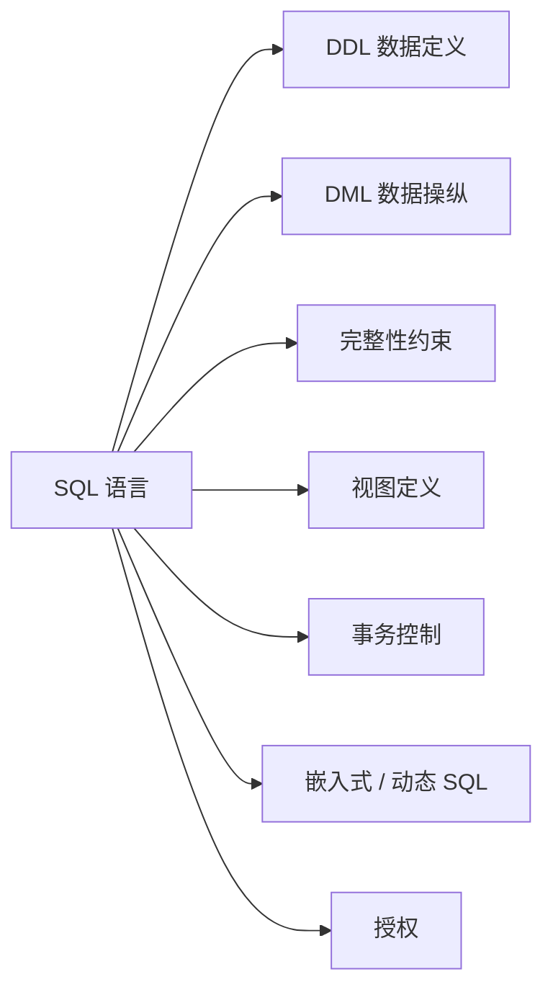
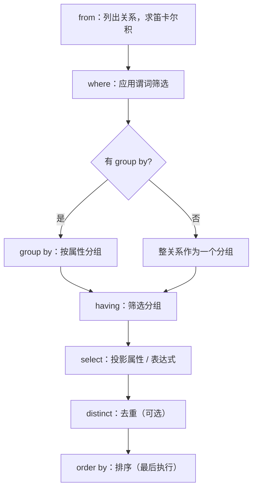

# 第 3 章 SQL 介绍

> [!info] 本章定位
> 本章与第 4～5 章系统介绍使用最广泛的数据库查询语言 **SQL**。SQL 不止于“查询”——它还定义数据结构、修改数据、定义安全性约束。本章给出 SQL 基本 **DML**（查询 / 增删改）与 **DDL**（模式定义 / 约束）特性；这些特性自 SQL-92 起即为标准。各 DBMS 实现在细节上可能有差异，建议在实际数据库上练习（见原书章末工具部分）。
>
> 相关概念：[[关系模型]]、[[关系代数]]、[[SQL]]。

> [!cite] 配图说明
> 本节内嵌图 3-1（SQL DDL 代码清单）至图 3-16（各查询/分组结果），均取自原书，用于直观展示示例大学数据库的 SQL 定义与查询结果。

## 3.1 SQL 查询语言概览

SQL 最早由 IBM 在 20 世纪 70 年代早期作为 System R 项目的一部分开发，初名 Sequel，后定名 SQL（Structured Query Language，结构化查询语言）。1986 年 ANSI/ISO 发布 SQL-86 标准，后续有 SQL-89、SQL-92、SQL:1999、SQL:2003、SQL:2006、SQL:2008、SQL:2011，最新为 SQL:2016。

> [!definition] SQL 语言的组成部分
> - **数据定义语言（DDL）**：定义关系模式、删除关系、修改关系模式。
> - **数据操纵语言（DML）**：从数据库查询、插入、删除、修改元组。
> - **完整性（integrity）**：DDL 中定义完整性约束，破坏约束的更新被拒绝。
> - **视图定义（view definition）**：DDL 中定义视图。
> - **事务控制（transaction control）**：定义事务的开始与结束。
> - **嵌入式 SQL / 动态 SQL**：定义 SQL 如何嵌入 C、C++、Java 等通用语言。
> - **授权（authorization）**：定义对关系与视图的访问权限。
>
> 相关概念：[[数据定义语言]]、[[数据操纵语言]]、[[视图]]、[[事务]]、[[授权]]。



本章概述 SQL 的基本 DML 与 DDL；自 SQL-92 起即为标准。第 5 章介绍更高级特性：从编程语言访问 SQL 的机制、SQL 函数与过程、触发器、递归查询、高级聚集、数据分析特性等。多数实现支持这些标准特性，但也存在差异、支持非标准特性或不支持较新特性——若某特性在你的系统中不生效，请查阅其用户手册。

## 3.2 SQL 数据定义

数据库中的关系集合用 **DDL** 定义。SQL DDL 不仅能定义关系集合，还能定义每个关系的：模式、属性取值类型、完整性约束、维护的索引、安全性与权限信息、磁盘物理存储结构。本节只讨论基本模式定义与基本类型，其余延后到第 4、5 章。

### 3.2.1 基本类型

> [!definition] SQL 标准固有类型
> - `char(n)`：固定长度字符串（全称 `character`），长度 $n$。
> - `varchar(n)`：可变长度字符串，最大长度 $n$（全称 `character varying`）。
> - `int`：整数（全称 `integer`）。
> - `smallint`：小整数。
> - `numeric(p,d)`：定点数，$p$ 位数字（含符号位），小数点后 $d$ 位；如 `numeric(3,1)` 可精确存 44.5，不能精确存 444.5 或 0.32。
> - `real`、`double precision`：浮点 / 双精度浮点数（精度依赖机器）。
> - `float(n)`：精度至少 $n$ 位的浮点数。
>
> 更多类型见 4.5 节。相关概念：[[SQL数据类型]]。

每种类型都可包含特殊值 **null**（缺失或不存在的值），某些情况下应禁止空值。

`char` 存固定长度字符串：属性 $A$ 为 `char(10)`，存入 `"Avi"` 会补 7 个空格至 10 字符；而 `varchar(10)` 存 `"Avi"` 不补空格。

> [!warning] char 与 varchar 比较陷阱
> 比较 `char` 与 `varchar` 时，是否先给 `varchar` 补空格使长度一致取决于具体 DBMS——即使都存 `"Avi"`，`A = B` 也可能返回假。**建议始终用 `varchar` 而非 `char`**。
> SQL 还提供 `nvarchar` 存放 Unicode 多语言数据；但很多 DBMS 也允许 `varchar` 以 UTF-8 存放 Unicode。

### 3.2.2 基本模式定义

用 `create table` 定义 SQL 关系。例如创建 `department`：

```sql
create table department
    (dept_name    varchar(20),
     building     varchar(15),
     budget       numeric(12,2),
     primary key (dept_name));
```

> [!example] create table 语义
> 上例 `department` 有 3 个属性：`dept_name` 最长 20 的字符串，`building` 最长 15 的字符串，`budget` 为共 12 位数字、小数点后 2 位；并声明 `dept_name` 为主码。末尾分号在多数实现中可选。

通用形式：

```sql
create table r
    (A1 D1,
     A2 D2,
     ...,
     An Dn,
     <完整性约束1>,
     ...,
     <完整性约束j>);
```

$r$ 为关系名，$A_i$ 为属性名，$D_i$ 指定类型及可选约束（限制允许取值）。

> [!definition] 常用完整性约束
> - `primary key (A_j1, ..., A_jm)`：声明主码；主码属性必须非空且唯一（无两元组在主码上全同）。虽可选，但为每个关系指定主码通常是好实践。
> - `foreign key (A_k1, ..., A_kn) references s`：外码；本关系元组在这些属性上的取值必须对应 $s$ 中某元组的主码取值。
> - `not null`：该属性不允许空值。
>
> 相关概念：[[主码]]、[[外码]]、[[完整性约束]]。

图 3-1 给出大学数据库部分 SQL DDL。`course` 表声明 `foreign key(dept_name) references department`，保证每门课的系名存在于 `department` 主码中；否则可能出现不存在的系名。`section`、`instructor`、`teaches` 也带外码约束。注意：含 MySQL 在内的一些系统需用 `foreign key (dept_name) references department(dept_name)`（显式列出被引用属性）。`instructor.name` 上的 `not null` 保证教师姓名不为空。外码等更多细节见 4.4 节。

**图 3-1 大学数据库的部分 SQL 数据定义**

```sql
create table department
  (dept_name    varchar(20),
   building     varchar(15),
   budget       numeric(12,2),
   primary key (dept_name));

create table course
  (course_id    varchar(7),
   title        varchar(50),
   dept_name    varchar(20),
   credits      numeric(2,0),
   primary key (course_id),
   foreign key (dept_name) references department);

create table instructor
  (ID           varchar(5),
   name         varchar(20) not null,
   dept_name    varchar(20),
   salary       numeric(8,2),
   primary key (ID),
   foreign key (dept_name) references department);

create table section
  (course_id    varchar(8),
   sec_id       varchar(8),
   semester     varchar(6),
   year         numeric(4,0),
   building     varchar(15),
   room_number  varchar(7),
   time_slot_id varchar(4),
   primary key (course_id, sec_id, semester, year),
   foreign key (course_id) references course);

create table teaches
  (ID           varchar(5),
   course_id    varchar(8),
   sec_id       varchar(8),
   semester     varchar(6),
   year         numeric(4,0),
   primary key (ID, course_id, sec_id, semester, year),
   foreign key (course_id, sec_id, semester, year) references section,
   foreign key (ID) references instructor);
```

SQL 禁止破坏完整性约束的更新：新元组主码为空或与既有元组主码全同，或 `course` 的 `dept_name` 不在 `department` 中，都会被拒绝。

> [!note] 删除与修改关系
> - `drop table r;`：删除关系 $r$ 的所有信息与模式（更强）。
> - `delete from r;`：保留关系 $r$，但删除其所有元组。
> - `alter table r add A D;`：为已有关系增加属性，新属性在所有元组上取 `null`。
> - `alter table r drop A;`：去掉属性（很多系统不支持去属性，但支持去整表）。
>
> 新关系初建为空；插入/更新/删除元组用 `insert`/`update`/`delete`（3.9 节）。相关概念：[[insert语句]]、[[delete语句]]、[[update语句]]。

## 3.3 SQL 查询的基本结构

SQL 查询由 `select`、`from`、`where` 三个子句构成：以 `from` 中的关系为输入，在其上做 `where` 与 `select` 指定的运算，产生一个关系作为结果。



### 3.3.1 单关系查询

“找出所有教师的姓名”：

```sql
select name
from instructor;
```

结果关系含单个属性 `name`。若 `instructor` 如图 2-1，结果如图 3-2。

“找出所有教师所在的系名”：

```sql
select dept_name
from instructor;
```

![[Pasted image 20260721185429.png]]
**图 3-2 `select name from instructor` 的结果**

![[Pasted image 20260721185437.png]]
**图 3-3 `select dept_name from instructor` 的结果**

一个系可有多位教师，故 `dept_name` 可能重复出现（图 3-3）。形式化关系模型要求关系为集合、无重复；但实践中去重开销大，SQL 允许关系与表达式结果含重复。

> [!note] distinct 与 all
> - `select distinct dept_name from instructor;`：强行去重，每系名最多一次。
> - `select all dept_name from instructor;`：显式保留重复（默认即保留，故示例常省略 `all`）。
> - 为保证示例结果去重，必要处统一使用 `distinct`。

`select` 子句可带含 $+,-,*,/$ 的算术表达式（操作数为常量或属性）：

```sql
select ID, name, dept_name, salary * 1.1
from instructor;
```

返回 `instructor` 的副本，仅 `salary` 为原值 1.1 倍（不修改原关系）。SQL 还提供 `date` 等特殊类型及相应算术函数（4.5.1 节）。

`where` 子句只选出满足谓词的元组，例如“找出 Comp. Sci. 系工资超 70000 的教师姓名”：

```sql
select name
from instructor
where dept_name = 'Comp. Sci.' and salary > 70000;
```

![[Pasted image 20260721185449.png]]
**图 3-4 `select name from instructor where dept_name = 'Comp. Sci.' and salary > 70000` 的结果**

`where` 支持 `and`/`or`/`not` 与比较符 $<, <=, >, >=, =, <>$，可用于字符串、算术表达式、日期等。

### 3.3.2 多关系查询

“找出所有教师的姓名，及其所在系名与系所在楼名”：需从 `instructor`（取 `dept_name`、`name`）与 `department`（取 `building`）按 `dept_name` 匹配。

```sql
select name, instructor.dept_name, building
from instructor, department
where instructor.dept_name = department.dept_name;
```

![[Pasted image 20260721185500.png]]

若 `instructor`、`department` 分别如图 2-1、图 2-5，则结果如图 3-5。`dept_name` 在两关系均出现，须加关系名前缀；`name`、`building` 只出现于一处，可省略前缀。此命名要求 `from` 中关系名不同（自连接等问题用 3.4.1 更名解决）。

**图 3-5 “教师姓名 + 系名 + 楼名”查询结果**

典型 SQL 查询形式：

```sql
select A1, A2, ..., An
from r1, r2, ..., rm
where P;
```

子句须按 `select`→`from`→`where` 书写，但理解运算时按 `from`→`where`→`select` 顺序更易：先求 `from` 中关系的笛卡儿积，再施 `where` 谓词，最后投影 `select` 属性。

`from` 的笛卡儿积可理解为迭代过程：对 $r_1$ 每个元组 $t_1$、…、$r_m$ 每个元组 $t_m$，拼接成单个元组加入结果。结果含所有关系的所有属性（重名属性加关系名前缀）。例如 `instructor × teaches` 模式：

$$
(\text{instructor.ID}, \text{instructor.name}, \text{instructor.dept\_name}, \text{instructor.salary}, \text{teaches.ID}, \text{teaches.course\_id}, \text{teaches.sec\_id}, \text{teaches.semester}, \text{teaches.year})
$$

单关系出现的属性可省前缀，简写为 $(\text{instructor.ID}, \text{name}, \text{dept\_name}, \text{salary}, \text{teaches.ID}, \text{course\_id}, \text{sec\_id}, \text{semester}, \text{year})$。

![[Pasted image 20260721185530.png]]
**图 3-6 `instructor` 与 `teaches` 的笛卡儿积**

笛卡儿积会把互不相关的元组也组合（如图 2-1、图 2-7 之积，图 3-6 仅示部分），常无意义且庞大。应改用 `where` 谓词限定有意义的组合，例如“教师姓名 + 课程 ID”：

```sql
select name, course_id
from instructor, teaches
where instructor.ID = teaches.ID;
```

![[Pasted image 20260721185550.png]]
**图 3-7 `instructor ⋈ teaches`（按 ID 连接）的结果**

只输出讲授了课程的教师；未授课的 Gold、Califieri、Singh 不出现（要保留可用 4.1.3 的 **外连接**，相关概念：[[外连接]]）。加谓词可限定 Comp. Sci. 系：

```sql
select name, course_id
from instructor, teaches
where instructor.ID = teaches.ID and instructor.dept_name = 'Comp. Sci.';
```

SQL 查询含义：① `from` 求笛卡儿积；② 施 `where` 谓词；③ 投影 `select` 属性。此顺序助于理解“结果应是什么”，并非“如何执行”——实际实现会优化，只产生满足 `where` 的组合（第 15～16 章）。遗漏 `where` 会输出整个笛卡儿积（如 12×13=156，现实规模下可达 200×600=120000 元组）。

> [!note] 注释 3-1 SQL 与多重集合关系代数（一）
> SQL 与关系代数的关键区别：SQL **允许重复**。建模此行为用**多重集合关系代数（multiset relational algebra）**：选择保留拷贝数、投影按拷贝数复制、笛卡儿的拷贝数相乘。例：$r_1=\{(1,a),(2,a)\}$、$r_2=\{(2),(3),(3)\}$，则 $\Pi_B(r_1)=\{(a),(a)\}$，$\Pi_B(r_1)\times r_2=\{(a,2),(a,2),(a,3),(a,3),(a,3),(a,3)\}$。
>
> 基本 SQL 查询等价于多重集合关系代数：
> $$\Pi_{A_1,\dots,A_n}(\sigma_P(r_1 \times r_2 \times \dots \times r_m))$$
> 注意：关系代数的**选择**对应 SQL 的 `where`（而非 `select`）——这是历史遗留差异。SQL 查询的关系代数表示有助于形式化其含义，DBMS 也常将其转为关系代数表示以做查询优化与评估。相关概念：[[关系代数]]、[[多重集合]]。

## 3.4 附加的基本运算

### 3.4.1 更名运算

> [!definition] as 更名 / 相关名称
> 用 `old_name as new_name` 重命名结果属性（可出现在 `select` 或 `from`）。重命名关系的典型用途：① 用短名替代长名；② 自比较时区分同一关系的不同拷贝。
> 重命名后的标识 $T$、$S$ 称**相关名称（correlation name）**，也称表别名、相关变量、元组变量。
> 相关概念：[[更名运算]]、[[相关变量]]。

例：把 `name` 改名为 `instructor_name`：

```sql
select name as instructor_name, course_id
from instructor, teaches
where instructor.ID = teaches.ID;
```

用短名：

```sql
select T.name, S.course_id
from instructor as T, teaches as S
where T.ID = S.ID;
```

自比较“找出工资至少高于某位 Biology 系教师的教师姓名”：

```sql
select distinct T.name
from instructor as T, instructor as S
where T.salary > S.salary and S.dept_name = 'Biology';
```

（更好的表述是“高于 Biology 系最低工资”，见 3.8.2。）

### 3.4.2 字符串运算

SQL 用一对单引号标示字符串（如 `'Computer'`）；字符串内含单引号用两个单引号表示（`'It''s right'`）。

> [!definition] 字符串比较与模式匹配
> - 标准 SQL 字符串相等**大小写敏感**（`'comp. sci.' = 'Comp. Sci.'` 为假），但 MySQL、SQL Server 等默认不区分——该默认可改。
> - 字符串函数：`||` 连接、`substring`、`length`、`upper(s)`、`lower(s)`、`trim(s)` 等（各系统函数集不同）。
> - `like` 模式匹配：`%` 匹配任意子串，`_` 匹配任意单字符；模式大小写敏感。
> - `escape` 定义转义字符（如 `like 'ab\%cd%' escape '\'` 匹配以 `ab%cd` 开头者）。
> - `not like` 搜索不匹配项。PostgreSQL 等提供 `similar to`（类 UNIX 正则）。
> 相关概念：[[like运算符]]、[[转义字符]]。

例：找出楼名含 `'Watson'` 的系：

```sql
select dept_name
from department
where building like '%Watson%';
```

模式示例：`'Intro%'` 匹配以 Intro 开头；`'%Comp%'` 匹配含 Comp 者；`'___'` 匹配恰 3 字符；`'___%'` 匹配至少 3 字符。

### 3.4.3 `select` 子句中的属性说明

星号 `*` 表示“所有属性”。`instructor.*` 选 `instructor` 全部属性；`select *` 选 `from` 结果关系的全部属性。

```sql
select instructor.*
from instructor, teaches
where instructor.ID = teaches.ID;
```

### 3.4.4 排列元组的显示次序

> [!definition] order by
> `order by` 控制结果显示次序。默认升序；`desc` 降序、`asc` 升序；可多属性排序。
> 相关概念：[[order by]]。

```sql
select name
from instructor
where dept_name = 'Physics'
order by name;
```

```sql
select *
from instructor
order by salary desc, name asc;
```

### 3.4.5 `where` 子句谓词

`between` 表示“介于两值之间”：

```sql
select name
from instructor
where salary between 90000 and 100000;
```

等价于 `where salary <= 100000 and salary >= 90000`；另有 `not between`。

> [!definition] 行构造器与元组比较
> `(v1, v2, ..., vn)` 为**行构造器（row constructor）**，按字典序比较。例如 `(a1,a2) <= (b1,b2)` 当 $a_1\le b_1$ 且 $a_2\le b_2$。
> 相关概念：[[行构造器]]。

故查询：

```sql
select name, course_id
from instructor, teaches
where instructor.ID = teaches.ID and dept_name = 'Biology';
```

可重写为：

```sql
select name, course_id
from instructor, teaches
where (instructor.ID, dept_name) = (teaches.ID, 'Biology');
```

## 3.5 集合运算

> [!definition] 集合运算
> SQL 的 `union` / `intersect` / `except` 对应数学 $\cup$ / $\cap$ / $-$。**默认自动去重**；加 `all`（`union all` 等）保留重复。
> 相关概念：[[集合运算]]、[[union]]、[[intersect]]、[[except]]。

2017 秋开课集合：

```sql
select course_id
from section
where semester = 'Fall' and year = 2017;
```

2018 春开课集合：

```sql
select course_id
from section
where semester = 'Spring' and year = 2018;
```

![[Pasted image 20260721185605.png]]
**图 3-8 $c_1$：2017 年秋季开设的课程**

![[Pasted image 20260721185610.png]]
**图 3-9 $c_2$：2018 年春季开设的课程**

（注：$c_2$ 含两个 `course_id = CS-319` 元组，因其 2018 春开两个课程段。）

### 3.5.1 并运算

2017 秋或 2018 春开课的所有课程：

```sql
(select course_id
 from section
 where semester = 'Fall' and year = 2017)
union
(select course_id
 from section
 where semester = 'Spring' and year = 2018);
```

`union` 自动去重——CS-319（2018 春两段）、CS-101（两学期各一段）在结果中都只一次（图 3-10）。`union all` 保留全部重复（如 CS-319、CS-101 各出现两次；ECE-101 若秋 4 段、春 2 段，则结果 6 个）。

![[Pasted image 20260721185657.png]]
**图 3-10 $c_1 \cup c_2$ 的结果**

### 3.5.2 交运算

2017 秋与 2018 春都开课的课程：

```sql
(select course_id
 from section
 where semester = 'Fall' and year = 2017)
intersect
(select course_id
 from section
 where semester = 'Spring' and year = 2018);
```

![[Pasted image 20260721185706.png]]
**图 3-11 $c_1 \cap c_2$ 的结果（仅 CS-101）**

`intersect` 自动去重；`intersect all` 保留重复数取两集合的较小值（ECE-101 秋 4 段、春 2 段 → 结果 2 个）。

### 3.5.3 差运算

2017 秋开但 2018 春未开的课程：

```sql
(select course_id
 from section
 where semester = 'Fall' and year = 2017)
except
(select course_id
 from section
 where semester = 'Spring' and year = 2018);
```

![[Pasted image 20260721185732.png]]
**图 3-12 $c_1 \text{ except } c_2$ 的结果**

`except` 从其第一输入中输出不出现于第二输入者，执行前自动去重（ECE-101 秋 4 段、春 2 段 → 结果无拷贝）；`except all` 保留重复数为“第一输入数 − 第二输入数”（若为正），否则无拷贝。

## 3.6 空值

> [!definition] 空值的三值逻辑
> - 算术：任一输入为空，结果即为空（如 $r.A + 5$ 中 $r.A$ 为空则整体为空）。
> - 比较：涉及空值的比较结果为 `unknown`（第三逻辑值，既非 `true` 也非 `false`）。例如 $1 < null$ 为 `unknown`，且 $not(1<null)$ 亦为 `unknown`。
> - 布尔运算扩展：`true and unknown = unknown`、`false and unknown = false`、`unknown and unknown = unknown`；`true or unknown = true`、`false or unknown = unknown`；`not unknown = unknown`。
> - `where` 谓词为 `false` 或 `unknown` 的元组不进入结果。
> 相关概念：[[空值]]、[[三值逻辑]]。

测试空值用 `is null` / `is not null`：

```sql
select name
from instructor
where salary is null;
```

也可用 `is unknown` / `is not unknown` 测试比较结果是否为 `unknown`：

```sql
select name
from instructor
where salary > 10000 is unknown;
```

`select distinct` 去重时，两属性“都非空且相等”或“都为空”即视为相同——故 `('A',null)` 的两份拷贝被视为相同，仅保留一份（与谓词中 `null = null` 返回 `unknown` 不同）。并、交、差运算也按此方式处理空值。

## 3.7 聚集函数

> [!definition] 聚集函数
> 以值集（集合/多重集合）为输入、返回单值的函数。SQL 标准五函数：**avg** 平均、**min** 最小、**max** 最大、**sum** 总和、**count** 计数。`sum`/`avg` 输入须数字集；其余可用于非数字（如字符串）。
> 相关概念：[[聚集函数]]、[[聚集运算]]。

### 3.7.1 基本聚集

“找出 Comp. Sci. 系教师平均工资”：

```sql
select avg (salary)
from instructor
where dept_name = 'Comp. Sci.';
```

结果关系含单属性单元组。可加 `as` 取有意义名称：

```sql
select avg (salary) as avg_salary
from instructor
where dept_name = 'Comp. Sci.';
```

图 2-1 中 Comp. Sci. 工资 75000、65000、92000，平均 $(232000)/3 = 77333.33$。

> [!warning] 待核实：去重导致错误平均的示例
> 原文称“若增加第四位工资 75000 的教师，去除重复会得到错误答案 $(232000 + 4)/4 = 58000$，而正确答案为 76750”。此处 $(232000 + 4)/4$ 与示例数字不自洽（正确平均应为 $(232000+75000)/4 = 76750$），“+4”疑为转录错误；且“去除重复”本应得 $232000/3 = 77333.33$ 而非 58000。请核对原书（第 6 版第 3 章）确认正确表述，勿据此计算。

计算聚集前如需先去重，用 `distinct`：

```sql
select count (distinct ID)
from teaches
where semester = 'Spring' and year = 2018;
```

`count(*)` 计算元组数（不允许 `distinct`）；`max`/`min` 用 `distinct` 合法但无差别；`all` 为默认可省略。

### 3.7.2 分组聚集

> [!definition] group by
> 用 `group by` 把元组按指定属性分组，再在每组上聚集。`group by` 中取值相同的元组同组。
> 相关概念：[[group by]]。

“找出每个系的平均工资”：

```sql
select dept_name, avg (salary) as avg_salary
from instructor
group by dept_name;
```

![[Pasted image 20260721185748.png]]
**图 3-13 `instructor` 按 `dept_name` 分组**

![[Pasted image 20260721185802.png]]
**图 3-14 查询“每个系平均工资”的结果**

省略 `group by` 则整个关系作为一个分组（“找出所有教师平均工资”）。

“找出每个系 2018 春授课教师人数”：

```sql
select dept_name, count (distinct instructor.ID) as instr_count
from instructor, teaches
where instructor.ID = teaches.ID and
      semester = 'Spring' and year = 2018
group by dept_name;
```

![[Pasted image 20260721185815.png]]
**图 3-15 每个系 2018 春授课教师人数**

> [!warning] select 中的属性必须出现在 group by 中
> 出现在 `select` 但未聚集的属性，必须出现在 `group by` 中，否则查询错误。例如下例错误（`ID` 未聚集也未在 `group by`）：
> ```sql
> /* 错误查询 */
> select dept_name, ID, avg (salary)
> from instructor
> group by dept_name;
> ```
> 注释可用 `/* ... */` 或 `-- 错误查询`。

### 3.7.3 `having` 子句

> [!definition] having
> 对**分组**限定条件（而非对元组），如“平均工资超 42000 的系”。`having` 在形成分组后应用，故其中可使用聚集函数；出现在 `having` 但未聚集的属性必须出现在 `group by` 中。
> 相关概念：[[having子句]]。

```sql
select dept_name, avg (salary) as avg_salary
from instructor
group by dept_name
having avg (salary) > 42000;
```

![[Pasted image 20260721185828.png]]
**图 3-16 平均工资超 42000 的系**

含聚集/`group by`/`having` 的查询含义：① 算 `from`；② 施 `where`；③ 按 `group by` 分组（无则整体一组）；④ 施 `having` 筛分组；⑤ `select` 对每组聚合成结果元组。

`having` 与 `where` 同用示例（2017 年每课程段，若选课≥2 人，求该段学生 `tot_cred` 平均）：

```sql
select course_id, semester, year, sec_id, avg (tot_cred)
from student, takes
where student.ID = takes.ID and year = 2017
group by course_id, semester, year, sec_id
having count (ID) >= 2;
```

### 3.7.4 对空值和布尔值的聚集

空值给聚集带来麻烦。例：`sum(salary)` 中部分 `salary` 为空——标准规定 `sum` 忽略输入中的 `null`（总和本身不为 `null`）。

原则：**除 `count(*)` 外，所有聚集函数忽略输入中的空值**；空集 `count` 为 0，其他聚集作用于空集返回 `null`。SQL:1999 引入布尔类型（`true`/`false`/`unknown`），`some`/`every` 对其做析取/合取。

> [!note] 注释 3-2 SQL 与多重集合关系代数（二）
> 并/交/差可如 3.5 的 `union all`/`intersect all`/`except all` 扩展到多重集合；`union`/`intersect`/`except` 对应集合版 $\cup$/$\cap$/$-$。
> 扩展聚集运算 $\gamma$（亦记 $\mathcal{G}$）允许在属性上聚集： $_{dept\_name}\gamma_{average(salary)}(instructor)$ 按 `dept_name` 分组求平均；省略左下标则整体一组。聚集值无名，用更名 $\rho$ 命名：
> $$_{dept\_name}\gamma_{average(salary) \text{ as } avg\_salary}(instructor)$$
> 复杂查询亦可改写，如：
> $$
> \begin{aligned}
> t1 &\leftarrow \sigma_{P}(r_1 \times r_2 \times \dots \times r_m) \\
> \Pi_{A_1, A_2, SumA3}(\sigma_{countA4 > 2}(_{A_1, A_2}\gamma_{sum(A_3) \text{ as } SumA_3, count(A_4) \text{ as } countA_4}(t1)))
> \end{aligned}
> $$
> `from` 的连接可用等价关系代数连接表达；但 `where`/`select` 中的子查询无直接等价运算（扩展 $\sigma$、$\Pi$ 可调用子查询）。

## 3.8 嵌套子查询

> [!definition] 嵌套子查询
> 子查询是嵌套于另一查询中的 `select-from-where` 表达式，常用于集合成员资格、集合比较、集合基数测试。`where` 中嵌套（3.8.1–3.8.4）、`from` 中嵌套（3.8.5）、`with` 定义临时关系（3.8.6）、标量子查询（3.8.7）。`where`/`select` 中的子查询不能直接改写为关系代数。
> 相关概念：[[子查询]]、[[标量子查询]]。

### 3.8.1 集合成员资格

`in` 测试成员资格，`not in` 测试缺失。

“2017 秋与 2018 春都开课的课程”（用 `in` 替代交运算）：

```sql
select distinct course_id
from section
where semester = 'Fall' and year = 2017 and
      course_id in (select course_id
                    from section
                    where semester = 'Spring' and year = 2018);
```

（需 `distinct`，因 `intersect` 默认去重。）`not in` 版：

```sql
select distinct course_id
from section
where semester = 'Fall' and year = 2017 and
      course_id not in (select course_id
                        from section
                        where semester = 'Spring' and year = 2018);
```

`in`/`not in` 亦可用于枚举集合：

```sql
select distinct name
from instructor
where name not in ('Mozart', 'Einstein');
```

还可对多属性关系测试成员资格：

```sql
select count (distinct ID)
from takes
where (course_id, sec_id, semester, year) in (select course_id, sec_id, semester, year
                                              from teaches
                                              where teaches.ID = '10101');
```

（部分实现不支持上述行构造语法，见 3.8.3 替代写法。）

### 3.8.2 集合比较

“工资至少高于某位 Biology 系教师”用 `> some`：

```sql
select name
from instructor
where salary > some (select salary
                     from instructor
                     where dept_name = 'Biology');
```

`= some` 等价于 `in`，但 `<> some` 不等价于 `not in`。

“工资高于 Biology 系每位教师”用 `> all`：

```sql
select name
from instructor
where salary > all (select salary
                    from instructor
                    where dept_name = 'Biology');
```

`<> all` 等价于 `not in`，但 `= all` 不等价于 `in`。

“平均工资最高的系”：

```sql
select dept_name
from instructor
group by dept_name
having avg (salary) >= all (select avg (salary)
                            from instructor
                            group by dept_name);
```

### 3.8.3 空关系测试

`exists` 在子查询结果非空时为真。相关名称（如外层 $S$）可用于子查询，称**相关子查询（correlated subquery）**。

“2017 秋与 2018 春都开课的课程”（用 `exists`）：

```sql
select course_id
from section as S
where semester = 'Fall' and year = 2017 and
      exists (select *
              from section as T
              where semester = 'Spring' and year = 2018 and
                    S.course_id = T.course_id);
```

作用域规则：子查询中可用其自身或任意包含它的查询中定义的相关名称；局部定义优先。

`not exists` 测试为空。`not exists (B except A)` 可模拟“关系 $A$ 包含关系 $B$”。例“选修了 Biology 系开设所有课程的学生”：

```sql
select S.ID, S.name
from student as S
where not exists ((select course_id
                   from course
                   where dept_name = 'Biology')
                  except
                  (select T.course_id
                   from takes as T
                   where S.ID = T.ID));
```

3.8.1 中“选修 10101 教师所授课程段的学生总数”可用 `exists` 替代行构造语法：

```sql
select count (distinct ID)
from takes
where exists (select course_id, sec_id, semester, year
              from teaches
              where teaches.ID = '10101'
                    and takes.course_id = teaches.course_id
                    and takes.sec_id = teaches.sec_id
                    and takes.semester = teaches.semester
                    and takes.year = teaches.year);
```

### 3.8.4 重复元组存在性测试

`unique` 在子查询无重复元组时为真。“2017 年最多开一次的课程”：

```sql
select T.course_id
from course as T
where unique (select R.course_id
              from section as R
              where T.course_id = R.course_id and
                    R.year = 2017);
```

若某课 2017 年未开，子查询为空，`unique` 在空集上为 true。等价写法：

```sql
select T.course_id
from course as T
where 1 >= (select count(R.course_id)
            from section as R
            where T.course_id = R.course_id and
                  R.year = 2017);
```

`not unique` 测试存在重复。“2017 年至少开两次的课程”：

```sql
select T.course_id
from course as T
where not unique (select R.course_id
                  from section as R
                  where T.course_id = R.course_id and
                        R.year = 2017);
```

形式化：`unique` 为假当且仅当存在两元组 $t_1=t_2$ 且相等；若某属性为空则 $t_1=t_2$ 为假，即便有副本 `unique` 也可能为真。

### 3.8.5 `from` 子句中的子查询

`select-from-where` 返回关系，可嵌入另一查询 `from` 中。`from` 子查询中可用 `as` 命名并更名属性。

“系平均工资超 42000 的系”（不用 `having`，改用 `from` 子查询）：

```sql
select dept_name, avg_salary
from (select dept_name, avg (salary) as avg_salary
      from instructor
      group by dept_name)
      where avg_salary > 42000;
```

更显式命名：

```sql
select dept_name, avg_salary
from (select dept_name, avg (salary)
      from instructor
      group by dept_name)
      as dept_avg (dept_name, avg_salary)
      where avg_salary > 42000;
```

多数（非全部）实现支持 `from` 子查询；MySQL/PostgreSQL 要求子查询结果关系必须命名，Oracle 不支持属性更名（可在子查询 `select` 中更名）。

“所有系中教师工资总额最大的系”（`having` 无力，用 `from` 子查询）：

```sql
select max (tot_salary)
from (select dept_name, sum(salary)
      from instructor
      group by dept_name) as dept_total (dept_name, tot_salary);
```

`from` 子查询中不能使用同 `from` 子句其他关系的相关变量；SQL:2003 起允许用 `lateral` 前缀访问其前面表/子查询的属性，如“每位教师姓名、工资及其系平均工资”：

```sql
select name, salary, avg_salary
from instructor I1, lateral (select avg(salary) as avg_salary
                             from instructor I2
                             where I2.dept_name = I1.dept_name);
```

### 3.8.6 `with` 子句

`with` 定义仅对当前查询有效的临时关系。例“预算最大的系”：

```sql
with max_budget (value) as
     (select max(budget)
      from department)
select budget
from department, max_budget
where department.budget = max_budget.value;
```

`with` 于 SQL:1999 引入，多数（非全部）系统支持，使逻辑更清晰且可在多处复用。例“工资总额大于所有系平均工资总额的系”：

```sql
with dept_total (dept_name, value) as
     (select dept_name, sum(salary)
      from instructor
      group by dept_name),
     dept_total_avg (value) as
     (select avg(value)
      from dept_total)
select dept_name
from dept_total, dept_total_avg
where dept_total.value > dept_total_avg.value;
```

### 3.8.7 标量子查询

> [!definition] 标量子查询
> 子查询只返回单属性单元组时，可出现在“期望单值”的任何位置（称**标量子查询**）。如列出各系及其教师数：
> 相关概念：[[标量子查询]]。

```sql
select dept_name,
       (select count(*)
        from instructor
        where department.dept_name = instructor.dept_name)
        as num_instructors
from department;
```

（子查询用无 `group by` 的 `count(*)` 保证单值，并使用了外层 `department.dept_name` 相关变量。）标量子查询可出现在 `select`/`where`/`having` 中；编译时未必能判断结果是否多元组，若执行后多于一个元组则运行时报错。技术上其结果仍是关系（单元组），使用时 SQL 隐式取出该单值。

### 3.8.8 不带 `from` 子句的标量

某些计算无需引用关系。“平均每位教师所授课程段数”：

```sql
(select count (*) from teaches) / (select count (*) from instructor);
```

部分系统因缺 `from` 报错，可用预定义虚拟关系 `dual`（如 Oracle）改写：

```sql
select (select count (*) from teaches) / (select count (*) from instructor)
from dual;
```

整数除法会损失精度，可在除前乘 1.0 转浮点。

> [!note] 注释 3-3 SQL 与多重集合关系代数（三）
> 子查询无直接关系代数等价，但多数可重写为不用子查询的形式。两种扩展运算很有用：**半连接（semijoin）** $\ltimes$ 与**反连接（antijoin）** $\bar{\ltimes}$（有时用 $\ltimes$ 表示反连接）。$r \ltimes_{r.A = s.B} s$ 输出 $r$ 中在 $s$ 至少有匹配元组的元组；$r \bar{\ltimes}_{r.A = s.B} s$ 输出 $r$ 中在 $s$ 无匹配元组的元组——可重写 `exists`/`not exists` 子查询。二者不增加表达能力，但实现高效。实践中 DBMS 通过允许 $\sigma$、$\Pi$ 调用子查询来扩展关系代数。

## 3.9 数据库的修改

### 3.9.1 删除

> [!definition] delete
> `delete from r where P;` 删除 $r$ 中使 $P$ 为真的整元组（不能只删部分属性）。省略 `where` 删全部元组（关系变空但仍存在）。一条 `delete` 只作用于一个关系；`where` 中可嵌套引用任意关系的子查询。
> 相关概念：[[delete语句]]。

```sql
delete from instructor
where dept_name = 'Finance';
```

```sql
delete from instructor
where salary between 13000 and 15000;
```

```sql
delete from instructor
where dept_name in (select dept_name
                    from department
                    where building = 'Watson');
```

“删除工资低于大学平均的教师”：

```sql
delete from instructor
where salary < (select avg (salary)
                from instructor);
```

**务必先测试所有元组再删除**——若边删边测，平均工资会变，结果依赖处理顺序。

### 3.9.2 插入

> [!definition] insert
> 指定元组或查询结果插入。属性值须在域内、数量正确；未给属性取 `null`。`bulk loader` 工具可从文本文件高速批量插入。
> 相关概念：[[insert语句]]。

```sql
insert into course
    values ('CS-437', 'Database Systems', 'Comp. Sci.', 4);
```

可显式指定属性（顺序无关）：

```sql
insert into course (course_id, title, dept_name, credits)
    values ('CS-437', 'Database Systems', 'Comp. Sci.', 4);

insert into course (title, course_id, credits, dept_name)
    values ('Database Systems', 'CS-437', 4, 'Comp. Sci.');
```

批量插入（Music 系修满 144 学时的学生成为教师，工资 18000）：

```sql
insert into instructor
    select ID, name, dept_name, 18000
    from student
    where dept_name = 'Music' and tot_cred > 144;
```

**先执行完 `select` 再插入**——否则 `insert into student select * from student`（无主码约束时）会无限复制。部分属性给 `null`：

```sql
insert into student
    values ('3003', 'Green', 'Finance', null);
```

### 3.9.3 更新

> [!definition] update / case
> `update r set ... where P;` 修改满足条件的元组属性（可含嵌套 `select`，可引用待更新关系；同样先测试全部再更新）。`case` 可在单条语句中按条件分支更新，避免多条 `update` 的顺序依赖。
> 相关概念：[[update语句]]、[[case表达式]]。

年度涨薪 5%：

```sql
update instructor
set salary = salary * 1.05;
```

仅给低于 70000 者涨：

```sql
update instructor
set salary = salary * 1.05
where salary < 70000;
```

给低于平均者涨 5%：

```sql
update instructor
set salary = salary * 1.05
where salary < (select avg (salary)
                from instructor);
```

两条 `update` 的顺序敏感（先涨 3% 还是 5% 结果不同）。用 `case` 单条完成：

```sql
update instructor
set salary = case
                when salary <= 100000 then salary * 1.05
                else salary * 1.03
             end
```

`case` 通用形式：

```sql
case
    when pred1 then result1
    when pred2 then result2
    ...
    when predn then resultn
    else result0
end
```

当首个满足的 $pred_i$ 时返回 $result_i$，否则返回 $result_0$；可用于任何期望值处。

标量子查询在 `set` 中很有用：把每个学生 `tot_cred` 设为已通过课程学分总和（成绩非 'F' 且非空）：

```sql
update student
set tot_cred = (
    select sum(credits)
    from takes, course
    where student.ID = takes.ID and
          takes.course_id = course.course_id and
          takes.grade <> 'F' and
          takes.grade is not null);
```

若无通过课程，上式置 `tot_cred` 为 `null`；可用 `case` 改为 0，或更简洁地用 4.5.2 的 `coalesce(sum(credits), 0)` 替换 `null`。

## 3.10 总结

> [!summary] 本章要点
> - SQL 是最有影响的商用关系查询语言，含 DDL（定义/删除/修改模式）与 DML（查询与增删改）。
> - DDL 创建关系、声明属性名与类型，以及完整性约束（主码、外码等）。
> - 查询结构：`select` / `from` / `where`；支持属性与关系更名（`as`）、结果排序（`order by`）。
> - 集合运算 `union` / `intersect` / `except` 对应 $\cup$ / $\cap$ / $-$（默认去重，加 `all` 保留）。
> - 通过引入第三真值 `unknown` 处理含空值的查询。
> - 聚集可将关系分组后逐组聚集；支持分组上的集合运算。
> - 支持在 `where`/`from` 中嵌套子查询，以及标量子查询。
> - 提供 `insert` / `delete` / `update` 等修改结构。

---

## 术语表

| 术语 | 英文 | 所在节 | 说明 |
| --- | --- | --- | --- |
| DDL | Data-Definition Language | 3.1 | 数据定义语言（模式/约束） |
| DML | Data-Manipulation Language | 3.1 | 数据操纵语言（查询/增删改） |
| 完整性约束 | integrity constraint | 3.1/3.2.2 | 主码/外码/not null 等 |
| `char` / `varchar` | fixed/variable char | 3.2.1 | 定长/变长字符串 |
| `numeric(p,d)` | fixed-point | 3.2.1 | 定点数 |
| 主码 / 外码 | primary / foreign key | 3.2.2 | 实体标识 / 引用约束 |
| `create table` | — | 3.2.2 | 定义关系 |
| `drop` / `alter table` | — | 3.2.2 | 删关系 / 改模式 |
| 基本查询 | select/from/where | 3.3 | 查询三子句 |
| `distinct` / `all` | — | 3.3.1 | 去重 / 保留重复 |
| `as` 更名 | rename / correlation name | 3.4.1 | 属性/关系重命名 |
| `like` / `escape` | — | 3.4.2 | 模式匹配 |
| `order by` | — | 3.4.4 | 结果排序 |
| `between` / 行构造器 | row constructor | 3.4.5 | 范围 / 元组比较 |
| `union`/`intersect`/`except` | set ops | 3.5 | 并/交/差（含 `all`） |
| 空值 / `unknown` | null / three-valued | 3.6 | 三值逻辑 |
| 聚集函数 | aggregate | 3.7 | avg/min/max/sum/count |
| `group by` / `having` | — | 3.7.2/3.7.3 | 分组 / 分组筛选 |
| 子查询 | subquery | 3.8 | in/some/all/exists/unique/from/with/标量 |
| `insert`/`delete`/`update` | — | 3.9 | 增/删/改 |
| `case` | — | 3.9.3 | 条件分支更新 |

## 相关概念（延伸阅读）

- 先修：[[11-数据库]]、[[MOC - 数据库系统概念]]、[[关系模型]]、[[关系代数]]
- 后续深化：[[实体-联系模型]]（第 6 章）、[[函数依赖与规范化]]（第 7 章）、[[查询优化]]（第 16 章）
- 运算符与特性：[[外连接]]（4.1.3）、[[聚集运算]]、[[标量子查询]]、[[视图]]、[[事务]]、[[授权]]
