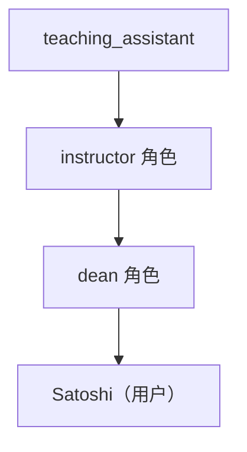
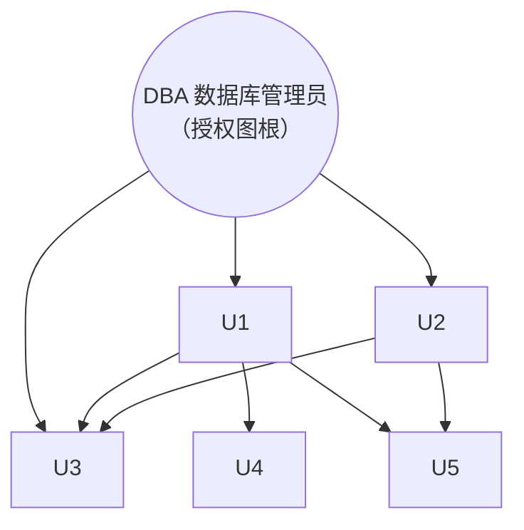

# 第 4 章 中级 SQL

> [!abstract] 章节定位
> 本章是《数据库系统概念》第 4 章——**中级 SQL（Intermediate SQL）**，承接 [[SQL|第 3 章基础 SQL]]。它深入讲解比基础查询更复杂的 SQL 特性：**连接表达式**（自然连接 / 外连接 / 连接条件）、**视图**与物化视图、**事务**、**完整性约束**（非空 / 唯一 / check / 引用完整性 / 断言）、**SQL 数据类型与模式**（日期时间、大对象、用户自定义类型、生成唯一码值、目录与模式）、**索引定义**以及 **SQL 授权机制**（权限、角色、视图授权、权限转移与收回、行级授权）。
>
> 从全书的四大视角看：本章偏重**数据操纵（DML）扩展**与**数据定义（DDL）/数据控制（DCL）**，是后续存储过程（第 5 章）、规范化（第 7 章）、查询优化（第 16 章）与事务实现（第 17–19 章）的基础。

在本书中我们继续学习 SQL。我们考虑具有更复杂形式的 SQL 查询、视图定义、事务、完整性约束，以及关于 SQL 数据定义和授权的更多详细信息。

## 4.1 连接表达式

在第 3 章的所有查询示例中（除了当使用集合运算时），我们使用笛卡儿积运算符号来组合来自多个关系的信息。在本节中，我们介绍几种“连接”运算，这些运算允许程序员以一种更自然的方式编写一些查询，并表达某些只用笛卡儿积很难表达的查询。

本节中使用的所有示例都涉及 `student` 和 `takes` 这两个关系，它们分别如图 4-1 和图 4-2 所示。请注意对于 ID 为 98988 的学生，他在 2018 年夏季选修的 BIO-301 课程的 1 号课程段的 `grade` 属性为空值。该空值表示尚未得到成绩。

![[Pasted image 20260721194554.png]]
**图 4-1 `student` 关系**

![[Pasted image 20260721194602.png]]
**图 4-2 `takes` 关系**

### 4.1.1 自然连接

请考虑以下 SQL 查询，该查询为每名学生计算该学生已经选修的课程的集合：

```sql
select name, course_id
from student, takes
where student.ID = takes.ID;
```

请注意，此查询仅输出已选修某些课程的学生。未选修任何课程的学生不会被输出。

请注意在 `student` 和 `takes` 表中，满足匹配条件需要 `student.ID` 等于 `takes.ID`。这是两个关系中具有相同名称的唯一属性。实际上这是一种常见的情况；也就是说，`from` 子句中的匹配条件通常要求在名称相匹配的所有属性上都取值相等。

> [!definition] 自然连接（natural join）
> 自然连接运算作用于两个关系，并产生一个关系作为结果。与两个关系的**笛卡儿积**不同，自然连接只考虑在**两个关系的模式中都出现的那些属性**上取值相同的元组对，而笛卡儿积将第一个关系的每个元组与第二个关系的每个元组进行串接。
> - 共同属性只出现一次；
> - 属性列出顺序：先公共属性，再只出现在第一个关系的属性，最后只出现在第二个关系的属性。

为了在这种常见情况下简化 SQL 编程人员的工作，SQL 支持一种被称作自然连接的运算，我们将在下面介绍这种运算。事实上，SQL 还支持另外几种方式使得来自两个或多个关系的信息可以被连接起来。我们已经见过怎样利用笛卡儿积和 `where` 子句谓词来连接来自多个关系的信息。连接来自多个关系的信息的另外一种方式将在 4.1.2 节至 4.1.4 节中介绍。

回到 `student` 和 `takes` 关系的示例上，计算：

```sql
student natural join takes
```

只考虑这样的元组对：在共同属性 ID 上取值相同的来自 `student` 的元组和来自 `takes` 的元组。

如图 4-3 所示的结果关系只有 22 个元组，它们给出了关于一名学生以及该生实际选修课程的信息。请注意我们并没有重复列出在两个关系的模式中都出现的属性，这样的属性只出现一次。还要注意属性的列出顺序：首先是两个关系模式中的公共属性，其次是只出现在第一个关系模式中的那些属性，最后是只出现在第二个关系模式中的那些属性。

![[Pasted image 20260721194613.png]]
**图 4-3 `student` 关系和 `takes` 关系的自然连接**

此前我们曾把查询“对于大学中已经选课的所有学生，找出他们的姓名以及他们选修的所有课程的标识”写为：

```sql
select name, course_id
from student, takes
where student.ID = takes.ID;
```

该查询可以用 SQL 中的自然连接运算更简洁地写作：

```sql
select name, course_id
from student natural join takes;
```

以上两个查询产生相同的结果。

自然连接运算的结果是关系。从概念上讲，可以将 `from` 子句中的“`student natural join takes`”表达式替换为通过计算该自然连接所得到的关系。然后在这个关系上执行 `where` 和 `select` 子句，就如我们在 3.3.2 节中所看到的那样。

在一条 SQL 查询的 `from` 子句中，可以用自然连接将多个关系结合在一起，如下所示：

```sql
select A_1, A_2, ..., A_n
from r_1 natural join r_2 natural join ... natural join r_m
where P;
```

更为一般地，`from` 子句可以写为如下形式：

```sql
from E_1, E_2, ..., E_n
```

其中每个 \(E_i\) 可以是单个关系或一个涉及自然连接的表达式。例如，假设我们要回答查询“列出学生的姓名以及他们所选修课程的名称”。此查询可以用 SQL 写为如下形式：

```sql
select name, title
from student natural join takes, course
where takes.course_id = course.course_id;
```

首先计算 `student` 和 `takes` 的自然连接，正如我们此前所见到的，再计算该结果与 `course` 的笛卡儿积，`where` 子句从该结果中仅提取出这样的元组：来自连接结果的课程标识与来自 `course` 关系的课程标识相匹配。请注意 `where` 子句中的 `takes.course_id` 表示自然连接结果的 `course_id` 域，因为该域最终来自 `takes` 关系。

但下面的 SQL 查询并不会计算出相同的结果：

```sql
select name, title
from student natural join takes natural join course;
```

为了说明原因，请注意 `student` 和 `takes` 的自然连接包含的属性是 (ID, name, dept_name, tot_cred, course_id, sec_id)，而 `course` 关系包含的属性是 (course_id, title, dept_name, credits)。作为二者自然连接的结果，需要来自这两个关系的 `dept_name` 属性取值相同，还要在 `course_id` 上取值相同。从而该查询将忽略所有这样的（学生姓名，课程名称）对：其中学生所选修的一门课程不是他所在系的课程。而前一个查询会正确输出这样的对。

为了发扬自然连接的优点，同时避免不正确的相等属性所带来的危险，SQL 提供了一种自然连接的构造形式，它允许你来指定究竟需要哪些列相等。下面的查询说明了这个特征：

```sql
select name, title
from (student natural join takes) join course using (course_id);
```

`join ... using` 运算需要指定一个属性名列表。被连接的两个关系都必须具有指定名称的属性。请考虑运算 \(r_1 \text{ join } r_2 \text{ using}(A_1, A_2)\)，此运算与 \(r_1 \text{ natural join } r_2\) 类似，只不过当 \(t_1.A_1 = t_2.A_1\) 和 \(t_1.A_2 = t_2.A_2\) 成立时，来自 \(r_1\) 的元组 \(t_1\) 和来自 \(r_2\) 的元组 \(t_2\) 就能匹配成对，即使 \(r_1\) 和 \(r_2\) 都具有名为 \(A_3\) 的属性，也不需要 \(t_1.A_3 = t_2.A_3\) 成立。

这样，在前述 SQL 查询中，连接结构允许 `student.dept_name` 和 `course.dept_name` 是不同的，并且该 SQL 查询给出了正确的答案。

### 4.1.2 连接条件

在 4.1.1 节中我们介绍了如何表达自然连接，并且介绍了 `join ... using` 子句，它是自然连接的一种形式，只需要指定属性上的取值相匹配。SQL 还支持另外一种形式的连接，其中可以指定任意的连接条件。

> [!definition] `on` 条件（连接条件）
> `on` 条件允许在参与连接的关系上设置通用的谓词。该谓词的写法与 `where` 子句谓词类似，只不过使用的是关键词 `on` 而不是 `where`。与 `using` 条件一样，`on` 条件出现在连接表达式的末尾。

考虑下面的查询，它具有包含 `on` 条件的连接表达式：

```sql
select *
from student join takes on student.ID = takes.ID;
```

上述 `on` 条件表明：如果一个来自 `student` 的元组和一个来自 `takes` 的元组在 ID 上的取值相同，那么它们是匹配的。本例中的连接表达式与连接表达式 `student natural join takes` 几乎相同，因为自然连接运算也需要 `student` 元组和 `takes` 元组是匹配的。这两者之间的一个区别在于：在上述连接结果中，ID 属性出现了两次，一次是 `student` 中的，另一次是 `takes` 中的，即便它们的 ID 属性值必须是相同的。

实际上，上述查询与以下查询是等价的：

```sql
select *
from student, takes
where student.ID = takes.ID;
```

正如我们此前所见，关系名被用来区分属性名 ID，这样 ID 的两次出现被分别表示为 `student.ID` 和 `takes.ID`。只显示一次 ID 值的查询版本如下：

```sql
select student.ID as ID, name, dept_name, tot_cred,
course_id, sec_id, semester, year, grade
from student join takes on student.ID = takes.ID;
```

此查询的结果与 `student` 和 `takes` 的自然连接的结果完全相同，我们已在图 4-3 中给出。

`on` 条件可以表达任何 SQL 谓词，因而使用 `on` 条件的连接表达式就可以表示比自然连接更为丰富的连接条件。然而，正如我们前面的示例所示，使用带 `on` 条件的连接表达式的查询可以用不带 `on` 条件的等价表达式来替换，只要把 `on` 子句中的谓词移到 `where` 子句中即可。因此，`on` 条件看起来似乎是一个冗余的 SQL 特征。

但是，引入 `on` 条件有两个很好的理由。首先，我们马上会看到，对于被称作**外连接**的这样一类连接来说，`on` 条件的表现与 `where` 条件的确是不同的。其次，如果在 `on` 子句中指定连接条件，并在 `where` 子句中出现其余的条件，这样的 SQL 查询通常更容易让人读懂。

### 4.1.3 外连接

假设我们希望显示所有学生的一个列表，显示他们的 ID、name、dept_name 和 tot_cred，以及他们所选修的课程。下面的 SQL 查询看起来检索出了所需的信息：

```sql
select *
from student natural join takes;
```

遗憾地是，上述查询的结果并不完全与想要的结果相同。假设有一些学生，他们并没有选修课程。那么这些特定的学生在 `student` 关系中所对应的元组与 `takes` 关系中的任何元组配对，都不会满足自然连接的条件，因而这些学生的数据就不会出现在结果中。这样我们就看不到没有选修任何课程的学生的任何信息。例如，在图 4-1 的 `student` 关系和图 4-2 的 `takes` 关系中，请注意 ID 为 70557 的学生 Snow 没有选修任何课程。Snow 出现在 `student` 关系中，但是 Snow 的 ID 号并没有出现在 `takes` 的 ID 列中。因而，Snow 并不会出现在自然连接的结果中。

更为一般地，参与连接的任何一个或两个关系中的某些元组可能会以这种方式“丢失”。

> [!definition] 外连接（outer join）
> 外连接运算与我们已经学过的连接运算类似，但它通过在结果中创建包含**空值**的元组，来**保留那些在连接中会丢失的元组**。共有三种形式：
> - **左外连接（left outer join）**：只保留出现在左外连接运算之前（左边）的关系中的元组。
> - **右外连接（right outer join）**：只保留出现在右外连接运算之后（右边）的关系中的元组。
> - **全外连接（full outer join）**：保留出现在两个关系中的元组。
>
> 与之区分，此前的、不保留未匹配元组的连接运算被称作**内连接（inner join）**。

我们可以按照如下方式计算左外连接运算：首先，像前面那样计算出内连接的结果；然后，对于内连接的左侧关系中任意一个与右侧关系中任何元组都不匹配的元组 \(t\)，向连接结果中加入一个元组 \(r\)，\(r\) 的构造如下：

- 元组 \(r\) 从左侧关系得到的属性被赋为来自元组 \(t\) 的值。
- \(r\) 的其余属性被赋为空值。

图 4-4 给出了下列查询的结果：

```sql
select *
from student natural left outer join takes;
```

![[Pasted image 20260721194629.png]]
**图 4-4 `student natural left outer join takes` 的结果（含 Snow，未匹配属性取空值）**

与内连接的结果不同，此结果中包含学生 Snow（ID 70557），但是在 Snow 对应的元组中，那些只出现在 `takes` 关系模式中的属性取空值。

作为使用外连接运算的另一个示例，我们可以将查询“找出一门课程也没有选修的所有学生”写作：

```sql
select ID
from student natural left outer join takes
where course_id is null;
```

右外连接和左外连接是对称的。来自右侧关系的、不匹配左侧关系中任何元组的元组被补上空值，并加入右外连接的结果中。这样，如果我们使用右外连接来重写前面的查询，并按照如下方式交换所列出的关系的次序：

```sql
select *
from takes natural right outer join student;
```

那么我们得到的结果是一样的，只不过在结果中属性出现的次序不同（见图 4-5）。

![[Pasted image 20260721194639.png]]
**图 4-5 `takes natural right outer join student` 的结果**

全外连接是左外连接与右外连接类型的联合。在内连接结果被计算出来之后，该运算将来自左侧关系的、不匹配右侧关系中任何元组的那些元组添上空值并把它们加到结果中。类似地，它将来自右侧关系的、不匹配左侧关系中任何元组的那些元组添上空值并把它们加到结果中。换言之，全外连接是左外连接和相应的右外连接的并运算。

作为使用全外连接的示例，请考虑下述查询：“显示 Comp. Sci. 系中所有学生以及他们在 2017 年春季选修的所有课程段的列表。2017 年春季开设的所有课程段都必须显示，即使没有来自 Comp. Sci. 系的学生选修这些课程段。”此查询可写为：

```sql
select *
from (select *
      from student
      where dept_name = 'Comp. Sci.')
     natural full outer join
     (select *
      from takes
      where semester = 'Spring' and year = 2017);
```

其结果如图 4-6 所示。

![[Pasted image 20260721194647.png]]
**图 4-6 全外连接示例的结果（见文本描述）**

`on` 子句可以和外连接一起使用。下述查询与我们见过的使用 “`student natural left outer join takes`” 的第一个查询是相同的，只不过属性 ID 在结果中出现了两次。

```sql
select *
from student left outer join takes on student.ID = takes.ID;
```

正如我们前面提到的，`on` 和 `where` 对于外连接的表现是不同的。其原因是：外连接只为那些对相应的“内”连接结果没有贡献的元组增加补上空值的元组。`on` 条件是外连接声明的一部分，但 `where` 子句却不是。在我们的示例中，ID 为 70557 的学生 “Snow” 所对应的 `student` 元组的情况就说明了这样的差异。假设我们按这样的方式来修改前述查询：把 `on` 子句谓词换到 `where` 子句中，并使用一个为 `true` 的 `on` 条件：

```sql
select *
from student left outer join takes on true
where student.ID = takes.ID;
```

早先的查询使用带 `on` 条件的左外连接，包括元组 (70557, Snow, Physics, 0, null, null, null, null, null, null)，因为在 `takes` 中没有 ID=70557 的元组。然而在后面的查询中，每个元组都满足连接条件 `true`，因此外连接实际上产生了两个关系的笛卡儿积。因为在 `takes` 中没有 ID=70557 的元组，每次当外连接中出现 `name="Snow"` 的元组时，`student.ID` 与 `takes.ID` 的取值必然是不同的，并且这样的元组会被 `where` 子句谓词排除掉。从而，学生 Snow 不会出现在后面查询的结果中。

> [!note] 注释 4-1　SQL 与多重集关系代数 —— 第四部分
> 关系代数支持左外连接、右外连接与全外连接运算，也支持自然连接运算及其外连接变体；这些运算的定义与 SQL 中相应运算的定义相同，我们在 4.1 节中已看到。
>
> [!warning] 待核实
> 原始笔记此处用 \(\ltimes\)、\(\rtimes\)、\(\bowtie\) 标注左外连接、右外连接、全外连接，但又将自然连接也写作 \(\bowtie\)，存在符号重复/冲突。原书第 4 章注释 4-1 中自然连接与全外连接应分别使用不同符号，请对照原版（第 6 版）核实后订正。

### 4.1.4 连接类型和条件

为了把常规连接和外连接区分开来，在 SQL 中把常规连接称作**内连接**。这样连接子句就可以指定用内连接来说明使用的是常规连接。然而关键字 `inner` 是可选的，当 `join` 子句中没有使用 `outer` 前缀时，缺省的连接类型是内连接。从而，

```sql
select *
from student join takes using (ID);
```

等价于：

```sql
select *
from student inner join takes using (ID);
```

类似地，自然连接 (natural join) 等价于自然内连接 (natural inner join)。

> [!summary] 连接类型 × 连接条件
> 任意的连接形式（内连接、左外连接、右外连接、全外连接）都可以和任意的连接条件（自然连接、`using` 条件、`on` 条件）进行组合。图 4-7 给出了完全列表。


图 4-7 给出了我们已讨论的各种连接类型的完全列表。

![[Pasted image 20260721194655.png]]
**图 4-7 连接类型和连接条件（连接形式 × 连接条件的组合矩阵）**

## 4.2 视图

让所有用户看到数据库中关系的完整集合并非总是合适的。在 4.7 节中，我们将看到如何使用 SQL 授权机制来限制对关系的访问，但是出于安全性考虑，可能需要向用户仅隐藏一个关系中的特定数据。请考虑以下情况：一位职员需要知道教师的 ID、姓名和所在系名，但是并没有权限看到教师的工资值。此人应该看到的关系用 SQL 语句描述如下：

```sql
select ID, name, dept_name
from instructor;
```

除了安全问题，我们可能希望创建一个“虚拟”关系的个性化集合，该集合能更好地匹配特定用户直观意义上的企业结构。在大学示例中，我们可能希望有一个关于物理系在 2017 年秋季学期所开设的所有课程段的列表，其中包括每个课程段在哪栋建筑的哪个房间授课的信息。为了得到这样的列表，我们应该创建的关系是：

```sql
select course.course_id, sec_id, building, room_number
from course, section
where course.course_id = section.course_id
  and course.dept_name = 'Physics'
  and section.semester = 'Fall'
  and section.year = 2017;
```

可以计算出这些查询的结果并存储下来，然后把存储的关系提供给用户。但如果我们这样做，一旦 `instructor`、`course` 或 `section` 关系中的底层数据发生变化，那么所存储的查询结果就不再与在这些关系上重新执行查询的结果相匹配。一般说来，对象上例中那样的查询结果进行计算并存储不是一种好的思路（尽管也存在某些例外情况，我们会在后面学习）。

SQL 允许通过查询来定义一种“虚拟关系”，它在概念上包含查询的结果。该虚拟关系并不预先计算和存储，而是在使用虚拟关系的时候才通过执行查询计算出来。我们在 3.8.6 节中看到过一种这样的特性，在那里我们描述了 `with` 子句。`with` 子句允许我们为子查询指定一个名称，以便经常根据需要使用，但只能在一个特定的查询中使用。在这里，我们提出了一种通过定义**视图（view）**来将此概念扩展到单个查询之外的方式。在任何给定的实际关系集合上能够支持大量的视图。

### 4.2.1 视图定义

> [!definition] 视图（view）
> 视图是通过查询定义的“虚拟关系”，在概念上包含查询结果中的元组，但**不进行预计算和存储**——数据库系统只存储与视图相关联的查询表达式，每当视图被访问时才执行查询计算元组。

我们在 SQL 中通过使用 `create view` 命令来定义视图。为了定义了一个视图，我们必须给视图一个名称，并且必须提供计算视图的查询。`create view` 命令的格式为：

```sql
create view v as <查询表达式>;
```

其中 `<查询表达式>` 可以是任何合法的查询表达式。视图名称用 \(v\) 表示。

请重新考虑需要访问 `instructor` 关系中除 `salary` 之外的所有数据的职员。该职员不应该被授予访问 `instructor` 关系的权限（我们将在 4.7 节中看到如何指定权限）。但可以把视图关系 `faculty` 提供给该职员，此视图的定义如下：

```sql
create view faculty as
select ID, name, dept_name
from instructor;
```

如前所述，视图关系在概念上包含查询结果中的元组，但并不进行预计算和存储。相反，数据库系统存储的是与视图关系相关联的查询表达式。每当视图关系被访问时，其中的元组就通过计算查询结果而被创建出来。从而，视图关系可以随时根据需要创建。

为了创建这样一个视图，列出物理系在 2017 年秋季学期所开设的所有课程段，以及每个课程段在哪栋建筑的哪个房间授课，我们可以写出：

```sql
create view physics_fall_2017 as
select course.course_id, sec_id, building, room_number
from course, section
where course.course_id = section.course_id
  and course.dept_name = 'Physics'
  and section.semester = 'Fall'
  and section.year = 2017;
```

稍后，当我们在 4.7 节中学习 SQL 授权机制时，将看到用户可以用对视图的访问来代替对关系的访问或作为对关系的访问之外的补充。

视图与 `with` 语句的不同之处在于：视图一旦创建，在被显式删除之前就一直是可用的。由 `with` 定义的命名子查询对于定义它的查询来说只是本地可用的。

### 4.2.2 在 SQL 中使用视图

一旦我们定义了一个视图，就可以用视图名来指代该视图所生成的虚拟关系。使用视图 `physics_fall_2017`，我们可以通过下面的查询找到于 2017 年秋季学期、在 Watson 大楼开设的所有物理课程的课程 ID 和房间号：

```sql
select course_id
from physics_fall_2017
where building = 'Watson';
```

在查询中，视图名可以出现在关系名可以出现的任何地方。

视图的属性名可以按下述方式来显式指定：

```sql
create view departments_total_salary(dept_name, total_salary) as
select dept_name, sum(salary)
from instructor
group by dept_name;
```

上述视图为每个系给出了该系中所有教师的工资总和。因为表达式 `sum(salary)` 并没有一个名称，所以在视图定义中显式指定了该属性名。

直观地说，在任何给定时刻，视图关系中的元组集合都是对定义视图的查询表达式求值的结果。因此，如果计算并存储视图关系，一旦用于定义该视图的关系被修改，那么视图就会过期。为了避免这一点，视图通常这样来实现：当我们定义一个视图时，数据库系统存储视图本身的定义，而不存储定义该视图的查询表达式的求值结果。一旦视图关系出现在查询中，它就被已存储的查询表达式代替。因此，每当计算这个查询时，视图关系都被重新计算。

一个视图可能被用到定义另一个视图的表达式中。例如，我们可以定义一个视图 `physics_fall_2017_watson`，它列出了于 2017 年秋季学期、在 Watson 大楼开设的所有物理课程的课程 ID 和房间号：

```sql
create view physics_fall_2017_watson as
select course_id, room_number
from physics_fall_2017
where building = 'Watson';
```

其中，`physics_fall_2017_watson` 本身是一个视图关系。它等价于：

```sql
create view physics_fall_2017_watson as
select course_id, room_number
from (select course.course_id, building, room_number
      from course, section
      where course.course_id = section.course_id
        and course.dept_name = 'Physics'
        and section.semester = 'Fall'
        and section.year = 2017)
where building = 'Watson';
```

### 4.2.3 物化视图

> [!definition] 物化视图（materialized view）
> 某些数据库系统允许存储视图关系，并且保证：如果用于定义视图的实际关系发生改变，则视图也跟着修改以保持最新。这样的视图被称为物化视图。
> - 保持物化视图最新的过程称为**物化视图维护（materialized view maintenance）**，或简称**视图维护（view maintenance）**（第 16.5 节）。
> - 维护时机：更新时立即维护 / 访问时惰性维护 / 周期性重新计算（可能陈旧）。

例如，请考虑 `departments_total_salary` 视图。如果该视图是物化的，则其结果将存储在数据库中，从而允许使用该视图的查询可以通过使用预计算的结果来更快地运行，而不是重新计算该视图的结果。

然而，如果一个 `instructor` 元组被插入 `instructor` 关系中，或者从 `instructor` 关系中删除，则定义视图的查询的结果就会发生变化，其结果是物化视图的内容也必须更新。类似地，如果一位教师的工资被更新，那么 `departments_total_salary` 中对应于该教师所在系的元组就必须更新。

频繁使用视图的应用可以从视图的物化中获益。需要快速响应基于大型关系上聚集计算的特定查询的应用也可以通过创建与该查询相对应的物化视图而受益良多。在这种情况下，聚集结果可能比视图定义所基于的大型关系要小得多，其结果是：利用物化视图可以非常快地回答查询，它避免读取大型底层关系。物化视图查询所带来的好处还需要与存储代价和所增加的更新开销相权衡。

SQL 并没有定义指定物化视图的标准方式，但是很多数据库系统提供了它们自己的 SQL 扩展来实现这项任务。一些数据库系统在底层关系变化时，总是把物化视图保持在最新状态；而另外一些系统允许物化视图过时，并周期性地重新计算物化视图。

### 4.2.4 视图更新

尽管对于查询而言，视图是一种有用的工具，但如果我们用它们来表达更新、插入或删除，它们可能带来严重的问题。困难就在于：用视图表达的数据库修改必须被翻译为对数据库**逻辑模型**中实际关系的修改。

假设我们此前所见的 `faculty` 视图被提供给一个职员。既然我们允许视图名出现在关系名可以出现的任何地方，该职员就可以这样写：

```sql
insert into faculty
values ('30765', 'Green', 'Music');
```

这个插入必须被表示为对 `instructor` 关系的插入，因为 `instructor` 是数据库系统用于构造 `faculty` 视图的实际关系。然而，为了把一个元组插入 `instructor` 中，我们必须给出 `salary` 的值。存在两种合理的解决方案来处理这样的插入：

- 拒绝插入，并向用户返回一条错误信息。
- 向 `instructor` 关系中插入元组 ('30765', 'Green', 'Music', null)。

通过视图修改数据库的另类问题发生在这样的视图上：

```sql
create view instructor_info as
select ID, name, building
from instructor, department
where instructor.dept_name = department.dept_name;
```

这个视图列出了大学里每位教师的 ID、name 和 building 名。请考虑通过该视图的如下插入语句：

```sql
insert into instructor_info
values ('69987', 'White', 'Taylor');
```

假设没有 ID 为 69987 的教师，也没有位于 Taylor 大楼的系。那么向 `instructor` 和 `department` 关系中插入元组的唯一可能的方式是：向 `instructor` 中插入元组 ('69987', 'White', null, null)，并向 `department` 中插入元组 (null, 'Taylor', null)。于是我们得到如图 4-8 所示的关系。但是这个更新并没有产生所需的结果，因为视图关系 `instructor_info` 中仍然不包含元组 ('69987', 'White', 'Taylor')。因此，通过利用空值来更新 `instructor` 和 `department` 关系以得到对 `instructor_info` 所需的更新是不可行的。

![[Pasted image 20260721194730.png]]
**图 4-8 插入元组后的 `instructor` 和 `department` 关系**

由于上述的种种问题，除了一些有限的情况之外，一般不允许对视图关系进行修改。不同的数据库系统指定了不同的条件，在满足这些条件的前提下才允许更新视图关系；请参考数据库系统手册以获得详细信息。

一般说来，如果定义视图的查询对下列条件都能满足（即视图上可以执行插入、更新或删除）：

- `from` 子句中只有一个数据库关系。
- `select` 子句中只包含关系的属性名，并不包含任何表达式、聚集或 `distinct` 声明。
- 没有出现在 `select` 子句中的任何属性都可以取 null 值；也就是说，这些属性没有非空约束，也不构成主码的一部分。
- 查询中不含有 `group by` 或 `having` 子句。

在这些限制下，允许在下面的视图上执行 `update`、`insert` 和 `delete` 操作：

```sql
create view history_instructors as
select *
from instructor
where dept_name = 'History';
```

即便是在可更新的条件下，下面的问题仍然存在。假设一个用户尝试向 `history_instructors` 视图中插入元组 ('25566', 'Brown', 'Biology', 100000)，这个元组可以被插入 `instructor` 关系中，但是由于它不满足视图所要求的选择条件，因此它不会出现在 `history_instructors` 视图中。

在缺省情况下，SQL 允许执行上述更新。但是，可以通过在视图定义的末尾包含 `with check option` 子句的方式来定义视图：这样，如果向视图中插入一条不满足视图的 `where` 子句条件的元组，则数据库系统会拒绝该插入操作。类似地，如果新值不满足 `where` 子句的条件，则更新也会被拒绝。

SQL:1999 有更复杂的规则集是关于何时可以在视图上执行插入、更新和删除的，并通过更大一类视图来允许一个视图的更新，但是这些规则过于复杂，就不在这里讨论了。

通过视图修改数据库的另一种可替代的且通常更可取的方法是使用 5.3 节中讨论的**触发器**机制。触发器声明中的 `instead of` 特性允许用专门为每种特定情况设计的操作去替换视图上缺省的插入、更新和删除操作。

## 4.3 事务

> [!definition] 事务（transaction）
> 事务由查询和（或）更新语句的序列组成。SQL 标准规定当一条 SQL 语句被执行时，就隐式地开始了一个事务。下列 SQL 语句之一会结束该事务：
> - **`commit work`**：提交当前事务，使事务执行的更新在数据库中成为永久性。提交后自动开始新事务。
> - **`rollback work`**：回滚当前事务，撤销事务中 SQL 语句执行的所有更新，将数据库恢复到该事务第一条语句之前的状态。
>
> 关键字 `work` 在两条语句中都是可选的。

如果在一个事务的执行期间检测到某种错误状态，事务回滚是有用的。在某种意义上，提交类似于对正在编辑的文档保存更改，而回滚类似于退出编辑会话且不保存更改。一旦一个事务执行了 `commit work`，它的影响就不能再用 `rollback work` 来撤销了。数据库系统保证在发生诸如某条 SQL 语句错误、断电或系统崩溃这些故障的情况下，如果一个事务还没有执行 `commit work`，那么其影响将被回滚。在断电或其他系统崩溃的情况下，回滚会在系统重启时执行。

例如，考虑一个银行应用，我们需要从一个银行账户把钱转到同一家银行的另一个账户上。为了这样做，我们需要更新两个账户的余额，从一个账户中减去转账金额，并把它加到另一个账户上。如果在从第一个账户上划走资金以后，但在把这笔资金加到第二个账户之前发生了系统崩溃，那么银行余额就会不一致。如果在第一个账户划走资金之前先往第二个账户存款，并且在存款之后马上发生系统崩溃，那么也会出现类似的问题。

作为另一个示例，请考虑我们正在使用的大学应用的示例。我们假设只要学生成功修完一门课程，`student` 关系中对应元组的 `tot_cred` 属性就会通过修改保持最新。为此，只要当 `takes` 关系被更新以记录一名学生成功修完一门课程的信息（通过赋予适当的成绩）时，相应的 `student` 元组也必须更新。如果执行这两个更新的应用程序在执行完一个更新后但在执行第二个更新前崩溃了，那么数据库中的数据就是不一致的。

一个事务或者在完成其所有步骤后提交其操作，或者在不能成功完成其所有动作的情况下回滚其所有动作，通过这种方式数据库提供了对事务具有**原子性（atomic）**的抽象，原子性也就是不可分割性。要么事务的所有影响被反映到数据库中，要么任何影响也没有（在回滚之后）。

如果把事务的概念应用到上述应用中，那些更新语句就会作为单个事务来执行。在事务执行其某一条语句时出错会导致事务早先执行的语句的影响被撤销，从而不会让数据库处于部分更新的状态。

如果程序没有执行这两条命令中的任何一条就终止了，那么更新要么被提交要么被回滚。SQL 标准并没有指出究竟执行哪一种，如何选择依赖于具体实现。

在包括 MySQL 和 PostgreSQL 在内的很多 SQL 实现中，在缺省方式下每条 SQL 语句自成一个事务，且语句一旦执行完就提交该事务。如果一个事务由需要执行的多条 SQL 语句组成，就必须关闭单条 SQL 语句的这种自动提交。如何关闭自动提交依赖于特定的 SQL 实现，尽管很多数据库都支持关闭自动提交（`set autocommit off`）的命令。

一种更好的备选方案是，作为 SQL:1999 标准的一部分，允许多条 SQL 语句被包含在关键字 `begin atomic ... end` 之间。这样在此关键字之间的所有语句就构成了一个单一事务，如果执行到 `end` 语句，则该事务被默认提交。只有诸如 SQL Server 的某些数据库支持上述语法。但是，诸如 MySQL 和 PostgreSQL 的其他几个数据库支持的是 `begin` 语句，该语句启动包含所有后续 SQL 语句的事务，但并不支持 `end` 语句；事务必须通过 `commit work` 或 `rollback work` 命令来结束。

如果使用诸如 Oracle 这样的数据库，其中自动提交并不是 DML 语句的缺省设置，请确保在添加或修改数据后发出 `commit` 命令，否则当你断开连接时，将回滚你的所有数据库修改。你应该清楚，虽然在缺省情况下 Oracle 已关闭自动提交，但缺省设置可能会被本地设置所覆盖。

我们将在第 17 章中学习事务的更多特性；将在第 18~19 章中介绍实现事务的相关问题。

## 4.4 完整性约束

> [!definition] 完整性约束（integrity constraint）
> 完整性约束保证授权用户对数据库所做的修改不会导致**数据一致性**的丢失，从而防止对数据的意外破坏。它与**安全性约束（security constraint）**不同——后者防止未经授权的用户访问数据库。

完整性约束的示例有：

- 教师姓名不能为 `null`。
- 任意两位教师不能有相同的教师 ID。
- `course` 关系中的每个系名必须在 `department` 关系中有一个对应的系名。
- 一个系的预算必须大于 0.00 美元。

一般说来，一个完整性约束可以是关于数据库的任意谓词。但是，检测任意谓词的代价可能太高。因此，大多数数据库系统允许用户指定那些只需极小开销就可以检测的完整性约束。

在 3.2.2 节中我们已经见过了完整性约束的一些形式。我们将在本节中学习完整性约束的更多形式。在第 7 章中，我们将学习另一种被称作**函数依赖（functional dependency）**的完整性约束形式，它主要应用在模式设计的过程中。

完整性约束通常被视为数据库模式设计过程的一部分，并作为用于创建关系的 `create table` 命令的一部分被声明。然而，也可以通过使用 `alter table table-name add constraint` 命令将完整性约束施加到已有关系上，其中 `constraint` 可以是该关系上的任意约束。当这样一条命令被执行时，系统首先保证该关系满足指定的约束。如果满足，那么约束被施加到关系上；如果不满足，则上述命令被拒绝执行。

### 4.4.1 单个关系上的约束

我们在 3.2 节中描述了如何用 `create table` 命令来定义关系表。`create table` 命令还可以包括完整性约束语句。除了主码约束之外，还有许多其他可以包括在 `create table` 命令中的约束。允许的完整性约束包括：

- `not null`;
- `unique`;
- `check(<谓词>)`。

我们将在下面几个小节中介绍这些类型的每种约束。

### 4.4.2 非空约束

正如我们在第 3 章中讨论过的，空值是所有域的成员，它在缺省情况下是 SQL 中每个属性的合法值。然而对于特定的属性来说，空值可能是不合适的。请考虑 `student` 关系中的一个元组，其中 `name` 是 `null`。这样的元组给出了一名未知学生的信息，因此它并不包含有用的信息。类似地，我们不会希望系的预算为 `null`。在这些情况下，我们希望禁止空值，可以通过限定 `name` 和 `budget` 属性的域来排除空值，即按照如下方式来声明：

```sql
name varchar(20) not null
budget numeric(12,2) not null
```

非空（not null）约束禁止对该属性插入空值，并且它是**域约束（domain constraint）**的一个示例。可能导致向一个声明为非空的属性插入空值的任何数据库修改都会产生错误诊断信息。

在许多情况下我们希望避免空值。尤其是 SQL 禁止在关系模式的主码中出现空值。因此，在我们的大学示例中，在 `department` 关系上如果声明 `dept_name` 属性为 `department` 的主码，那它就不能取空值。其结果是它不必显式地声明为非空的。

### 4.4.3 唯一性约束

SQL 还支持这种完整性约束：

```sql
unique (A_1, A_2, ..., A_m)
```

唯一性（unique）声明指出属性 \(A_1, A_2, ..., A_m\) 形成了一个**超码**；也就是说，在关系中没有两个元组能在所有列出的属性上取值相同。然而声明了唯一性的属性允许为 `null`，除非它们已被显式地声明为非空。请回忆一下，空值并不等于其他的任何值。（这里对空值的处理与对 3.8.4 节中定义的 `unique` 结构的处理一样。）

### 4.4.4 check 子句

当应用于关系声明时，`check(P)` 子句指定一个谓词 \(P\)，关系中的每个元组都必须满足谓词 \(P\)。

通常用 `check` 子句来保证属性值满足指定的条件，实际上是创建了一个强大的类型系统。例如，在用于 `department` 关系的 `create table` 命令中的 `check(budget>0)` 子句将保证 `budget` 上的取值是非负的。

作为另一个示例，考虑如下语句：

```sql
create table section
(
    course_id    varchar(8),
    sec_id       varchar(8),
    semester     varchar(6),
    year         numeric(4,0),
    building     varchar(15),
    room_number  varchar(7),
    time_slot_id varchar(4),
    primary key (course_id, sec_id, semester, year),
    check (semester in ('Fall', 'Winter', 'Spring', 'Summer'))
);
```

这里，我们用 `check` 子句模拟了一个枚举类型，是通过指定 `semester` 必须是 'Fall'、'Winter'、'Spring' 或 'Summer' 中的一个来实现的。这样，`check` 子句允许以有力的方式对属性域加以限制，这是大多数编程语言的类型系统所不能允许的。

在对 `check` 子句的求值中空值呈现了一种有趣的特殊情况。如果 `check` 子句不为假，则它是满足的，因此计算结果为未知的子句也是满足的。如果不需要空值，则必须指定单独的非空约束（见 4.4.2 节）。

如之前所示，`check` 子句可以单独出现，也可以作为属性声明的一部分出现。在图 4-9 中，`semester` 属性的 `check` 约束是作为 `semester` 声明的一部分出现的。`check` 子句的位置取决于编码风格。通常来说，对单个属性值的约束与该属性一起列出，而更复杂的 `check` 子句则在 `create table` 语句的末尾单独列出。

根据 SQL 标准，`check` 子句中的谓词可以是包括子查询在内的任意谓词。然而，当前还没有一个被广泛使用的数据库产品允许包含子查询的谓词。

### 4.4.5 引用完整性

> [!definition] 引用完整性（referential integrity）与外码（foreign key）
> 我们常常希望保证一个关系（**引用关系**）中给定属性集合的取值也在另一个关系（**被引用关系**）的特定属性集的取值中出现。这种情况称为**引用完整性约束**，外码是引用完整性约束的一种形式，其中被引用的属性构成被引用关系的主码。

![[Pasted image 20260721194747.png]]
**图 4-9 大学数据库的部分 SQL 数据定义**

通过使用外码（foreign key）子句，可以将外码指定为 SQL 的创建表（`create table`）语句的一部分，正如我们在 3.2.2 节中所见的。我们通过使用一部分大学数据库的 SQL DDL 定义来说明外码声明，如图 4-9 中所示。`course` 表的定义中有一个声明 “`foreign key (dept_name) references department`”。这个外码声明表明：对于每个课程元组，元组中指定的系名必须在 `department` 关系中存在。如果没有这个约束，就可能为一门课程指定一个并不存在的系名。

在缺省情况下，在 SQL 中外码引用的是被引用表的主码属性。SQL 还支持一个可以显式指定被引用关系的属性列表的引用（`references`）子句的版本。例如，`course` 关系的外码声明可以指定为：

```sql
foreign key (dept_name) references department(dept_name)
```

然而，这个被指定的属性列表必须声明为被引用关系的超码，要么使用主码约束，要么使用唯一性约束来进行这种声明。在更为普遍的引用完整性约束形式中，被引用的属性不必是候选码，但这样的形式不能在 SQL 中直接声明。SQL 标准提供了另外的结构用于实现这样的约束，我们将在 4.4.8 节中描述这样的结构，但是，任何广泛使用的数据库系统都不支持这些替代结构。

请注意外码必须引用一组兼容的属性，也就是说，属性数量必须相同，并且相应属性的数据类型必须兼容。

我们可以使用以下形式作为表定义的一部分，来声明一个属性构成一个外码：

```sql
dept_name varchar(20) references department
```

当违反引用完整性约束时，通常的处理是拒绝执行导致破坏完整性的操作（即执行更新操作的事务被回滚）。但是，在外码（`foreign key`）子句中可以指明：如果被引用关系上的删除或更新操作违反了约束，那么系统必须采取一些措施来改变引用关系中的元组以恢复完整性约束，而不是拒绝这样的操作。

```sql
create table course
(
    ...
    foreign key (dept_name) references department
        on delete cascade
        on update cascade,
    ...
);
```

由于有了与外码声明相关联的**级联删除（`on delete cascade`）**子句，如果删除 `department` 中的一个元组导致违反了这种引用完整性约束，则系统并不拒绝该删除，而是对 `course` 关系做“级联”（cascade）删除，即删除引用了被删除系的元组。类似地，如果更新被约束引用的字段时违反了约束，则系统并不拒绝更新操作，而是将 `course` 中引用元组的 `dept_name` 字段也改为新值。SQL 还允许外码（`foreign key`）子句指定除级联以外的其他动作，如果约束被违反，可将引用域（这里是 `dept_name`）置为 `null`（通过用 `set null` 代替 `cascade`），或置为该域的缺省值（通过使用 `set default`）。

如果存在跨多个关系的外码依赖链，则在链的一端所做的删除或更新可能级联传至整个链上。实践习题 4.9 中出现的一种有趣的情况是：一个关系上的外码约束所引用的关系就是它自己。如果一个级联更新或删除所导致的对约束的违反不能通过进一步的级联操作来解决，则系统就中止该事务。其结果是，该事务所做的所有修改以及它的级联动作都将被撤销。

空值使得 SQL 中引用完整性约束的语义复杂化了。外码中的属性允许为 `null`，只要它们没有另外被声明为非空。如果在给定元组的外码的所有列上均取非空值，则对该元组采用外码约束的通常定义。如果任一外码列为 `null`，则该元组被自动定义为是满足约束的。这样的定义可能并不总是正确的选择，因此 SQL 也提供一些结构使你可以改变对空值的处理方式；我们在此不讨论这样的结构。

### 4.4.6 给约束赋名

我们可以为完整性约束赋予名称。如果我们想要删除先前定义的一个约束，则这样的名称是很有用的。

为了命名约束，我们在约束的前面使用关键字 `constraint` 和我们希望为其赋予的名称。例如，如果我们希望将名称 `minsalary` 赋给 `instructor` 的 `salary` 属性上的 `check` 约束（参见图 4-9），那么可以将对 `salary` 的声明修改为：

```sql
salary numeric(8,2), constraint minsalary check (salary > 29000),
```

之后，如果我们决定不再需要这个约束，那么可以写为：

```sql
alter table instructor drop constraint minsalary;
```

如果名称缺失，需要使用特定于系统的功能来识别出约束的系统分配名称。并非所有的系统都支持这样的功能，但是比如在 Oracle 中，系统表 `user_constraints` 就包含了这样的信息。

### 4.4.7 事务中对完整性约束的违反

事务可能包括几个步骤，在某一步之后也许会暂时违反完整性约束，但是后面的某一步也许就会消除这个违反。例如，假设我们有一个主码为 `name` 的 `person` 关系，还有一个 `spouse` 属性，并且假设 `spouse` 是在 `person` 上的一个外码。也就是说，该约束要求 `spouse` 属性必须包含在 `person` 表里出现的姓名。假设我们希望在上述关系中插入两个元组，一个是关于 John 的，另一个是关于 Mary 的，这两个元组的配偶属性分别设置为 Mary 和 John，以此表示 John 和 Mary 彼此之间的婚姻关系。那么无论先插入这两个元组中的哪一个，被插入的第一个元组都会违反该外码约束。但在插入第二个元组后，外码约束又会满足了。

为了处理这样的情况，SQL 标准允许将 `initially deferred` 子句加入约束声明中；这样约束就不是在事务的中间步骤上检查，而是在事务结束的时候检查。一个约束可以被指定为可延迟的（deferrable），这意味着在缺省情况下它会被立即检查，但是在需要的时候可以延迟检查。对于被声明为可延迟的约束，对 `set constraints constraint-list deferred` 语句的执行将作为事务的一部分，从而导致对指定约束的检查被延迟到该事务结束时执行。在约束列表中出现的约束必须指定名称。缺省方式是立即检查约束，并且许多数据库实现并不支持延迟约束检查。

如果 `spouse` 属性可以被置为 `null`，我们可以用另一种方式来避开前述示例中的问题：在插入 John 和 Mary 元组时，我们设置其 `spouse` 属性为 `null`，后面再更新它们的值。然而，这种技术需要更大的编程量，而且如果属性不能置为 `null`，此方法就不可行。

### 4.4.8 复杂 check 条件与断言

在 SQL 标准中还有其他的结构用于指定大多数系统当前不支持的完整性约束。我们将在本小节中讨论其中的一些结构。

正如 SQL 标准所定义的，`check` 子句中的谓词可以是包含子查询的任意谓词。如果一个数据库实现支持在 `check` 子句中出现了查询，我们就可以在 `section` 关系上声明如下所示的引用完整性约束：

```sql
check (time_slot_id in (select time_slot_id from time_slot))
```

这个 `check` 条件所检测的是 `section` 关系的每个元组中的 `time_slot_id` 的确是 `time_slot` 关系中某个时间段段的标识。因此这个条件不仅限于在 `section` 中插入或修改元组时需要检测，而且在 `time_slot` 关系改变时（当 `time_slot` 关系中的一个元组被删除或修改时）也需要检测。

在我们的大学模式上另一个自然的约束是：每个课程段都需要有至少一位教师来讲授。为了强制实现此约束，我们可能希望声明 `section` 关系的属性集 (`course_id`, `sec_id`, `semester`, `year`) 构成外码，它引用 `teaches` 关系的相应属性。遗憾的是，这些属性并未构成 `teaches` 关系的候选码。如果数据库系统支持带子查询的 `check` 约束，可以使用与 `time_slot` 属性类似的 `check` 约束来强制实现上述约束。

复杂的 `check` 条件在我们希望确保数据完整性的时候是有用的，但它们的检测开销可能会很大。在我们的示例中，`check` 子句中的谓词不仅需要在 `section` 关系发生更新时计算，而且也需要在 `time_slot` 关系发生更新时检测，因为 `time_slot` 在子查询中被引用了。

> [!definition] 断言（assertion）
> 一个断言就是一个谓词，它表达了我们希望数据库**总能满足**的一个条件。SQL 中采用如下形式：
> ```sql
> create assertion <assertion-name> check <predicate>;
> ```

请考虑以下约束，它们可以使用断言来表示。

- 对于 `student` 关系中的每个元组，它在 `tot_cred` 属性上的取值必须等于该生已成功修完的课程的学分总和。
- 每位教师不能在同一个学期的同一个时间段在两个不同的教室授课。

在图 4-10 中，我们展示了如何用 SQL 写出第一个约束的示例。由于 SQL 并不提供 “for all \(X, P(X)\)” 结构（其中 \(P\) 是一个谓词），我们只好通过等价的 “not exists \(X\) such that not \(P(X)\)” 结构来实现此约束，这一结构可以用 SQL 来表示。

```sql
create assertion credits_earned_constraint check
(not exists (select ID
             from student
             where tot_cred <> (select coalesce(sum(credits), 0)
                                from takes natural join course
                                where student.ID = takes.ID
                                and grade is not null and grade <> 'F')))
```

![[Pasted image 20260721194804.png]]
**图 4-10 一个断言的示例（保证 `tot_cred` 等于已修学分总和）**

我们把第二个约束的声明留作练习。尽管可以使用 `check` 谓词来表达这两个约束，但使用断言可能更加自然，尤其是对于第二个约束。

当创建断言时，系统要检测其有效性。如果断言有效，则今后对数据库的任何修改只有在不破坏该断言的情况下才被允许。如果断言较复杂，则这样的检测会带来相当大的开销。因此，使用断言应该特别小心。由于检测和维护断言的开销较高，这使得一些系统开发者省去了对通用断言的支持，或只提供易于检测的特殊形式的断言。

目前，还没有一个被广泛使用的数据库系统要么支持在 `check` 子句的谓词中使用子查询，要么支持创建断言（`create assertion`）的结构。然而，如果数据库系统支持触发器，可以使用触发器来实现等价的功能，触发器将在 5.3 节中介绍，5.3 节还将介绍如何用触发器来实现 `time_slot_id` 上的引用完整性约束。

## 4.5 SQL 的数据类型与模式

在第 3 章中，我们介绍了一些在 SQL 中支持的固有数据类型，如整数类型、实数类型和字符类型。SQL 还支持一些其他的固有数据类型，对此我们将在下面描述。我们还将描述如何用 SQL 来创建基本的用户自定义类型。

### 4.5.1 SQL 中的日期和时间类型

除了我们在 3.2 节中介绍过的基本数据类型以外，SQL 标准还支持与日期和时间相关的几种数据类型。

- **日期（date）**：日历日期，包括年（四位）、月和月中的日。
- **时间（time）**：一天中的时间，用时、分和秒来表示。可以用变量 `time(p)` 来指定秒的小数点后的数字位数（缺省值为 0）。通过指定 `time with timezone`，还可以把时区信息连同时间一起存储。
- **时间戳（timestamp）**：`date` 和 `time` 的结合。可以用变量 `timestamp(p)` 来指定秒的小数点后的数字位数（缺省值为 6）。如果指定 `with timezone`，则时区信息也会被存储。

日期和时间类型的值可按如下方式说明：

```sql
date '2018-04-25'
time '09:30:00'
timestamp '2018-04-25 10:29:01.45'
```

日期类型必须按照如上所示的年后接月再接日的格式来指定。时间（time）或时间戳（timestamp）的秒的域中可能会有小数部分，像上述时间戳中的情况一样。

我们可以利用 `extract (field from d)` 来从 `date` 或 `time` 值 \(d\) 中提取出单独的域，这里的域（field）可以是 `year`、`month`、`day`、`hour`、`minute` 或 `second` 中的一种。时区信息可以用 `timezone_hour` 和 `timezone_minute` 来提取。

SQL 定义了一些函数来获取当前的日期和时间。例如，`current_date` 返回当前日期，`current_time` 返回当前时间（带有时区），还有 `localtime` 返回当前的本地时间（不带时区）。时间戳（日期加上时间）由 `current_timestamp`（带有时区）以及 `localtimestamp`（本地日期加时间，不带时区）返回。

包括 MySQL 在内的某些系统提供了**日期时间（datetime）**数据类型来表示时区不可调整的时间。在实践中，时间规范会有许多特殊情况，包括使用标准时间还是“夏令时”或“夏季”时间。系统在可表示的时间范围内是变化的。

SQL 允许在上面列出的所有类型上进行比较运算，并且允许在各种数字类型上进行算术运算和比较运算。SQL 还提供了一种称作**区间（interval）**的数据类型，它允许在日期、时间和时间区间上进行计算。例如，如果 \(x\) 和 \(y\) 都是 `date` 类型，那么 \(x-y\) 就是一个时间区间，其值为从日期 \(x\) 到日期 \(y\) 间隔的天数。类似地，在日期或时间上加上或减去一个时间区间将分别得到新的日期或时间。

### 4.5.2 类型转换和格式化函数

虽然系统会自动执行某些数据类型的转换（conversion），但其他的转换需要显式请求。我们可以使用形如 `cast(e as t)` 的表达式来将表达式 \(e\) 转换为类型 \(t\)。可能需要数据类型转换来执行特定的操作或强制保证特定的排序次序。例如，请考虑 `instructor` 的 ID 属性，我们已将其指定为字符串（`varchar(5)`）。如果我们按此属性排序输出，则 ID 11111 位于 ID 9 之前，因为第一个字符 '1' 在 '9' 之前。但是，如果我们写：

```sql
select cast(ID as numeric(5)) as inst_id
from instructor
order by inst_id
```

其结果将会是我们想要的排序次序。

作为查询结果显示的数据可能需要不同类型的转换。例如，我们可能希望数值以特定位数的数字来显示，或者数据以特定格式（例如月-日-年或日-月-年）来显示。显示格式的这些变化并不是数据类型的转换，而是格式的转换。数据库系统提供了各种格式化函数，且相关细节因主流系统而异。MySQL 提供了 `format` 函数。Oracle 和 PostgreSQL 提供了一组函数：`to_char`、`to_number` 和 `to_date`。SQL Server 提供了 `convert` 函数。

结果显示中的另一个问题是处理空值。在本书中，我们使用 `null` 来使阅读更清晰，但在大多数系统中缺省设置只是将字段留空。我们可以使用 `coalesce` 函数来选择在查询结果中输出空值的方式。该函数接收任意数量的参数（所有参数必须是相同的类型），并返回第一个非空参数。例如，如果我们希望显示教师的 ID 和工资，但是将空工资显示为 0，我们会写：

```sql
select ID, coalesce(salary, 0) as salary
from instructor
```

`coalesce` 的一个限制是要求所有参数必须是相同的类型。如果我们希望将空工资显示为 'N/A' 以表示“不可用”，我们将无法使用 `coalesce`。诸如 Oracle 的 `decode`（decode）那样的面向系统的函数确实允许这种转换。`decode` 的一般形式是：

```sql
decode (value, match-1, replacement-1, match-2, replacement-2, ...,
        match-N, replacement-N, default-replacement);
```

它将 \(value\) 与 \(match\) 值进行比较，并且如果找到一个匹配项，则将属性值替换为相应的替换值。如果没有匹配成功，则使用缺省替换值去替换属性值。没有对数据类型匹配的要求。为方便起见，`null` 值可以作为一个 \(match\) 值，并且与通常情况不同，`null` 被视为等于 `null`。因此，我们可以用 'N/A' 去替换空工资，如下所示：

```sql
select ID, decode(salary, null, 'N/A', salary) as salary
from instructor
```

### 4.5.3 缺省值

SQL 允许为属性指定缺省（default）值，如下面的 `create table` 语句所示：

```sql
create table student
(
    ID        varchar(5),
    name      varchar(20) not null,
    dept_name varchar(20),
    tot_cred  numeric(3,0) default 0,
    primary key (ID)
);
```

`tot_cred` 属性的缺省值被声明为 0。其结果是，当一个元组被插入 `student` 关系中时，如果没有给出 `tot_cred` 属性的值，那么该元组在此属性上的取值就被置为 0。下面的 `insert` 语句说明了在插入操作中如何省略 `tot_cred` 属性的值：

```sql
insert into student(ID, name, dept_name)
values ('12789', 'Newman', 'Comp. Sci.');
```

### 4.5.4 大对象类型

许多数据库应用程序需要存储这样的属性：它们的域由大型数据项组成，比如照片、高分辨率的医学图像或视频。因此，SQL 为字符数据（`clob`）和二进制数据（`blob`）提供了大对象数据类型（large-object data type）。这些数据类型中的字符 “lob” 代表“大对象（Large Object）”。例如，我们可以声明属性：

```sql
book_review clob(10KB)
image blob(10MB)
movie blob(2GB)
```

对于包含大对象（好几个 MB 甚至 GB）的结果元组而言，把整个大对象放入内存中是非常低效或不现实的。相反，应用程序通常用一条 SQL 查询来检索出一个大对象的“定位器”，然后在宿主语言中用这个定位器来操纵该对象，应用程序本身也是用宿主语言编写的。例如，JDBC 应用编程接口（将在 5.1.1 节中描述）允许获取一个定位器而不是整个大对象，然后用这个定位器来一点一点地取出这个大对象，而不是一次全部取出，这很像用一个 `read` 函数的调用从操作系统文件中读取数据。

> [!note] 注释 4-2　时态有效性
> 在某些情况下需要包括历史数据，例如，如果我们希望不仅存储每位教师的当前工资，而且还存储整个工资历史。要做到这点很容易，可通过向 `instructor` 关系模式添加两个属性来实现，一个指明给定工资值的开始日期，且另一个指明结束日期。然后，一位教师就可能有几个工资值，每个工资值对应于一对特定的开始和结束日期。这些开始日期和结束日期被称为相应工资值的**有效时间值**。
>
> 请注意在 `instructor` 关系中现在可能存在不止一个具有相同 ID 值的元组。7.10 节将讨论在这种时态数据的上下文中特定主码和外码约束的问题。
>
> 对于支持这种时态结构的数据库系统来说，第一步就是提供语法以指定特定的属性来定义有效的时间区间。我们使用 Oracle 12 的语法作为示例。使用如下的 `period` 声明来扩充 `instructor` 的 SQL DDL，以表明 `start_date` 和 `end_date` 属性指定了一个有效的时间区间。
> ```sql
> create table instructor
> (
>     ...
>     start_date  date,
>     end_date    date,
>     period for valid_time (start_date, end_date),
>     ...
> );
> ```
> Oracle 12c 还提供了几个 DML 扩展，便于使用时态数据进行查询。然后可以在查询中使用 `as of period for` 结构，以仅获取其有效时间段包含特定时间的那些元组。为了找到过去某个时间（比如说 2014 年 1 月 20 日）的教师及其工资，我们写作：
> ```sql
> select name, salary, start_date, end_date
> from instructor as of period for valid_time '20-JAN-2014';
> ```
> 如果我们希望找到其有效期包括 2014 年 1 月 20 日至 2014 年 1 月 30 日期间的全部或部分时间段的元组，我们写作：
> ```sql
> select name, salary, start_date, end_date
> from instructor versions period for valid_time between '20-JAN-2014' and '30-JAN-2014';
> ```
> Oracle 12c 还实现了一种功能，它允许所存储的数据库过程（将在第 5 章中介绍）在指定的时间段之内运行。
>
> 尽管可以在不使用上述结构的情况下编写查询，但这些结构简化了查询的规范。

### 4.5.5 用户自定义类型

SQL 支持两种形式的用户自定义数据类型（user-defined data type）。第一种形式称为**独特类型（distinct type）**，我们将在这里介绍。另一种形式称为**结构化数据类型（structured data type）**，允许创建具有嵌套记录结构、数组和多重复合的复杂数据类型。在本章中我们并不介绍结构化数据类型，而是在 8.2 节中再描述它们。

一些属性可能具有相同的数据类型。例如，用于学生姓名和教师姓名的 `name` 属性就可能有相同的域：所有人名的集合。然而，`budget` 和 `dept_name` 的域肯定应该是不同的。`name` 和 `dept_name` 是否应该有相同的域，这一点就不那么明显了。在实现层，教师姓名和系的名字都是字符串。然而，我们通常不认为“找出所有与某个系具有相同名称的教师”是一个有意义的查询。因此，如果我们在概念层而不是在物理层来看待数据库，`name` 和 `dept_name` 应该有不同的域。

更重要的是，在现实层面，把一位教师的姓名赋给一个系名可能是一个程序上的错误；类似地，把一个以美元表示的货币值与一个以英镑表示的货币值进行直接比较几乎可以肯定也是程序上的错误。一个好的类型系统应该能够检测出这类赋值或比较。为了支持这种检测，SQL 提供了**独特类型（distinct type）**的概念。

可以用 `create type` 子句来定义新类型。例如，下面的语句：

```sql
create type Dollars as numeric(12,2) final;
create type Pounds as numeric(12,2) final;
```

把两个用户自定义类型 `Dollars` 和 `Pounds` 定义为总共 12 位数字的十进制小数，其中两位放在十进制小数点的后面。然后新建的类型就可以用作关系属性的类型。例如，我们可以把 `department` 表定义为：

```sql
create table department
(
    dept_name    varchar(20),
    building     varchar(15),
    budget       Dollars
);
```

尝试为 `Pounds` 类型的变量赋予一个 `Dollars` 类型的值会导致一个编译时错误，尽管这两者都是相同的数值类型。这样的赋值可能是由于程序错误导致的，或许是程序员忘记了货币之间的区别。为不同的货币声明不同的类型有助于捕捉这样的错误。

由于有强类型检查，表达式 `(department.budget + 20)` 将不会被接受，因为该属性和整型常数 20 具有不同的类型。就像我们在 4.5.2 节中曾看到的那样，一种类型的值可以被转换到另一个域，如下所示：

```sql
cast (department.budget to numeric(12,2))
```

我们可以在数值类型上做加法，但是为了把结果存回到一个 `Dollars` 类型的属性中，我们需要用另一个类型转换表达式来把数值类型转换回 `Dollars` 类型。

SQL 提供了 `drop type` 和 `alter type` 子句来删除或修改以前创建过的类型。

在把用户自定义类型加入 SQL（在 SQL:1999 中）之前，SQL 有一个相似但稍有不同的概念：**域（domain）**（在 SQL-92 中引入），它可以在基本类型上施加完整性约束。例如，我们可以定义一个如下所示的 `DDollars` 域：

```sql
create domain DDollars as numeric(12,2) not null;
```

`DDollars` 域可以用作属性类型，正如我们使用 `Dollars` 类型一样。然而，在类型和域之间有两个重大的差异：

1. 在域上可以声明诸如非空那样的约束，也可以为域类型的变量定义缺省值，然而在用户自定义类型上不能声明约束或缺省值。用户自定义类型不仅被设计用来指定属性类型，而且还被用在不能施加约束的地方以对 SQL 进行过程扩展。
2. 域并不是强类型的。其结果是，一个域类型的值可以被赋给另一个域类型，只要它们的基本类型是相容的。

当应用于域时，`check` 子句允许模式设计者来指定一个谓词，被声明为来自该域的任何属性都必须满足这个谓词。例如，`check` 子句可以保证教师的工资域中只允许出现大于给定值的值：

```sql
create domain YearlySalary numeric(8,2)
  constraint salary_value_test check(value >= 29000.00);
```

`YearlySalary` 域有一个约束来保证 `YearlySalary` 大于或等于 29 000.00 美元。`constraint salary_value_test` 子句是可选的，它用来将该约束命名为 `salary_value_test`。系统用这个名称来指出一个更新所违反的约束。

作为另一个示例，通过使用 `in` 子句可以限定一个域只包含指定的一组值：

```sql
create domain degree_level varchar(10)
  constraint degree_level_test
  check (value in ('Bachelors', 'Masters', 'Doctorate'));
```

> [!note] 注释 4-3　对类型和域的支持
> 尽管本小节描述的创建类型（`create type`）和创建域（`create domain`）结构是 SQL 标准的一部分，但这里描述的这些结构形式还没有被大多数数据库实现完全支持。PostgreSQL 支持创建域结构，但是其创建类型结构具有不同的语法和解释。
>
> IBM DB2 支持创建类型的一个版本，它使用创建独特类型（`create distinct type`）的语法，但它并不支持创建域。Microsoft 的 SQL Server 实现了创建类型结构的一个版本，它支持域约束，与 SQL 的创建域结构类似。
>
> Oracle 不支持在此描述的任何一种结构。Oracle、IBM DB2、PostgreSQL 和 SQL Server 都支持使用不同形式的创建类型结构的面向对象类型系统。
>
> 然而，SQL 还定义了一个更复杂的面向对象类型系统，我们将在 8.2 节中学习。类型可以在它们内部具有结构，比如像由 `firstname` 和 `lastname` 组成的 `Name` 类型。子类型也是允许的；例如，`Person` 类型可能具有子类型 `Student`、`Instructor` 等。继承规则类似于面向对象编程语言中的规则。可以使用对元组的引用，其方式与面向对象编程语言中的对象引用非常相似。SQL 允许使用数组和多重集合数据类型以及操作这些类型的方式。
>
> 我们不在此处介绍这些功能的详细信息。数据库系统如果实现这些功能，那么它们在实现的方式上是不同的。

### 4.5.6 生成唯一码值

在大学示例中，我们已经看到了具有不同数据类型的主码属性。有一些像 `dept_name` 那样拥有真实的现实世界信息。另外一些如 ID 则拥有仅仅为了标识目的而由企业所创建的值。那些后一类的主码域产生了创造新值的实际问题。假设大学雇用了一位新教师，则应该为其分配什么 ID？我们如何确定新的 ID 是唯一的？虽然可以编写一条 SQL 语句来执行此操作，但是这样的语句需要检查所有先前存在的 ID，这会损害系统性能。另一种备选方案是：可以设置一个特殊的表，其中包含迄今为止所发布的最大 ID 值。然后，当需要一个新的 ID 时，可以按顺序将该值递增到下一个值并将其存储为新的最大值。

数据库系统提供了对生成唯一码值的自动管理。其语法在最流行的系统之间是不同的，有时在系统的版本之间也有所不同。我们在这里展示的语法接近于 Oracle 和 DB2 的语法。假设我们不是将 `instructor` 关系中的教师 ID 声明为 “`ID varchar(5)`”，而是选择让系统来挑选唯一的教师 ID 值。由于此功能仅适用于数字型的码值数据类型，因此我们将 ID 的类型更改为 `number`，并写作：

```sql
ID number(5) generated always as identity
```

当使用 `always` 选项时，任何 `insert` 语句都必须避免为自动生成的码来指定一个值。为此，请使用指定了属性顺序的 `insert` 语法（参见 3.9.2 节）。对于我们的 `instructor` 示例，只需要指定 `name`、`dept_name` 和 `salary` 的值，如下例所示：

```sql
insert into instructor (name, dept_name, salary)
values ('Newprof', 'Comp. Sci.', 100000);
```

所生成的 ID 值可以通过常规的 `select` 查询来找到。如果用 `by default` 去替换 `always`，我们可以选择指定我们自己挑选的 ID 或者依赖于系统来生成 ID。

在 PostgreSQL 中，我们可以将 ID 的类型定义为 `serial`，它告诉 PostgreSQL 要自动生成标识；在 MySQL 中，我们使用 `auto_increment` 来代替 `generated always as identity`，而在 SQL Server 中我们可以仅使用 `identity`。

可以使用 `identity` 规范来指定其他选项，包括设置最小值和最大值、选择起始值、选择一个值到下一个值的增量，等等。具体方式取决于数据库。

此外，许多数据库支持创建序列（`create sequence`）结构，该结构创建与任何关系分离的序列计数器对象，并允许 SQL 查询从序列中获取下一个值。每次对获得下一个值的调用都会使序列计数器递增。请参阅数据库的系统手册以查找创建序列以及检索下一个值的确切语法。使用序列，我们可以生成在多个关系之间（例如，跨 `student.ID` 和 `instructor.ID`）保持唯一的标识。

### 4.5.7 create table 的扩展

应用常常要求创建与现有的某个表的模式相同的表。SQL 提供了一个 `create table like` 的扩展来支持这项任务：

```sql
create table temp_instructor like instructor;
```

上述语句创建了一个与 `instructor` 具有相同模式的新表 `temp_instructor`。

当编写一个复杂查询时，把查询的结果存储成一个新表通常是有用的；这个表通常是临时性的。这里需要两条语句，一条用于创建表（具有合适的列），且另一条用于把查询结果插入该表中。SQL:2003 提供了一种更简单的技术来创建包含查询结果的表。例如，下面的语句创建了一个表 \(t1\)，该表包含一个查询的结果。

```sql
create table t1 as
(
    select *
    from instructor
    where dept_name = 'Music'
)
with data;
```

在缺省情况下，列的名称和数据类型是从查询结果中推导出来的。通过在关系名后面列出列名，可以给列显式指派名称。

正如 SQL:2003 标准所定义的，如果省略 `with data` 子句，则表会被创建，但不会载入数据。但即使在省略 `with data` 子句的情况下，很多数据库实现还是通过缺省方式往表中加载数据。请注意，几种数据库实现都使用不同语法来支持 `create table ... like` 和 `create table ... as` 的功能；请参考相应的系统手册以获得进一步的细节。

上述 `create table ... as` 语句与 `create view` 语句非常相似，并且两者都是用查询来定义的。主要的区别在于：当表被创建时表的内容被加载，但视图的内容总是反映着当前查询的结果。

### 4.5.8 模式、目录与环境

要理解模式和目录的形成，需要考虑在文件系统中文件是如何命名的。早期的文件系统是平面的；也就是说，所有的文件都被存储在单个目录中。现代的文件系统有一个目录（或者用文件夹这个同义词）结构，文件都存储在子目录下。为了唯一地命名一个文件，我们必须指定文件的完整路径名，例如，`/users/avi/db_book/chapter3.tex`。

跟早期文件系统一样，早期的数据库系统也有一个用于所有关系的命名空间。用户必须相互协调以保证他们没有对不同的关系企图使用相同的名称。当今的数据库系统提供了三层体系结构用于关系的命名。体系结构的最顶层由**目录（catalog）**构成，每个目录都可以包含**模式（schema）**。诸如关系和视图那样的 SQL 对象都包含在模式中。（一些数据库实现用术语“数据库”来代替术语“目录”。）

为了在数据库上执行任何操作，用户（或程序）都必须先连接到数据库。用户必须提供用户名，并且通常需要提供密码，来验证用户身份。每个用户都有一个缺省的目录和模式，并且这个组合对用户来说是唯一的。当一个用户连接到数据库系统时，系统将为该连接设置好缺省的目录和模式；这对应于当用户登录进一个操作系统时，把当前目录设置为用户的主目录的情况。

为了唯一地标识出一个关系，可以使用一个由三部分组成的名称，例如：

```sql
catalog5.univ_schema.course
```

在名称的目录部分被认为是连接的缺省目录的情况下，我们可以省略目录部分。因此，如果 `catalog5` 是缺省目录，则我们可以用 `univ_shema.course` 来唯一标识同样的关系。

如果用户想访问一个存在于另外的模式而不是该用户的缺省模式中的关系，那就必须指定该模式的名称。然而，如果一个关系存在于特定用户的缺省模式中，那么甚至连模式的名称也可以省略。这样，如果 `catalog5` 是缺省目录并且 `univ_schema` 是缺省模式，我们可以只用 `course`。

当有多个目录和模式可用时，不同应用和不同用户可以独立工作而不必担心命名冲突。不仅如此，一个应用的多个版本（一个是产品版本，其他是测试版本）可以在同一个数据库系统上运行。

缺省的目录和模式是为每个连接建立的 **SQL 环境（SQL environment）** 的一部分。环境还另外包括用户标识（也称为**授权标识（authorization identifier）**）。所有通常的 SQL 语句（包括 DDL 和 DML 语句）都在一个模式的环境中运行。

我们可以用 `create schema` 和 `drop schema` 语句来创建和删除模式。在大多数数据库系统中，模式还随着用户账户的创建而自动创建，此时模式名被置为用户账户名。模式要么建立在缺省目录中，要么建立在创建用户账户时所指定的目录中。新创建的模式将成为该用户账户的缺省模式。

目录的创建和删除依据实现的不同而不同，并不是 SQL 标准的一部分。

## 4.6 SQL 中的索引定义

许多查询仅涉及文件中的一小部分记录。例如，诸如“查找物理系中的所有教师”或“查找 ID 为 22201 的教师的 salary 值”之类的查询仅涉及教师记录的一小部分。系统读取每条记录并检查 ID 字段以找到 ID “22201”或检查 `dept_name` 字段以找到 “Physics” 值的方式是低效的。

> [!definition] 索引（index）
> 关系属性上的索引是一种数据结构，它允许数据库系统高效地找到在关系中具有该属性指定值的那些元组，而不扫描关系的所有元组。
> - 索引对于正确性来说不是必需的，因为它是**冗余的数据结构**；
> - 索引构成数据库**物理模式**的一部分，而不是逻辑模式的一部分；
> - 索引对查询/更新事务的高效处理，以及对主码/外码约束的高效实施都很重要。

但是，索引对于事务的高效处理（既包括更新事务又包括查询事务）是很重要的。索引对于诸如主码约束和外码约束那样的完整性约束的高效实施也很重要。原则上数据库系统可以自动决定创建何种索引。但是，由于索引的空间代价以及索引对更新处理的影响，要在维护何种索引上自动地做出正确选择并不容易。

因此，大多数 SQL 实现允许程序员通过数据定义语言的命令对索引的创建和删除进行控制。接下来我们将举例说明这些命令的语法。尽管我们给出的语法被很多数据库系统广泛采用和支持，但它并不是 SQL 标准的一部分。SQL 标准并不支持对数据库物理模式的控制，它将自身约束在数据库逻辑模式的层面。

我们使用 `create index` 命令来创建索引，它的形式为：

```sql
create index <索引名> on <关系名> (<属性列表>);
```

属性列表是构成索引搜索码的关系属性的列表。

为了在 `instructor` 关系上定义以 `dept_name` 为搜索码的、名为 `dept_index` 的索引，我们写作：

```sql
create index dept_index on instructor (dept_name);
```

当用户提交一个可以从索引的使用中受益的 SQL 查询时，SQL 查询处理器会自动使用索引。例如，给定一个 SQL 查询，它选择 `dept_name` 为 “Music” 的 `instructor` 元组，SQL 查询处理器将使用上面定义的 `dept_index` 索引来查找所需的元组，而不用读取整个关系。

如果我们想要声明搜索码就是一个候选码，那么在索引定义中增加属性 `unique`。于是，命令：

```sql
create unique index dept_index on instructor (dept_name);
```

声明 `dept_name` 是 `instructor` 的一个候选码（这有可能并不是我们在大学数据库中真正想要的）。如果当我们输入 `create unique index` 命令时，`dept_name` 并不是候选码，则系统会显示错误消息，并且索引创建会失败。如果索引创建成功，则后面违反候选码声明的任何元组的插入企图都将失败。请注意，如果数据库系统支持 SQL 标准的唯一性声明，那么这里的唯一性特性就是多余的。

我们为一个索引指定的索引名在撤销索引时需要用到的。`drop index` 命令采用的形式是：

```sql
drop index <索引名>;
```

很多数据库系统还提供一种方式来指定要使用的索引的类型，如 \(B^+\) 树或散列索引，我们将在第 14 章中学习它们。有些数据库系统还允许一个关系上的某个索引被声明为聚集的，这样系统就以聚集索引的搜索码次序来存储这个关系。我们将在第 14 章中学习如何实际地实现索引，以及数据库自动创建哪些索引，还有如何决定要创建哪些其他索引。

## 4.7 授权

我们可能会给一个用户在数据库的某些部分上授予几种形式的权限。对数据的授权包括：

- 授权读取数据。
- 授权插入新数据。
- 授权更新数据。
- 授权删除数据。

每种这样类型的授权都称为一种**权限（privilege）**。我们可以在数据库的某些特定部分（比如一个关系或视图）上授予用户所有这些类型的权限，或完全不授权，或授予这些权限的一个组合。

当用户提交查询或更新时，SQL 实现先基于该用户曾获得过的权限检查此查询或更新是否是授权过的。如果此查询或更新没有经过授权，那么将被拒绝执行。

除了数据上的授权之外，用户还可以被授予数据库模式上的权限，例如，可以允许用户创建、修改或删除关系。拥有某些形式的权限的用户还可以把这样的权限转授（授予）给其他用户，或者撤销（收回）一种之前授予的权限。在本节中，我们将看到每种这样的权限是如何用 SQL 来指定的。

权限的最终形式是被授予数据库管理员的。数据库管理员可以授权给新用户、可以重构数据库等。权限的这种形式和操作系统中的超级用户（superuser）、管理员或操作员的权限是类似的。

### 4.7.1 权限的授予与收回

SQL 标准包括选择（select）、插入（insert）、更新（update）和删除（delete）权限。**所有权限（all privilege）**这样的权限可以用作允许所有权限的简写形式。一个创建了新关系的用户将被自动授予该关系上的所有权限。

SQL 数据定义语言包括授予和收回权限的命令。**授权（grant）**语句用来授予权限。此语句的基本形式为：

```sql
grant <权限列表>
on <关系名或视图名>
to <用户/角色列表>;
```

权限列表（privilege list）允许在一条命令中授予多个权限。角色的概念将在 4.7.2 节中介绍。

关系上的选择权限用于读取关系中的元组。下面的授权语句给数据库用户 Amit 和 Satoshi 授予了 `department` 关系上的选择权限：

```sql
grant select on department to Amit, Satoshi;
```

该授权使得这些用户可以在 `department` 关系上运行查询。

关系上的更新权限允许用户修改关系中的任意元组。更新权限既可以在关系的所有属性上授予，也可以只在某些属性上授予。如果在授权语句中包括了更新权限，则被授予更新权限的属性列表可以出现在紧跟关键字 `update` 的括号中。该属性列表是可选项，如果省略属性列表，则授予的是关系的所有属性上的更新权限。

下面的授权语句授予用户 Amit 和 Satoshi 在 `department` 关系的 `budget` 属性上的更新权限：

```sql
grant update (budget) on department to Amit, Satoshi;
```

关系上的插入权限允许往关系中插入元组。插入权限也可以指定一个属性列表；对关系所做的任何插入必须只针对这些属性，并且系统对其余属性要么赋缺省值（如果为这些属性定义了缺省值），要么将它们置为空（null）。

关系上的删除权限允许用户从关系中删除元组。

`public` 这个用户名是指系统的所有当前用户和将来的用户。因此，对 `public` 的授权隐含着对所有当前用户和将来用户的授权。

在缺省情况下，被授予权限的用户/角色无权把此权限授予另一个用户/角色。SQL 允许一个权限授予来指定接受者可以进一步把此权限授予另一个用户。我们将在 4.7.5 节中更详细地介绍这个特性。

值得注意的是：SQL 授权机制可以在整个关系上或一个关系的特定属性上授予权限。但是，它不允许在一个关系的特定元组上授权。

我们使用**收回（revoke）**语句来收回权限。此语句的形式与授权几乎是一样的：

```sql
revoke <权限列表>
on <关系名或视图名>
from <用户/角色列表>
```

因此，为了收回前面我们所授予的那些权限，我们写作：

```sql
revoke select on department from Amit, Satoshi;
revoke update (budget) on department from Amit, Satoshi;
```

如果被收回权限的用户已经把权限授予了另外的用户，则权限的收回会更加复杂。我们将在 4.7.5 节中再回到这个问题。

### 4.7.2 角色

考虑在一所大学里不同人所具有的真实世界角色。每位教师必须在同一组关系上具有相同类型的权限。无论何时指派一位新的教师，他都必须被单独授予所有这些权限。

一种更好的方式是指明每位教师应该被授予的权限，并单独标识出哪些数据库用户是教师。系统可以利用这两条信息来确定每位教师的权限。当雇用了一位新的教师时，必须给他分配一个用户标识，并且必须将他标识为一位教师，而不需要重新单独授予教师权限。

> [!definition] 角色（role）
> 角色适用于“一组权限可赋予某一身份”的观念。在数据库中建立一个角色集，可以给角色授予权限，就和给单个用户授权的方式完全一样。每个数据库用户被授予一组他有权扮演的角色（也可能是空的）。
> - 大学数据库中的角色示例：`instructor`、`teaching_assistant`、`student`、`dean`、`department_chair`。
> - 好处：用户用自己的用户标识连接数据库，权限通过角色继承，便于安全管理。

可以授予用户的任何权限都可以授予角色。给用户授予角色就像给用户授予权限一样。在 SQL 中创建角色如下所示：

```sql
create role instructor;
```

然后角色就可以像用户那样被授予权限，如这条语句所示：

```sql
grant select on takes
to instructor;
```

角色可以授予用户，也可以授予其他角色，如这些语句所示：

```sql
create role dean;
grant instructor to dean;
grant dean to Satoshi;
```

因此，一个用户或一个角色的权限包括：

- 直接授予该用户/角色的所有权限。
- 授予该用户/角色所拥有的角色的所有权限。

请注意可能存在一个角色链；例如，`teaching_assistant` 角色可能被授予所有的 `instructor`。接着，`instructor` 角色被授予所有的 `dean`。这样，`dean` 角色就继承了被授予 `instructor` 和 `teaching_assistant` 角色的所有权限，还包括直接授予 `dean` 的权限。



当一个用户登录到数据库系统时，在此会话期间由该用户执行的动作拥有直接授予该用户的所有权限，以及（直接地或通过其他角色间接地）授予该用户所拥有的角色的所有权限。这样，如果一个用户 Amit 被授予了 `dean` 角色，用户 Amit 就拥有了直接授予 Amit 的所有权限，以及授予 `dean` 的权限，再加上授予 `instructor` 和 `teaching_assistant` 的权限，如果像上面那样，这些角色被（直接地或间接地）授予 `dean` 角色。

值得注意的是：基于角色的授权概念并没有在 SQL 中指定，但在很多的共享应用中，基于角色的授权被广泛应用于存取控制。

### 4.7.3 视图的授权

在我们的大学示例中，请考虑一位工作人员，他需要知道一个特定系（比如说地质系）里所有员工的工资。该工作人员无权看到其他系中员工的相关信息。因此，该工作人员对 `instructor` 关系的直接访问必须被禁止。但是，如果他要访问地质系的信息，他就必须得到一个视图上的访问权限，我们称该视图为 `geo_instructor`，它仅由属于地质系的那些 `instructor` 元组构成。该视图可以用 SQL 定义如下：

```sql
create view geo_instructor as
(
    select *
    from instructor
    where dept_name = 'Geology'
);
```

假设该工作人员发出如下 SQL 查询：

```sql
select *
from geo_instructor;
```

该工作人员有权看到此查询的结果。但是，当查询处理器将此查询转换为数据库中实际关系上的查询时，它用视图的定义来取代对视图的使用，从而在 `instructor` 上产生了一个查询。这样，系统必须在用视图定义来替换视图之前，就检查该工作人员的查询权限。

创建视图的用户没必要获得该视图上的所有权限。他仅得到的那些权限不会为他提供超越他已有权限的额外权限。例如，一个创建视图的用户不能得到视图上的更新权限，如果该用户在用来定义视图的关系上没有更新权限的话。如果用户要创建一个视图，而此用户在该视图上不能获得任何权限，则系统会拒绝这样的视图创建请求。在我们的 `geo_instructor` 视图示例中，视图的创建者必须在 `instructor` 关系上具有选择权限。

正如我们将在 5.2 节中看到的那样，SQL 支持创建函数和过程，继而在函数和过程中可以包括查询与更新。在函数或过程上可以授予执行（`execute`）权限，以允许用户执行该函数或过程。在缺省情况下和视图类似，函数和过程具有其创建者所拥有的所有权限。在效果上，函数或过程的运行就像它被其创建者调用了那样。

尽管这种方式在很多情况下是恰当的，但是它并非总是恰当的。从 SQL:2003 开始，如果函数定义有一个额外的 `sql security invoker` 子句，那么它就在调用该函数的用户的权限下执行，而不是在函数定义者的权限下执行。这就允许所创建的函数库能够在与调用者相同的权限下运行。

### 4.7.4 模式的授权

SQL 标准为数据库模式指定了一种基本的授权机制：只有模式的拥有者才能够执行对模式的任何修改，比如创建或删除关系、增加或删除关系的属性，以及增加或删除索引。

然而，SQL 提供了一种**引用（references）**权限，它允许用户在创建关系时声明外码。可以通过与更新权限类似的方式将 SQL 的引用权限授予特定属性。下面的授权语句允许用户 Mariano 创建这样的关系：它能够引用 `department` 关系的 `dept_name` 码作为外码。

```sql
grant references (dept_name) on department to Mariano;
```

初看起来，似乎没有理由不允许用户创建引用了其他关系的外码。但是，请回想一下：外码约束限制了被引用关系上的删除和更新操作。假定 Mariano 在关系 \(r\) 中创建了一个外码，它引用 `department` 关系的 `dept_name` 属性，然后在 \(r\) 中插入一条属于地质系的元组。那么就再也不可能从 `department` 关系中将地质系删除，除非同时也修改关系 \(r\)。这样，由 Mariano 定义的外码就限制了其他用户将来的操作，因此，需要有引用权限。

继续使用 `department` 关系的示例，如果要创建关系 \(r\) 上的 `check` 约束，并且该约束有引用 `department` 的子查询，那么还需要有 `department` 上的引用权限。其原因与我们已给出的外码约束的情况类似，因为引用了一个关系的 `check` 约束会限制对该关系可能的更新。

### 4.7.5 权限的转移

获得了某种形式的授权的用户可能被允许将该授权传递给其他用户。在缺省方式下，被授予权限的用户/角色无权把得到的权限再授予另外的用户/角色。如果我们希望在授权时允许接受者把权限再传递给其他用户，可以在相应的授权命令后附加 `with grant option` 子句。例如，如果我们希望授予 Amit 在 `department` 上的选择权限，并且允许 Amit 将该权限授予其他用户，我们写作：

```sql
grant select on department to Amit with grant option;
```

一个对象（关系/视图/角色）的创建者拥有该对象上的所有权限，包括给其他用户授权的权限。

作为一个示例，请考虑大学数据库中 `teaches` 关系上更新权限的授予情况。假设最开始数据库管理员将 `teaches` 上的更新权限授予用户 \(U_1\)、\(U_2\) 和 \(U_3\)，他们接下来又可能将此权限传递给其他用户。指定的权限从一个用户传递到另一个用户的过程可以表示为**授权图（authorization graph）**。该图中的节点就是用户。

请考虑 `teaches` 上更新权限所对应的授权图。如果用户 \(U_i\) 将 `teaches` 上的更新权限授予 \(U_j\)，则图中包含一条 \(U_i \rightarrow U_j\) 的边。图的根是数据库管理员。在图 4-11 所示的示例图中，请注意 \(U_1\) 和 \(U_2\) 都给用户 \(U_3\) 授过权，而 \(U_4\) 只从 \(U_1\) 处获得过授权。

![[Pasted image 20260721194837.png]]
**图 4-11 授权图（\(U_1, U_2, \dots, U_5\) 是用户，DBA 代表数据库管理员）**

> [!summary] 授权的判定规则
> 一个用户具有权限的**充要条件**是：存在从授权图的根（即代表数据库管理员的节点）到代表该用户的节点的**路径**。



### 4.7.6 权限的收回

假设数据库管理员决定收回用户 \(U_1\) 的授权。由于 \(U_4\) 从 \(U_1\) 处获得过授权，因此该权限也应该被收回。可是，\(U_5\) 既从 \(U_1\) 处又从 \(U_2\) 处获得过授权。由于数据库管理员并没有从 \(U_2\) 处收回 `teaches` 上的更新权限，因此 \(U_5\) 继续拥有 `teaches` 上的更新权限。如果 \(U_2\) 最终从 \(U_5\) 处收回授权，则 \(U_5\) 将失去权限。

一对狡猾的用户可能企图通过相互授权来破坏收回权限的规则。例如，\(U_2\) 最初由数据库管理员授予了一种权限，\(U_2\) 进而把此权限授予 \(U_3\)。假设 \(U_3\) 现在把此权限授回给 \(U_2\)。如果数据库管理员从 \(U_2\) 收回权限，看起来好像 \(U_3\) 保留了通过 \(U_3\) 获得的授权。然而，请注意一旦管理员从 \(U_2\) 收回了权限，那么在授权图中就不存在从根到 \(U_2\) 或 \(U_3\) 的路径了。这样，SQL 保证从这两个用户那里都收回了权限。

正如我们刚才看到的那样，从一个用户/角色那里收回权限可能导致其他用户/角色也失去该权限。这一方式称作**级联收回（cascading revocation）**。在大多数的数据库系统中，级联是缺省方式。然而，收回语句可以声明 `restrict` 来防止级联收回：

```sql
revoke select on department from Amit, Satoshi restrict;
```

在这种情况下，如果存在任何级联收回，则系统返回一个错误，并且不执行收回动作。

可以用关键字 `cascade` 来替换 `restrict`，以表示需要级联收回，然而，`cascade` 可以省略，就像我们前述示例中那样，因为它是缺省方式。

下面的收回语句仅仅收回授权选项，而并不是真正收回选择权限：

```sql
revoke grant option for select on department from Amit;
```

请注意一些数据库实现并不支持上述语法，它们采用另一种方式：收回权限本身，然后不带 grant option 子句重新授权。

级联收权在许多情况下是不合适的。假定 Satoshi 具有 `dean` 角色，他将 `instructor` 授予 Amit，后来 `dean` 角色从 Satoshi 收回（也许由于 Satoshi 离开了大学），Amit 继续被雇用为教职工，并且还应该保持 `instructor` 角色。

为了处理这种情况，SQL 允许权限通过角色来授予，而不是通过用户来授予。SQL 有一个与会话相关联的当前角色的概念。在缺省情况下，一个会话所关联的当前角色是空的（某些特殊情况除外）。与一个会话相关联的当前角色可以通过执行 `set role role_name` 来设置。指定的角色必须已经被授予用户，否则 `set role` 语句会执行失败。

为了将授权人的某种权限设置为与一个会话相关联的当前角色，只要当前角色不为空，我们就可以给授权语句增加子句：

```sql
granted by current_role
```

假设将 `instructor` 角色（或其他权限）授予 Amit 是用 `granted by current_role` 子句实现的，当前角色被设置为 `dean` 而不是作为用户 Satoshi 的授权人。那么，从 Satoshi 处收回角色/权限（包括 `dean` 角色）就不会导致收回以 `dean` 角色作为授权人所授予的权限，即使 Satoshi 是执行该授权的用户；这样，即使在 Satoshi 的权限被收回后，Amit 仍然能够保持 `instructor` 角色。

### 4.7.7 行级授权

我们已经学习过的授权类型适用于关系或视图级别。一些数据库系统在关系中的特定元组级别提供了细粒度的授权机制。

例如，假设我们希望允许学生在 `takes` 关系中查看他自己的数据，但不允许查看其他用户的那些数据。如果数据库支持，我们可以使用行级授权来强制实施此类限制。下面我们将描述 Oracle 中的行级授权；PostgreSQL 和 SQL Server 也使用概念上类似的机制来支持行级授权，但使用的是不同的语法。

Oracle 虚拟私有数据库（Virtual Private Database, VPD）功能支持如下所示的行级授权。它允许系统管理员将函数与关系相关联；该函数返回一个谓词，该谓词会自动添加到使用该关系的任何查询中。该谓词可以使用 `sys_context` 函数，它返回代表正在执行查询的用户的标识。对于我们的示例，学生需要访问他们在 `takes` 关系中的数据，我们将指定以下谓词与 `takes` 关系相关联：

```sql
ID = sys_context('USERENV', 'SESSION_USER')
```

系统将此谓词添加到使用 `takes` 关系的每个查询的 `where` 子句中。其结果是，每名学生只能看到 ID 值与其 ID 相匹配的那些 `takes` 元组。

VPD 提供了关系的特定元组或行的级别上的授权，因此被称为**行级授权（row-level authorization）**机制。如上所述添加谓词的一个隐患是：它可能会显著改变查询的含义。例如，如果一个用户编写查询来查找所有课程的平均成绩，则他最终会得到他的成绩的平均值，而不是所有成绩的平均值。虽然系统会为重写的查询提供“正确”的答案，但用户可能认为该答案与其所提交的查询不对应。

## 4.8 总结

- SQL 支持包括自然连接、内连接和外连接在内的几种连接类型，以及几种类型的连接条件。
    - 自然连接提供了一种在多个关系上编写查询的简单方式，否则，就需要为每一个关系中名字相匹配的属性写一个属性值相等的 `where` 谓词。如果将新属性添加到模式中，则此便利性可能会带来使查询语义发生变化的风险。
    - `join-using` 结构提供了一种在多个关系上编写查询的简单方式，查询要求在某些但不必是所有的名称相匹配的属性上取值相等。
    - `join-on` 结构提供了一种在 `from` 子句中包含连接谓词的方式。
    - 外连接提供了一种保留元组的方式，这些元组由于连接谓词（无论是自然连接、join-using，还是 join-on）而不会出现在结果关系中的任何位置。被保留的元组用空值填充，以遵循结果模式。
- 视图关系可以被定义为包含查询结果的关系。对于隐藏不需要的信息，以及对于把信息从不止一个关系中收集到一起，视图是有用的。
- 事务是共同执行一项任务的查询和更新的序列。事务可以被提交或回滚；当一个事务被回滚时，该事务执行的所有更新所产生的效果都被撤销。
- 完整性约束保证授权用户对数据库所做的改变不会导致数据一致性的破坏。
- 引用完整性约束保证出现在一个关系的给定属性集上的值同样也出现在另一个关系的特定属性集上。
- 域约束指定了与一个属性相关联的可能取值的集合。这种约束也可以禁止在特定属性上使用空值。
- 断言是声明式表达式，它声明了我们要来求总是为真的谓词。
- SQL 数据定义语言提供了对定义诸如日期（date）和时间（time）那样的固有域类型以及用户自定义域类型的支持。
- 索引对于高效处理查询以及高效实施完整性约束是重要的。它虽然不是 SQL 标准的一部分，但大多数数据库系统都支持用于创建索引的 SQL 命令。
- SQL 授权机制允许人们按照数据库用户在数据库中不同数据值上所允许的访问类型来对他们进行区分。
- 角色使我们能够根据用户在组织机构中所扮演的角色来把一组权限分配给用户。

---

## 术语表

| 中文 | 英文 / 缩写 | 所在节 | 关联概念 |
| --- | --- | --- | --- |
| 自然连接 | natural join | 4.1.1 | [[关系模型]] |
| 内连接 | inner join | 4.1.4 | 自然连接 |
| 外连接 | outer join（left/right/full） | 4.1.3 | [[视图]]、空值 |
| `on` 条件 | join ... on P | 4.1.2 | 连接条件 |
| `using` 条件 | join ... using (A) | 4.1.1 | 自然连接 |
| 视图 | view | 4.2 | [[视图]]（待补充） |
| 物化视图 | materialized view | 4.2.3 | 视图维护（第 16.5 节） |
| 事务 | transaction | 4.3 | [[事务]]（待补充）、原子性 |
| 完整性约束 | integrity constraint | 4.4 | 域约束、安全性约束 |
| 引用完整性 / 外码 | referential integrity / foreign key | 4.4.5 | 级联删除 |
| 断言 | assertion | 4.4.8 | [[触发器]]（第 5.3 节） |
| 独特类型 / 域 | distinct type / domain | 4.5.5 | 强类型 |
| 索引 | index | 4.6 | 物理模式（第 14 章） |
| 权限 | privilege | 4.7.1 | 授权图 |
| 角色 | role | 4.7.2 | 基于角色的访问控制 |
| 授权 / 收回 | grant / revoke | 4.7.1 / 4.7.6 | with grant option |
| 授权图 | authorization graph | 4.7.5 | 级联收回 |
| 行级授权 | row-level authorization | 4.7.7 | Oracle VPD |

## 延伸阅读

- 前置基础：[[11-数据库]]、[[MOC - 数据库系统概念]]、[[SQL]]（第 3 章）
- 数据模型：[[关系模型]]（第 2 章）
- 视图与更新：[[视图]]、[[物化视图]]、[[触发器]]（第 5 章）
- 事务与可靠性：[[事务]]（第 17–19 章）
- 约束与设计：[[完整性约束]]、[[引用完整性]]、[[函数依赖与规范化]]（第 7 章）
- 数据类型进阶：用户自定义类型、[[大对象类型]]（第 8 章面向对象类型）
- 索引与优化：[[索引]]（第 14 章）、[[查询优化]]（第 16 章）
- 授权进阶：基于角色的访问控制、[[行级授权]]
