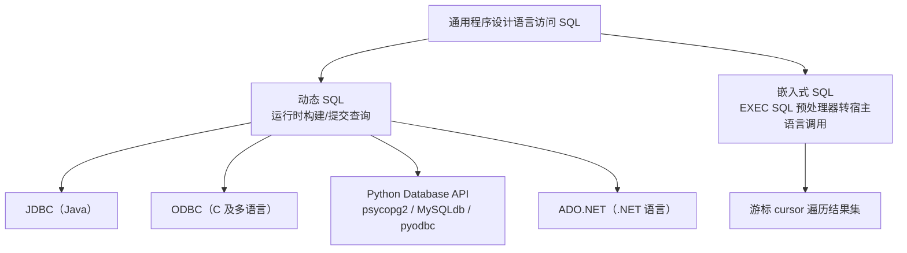
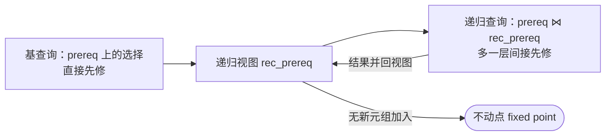
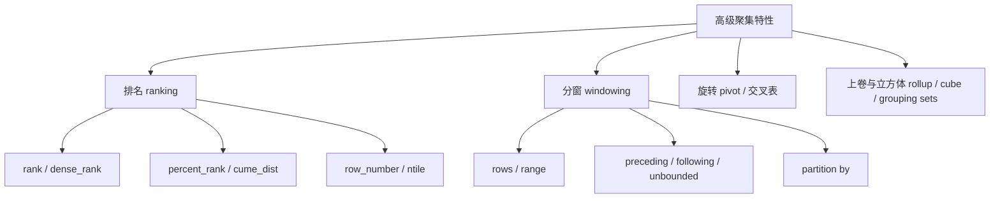

# 第 5 章 高级 SQL

> [!info] 本章在全书中的位置
> 第 3、4 章介绍了 SQL 的基本结构，本章进一步覆盖**用通用程序设计语言访问 SQL**、**过程化扩展（函数/过程/外部例程）**、**触发器**、**递归查询**以及**高级聚集特性**。它是「第 1 部分 关系语言」的收尾章，为后续查询处理、事务管理奠定工程基础。
> 先修：[[11-数据库]]、[[MOC - 数据库系统概念]]、[[SQL]]（第 3 章）、[[中级SQL]]（第 4 章）。

第 3～4 章详细介绍了 SQL 的基本结构。在本章中，我们首先解决如何使用通用程序设计语言来访问 SQL 的问题，这对于构建使用数据库来管理数据的应用程序是非常重要的。然后，我们将介绍 SQL 的一些更高级的特性，从如何在数据库内部执行过程性代码开始，其方式是通过扩展 SQL 语言来支持过程性操作，要么通过允许在数据库内部执行以过程性语言定义的函数。我们将介绍触发器，它可以用来指定在特定事件发生的情况下自动执行的动作，这些事件诸如在指定关系中插入、删除或更新元组。最后，我们将讨论 SQL 支持的递归查询和高级聚集特性。

## 5.1 使用程序设计语言访问 SQL

SQL 提供了一种强大的声明式查询语言。用 SQL 编写查询通常比用通用程序设计语言对同样的查询进行编码要简单得多。然而，基于至少两种原因数据库程序员必须能够访问通用程序设计语言：

1. 因为 SQL 并没有提供通用语言的全部表达能力，所以 SQL 并不能表达所有的查询。也就是说，有可能存在这样的查询，它们可以用诸如 C、Java 或 Python 那样的语言来编写，但不能用 SQL 来表达。要编写这样的查询，我们可以将 SQL 嵌入一种更强大的语言中。
2. 非声明式动作（诸如打印一份报告、和用户交互，或者把查询结果发送到图形化用户界面中）都不能在 SQL 中实现。应用程序通常具有几个组件，并且查询或更新数据只是其中一个组件，其他组件则用通用程序设计语言来实现。对于集成应用来说，必须用某种方式把 SQL 与通用程序设计语言结合起来。

可以通过以下两种方式从通用程序设计语言中访问 SQL。

> [!definition] 动态 SQL（dynamic SQL）
> 通用程序通过一组函数（过程式语言）或方法（面向对象语言）连接到数据库服务器并与之通信。动态 SQL 允许程序在运行时以字符串形式构建 SQL 查询、提交查询，并以每次一个元组的方式把结果存入程序变量中。

> [!definition] 嵌入式 SQL（embedded SQL）
> 与动态 SQL 类似，嵌入式 SQL 也提供程序与数据库服务器交互的方式；但 SQL 语句在编译时由预处理器识别，预处理器将嵌入式 SQL 请求转换为函数调用。运行时这些函数调用使用提供动态 SQL 设施的 API 连接数据库，但 API 可能只适用于正在使用的数据库。

在本章中，我们将介绍两种连接到 SQL 数据库并执行查询和更新的标准。一种是用于 Java 语言的应用程序接口 JDBC（见 5.1.1 节）。另一种是 ODBC（见 5.1.3 节），它最初是为 C 语言开发的应用程序接口，后来扩展到诸如 C++、C#、Ruby、Go、PHP 和 Visual Basic 等其他语言。我们还将说明用 Python 编写的程序如何使用 Python Database API 来连接到数据库（见 5.1.2 节）。

为 Visual Basic .NET 和 C# 语言设计的 ADO.NET API 提供了访问数据的函数，它们在高级别上类似于 JDBC 函数，尽管细节不同。ADO.NET API 也可以用于某些类型的非关系型数据源。ADO.NET 的详细信息可以在联机手册中找到，本章就不再进一步介绍了。

把 SQL 与通用语言相结合的主要挑战是 SQL 与这些语言操纵数据的方式不匹配。在 SQL 中，数据的主要类型是关系；SQL 语句在关系上进行操作，并返回关系作为结果。程序设计语言通常一次操作一个变量，并且这些变量大致相当于关系中一个元组的一个属性的值。因此，为了在单个应用中整合这两种类型的语言，需要提供一种机制，以程序可以处理的方式返回查询的结果。

本节中的示例假设在运行数据库系统的服务器上访问一个数据库。在注释 5-1 中讨论了使用嵌入式数据库（embedded database）的另一种可替代方法。



### 5.1.1 JDBC

JDBC 标准定义了用于将 Java 程序连接到数据库服务器的应用程序接口（Application Program Interface，API）（JDBC 这个词原本是 Java 数据库连接（Java Database Connectivity）的缩写，但此全称已经不再使用了）。

**图 5-1：使用 JDBC 接口的 Java 代码示例**
![[Pasted image 20260721201617.png]]

#### 5.1.1.1 连接到数据库

从 Java 程序访问数据库的第一步是打开一个与数据库的连接。这一步需要选择使用哪个数据库，比如运行在你的机器上的一个 Oracle 实例，或者运行在另一台机器上的一个 PostgreSQL 数据库。只有在打开一个连接以后，Java 程序才能执行 SQL 语句。

通过使用 `DriverManager` 类（在 `java.sql` 中）的 `getConnection()` 方法打开一个连接。该方法有三个参数。

1. 调用 `getConnection()` 的第一个参数是一个字符串，它指定了 URL 或服务器所运行的主机名称（在我们的示例中是 `db.yale.edu`），以及某些可能的其他信息，例如，与数据库通信所用的协议（在我们的示例中是 `jdbc:oracle:thin:`，我们马上就会看到为什么需要它）、数据库系统用来通信的端口号（在我们的示例中是 2000），还有服务器端使用的特定数据库（在我们的示例中是 `univdb`）。请注意 JDBC 只指定 API 而不指定通信协议。一个 JDBC 驱动程序可能支持多种协议，我们必须指定一种数据库和驱动程序都支持的协议。协议的详细内容是由厂商设定的。
2. `getConnection()` 的第二个参数是一个数据库用户的标识，它是一个字符串。
3. 第三个参数是密码，它也是一个字符串。（请注意，如果未经授权的人访问你的 Java 代码，在 JDBC 代码中指定密码会带来安全性风险。）

我们在图中的示例中，已经创建了一个 `Connection` 对象，其句柄是 `conn`。

支持 JDBC（所有主流的数据库厂商都支持）的每个数据库产品都会提供一个 JDBC 驱动程序，该驱动程序必须被动态加载才能实现 Java 对数据库的访问。事实上，必须在连接到数据库之前，首先完成该驱动程序的加载。如果已从厂商的网站下载了合适的驱动程序而且该驱动程序在类路径中，那么 `getConnection()` 方法将定位所需的驱动程序。驱动程序提供了从独立于产品的 JDBC 调用到面向产品的调用的转换，而面向产品的调用是正在使用的特定数据库管理系统所需要的。用于与数据库交换信息的实际协议取决于所使用的驱动程序，并且不由 JDBC 标准来定义。一些驱动程序支持不止一种协议，必须根据特定数据库产品支持何种协议来选择一种合适的协议。在我们的示例中，当打开与数据库的连接时，字符串 `jdbc:oracle:thin:` 指定了 Oracle 所支持的具体协议。MySQL 的等价表示是 `jdbc:mysql:`。

#### 5.1.1.2 向数据库系统中传递 SQL 语句

一旦打开一个数据库连接，程序就可以利用该连接来向数据库发送 SQL 语句用于执行。这是通过 `Statement` 类的一个实例来完成的。一个 `Statement` 对象本身并不是 SQL 语句，而是允许 Java 程序调用方法的一个对象，这些方法将给定的 SQL 语句作为参数发送给数据库系统来执行。我们的示例在 `conn` 连接上创建了一个 `Statement` 句柄（`stmt`）。

我们既可以调用 `executeQuery()` 方法又可以调用 `executeUpdate()` 方法来执行一条语句，这取决于这条 SQL 语句是查询语句（如果是查询语句，则会返回一个结果集），还是诸如更新（update）、插入（insert）、删除（delete）或创建表（create table）这样的非查询语句。在我们的示例中，`stmt.executeUpdate()` 执行一条向 `instructor` 关系中进行的插入的更新语句。它返回一个整数，给出插入、更新或者删除元组的数量。对于 DDL 语句，其返回值为零。

#### 5.1.1.3 异常与资源管理

执行任何 SQL 方法都可能导致引发异常。`try {...} catch {...}` 结构允许我们捕获在进行 JDBC 调用时出现的任何异常（错误情况），并采取适当的操作。在 JDBC 编程中，它可能有助于区分 `SQLException`（这是面向 SQL 的异常）和 `Exception` 的一般情况（它可以是任何 Java 异常，比如空指针异常或数组下标越界异常）。我们在图 5-1 中显示了这两种异常。实际上，人们编写的异常处理程序应该比我们在示例代码中编写的（为了简洁起见）更为完整。

打开连接、语句和其他 JDBC 对象都是消耗系统资源的操作。程序员必须注意确保程序关闭所有这些资源。否则可能会导致数据库系统的资源池被耗尽，使得系统在超时期限到期之前无法访问或无法操作。关闭资源的一种方式是编写显式调用来关闭连接和语句。如果代码由于异常而退出，则此方式将失效，因为带关闭调用的 Java 语句没有被使用。出于这样的原因，首选方式是使用 Java 中的 `try-with-resources` 结构。在图 5-1 的示例中，连接和语句对象的打开是在括号内完成的，而不是在花括号内 `try` 的主体中完成的。在括号内代码中打开的资源在 `try` 块结尾处自动关闭。这样可以防止我们让连接或语句处于未关闭状态。由于关闭一条语句会隐式关闭为该语句打开的对象（即我们将在下一节中讨论的 `ResultSet` 对象），因此这种编码方式可以防止我们让资源处于未关闭状态。在图 5-1 的示例中，我们可以用 `conn.close()` 语句来显式地关闭连接，并用 `stmt.close()` 来显式地关闭语句，尽管在我们的示例中是不必这样做的。

#### 5.1.1.4 获取查询结果

图 5-1 的示例代码通过使用 `stmt.executeQuery()` 来执行一次查询。它把结果中的元组集提取到 `ResultSet` 对象 `rset` 中，并每次取出一个元组进行处理。结果集上的 `next()` 方法用来测试在结果集中是否还存在至少一个尚未提取的元组，如果存在就取出该元组。`next()` 方法的返回值是一个布尔变量，它表示该方法是否提取了一个元组。通过使用名称以 `get` 打头的各种方法可以检索来自所提取元组的各个属性。`getString()` 方法可以检索任何基本的 SQL 数据类型（并将值转换成 Java String 对象），当然也可以使用像 `getFloat()` 那样的约束性更强的方法。各种 `get` 方法的参数既可以是被指定为一个字符串的属性名，又可以是一个整数，它表明所需属性在元组中的位置。图 5-1 给出了在元组中提取属性值的两种方式：利用属性名（`dept_name`）提取以及利用属性位置（2，代表第二个属性）提取。

#### 5.1.1.5 预备语句

我们可以创建一条预备语句，其中用 “?” 来代替某些值，以此指明以后会提供实际的值。数据库系统在预备查询的时候对其进行编译。在每次执行该查询时（用新值去替换那些 “?”），数据库系统可以重用此前编译的查询形式，将新的值作为参数来应用。图 5-2 的代码片段展示了如何使用预备语句。

**图 5-2：JDBC 代码中的预备语句**
![[Pasted image 20260721201628.png]]

`Connection` 类的 `prepareStatement()` 方法定义一个查询，该查询可以包含参数值。一些 JDBC 驱动程序可以将查询作为方法的一部分提交到数据库进行编译，但其他驱动程序此时并未与数据库联系。此方法返回一个 `PreparedStatement` 类的对象。此时还尚未执行任何 SQL 语句。执行需要 `PreparedStatement` 类的两个方法 `executeQuery()` 和 `executeUpdate()`。但是在它们被调用之前，我们必须使用 `PreparedStatement` 类的方法来为 “?” 参数赋值。`setString()` 方法以及诸如 `setInt()` 那样的用于其他基本 SQL 类型的类似方法允许我们为参数指定值。第一个变量指明我们为哪个 “?” 参数赋值（第一个参数是 1，区别于大多数其他的 Java 结构，这些结构是从 0 开始的）。第二个变量指定要赋予的值。

在图 5-2 的示例中，我们预备了一条 `insert` 语句，设定了 “?” 参数，并且随后调用 `executeUpdate()`。该示例的最后两行表明：直到我们特别地进行重新设定为止，参数赋值保持不变。这样，最后的语句调用 `executeUpdate()`，插入元组（“88878”，“Perry”，“Finance”，125000）。

在同一查询编译一次然后带不同参数值运行多次的情况下，预备语句使得执行更加高效。然而，只要查询使用用户输入的值，即使该查询只运行一次，预备语句也有一个更为重要的优势使得它们成为执行 SQL 查询的首选方法。假设我们读取一个用户输入的值，然后使用 Java 的字符串操作来构造 SQL 语句。如果用户输入了某些特殊字符，例如一个单引号，除非我们格外小心地检查用户输入，否则生成的 SQL 语句会出现语法错误。`setString()` 方法为我们自动完成这样的检查，并插入所需的转义字符以确保语法的正确性。

在我们的示例中，假设用户已经输入了对于 ID、name、dept_name 和 salary 这些变量的值，并且相应的行将被插入 `instructor` 关系中。假设不使用预备语句，而是使用如下的 Java 表达式把字符串拼接起来以构造查询：

```java
"insert into instructor values('" + ID + "', '" + name + "', '" +
"'" + dept_name + "', " + salary + ")"
```

并且使用 `Statement` 对象的 `executeQuery()` 方法来直接执行查询。请注意字符串中单引号的使用，单引号将在生成的 SQL 查询中包围 ID、name 和 dept_name 的值。

现在，如果用户在 ID 或者姓名字段中敲入了一个单引号，查询字符串就会出现语法错误。一位教师的姓名中很有可能带有引号（例如 “O'Henry”）。

也许以上示例会被认为是令人讨厌的，但情况可能会糟得多。一种叫作 **SQL 注入**（SQL injection）的技术可以被恶意黑客用来窃取数据或损坏数据库。

假设一段 Java 程序输入一个字符串 `name`，并且构建查询：

```java
"select * from instructor where name = '" + name + "'"
```

如果用户输入的不是一个姓名，而是：

```
X' or 'Y' = 'Y
```

那么，所产生的语句就变成：

```java
"select * from instructor where name = '" + "X' or 'Y' = 'Y" + "'"
```

即为

```sql
select * from instructor where name = 'X' or 'Y' = 'Y'
```

在生成的查询中，`where` 子句总是为真，并且返回整个教师关系。

更诡计多端的恶意用户可能安排输出甚至更多的数据，包括诸如密码之类的资质，这些资质允许用户连接到数据库并执行其想要的任何操作。可以使用更新（update）语句上的 SQL 注入攻击来更改在更新列中存储的值。实际上在现实世界中已经发生了许多使用 SQL 注入的攻击。通过使用 SQL 注入，对多个金融网站的攻击已导致大量资金被盗窃。

使用预备语句就可以避免这类问题，因为输入的字符串将被插入转义字符，因此所产生的查询变为：

```sql
"select * from instructor where name = 'X\' or \'Y\' = \'Y'"
```

这是无害的语句，并返回空的关系。

程序员必须仅通过预备语句的参数将用户输入的字符串传递给数据库；通过使用用户输入值串接起来的字符串来创建 SQL 查询存在极其严重的安全风险，并且在任何程序中都不应该这样做。

有些数据库系统允许在单个 JDBC 的 `execute` 方法中执行多条 SQL 语句，语句之间用分号分隔。由于 JDBC 驱动程序允许恶意的黑客使用 SQL 注入来插入整条 SQL 语句，因此该特性在某些 JDBC 驱动程序上被默认关闭了。例如，在我们前面的 SQL 注入示例中，一个恶意的用户可以输入：

```
X'; drop table instructor; --
```

这将导致向数据库提交一个查询字符串，其中包含两条用分号分隔的语句。由于这些语句以 JDBC 连接所使用的数据库用户标识的权限运行，因此它可以执行破坏性的 SQL 语句，例如删除表（`drop table`）或对用户所选择的任何表进行更新。但是，某些数据库仍然允许执行如上所述的多条语句。因此，正确使用预备语句以避免 SQL 注入的风险是非常重要的。

#### 5.1.1.6 可调用语句

JDBC 还提供了 `CallableStatement` 接口，它允许调用 SQL 的存储过程和函数（将在 5.2 节中描述）。此接口对函数和过程所扮演的角色跟 `prepareStatement` 对查询所扮演的角色一样。

```java
CallableStatement cStmt1 = conn.prepareCall("{? = call some_function(?)}");
CallableStatement cStmt2 = conn.prepareCall("{call some_procedure(?,?)}");
```

函数返回值和过程输出参数的数据类型必须先用 `registerOutParameter()` 方法注册，并可以用与结果集类似的 `get` 方法来检索。请参阅 JDBC 手册以获得更详细的信息。

#### 5.1.1.7 元数据特性

正如我们此前提到的，Java 应用程序不包含对数据库中所存储数据的声明。这些声明是 SQL DDL 的一部分。因此，使用 JDBC 的 Java 程序必须要么将关于数据库模式的获取硬编码到程序中，要么在运行时直接从数据库系统得到那些信息。后一种方法通常更可取，因为它使得应用程序可以更健壮地应对数据库模式的变化。

请回想一下：当我们使用 `executeQuery()` 方法提交一个查询时，查询结果被封装在一个 `ResultSet` 对象中。`ResultSet` 接口有一个 `getMetaData()` 方法，它返回一个包含关于结果集的元数据的 `ResultSetMetaData` 对象。`ResultSetMetaData` 又进一步具有查找元数据信息的方法，例如结果中的列数、指定列的名称或者指定列的类型。通过这样的方式，即使我们事先不知道结果的模式，也可以编写代码来执行查询。

下面的 Java 代码片段使用 JDBC 来打印出一个结果集的所有列的名称和类型。假定代码中的变量 `rs` 指代通过执行查询而获得的一个 `ResultSet` 实例。

```java
ResultSetMetaData rsmd = rs.getMetaData();
for(int i = 1; i <= rsmd.getColumnCount(); i++) {
    System.out.println(rsmd.getColumnName(i));
    System.out.println(rsmd.getColumnTypeName(i));
}
```

`getColumnCount()` 方法返回结果关系的元数（属性个数）。这使得我们能够遍历每个属性（请注意，与 JDBC 的惯例一致，我们从 1 开始）。对于每个属性，我们采用 `getColumnName()` 和 `getColumnTypeName()` 两种方法来分别检索它的名称和数据类型。

`DatabaseMetaData` 接口提供了查找关于数据库的元数据的方法。`Connection` 接口具有一个 `getMetaData()` 方法，它返回一个 `DatabaseMetaData` 对象。`DatabaseMetaData` 接口又进一步具有大量的方法来获取关于程序所连接的数据库和数据库系统的元数据。

例如，有些方法可以返回数据库系统的产品名称和版本号。另外一些方法允许应用程序来查询数据库系统所支持的特性。

还有其他方法返回有关数据库本身的信息。图 5-3 中的代码展示了如何查找数据库中有关关系的列（属性）信息。假定 `conn` 变量是一个已打开的数据库连接的句柄。`getColumns()` 方法有四个参数：一个目录名称（为空表示目录名称将被忽略）、一个模式名样式、一个表名样式以及一个列名样式。模式名、表名和列名的样式可以用于指定一个名称或式样。式样可以使用 SQL 字符串匹配的特殊字符 “%” 和 “_”，例如，式样 “%” 匹配所有的名称。只有满足特定名称或式样的模式的表的列被检索出来。结果集中的每行包含有关一个列的信息。这些行具有若干列，比如目录名、模式名、表名、列名、列的类型等。

**图 5-3：在 JDBC 中使用 DatabaseMetaData 查找列信息**
![[Pasted image 20260721201636.png]]

`getTables()` 方法允许获取数据库中所有表的列表。`getTables()` 的前三个参数与 `getColumns()` 是相同的。第四个参数可用于限制所返回的表的类型；如果被设置为空，则返回所有表，包括系统内部表，但该参数可以设置为仅返回由用户创建的表。

`DatabaseMetaData` 还提供了其他方法来获取与数据库相关的信息，包括获取主码的方法（`getPrimaryKeys()`）、获取外码引用的方法（`getCrossReference()`）、获取授权的方法、获取诸如最大连接数那样的数据库限制的方法等。

元数据接口可以用于各种任务。例如，它们可以用于编写数据库浏览器，该浏览器允许用户查找数据库中的表，检查它们的模式，检查表中的行，应用选择来查看所需的行等。元数据信息可以使得用于这些任务的代码更为通用，例如，可以以能够在任何种模式下的所有可能的关系上都有效的方式，来编写代码展示一个关系中的行。类似地，可以编写代码来接受查询字符串、执行该查询并将结果打印为一个格式化的表；无论实际提交的查询是什么，这段代码都可以工作。

#### 5.1.1.8 其他特性

JDBC 提供了许多其他特性，比如可更新的结果集（updatable result set）。它可以根据数据库关系上执行选择或投影的查询来创建出可更新的结果集。对结果集中元组的更新将导致对数据库关系的相应元组的更新。

请回想一下 4.3 节，事务允许将多个操作视为一个可以被提交或者回滚的单个原子性单元。在缺省情况下，每条 SQL 语句都被视为一个自动提交的独立事务。JDBC 的 `Connection` 接口中的 `setAutoCommit()` 方法允许打开或关闭这种自动提交的行为。因此，如果 `conn` 是一个打开的连接，则 `conn.setAutoCommit(false)` 将关闭自动提交。然后事务必须要么使用 `conn.commit()` 来显式提交，要么使用 `conn.rollback()` 来显式回滚。自动提交可以用 `conn.setAutoCommit(true)` 来打开。

JDBC 提供了处理大对象的接口，而不要求在内存中创建整个大对象。为了获取大对象，`ResultSet` 接口提供了 `getBlob()` 和 `getClob()` 方法，它们与 `getString()` 方法相似，但是分别返回类型为 `Blob` 和 `Clob` 的对象。这些对象并不存储整个大对象，而是存储这些大对象的“定位器”，也就是指向数据库中实际的大对象的逻辑指针。从这些对象中获取数据非常类似于从文件或输入流中获取数据，并且可以采用诸如 `getBytes()` 和 `getSubString()` 那样的方法来实现。

为了在数据库中存储大对象，可以用 `PreparedStatement` 类的 `setBlob(intparameterIndex, InputStream inputStream)` 方法把一个类型为二进制大对象（blob）的数据库列与一条输入流（例如已被打开的文件）关联起来。当执行预备语句时，数据从输入流被读取，然后被写入数据库的二进制大对象中。相似地，使用以参数索引和字符串流为参数的 `setClob()` 方法可以设置字符大对象（clob）的列。

JDBC 还提供了行集（row set）特性，它允许收集结果集并将其发送给其他应用程序。行集既可以向后又可以向前扫描，并且可以被修改。

### 5.1.2 从 Python 访问数据库

从 Python 访问数据库可以通过如图 5-4 所示的方法来完成。包含 `insert` 查询的语句显示了如何使用与 JDBC 预备语句等价的 Python 语句，其中的参数在 SQL 查询中由 “%s” 来标识，并且参数值是作为列表提供的。更新不会自动提交到数据库，需要调用 `commit()` 方法来提交更新。

`try: ... except: ...` 块显示了如何捕获异常并打印有关异常的信息。`for` 循环说明了如何在查询执行的结果上进行循环，以及如何访问特定的各个属性。

该程序使用 `psycopg2` 驱动程序，它允许连接到 PostgreSQL 数据库，并在程序的第一行导入。驱动程序通常是面向数据库的，使用 `MySQLdb` 驱动程序连接到 MySQL，使用 `cx_Oracle` 连接到 Oracle；但是 `pyodbc` 驱动程序可以连接到支持 ODBC 的大多数数据库。程序中使用的 Python 数据库 API 是通过许多数据库的驱动程序来实现的，但是与 JDBC 不同，在跨不同驱动程序的 API 中存在细微的差别，特别是在 `connect()` 函数的参数方面。

**图 5-4：从 Python 访问数据库（psycopg2 示例）**
![[Pasted image 20260721201645.png]]

### 5.1.3 ODBC

开放数据库连接（Open DataBase Connectivity，ODBC）标准定义了一个 API，应用程序可以用它来打开与一个数据库的连接、发送查询和更新并获取返回结果。诸如图形化用户界面、统计程序包以及电子表格那样的应用程序可以使用相同的 ODBC API 来连接到支持 ODBC 的任何数据库服务器。

**图 5-5：使用 ODBC API 的 C 语言代码示例**
![[Pasted image 20260721201653.png]]

每个支持 ODBC 的数据库系统都提供一个必须和客户端程序相链接的库。当客户端程序调用一个 ODBC API 时，库中的代码就和服务器进行通信以执行被请求的动作并获取结果。

图 5-5 给出了一段使用 ODBC API 的 C 语言代码示例。利用 ODBC 与服务器通信的第一步是建立与服务者的连接。为此，程序先分配一个 SQL 环境变量，然后分配一个数据库连接句柄。ODBC 定义了 `HENV`、`HDBC` 和 `RETCODE` 类型。程序随后通过使用 `SQLConnect` 打开数据库的连接，此调用需要几个参数，包括连接句柄、要连接的服务器、用户标识和用于数据库的密码。常量 `SQL_NTS` 表示前面的参数是一个以 null 结尾的字符串。

一旦建立起连接，程序就可以通过使用 `SQLExecDirect` 向数据库发送 SQL 命令。因为 C 语言的变量可以和查询结果的属性绑定，所以当使用 `SQLFetch` 来获取结果元组时，其属性值被存储在相应的 C 变量中。`SQLBindCol` 函数执行此项任务。第二个参数标识属性在查询结果中的位置，第三个参数指明从 SQL 到 C 所需的类型转换。下一个参数给出变量的地址。对于像字符串数组那样的变长类型，最后两个参数还要给出变量的最大长度以及当获取元组时要存储实际长度的位置。长度字段返回负值表示该值为空（null）。对于诸如整型或浮点型那样的定长类型，最大长度字段被忽略，然而长度字段返回负值则表示一个空值。

`SQLFetch` 语句在 `while` 循环中一直执行，直到 `SQLFetch` 返回一个非 `SQL_SUCCESS` 的值。在每次取值时，程序把值存放在由 `SQLBindCol` 调用所指定的 C 变量中，并输出这些值。

在会话结束的时候，程序释放语句的句柄，断开与数据库的连接，同时释放连接句柄和 SQL 环境句柄。好的编程风格要求必须检查每一个函数调用的结果，以确保没有出现错误；为了简洁起见，我们省略了大部分这样的检查。

可以创建一条带有参数的 SQL 语句，例如，请考虑语句 `insert into department values(?, ?, ?)`。问号是为后面将提供的值而设置的占位符。上面的语句可以被“预备”，也就是说，在数据库中原编译，并通过为占位符提供实际值来反复执行——在本例中，是通过为 `department` 关系提供系名、教学楼和预算。

ODBC 为各种任务都定义了函数，例如查找数据库中的所有关系，以及查找查询结果或数据库中关系的列的名称和类型。

在缺省情况下，每条 SQL 语句都被认为是一个自动提交的单独事务。`SQLSetConnectOption(conn, SQL_AUTOCOMMIT, 0)` 关闭 `conn` 连接上的自动提交，然后事务必须通过 `SQLTransact(conn, SQL_COMMIT)` 来显式提交或通过 `SQLTransact(conn, SQL_ROLLBACK)` 来显式回滚。

ODBC 标准定义了适应性级别（conformance level），用于指定由标准定义的函数子集。一个 ODBC 实现可以仅提供核心级特性，也可以提供更高级（级别 1 或级别 2）的特性。级别 1 要求支持获取目录的有关信息，例如有关当前关系及其属性类型的信息。级别 2 需要更多的特性，例如发送和检索参数数值数组以及检索更详细的目录信息的能力。

SQL 标准定义了一个与 ODBC 接口类似的**调用层接口**（Call Level Interface，CLI）。

### 5.1.4 嵌入式 SQL

SQL 标准定义了将 SQL 嵌入各种程序设计语言（比如 C、C++、Cobol、Pascal、Java、PL/I 和 Fortran）中的方法。嵌入了 SQL 查询的语言被称为**宿主**（host）语言，并且在宿主语言中允许使用的 SQL 结构构成了**嵌入式 SQL**。

> [!definition] 游标（cursor）
> 在嵌入式 SQL 中，用于遍历查询结果的关系变量。声明后打开，在宿主语言循环中发出 `fetch` 命令获取连续行，行的属性可提取到宿主语言变量中；也可用于更新游标当前指向的行。

用宿主语言编写的程序可以使用嵌入式 SQL 的语法来访问和更新存储在数据库中的数据。嵌入式 SQL 程序在编译之前必须先由特殊的预处理器进行处理。该预处理器将嵌入的 SQL 请求替换为宿主语言的声明以及允许运行时执行数据库访问的过程调用。然后，所产生的程序由宿主语言编译器进行编译。这是嵌入式 SQL 与 JDBC 或 ODBC 之间的主要区别。

为使预处理器识别出嵌入式 SQL 请求，我们使用 `EXEC SQL` 语句，它具有如下格式：

```sql
EXEC SQL <嵌入式 SQL 语句>;
```

在执行任何 SQL 语句之前，程序必须首先连接到数据库。在嵌入式 SQL 语句中可以使用宿主语言的变量，不过它们的前面必须加上冒号（:）以将它们与 SQL 变量区分开来。

要遍历一个嵌入式 SQL 查询的结果，我们必须声明一个**游标**（cursor）变量，它可以随后被打开，并在宿主语言循环中发出获取（`fetch`）命令来获取查询结果的连续行。行的属性可以提取到宿主语言变量中。数据库更新也可以通过以下方式实现：使用关系上的游标来遍历关系的行，或使用 `where` 子句来仅遍历所选的行。嵌入式 SQL 命令可用于更新游标所指向的当前行。

嵌入式 SQL 请求的确切语法取决于嵌入 SQL 的语言。可以参考你所使用的特定语言的嵌入语法的手册以获取更多详细信息。

在 JDBC 中，SQL 语句在运行时进行解释（即使它们是使用预备语句功能来创建的）。当使用嵌入式 SQL 时，在预处理时有可能捕获一些与 SQL 有关的错误（包括数据类型错误）。与在程序中使用动态 SQL 相比，嵌入式 SQL 程序中的 SQL 查询也更容易理解。但是，嵌入式 SQL 也存在一些缺点。预处理器会创建新的宿主语言代码，这可能会使程序的调试复杂化。预处理器用于标识 SQL 语句的结构可能在语法上与宿主语言在后续版本中所引入的宿主语言语法发生冲突。

其结果是，当前大多数系统使用动态 SQL，而不是嵌入式 SQL。微软语言集成查询（Microsoft Language Integrated Query，LINQ）工具是一种例外，它扩展了宿主语言以包括对查询的支持，而不是使用预处理器将嵌入式 SQL 查询转换为宿主语言。

> [!note] 注释 5-1 嵌入式数据库
> JDBC 和 ODBC 都假设服务器在托管数据库的数据库系统上运行。某些应用程序使用完全存在于应用程序中的数据库。此类应用程序仅为内部使用而维护数据库，并且除非通过应用程序本身，否则无法访问到数据库。在这种情况下，可以使用嵌入式数据库（embedded database）以及使用实现了可从程序设计语言中访问的 SQL 数据库的几种包中的一种。
> [!warning] 待核实：原书嵌入式数据库清单
> 原文转录为「Java DB、SQLite、HSQLBD 和 2」。其中 `HSQLBD` 应为 `HSQLDB`；结尾孤立的「2」高度疑似 `H2`（另一个常见的 Java 嵌入式数据库）。本笔记据上下文修正为「Java DB、SQLite、HSQLDB 和 H2」，请对照原书（第 6 版第 5 章）核实。

嵌入式数据库系统缺少完全基于服务器的数据库系统的许多特性，但是它们为那些可以从数据库抽象中受益而无须支持超大型数据库或大规模事务处理的应用程序提供了优势。

请不要将嵌入式数据库与嵌入式 SQL 相混淆，后者是连接到服务器上运行的数据库的一种方式。

## 5.2 函数和过程

我们已经见识过内置在 SQL 语言中的几个函数。在本节中，我们将展示开发者如何编写他们自己的函数和过程，把它们存储在数据库里并随后在 SQL 语句中调用它们。函数对于诸如图像和几何对象那样的特定数据类型来说特别有用。例如，地图数据库中使用的一个线段数据类型可能有一个相关联的函数用于检测两条线段是否重叠，并且一个图像数据类型可能有一个相关联的函数用于比较两幅图像的相似性。

函数和过程允许“业务逻辑”被存储在数据库中，并从 SQL 语句中执行。例如，大学通常有许多规章制度，规定在一个给定学期里一名学生可以选多少门课，在一年里一位全职教师必须最少讲授多少门课，一名学生最多可以注册多少个专业，等等。尽管这样的业务逻辑可以被编码成程序设计语言的过程并完全存储在数据库以外，但把它们定义成数据库中的存储过程有几种优势。例如，它们允许多个应用程序来访问这些过程，并允许当业务规则发生变化时进行单点改变，而不必改变应用程序的其他部分。然后应用程序代码可以调用存储过程，而不是直接更新数据库关系。

> [!definition] 持久存储模块（Persistent Storage Module，PSM）
> SQL 标准中处理过程性结构（变量声明、`begin ... end` 复合语句、`while`/`repeat`/`for` 循环、`if-then-else`、`case`、异常处理句柄等）的部分，赋予 SQL 通用程序设计语言几乎全部的能力。

SQL 允许定义函数、过程和方法。它们要么可以通过 SQL 的过程性组件来定义，要么可以通过诸如 Java、C 或 C++ 那样的外部程序设计语言来定义。我们首先看看 SQL 中的定义，然后在 5.2.3 节中将了解如何使用外部语言来进行定义。

尽管我们在这里介绍的是 SQL 标准所定义的语法格式，然而大多数数据库都实现了这种语法的非标准版本。例如，Oracle（PL/SQL）、Microsoft SQL Sever（TransactSQL）和 PostgreSQL（PL/pgSQL）所支持的过程性语言都与我们在这里描述的标准语法有所差别。我们将在注释 5-2 中用 Oracle 来举例说明某些不同之处。更进一步的详细信息可参见各自的系统手册。尽管我们在这里介绍的部分语法在这些系统上并不支持，但是我们所述的概念在不同的实现上都是适用的，虽然存在语法上的区别。

### 5.2.1 声明及调用 SQL 函数和过程

假定我们想要这样一个函数：给定一个系的名称，返回该系的教师数量。我们可以如图 5-6 所示来定义函数。这个函数可以在查询中用来返回多于 12 位教师的所有系的名称和预算：

```sql
select dept_name, budget
from department
where dept_count(dept_name) > 12;
```

**图 5-6：用 SQL 定义的函数 `dept_count`**
![[Pasted image 20260721201710.png]]

如果是在大量的元组上调用函数，那么当在查询中调用复杂的用户自定义函数时，在许多数据库系统上都会出现性能问题。因此，程序员在决定是否要在查询中使用用户自定义函数时应该考虑性能因素。

SQL 标准支持以返回表作为结果的函数；这种函数称为**表函数**（table function）。请考虑图 5-7 中定义的函数。该函数返回一个包含特定系的所有教师的表。请注意，当引用函数的参数时需要给它加上函数名作为前缀（`instructor_of.dept_name`）。

此函数可以按如下方式在查询中使用：

```sql
select *
from table(instructor_of('Finance'));
```

该查询返回 `Finance` 系的所有教师。在这种简单情况下不使用以表为值的函数来写这个查询也是很直观的。但是，以表为值的函数通常可以被看作**参数化视图**（parameterized view），它通过允许参数来泛化常规的视图概念。

**图 5-7：SQL 中的表函数 `instructor_of`**
![[Pasted image 20260721201718.png]]

SQL 也支持过程。`dept_count` 函数也可以写成一个过程：

```sql
create procedure dept_count_proc(in dept_name varchar(20),
                                  out d_count integer)
begin
    select count(*) into d_count
    from instructor
    where instructor.dept_name = dept_count_proc.dept_name
end
```

关键字 `in` 和 `out` 分别表示待赋值的参数和为了返回结果而在过程中设置值的参数。可以从一个 SQL 过程中或者从嵌入式 SQL 中通过使用 `call` 语句来调用过程：

```sql
declare d_count integer;
call dept_count_proc('Physics', d_count);
```

过程和函数可以从动态 SQL 中调用，正如 5.1.1.5 节中的 JDBC 语法所示。

SQL 允许不止一个过程具有相同的名称，只要同名过程的参数数量是不同的。名称和参数数量一起用于标识过程。SQL 也允许不止一个函数具有相同的名称，只要这些同名不同函数要么具有不同的参数数量，要么对于具有相同数量参数的函数来说，它们至少有一个参数的类型是不同的。

### 5.2.2 用于过程和函数的语言结构

SQL 所支持的结构赋予了它通用程序设计语言几乎所有的能力。SQL 标准中处理这些结构的部分称为**持久存储模块**（Persistent Storage Module，PSM）。

使用 `declare` 语句可以声明变量，变量可以是任意合法的 SQL 数据类型。使用 `set` 语句可以进行赋值。

复合语句具有 `begin ... end` 的形式，并且它可以在 `begin` 和 `end` 之间包含多条 SQL 语句。正如我们曾在 5.2.1 节中看到过的，可以在复合语句中声明局部变量。形如 `begin atomic ... end` 的复合语句确保其中包含的所有语句作为单个事务来执行。

`while` 语句和 `repeat` 语句的语法如下：

```sql
while 布尔表达式 do
    语句序列；
end while

repeat
    语句序列；
until 布尔表达式
end repeat
```

还有 `for` 循环，它允许在查询的所有结果上进行循环：

```sql
declare n integer default 0;
for r as
    select budget from department
    where dept_name = 'Music'
do
    set n = n - r.budget
end for
```

该程序每次将查询结果的一行获取到 `for` 循环变量（上面示例中的 \(r\)）中。`leave` 语句可用来退出循环，而 `iterate` 则用来跳过剩余语句，从循环的开始处理下一个元组。

SQL 支持的条件语句包括使用以下语法的 `if-then-else` 语句：

```sql
if 布尔表达式
    then 语句或复合语句
elseif 布尔表达式
    then 语句或复合语句
else 语句或复合语句
end if
```

SQL 也支持 `case` 语句，类似于 C/C++ 语言的 `case` 语句（加上我们在第 3 章中看到过的 `case` 表达式）。

图 5-8 提供了一个在 SQL 中使用过程化结构的更大型的示例。图中定义的 `registerStudent` 函数在确认选修一门课的学生数没有超过分配给该门课的教室容量之后，在该门课中注册一名学生。函数返回一个错误代码；这个值大于或等于 0 表示成功，为负表示一种错误状态，同时以 `out` 参数的形式返回一条消息来说明出错的原因。

**图 5-8：为一门课注册一名学生的过程（`registerStudent`）**
![[Pasted image 20260721201727.png]]
**图 5-8（续）**
![[Pasted image 20260721201734.png]]

SQL 的过程化语言还支持对异常情况（exception condition）的信号发送，以及对处理异常的句柄（handler）的声明，如这段代码中所示：

```sql
declare out_of_classroom_seats condition
declare exit handler for out_of_classroom_seats
begin
    语句序列；
end
```

`begin` 和 `end` 之间的语句可以通过执行 `signal out_of_classroom_seats` 来引发一个异常。这个句柄说明：如果异常情况发生，将会采取动作来从 `begin end` 的语句中退出。`continue` 是另一种可选动作，它从引发异常的语句的下一条语句继续执行。除了明确定义的情况之外，还有一些诸如 `sqlexception`、`sqlwarning` 和 `not found` 那样的预定义情况。

> [!note] 注释 5-2 过程和函数的非标准化语法
> 尽管 SQL 标准为过程和函数定义了语法，但是大多数数据库并不严格遵循该标准，并且所支持的语法有很大的差异。造成这种情况的原因之一是：这些数据库通常在语法被标准化之前就引入了对过程和函数的支持，并且它们一直沿用其原始语法。在这里不可能列出每个数据库所支持的语法，但是我们通过下面显示的来自图 5-6 的函数在 PL/SQL 中定义的版本来说明 Oracle 的 PL/SQL 中的一些差异。
> ```sql
> create function dept_count (dname in instructor.dept_name%type) return integer
> as
> d_count integer;
> begin
>     select count(*) into d_count
>     from instructor
>     where instructor.dept_name = dname;
>     return d_count;
> end;
> ```
> 虽然这两个版本在概念上是相似的，但有很多细微的语法差异，其中一些在比较函数的这两个版本时是明显的。尽管这里没有显示，但是在 PL/SQL 中控制流的语法与这里给出的语法也有一些不同。
> 请注意，PL/SQL 允许通过添加后缀 `%type` 来将一种类型指定为关系属性的类型。另外，PL/SQL 并不直接支持返回表的功能，尽管存在通过创建表类型来实现此功能的间接方式。其他数据库所支持的过程化语言也有大量语法和语义上的差异。更多信息请参阅相应语言的参考资料。使用存储的过程和函数的非标准化语法是将应用程序移植到不同数据库的一种障碍。

### 5.2.3 外部语言例程

尽管对 SQL 的过程化扩展非常有用，然而可惜的是它们并不被跨数据库的标准方式所支持。即使是最基本的特性在不同数据库中都可能有不同的语法或语义。其结果是，程序员必须针对每种数据库产品学习一门新的语言。还有另一种可替代方案可以解决语言支持的问题，即在一种命令式程序设计语言中定义过程，但允许从 SQL 查询和触发器的定义中来调用它们。

SQL 允许我们用诸如 Java、C#、C 或 C++ 那样的程序设计语言来定义函数。以这种方式定义的函数会比用 SQL 定义的函数效率更高，并且在 SQL 中无法执行的计算可以由这些函数来执行。

外部过程和函数可以通过这样的方式来指定（请注意，确切的语法取决于你所使用的特定数据库系统）：

```sql
create procedure dept_count_proc(in dept_name varchar(20),
                                 out count integer)
language C
external name '/usr/avi/bin/dept_count_proc'

create function dept_count (dept_name varchar(20))
returns integer
language C
external name '/usr/avi/bin/dept_count'
```

通常来说，外部语言过程需要处理参数（包括 `in` 和 `out` 参数）中的空值和返回值。它们还需要传递失败/成功的状态并处理异常情况。这些信息可以通过额外的参数来传递：一个指明失败/成功状态的 `sqlstate` 值、一个存储函数返回值的参数，以及一些指明每个参数/函数结果的值是否为空指示变量。还可以通过其他机制来处理空值，例如，可以传递指针而不是值。具体采用哪种机制取决于数据库。不过，如果一个函数并不处理这些情况，可以在声明中添加额外的一行 `parameter style general` 来指明外部过程/函数只接受显示的参数并且不处理空值或异常。

用程序设计语言定义并在数据库系统之外编译的函数可以被加载并与数据库系统代码一起执行。不过这么做会带来这样的风险：程序中的错误可能破坏数据库的内部结构，并且可以绕过数据库系统的访问控制功能。如果数据库系统关注高效的执行胜过安全性，可以采用这种方式来执行过程。关注安全性的数据库系统可以将这种代码作为一个单独进程的一部分来执行，通过进程间通信传递参数的值并取回结果。然而，进程间通信的时间开销相当高；在典型的 CPU 体系结构上，在一次进程间通信所花费的时间内可以执行数万条到数十万条指令。

如果代码是用诸如 Java 或 C# 那样的“安全”语言来编写的，则存在另一种可能：在数据库查询执行进程本身的沙盒（sandbox）里来执行代码。沙盒允许 Java 或 C# 代码来访问它自己的内存区域，但它阻止代码读取或更新查询执行进程的内存，或者访问文件系统中的文件。（对于诸如 C 那样的语言来说，创建沙盒是不可能的，因为 C 允许通过指针不受限制地访问内存。）避免进程间通信大大降低了函数调用的开销。

当今有几个数据库系统支持在查询执行进程内的沙盒里来运行外部语言例程。例如，Oracle 和 IBM DB2 允许 Java 函数作为数据库进程的一部分来运行。Microsoft SQL Server 允许将过程编译到通用语言运行库（Common Language Runtime，CLR）中以便在数据库进程内执行；此类过程可以用诸如 C# 或 Visual Basic 等语言来编写。PostgreSQL 允许用多种语言来定义函数，比如 Perl、Python 和 Tcl。

## 5.3 触发器

> [!definition] 触发器（trigger）
> 作为对数据库修改的连带效果而由系统自动执行的一条语句。定义触发器必须指明：(1) **何时执行**——触发事件（插入/删除/更新）与必须满足的条件；(2) **执行动作**——触发时采取的语句。

一旦我们把一个触发器输入数据库中，只要发生指定的事件并且满足相应的条件，数据库系统就负责去执行它。

### 5.3.1 对触发器的需求

触发器可以被用来实现特定的完整性约束，这些约束不能使用 SQL 的约束机制来指定。触发器还是一种有用的机制，用来当满足特定条件时对人们发出警报或自动开始执行特定的任务。作为一个示例，我们可以设计一个触发器：只要一个元组被插入 `takes` 关系中，就在 `student` 关系中更新选课的学生所对应的元组，把该课的学分数值加入这名学生的总学分中。作为另一个示例，假设一个仓库希望维护每种物品的最低库存量，当一种物品的库存量低于最低水平时，可以自动下单。在更新一种物品的库存时，触发器会比较这种物品的当前库存量和它的最低库存量，并且如果库存量等于或低于最低库存量，就会创建一份新的订单。

请注意，触发器通常不能执行数据库以外的更新，因此，在补充库存的示例中，我们不能用一个触发器去在外部世界中下订单，而是在存放订单的关系中添加一条订单记录。我们必须创建一个单独的、永久运行的系统进程来周期性地扫描该关系并下订单。某些数据库系统提供了内置的支持，可以通过这种方法从 SQL 查询和触发器中发送电子邮件。

### 5.3.2 SQL 中的触发器

现在我们来考虑如何在 SQL 中实现触发器。我们在这里介绍的是由 SQL 标准所定义的语法，但是大多数数据库实现的是这种语法的非标准版本。尽管这里所述的语法可能不被这些系统所支持，但是我们所述的概念是对于不同实现都适用的。我们将在注释 5-3 中讨论非标准的触发器实现。在每个系统中，触发器语法都基于该系统中对函数和过程进行编码的语法。

图 5-9 展示了如何使用触发器来确保 `section` 关系的 `time_slot_id` 属性上的引用完整性。图中第一个触发器的定义指明该触发器在任何一次对 `section` 关系的插入之后被启动，并且它确保所插入的 `time_slot_id` 值是合法的。SQL 插入语句可以向关系中插入多个元组，而触发器代码中的的 `for each row` 子句可以随后显式地在被插入的每一行上进行迭代。`referencing new row as nrow` 子句创建了一个 `nrow` 变量（称为过渡变量（transition variable）），它用来存储所插入行的值。

**图 5-9：使用触发器维护 `section.time_slot_id` 的引用完整性**
![[Pasted image 20260721201744.png]]

`when` 语句指定了一个条件。系统仅对于满足该条件的元组才会执行触发器体中的其余部分。`begin atomic ... end` 子句用来将多条 SQL 语句汇集成单条复合语句。不过在我们的示例中只有一条语句，它对引起触发器执行的事务进行回滚。因此，违背引用完整性约束的任何事务都将被回滚，从而确保数据库中的数据满足该约束。

只检查插入时的引用完整性是不够的，我们还需要考虑对 `section` 的更新，以及对被引用表 `time_slot` 的删除和更新操作。图 5-9 中定义的第二个触发器考虑的是对 `time_slot` 删除的情况。这个触发器检查要么被删除元组的 `time_slot_id` 还在 `time_slot` 中，要么在 `section` 中不包含包含这个特定 `time_slot_id` 值的元组，否则将违背引用完整性。

为了保证引用完整性，我们还必须为处理 `section` 和 `time_slot` 的更新来创建触发器；我们接下来将介绍如何在更新时执行触发器，不过，我们将这些触发器的定义留给读者作为练习。

对于更新来说，触发器可以指定是哪些属性的更新导致触发器的执行，而其他属性的更新却不会让它执行。例如，为了指定在更新 `takes` 关系的 `grade` 属性之后执行一个触发器，我们写作：

```sql
after update of takes on grade
```

`referencing old row as` 子句可以用来创建一个变量，它存储一个已更新或已删除的行的旧值。`referencing new row as` 子句除了用于插入之外，还可以用于更新。

图 5-10 展示了当对 `takes` 关系中元组的 `grade` 属性进行更新时，如何使用触发器来使 `student` 元组的 `tot_cred` 属性值保持最新。只有当 `grade` 属性从空值或者 'F' 值被更新为表示课程已成功修完的分数时，该触发器才会执行。除了 `nrow` 变量的使用之外，更新（update）语句是正规的 SQL 语法。

**图 5-10：使用触发器维护 `student.tot_cred`**
![[Pasted image 20260721201752.png]]

这个示例触发器的更实际的实现还应该处理把成功结课的分数改成不及格分数的分数修正，以及处理向 `takes` 关系中插入含有表示成功结课的 `grade` 值的元组的情况。我们把这些实现留给读者作为练习。

作为使用触发器的另一个示例，当删除一个 `student` 元组的操作发生时，需要检查在 `takes` 关系中是否存在与该学生相关的项，并且如果有则删除这些项。

许多数据库系统支持各种其他的触发事件，比如当一个用户（应用程序）登录到数据库（即打开一个连接）的时候、系统停止的时候或者系统设置改变的时候。

触发器可以在事件（插入、删除或更新）之前被激活，而不仅是在事件之后被激活。在事件之前执行的触发器可以作为避免非法更新、插入或删除的额外约束。为了避免执行非法操作而产生错误，触发器可以采取措施来纠正问题，使更新、插入或删除变得合法化。例如，假设我们想把一位教师插入一个系中，但该系的名称并未出现在 `department` 关系中，那么触发器就可以在插入操作产生外码冲突之前针对该系的名称往 `department` 关系中插入一个元组。作为另一个示例，假设所插入分数的值为空，这可能表示分数缺失。我们可以定义一个触发器，将这个值用空（null）值来替换。可以使用 `set` 语句来执行这样的修改。这种触发器的一个示例如图 5-11 所示。

**图 5-11：使用 `set` 修改插入值的触发器示例**
![[Pasted image 20260721201800.png]]

我们可以针对引起插入、删除或更新的整条 SQL 语句执行单个操作，而不是针对每个受影响的行执行一个操作。为了做到这一点，我们用 `for each statement` 子句来替代 `for each row` 子句。然后可以用 `referencing old table as` 子句或 `referencing new table as` 子句来指代包含所有受影响行的临时表（称为过渡表（transition table））。过渡表不能用于 `before` 触发器，但是它们可以用于 `after` 触发器，无论是语句触发器还是行触发器。这样，在过渡表的基础上，单条 SQL 语句就可以用来执行多个操作。

> [!definition] 过渡变量 / 过渡表（transition variable / transition table）
> `referencing new/old row as` 创建**过渡变量**，保存单行旧值/新值（用于 `for each row`）；`referencing new/old table as` 创建**过渡表**，保存受影响的所有行（用于 `for each statement` 及 `after` 触发器）。

触发器可以被禁用或启用；在缺省情况下，当触发器被创建时它们是启用的，但是可以通过使用 `alter trigger trigger_name disable`（某些数据库使用其他可替代的语法，比如 `disable trigger trigger_name`）将其禁用。已被禁用的触发器可以重新启用。通过使用命令 `drop trigger trigger_name` 还可以删除触发器，该命令将其永久移除。

回到 5.3.1 节中的库存补货示例，假设我们有如下的关系：

*   `inventory(item, level)`，它记录物品在仓库中的当前库存量。
*   `minlevel(item, level)`，它记录物品应该保持的最低库存量。
*   `reorder(item, amount)`，它记录当物品的库存少于最低库存量的时候要订购的数量。
*   `orders(item, amount)`，它记录物品被订购的数量。

当库存量降到指定的最低值以下时，我们可以使用图 5-12 中所示的触发器来进行重新下单。请注意，只有当库存量从最低水平以上降到最低水平以下时，我们才谨慎下单。如果我们只检查更新后的新值在最低水平以下，那么当物品已经重新订购时，我们可能会错误地下单。

**图 5-12：库存低于最低水平时重新下单的触发器**
![[Pasted image 20260721201806.png]]

尽管触发器在 SQL:1999 之前并不是 SQL 标准的一部分，但是它仍被广泛地应用在基于 SQL 的数据库系统中。遗憾的是，每个数据库系统都实现了其自身的触发器语法，结果导致彼此不能兼容。我们在这里用的是 SQL:1999 的触发器语法，它与 IBM DB2 以及 Oracle 数据库系统的语法比较相似，但并不完全一致。请参见注释 5-3。

### 5.3.3 何时不用触发器

触发器有许多很好的用途，例如我们刚刚在 5.3.2 节中所看到的那些，然而有一些用途最好用别的可替代技术来实现。比如说，我们可以通过使用触发器而不是使用级联特性来实现外码约束的级联删除（`on delete cascade`）特性。然而这样不仅需要完成更多的工作，而且它使得数据库中实现的约束集合对于数据库用户来说要难以理解得多。

作为另一个示例，可以用触发器来维护物化视图。例如，如果我们希望能够快速访问到每门课所注册的学生总数，可以通过创建一个关系来实现这个功能：

```sql
section_registration(course_id, sec_id, semester, year, total_students)
```

它由以下查询来定义：

```sql
select course_id, sec_id, semester, year, count(ID) as total_students
from takes
group by course_id, sec_id, semester, year;
```

必须通过 `takes` 关系的插入、删除或更新上的触发器，来将每门课的 `total_students` 的值维护到最新状态。在对 `section_registration` 进行元组的插入、更新或删除时可能需要这样的维护，并且必须相应地编写触发器。

然而，许多数据库系统现在支持的物化视图是由数据库系统来自动维护的（参见 4.2.3 节）。其结果是，没必要编写触发器代码来维护这样的物化视图。

触发器已经被用来维护数据库的备份或者副本。在每个关系上可以针对插入、删除或更新来创建一组触发器，以将变化记录在称为 `change` 或 `delta` 的关系中。一个单独的进程会将这些变化拷贝到数据库的副本中。然而，现代的数据库系统提供了内置的数据库复制工具，使得在大多数情况下不必为了复制而使用触发器。在第 23 章中将详细讨论数据库复制。

> [!note] 注释 5-3 非标准的触发器语法
> 尽管我们在这里介绍的触发器语法是 SQL 标准的一部分，并被 IBM DB2 所支持，但是大多数其他的数据库系统用非标准的语法来声明触发器，并且不一定实现了 SQL 标准中的所有特性。我们将在下面概述一些差异；关于更深入的细节请参考相关的系统手册。
> 例如，与 SQL 标准语法不同，在 Oracle 的语法中，在 `referencing` 语句中并不出现关键字 `row`。在 `begin` 之后也不出现关键字 `atomic`。在 `update` 语句中嵌入的 `select` 语句对 `nrow` 的引用必须以冒号（:）为前缀，用以告知系统变量 `nrow` 是在 SQL 语句之外定义的。更不一样的是，在 `when` 和 `if` 子句中不允许包含子查询。可以通过下面的方法来解决这个问题：把复杂谓词从 `when` 子句移到单独的查询中，该查询用本地变量来保存查询结果，然后在一个 `if` 子句里引用该变量，并把触发器体移到相关的 `then` 子句里。更进一步，Oracle 中的触发器不允许直接执行事务回滚，但是，可以使用一个叫作 `raise_application_error` 的函数，该函数不但回滚事务，而且返回错误信息给执行更新的用户/应用程序。
> 作为另一个示例，在 Microsoft SQL Server 中用关键字 `on` 来替代 `after`。省略了 `referencing` 子句，并且用元组变量 `deleted` 和 `inserted` 来引用旧行和新行。另外，还省略了 `for each row` 子句，并用 `if` 来替代 `when`。不支持 `before` 声明，但是支持 `instead of` 声明。
> 在 PostgreSQL 中，触发器没有触发器体，而是为每一行调用一个过程，该过程可以访问包含该行的旧值和新值的 `old` 和 `new` 变量。触发器不执行回滚，而是引发一个具有相关错误信息的异常。
> 触发器的另一个问题在于，当数据从备份副本中加载，或者当一个站点处的数据库更新被复制到备份站点的时候，触发器动作的意外执行。在这样的情况下，触发器动作已经执行了，并且通常不应该再次执行。在加载数据的时候，可以显式地禁用触发器。对于可能要接管主系统的备份复制系统来说，必须首先禁用触发器，然后在备份站点接管了主系统的业务后再启用触发器。作为一种另可选方案，一些数据库系统允许触发器被指定为 `not for replication`，它保证不会在数据库复制期间在备份站点上执行触发器。另一些数据库系统提供了一个系统变量，它指明该数据库是一套副本，数据库动作在其上是重演的；触发器体会检查这个变量，如果它为真则退出执行。这两种解决方案都不需要显式地禁用和启用触发器。
> 编写触发器时应该特别小心，因为运行时检测出的触发器错误会导致触发该触发器的动作语句失败。此外，一个触发器的动作可以触发另一个触发器。在最坏的情况下，这甚至会导致无限的触发链。例如，假设一个关系上的插入触发器有一个动作，它引发同一关系上的另一个（新的）插入，该新插入动作随后又触发另外一个插入动作，并如此无穷循环下去。有些数据库系统限制了这种触发链的长度（例如最长到 16 或 32），并把更长的触发链视为一个错误。另一些系统将任何这样的触发器标记为错误：该触发器试图引用的关系的修改会导致该触发器首先执行。
> 触发器可以起到非常有用的作用，但是当存在其他备选方案时最好避免使用触发器。许多触发器的应用程序都可以通过存储过程的恰当使用来替换，我们在 5.2 节中已经介绍过存储过程。

## 5.4 递归查询

请考虑图 5-13 中所示的 `prereq` 关系的实例，它包含有关大学所开设的各门课程的信息以及每门课的先修信息。

**图 5-13：`prereq` 关系的一个实例**
![[Pasted image 20260721201816.png]]

假设现在我们希望对于一门特定课程（例如 CS-347）来找出它的无论是直接的还是间接的先修课程有哪些。也就是说，我们想找到这样的课程，它是 CS-347 的直接先修课程，或者它是 CS-347 的先修课程的先修课程，如此等等。

因此，由于 CS-319 是 CS-347 的先修课程，并且 CS-315 和 CS-101 是 CS-319 的先修课程，那么 CS-315 和 CS-101 也是 CS-347 的（间接的）先修课程。然后，由于 CS-190 是 CS-315 的先修课程，则 CS-190 是 CS-347 的另一门间接的先修课程。继续下去，我们看到 CS-101 是 CS-190 的先修课程，但请注意，CS-101 已经添加到 CS-347 的先修课程列表中。在一所真正的大学里，我们不希望有如此复杂的先修课程结构（像我们的示例那样），但是这个示例的作用是展示一些可能出现的情况。

> [!definition] 传递闭包（transitive closure）
> `prereq` 关系的传递闭包是一个包含所有这样的 `(cid, pre)` 对的关系：其中 `pre` 是 `cid` 的一门直接或间接先修课程。层次结构（组织机构、机器零件、可达城市等）上的类似计算都可用到传递闭包。



### 5.4.1 使用迭代的传递闭包

编写上述查询的一种方式是使用迭代：首先找到 CS-347 的那些直接先修课程，然后找到第一个集合中所有课程的那些先修课程，依此类推。此迭代持续进行，直到在一次迭代中没有新课程被加进来才停止。图 5-14 显示了执行这项任务的 `findAllPrereqs(cid)` 函数；该函数以课程的 `course_id` 为参数（cid），计算该课程的所有直接和间接先修课程所组成的集合，并返回该集合。

**图 5-14：使用迭代找出一门课程的所有先修课程（`findAllPrereqs`）**
![[Pasted image 20260721201826.png]]

该过程使用了三张临时表。

*   `c_prereq`：存储待返回的元组集合。
*   `new_c_prereq`：存储前一次迭代中找到的课程。
*   `temp`：当对课程集合进行操作时用作临时存储。

请注意，SQL 允许使用创建临时表（`create temporary table`）命令来创建临时表；这些表仅在执行查询的事务内部才可用，并随事务的完成而被删除。而且，如果 `findAllPrereqs` 的两个实例同时运行，那么每个实例都拥有它自己的临时表副本；如果它们共享一份副本，那么它们的结果就会出错。

该过程在 `repeat` 循环之前把课程 `cid` 的所有直接先修课程插入 `new_c_prereq` 中。`repeat` 循环首先把 `new_c_prereq` 中的所有课程加入 `c_prereq` 中。接下来，它为 `new_c_prereq` 中的所有课程计算先修课程（除了那些被发现是 `cid` 的先修课程的课程），并将它们存放在临时表 `temp` 中。最后，它把 `new_c_prereq` 的内容替换成 `temp` 的内容。当 `repeat` 循环找不到新的（间接）先修课程时，该循环就终止。

图 5-15 显示了当针对 CS-347 调用该过程时，在每次迭代中所找到的先修课程。尽管可以在一条 SQL 语句中更新 `c_prereq`，但我们首先需要构造 `new_c_prereq`，以便可以知道何时在（最终）迭代中未添加任何内容。

在该函数中使用 `except` 子句保证了即使在先修关系中存在环路的（非正常）情况下，该函数也能工作。例如，如果 \(a\) 为 \(b\) 的一门先修课程，\(b\) 为 \(c\) 的一门先修课程，且 \(c\) 为 \(a\) 的一门先修课程，则存在一个环路。

**图 5-15：`findAllPrereqs` 迭代过程中 CS-347 的先修课程**
![[Pasted image 20260721201834.png]]

尽管在课程先修关系中环路是不现实的，但环路可能在其他应用中存在。例如，假设我们有一个 `flights(to, from)` 关系，它表示哪个城市可以从哪个城市直接飞达。我们可以编写类似于 `findAllPrereqs` 函数中的代码，来找到所有从一个给定城市出发通过一次或一系列飞行可以到达的所有城市。我们要做的所有工作只是用 `flight` 替代 `prereq` 并且替换相应的属性名称。在这种情况下，可能存在可达关系的环路，但函数仍会正确执行，因为它会将所有已发现过的城市去掉。

### 5.4.2 SQL 中的递归

使用迭代来表达传递闭包很不方便。还有另一种可替代方法，它使用递归的视图定义，这种方法更加容易使用。

我们可以使用递归为一门指定课程（例如 CS-347）按如下方法定义其先修课程的集合。CS-347 的（直接或间接的）先修课程是这样的课程：

*   CS-347 的先修课程。
*   CS-347 的那些（直接或间接）的先修课程的先修课程。

请注意，第二种情况是递归的，因为它使用了 CS-347 的先修课程集合来定义 CS-347 的先修课程集合。传递闭包的其他示例，诸如查找一个给定零件的所有（直接或间接）子零件，同样可以使用类似的方式来递归地定义。

SQL 标准使用 `with recursive` 子句来支持递归的受限形式，其中的视图（或临时视图）是用自身来表示的。例如，可以使用递归查询来简洁地表示传递闭包。请回想一下，`with` 子句可用于定义一个临时视图，该视图的定义仅在定义它的查询中是可用的。附加的关键字 `recursive` 指明了视图是递归的。

例如，使用图 5-16 中所示的递归 SQL 视图，我们可以找到每个这样的 `(cid, pre)` 对，使得 `pre` 是课程 `cid` 的直接或间接的先修课程。

**图 5-16：SQL 中的递归查询（`with recursive`）**
![[Pasted image 20260721201843.png]]

任何递归视图都必须被定义为两个子查询的并：非递归的基查询（base query）和使用递归视图的递归查询（recursive query）。在图 5-16 的示例中，基查询是 `prereq` 上的选择，而递归查询则计算 `prereq` 和 `rec_prereq` 的连接。

对递归视图含义的最好的理解方式如下：首先计算基查询，并把所有结果元组添加到递归定义的视图关系 `rec_prereq` 中（它初始为空）。然后用视图关系的当前内容计算递归查询，并把所有结果元组加回到视图关系中。持续重复上述步骤直至没有新的元组添加到视图关系中为止。所得到的视图关系实例被称为递归视图定义的不动点（fixed point）。（术语“不动”是指不会再有进一步变化。）这样，视图关系就被定义为正好包含不动点实例中的元组。

把这种逻辑应用于我们的示例，首先通过执行基查询找到每门课的所有直接先修课程。递归查询会在每轮迭代中增加一层课程，直到达到课程-先修关系的最深层次为止。此时不会再有新的元组添加到视图中，并且达到了一个不动点。

为了找到一门指定课程的先修课程，以 CS-347 为例，我们可以通过添加一个 `where` 子句 `“where rec_prereq.course_id = 'CS-347'”` 来修改外层查询。执行带有选择的查询的一种方式是：先使用迭代技术计算 `rec_prereq` 的所有内容，然后从结果中仅选出 `course_id` 为 CS-347 的那些元组。但是，这会导致对所有课程都计算（课程，先修课程）对，其中除了关于课程 CS-347 的那些元组之外，其他所有的元组都不相关。事实上，数据库系统没有必要使用这样的迭代技术来计算递归查询的全部结果然后再执行选择。它可以使用其他可能更高效的技术来得到相同的结果，比如说我们之前看到过的、在 `findAllPrereqs` 函数中采用的技术。关于这个话题的更多信息请参阅参考文献中的资料。

在递归视图中的递归查询上是有一些限制的；具体地说，该查询必须是**单调的**（monotonic），也就是说，如果视图关系实例 \(V_1\) 是视图关系实例 \(V_2\) 的超集，那么该查询在 \(V_1\) 上的结果必须是它在 \(V_2\) 上的结果的超集。从直观上讲，如果更多的元组被添加到视图关系中，则递归查询必须返回至少与以前相同的元组集合，并且还可能返回额外的元组。

特别地，递归查询不能使用如下任何结构，因为它们会导致查询的非单调性：

*   递归视图上的聚集。
*   在使用递归视图的子查询上的 `not exists` 运算。
*   右端使用递归视图的集差（`except`）运算。

例如，如果递归查询形如 \(r - v\)，其中 \(v\) 是递归视图，那么如果我们在 \(v\) 中增加一个元组，则查询结果可能会变得更小；可见该查询不是单调的。

只要递归查询是单调的，递归视图的含义就可以通过迭代过程来定义；如果递归查询是非单调的，则视图的含义就难以确定。因此 SQL 要求查询必须是单调的。递归查询将在 27.4.6 节的 Datalog 查询语言的环境中更加详细地讨论。

SQL 还允许通过使用创建递归视图（`create recursive view`）代替 `with recursive` 来创建递归定义的永久性视图。一些系统实现支持使用不同语法的递归查询。这包括 Oracle 称作层次查询的 `start with/connect by prior` 语法。进一步的细节请参考各自的系统手册。

## 5.5 高级聚集特性

在 SQL 中对聚集的支持是十分强大的，并且可以容易地处理最常见的任务。然而，有些任务很难用基本的聚集特性来高效地实现。在本节中，我们将学习 SQL 中用于处理这些任务的特性。



### 5.5.1 排名

从一个集合中找到一个值的位置是一种常见的操作。例如，我们可能希望基于学生的平均绩点（GPA）赋予他们在班级中的名次；GPA 最高的学生排名第 1，GPA 次高的学生排名第 2，依此类推。一种相关的查询类型是查找一个值在一个（多重）集合中所属的百分比，比如排在后 1/3、中间 1/3 或是前 1/3。虽然这样的查询可以使用我们目前为止已经见过的 SQL 结构来表示，但它们表达困难且执行效率低。程序员可能将这类查询部分用 SQL 来编写、部分用程序设计语言来编写。我们在这里学习 SQL 中如何对这类查询进行直接表达。

在我们的大学示例中，`takes` 关系给出了每名学生在所选的每门课程上所取得的成绩。为了说明排名，让我们假设有一个 `student_grades(ID, GPA)` 视图，它给出了每名学生的平均绩点。

排名是用 `order by` 声明来实现的。下面的查询给出了每名学生的名次。

```sql
select ID, rank() over (order by (GPA) desc) as s_rank
from student_grades;
```

请注意这里没有定义输出中的元组顺序，所以元组可能不按名次排序。需要使用一个额外的 `order by` 子句来得到按名次排序的元组，如下所示：

```sql
select ID, rank() over (order by (GPA) desc) as s_rank
from student_grades
order by s_rank;
```

有关排名的一个基本问题是如何处理多个元组在排序属性上取值相同的情况。在我们的示例中，这意味着如果有两名 GPA 相同的学生应该决定如何处理。`rank` 函数对所有在 `order by` 属性上相等的元组赋予相同的名次。例如，如果两名学生都具有相同的最高 GPA，则两人都将获得第 1 名。下一个排名将会是 3 而不是 2，所以如果三名学生得到了次高的 GPA，则他们都排名第 3，并且接下来的一名或者多名学生将排名第 6，如此等等。另有一个 `dense_rank` 函数，它不在排名中产生空档。在前面的示例中，具有次高成绩的元组都排名第 2，并且具有第三高成绩的元组都排名第 3，依此类推。

如果正在排序的值中存在空值，则它们视为最高值。这在某些情况下是有意义的，尽管对于我们的示例来说，这会导致没有课程的学生表现出具有最高的 GPA。因此，我们看到在可能出现空值的情况下，在编写排名查询时需要小心。SQL 允许用户通过使用空值最先（`nulls first`）或空值最后（`nulls last`）来指定它们应该出现的位置，例如：

```sql
select ID, rank() over (order by GPA desc nulls last) as s_rank
from student_grades;
```

可以使用基本的 SQL 聚集函数来表达上述查询，所采用的查询如下：

```sql
select ID, (1 + (select count(*)
                 from student_grades B
                 where B.GPA > A.GPA)) as s_rank
from student_grades A
order by s_rank;
```

应该清楚的是，一名学生的排名就是具有更高 GPA 的学生人数再加 1，这正是该查询所描述的那样。然而，对每名学生排名的计算所耗的时间与关系的规模呈线性增长，导致整体耗时与关系规模呈平方量级增长。在大型关系上，上述查询可能要花很长时间来执行。相比之下，`rank` 子句的系统可以实现对关系进行排序并在短得多的时间内计算出排名。

排名可在数据的不同分区里进行。例如，假设我们希望按照系而不是在整个学校范围内对学生进行排名。假设有一个视图，它像 `student_grades` 那样定义，但是包含系名：`dept_grades(ID, dept_name, GPA)`。那么下面的查询就给出了学生们在每个分区里的排名：

```sql
select ID, dept_name,
       rank() over (partition by dept_name order by GPA desc) as dept_rank
from dept_grades
order by dept_name, dept_rank;
```

外层的 `order by` 子句将结果元组按系名排序，并在各系内部按照名次排序。

在单条 `select` 语句内可以使用多个 `rank` 表达式，因此，通过在同一条 `select` 子句中使用两个 `rank` 表达式，我们可以获得总排名以及系内的排名。当排名（可能带有分区）与 `group by` 子句同时出现的时候，首先应用 `group by` 子句，然后根据 `group by` 的结果进行分区和排名。因此，然后将聚集值用于排名。

通常情况下，尤其是对于大规模的结果，我们可能只对结果中排名靠前的元组感兴趣，而非整个列表。对于排名查询，这可以通过将排名查询嵌套在一个包含查询中来完成，该包含查询的 `where` 子句仅选择排名低于某个指定值的那些元组。例如，为了根据 GPA 找到排名前 5 的学生，我们可以通过编写下述内容来扩展前面的示例：

```sql
select *
from (select ID, rank() over (order by (GPA) desc) as s_rank
      from student_grades)
where s_rank <= 5;
```

这个查询不一定给出 5 名学生，因为可能存在并列。例如，如果 2 名学生并列第 5，则结果将包含总共 6 个元组。请注意，后 \(n\) 个与前 \(n\) 个相同，仅在于排名顺序是相反的。

有几个数据库系统提供了非标准的 SQL 语法来直接指定只需要前 \(n\) 个结果。在我们的示例中，这将允许我们找到前 5 名的学生，而无须使用 `rank` 函数。但是，这种结构会导致正好得到所指定的元组数（在我们的示例中是 5），因此最后位置的并列会被切断。这些 “top \(n\)” 查询的确切语法在不同系统中差别很大，请参见注释 5-4。请注意，top \(n\) 结构并不支持分区，因此，如果不执行排名，我们就无法在每个分区内得到 top \(n\) 的结果。

> [!note] 注释 5-4 top \(n\) 查询
> 通常只需要查询结果的前几个元组。这可能发生在仅对排名靠前的结果感兴趣的排名查询中。另一种可能发生这种情况的情形是，在具有 `order by` 的查询中只有前面的值才有意义。正如我们在前面所看到的，可以使用 `rank` 函数来将结果限制在排名靠前的结果上，但这种语法相当麻烦。对于这种限制，许多数据库支持更简单的语法，但在主流数据库系统中，语法的差异却非常大。我们在这里提供几个示例。
> 有些系统（包括 MySQL 和 PostgreSQL）允许在 SQL 查询的末尾添加 `limit n` 子句，以指定只输出前 \(n\) 个元组。此子句可与 `order by` 子句结合使用以获取 top \(n\) 元组，如以下查询所示，该查询按 GPA 顺序检索前 10 名学生的 ID 和 GPA：
> ```sql
> select ID, GPA
> from student_grades
> order by GPA desc
> limit 10;
> ```
> 在 IBM DB2 和 Oracle 的最新版本中，`limit` 子句等同于只获取前 10 行（`fetch first 10 rows only`）。Microsoft SQL Server 在支持此功能的版本中是用 `select` 子句，而不是增加单独的 `limit` 子句。`select` 子句应书写为：`select top 10 ID, GPA`。
> Oracle（当前版本以及较旧版本）提供了行号的概念来支持此特性。有一个特殊的、隐藏的 `rownum` 属性按检索次序对结果关系的元组进行编号。这个属性可以随后在包含查询内的 `where` 子句中使用。但是，该特性的使用需要一点技巧，因为 `rownum` 是在按 `order by` 子句对行进行排序之前就决定了的。为了正确使用它，应按如下方式使用嵌套查询：
> ```sql
> select *
> from (select ID, GPA
>       from student_grades
>       order by GPA desc)
> where rownum <= 10;
> ```
> 该嵌套查询确保仅在应用了 `order by` 之后才应用 `rownum` 上的谓词。
> 有些数据库系统具有允许在并列情况下超过元组限制的特性。有关详细信息请参阅你的系统文档。

还有其他几种可以用来替代 `rank` 的函数。例如，一个元组的 `percent_rank` 以分数的形式给出了该元组的排名。如果分区中有 \(n\) 个元组且某元组的排名为 \(r\)，则该元组的百分比排名定义为 \((r-1)/(n-1)\)（如果该分区中只有一个元组则定义为 `null`）。`cume_dist`（累积分布的简写）函数对于一个元组的定义是 \(p/n\)，其中 \(p\) 是分区中排序值小于或等于该元组排序值的元组数，并且 \(n\) 是分区中的元组数。`row_number` 函数对行进行排序，并且按在排序顺序中所处位置给每行一个唯一的行号，具有相同排序值的不同的行将按照非确定的方式来得到不同的行号。

最后，对于给定的常数 \(n\)，排名函数 `ntile(n)` 按照指定的顺序取到每个分区中的元组，并把它们分成 \(n\) 个具有相同元组数目的桶。然后对于每个元组，`ntile(n)` 给出它所在桶的编号，桶的编号从 1 开始计数。该函数对于构造基于百分比的直方图来说特别有用。我们可以通过下面的查询来展示根据 GPA 把学生分为四个等级：

```sql
select ID, ntile(4) over (order by (GPA desc)) as quartile
from student_grades;
```

### 5.5.2 分窗

窗口查询在一定范围内的元组上计算聚集函数。该特性很有用，比如计算一个固定时间区间的聚集值，此时间区间被称为一个窗口（window）。窗口可以重叠，在这种情况下一个元组可能对多个窗口都有贡献。这与此前我们看到过的分区是不一样的，因为那里的一个元组只对一个分区有贡献。

趋势分析是分窗应用的一个案例。请考虑我们前面的销售示例。由于天气等原因，销售量可能会一天天地波动很大（例如暴风雪、洪水、飓风或地震会在一段时间内降低销售量）。然而，经历足够长的一段时间后，波动就会较小（继续前面的示例，由于天气原因造成的销售量下降可能会“赶上去”）。另一个使用分窗概念的示例是股票市场的趋势分析。在商务和投资的网站上可以发现各种各样的“移动平均线”。

要用我们已经学过的那些特性编写 SQL 查询来计算一个窗口上的聚集是相对简单的，例如计算固定的三天时段上的销售量。但是，如果我们想对每个三天时段都如此计算，那么查询就变得棘手了。

SQL 提供了一个分窗特性来支持这样的查询。假设我们有一个视图 `tot_credits(year, num_credits)`，它给出了每年学生选修的总学分数。请注意，这个关系对于每个年份最多包含一个元组。请考虑如下查询：

```sql
select year, avg(num_credits)
       over (order by year rows 3 preceding)
       as avg_total_credits
from tot_credits;
```

这个查询在按照指定顺序的前三个元组上计算均值。因此，对于 2019 年，如果在 `tot_credits` 关系中出现了 2018 年和 2017 年所对应的元组，由于每个年份仅由一个元组来表示，因此该窗口定义的结果就是 2017 年、2018 年和 2019 年的值的平均数。每年的均值也可以通过类似的方式来计算。对于 `tot_credits` 关系中最早的年份，均值的计算就只针对该年份本身，然而对于下一年来说，均值应该针对两年的值来进行计算。请注意，此示例之所以有意义，只是因为每个年份在 `tot_credit` 中仅出现一次。如果不是这样，那么元组可能会有几种顺序，因为相同年份的元组可以是任意顺序的。我们很快会看到一个分窗查询，它使用一个值的范围而不是特定数量的元组。

假设我们并不想回到固定数量的元组，而是希望把前面所有的年份都包含在窗口内。这意味着要考虑的前面的年份数量并不是固定的。我们编写下面的查询来得到前面所有年份上的平均总学分：

```sql
select year, avg(num_credits)
       over (order by year rows unbounded preceding)
       as avg_total_credits
from tot_credits;
```

也可以使用关键字 `following` 来替换 `preceding`。如果在我们的示例中这样做，那么 `year` 值就表示窗口的起始年份，而不是结束年份。类似地，我们可以指定一个窗口，它在当前元组之前开始，并在其后结束：

```sql
select year, avg(num_credits)
       over (order by year rows between 3 preceding and 2 following)
       as avg_total_credits
from tot_credits;
```

在我们的示例里，所有元组都是针对整个大学而言的。假如不是这样，而是在视图 `tot_credits_dept(dept_name, year, num_credits)` 中有每个系的学分数据，它给出了学生在指定年份中从特定系所修的总学分数。（我们仍旧把对这个视图定义的编写留作练习。）我们可以编写如下的分窗查询，它按照 `dept_name` 分区，并单独处理每个系：

```sql
select dept_name, year, avg(num_credits)
       over (partition by dept_name
             order by year rows between 3 preceding and current row)
       as avg_total_credits
from tot_credits_dept;
```

使用关键字 `range` 代替 `row` 允许分窗查询使用特定值覆盖所有元组，而不是覆盖特定数量的元组。因此，举例来说，`rows current row` 只指代一个元组，而 `range current row` 指代 `sort` 属性上的取值与当前元组相同的所有元组。`range` 关键字并不是在每个系统中都完全实现的。

### 5.5.3 旋转

请考虑这样一个应用：一家商店想要找出流行的服装款式。让我们假设衣服的特性包括它们的商品名、颜色和尺寸，并且有一个 `sales` 关系，它的模式是：

```sql
sales (item_name, color, clothes_size, quantity)
```

假设 `item_name` 可以取的值有（skirt, dress, shirt, pants），`color` 可以取的值有（dark, pastel, white），`clothes_size` 可以取的值有（small, medium, large），并且 `quantity` 是一个整数值，表示一个给定（`item_name`, `color`, `clothes_size`）组合的商品销售总数。`sales` 关系的一个实例如图 5-17 所示。

**图 5-17：`sales` 关系示例**
![[Pasted image 20260721201900.png]]

图 5-18 展示了查看现在图 5-17 中的数据的一种可选方式：`color` 属性的值 “dark”“pastel” 和 “white” 已成为图 5-18 中的属性名称。图 5-18 中的表是**交叉表**（cross-tabulation 或者简写为 cross-tab）的一个示例，也可称之为**数据透视表**（pivot-table）。

在我们的示例中，新属性 `dark`、`pastel` 和 `white` 的值定义如下：对于 `item_name` 和 `clothes_size` 的一个特定组合（例如 `("dress", "small")`），如果存在单个元组的 `color` 值为 “dark”，则该元组的 `quantity` 值将显示为 `dark` 属性的值。如果存在多个这样的元组，则在我们的示例中使用总和（sum）聚集来汇总这些值；通常也可以使用其他聚集函数。对于另外两个属性（`pastel` 和 `white`）的值可以类似定义。

通常说来，交叉表是从一个关系（例如 \(R\)）派生出来的表，其中关系 \(R\) 的某个属性（例如 \(A\)）的值成为结果中的属性名称；属性 \(A\) 是轴向（pivot）属性。交叉表已广泛用于数据分析，并将在 11.3 节中更详细地进行讨论。

> [!definition] 数据透视表 / 交叉表（pivot-table / cross-tabulation）
> 将某个属性（轴向属性）的取值展开为结果的多列，配合聚集函数汇总单元格值。SQL 的 `pivot` 子句用于创建交叉表。

诸如 Microsoft SQL Server 和 Oracle 的几种 SQL 实现支持 `pivot` 子句，允许创建交叉表。给定图 5-17 中的 `sales` 关系，查询：

```sql
select *
from sales
pivot (
    sum(quantity)
    for color in ('dark', 'pastel', 'white')
)
```

返回图 5-18 中所示的结果。

**图 5-18：对 `sales` 做 SQL `pivot` 得到的结果（交叉表）**
![[Pasted image 20260721201908.png]]

请注意，`pivot` 子句中的 `for` 子句指定：一个轴向属性（在上面的查询中是 `color`），该属性的值应该作为属性名出现在 `pivot` 的结果中（在上面的查询中是 `dark`、`pastel` 和 `white`），以及应该用于计算新属性值的聚集函数（在上面的查询中是 `quantity` 属性上的聚集函数 `sum`）。

在结果中并不出现 `color` 和 `quantity` 属性，但保留所有其他的属性。在有多个元组为一个给定单元格贡献值的情况下，`pivot` 子句中的聚集运算将指定如何合并这些值。在上面的示例中，使用 `sum` 函数来聚合 `quantity` 的值。

使用 `pivot` 的查询也可以使用基本的 SQL 结构来编写，而不使用 `pivot` 结构，但是该结构简化了编写此类查询的任务。

### 5.5.4 上卷和立方体

SQL 使用**上卷**（rollup）和**立方体**（cube）操作来支持 `group by` 结构的泛化形式，它允许在单个查询中运行多个 `group by` 查询，并以单个关系的形式来返回结果。

请再次考虑我们的零售商店示例以及关系：

```sql
sales (item_name, color, clothes_size, quantity)
```

我们可以通过编写简单的 `group by` 查询来找到按每种商品名称所销售的商品数量：

```sql
select item_name, sum(quantity) as quantity
from sales
group by item_name;
```

类似地，我们可以找到按每种颜色以及按每种尺寸所销售的商品数量等。我们可以编写下面的代码通过商品名和颜色来进一步拆分 `sales`：

```sql
select item_name, color, sum(quantity) as quantity
from sales
group by item_name, color;
```

类似地，使用 `group by item_name, color, clothes_size` 的查询将允许我们查看按 `(item_name, color, clothes_size)` 组合拆分的 `sales`。

数据分析师通常需要查看如上所示的多种方式聚集的数据。SQL 的 `rollup` 和 `cube` 结构提供了一种简洁的方式，可以使用单个查询来获得多个这样的聚集，而不是编写多个查询。

可以使用以下查询来说明 `rollup` 结构：

```sql
select item_name, color, sum(quantity)
from sales
group by rollup(item_name, color);
```

此查询的结果如图 5-19 所示。上面的查询等价于下面使用并（union）运算的查询：

```sql
(select item_name, color, sum(quantity) as quantity
 from sales
 group by item_name, color)
union
(select item_name, null as color, sum(quantity) as quantity
 from sales
 group by item_name)
union
(select null as item_name, null as color, sum(quantity) as quantity
 from sales)
```

`group by rollup(item_name, color)` 结构产生 3 个分组：

\[
\{(\text{item\_name}, \text{color}), (\text{item\_name}), ()\}
\]

其中 \(()\) 表示空的 `group by` 列表。请注意，对于上卷（rollup）子句中列出的属性的每个前缀都出现一个分组，包括空前缀。查询结果包含这些分组结果的并集。不同的分组生成不同的模式；为了将不同分组的结果纳入一个公共模式中，结果中的元组包含 `null`，作为在特定分组中不存在的那些属性的值。

`cube` 结构生成甚至更多的分组，这些分组由 `cube` 结构中列出的属性的所有子集组成。例如，查询：

```sql
select item_name, color, clothes_size, sum(quantity)
from sales
group by cube(item_name, color, clothes_size);
```

生成以下分组：

\[
\{(\text{item\_name}, \text{color}, \text{clothes\_size}), (\text{item\_name}, \text{color}), (\text{item\_name}, \text{clothes\_size}), 
(\text{color}, \text{clothes\_size}), (\text{item\_name}), (\text{color}), (\text{clothes\_size}), ()\}
\]

**图 5-19：`group by rollup(item_name, color)` 的查询结果**
![[Pasted image 20260721201917.png]]

为了将不同分组的结果纳入一个公共模式中，就像使用上卷一样，在结果的元组中包含 `null` 作为特定分组中不存在的那些属性的值。

可以将多个上卷和立方体用于单条 `group by` 子句中。比如，下面的查询：

```sql
select item_name, color, clothes_size, sum(quantity)
from sales
group by rollup(item_name), rollup(color, clothes_size);
```

生成分组：

\[
\{(\text{item\_name}, \text{color}, \text{clothes\_size}), (\text{item\_name}, \text{color}), (\text{item\_name}),
(\text{color}, \text{clothes\_size}), (\text{color}), ()\}
\]

为了理解原因，请注意 `rollup(item_name)` 生成两个分组的集合 \(\{(\text{item\_name}), ()\}\)，而 `rollup(color, clothes_size)` 生成三个分组的集合 \(\{(\text{color}, \text{clothes\_size}), (\text{color}), ()\}\)。这两个集合的笛卡儿积给了我们如上所示的六个分组。

`rollup` 和 `cube` 子句都不能完全控制所生成的分组。例如，我们不能使用它们来指定只需要分组 \(\{(\text{color}, \text{clothes\_size}), (\text{clothes\_size}, \text{item\_name})\}\)。这种受限的分组可以通过使用 `grouping sets` 结构来生成，在该结构中可以指定要使用的分组的特定列表。为了只获得分组 \(\{(\text{color}, \text{clothes\_size}), (\text{clothes\_size}, \text{item\_name})\}\)，我们可以编写：

```sql
select item_name, color, clothes_size, sum(quantity)
from sales
group by grouping sets ((color, clothes_size), (clothes_size, item_name));
```

分析员可能希望将由上卷和立方体运算生成的那些空值与实际存储在数据库中或由外连接所生成的“正常”空值区分开来。如果 `grouping()` 函数的参数是由上卷或立方体所生成的空值，则该函数返回 1，否则返回 0（请注意，`grouping` 函数不同于 `grouping sets` 结构）。如果我们希望显示如图 5-19 所示的上卷查询结果，但是使用值 “all” 来代替上卷所生成的空值，我们可以使用查询：

```sql
select (case when grouping(item_name) = 1 then 'all'
             else item_name end) as item_name,
       (case when grouping(color) = 1 then 'all'
             else color end) as color,
       sum(quantity) as quantity
from sales
group by rollup(item_name, color);
```

人们可能会考虑使用以下带有合并（coalesce）的查询，但它会错误地将空的商品名称和颜色转换为 `all`：

```sql
select coalesce (item_name,'all') as item_name,
       coalesce (color,'all') as color,
       sum(quantity) as quantity
from sales
group by rollup(item_name, color);
```

## 5.6 总结

*   SQL 查询可以从宿主语言通过嵌入式动态 SQL 来调用。ODBC 和 JDBC 标准定义了应用程序接口来从 C 和 Java 语言程序中访问 SQL 数据库。
*   函数和过程可以使用 SQL 过程性扩展来定义，它允许迭代和条件（if-then-else）语句。
*   当发生特定事件并且满足相应条件时，触发器定义的动作会自动执行。触发器有很多用处，例如实现业务规则和审计日志。它们可以通过外部语言例程来执行数据库系统之外的操作。
*   诸如传递闭包的某些查询要么可以通过使用迭代来表示，要么可以通过使用递归的 SQL 查询来表示。递归要么可以使用递归视图来表示，要么可以使用递归的 `with` 子句定义来表示。
*   SQL 支持几种高级的聚集特性，包括排名和分窗查询，还有 `pivot` 以及上卷/立方体运算。这些特性简化了一些聚集的表达方式，并提供了更高效的求值方法。

---

> [!summary] 本章关键概念与延伸阅读
> - 先修：[[11-数据库]]、[[MOC - 数据库系统概念]]、[[SQL]]（第 3 章）、[[中级SQL]]（第 4 章）
> - 程序接入 SQL：[[JDBC]]、[[ODBC]]、[[嵌入式SQL]]、[[游标]]、[[SQL注入]]、[[事务]]（第 4.3 节）
> - 过程化扩展：[[存储过程]]、[[函数与过程]]、[[PSM|持久存储模块]]、[[表函数]]、[[参数化视图]]、[[外部语言例程]]
> - 触发器：[[触发器]]、[[引用完整性]]、[[外码]]、[[级联删除]]、[[物化视图]]、[[数据库复制]]
> - 递归：[[递归查询]]、[[传递闭包]]、[[不动点]]、[[单调]]、[[Datalog]]
> - 高级聚集：[[排名]]、[[分窗]]、[[数据透视表]]、[[上卷]]、[[立方体]]、[[grouping sets]]
>
> 上述概念均为出站链接（图谱种子），本笔记未创建对应独立笔记；后续整理相关章节后可替换为真实内容链接。
