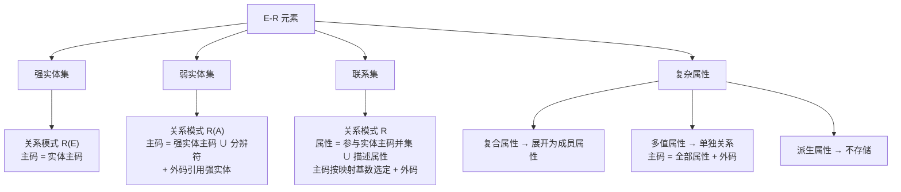
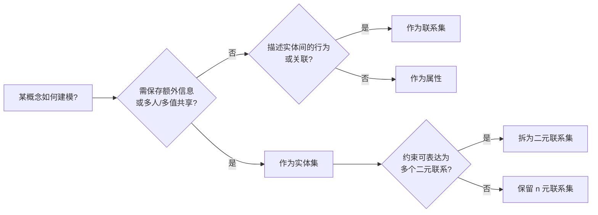
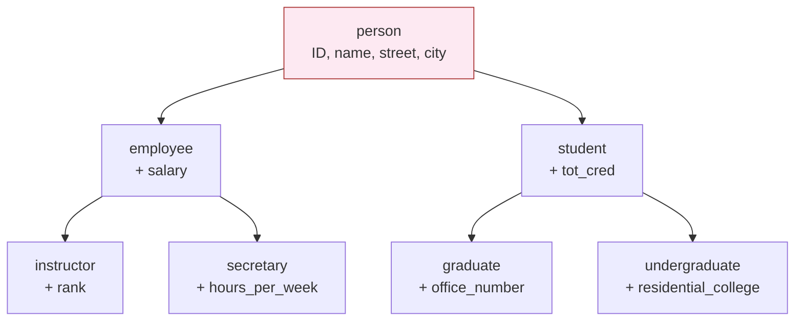

> [!info] 本章定位
> 前几章假想已有数据库模式，研究如何查询与更新。本章反过来：**如何把需求设计成数据库模式**。核心是 **实体-联系（E-R）模型**——用实体、属性、联系与约束刻画企业概念结构，并给出把 E-R 图**转换为关系模式集合**的系统性规则。本章与第 7 章（[[数据库规范化]]）共同构成数据库设计的基础：本章产出「模式长什么样」，第 7 章评价「这个模式好不好」。

> 先修：[[11-数据库]]、[[MOC - 数据库系统概念]]、[[关系模型]]（第 2 章）、[[SQL]]（第 3–5 章）。
> 后继：[[数据库规范化]]（第 7 章，评价与改进本章产出的模式）、[[查询优化]]（第 16 章）、[[事务]]/[[并发控制]]/[[故障恢复]]（第 17–19 章）、[[对象数据模型]]（第 8 章）。

## 6.1 设计过程概览

构建数据库应用是复杂任务，包括：设计数据库模式、设计访问/更新数据的程序、设计控制数据访问的安全模式。用户需求在设计过程中扮演重要角色。本章主要聚焦**数据库模式设计**，末尾简要概述其他设计任务。

### 6.1.1 设计阶段

小型应用可由设计者直接决定关系、属性与约束；现实应用常很复杂，需与用户交互以理解需求，先以用户能懂的高层形式表达，再转化为低层设计。**高层数据模型**为设计者提供概念框架，以系统方式明确数据需求与数据库结构。

- **需求收集**：与领域专家、用户深入沟通，产出**用户需求规格说明**。本章限于用文本描述需求。
- **概念设计**（conceptual-design）：选一种数据模型（常用 E-R 模型），把需求转化为**概念模式**，明确实体、属性、联系及约束，通常产出 **E-R 图**作为图形化表示。此阶段关注「描述数据及其联系」，而非物理存储。
- **功能需求**：概念模式还要满足用户将在数据上执行的操作（修改、查询、删除等）。
- **逻辑设计阶段**（logical-design phase）：把高层概念模式映射到具体实现的**数据模型**（通常是关系模型），即把 E-R 概念模式映射为关系模式。
- **物理设计阶段**（physical-design phase）：规定物理特性（文件组织、索引结构，见第 13～14 章）。

> [!warning] 逻辑模式改动代价高
> 应用建立后，物理模式改动相对容易；但逻辑模式改动会影响散落各处的查询与更新代码，代价高。因此**在构建其余应用之前务必慎重完成数据库设计阶段**。

### 6.1.2 设计选择

数据库设计的核心问题之一：如何表示各类「事物」（人、地、产品……）。用**实体**（entity）指代可明确识别的个体（教师、学生、系、课程、开课段等）。各种实体以多种方式互相关联，都需在设计中反映。

两种主要设计缺陷必须避免：

1. **冗余（redundancy）**：重复信息。例如每次开课都存课程名，则名字被多次不必要地存储；应只存 `course_id`，名字在课程实体中存一次。关系模式也会冗余（把课程信息在每个课程段重复一遍）。**最大问题是更新不一致**：若同一 `course_id` 的不同开课记录了不同名字，就搞不清正确名称。理想情况是信息只出现在一个地方。
2. **不完整（incompleteness）**：某些方面无法建模。例如只有「开课」实体而无「课程」实体，则一门新课在被开设之前无法表示；用空值变通既不优雅，又可能因主码约束而无法实行。

> [!note] 好设计的取舍
> 仅避免坏设计不够——存在大量好设计，必须选择。例如「客户购买产品」：销售是客户与产品间的**联系**，还是本身是与二者都关联的**实体**？这类选择会对建模能力产生重要差异。数据库设计需要科学 +「好的品味」的结合。

## 6.2 实体-联系模型

**实体-联系数据模型**（E-R 数据模型）通过定义代表数据库全局逻辑结构的**企业模式**（enterprise schema），方便数据库设计。它采用三个基本概念：**实体集、联系集、属性**，并有图形表示 **E-R 图**（参见 1.3.1 节）。许多数据库设计工具都基于 E-R 概念。

### 6.2.1 实体集

> [!definition] 实体 / 实体集 / 外延
> - **实体**（entity）：现实世界中可区别于所有其他对象的一个「事物」或「对象」，可有形（人、书）也可抽象（课程、课程段、航班预订）。
> - **实体集**（entity set）：共享相同性质/属性的同类型实体的集合（如 `instructor`、`student`）。
> - **外延**（extension）：属于某实体集的实体的实际集合（类比第 2 章关系与关系实例的区别）。

实体通过一组**属性**（attribute）表示；每个实体在每个属性上可有自己的值。例如特定 `instructor` 实体在 `ID` 上值为 12121、`name` 为 Wu、`dept_name` 为 Finance、`salary` 为 90000。

> [!note] 标识属性的隐私问题
> 历史上企业常用政府标识号唯一标识人，但出于安全与隐私被认为是不好的做法；大学应为每位教师创建并分配自己的标识（`ID`）。

E-R 图中实体集用**分为两部分的矩形**表示：上半部（本书为灰色阴影）写实体集名称，下半部列属性名（图 6-1）。**主码属性加下划线**（见 6.5 节）。

![[Pasted image 20260721204338.png]]
**图 6-1　`instructor` 与 `student` 实体集（矩形=实体集，含属性；主码加下划线）**

### 6.2.2 联系集

> [!definition] 联系 / 联系集 / 联系实例
> - **联系**（relationship）：多个实体间的相互关联（如 Katz 教师指导 Shankar 学生）。
> - **联系集**（relationship set）：相同类型联系的集合（如 `advisor`、`takes`）。
> - **联系实例**（relationship instance）：被建模现实中已命名实体间的一个具体关联。

形式化：联系集是 $n \ge 2$ 个（可能相同的）实体集上的数学关系。若 $E_1, E_2, \cdots, E_n$ 为实体集，则联系集 $R$ 是
$$
\{ (e_1, e_2, \cdots, e_n) \mid e_1 \in E_1, e_2 \in E_2, \cdots, e_n \in E_n \}
$$
的一个子集，其中 $(e_1, e_2, \cdots, e_n)$ 是一个联系实例。

- **参与**（participate）：实体集 $E_1,\dots,E_n$ 参与到联系集 $R$ 中。
- **角色**（role）：实体在联系中扮演的功能。当同一实体集以不同角色多次参与同一联系集时（如 `prereq` 中 `course` 自关联），需显式角色名，称为**递归的**（recursive）联系集。
- **描述性属性**（descriptive attribute）：联系本身可带属性（如 `takes` 的 `grade`），在 E-R 图中用未分割、以虚线连接菱形的矩形表示。
- **度**（degree）：参与联系集的实体集数目。二元（degree 2）、三元（degree 3）等。

![[Pasted image 20260721204344.png]]
**图 6-2　`advisor` 联系集示例：Katz 教师指导 Shankar 学生**

E-R 图中联系集用**菱形**表示，经线条连到各实体集矩形（图 6-3）。

![[Pasted image 20260721204353.png]]
**图 6-3　二元联系集 `advisor` 关联 `instructor` 与 `student`（菱形=联系集）**

`course` 实体集自关联构成 `prereq`（先修）递归联系：每对 $(C_1, C_2)$ 表示 C2 是 C1 的先修课（图 6-4，角色 `course_id` / `prereq_id`）。

![[Pasted image 20260721204402.png]]
**图 6-4　递归联系集 `prereq`：`course` 实体自关联（角色 `course_id` / `prereq_id`）**

![[Pasted image 20260721204414.png]]
**图 6-5　`takes` 联系集及其描述性属性 `grade`（虚线矩形）**

> [!note] 大图拆分约定
> 复杂 E-R 设计可拆成多张图（可能分处不同页）。**联系集只显示一次**；实体集可在多处重复出现，但属性只在**第一次出现**时显示，后续出现不带属性，避免重复信息及由此产生的不一致。

![[Pasted image 20260721204458.png]]
**图 6-6　三元联系集 `proj_guide` 的 E-R 图（关联 `instructor`、`student`、`project`）**

## 6.3 复杂属性

每个属性可取的值集合称为其**域**（domain）或**值集**（value set）。例如 `course_id` 的域是定长文本串集合，`semester` 的域是 $\{秋, 冬, 春, 夏\}$。

![[Pasted image 20260721204521.png]]
**图 6-7　复合属性示例（`instructor` 的 `name`/`address`）**

> [!definition] 属性类型
> - **简单 / 复合**（simple / composite）：简单属性不可再分；复合属性可划分为子属性（如 `name` = `first_name` + `middle_initial` + `last_name`；`address` = `street` + `city` + `state` + `postal_code`）。复合属性可**层次化**（`street` 再分 `street_number`/`street_name`/`apartment_number`）。
> - **单值 / 多值**（single-valued / multivalued）：单值属性对一实体只有一个值；多值属性可对应一组值（如教师可有零个或多个 `phone_number`、多个 `dependent_name`）。
> - **派生属性**（derived attribute）：值可由其他属性/实体推出（如 `age` 由 `date_of_birth` 与当前日期算出；`students_advised` 由统计得到）。其来源 `date_of_birth` 称**基属性**（base/stored attribute）。**派生属性的值不存储，用时再算**。
> - **空值**（null）：实体在某属性上无值，表示「不适用」或「未知」（缺失 / 不知道）。

![[Pasted image 20260721204530.png]]
**图 6-8　E-R 符号表示复合（圆括号展开）、多值（花括号 `(phone number)`）、派生（`age()`）属性**

## 6.4 映射基数

**映射基数**（mapping cardinality，基数比率）表示一个实体能通过联系集关联的另一实体的数量。对二元联系集 $R$（$A$ 与 $B$ 之间），必为以下之一：

- **一对一**（one-to-one）：$A$ 一实体至多关联 $B$ 一实体，反之亦然（图 6-9a）。
- **一对多**（one-to-many）：$A$ 一实体可关联 $B$ 任意多实体，$B$ 一实体至多关联 $A$ 一实体（图 6-9b）。
- **多对一**（many-to-one）：$A$ 一实体至多关联 $B$ 一实体，$B$ 一实体可关联 $A$ 任意多实体（图 6-10a）。
- **多对多**（many-to-many）：双方皆可关联任意多实体（图 6-10b）。

![[Pasted image 20260721204538.png]]
**图 6-9　映射基数 (a) 一对一 (b) 一对多**

![[Pasted image 20260721204546.png]]
**图 6-10　映射基数 (a) 多对一 (b) 多对多**

> [!definition] 参与 / 基数约束
> - **全部参与**（total participation）：实体集 $E$ 中**每个**实体都必须参与 $R$ 至少一个联系（E-R 图用**双线**表示）。
> - **部分参与**（partial participation）：$E$ 中部分实体可能不参与。
> - **基数约束** $l..h$：$l$ 最小基数、$h$ 最大基数。最小值为 1 ⇒ 全部参与；最大值为 1 ⇒ 至多参与一个联系；最大值为 $*$ ⇒ 无上限。

E-R 图通过在联系集与实体集之间画**有向线段**（$\rightarrow$，指向「一」侧）或**无向线段**（$-$）指明基数约束（图 6-11）。非二元联系集**至多允许一个箭头指出**（两个箭头会有歧义，见 6.5.2）。

![[Pasted image 20260721204556.png]]
**图 6-11　基数约束的有向/无向线段表示 (a) 1-1 (b) 1-n (c) n-1 (d) m-n**

![[Pasted image 20260721204604.png]]
**图 6-12　`advisor` 中学生全部参与（双线）**

图 6-13 中 `advisor`–`student` 边为 $1..1$（每位学生必须且只有一位导师），$advisor$–$instructor$ 边为 $0..*$（教师可指导零或多名学生）。

![[Pasted image 20260721204613.png]]
**图 6-13　`advisor` 的基数约束 $1..1$ / $0..*$ 表示（学生全部参与）**

> [!warning] 易混淆点
> 左侧边的 $0..*$ 容易被误读成「从 $instructor$ 到 $student$ 的多对一」，恰好与正确解释（一对多）相反。若两条边最大值都为 1，则为 1-1；若在左侧边指定 $1..*$ 则表示「每位教师必须指导至少一名学生」。

## 6.5 主码

必须有一种方式区分给定实体集中的实体与给定联系集中的联系。第 2 章中**关系模式的码**概念直接适用于实体集与联系集：超码、候选码、主码同样适用。

### 6.5.1 实体集

从数据库观点，实体的区别必须通过其属性表达——一个实体的属性取值须能唯一标识该实体（不允许两实体所有属性值完全相同）。实体的**码**是足以区分实体的属性集。

### 6.5.2 联系集

设 $R$ 涉及实体集 $E_1, E_2, \cdots, E_n$，记 $primary\text{-}key(E_i)$ 为 $E_i$ 的主码属性集合（假设主码属性名互不相同）：

- 若 $R$ **无关联属性**，则属性集合 $\;primary\text{-}key(E_1) \cup \cdots \cup primary\text{-}key(E_n)\;$ 描述 $R$ 中一个单独联系。
- 若 $R$ 有关联属性 $a_1,\dots,a_m$，则上述并集再并上 $\{a_1,\dots,a_m\}$ 描述一个联系。

若主码属性名冲突，则重命名区分（实体集名+属性名，或递归联系用**角色名**）。上述并集在两种情况下都构成 $R$ 的**超码**。

> [!note] 二元联系集主码的选择（取决于映射基数）
> - **多对多**：取参与双方主码的**并集**作主码。
> - **一对多 / 多对一**：取「**多**」方的主码作主码。
> - **一对一**：任取一方主码作主码。

对于**非二元联系**：若无基数约束，前述超码即唯一候选码；若有约束则复杂。我们**只允许一个箭头指出**（否则两种解释都合理、易混淆）：

设 $E_1,E_2,E_3,E_4$ 间有联系集 $R$，仅 $E_3,E_4$ 边带箭头，则两种可能解释是：
1. $(E_1,E_2)$ 的特定组合至多关联一个 $(E_3,E_4)$ 组合 ⇒ 主码 = $primary\text{-}key(E_1) \cup primary\text{-}key(E_2)$。
2. $(E_1,E_2,E_3)$ 特定组合至多关联一个 $E_4$，且 $(E_1,E_2,E_4)$ 特定组合至多关联一个 $E_3$ ⇒ $E_1,E_2,E_3$ 主码并集与 $E_1,E_2,E_4$ 主码并集都是候选码。

> [!summary] 非二元联系主码规则
> 为免歧义只允一个箭头指出；此时两种解释等价。**$R$ 的主码 = 所有未被 $R$ 的箭头指向的参与实体集 $E_i$ 的主码之并集。** 多箭头情形可把非二元联系集替换为实体集（每个联系实例视为一个实体）或用[[数据库规范化|函数依赖]]（7.4 节）显式指定。

### 6.5.3 弱实体集

> [!definition] 弱实体集 / 标识性实体集 / 分辨符
> - **弱实体集**（weak entity set）：存在依赖于另一个实体集（**标识性实体集** identifying entity set），用标识性实体集主码 + 称为**分辨符属性**（discriminator attribute）的额外属性来唯一标识，自身不单独关联主码。
> - **存在依赖**（existence dependent）：弱实体必须且总与一个标识性实体关联；标识性实体**拥有**（own）它。两者的联系称**标识性联系**（identifying relationship）。
> - **强实体集**（strong entity set）：非弱的实体集。

标识性联系是从弱实体集到标识性实体集的**多对一**联系，且弱实体集**全部参与**；它不应有任何描述性属性。弱实体集主码 = 标识性实体集主码 ∪ 分辨符。

示例：`section`（课程段）依赖 `course`，经 `sec_course` 标识性联系关联（图 6-14）。`section` 主码 = $\{course\_id, sec\_id, year, semester\}$。

![[Pasted image 20260721204634.png]]
**图 6-14　弱实体集 `section` 依赖强实体集 `course`（双边框矩形 + 双边框菱形 `sec_course`）**

> [!note]
> 弱实体集必须全部参与其标识性联系，且该联系是到标识性实体集的多对一。弱实体集还可参与其他联系，可作属主参与另一弱实体集的标识性联系，也可关联多个标识性实体集（主码 = 各标识性实体集主码并集 ∪ 分辨符）。

## 6.6 从实体集中删除冗余属性

设计通常先定实体集，再选属性，最后建联系集。联系集可能导致**跨实体集的冗余属性**，需从原实体集删除。

示例：`instructor`（`ID, name, dept_name, salary`）与 `department`（`dept_name, building, budget`）经 `inst_dept` 联系关联。`dept_name` 是 `department` 主码，在 `instructor` 中冗余，应移除 —— 逻辑上「教师—系」是联系而非属性，避免过早假设「每位教师只属一个系」。

> [!summary] 大学 E-R 设计（无冗余属性）
> 实体集与属性（主码加下划线）：
> - `classroom`：$(building, room\_number, capacity)$
> - `department`：$(dept\_name, building, budget)$
> - `course`：$(course\_id, title, credits)$
> - `instructor`：$(ID, name, salary)$
> - `section`：$(course\_id, sec\_id, semester, year)$
> - `student`：$(ID, name, tot\_cred)$
> - `time_slot`：$(time\_slot\_id, \{(day, start\_time, end\_time)\})$（多值复合）
>
> 联系集：`inst_dept`、`stud_dept`、`teaches`、`takes`(描述性 `grade`)、`course_dept`、`sec_course`、`sec_class`、`sec_time_slot`、`advisor`、`prereq`。
> 可验证：任一实体集均不含因联系集造成的冗余属性；图 2-9 大学关系模式中的信息（除约束外）全部包含于此，仅部分属性被联系替代。

![[Pasted image 20260721204651.png]]
**图 6-15　大学数据库完整 E-R 图**

图 6-15 中：`instructor`–`inst_dept`、`course`–`course_dept`、`student`–`stud_dept` 均为双线（全部参与）+ 指向 `department` 的箭头（至多一个系）；`takes` 带描述性属性 `grade`；`section` 为弱实体集（`sec_id, semester, year` 为分辨符），`sec_course` 为标识性联系。

## 6.7 将 E-R 图转换为关系模式

E-R 模型与关系模型都抽象表示企业，设计原则相似，故可转换：**每个实体集与每个联系集对应唯一关系模式，命名为相应实体集/联系集名**。

### 6.7.1 强实体集的表示

强实体集 $E$（仅简单描述性属性 $a_1,\dots,a_n$）⇒ 同名模式，属性一一对应；**模式主码 = 强实体集主码**。

示例：`student(ID, name, tot_cred)`，`ID` 为主码。图 6-15 中除 `time_slot` 外的强实体集都只有简单属性，转换结果见图 6-16（注意 `instructor`/`student`/`course` 不含 `dept_name`）。

![[Pasted image 20260721204702.png]]
**图 6-16　由强实体集转换得到的关系模式（不含 `time_slot`）**

### 6.7.2 具有复杂属性的强实体集的表示

- **复合属性**：为每个**成员属性**创建单独属性，不为复合属性自身建属性/模式（`name`→`first_name`/`middle_initial`/`last_name`；`address`→`street`/`city`/`state`/`postal_code`；`street`→`street_number`/`street_name`/`apt_number`）。
- **多值属性**：例外 —— 为其**单独建关系模式** $R$，含对应属性 $A$ 与所在实体集/联系集主码属性；模式主码 = 全部属性；并在主码属性上建**外码**引用原实体集关系。
- **派生属性**：关系模型中**不显式表示**（可在其他模型中表示为存储过程/函数/方法）。

不含多值属性的版本：
$$
instructor(ID, first\_name, middle\_initial, last\_name, \\
street\_number, street\_name, apt\_number, \\
city, state, postal\_code, date\_of\_birth)
$$

多值属性 `phone_number` ⇒ 单独模式：
$$
instructor\_phone(ID, phone\_number)
$$
教师 22222 的号码 555-1234、555-4321 对应两个元组；该模式主码 = $(ID, phone\_number)$，且 $ID$ 上有引用 `instructor` 的外码。

> [!note] 仅两属性的实体集可优化
> 若实体集只有主码属性 $B$ 与单值多值属性 $M$，可直接用 $(B, A)$ 模式，删去仅含 $B$ 的关系。例如 `time_slot`：
> $$
> time\_slot(time\_slot\_id, day, start\_time, end\_time)
> $$
> 本书并未把 `end_time` 列入主码——因为我们并不知晓有这样的约束：同一课程段在一周内的两次课开始时间相同却结束时间不同。由此 `time_slot` 实体集生成的关系仅含单个属性 `time_slot_id`，可舍弃该关系以简化模式（见 6.7.4 节关于外码缺点的讨论）。

### 6.7.3 弱实体集的表示

弱实体集 $A$（属性 $a_1,\dots,a_m$）依赖强实体集 $B$（主码 $b_1,\dots,b_n$）⇒ 同名模式，属性 = $\{a_1,\dots,a_m\} \cup \{b_1,\dots,b_n\}$；**模式主码 = $B$ 主码 ∪ $A$ 分辨符**；并在 $b_1,\dots,b_n$ 上建外码引用 $B$。

示例：`section` 属性 $sec\_id, semester, year$，依赖 `course`（主码 $course\_id$）：
$$
section(course\_id, sec\_id, semester, year)
$$
主码 = $course$ 主码 ∪ 分辨符；`course_id` 上有引用 `course` 的外码。

### 6.7.4 联系集的表示

联系集 $R$：属性 = 各参与实体集主码并集 $\{a_1,\dots,a_m\}$ ∪ 描述性属性 $\{b_1,\dots,b_n\}$。主码按 6.5 节规则选；并在每个参与实体集 $E_i$ 的主码导出属性上建外码引用 $E_i$ 的模式。

示例：`advisor`（`instructor` 主码 `ID`、`student` 主码 `ID`，无属性）⇒ 重命名为 `i_ID`、`s_ID`；因是多对一（从 `student` 到 `instructor`），模式主码 = `s_ID`；两外码：`i_ID`→`instructor`、`s_ID`→`student`。

![[Pasted image 20260721204713.png]]
**图 6-17　图 6-15 其余联系集转换得到的关系模式**

> [!note]
> `prereq` 用角色标识作属性名（两角色都引用 `course`）。`sec_course`/`sec_time_slot`/`sec_class`/`inst_dept`/`stud_dept`/`course_dept` 的主码仅由「多」方主码构成（均为多对一）。图 6-16 未显式画外码，但每个关系都有引用两个相关实体集模式的外码。

### 6.7.5 模式的冗余

连接弱实体集与其强实体集的联系集模式是**冗余的**，可不必给出：该联系多对一无描述属性，且弱实体主码已含强实体主码 ⇒ 两模式属性完全相同、元组一一对应。示例：`sec_course` 模式与 `section` 模式属性一致，故 `sec_course` 冗余。

### 6.7.6 模式的合并

从 $A$ 到 $B$ 的**多对一**联系集 $AB$，若 $A$ 在联系中**全部参与**，可把 $A$ 模式与 $AB$ 模式合并（属性并集；主码 = 融入联系集模式的实体集 $A$ 的主码）。一对一联系集可并入任一参与方。部分参与也可用空值合并。合并后，原应引用被合并模式的外码约束由合并模式隐式强制执行。

图 6-15 中可合并项：
- `inst_dept` + `instructor` ⇒ `instructor(ID, name, dept_name, salary)`
- `stud_dept` + `student` ⇒ `student(ID, name, dept_name, tot_cred)`
- `course_dept` + `course` ⇒ `course(course_id, title, dept_name, credits)`
- `sec_class` + `section` ⇒ `section(course_id, sec_id, semester, year, building, room_number)`
- `sec_time_slot` + 上一步 `section` ⇒ `section(..., time_slot_id)`

> [!summary] E-R → 关系模式 转换规则总览

## 6.8 扩展的 E-R 特性

基本 E-R 概念足以建模大多数特性，但某些方面用扩展更恰当：特化、概化、高层/低层实体集、属性继承、聚集。

> [!definition] 特化 / 概化 / 超类-子类
> - **特化**（specialization）：在实体集内分组出具有不同属性的子集（自顶向下）。如 `person` → `employee` / `student`。
> - **概化**（generalization）：多个实体集按共性综合成高层实体集（自底向上）。如 `instructor` + `secretary` → `employee` → `person`。
> - **超类 / 子类**（superclass / subclass）：高层/低层实体集的别称；二者皆用普通矩形表示。

### 6.8.1 特化

`person(ID, name, street, city)` 可特化为 `employee(+salary)` 与 `student(+tot_cred)`；进一步 `student`→`graduate(+office_number)` / `undergraduate(+residential_college)`，`employee`→`instructor(+rank)` / `secretary(+hours_per_week)`。可反复特化，且一个实体可属多个特化（如某人既是临时雇员又是秘书）。

E-R 图中特化用从特化实体指向另一实体的**空心箭头**（ISA，「是一个」）表示。

> [!note] 重叠 / 不相交特化
> - **重叠特化**（overlapping）：实体可属多个特化集（如 `student` 与 `employee` 作 `person` 的特化）→ 用两个独立箭头。
> - **不相交特化**（disjoint）：实体至多属一个特化集（如 `instructor` 与 `secretary` 作 `employee` 的特化）→ 用单个箭头。

![[Pasted image 20260721204725.png]]
**图 6-18　特化/概化层次（`person` → `employee`/`student` → `instructor`/`secretary`），ISA 空心箭头**

### 6.8.2 概化

自底向上：`instructor` 与 `secretary` 共享标识/姓名/工资属性，可概化为高层 `employee`，再与 `student` 一起概化为 `person`。概化只是特化的逆过程，设计中二者结合使用；E-R 图对二者不作区分。

> [!note] 二者的出发点差异
> **特化**从单实体集出发，强调内部差异（低层实体可有高层不适用的属性/联系）。**概化**从多实体集出发，强调共性、隐藏差异、避免重复表达共享属性。

### 6.8.3 属性继承

> [!definition] 属性继承 / 参与继承
> - **属性继承**（attribute inheritance）：低层实体集继承高层实体集的全部属性（如 `student`/`employee` 继承 `person` 的 `ID/name/street/city`；`instructor`/`secretary` 再继承 `employee` 的 `salary`）。
> - **参与继承**：低层实体集隐式继承参与高层实体集的联系集（如 `person` 参与 `person_dept`，则其子类都参与）。

结果：高层实体的属性与联系适用于所有低层；低层独有特征仅适用于该低层。单继承（每低层只参与一个 ISA）形成**层次结构**（hierarchy）；多继承（参与多个 ISA）形成**格**（lattice）。

### 6.8.4 特化上的约束

- **不相交 / 重叠**：前文已述。
- **完全性约束**（completeness constraint）：高层实体是否必须至少属于一个低层实体集。
  - **全部特化/概化**：每个高层实体必属某低层集。
  - **部分特化/概化**：部分高层实体可不属于任何低层集（默认）。
  - 在 E-R 图中加关键字 `total` + 虚线连到相应空心箭头表示。

二者无依赖关系，故可组合为：部分-重叠 / 部分-不相交 / 全部-重叠 / 全部-不相交。全部完全性约束会带来插入/删除级联要求（插入高层必插至少一低层；删高层必删其所有低层）。

### 6.8.5 聚集

> [!definition] 聚集（aggregation）
> 基本 E-R 不能表达「联系之间的联系」。**聚集**是一种抽象：把联系集（连同相关实体集）视为**高层实体集**，可像普通实体集一样参与其他联系。

示例：`proj_guide`（`instructor`/`student`/`project` 三元联系）经 `eval_for` 关联到 `evaluation` 实体。若合并 `proj_guide` 与 `eval_for` 会丢失「某些组合无评估报告」的信息；若把 `evaluation` 建模为多值复合属性则无法再关联 `secretary` 等。最佳方案是用聚集：把 `proj_guide` 看作高层实体集，再与 `evaluation` 建二元 `eval_for` 联系（图 6-19、6-20）。

![[Pasted image 20260721204735.png]]
**图 6-19　四元联系 `eval_for` 的 E-R 图（为简洁省略属性）**

![[Pasted image 20260721204741.png]]
**图 6-20　聚集表示：`proj_guide` 视为高层实体，与 `evaluation` 经 `eval_for` 关联**

### 6.8.6 转换为关系模式

#### 6.8.6.1 概化的表示

设 $ID$ 为 `person` 主码，两种表示法：

1. **高层 + 各低层都建模式**：低层模式含自身属性 + 高层主码属性；低层主码属性引用高层模式外码。
$$
\begin{aligned}
&person\ (ID, name, street, city) \\
&employee\ (ID, salary) \\
&student\ (ID, tot\_cred)
\end{aligned}
$$

2. **仅当概化不相交且全部**时，可不为高层建模式，只建低层模式（含自身 + 高层全部属性），主码 = 高层主码：
$$
\begin{aligned}
&employee\ (ID, name, street, city, salary) \\
&student\ (ID, name, street, city, tot\_cred)
\end{aligned}
$$

> [!warning] 方法 2 的局限
> 方法 2 难以定义外码：若有关联 `person` 的联系集 $R$，方法 1 可在 $R$ 上建引用 `person` 的外码，方法 2 无单一关系可引用（除非补建只含主码的 `person` 模式）。把方法 2 用于**重叠**概化会重复存储（如一人兼雇员与学生，`street`/`city` 存两次）；用于**不相交但非全部**需额外 `person` 模式，否则又退回方法 1。

#### 6.8.6.2 聚集的表示

直接：表示 $eval\_for$ 的模式含 `evaluation` 与各参与方主码属性 + `eval_for` 的描述属性；按既有规则转换。聚集的主码 = 定义它的联系集的主码；**不需要单独关系**表示聚集，用定义该聚集的联系所创建的关系即可，外码/主码约束照常应用。

## 6.9 实体 - 联系设计问题

标记法不精确，定义实体及联系有多种方式。6.11 节详述设计过程。

### 6.9.1 E-R 图中的常见错误

1. **用主码属性代替联系**：如把 `dept_name` 作为 `student` 的属性（图 6-21a）是错误的；正确方式是 `stud_dept` 联系，可显式表达联系而非隐含于属性，且避免信息重复。
2. **把相关实体主码属性作为联系集属性**：如 `advisor` 不应出现 `student.ID`/`instructor.ID` —— 联系集中已隐含这些主码。
3. **需要多值属性时却用单值属性代替联系**：如给 `takes` 加 `assignment`+`marks` 两属性（图 6-21b）只能表示一次作业（联系实例由参与实体唯一标识）。

![[Pasted image 20260721204752.png]]
**图 6-21　常见错误 (a) 用属性代替联系 (b) 用单值属性代替多值**

图 6-21b 的修正：方案一把 `assignment` 建模为 `section` 标识的弱实体，加 `marks_in` 联系（带 `marks`）；方案二给 `takes` 用多值复合属性 $\{assignment\_marks\}$。通常把作业建模为弱实体更好（可记录最高分、截止日期等额外信息）。

![[Pasted image 20260721204803.png]]
**图 6-22　图 6-21b 的两种修正（弱实体 / 多值复合属性）**

> [!note] 大图拆分复习
> 实体集属性只在其首次出现时显示，后续出现不带属性，避免多处重复导致不一致（见 6.2.2）。

### 6.9.2 使用实体集还是属性

`instructor` 带 `phone_number` 属性（图 6-23a）暗示每位教师恰有一个号码。替代方案（图 6-23b）：建 `phone` 实体集（`phone_number`, `location`）+ `inst_phone` 联系集，允许教师有零或多部电话，并可存位置/类型等额外信息、或多人共享一部电话。

![[Pasted image 20260721204810.png]]
**图 6-23　(a) `phone_number` 作属性 (b) `phone` 作实体集**

> [!summary] 实体 vs 属性 的取舍
> 把某概念当实体更通用（可存额外信息、允许多值/共享），当属性仅适用于它确实只是原子的描述值（如 `name` 不宜作实体）。**取决于被建模企业的结构与语义，无简单答案。**

### 6.9.3 使用实体集还是联系集

`takes` 联系（学生选某课程段）也可改为 `registration` 实体集 + 两个联系集（`section_reg`、`student_reg`，图 6-24）。两法都正确，但 `takes` 更紧凑可取；**若登记记录需关联额外信息，则使其成实体更合适**。

![[Pasted image 20260721204821.png]]
**图 6-24　用 `registration` 实体集替代 `takes` 联系集（双线=全部参与）**

> [!note] 指导原则
> 描述「发生在实体间的行为」时用**联系集**；这也有助于决定是否把某些属性表示为联系。

### 6.9.4 二元还是 $n$ 元联系集

联系通常二元；有些非二元联系可用多个二元联系更好表示。例如 `parent` 三元（孩子+母+父）可用 `mother`/`father` 两个二元联系替代——后者允许「未知父亲时也记录母亲」，而三元需空值。

一般地，$n$ 元联系 $R(A,B,C)$ 可用实体集 $E$ + 三个多对一联系 $R_A,R_B,R_C$（图 6-25）替代：$E$ 全部参与每个联系；若 $R$ 有属性则赋给 $E$ 并为其建标识属性；对每联系 $(a_i,b_i,c_i)$ 在 $E$ 中建 $e_i$ 并插入三个二元联系。此过程可推广到 $n$ 元。

![[Pasted image 20260721204834.png]]
**图 6-25　三元联系 $R$ 用实体集 $E$ + 三个二元联系替代**

> [!warning] 并非总应拆成二元
> - 替代实体集 $E$ 需标识属性，增加复杂度与存储。
> - $n$ 元联系更清晰表达「多实体参与单个联系」。
> - 某些约束无法用多个二元联系的基数表达（如 $R$ 是从 $(A,B)$ 到 $C$ 的多对一：每 $(A,B)$ 对至多一个 $C$）。例如 `proj_guide` 不能简单拆成 `instructor`–`project` 与 `instructor`–`student` 二元联系，否则无法表达「Katz 与 Shankar 做项目 A、与 Zhang 做项目 B」的精确配对。

> [!summary] E-R 设计选择决策

## 6.10 数据建模的可选表示法

图形表示对模式设计至关重要，便于数据建模专家与领域专家沟通。E-R 图与 UML 类图最常用；E-R 图无统一标准，各书/软件表示法不同。图 6-26 汇总本书所用符号。

![[Pasted image 20260721204844.png]]
**图 6-26　本书 E-R 表示法符号汇总**

### 6.10.1 可选的 E-R 表示法

图 6-27 给出多种广泛使用的变体：属性用连到实体的**椭圆**（主码下划线）；联系属性同理连到菱形。基数约束可在边标 `*`/`1`（多对多/一对一/多对一）；或用**鸡爪**表示（`E1` 端鸡爪 = 从 `E1` 到 `E2` 多对一），竖线=全部参与、圆圈=部分参与（注意竖线画在**对面**）。概化也可用三角形替代空心箭头。

![[Pasted image 20260721204929.png]]
**图 6-27　可选 E-R 表示法（椭圆属性、鸡爪基数、三角形概化）**

> [!note] 历史与标准
> 椭圆属性 + 菱形联系的表示接近 Chen 原始论文（**陈氏表示法**），第 5 版及以前本书即用此。美国 NIST 于 1993 年定义 **IDEF1X** 标准（鸡爪 + 竖线/圆圈）。本书新版 E-R 表示法更接近 [[UML]] 类图，属性表示更紧凑、更贴近建模工具。

### 6.10.2 统一建模语言（UML）

> [!definition] UML 与类图
> **统一建模语言**（UML, Unified Modeling Language）由 OMG 制定，用于软件系统各部分规范定义。其组成包括：
> - **类图**（class diagram）：与 E-R 图类似，用于数据建模。
> - **用例图**（use case diagram）：展示用户与系统交互的任务步骤。
> - **活动图**（activity diagram）：说明系统各部分间的任务流。
> - **实现图**（implementation diagram）：在构件层/硬件层展示系统组成与联系。

UML 为对象建模（对象有属性 + 方法），E-R 为实体建模。**关联**（association）即 E-R 的联系集；二元联系画一条线，线旁写联系名，靠近实体处写角色名。UML 1.3 起支持菱形表示非二元联系；基数约束同样用 $l..h$，但**约束位置与 E-R 图相反**（$E2$ 边 $0..*$ 且 $E1$ 边 $0..1$ 表示从 $E2$ 到 $E1$ 多对一）。单个 `1`=`1..1`、`*`=`0..*`。

UML 类图还提供：一端带小**实心菱形**表示「构成」（composition，$E2$ 存在依赖 $E1$，约等于弱实体集）；空心菱形表示「聚集」（aggregation，$E2$ 包含于 $E1$ 但可独立存在）；以及接口等面向对象表示法（属性/方法前缀 `+`/`-`/`#` 表公共/私有/受保护）。UML 不支持复合/多值属性，派生属性约等于无参函数。

![[Pasted image 20260721204939.png]]
**图 6-28　E-R 结构与对应 UML 类图对照**

## 6.11 数据库设计的其他方面

模式设计不是数据库设计的唯一组成，以下方面在后续章节展开。

### 6.11.1 功能要求

企业有关于支持何种功能的规则（数据更新事务、查询）。还需规划支持功能的接口。授权机制很重要：可在数据库级（[[数据库授权]]）或功能/接口级指定谁可用哪些功能。

### 6.11.2 数据流、工作流

数据库应用常为企业大应用一部分，与专门应用交互。**工作流**（workflow）指流程中数据与任务的组合，会在用户间移动并与数据库交互；数据库还可存工作流自身数据（任务及移动路径），故对企业建模既要懂数据语义，也要懂使用数据的业务流程。

### 6.11.3 模式演化

数据库设计非一蹴而就；需求发展，数据也发展。应区分**基本约束**（如教师标识唯一，长久不变）与**预期会变的约束**（如「教师只属一个系」政策可能改）。好设计应预想未来需求，使需求变化时只需最小改动（如允许联合任命时可用额外联系表达，无需改 `instructor` 关系；若政策改为允许多个主系则需较大改动）。

> [!note] 面向人的工作
> 数据库设计在两种意义上面向人：最终用户是人；设计者需与领域专家深入交互理解需求。所有人的需求与偏好都应被考虑，方能使设计部署成功。

## 6.12 总结

- 数据库设计主要涉及**模式设计**；E-R 模型是广泛使用的数据库设计模型，提供方便的图形化方式查看数据、联系与约束。
- **实体**是区别于他者的对象，用一组**属性**表示区别；**联系**是实体间关联，**联系集/实体集**是同类联系/实体的集合。
- 超码、候选码、主码对实体集与联系集同样适用；联系集主码由相关实体集属性组成，需小心确定。
- **映射基数**表示经联系集可关联的实体数量。
- 主码不足以标识的实体集称**弱实体集**，有主码的称**强实体集**。
- E-R 特性在「如何最好表示企业」上给设计者大量选择：概念可用实体/联系/属性表示；企业结构可用弱实体集、概化、特化、聚集描述。常在「简单紧凑」与「精确但复杂」间权衡。
- E-R 图定义的数据库设计可表示为**关系模式集合**（每个实体集/联系集对应唯一模式），这是 E-R→关系转换的基础。
- **特化/概化**定义高层与低层实体集的包含关系；高层属性被低层**继承**。
- **聚集**把联系集（及相关实体）视为高层实体，可参与联系。
- E-R 设计须小心，避免常见错误；实体/联系/属性的选择正确性取决于企业精细细节。
- **UML** 是流行建模语言，其类图广泛用于类建模与多功能数据建模。

---

> [!summary] 概念层次（特化 / 概化 / 继承）

## 术语表

| 中文 | 英文 | 所在节 | 相关章节 |
| --- | --- | --- | --- |
| 实体 / 实体集 | entity / entity set | 6.2.1 | [[关系模型]]（第 2 章） |
| 联系 / 联系集 | relationship / relationship set | 6.2.2 | — |
| 弱实体集 / 标识性实体集 | weak / identifying entity set | 6.5.3 | — |
| 映射基数 | mapping cardinality | 6.4 | — |
| 特化 / 概化 | specialization / generalization | 6.8.1 / 6.8.2 | — |
| 属性继承 | attribute inheritance | 6.8.3 | — |
| 聚集 | aggregation | 6.8.5 | — |
| E-R → 关系模式 | E-R to relational mapping | 6.7 | [[数据库规范化]]（第 7 章） |
| UML 类图 | UML class diagram | 6.10.2 | [[对象数据模型]]（第 8 章） |

## 延伸阅读（相关概念）

- 数据模型基础：[[关系模型]]（第 2 章）、[[SQL]]（第 3–5 章）、[[对象数据模型]]（第 8 章）
- 设计评价与改进：[[数据库规范化]]（第 7 章，函数依赖与良好设计）
- 物理与实现：[[查询优化]]（第 16 章）、索引与文件组织（第 13–14 章）
- 可靠与并发：[[事务]]、[[并发控制]]、[[故障恢复]]（第 17–19 章）
- 建模语言：[[UML]]、陈氏表示法、IDEF1X
- 设计与安全：[[数据库授权]]、[[引用完整性]]、[[外码]]、[[主码]]
