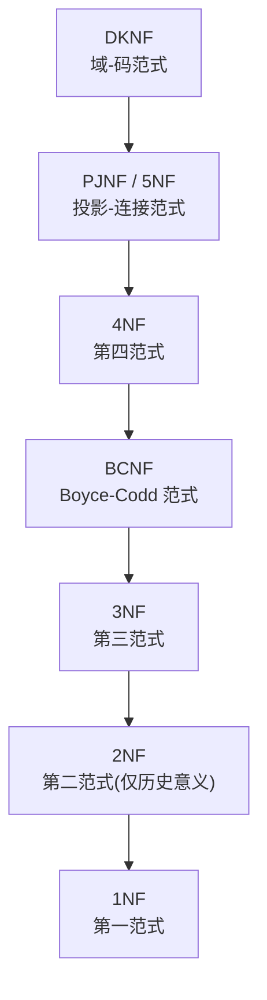
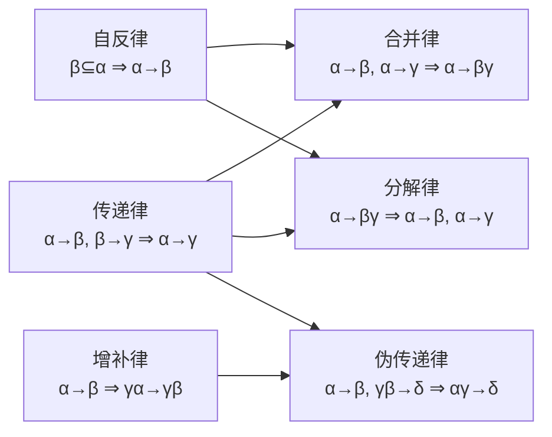
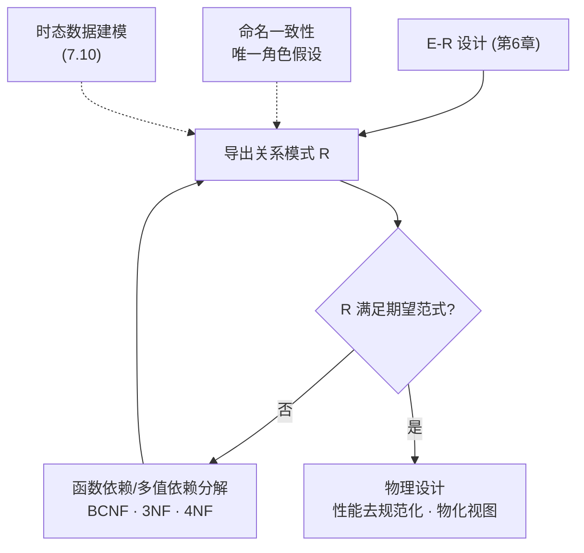

> [!info] 章节定位
> 本章给出**关系数据库设计**的规范化方法：用**函数依赖**（functional dependency）定义范式（BCNF、3NF），并进一步引入**多值依赖**与**第四范式（4NF）**；最后讨论原子域/第一范式、数据库设计过程、去规范化与时态数据建模。目标是在避免不必要冗余的同时，保持信息可被轻松检索。
> - 先修：[[11-数据库]]、[[MOC - 数据库系统概念]]、[[关系模型]]（第 2 章）、[[SQL]]（第 3–5 章）、[[实体-联系模型]]（第 6 章）
> - 后继：[[查询优化]]（第 16 章）、[[事务]] / [[并发控制]] / [[故障恢复]]（第 17–19 章）、[[存储与文件结构]]（第 13–14 章）

在本章中，我们考虑为关系数据库设计模式的问题。其中的许多问题和我们第 6 章中使用 E-R 模型时所考虑的设计问题是相似的。

一般而言，关系数据库设计的目标是生成一组关系模式，使得我们存储信息时避免不必要的冗余，并且让我们可以轻松地获取信息。这是通过设计满足适当范式（normal form）的模式来实现的。为了确定一个关系模式是否属于理想的范式，我们需要用数据库建模的真实企业的相关信息。某些信息存在于设计良好的 E-R 图中，但是可能还需要关于该企业的额外信息。

在本章中，我们介绍基于函数依赖概念的关系数据库设计的规范方法。然后根据函数依赖及其他类型的数据依赖来定义范式。不过，我们首先从根据给定的实体–联系设计导出模式的角度来考察关系设计的问题。

## 7.1 好的关系设计的特点

我们在第 6 章中学习的实体–联系设计为创建关系数据库设计提供了很好的起点。我们在 6.7 节中看到，可以直接从 E-R 设计来生成一组关系模式。所生成的模式集的好坏取决于 E-R 最初设计的质量。在本章后面，我们将学习评价一组关系模式的可能性的精确方法。然而，利用已经学过的概念，我们可以向好的设计迈进一步。为了易于参照，我们在 **图 7-1** 中重复了用于大学数据库的模式。

![[Pasted image 20260721212009.png]]
**图 7-1** 用于大学示例的数据库模式

假设我们从设计具有 `in_dep` 模式的大学企业开始。

```text
in_dep (ID, name, salary, dept_name, building, budget)
```

这表示在对应于 `instructor` 和 `department` 的关系上进行自然连接的结果。这似乎是个好主意，因为某些查询可以用更少的连接来表达，除非我们仔细考虑产生我们的 E-R 设计的大学的有关实际状况。

让我们考虑 **图 7-2** 中所示的 `in_dep` 关系的实例。请注意，我们对于系里的每位教师都不得不重复一整套的信息（"building" 和 "budget"）。例如，关于计算机科学系的信息（Taylor, 100000）被包含在 Katz、Srinivasan 和 Brandt 教师的元组中。

![[Pasted image 20260721212021.png]]
**图 7-2** `in_dep` 关系

所有这些元组的预算数额统一这一点是重要的，否则我们的数据库将会不一致。在使用 `instructor` 和 `department` 的原始设计中，我们对每个预算的数额只存储一次。这说明使用 `in_dep` 是一个坏主意，因为它重复存储预算数额，并且需要承担某些用户可能更新一个元组而不是所有元组中的预算数额并因此产生不一致性的风险。

即使我们决定容忍冗余的问题，在 `in_dep` 模式仍然存在其他问题。假设我们在大学里创立一个新的系。在上面的备选设计方案中，我们无法直接表达关于一个系的信息（`dept_name`, `building`, `budget`），除非该系在大学中至少有一位教师。这是因为 `in_dep` 表中的元组需要 ID、name 和 salary 的值。这意味着我们不能记录新成立的系的相关信息，直到这个新系录用了第一位教师为止。在旧的设计中，`department` 模式可以处理这种情况，但是在修改后的设计中，我们将不得不创建一个 `building` 和 `budget` 为空值的元组。在某些情况下，空值会带来麻烦，正如我们在 SQL 学习中所看到的那样。然而，如果我们认为这种情况不是问题，那么我们可以继续使用该修改后的设计，但是，正如我们所指出的，我们仍然会有冗余的问题。

### 7.1.1 分解

避免 `in_dep` 模式中的信息重复问题的唯一方式是将其实分解为两个模式（在本例中为 `instructor` 和 `department`）。我们将在本章的后面介绍一些算法来确定哪些模式是合适的，而哪些模式不是。一般来说，可能必须将表现出信息重复的模式分解为几个较小的模式。

并非所有的模式分解都是有益的。请考虑所有模式都由一个属性构成的极端情况。任何类型的有意义的联系都无法被表示。现在考虑一种不那么极端的情况，我们选择将 `employee` 模式（见 6.8 节）

```text
employee (ID, name, street, city, salary)
```

分解为以下两个模式：

```text
employee1 (ID, name)
employee2 (name, street, city, salary)
```

在企业可能拥有两个重名职员的情况下会暴露这个分解的缺陷。在实际中这并非不可能的。

因为许多文化中都有某些非常流行的名字。每个人都要有一个唯一的职员号，这就是 ID 能够作为主码的原因。作为一个示例，让我们假定两个职员均名为 Kim，他们在该大学工作，并且在原始设计中的 `employee` 模式上的关系中有以下元组：

```text
(57766, Kim, Main, Perryridge, 75000)
(98776, Kim, North, Hampton, 67000)
```

![[Pasted image 20260721212032.png]]
**图 7-3** 这些元组、利用分解产生的模式所生成的元组，以及试图用自然连接重新生成原始元组所得到的结果。正如我们在图中所看到的，那两个原始元组伴随着两个新的元组出现在结果中，这两个新的元组将属于这两个名为 Kim 的职员的数据值错误地混合在一起。虽然我们拥有更多的元组，但实际上从以下意义来讲我们却拥有更少的信息。我们能够指出一个特定的街道、城市和工资属于某个名为 Kim 的人，但是我们无法区分出是哪一个 Kim。因此，我们的分解无法表达关于大学职员的特定的重要事实。我们想要避免这样的分解。

> [!definition] 有损分解 / 无损分解（7.1.2）
> 令 \(R\) 为关系模式，并令 \(R_1\) 和 \(R_2\) 构成 \(R\) 的分解——即 \(R=R_1\cup R_2\)。若用 \(R_1,R_2\) 替代 \(R\) 时无信息丢失，则称为**无损分解**（lossless decomposition）；否则为**有损分解**（lossy decomposition）。
> 等价地：\(\Pi_{R_1}(r)\bowtie\Pi_{R_2}(r)=r\) 为无损；若结果仅为 \(r\) 的超集（\(r\subseteq\Pi_{R_1}(r)\bowtie\Pi_{R_2}(r)\)）则为有损。
> 本书其余部分坚持所有分解都应是**无损分解**。

### 7.1.2 无损分解

令 \(R\) 为关系模式，并令 \(R_1\) 和 \(R_2\) 构成 \(R\) 的分解——也就是说，将 \(R\)、\(R_1\) 和 \(R_2\) 视为属性集，\(R = R_1 \cup R_2\)。如果用两个关系模式 \(R_1\) 和 \(R_2\) 去替代 \(R\) 时没有信息丢失，则我们称该分解是一个**无损分解**（lossless decomposition）。如果不是用 \(r(R)\) 的实例而是必须使用 \(r_1(R_1)\) 和 \(r_2(R_2)\) 的实例来表示，关系 \(r(R)\) 的一个实例所包含的信息就无法表示的话，则会发生信息的丢失。更准确地说，如果对于所有合法的（我们将在 7.2.2 节中正式定义"合法的"）数据库实例，关系 \(r\) 都包含与下述 SQL 查询的结果相同的元组集，那么我们称该分解是无损的：

```sql
select *
from (select R1 from r)
natural join
(select R2 from r)
```

这可以用关系代数更简洁地表示为：

\[
\Pi_{R_1}(r) \bowtie \Pi_{R_2}(r) = r
\]

换句话说，如果我们把 \(r\) 投影到 \(R_1\) 和 \(R_2\) 上，然后计算投影结果的自然连接，则我们正好得到一模一样的 \(r\)。

但如果我们在计算投影结果的自然连接时得到了原始关系的一个真正超集，则分解是有损的。这可以用关系代数更为简洁地表示为：

\[
r \subseteq \Pi_{R_1}(r) \bowtie \Pi_{R_2}(r)
\]

让我们回到将 `employee` 模式分解为 `employee1` 和 `employee2`（见 **图 7-3**）并且两个或多个职员具有相同名字的情况。`employee1` 自然连接 `employee2` 的结果是原始关系 `employee` 的一个超集，但是连接的结果丢失了哪个职员标识对应于哪个地址和工资的关联信息，因此该分解是有损的。

我们有更多的元组，却更少的信息，这似乎有悖常理，但事实确实如此。分解后的版本无法表示姓名与地址或薪水之间缺失的联系，而缺失的联系确实是信息。

### 7.1.3 规范化理论

我们现在可以定义一种通用的方法来导出一组模式，使得每个模式都是"良构的"；也就是说，它不受信息重复问题的影响。

> [!definition] 规范化（normalization，7.1.3）
> 用于设计关系数据库的方法称为**规范化**。其目标是生成一组关系模式，允许我们存储信息并避免不必要的冗余，同时还允许我们轻松地检索信息。方法是：
> 1. 确定给定关系模式是否为"良构的"（在 7.3 节介绍各种范式）。
> 2. 若不是，则将其分解为若干较小模式，使每个模式满足适当范式；该分解必须是**无损分解**。
> 确定模式是否符合理想范式，最常用的方法是使用**函数依赖**（functional dependency，见 7.2 节）。

## 7.2 使用函数依赖进行分解

一个数据库对真实世界中的一组实体和联系进行建模。在真实世界中的数据上通常存在各种约束（规则）。例如，在一个大学数据库中期望满足的一些约束有：
1. 学生和教师通过他们的 ID 来唯一标识。
2. 每位学生和教师只有一个名字。
3. 每位教师和学生只（主要）关联一个系。
4. 每个系只有一个预算值，并且只有一栋关联的办公楼。

一个关系的满足所有这些真实世界约束的实例被称为该关系的**合法实例**（legal instance）；在一个数据库的合法实例中所有关系实例都是合法实例。

### 7.2.1 符号惯例

在讨论用于关系数据库设计的算法中，我们需要针对任意的关系及其模式进行讨论，而不只是讨论示例。请回想我们在第 2 章中对关系模型的介绍，我们在这里对它的符号表示进行概括。

*   在一般情况下，我们用希腊字母来表示属性集（例如 \(\alpha\)）。我们使用大写的罗马字母来表示关系模式，使用符号 \(r(R)\) 来表示模式 \(R\) 是对于关系 \(r\) 而言的。
    *   一个关系模式是一个属性集，但是并非所有的属性集都是模式。当使用一个小写的希腊字母时，我们是指一个可能是模式也可能不是模式的属性集。当我们希望指明属性集肯定是一个模式时，就使用罗马字母。
*   当属性集是一个超码时，我们可能用 \(K\) 来表示它。超码属于一个特定的关系模式，因此我们使用术语"\(K\) 是 \(R\) 的一个超码"。
*   我们对关系使用小写的名称。在我们的示例中，这些名称是具有实际含义的（例如 `instructor`），而在我们的定义和算法中，则使用单个字母，比如 \(r\)。
*   因此符号 \(r(R)\) 指的是具有模式 \(R\) 的关系 \(r\)。当我们写 \(r(R)\) 时，指的既是关系也是它的模式。
*   一个关系在任意给定时刻都有特定的值；我们将此看作一个实例并使用术语"\(r\) 的实例"。当我们明显在讨论一个实例时，可以简单地使用关系的名称（例如 \(r\)）。为了简单起见，我们假设属性名在数据库模式中只有一种含义。

### 7.2.2 码和函数依赖

一些最常用的真实世界的约束类型可以被形式化地表示为码（超码、候选码以及主码），或者表示为我们在下面所定义的函数依赖。

在 2.3 节中，我们将超码的概念定义为能够一起来唯一标识出关系中一个元组的一个或多个属性的集合。我们在这里重新表述该定义如下。给定 \(r(R)\)，\(R\) 的一个子集 \(K\) 是 \(r(R)\) 的**超码**（**superkey**）的条件是，在 \(r(R)\) 的任意合法实例中，对于 \(r\) 的实例中的所有元组对 \(t_1\) 和 \(t_2\) 总满足：若 \(t_1 \neq t_2\)，则 \(t_1[K] \neq t_2[K]\)。也就是说，在关系 \(r(R)\) 的任意合法实例中，不存在两个元组在属性集 \(K\) 上具有相同的值。如果在 \(r\) 中没有两个元组在 \(K\) 上具有相同的值，那么在 \(r\) 中一个 \(K\) 值就能唯一标识出一个元组。

鉴于超码是能够唯一标识整个元组的属性集，函数依赖让我们可以表达唯一标识特定属性的值的约束。考虑一个关系模式 \(r(R)\)，并且令 \(\alpha \subseteq R\) 且 \(\beta \subseteq R\)。

> [!definition] 函数依赖（functional dependency，7.2.2）
> *   给定 \(r(R)\) 的一个实例，若对实例中所有元组对 \(t_1,t_2\) 满足：若 \(t_1[\alpha]=t_2[\alpha]\)，则 \(t_1[\beta]=t_2[\beta]\)，则称该实例**满足**（**satisfy**）函数依赖 \(\alpha\to\beta\)。
> *   若 \(r(R)\) 的每个合法实例都满足 \(\alpha\to\beta\)，则称该函数依赖在模式 \(r(R)\) 上**成立**（**hold**）。
> *   若 \(\beta\subseteq\alpha\)，则 \(\alpha\to\beta\) 是**平凡函数依赖**（trivial FD）。例如 \(A\to A\)、\(AB\to A\) 都是平凡的。
> *   由超码定义：若 \(K\to R\) 在 \(r(R)\) 上成立，则 \(K\) 是 \(r(R)\) 的一个超码。

函数依赖使我们可以表达不能用超码来表达的约束。在 7.1 节中我们曾考虑模式：

```text
in_dep (ID, name, salary, dept_name, building, budget)
```

在该模式中函数依赖 \(\text{dept\_name} \to \text{budget}\) 成立，因为对于每个系（由 \(\text{dept\_name}\) 唯一标识）都存在唯一的预算数额。

属性对 \((ID, \text{dept\_name})\) 构成 `in_dep` 的一个超码，我们将这一事实写作：

\[
ID, \text{dept\_name} \to \text{name}, \text{salary}, \text{building}, \text{budget}
\]

我们将以两种方式使用函数依赖：
1. 测试关系的实例，看它们是否满足一个给定的函数依赖集 \(F\)。
2. 声明合法性关系集上的约束。因此，我们将只关注满足给定函数依赖集的那些关系实例。如果我们希望把注意力放到模式 \(r(R)\) 上满足函数依赖集 \(F\) 的关系，我们说 \(F\) 在 \(r(R)\) 上成立。

让我们考虑 **图 7-4** 中的关系 \(r\) 的实例，看看它满足什么样的函数依赖。请注意 \(A \to C\) 是满足的。存在两个元组的 \(A\) 值为 \(a_1\)。这些元组具有相同的 \(C\) 值，即 \(c_1\)。类似地，\(A\) 值为 \(a_2\) 的两个元组具有相同的 \(C\) 值——\(c_2\)。不存在其他的可区分元组对具有相同的 \(A\) 值。但是，函数依赖 \(C \to A\) 是不满足的。为了说明该依赖不满足，请考虑元组 \(t_1 = (a_2, b_3, c_2, d_3)\) 和 \(t_2 = (a_3, b_3, c_2, d_4)\)。这两个元组具有相同的 \(C\) 值——\(c_2\)，但它们具有不同的 \(A\) 值，分别为 \(a_2\) 和 \(a_3\)。因此，我们找到了一对元组 \(t_1\) 和 \(t_2\) 满足 \(t_1[C] = t_2[C]\)，但 \(t_1[A] \neq t_2[A]\)。

![[Pasted image 20260721212045.png]]
**图 7-4** 关系 \(r\) 的实例的示例

有些函数依赖被称为是**平凡**的（trivial）的，因为它们被所有关系满足。例如，\(A \to A\) 被包含属性 \(A\) 的所有关系满足。从字面上理解函数依赖的定义，我们知道，对于所有满足 \(t_1[A] = t_2[A]\) 的元组 \(t_1\) 和 \(t_2\)，\(t_1[A] = t_2[A]\) 成立。类似地，\(AB \to A\) 也被包含属性 \(A\) 的所有关系满足。一般来说，如果 \(\beta \subseteq \alpha\)，则形如 \(\alpha \to \beta\) 的函数依赖是平凡的。

重要的是要认识到：一个关系的实例可能满足的某些函数依赖并不需要在以该关系的模式上成立。在 **图 7-5** 的 `classroom` 关系的实例中，我们看到了 \(\text{room\_number} \to \text{capacity}\) 是满足的。但是，我们相信在现实世界中，不同教学楼里的两个教室可以具有相同的房间号，但却具有不同的空间容量。因此，有可能在某个时刻存在 `classroom` 关系的一个实例，其中并不满足 \(\text{room\_number} \to \text{capacity}\)。所以，我们不应该将 \(\text{room\_number} \to \text{capacity}\) 包含在 `classroom` 模式上成立的函数依赖集中。然而，我们会期望函数依赖 \(\text{building}, \text{room\_number} \to \text{capacity}\) 在 `classroom` 模式上成立。

![[Pasted image 20260721212053.png]]
**图 7-5** `classroom` 关系的一个实例

因为我们假设属性名在数据库模式中只有一种含义，如果我们声明一个函数依赖 \(\alpha \to \beta\) 作为数据库上的约束成立，那么对于任何模式 \(R\)，只要 \(\alpha \subseteq R\) 且 \(\beta \subseteq R\)，则 \(\alpha \to \beta\) 必须成立。

给定在关系 \(r(R)\) 上成立的一个函数依赖集 \(F\)，有可能会推断出其他特定的函数依赖也一定在该关系上成立。例如，给定模式 \(r(A, B, C)\)，如果函数依赖 \(A \to B\) 和 \(B \to C\) 在 \(r\) 上成立，我们可以推断函数依赖 \(A \to C\) 也一定在 \(r\) 上成立。这是因为，给定 \(A\) 的任意值，仅存在一个对应的 \(B\) 值，并且对于那个 \(B\) 值，只能存在一个对应的 \(C\) 值。我们将在 7.4.1 节中学习如何进行这种推导。

我们将使用符号 \(F^+\) 来表示集合 \(F\) 的**闭包**（**closure**），也就是说，能够从给定的集合 \(F\) 推导出的所有函数依赖的集合。\(F^+\) 包含 \(F\) 中所有的函数依赖。

### 7.2.3 无损分解和函数依赖

我们可以用函数依赖来说明什么时候特定的分解是无损的。令 \(R\)、\(R_1\)、\(R_2\) 和 \(F\) 如上所述。\(R_1\) 和 \(R_2\) 构成 \(R\) 的一个无损分解的条件是，以下函数依赖中至少有一个是在 \(F^+\) 中：
*   \(R_1 \cap R_2 \to R_1\)
*   \(R_1 \cap R_2 \to R_2\)

换句话说，如果 \(R_1 \cap R_2\) 要么构成 \(R_1\) 的超码要么构成 \(R_2\) 的超码，则 \(R\) 的该分解就是一个无损分解。正如我们将在后面看到的，可以使用属性闭包来高效地检验超码。

为了举例说明这一点，请考虑模式：

```text
in_dep (ID, name, salary, dept_name, building, budget)
```

我们在 7.1 节中将其分解为 `instructor` 和 `department` 模式：

```text
instructor (ID, name, dept_name, salary)
department (dept_name, building, budget)
```

请考虑这两个模式的交集，即 `dept_name`。我们发现，由于 \(\text{dept\_name} \to \text{dept\_name}, \text{building}, \text{budget}\)，因此满足无损分解的规则。

对于一个模式一次性分解成多个模式的通用情况，对无损分解的测试就更加复杂了。有关此主题的参考文献，请参阅本章末尾的"延伸阅读"部分。

虽然对二元分解的测试显然是无损分解的一个充分条件，但只有当所有约束都是函数依赖时它才是必要条件。在后面我们将看到其他类型的约束（特别是在 7.6.1 节中讨论的称为多值依赖的一种约束类型），它们即使在不存在函数依赖的情况下仍可保证一个分解是无损的。

假设我们将一个关系模式 \(r(R)\) 分解为 \(r_1(R_1)\) 和 \(r_2(R_2)\)，其中 \(R_1 \cap R_2 \to R_1\)。那么必须对分解后的模式施加以以下 SQL 约束以确保它们的内容与原始模式保持一致。

*   \(R_1 \cap R_2\) 是 \(r_1\) 的主码。
    *   此约束强制实施该函数依赖性。
*   \(R_1 \cap R_2\) 是从 \(r_2\) 引用 \(r_1\) 的外码。
    *   这个约束确保 \(r_2\) 中的每个元组在 \(r_1\) 中都有一个匹配元组，如果没有这个匹配元组，它就不会出现在 \(r_1\) 和 \(r_2\) 的自然连接中。

如果进一步分解 \(r_1\) 或 \(r_2\)，只要分解确保 \(R_1 \cap R_2\) 中的所有属性都在一个关系中，那么 \(r_1\) 或 \(r_2\) 上的主码或外码约束将由该关系来继承。

**脚注：**
\(R_1 \cap R_2 \to R_2\) 的情况是对称的，并被省略。

## 7.3 范式

正如 7.1.3 节所述，在设计关系数据库时有许多不同的范式。下图给出本章所讨论范式之间的包含关系（越靠上的范式约束越强，每个范式都蕴含它下方的范式）。



### 7.3.1 Boyce-Codd 范式

我们能达到的较满意的范式之一是 **Boyce-Codd 范式**（Boyce-Codd Normal Form, BCNF）。它消除了基于函数依赖能够发现的所有冗余，虽然可能还保留着其他类型的冗余，正如我们将在 7.6 节中所看到的。

#### 7.3.1.1 定义

> [!definition] BCNF（7.3.1.1）
> 关于函数依赖集 \(F\) 的关系模式 \(R\) 属于 BCNF 的条件是：对 \(F^+\) 中所有形如 \(\alpha\to\beta\) 的函数依赖（\(\alpha\subseteq R,\ \beta\subseteq R\)），至少满足以下一项：
> * \(\alpha\to\beta\) 是平凡函数依赖（即 \(\beta\subseteq\alpha\)）；
> * \(\alpha\) 是模式 \(R\) 的一个超码。
>
> 一个数据库设计属于 BCNF，当且仅当其中每个关系模式都属于 BCNF。

我们已经在 7.1 节中见过不属于 BCNF 的关系模式的示例：

```text
in_dep (ID, name, salary, dept_name, building, budget)
```

函数依赖 \(\text{dept\_name} \to \text{budget}\) 在 `in_dep` 上成立，但是 `dept_name` 并不是超码（因为一个系可以有多位不同的教师）。在 7.1 节中，我们看到把 `in_dep` 分解为 `instructor` 和 `department` 是一种更好的设计。`instructor` 模式是属于 BCNF 的。所有成立的非平凡的函数依赖，例如

\[
ID \to \text{name}, \text{dept\_name}, \text{salary}
\]

在箭头的左侧包含 \(ID\)，且 \(ID\) 是 `instructor` 的一个超码（事实上，在这个示例中它就是主码）。（换言之，在左侧不包含 \(ID\) 的情况下，对于 `name`、`dept_name` 和 `salary` 的任意组合不存在非平凡的函数依赖。）因此，`instructor` 属于 BCNF。

类似地，`department` 模式属于 BCNF，因为所有成立的非平凡函数依赖，例如

\[
\text{dept\_name} \to \text{building}, \text{budget}
\]

在箭头的左侧包含 `dept_name`，且 `dept_name` 是 `department` 的一个超码（和主码）。因此，`department` 属于 BCNF。

我们现在讲述对于不属于 BCNF 的模式进行分解的通用规则。令 \(R\) 为不属于 BCNF 的一个模式。那么存在至少一个非平凡的函数依赖 \(\alpha \to \beta\)，使得 \(\alpha\) 不是 \(R\) 的超码。我们在设计中用以下两个模式去取代 \(R\)：

*   \((\alpha \cup \beta)\)
*   \((R - (\beta - \alpha))\)

在上面的 `in_dep` 示例中，\(\alpha = \text{dept\_name}\)，\(\beta = \{\text{building}, \text{budget}\}\)，且 `in_dep` 被取代为：

*   \((\alpha \cup \beta) = (\text{dept\_name}, \text{building}, \text{budget})\)
*   \((R - (\beta - \alpha)) = (ID, \text{name}, \text{dept\_name}, \text{salary})\)

在这个示例中，结果是 \(\beta - \alpha = \beta\)。我们需要像我们已经做过的那样来表述规则，以便正确处理具有在箭头的两侧都出现的属性的函数依赖。关于这方面的技术原因会在 7.5.1 节中介绍。

当我们分解一个不属于 BCNF 的模式时，可能会有一个或多个结果模式不属于 BCNF。在这种情况下，需要进一步分解，使得最终结果是一个 BCNF 模式的集合。

#### 7.3.1.2 BCNF 和保持依赖

我们已经看到过几种表达数据库一致性约束的方式：主码约束、函数依赖、`check` 约束、断言和触发器。在每次更新数据库时检查这些约束的开销很大，因此，以能够高效检查约束的方式来设计数据库是有用的。特别地，如果函数依赖的检验仅考虑一个关系就可以完成，那么这样的约束检查的开销就很低。我们将看到，在某些情况下，到 BCNF 的分解会妨碍对特定函数依赖的高效检查。

为了举例说明这一点，假定我们对我们的大学组织机构要做一个小小的改动。在 **图 6-15** 的设计中，一名学生只能有一位导师。这是由从 `student` 到 `advisor` 的 `advisor` 联系集为多对一而推断出的。我们要做的"小"改动是一位教师只能和单个系相关联，且一名学生可以有多位导师，但是在一个给定的系中只有不超过一位导师。

利用 E-R 设计实现这个改动的一种方式是，把 `advisor` 联系集替换为一个涉及 `instructor`、`student` 和 `department` 实体集的三元联系集 `dept_advisor`，它是从 `{student, instructor}` 对到 `department` 的多对一联系集，如 **图 7-6** 中所示。该 E-R 图指明了"一名学生可以有不只一位导师，但是对于给定的系不超过一位"这样的约束。

![[Pasted image 20260721212113.png]]
**图 7-6** `dept_advisor` 联系集

对于这张新的 E-R 图，`instructor`、`department` 和 `student` 关系的模式没有变化。然而，从 `dept_advisor` 联系集导出的模式现在为：

```text
dept_advisor (s_ID, i_ID, dept_name)
```

虽然没有在 E-R 图中指明，不过假定我们有附加的约束"一位教师只能在单个系中担任导师。"

那么，下面的函数依赖在 `dept_advisor` 上成立：

\[
i\_ID \to \text{dept\_name}
\]

\[
s\_ID, \text{dept\_name} \to i\_ID
\]

第一个函数依赖产生于我们的需求"一位教师只能在单个系中担任导师"。第二个函数依赖产生于我们的需求"对于一个给定的系，一名学生可以有多位导师"。

请注意，在这种设计中，每次当一位教师参与到一个 `dept_advisor` 联系中时，我们都不得不重复一次系的名称。我们看到 `dept_advisor` 并不属于 BCNF，因为 \(i\_ID\) 并不是超码。根据 BCNF 分解规则，我们得到：

```text
(s_ID, i_ID)
(i_ID, dept_name)
```

上面的两个模式都属于 BCNF。（事实上，你可以验证，按照定义任何只包含两个属性的模式都属于 BCNF。）

然而请注意，在我们的 BCNF 设计中，没有一个模式包含了出现在函数依赖 \(s\_ID, \text{dept\_name} \to i\_ID\) 中的所有属性。可以在分解后的单个关系上强制实施的唯一依赖是 \(i\_ID \to \text{dept\_name}\)。函数依赖 \(s\_ID, \text{dept\_name} \to i\_ID\) 只能通过计算分解后关系的连接来检查。

> [!warning] 原文笔误订正
> 原书此处中文译为"我们的设计是**非保持依赖**（**dependency preserving**）的"，前后矛盾——"非保持依赖"对应的英文应是 **non-dependency-preserving**（即"不保持依赖"）。本笔记已据原书英文订正为"**非保持依赖的**（**non-dependency-preserving**）"。

由于我们的设计并不允许在没有连接的情况下强制实施这种函数依赖，所以我们的设计是**非保持依赖的**（**non-dependency-preserving**）。由于保持依赖通常被认为是可取的，所以我们考虑另外一种比 BCNF 弱的范式，它允许我们保持依赖。该范式被称为**第三范式**。

### 7.3.2 第三范式

BCNF 要求所有非平凡函数依赖都形如 \(\alpha \to \beta\)，其中的 \(\alpha\) 为一个超码。第三范式（Third Normal Form，3NF）稍微放松了一点这个约束，它允许存在左侧不是超码的特定的非平凡函数依赖。在我们定义 3NF 之前，回想一下候选码是最小的超码，也就是说，它是其任何真子集都不是超码的超码。

> [!definition] 第三范式 3NF（7.3.2）
> 关系模式 \(R\) 是关于函数依赖集 \(F\) 的第三范式，当且仅当对 \(F^+\) 中所有形如 \(\alpha\to\beta\) 的函数依赖（\(\alpha\subseteq R,\ \beta\subseteq R\)），至少满足以下一项：
> * \(\alpha\to\beta\) 是平凡函数依赖；
> * \(\alpha\) 是 \(R\) 的一个超码；
> * \(\beta-\alpha\) 中的每个属性 \(A\) 都被包含于 \(R\) 的一个候选码中。
>
> 注意：第三个条件并非要求单个候选码包含 \(\beta-\alpha\) 的所有属性；\(\beta-\alpha\) 中每个属性 \(A\) 可分别被包含于不同的候选码中。任何满足 BCNF 的模式也满足 3NF，故 BCNF 比 3NF 更严格。

关系模式 \(R\) 是关于函数依赖集 \(F\) 的第三范式的条件，对于 \(F^+\) 中所有形如 \(\alpha \to \beta\) 的函数依赖（其中 \(\alpha \subseteq R\) 且 \(\beta \subseteq R\)），以下至少有一项成立：
*   \(\alpha \to \beta\) 是一个平凡的函数依赖。
*   \(\alpha\) 是 \(R\) 的一个超码。
*   \(\beta - \alpha\) 中的每个属性 \(A\) 都被包含于 \(R\) 的一个候选码中。

请注意上面的第三个条件并不是说单个候选码必须包含 \(\beta - \alpha\) 中的所有属性；\(\beta - \alpha\) 中的每个属性 \(A\) 可能被包含于不同的候选码中。

前两个可选条件与 BCNF 定义中的两个可选条件相同。3NF 定义中的第三个可选条件看起来很不直观，并且它的用途也不是显而易见的。在某种意义上，它代表 BCNF 条件的最小放松，这种放松有助于确保每一个模式都能保持依赖地分解到 3NF。它的用途在后面当我们学习 3NF 分解时会变得更清晰。

请注意任何满足 BCNF 的模式也满足 3NF，因为它的每个函数依赖都将满足前两个可选条件中的一个。所以 BCNF 是比 3NF 更严格的范式。

3NF 的定义允许在 BCNF 中不允许的特定的函数依赖存在。只满足 3NF 定义中第三个可选条件的依赖 \(\alpha \to \beta\) 在 BCNF 中是不允许的，但在 3NF 中是允许的。

现在，让我们再次考虑 `dept_advisor` 关系的模式，它具有以下函数依赖：

\[
i\_ID \to \text{dept\_name}
\]

\[
s\_ID, \text{dept\_name} \to i\_ID
\]

在 7.3.1.2 节中，我们说函数依赖"\(i\_ID \to \text{dept\_name}\)"导致 `dept_advisor` 模式不属于 BCNF。请注意这里 \(\alpha = i\_ID\)，\(\beta = \text{dept\_name}\)，并且 \(\beta - \alpha = \text{dept\_name}\)。由于函数依赖 \(s\_ID, \text{dept\_name} \to i\_ID\) 在 `dept_advisor` 上成立，因此 `dept_name` 属性被包含于一个候选码中，并且 `dept_advisor` 属于 3NF。

我们已经看到，当不存在保持依赖的 BCNF 设计时，必须在 BCNF 和 3NF 之间进行权衡。这些权衡将在 7.3.3 节中更详细地描述。

### 7.3.3 BCNF 和 3NF 的比较

对于关系数据库模式的两种范式——3NF 和 BCNF，3NF 的优点是：总可以在不牺牲无损性或依赖保持性的前提下得到 3NF 的设计。然而 3NF 也有缺点：可能不得不用空值来表示数据项之间的某些可能有意义的联系，并且存在信息重复的问题。

我们应用函数依赖进行数据库设计的目标是：
1. BCNF。
2. 无损性。
3. 依赖保持性。

由于并不是总能满足所有这三个目标，我们也许不得不在 BCNF 和保持依赖的 3NF 之间做出选择。

值得注意的是，除了通过使用主码约束或者唯一性约束来声明超码的特殊情况之外，SQL 并不提供指定函数依赖的途径。尽管有点复杂，但编写断言来强制实施函数依赖也是有可能的（参见实践习题 7.9）。遗憾的是，目前还没有数据库系统支持强制实施任意函数依赖所需要的复杂断言，并且检查这些断言的代价是很昂贵的。所以即使我们有一种保持依赖的分解，但如果我们使用标准 SQL，我们也只能对那些左侧是码的函数依赖进行高效的检查。

虽然在分解并非保持依赖的情况下对函数依赖的检查可能会用到连接，但如果数据库系统支持物化视图，我们原则上可以通过将连接结果存储为物化视图的方式来降低成本；但是，只有当数据库系统支持物化视图上的主码约束或唯一性约束时，此方法才可行。从消极的方面来看，物化视图会带来空间和时间的开销；但是从积极的方面来看，应用程序员不需要操心编写代码来保持冗余数据在更新上的一致性。维护物化视图（也就是说在数据库被更新时使物化视图保持最新）是数据库系统的工作。（在 16.5 节中，我们将对数据库系统如何高效地进行物化视图的维护进行概述。）

遗憾的是，当前大多数数据库系统限制了对物化视图的约束或根本不支持它们。即使允许这样的约束，也存在一个额外的要求：数据库必须在更新基础关系时立即更新视图并检查约束（作为同一个事务的一部分）。否则，就在更新已经执行且导致冲突的事务已经提交之后，可能会检测出约束违反。

总之，即使不能得到保持依赖的 BCNF 分解，我们仍然倾向于选择 BCNF，因为在 SQL 中检查除了主码约束之外的函数依赖是困难的。

### 7.3.4 更高级的范式

在特定情况下，使用函数依赖来分解模式可能不足以避免不必要的信息重复。请考虑 `instructor` 实体集定义中的一个小小变化，在该实体集中我们为每位教师记录一组孩子的姓名以及一组可以被多个人共享的固定电话号码。因此，`phone_number` 和 `child_name` 将是多值属性，并且根据从 E-R 设计生成模式的规则，我们会有两个模式，每个多值属性 `phone_number` 和 `child_name` 都对应一个模式：

```text
(ID, child_name)
(ID, phone_number)
```

如果我们想合并这些模式来得到：

```text
(ID, child_name, phone_number)
```

我们会发现该结果属于 BCNF，因为没有平凡的函数依赖成立。其结果是我们可能认为这样的合并是个好主意。然而，通过考虑有两个孩子和两个电话号码的一位教师的示例，我们会发现这样的合并是一个坏主意。例如，令 \(ID\) 为 99999 的教师有两个孩子，叫作"David"和"William"，并且有两个电话号码，512-555-1234 和 512-555-4321。在合并的模式中，我们必须为每位家属重复一次电话号码：

```text
(99999, David, 512-555-1234)
(99999, David, 512-555-4321)
(99999, William, 512-555-1234)
(99999, William, 512-555-4321)
```

如果我们不重复这些电话号码，并且只存储第一个和最后一个元组，我们就记录了家属姓名和电话号码，但是结果元组将暗指 David 对应于 512-555-1234，而 William 对应于 512-555-4321。这是不正确的。

由于基于函数依赖的范式并不足以处理这样的情况，因而还定义了另外的依赖和范式。我们将在 7.6 节和 7.7 节中对它们进行介绍。

## 7.4 函数依赖理论

在我们的示例中已经看到，作为检查模式是否属于 BCNF 或 3NF 这一过程的一部分，能够对函数依赖进行系统的推理是有用的。

### 7.4.1 函数依赖集的闭包

我们将会看到，给定一个模式上的函数依赖集 \(F\)，我们可以证明其他特定的函数依赖在该模式上也是成立的。我们称这种函数依赖被 \(F\) 所**逻辑蕴涵**。当检验范式时，只考虑给定的函数依赖集是不够的，还需要考虑在模式上成立的所有函数依赖。

更正式地讲，给定一个关系模式 \(r(R)\)，如果关系 \(r(R)\) 的每一个满足 \(F\) 的实例也满足 \(f\)，则 \(R\) 上的函数依赖 \(f\) 被 \(R\) 上的函数依赖集 \(F\) 所**逻辑蕴涵**（**logically imply**）。

假设我们给定一个关系模式 \(r(A, B, C, G, H, I)\) 及函数依赖集：

\[
\begin{aligned}
& A \to B \\
& A \to C \\
& CG \to H \\
& CG \to I \\
& B \to H
\end{aligned}
\]

那么函数依赖

\[
A \to H
\]

是被逻辑蕴涵的。也就是说，我们可以证明，一个关系实例只要满足给定的函数依赖集，这个关系实例就必须满足 \(A \to H\)。假设元组 \(t_1\) 及 \(t_2\) 满足：

\[
t_1[A] = t_2[A]
\]

由于我们已知 \(A \to B\)，从该函数依赖的定义可以推出：

\[
t_1[B] = t_2[B]
\]

又由于我们已知 \(B \to H\)，从该函数依赖的定义可以推出：

\[
t_1[H] = t_2[H]
\]

因此，我们已经证明了：对于两个元组 \(t_1\) 及 \(t_2\)，只要 \(t_1[A] = t_2[A]\)，则一定有 \(t_1[H] = t_2[H]\)。而这正好是 \(A \to H\) 的定义。

令 \(F\) 为一个函数依赖集。\(F\) 的**闭包**是被 \(F\) 所逻辑蕴涵的所有函数依赖的集合，记作 \(F^+\)。给定 \(F\)，我们可以由函数依赖的形式化定义直接计算出 \(F^+\)。如果 \(F\) 很大，则这个过程将会很长而且很难。这种对 \(F^+\) 的运算需要刚才用来证明 \(A \to H\) 在我们的依赖示例集的闭包中的那种论证。

**公理**（**axiom**）或推理规则提供了一种用于对函数依赖进行推理的更为简单的技术。在下面的规则中，我们用希腊字母（\(\alpha\)，\(\beta\)，\(\gamma\)，...）来表示属性集，并用字母表中排在前面的大写罗马字母来表示单个属性。我们用 \(\alpha\beta\) 来表示 \(\alpha \cup \beta\)。

> [!summary] 阿姆斯特朗公理（Armstrong's axioms，7.4.1）
> 以下三条基本规则完备且有效，可推出 \(F^+\) 中所有函数依赖（\(\alpha,\beta,\gamma\) 为属性集）：
> * **自反律**（reflexivity）：若 \(\beta\subseteq\alpha\)，则 \(\alpha\to\beta\)。
> * **增补律**（augmentation）：若 \(\alpha\to\beta\)，则 \(\gamma\alpha\to\gamma\beta\)。
> * **传递律**（transitivity）：若 \(\alpha\to\beta\) 且 \(\beta\to\gamma\)，则 \(\alpha\to\gamma\)。
>
> 由它们可进一步导出（均可用公理证明有效）：
> * **合并律**（union）：\(\alpha\to\beta,\ \alpha\to\gamma \Rightarrow \alpha\to\beta\gamma\)
> * **分解律**（decomposition）：\(\alpha\to\beta\gamma \Rightarrow \alpha\to\beta,\ \alpha\to\gamma\)
> * **伪传递律**（pseudotransitivity）：\(\alpha\to\beta,\ \gamma\beta\to\delta \Rightarrow \alpha\gamma\to\delta\)

下图展示三条基本公理如何导出常用的六条派生规则（虚线表示可据公理证明）：



我们可以使用以下三条规则去寻找被逻辑蕴涵的函数依赖。通过反复应用这些规则，可以找出对于给定 \(F\) 的 \(F^+\) 中的全部依赖。这组规则被称为**阿姆斯特朗公理**（**Armstrong's axiom**），以纪念这一公理的首次提出者。

*   **自反律**（**reflexivity rule**）。若 \(\alpha\) 为一个属性集且 \(\beta \subseteq \alpha\)，则 \(\alpha \to \beta\) 成立。
*   **增补律**（**augmentation rule**）。若 \(\alpha \to \beta\) 成立且 \(\gamma\) 为一个属性集，则 \(\gamma\alpha \to \gamma\beta\) 成立。
*   **传递律**（**transitivity rule**）。若 \(\alpha \to \beta\) 成立且 \(\beta \to \gamma\) 成立，则 \(\alpha \to \gamma\) 成立。

阿姆斯特朗公理是**有效的**，因为它们不会产生任何不正确的函数依赖。这些规则是**完备的**，因为对于一个给定的函数依赖集 \(F\)，它们能允许我们产生全部 \(F^+\)。延伸阅读部分提供了对于有效性和完备性证明的参考文献。

虽然阿姆斯特朗公理是完备的，但是直接用它们来计算 \(F^+\) 会很麻烦。为进一步简化这个问题，我们列出了附加的规则。可以使用阿姆斯特朗公理来证明这些规则是有效的（请参见实践习题 7.4、实践习题 7.5 以及习题 7.27）。

*   **合并律**（**union rule**）。若 \(\alpha \to \beta\) 成立且 \(\alpha \to \gamma\) 成立，则 \(\alpha \to \beta\gamma\) 成立。
*   **分解律**（**decomposition rule**）。若 \(\alpha \to \beta\gamma\) 成立，则 \(\alpha \to \beta\) 成立且 \(\alpha \to \gamma\) 成立。
*   **伪传递律**（**pseudotransitivity rule**）。若 \(\alpha \to \beta\) 成立且 \(\gamma\beta \to \delta\) 成立，则 \(\alpha\gamma \to \delta\) 成立。

让我们将规则应用于示例模式 \(R = (A, B, C, G, H, I)\) 及函数依赖集 \(F = \{A \to B, A \to C, CG \to H, CG \to I, B \to H\}\)。在这里我们列出了 \(F^+\) 中的几个依赖。

*   \(A \to H\)。由于 \(A \to B\) 和 \(B \to H\) 成立，因此使用传递律。可以看到使用阿姆斯特朗公理来证明 \(A \to H\) 成立要比我们在本小节前面那样直接从定义来论证要简单得多。
*   \(CG \to HI\)。由于 \(CG \to H\) 和 \(CG \to I\) 成立，因此由合并律可推出 \(CG \to HI\) 成立。
*   \(AG \to I\)。由于 \(A \to C\) 且 \(CG \to I\) 成立，因此由伪传递律可推出 \(AG \to I\) 成立。
    证明 \(AG \to I\) 成立的另一种方式如下：在 \(A \to C\) 上使用增补律推断出 \(AG \to CG\)。在这个依赖和 \(CG \to I\) 上使用传递律，从而推断出 \(AG \to I\)。

下图形式化地示范了如何使用阿姆斯特朗公理来计算 \(F^+\)。在这个过程中，当一个函数依赖被加入 \(F^+\) 时，它可能已经存在了，在这种情况下 \(F^+\) 没有变化。我们将在 7.4.2 节中看到计算 \(F^+\) 的一种可替代方式。

函数依赖的左侧和右侧都是 \(R\) 的子集。由于规模为 \(n\) 的集合有 \(2^n\) 个子集，所以共有 \(2^n \times 2^n = 2^{2n}\) 个可能的函数依赖，其中 \(n\) 是 \(R\) 中的属性个数。除最后一次之外，在过程的每次 `repeat` 循环中都至少往 \(F^+\) 里加入一个函数依赖。因此，该过程保证可以终止，虽然它可能非常冗长。

![[Pasted image 20260721212127.png]]
**图 7-7** 计算 \(F^+\) 的过程

### 7.4.2 属性集的闭包

如果 \(\alpha \to B\)，我们就称属性 \(B\) 被 \(\alpha\) **函数决定**（**functionally determine**）。要测试一个集合 \(\alpha\) 是否为超码，我们必须设计一个算法，用于计算被 \(\alpha\) 函数决定的属性集。一种方式是计算 \(F^+\)，找出所有左侧为 \(\alpha\) 的函数依赖，并合并所有这些依赖的右侧。但是这么做开销很昂贵，因为 \(F^+\) 可能很大。

有一种用于计算被 \(\alpha\) 函数决定的属性集的高效算法，它不仅可以用来测试 \(\alpha\) 是否为超码，还可以用于其他几种任务，正如我们将会在本小节的后面所看到的那样。

令 \(\alpha\) 为一个属性集。我们将函数依赖集 \(F\) 下被 \(\alpha\) 函数决定的所有属性的集合称为 \(F\) 下 \(\alpha\) 的闭包，记为 \(\alpha^+\)。 **图 7-8** 展示了以伪代码编写的计算 \(\alpha^+\) 的算法。其输入是函数依赖集 \(F\) 和属性集 \(\alpha\)。其输出存储在 `result` 变量中。

![[Pasted image 20260721212133.png]]
**图 7-8** 计算 \(F\) 下 \(\alpha\) 的闭包 \(\alpha^+\) 的算法

我们从 `result = AG` 开始。在第一次执行 `repeat` 循环来测试每个函数依赖时，我们发现：

*   \(A \to B\) 使我们将 \(B\) 加入 `result` 中。为了证明这个事实，我们观察到 \(A \to B\) 属于 \(F\)，\(A \subseteq result\)（它是 \(AG\)），所以 `result := result \cup B`。
*   \(A \to C\) 导致 `result` 变为 `ABCG`。
*   \(CG \to H\) 导致 `result` 变为 `ABCGH`。
*   \(CG \to I\) 导致 `result` 变为 `ABCGHI`。

第二次执行 `repeat` 循环时，没有新属性被加入 `result`，因而算法终止。

让我们来看看 **图 7-8** 的算法为什么是正确的。第一步是正确的，因为 \(\alpha \to \alpha\) 总是成立的（根据自反律）。我们申明，对于 `result` 的任意子集 \(\beta\)，有 \(\alpha \to \beta\)。因为开始 `repeat` 循环时 \(\alpha \to result\) 为真，所以只要 \(\beta \subseteq result\) 且 \(\beta \to \gamma\) 成立，就可将 \(\gamma\) 加入 `result` 中。然后由自反律得到 `result` \(\to \beta\)，故再由传递律可得 \(\alpha \to \beta\)。再应用传递律就得到 \(\alpha \to \gamma\)（由 \(\alpha \to \beta\) 及 \(\beta \to \gamma\)）。由合并律可推出 \(\alpha \to result \cup \gamma\)，所以 \(\alpha\) 函数决定了在 `repeat` 循环中所产生的任意新结果。从而，由算法返回的任意属性都属于 \(\alpha^+\)。

容易看出算法找到了所有的 \(\alpha^+\)。请考虑 \(\alpha^+\) 中的一个属性 \(A\)，它在执行期间的任何时候都未出现在 `result` 中。必须存在一种方式可使用公理证明 `result -> A`。要么 `result -> A` 就在 \(F\) 本身中（这使得证明是平凡的并且确保 \(A\) 被添加到 `result` 中），要么必须存在一个使用传递律的证明步骤，它证明对于某个属性 \(B\) 有 `result -> B`。如果出现 \(A = B\) 的情况，那么我们已经证明了 \(A\) 被加到 `result` 中。如果没有，则添加 \(B \neq A\)。然后重复这个论证，我们看到 \(A\) 最终必须被加到 `result` 中。

经证明，在最坏情况下，这个算法的执行时间为 \(F\) 规模的二次方。有一种更快的算法（但略微复杂一点儿），其执行时间与 \(F\) 的规模呈线性关系；那个算法将作为实践习题 7.8 的一部分来展示。

属性闭包算法有几种用途：
*   为了测试 \(\alpha\) 是否为超码，我们计算 \(\alpha^+\)，并检查 \(\alpha^+\) 是否包含 \(R\) 中的所有属性。
*   通过检查是否 \(\beta \subseteq \alpha^+\)，我们可以检查一个函数依赖 \(\alpha \to \beta\) 是否成立（或者换句话说，是否属于 \(F^+\)）。也就是说，我们用属性闭包计算 \(\alpha^+\)，然后检查它是否包含 \(\beta\)。正如在本章的后面我们将会看到的，这种检查特别有用。
*   该算法给了我们另一种计算 \(F^+\) 的可替代方法：对于任意的 \(\gamma \subseteq R\)，我们找出闭包 \(\gamma^+\)，并且对于任意的 \(S \subseteq \gamma^+\)，我们输出一个函数依赖 \(\gamma \to S\)。

### 7.4.3 正则覆盖

假设我们在一个关系模式上有一个函数依赖集 \(F\)。每当用户在该关系上执行更新时，数据库系统必须确保此更新不破坏任何函数依赖，也就是说，\(F\) 中的所有函数依赖在新的数据库状态下仍然被满足。

如果更新违反了集合 \(F\) 中的任意函数依赖，则系统必须回滚该更新。

我们可以通过测试与给定函数依赖集具有相同闭包的一个简化集的方式来减小花费在违反检测方面的开销。由于简化集和原集具有相同的闭包，所以满足函数依赖简化集的任何数据库也一定满足原集，反之亦然。但是，简化集更便于检测。稍后我们将看到简化集是如何被构造的。首先，我们需要一些定义。

如果我们可以去除函数依赖的一个属性而不改变该函数依赖集的闭包，则称该属性是**无关的**（**extraneous**）。

*   从一个函数依赖的左侧删除一个属性可以使其成为更强的约束。例如，如果有 \(AB \to C\) 并删除 \(B\)，则得到可能更强的结果 \(A \to C\)。它可能更强是因为 \(A \to C\) 逻辑蕴含了 \(AB \to C\)，但 \(AB \to C\) 本身并不逻辑蕴含 \(A \to C\)。但是，我们也许能够安全地从 \(AB \to C\) 中删除 \(B\)，这取决于我们的函数依赖集 \(F\) 到底是什么情况。例如，假设集合 \(F = \{AB \to C, A \to D, D \to C\}\)。那么我们可以证明 \(F\) 逻辑蕴含 \(A \to C\)，这使得 \(B\) 在 \(AB \to C\) 中是无关的。
*   从一个函数依赖的右侧删除一个属性可以使其成为更弱的约束。例如，如果有 \(AB \to CD\) 并删除 \(C\)，则得到可能更弱的结果 \(AB \to D\)。它可能更弱是因为仅使用 \(AB \to D\)，我们可能不再能推断出 \(AB \to C\)。但是，根据我们的函数依赖集 \(F\) 的情况，我们可能可以安全地从 \(AB \to CD\) 中删除 \(C\)。例如，假设 \(F = \{AB \to CD, A \to C\}\)。那么我们可以证明，即使用 \(AB \to D\) 去替换 \(AB \to CD\)，仍然可以推断出 \(AB \to C\)，并进而推断出 \(AB \to CD\)。

**无关属性**（**extraneous attribute**）的形式化定义如下：考虑一个函数依赖集 \(F\) 以及 \(F\) 中的函数依赖 \(\alpha \to \beta\)。
*   从左侧移除：如果 \(A \in \alpha\) 并且 \(F\) 逻辑蕴涵 \((F - \{\alpha \to \beta\}) \cup \{(\alpha - A) \to \beta\}\)，则属性 \(A\) 在 \(\alpha\) 中是无关的。
*   从右侧移除：如果 \(A \in \beta\) 并且函数依赖集 \((F - \{\alpha \to \beta\}) \cup \{\alpha \to (\beta - A)\}\) 逻辑蕴涵 \(F\)，则属性 \(A\) 在 \(\beta\) 中是无关的。

在使用无关属性的定义时，请注意蕴涵的方向：如果反转了上述语句，蕴涵关系将总是成立。也就是说，\((F - \{\alpha \to \beta\}) \cup \{(\alpha - A) \to \beta\}\) 总是逻辑蕴涵 \(F\)，同时 \(F\) 也总是逻辑蕴涵 \((F - \{\alpha \to \beta\}) \cup \{\alpha \to (\beta - A)\}\)。

下面介绍如何有效地检验一个属性是否是无关的。令 \(R\) 为一个关系模式，且 \(F\) 是在 \(R\) 上成立的给定函数依赖集。请考虑依赖 \(\alpha \to \beta\) 中的一个属性 \(A\)。
*   如果 \(A \in \beta\)，为了检验 \(A\) 是否是无关的，请考虑集合：
    \[
    F' = (F - \{\alpha \to \beta\}) \cup \{\alpha \to (\beta - A)\}
    \]
    并检验 \(\alpha \to A\) 是否能够由 \(F'\) 推出。为此，计算 \(F'\) 下的 \(\alpha^+\)（\(\alpha\) 的闭包）；如果 \(\alpha^+\) 包含 \(A\)，则 \(A\) 在 \(\beta\) 中是无关的。
*   如果 \(A \in \alpha\)，为了检验 \(A\) 是否是无关的，令 \(\gamma = \alpha - \{A\}\)，并且检查 \(\gamma \to \beta\) 是否可以由 \(F\) 推出。为此，计算 \(F\) 下的 \(\gamma^+\)（\(\gamma\) 的闭包）；如果 \(\gamma^+\) 包含 \(\beta\) 中的所有属性，则 \(A\) 在 \(\alpha\) 中是无关的。
    例如，假定 \(F\) 包含 \(AB \to CD\)、\(A \to E\) 和 \(E \to C\)。为了检验 \(C\) 在 \(AB \to CD\) 中是否是无关的，我们计算 \(F' = \{AB \to D, A \to E, E \to C\}\) 下 \(AB\) 的属性闭包。该闭包为 \(ABCDE\)，它包含了 \(CD\)，所以我们推断出 \(C\) 是无关的。

> [!definition] 正则覆盖（canonical cover，7.4.3）
> \(F\) 的**正则覆盖** \(F_c\) 是满足以下条件的依赖集：\(F\) 与 \(F_c\) 相互逻辑蕴涵（闭包相同），且：
> * \(F_c\) 中任何函数依赖都不包含无关属性；
> * \(F_c\) 中每个函数依赖的左侧都是唯一的（不存在 \(\alpha_1\to\beta_1,\ \alpha_2\to\beta_2\) 且 \(\alpha_1=\alpha_2\)）。
> 对同一 \(F\)，正则覆盖通常不唯一，但任一 \(F_c\) 都与原集等价，且更便于验证约束。

在定义了无关属性的概念之后，我们可以解释如何构造一个等价于给定函数依赖集的简化的函数依赖集。

\(F\) 的**正则覆盖**（**canonical cover**）\(F_c\) 是这样的一个依赖集：\(F\) 逻辑蕴涵 \(F_c\) 中的所有依赖，并且 \(F_c\) 逻辑蕴涵 \(F\) 中的所有依赖。此外，\(F_c\) 必须具备如下性质：
*   \(F_c\) 中任何函数依赖都不包含无关属性。
*   \(F_c\) 中每个函数依赖的左侧都是唯一的。也就是说，在 \(F_c\) 中不存在两个依赖 \(\alpha_1 \to \beta_1\) 和 \(\alpha_2 \to \beta_2\)，满足 \(\alpha_1 = \alpha_2\)。

函数依赖集 \(F\) 的正则覆盖可以按 **图 7-9** 中描述的那样来计算。需要重视的是，当检验一个属性是否无关时，检验时使用的是 \(F_c\) 当前值中的函数依赖，而非 \(F\) 中的依赖。如果一个函数依赖在它的右侧只包含一个属性，例如 \(A \to C\)，并且这个属性被证明是无关的，那么我们将得到一个右侧为空的函数依赖。这样的函数依赖应该被删除。

![[Pasted image 20260721212153.png]]
**图 7-9** 计算正则覆盖

由于该算法允许选择任何无关属性，因此对于一个给定的 \(F\)，可以存在几种可能的正则覆盖。任何这样的 \(F_c\) 都是同等可接受的。可以证明 \(F\) 的任何正则覆盖 \(F_c\) 与 \(F\) 具有相同的闭包；因此，验证是否满足 \(F_c\) 等价于验证是否满足 \(F\)。但是，从某种意义上说，\(F_c\) 是最小的——它并不含无关属性，并且它合并了具有相同左侧的函数依赖。所以验证 \(F_c\) 比验证 \(F\) 本身代价更低。

我们现在来考虑一个示例。假设我们在模式 \((A, B, C)\) 上给定了以下函数依赖集 \(F\)：

\[
\begin{aligned}
& A \to BC \\
& B \to C \\
& A \to B \\
& AB \to C
\end{aligned}
\]

让我们来计算 \(F\) 的一个正则覆盖。

*   存在两个函数依赖在箭头的左侧具有相同的属性集：
    \[
    \begin{aligned}
    & A \to BC \\
    & A \to B
    \end{aligned}
    \]
    我们将这些函数依赖合并成 \(A \to BC\)。
*   \(A\) 在 \(AB \to C\) 中是无关的，因为 \(F\) 逻辑蕴涵 \((F - \{AB \to C\}) \cup \{B \to C\}\)。这个断言为真，因为 \(B \to C\) 已经在我们的函数依赖集中。
*   \(C\) 在 \(A \to BC\) 中是无关的，因为 \(A \to BC\) 被 \(A \to B\) 和 \(B \to C\) 逻辑蕴涵。

于是，我们的正则覆盖为：

\[
\begin{aligned}
& A \to B \\
& B \to C
\end{aligned}
\]

给定一个函数依赖集 \(F\)，可能集合中有一整条函数依赖都是无关的，从这个意义上说删掉它并不改变 \(F\) 的闭包。我们可以证明 \(F\) 的正则覆盖 \(F_c\) 不包含这种无关的函数依赖。利用反证法，假设在 \(F_c\) 中存在这种无关的函数依赖，则依赖的右侧属性将是无关的，这与正则覆盖的定义矛盾。

正如我们之前提到的，正则覆盖未必是唯一的。例如，请考虑函数依赖集 \(F = \{A \to BC, B \to AC, C \to AB\}\)。如果对 \(A \to BC\) 进行无关属性检验，我们发现在 \(F\) 下 \(B\) 和 \(C\) 都是无关的。然而，两个都删掉是不对的！寻找正则覆盖的算法从这二者中选出一个并删除之。那么，
1. 如果删除 \(C\)，则我们得到集合 \(F' = \{A \to B, B \to AC, C \to AB\}\)。现在，在 \(F'\) 下，\(A \to B\) 右侧的 \(B\) 就不是无关的了。继续执行算法，我们发现 \(C \to AB\) 右侧的 \(A\) 和 \(B\) 都是无关的，这导致正则覆盖有两种选择：
    \[
    F_c = \{A \to B, B \to C, C \to A\}
    \]
    \[
    F_c = \{A \to B, B \to AC, C \to B\}
    \]
2. 如果删除 \(B\)，则我们得到集合 \(\{A \to C, B \to AC, C \to AB\}\)。这种情况与前面的情况是对称的，将导致正则覆盖的另外两种选择：
    \[
    F_c = \{A \to C, C \to B, B \to A\}
    \]
    \[
    F_c = \{A \to C, B \to C, C \to AB\}
    \]

作为练习，你能再找到对于 \(F\) 的另外一个正则覆盖吗？

### 7.4.4 保持依赖

使用函数依赖理论，有一种方式可以描述依赖的保持，这比我们在 7.3.1.2 节中使用的即席方法更为简单。

> [!definition] 保持依赖的分解（dependency-preserving decomposition，7.4.4）
> 令 \(F\) 为模式 \(R\) 上的函数依赖集，\(R_1,\dots,R_n\) 为 \(R\) 的分解。\(F\) 对 \(R_i\) 的**限定** \(F_i\) 是 \(F^+\) 中只包含 \(R_i\) 中属性的所有函数依赖的集合。令 \(F' = F_1\cup\cdots\cup F_n\)。若 \(F'^+ = F^+\)，则称该分解为**保持依赖的分解**——即只检查各分解关系即可逻辑推断出全部函数依赖，无需计算连接。

令 \(F\) 为模式 \(R\) 上的一个函数依赖集，并令 \(R_1, R_2, \cdots, R_n\) 为 \(R\) 的一个分解。\(F\) 对 \(R_i\) 的限定是 \(F^+\) 中只包含 \(R_i\) 中属性的所有函数依赖的集合 \(F_i\)。由于一个限定中的所有函数依赖只涉及一个关系模式的属性，因此判定这种依赖是否满足可以只检查一个关系。

请注意定义限定用到了是 \(F^+\) 中的所有依赖，而不仅仅是 \(F\) 中的那些。例如，假设 \(F = \{A \to B, B \to C\}\)，并且有一个到 \(AC\) 和 \(AB\) 的分解。\(F\) 对 \(AC\) 的限定包含 \(A \to C\)，因为 \(A \to C\) 属于 \(F^+\)，尽管它并没有在 \(F\) 中。

限定 \(F_1, F_2, \cdots, F_n\) 的集合是能被高效检查的依赖集。我们现在必须要问的是：是否只检查这些限定就够了。令 \(F' = F_1 \cup F_2 \cup \cdots \cup F_n\)。\(F'\) 是模式 \(R\) 上的一个函数依赖集，不过通常 \(F' \neq F\)。但是，即使 \(F' \neq F\)，也有可能 \(F'^+ = F^+\)。如果后者为真，则 \(F\) 中的每个依赖都被 \(F'\) 逻辑蕴涵，并且，如果我们证明了 \(F'\) 是被满足的，则我们就证明了 \(F\) 也是被满足的。我们称具有性质 \(F'^+ = F^+\) 的分解为**保持依赖的分解**（**dependency-preserving decomposition**）。

**图 7-10** 给出了用于测试保持依赖的算法。其输入是分解后的关系模式的集合 \(D = \{R_1, R_2, \cdots, R_n\}\) 以及一个函数依赖集 \(F\)。因为这个算法需要计算 \(F^+\)，所以它的开销很大。我们将考虑两种可替代方案，而不是应用 **图 7-10** 的算法。

首先，请注意如果 \(F\) 中的每一个函数依赖都可以在分解后的一个关系上得到验证，那么这个分解就是保持依赖的。这是一种简单的验证保持依赖的方式，但是，它并不总是有效。存在这样的情况：尽管这个分解是保持依赖的，但是在 \(F\) 中存在一个依赖，它无法在分解后的任意一个关系上被验证。所以这种可替代的验证方式只能被用作易于检查的一个充分条件，如果它验证失败我们也不能断定这个分解就不是保持依赖的，相反我们将不得不采用通用的验证方式。

我们现在给出避免计算 \(F^+\) 的验证保持依赖的第二种可替代方式。我们会在介绍该验证方式之后解释该方式背后的直观思想。该验证方式对 \(F\) 中的每个 \(\alpha \to \beta\) 都使用下面的过程：

```text
result = α
repeat
    for each 分解后的 Ri
        t = (result ∩ Ri)+ ∩ Ri
        result = result ∪ t
until (result 没有变化)
```

这里的属性闭包是在函数依赖集 \(F\) 下的。如果 `result` 包含了 \(\beta\) 的所有属性，则函数依赖 \(\alpha \to \beta\) 被保持。当且仅当上述过程表明 \(F\) 中的所有依赖都被保持，该分解是保持依赖的。

上述验证方式背后的两种关键的思想如下：

*   第一种思想是验证 \(F\) 中的每个函数依赖 \(\alpha \to \beta\)，看它是否在 \(F'\) 中被保持（这里的 \(F'\) 的定义如 **图 7-10** 所示）。为此，我们计算 \(F'\) 下 \(\alpha\) 的闭包；当该闭包包含 \(\beta\) 时，该依赖一定得以保持。当且仅当 \(F\) 中的所有依赖都被证明是保持的，该分解是保持依赖的。
*   第二种思想是使用修改后的属性闭包算法的形式来计算 \(F'\) 下的闭包，而不用先真正计算出 \(F'\)。我们希望避免对 \(F'\) 的计算是因为计算开销很大。请注意 \(F'\) 是所有 \(F_i\) 的并集，其中 \(F_i\) 是 \(F\) 在 \(R_i\) 上的限定。算法计算 \((result \cap R_i)\) 关于 \(F\) 的属性闭包，并将此闭包与 \(R_i\) 求交，然后将结果属性集加入 `result`；这一系列步骤等价于计算 \(F_i\) 下的 `result` 闭包。在 `while` 循环中对每个 \(i\) 重复此步骤就得到了 \(F'\) 下的 `result` 闭包。

为了理解为什么这个修改后的属性闭包方法能正确工作，请注意对于任意的 \(\gamma \subseteq R_i\)，\(\gamma \to \gamma^+\) 是 \(F^+\) 中的一个函数依赖，并且 \(\gamma \to \gamma^+ \cap R_i\) 是 \(F^+\) 对于 \(R_i\) 的限定 \(F_i\) 中的一个函数依赖。反之，如果 \(\gamma \to \delta\) 出现在 \(F_i\) 中，则 \(\delta\) 将是 \(\gamma^+ \cap R_i\) 的一个子集。该判定方式要花多项式时间的代价，而不是计算 \(F^+\) 所需的指数时间的代价。

![[Pasted image 20260721212241.png]]
**图 7-10** 保持依赖的测试

## 7.5 使用函数依赖的分解算法

现实世界的数据库模式要比能放进书页中的示例大得多。出于这样的原因，我们需要能生成属于适当范式的设计的算法。在本节中，我们给出对于 BCNF 和 3NF 的算法。

### 7.5.1 BCNF 分解

BCNF 的定义可以被直接用于检查一个关系是否属于 BCNF。但是，计算 \(F^+\) 是一项繁重的任务。我们首先描述用于验证一个关系是否属于 BCNF 的简化测试方法。如果一个关系不属于 BCNF，它可以被分解以创建出属于 BCNF 的关系。在本小节的后面，我们将描述一种创建关系的无损分解的算法，使得该分解满足 BCNF。

#### 7.5.1.1 BCNF 的检测

在某些情况下，检测一个关系模式 \(R\) 是否满足 BCNF 可以做如下简化：
*   为了检查一个非平凡的依赖 \(\alpha \to \beta\) 是否违反 BCNF，可以计算 \(\alpha^+\)（\(\alpha\) 的属性闭包），并且验证它是否包含了 \(R\) 中的所有属性，也就是说，验证它是否是 \(R\) 的一个超码。
*   为了检查一个关系模式 \(R\) 是否属于 BCNF，仅需检查给定集合 \(F\) 中的依赖是否违反 BCNF 就足够了，而不用检查 \(F^+\) 中的所有依赖。

我们可以证明：如果 \(F\) 中没有依赖违反 BCNF，那么在 \(F^+\) 中也不会有依赖会违反 BCNF。

遗憾的是，当一个关系模式被分解时，后一个过程就不再适用了。也就是说，当我们判定 \(R\) 上的一个分解中的关系模式 \(R_i\) 是否违反 BCNF 时，只用 \(F\) 就不够了。例如，请考虑关系模式 \((A, B, C, D, E)\)，其函数依赖集 \(F\) 包括 \(A \to B\) 和 \(BC \to D\)。假设 \(R\) 被分解成 \((A, B)\) 和 \((A, C, D, E)\)。现在，\(F\) 中没有一个函数依赖只包含来自 \((A, C, D, E)\) 的属性，所以我们也许会误认为它满足 BCNF。实际上，在 \(F^+\) 中存在一个函数依赖 \(AC \to D\)（它可以使用伪传递律从 \(F\) 中的两个依赖推出），这表明 \((A, C, D, E)\) 不属于 BCNF。所以，我们也许需要一个属于 \(F^+\) 但不属于 \(F\) 的依赖，来证明一个分解后的关系不属于 BCNF。

BCNF 的另一种可替代测试有时会比计算 \(F^+\) 中的所有依赖更为简单。为了检查 \(R\) 分解后的一个关系模式 \(R_i\) 是否属于 BCNF，我们应用这样的测试：
*   对于 \(R_i\) 中属性的每个子集 \(\alpha\)，检查 \(\alpha^+\)（\(F\) 下 \(\alpha\) 的属性闭包）要么不包含 \(R_i - \alpha\) 的任何属性，要么包含 \(R_i\) 的所有属性。

如果 \(R_i\) 中有某个属性集 \(\alpha\) 违反了该条件，则考虑如下的函数依赖（可以证明它出现在 \(F^+\) 中）：

\[
\alpha \to (\alpha^+ - \alpha) \cap R_i
\]

这个函数依赖说明 \(R_i\) 违反了 BCNF。

#### 7.5.1.2 BCNF 分解算法

我们现在能够给出一个通用的方法来分解关系模式以便满足 BCNF。 **图 7-11** 为用于这项任务的一个算法。若 \(R\) 不属于 BCNF，我们可以通过这个算法将 \(R\) 分解成一组 BCNF 模式 \(R_1, R_2, \cdots, R_n\)。这个算法利用被证明违反了 BCNF 的依赖来执行分解。

![[Pasted image 20260721212420.png]]
**图 7-11** BCNF 分解算法

这个算法所产生的分解不仅满足 BCNF，而且还是无损分解。来看看为什么我们的算法只产生无损分解，我们注意到，当用 \((R_i - \beta)\) 和 \((\alpha, \beta)\) 去取代模式 \(R_i\) 时，依赖 \(\alpha \to \beta\) 成立，而且 \((R_i - \beta) \cap (\alpha, \beta) = \alpha\)。

如果我们没有要求 \(\alpha \cap \beta = \emptyset\)，那么 \(\alpha \cap \beta\) 中的那些属性就不会出现在模式 \((R_i - \beta)\) 中，而依赖 \(\alpha \to \beta\) 也不再成立。

容易看出在 7.3.1 节中我们对 `in_dep` 的分解结果可以通过应用该算法得到。函数依赖 \(\text{dept\_name} \to \text{building}, \text{budget}\) 满足 \(\alpha \cap \beta = \emptyset\) 条件，并因此被选择用来分解该模式。

**BCNF 分解算法**（**BCNF decomposition algorithm**）所花费的时间与初始模式的规模呈指数分布，因为用于检查分解中的一个关系是否满足 BCNF 的算法可能花费指数级的时间。存在一种算法能够在多项式时间内计算 BCNF 的分解。但是，这个算法可能"过于规范化"，也就是说，可能分解不必要分解的关系。

作为使用 BCNF 分解算法的一个更长的示例，假定我们使用 `class` 关系模式进行数据库设计，其模式如下所示：

```text
class (course_id, title, dept_name, credits, sec_id, semester, year, building,
room_number, capacity, time_slot_id)
```

我们要求在这个模式上成立的函数依赖集为：

\[
\begin{aligned}
& \text{course\_id} \to \text{title}, \text{dept\_name}, \text{credits} \\
& \text{building}, \text{room\_number} \to \text{capacity} \\
& \text{course\_id}, \text{sec\_id}, \text{semester}, \text{year} \to \text{building}, \text{room\_number}, \text{time\_slot\_id}
\end{aligned}
\]

该模式的一个候选码是 \(\{\text{course\_id}, \text{sec\_id}, \text{semester}, \text{year}\}\)。

我们可以按如下方式将 **图 7-11** 的算法应用于 `class` 示例。
*   函数依赖

    \[
    \text{course\_id} \to \text{title}, \text{dept\_name}, \text{credits}
    \]

    成立，但 `course_id` 不是超码。因此，`class` 不属于 BCNF。我们将 `class` 替换为具有以下模式的两个关系：

    ```text
    course (course_id, title, dept_name, credits)
    class-1 (course_id, sec_id, semester, year, building, room_number,
    capacity, time_slot_id)
    ```

    在 `course` 上成立的唯一的非平凡函数依赖在箭头的左侧包含 `course_id`。由于 `course_id` 是 `course` 的超码，所以 `course` 属于 BCNF。
*   `class-1` 的一个候选码为 \(\{\text{course\_id}, \text{sec\_id}, \text{semester}, \text{year}\}\)，函数依赖

    \[
    \text{building}, \text{room\_number} \to \text{capacity}
    \]

    在 `class-1` 上成立，但 \(\{\text{building}, \text{room\_number}\}\) 不是 `class-1` 的超码。我们将 `class-1` 替换为具有以下模式的两个关系：

    ```text
    classroom (building, room_number, capacity)
    section (course_id, sec_id, semester, year,
    building, room_number, time_slot_id)
    ```

    这两个模式都属于 BCNF。

于是，对 `class` 的分解产生出三个关系模式：`course`、`classroom` 和 `section`，每个模式都属于 BCNF。这些模式对应于我们在本章和前面章节中所使用的模式。你可以验证该分解既是无损的，又是保持依赖的。

### 7.5.2 3NF 分解

**图 7-12** 给出了用于寻求保持依赖且无损分解到 3NF 的算法。该算法中使用的依赖集 \(F_c\) 是 \(F\) 的一个正则覆盖。请注意，该算法考虑的是模式 \(R_j (j = 1, 2, \cdots, i)\) 的集合；初始时 \(i = 0\)，并且在这种情况下的该集合为空。

![[Pasted image 20260721212428.png]]
**图 7-12** 保持依赖且无损分解到 3NF 的算法

让我们将该算法应用于 7.3.2 节中的 `dept_advisor` 示例，在那里我们曾证明：

```text
dept_advisor (s_ID, i_ID, dept_name)
```

虽然不属于 BCNF，但是属于 3NF。该算法使用 \(F\) 中的以下函数依赖：

\[
\begin{aligned}
& f_1: i\_ID \to \text{dept\_name} \\
& f_2: s\_ID, \text{dept\_name} \to i\_ID
\end{aligned}
\]

在 \(F\) 的任意一个函数依赖中都不存在无关属性，因此 \(F_c\) 包含 \(f_1\) 和 \(f_2\)。该算法然后生成 \((i\_ID, \text{dept\_name})\) 模式作为 \(R_1\)，以及 \((s\_ID, \text{dept\_name}, i\_ID)\) 模式作为 \(R_2\)。算法随即发现 \(R_2\) 包含了一个候选码，因此不再继续创建关系模式。

生成的模式集可能会包含冗余的模式，即一个模式 \(R_k\) 包含另一个模式 \(R_j\) 的所有属性。例如，上面的 \(R_2\) 包含了 \(R_1\) 的所有属性。这个算法会删除所有这种包含于另一个模式中的模式。在被删除的 \(R_1\) 上可以验证的任意依赖在相应的关系 \(R_k\) 上也能验证，从而即使删除了 \(R_j\)，分解仍旧是无损的。

现在让我们再次考虑 7.5.1.2 节的 `class` 关系的模式并运用 **3NF 分解算法**（**3NF decomposition algorithm**）。我们所列出的函数依赖集恰好就是一个正则覆盖。其结果是，该算法给我们得出了同样的三个模式：`course`、`classroom` 和 `section`。

上例说明了 3NF 算法的一种有趣的特性。有时候，结果不仅属于 3NF，而且也属于 BCNF。这就提出了生成 BCNF 设计的一种可替代方法。首先使用 3NF 算法，然后对于 3NF 设计中任何不属于 BCNF 的模式，使用 BCNF 算法对其进行分解。如果结果不是保持依赖的，则还原到 3NF 设计。

### 7.5.3 3NF 算法的正确性

3NF 算法通过为正则覆盖中的每个依赖显式地构造一个模式而确保了依赖的保持性。该算法通过保证至少有一个模式包含了被分解模式的候选码，从而确保了该分解是一个无损分解。实践习题 7.16 提供了一些深入的证据来说明这些足以保证无损分解性。

这个算法也称为 **3NF 合成算法**（**3NF synthesis algorithm**），因为它接受一个依赖集合，并每次添加一个模式，而不是对初始的模式反复地分解。算法结果不是唯一确定的，因为一个函数依赖集有不只一个正则覆盖。该算法有可能分解一个已经属于 3NF 的关系，不过，仍然保证分解是属于 3NF 的。

为了判定该算法是否生成 3NF 设计，请考虑分解中的一个模式 \(R_i\)。请回想一下，当我们判定 3NF 时，只需考虑其右侧是由单个属性组成的函数依赖就足够了。因此，为了判定 \(R_i\) 是否属于 3NF，你必须确认在 \(R_i\) 上成立的任意函数依赖 \(\gamma \to B\) 都满足 3NF 的定义。假定在合成算法中产生 \(R_i\) 的依赖是 \(\alpha \to \beta\)。因为 \(B\) 属于 \(R_i\)，而且 \(\alpha \to \beta\) 产生 \(R_i\)，所以 \(B\) 一定属于 \(\alpha\) 或 \(\beta\)。让我们考虑以下三种可能的情况。

*   \(B\) 既属于 \(\alpha\) 又属于 \(\beta\)。在这种情况下，依赖 \(\alpha \to \beta\) 将不可能属于 \(F_c\)，因为 \(B\) 在 \(\beta\) 中将是无关的。所以这种情况不成立。
*   \(B\) 属于 \(\beta\) 但不属于 \(\alpha\)。请考虑两种情况：
    *   \(\gamma\) 是一个超码。则满足 3NF 的第二个条件。
    *   \(\gamma\) 不是超码。则 \(\alpha\) 必定包含某些不在 \(\gamma\) 中的属性。现在，由于 \(\gamma \to B\) 在 \(F^+\) 中，它一定是通过使用 \(\gamma\) 上的属性闭包算法从 \(F_c\) 推导出来的。该推导不可能用到 \(\alpha \to \beta\)，因为如果这个依赖被用到，\(\alpha\) 一定包含在 \(\gamma\) 的属性闭包里，而这是不可能的，因为我们假定 \(\gamma\) 并不是超码。现在，使用 \(\alpha \to (\beta - \{B\})\) 和 \(\gamma \to B\)，我们可以推导出 \(\alpha \to B\)（由于 \(\gamma \subseteq \alpha\beta\)；并且因为 \(\gamma \to B\) 是非平凡的，所以 \(\gamma\) 不包含 \(B\)）。这表明 \(B\) 在 \(\alpha \to \beta\) 的右侧是无关的，这也是不可能的，因为 \(\alpha \to \beta\) 属于正则覆盖 \(F_c\)。所以，如果 \(B\) 属于 \(\beta\)，那么 \(\gamma\) 一定是超码并且一定满足 3NF 的第二个条件。
*   \(B\) 属于 \(\alpha\) 但不属于 \(\beta\)。
    因为 \(\alpha\) 是候选码，所以满足 3NF 定义中的第三个可选条件。

有趣的是，我们描述的用于分解到 3NF 的算法可以在多项式时间内完成，尽管判定一个给定关系是否满足 3NF 是 NP-hard 的（这意味着设计一个多项式时间的算法来解决这个问题是太不可能的）。

## 7.6 使用多值依赖的分解

有些关系模式虽然属于 BCNF，但从某种意义上说仍然遭受信息重复问题的困扰，所以看起来并没有被充分地规范化。请考虑大学组织机构的一个变种，其中一位教师可以和多个系相关联，并且我们有一个关系：

```text
inst (ID, dept_name, name, street, city)
```

敏锐的读者将发现这个模式是一个非 BCNF 的模式，因为有函数依赖

\[
ID \to \text{name}, \text{street}, \text{city}
\]

并且 \(ID\) 并不是 `inst` 的码。

进一步假设一位教师可能有多个地址（比如说，一个冬天的家和一个夏天的家）。那么，我们不再想强制实施函数依赖"\(ID \to \text{street}, \text{city}\)"，不过，我们仍想强制实施"\(ID \to \text{name}\)"（即大学不处理有多个别名的教师的情况）。根据 BCNF 分解算法，我们得到两个模式：

```text
r1 (ID, name)
r2 (ID, dept_name, street, city)
```

这两个模式都属于 BCNF（请回想一下，一位教师可以和多个系关联，并且一个系可以有多位教师，因此"\(ID \to \text{dept\_name}\)"和"\(\text{dept\_name} \to ID\)"都不成立）。

尽管 \(r_2\) 已属于 BCNF，但是冗余仍然存在。我们对于一位教师所关联的每个系都要将该教师的每一个住址的地址信息重复一次。为了解决这个问题，我们可以把 \(r_2\) 进一步分解为：

```text
r21 (dept_name, ID)
r22 (ID, street, city)
```

但是，并不存在任何约束来引导我们进行这种分解。

为处理这个问题，我们必须定义一种称为多值依赖的新的约束形式。正如我们对函数依赖所做的那样，我们将利用多值依赖来为关系模式定义一种范式。这种范式称为**第四范式**（**Fourth Normal Form**，**4NF**），它比 BCNF 的约束更为严格。我们将看到每个 4NF 模式也都属于 BCNF，但存在不属于 4NF 的 BCNF 模式。

### 7.6.1 多值依赖

函数依赖在一个关系中排除了某些元组。如果 \(A \to B\) 成立，那么我们就不能有两个元组在 \(A\) 上的取值相同而在 \(B\) 上的取值不同。多值依赖从另一个角度出发，并不排除特定元组的存在，而是要求具有特定形式的其他元组存在于关系中。由于这种原因，函数依赖有时被称为**相等产生依赖**（**equality-generating dependency**），而多值依赖被称为**元组产生依赖**（**tuple-generating dependency**）。

> [!definition] 多值依赖（multivalued dependency，7.6.1）
> 令 \(r(R)\) 为关系模式，\(\alpha\subseteq R,\ \beta\subseteq R\)。多值依赖 \(\alpha\to\to\beta\) 在 \(R\) 上成立的条件是：对 \(r\) 中任意满足 \(t_1[\alpha]=t_2[\alpha]\) 的元组对 \(t_1,t_2\)，都存在 \(t_3,t_4\in r\) 使得
> \[
> \begin{aligned}
> & t_1[\alpha]=t_2[\alpha]=t_3[\alpha]=t_4[\alpha] \\
> & t_3[\beta]=t_1[\beta] \\
> & t_3[R-\beta]=t_2[R-\beta] \\
> & t_4[\beta]=t_2[\beta] \\
> & t_4[R-\beta]=t_1[R-\beta]
> \end{aligned}
> \]
> 直觉：\(\alpha\) 与 \(\beta\) 的联系独立于 \(\alpha\) 与 \(R-\beta\) 的联系。若 \(\beta\subseteq\alpha\) 或 \(\beta\cup\alpha=R\)，则 \(\alpha\to\to\beta\) 是平凡的。
> 与函数依赖的联系：若 \(\alpha\to\beta\)，则 \(\alpha\to\to\beta\)；且若 \(\alpha\to\to\beta\)，则 \(\alpha\to\to R-\beta\)。

令 \(r(R)\) 为一个关系模式，并令 \(\alpha \subseteq R\) 且 \(\beta \subseteq R\)。**多值依赖**（**multivalued dependency**）

\[
\alpha \to\to \beta
\]

在 \(R\) 上成立的条件是：在关系 \(r(R)\) 的任意合法实例中，对于 \(r\) 中满足 \(t_1[\alpha] = t_2[\alpha]\) 的所有元组对 \(t_1\) 和 \(t_2\)，在 \(r\) 中都存在元组 \(t_3\) 和 \(t_4\)，使得

\[
\begin{aligned}
& t_1[\alpha] = t_2[\alpha] = t_3[\alpha] = t_4[\alpha] \\
& t_3[\beta] = t_1[\beta] \\
& t_3[R - \beta] = t_2[R - \beta] \\
& t_4[\beta] = t_2[\beta] \\
& t_4[R - \beta] = t_1[R - \beta]
\end{aligned}
\]

这个定义看似复杂，实则不然。 **图 7-13** 给出了 \(t_1\)、\(t_2\)、\(t_3\) 和 \(t_4\) 的表格图。直观地说，多值依赖 \(\alpha \to\to \beta\) 是说 \(\alpha\) 和 \(\beta\) 之间的联系独立于 \(\alpha\) 和 \(R - \beta\) 之间的联系。若模式 \(R\) 上的所有关系都满足多值依赖 \(\alpha \to\to \beta\)，则 \(\alpha \to\to \beta\) 在模式 \(R\) 上是平凡的多值依赖。因此，如果 \(\beta \subseteq \alpha\) 或 \(\beta \cup \alpha = R\)，则 \(\alpha \to\to \beta\) 是平凡的。可以通过查看 **图 7-13** 并考虑 \(\beta \subseteq \alpha\) 和 \(\beta \cup \alpha = R\) 这两种特殊情况来看出这一点。在每种情况下，该表格缩减为两列，并且我们看到 \(t_1\) 和 \(t_2\) 能够起到 \(t_3\) 和 \(t_4\) 的作用。

![[Pasted image 20260721212440.png]]
**图 7-13** \(\alpha \to\to \beta\) 的表格表示

为说明函数依赖和多值依赖的区别，我们再次考虑模式 \(r_2\) 以及 **图 7-14** 中所示的该模式上的一个示例关系。我们必须为一位教师的每个地址重复一遍系名，并且必须为一位教师所关联的每个系重复地址。这种重复是不必要的，因为一位教师与其地址之间的联系独立于该教师与系之间的联系。如果一位 \(ID\) 为 22222 的教师与物理系（Physics）相关联，那么我们希望这个系与该教师的所有地址都关联。因此， **图 7-15** 的关系是非法的。要使该关系合法化，我们需要向 **图 7-15** 的关系中加入元组（Physics, 22222, Main, Manchester）及（Math, 22222, North, Rye）。

![[Pasted image 20260721212445.png]]
**图 7-14** BCNF 模式上的一个关系中有冗余的示例

![[Pasted image 20260721212456.png]]
**图 7-15** 一个非法的 \(r_2\) 关系

将前面这个示例与我们的多值依赖的定义相比较，我们发现需要多值依赖：

\[
ID \to\to \text{street}, \text{city}
\]

成立。（多值依赖 \(ID \to\to \text{dept\_name}\) 成立也可以。我们不久将会看到它们是等价的。）

与函数依赖相同，我们将以两种方式来使用多值依赖：
1. 为了检验关系以确定它们在一个给定的函数依赖和多值依赖的集合下是否合法。
2. 为了在合法关系的集合上指定约束；因此我们将只考虑满足一个给定的函数依赖和多值依赖的集合的那些关系。

请注意，若一个关系 \(r\) 不满足一个给定的多值依赖，我们可以通过向 \(r\) 中增加元组的方式来构造出一个确实满足多值依赖的关系 \(r'\)。

令 \(D\) 表示一个函数依赖和多值依赖的集合。\(D\) 的闭包 \(D^+\) 是由 \(D\) 逻辑蕴涵的所有函数依赖和多值依赖的集合。与我们对函数依赖的做法相同，我们可以使用函数依赖和多值依赖的规范定义来根据 \(D\) 计算出 \(D^+\)。我们可以用这样的推理来处理非常简单 的多值依赖。幸运的是，在实践中出现的多值依赖看起来都相当简单。对于复杂的依赖，通过使用推理规则系统来推导出依赖集会更好。

根据多值依赖的定义，对于 \(\alpha, \beta \subseteq R\)，我们可以推导出以下规则：
*   若 \(\alpha \to \beta\)，则 \(\alpha \to\to \beta\)。换言之，每一个函数依赖也是一个多值依赖。
*   若 \(\alpha \to\to \beta\)，则 \(\alpha \to\to R - \beta\)。

28.1.1 节列出了用于多值依赖的一个推理规则系统。

### 7.6.2 第四范式

再次考虑我们的 BCNF 模式的示例：

```text
r2 (ID, dept_name, street, city)
```

其中多值依赖"\(ID \to\to \text{street}, \text{city}\)"成立。我们在 7.6 节开头的段落中看到过，尽管这个模式属于 BCNF，但该设计并不理想，因为我们必须为每个系重复一位教师的地址信息。我们将看到，可以通过将该模式分解为第四范式来使用给定的多值依赖以改进数据库的设计。

> [!definition] 第四范式 4NF（7.6.2）
> 关系模式 \(R\) 是关于函数依赖和多值依赖集合 \(D\) 的 **4NF**，当且仅当对 \(D^+\) 中所有形如 \(\alpha\to\to\beta\) 的多值依赖（\(\alpha\subseteq R,\ \beta\subseteq R\)），至少满足以下一项：
> * \(\alpha\to\to\beta\) 是平凡多值依赖；
> * \(\alpha\) 是 \(R\) 的一个超码。
> 4NF 与 BCNF 的唯一区别在于使用多值依赖。**每个 4NF 模式一定属于 BCNF**（因任何非平凡函数依赖 \(\alpha\to\beta\) 且 \(\alpha\) 非超码会蕴涵 \(\alpha\to\to\beta\)，从而违反 4NF）。

一个关系模式 \(R\) 是关于一个函数依赖和多值依赖的集合 \(D\) 的**第四范式**（**Fourth Normal Form**，**4NF**）的条件是，对于 \(D^+\) 中所有形如 \(\alpha \to\to \beta\) 的多值依赖（其中 \(\alpha \subseteq R\) 且 \(\beta \subseteq R\)），至少有以下之一成立：
*   \(\alpha \to\to \beta\) 是一个平凡的多值依赖。
*   \(\alpha\) 是 \(R\) 的一个超码。

一个数据库设计属于 4NF 的条件是构成该设计的关系模式集合中的每个模式都属于 4NF。

请注意，4NF 定义与 BCNF 定义的唯一不同在于多值依赖的使用。每个 4NF 模式一定属于 BCNF。为了理解这个事实，我们注意到，如果一个模式 \(R\) 不属于 BCNF，则在 \(R\) 上存在一个非平凡的函数依赖 \(\alpha \to \beta\)，其中 \(\alpha\) 不是超码。由于 \(\alpha \to \beta\) 蕴涵了 \(\alpha \to\to \beta\)，故 \(R\) 不可能属于 4NF。

令 \(R\) 为一个关系模式，并且令 \(R_1, R_2, \cdots, R_n\) 为 \(R\) 的一个分解。为了检验该分解中的每一个关系模式 \(R_i\) 是否属于 4NF，我们需要找到在每一个 \(R_i\) 上成立的多值依赖是什么。请回想一下：对于函数依赖集 \(F\)，\(F\) 在 \(R_i\) 上的限定 \(F_i\) 是 \(F^+\) 中只含 \(R_i\) 中属性的所有函数依赖。现在考虑既有函数依赖又有多值依赖的集合 \(D\)。\(D\) 在 \(R_i\) 上的**限定**（**restriction**）是集合 \(D_i\)，它包含：
1. \(D^+\) 中只含 \(R_i\) 中属性的所有函数依赖。
2. 所有形如

    \[
    \alpha \to\to \beta \cap R_i
    \]

    的多值依赖，其中 \(\alpha \subseteq R_i\) 且 \(\alpha \to\to \beta\) 属于 \(D^+\)。

### 7.6.3 4NF 分解

我们可以将 4NF 与 BCNF 之间的相似性应用到 4NF 模式分解的算法中。 **图 7-16** 给出了 4NF 分解算法。它与 **图 7-11** 的 BCNF 分解算法相同，除了它使用的是多值依赖以及 \(D^+\) 在 \(R_i\) 上的限定。

![[Pasted image 20260721212507.png]]
**图 7-16** 4NF 分解算法

如果将 **图 7-16** 的算法应用于 \((ID, \text{dept\_name}, \text{street}, \text{city})\)，我们发现 \(ID \to\to \text{dept\_name}\) 是一个非平凡的多值依赖，并且 \(ID\) 不是该模式的超码。按照该算法，我们将它替换为两个模式：

```text
(ID, dept_name)
(ID, street, city)
```

这对模式属于 4NF，它消除了我们前面所遇到的冗余。

与我们单独处理函数依赖时的情况一样，我们感兴趣的是无损的和保持依赖的分解。下面关于多值依赖和无损性的事实表明： **图 7-16** 的算法只产生无损分解。

*   令 \(r(R)\) 为一个关系模式，并令 \(D\) 为 \(R\) 上的函数依赖和多值依赖的集合。令 \(r_1(R_1)\) 和 \(r_2(R_2)\) 为 \(R\) 的一个分解。当且仅当下面的多值依赖中至少有一个属于 \(D^+\)，这个分解是 \(R\) 的无损分解：

    \[
    R_1 \cap R_2 \to\to R_1
    \]
    \[
    R_1 \cap R_2 \to\to R_2
    \]

请回想我们在 7.2.3 节中提到过的，若 \(R_1 \cap R_2 \to R_1\) 或 \(R_1 \cap R_2 \to R_2\)，则 \(r_1(R_1)\) 和 \(r_2(R_2)\) 构成 \(r(R)\) 的一个无损分解。上面这个关于多值依赖的事实是对无损性的更泛化的表述。它指明：对于每个将 \(r(R)\) 分解为两个模式 \(r_1(R_1)\) 和 \(r_2(R_2)\) 的无损分解，\(R_1 \cap R_2 \to\to R_1\) 和 \(R_1 \cap R_2 \to\to R_2\) 这两个依赖中的一个必须成立。为了说明这是正确的，我们首先需要证明：如果这些依赖中至少有一个成立，那么 \(\Pi_{R_1}(r) \bowtie \Pi_{R_2}(r) = r\)。并且接下来需要证明：如果 \(\Pi_{R_1}(r) \bowtie \Pi_{R_2}(r) = r\)，那么 \(r(R)\) 必须满足这些依赖中的至少一个。有关完整证明的参考资料，请参阅"延伸阅读"部分。

当我们对存在多值依赖的关系模式进行分解时，保持依赖的问题变得更加复杂。28.1.2 节将继续讨论这个话题。

一个多值依赖有可能仅在给定模式的一个真子集上成立，而无法在该给定模式上表达这个多值依赖，这个事实使得情况更为复杂。这种多值依赖可能出现在分解的结果中。幸运的是，这种称为**嵌入多值依赖**（**embedded multivalued dependency**）的情况非常罕见。有关详情请参阅"延伸阅读"部分。

## 7.7 更多的范式

第四范式绝不是"最终"的范式。正如我们前面看到过的，多值依赖有助于我们理解并消除某些形式的信息重复，而这种信息重复用函数依赖是无法理解的。还有一些类型的约束称作**连接依赖**（**join dependency**），它概括了多值依赖，并引出了另一种称作**投影-连接范式**（**Project-Join Normal Form**, **PJNF**）的范式。PJNF 在某些书中被称为**第五范式**（**fifth normal form**）。还有一类更概括的约束，它引出了一种称作**域-码范式**（**Domain-Key Normal Form**, **DKNF**）的范式。

使用这些概括约束的一个实际问题是：它们不仅难以推导，而且还没有形成一套具有有效性和完备性的推理规则来用于约束的推导。因此 PJNF 和 DKNF 很少被使用。第 28 章将更详细地介绍这些范式。

很明显，在我们对范式的讨论中缺少**第二范式**（**Second Normal Form**，**2NF**）。由于它只具有历史的意义，所以我们没有对它进行讨论。在实践习题 7.19 中，我们对它进行了简单的定义，并留给读者作为练习。第一范式处理的是与我们迄今为止所看到的范式不同的问题。将在下一节中对它进行讨论。

## 7.8 原子域和第一范式

E-R 模型允许实体集和联系集的属性具有某种程度的子结构。特别地，它允许像 **图 6-8** 中的 `phone_number` 那样的多值属性以及复合属性（比如具有成员属性 `street`、`city` 以及 `state` 的 `address` 属性）。当我们从包含这些属性类型的 E-R 设计创建表的时候，要消除这种子结构。对于复合属性，我们让每个成员属性本身成为一个属性。对于多值属性，我们为多值集合中的每一项创建一个元组。

> [!definition] 原子域 / 第一范式 1NF（7.8）
> 若一个域的元素被认为是不可再分的单元，则称该域是**原子的**（**atomic**）。若一个关系模式 \(R\) 的所有属性的域都是原子的，则称 \(R\) 属于**第一范式**（**First Normal Form, 1NF**）。
> 判断关键不在域本身，而在数据库中如何使用域元素：若应用从不拆开域值去解析其组成部分，则该域在该应用中被视为原子的。

在关系模型中，我们将属性不具有任何子结构这种思想形式化。如果一个域的元素被认为是不可再分的单元，则称这个域是**原子的**（**atomic**）。如果一个关系模式 \(R\) 的所有属性的域都是原子的，则称 \(R\) 属于**第一范式**（**First Normal Form**，**1NF**）。

名称的集合是非原子值的一个示例。例如，如果 `employee` 关系的模式包含一个 `children` 属性，它的域的元素是姓名的集合，则该模式不属于第一范式。

复合属性也具有非原子域，比如具有成员属性 `street` 和 `city` 的 `address` 属性。

假定整数是原子的，因此整数的集合是一个原子域；然而，所有整数集的集合是一个非原子域。区别在于：我们一般并不认为整数具有子部分，但是我们认为整数的集合具有子部分——构成该集合的那些整数。不过，重要的问题并不是域本身是什么，而是在数据库中如何使用域元素。如果我们认为每个整数是一列有序的数字，那么全部整数的域就是非原子的。

作为这种观点的一个实际例证，请考虑一个组织机构，它给职员分配具有下述样式的标识号：前两个字母表示系，并且剩下的四位数字是职员在该系内部的唯一号码。这种编号的示例可以是"CS0012"和"EE1127"。这样的标识号可以拆分成更小的单元，因而是非原子的。如果一个关系模式有一个属性的域是由如上编码的标识号所组成的，则该模式不属于第一范式。

当采用这种标识号时，职员所属的系可以通过编写解析标识号结构的代码来得到。这么做需要额外的编码，而且信息是在应用程序中而不是在数据库中被编码。如果这种标识号被用作主码，还会产生进一步的问题：当一位职员更换系时，该职员的标识号在它所出现的每个地方都必须被修改（这会是一项困难的任务），否则解释该编号的代码将会给出错误的结果。

根据以上讨论，我们可能会使用形如"CS-101"这样的课程标识号，其中"CS"表示计算机科学系，这意味着课程标识号的域不是原子的。就使用该系统的人而言，这样的域不是原子的。然而，只要数据库应用没有尝试将标识号拆开并将标识号的一部分解析为系的缩写，它就仍然将该域视为原子的。`course` 模式将系名作为一个单独的属性存储，并且数据库应用可以使用这个属性值来找到一门课程所属的系，而不需要解析课程标识号中特定的字母。因此，我们的大学模式可以被认为是属于第一范式的。

使用以集合为值的属性会导致冗余存储数据的设计，进而会导致不一致性。比如，数据库设计者可能不将教师和课程段之间的联系表示为一个单独的关系 `teaches`，而是尝试为每一位教师存储一个课程段标识的集合，并为每一个课程段存储一个教师标识的集合。（`section` 和 `instructor` 的主码被用作标识。）每当关于哪位教师讲授哪个课程段的数据发生变化时，必须在两个地方执行更新：课程段的教师集合以及教师的课程段集合。对两个更新的执行失败会导致数据库处于不一致的状态。只保留这两个集合中的一个将避免重复的信息；然而，只保留其中一个集合将使某些查询变得复杂，并且也不好确定保留这两个中的哪一个更好。

有些类型的非原子值是有用的，但使用它们的时候应该小心。例如，复合值属性常常很有用，而且在很多情况下以集合为值的属性也很有用，这就是为什么在 E-R 模型里这两种值都是支持的。在许多含有复杂结构实体的领域中，强制使用第一范式会给应用程序员带来不必要的负担，他们必须编写代码把数据转换成原子形式。从原子形式来回转换数据也会存在运行时的开销。所以在这样的领域里支持非原子的值很有用的。事实上，正如我们将在第 29 章所看到的，现代数据库系统确实支持很多类型的非原子值。然而本章我们只讨论属于第一范式的关系，因而所有的域都是原子的。

## 7.9 数据库设计过程

迄今为止我们已经详细讨论了关于范式和规范化的问题，在本节中，我们研究规范化是如何糅合在整体数据库设计过程中的。

在本章的前面，从 7.1.1 节开始，我们假定给定关系模式 \(r(R)\)，并且对它进行规范化。我们可以采用以下几种方式来得到 \(r(R)\) 的模式：
1. \(r(R)\) 可以是由 E-R 图向关系模式集转换时所生成的。
2. \(r(R)\) 可以是包含所有有意义的属性的单个关系模式。然后由规范化过程将 \(R\) 分解成一些更小的模式。
3. \(r(R)\) 可以是对关系即席设计的结果，然后检验它是否满足一种期望的范式。

在本节的剩余部分，我们将考察这些方法可能产生的影响。我们还将考察数据库设计中的一些实际问题，包括为了保证性能的去规范化，以及规范化没有检测到的不良设计的示例。

下图概括了关系数据库设计中规范化所处的位置：从 E-R 设计导出关系模式，检验范式，必要时通过函数依赖/多值依赖分解（BCNF / 3NF / 4NF）改进，最终进入物理设计与性能调优。



### 7.9.1 E-R 模型和规范化

当我们仔细地定义了 E-R 图并正确地识别出所有的实体集时，从 E-R 图生成的关系模式应该不需要太多进一步的规范化。然而，在一个实体集的属性之间可能存在函数依赖。例如，假设 `instructor` 实体集具有 `dept_name` 和 `dept_address` 属性，并且存在函数依赖 \(\text{dept\_name} \to \text{dept\_address}\)。那么我们就需要对从 `instructor` 生成的关系进行规范化。

这种依赖的大多数示例都是由不好的 E-R 图设计引起的。在前面的示例中，如果正确设计 E-R 图，我们将创建一个具有 `dept_address` 属性的 `department` 实体集以及 `instructor` 与 `department` 之间的联系集。类似地，涉及两个以上实体集的联系集有可能会使产生的模式不属于所期望的范式。由于大多数联系集都是二元的，所以这样的情况相对稀少。（事实上，某些 E-R 图的变种实际上很难或者不可能指定非二元的联系集。）

函数依赖有助于我们检测出不好的 E-R 设计。如果生成的关系模式不属于所期望的范式，则该问题可以在 E-R 图中解决。也就是说，规范化可以作为数据建模的一部分来规范化地进行。规范化既可以留给设计者在 E-R 建模时靠直觉实现，也可以从在 E-R 模型生成的关系模式上规范地进行。

细心的读者可能已经注意到，为了解释多值依赖和第四范式的必要性，我们不得不从并不是由我们的 E-R 设计导出的模式出发。事实上，创建 E-R 设计的过程倾向于产生 4NF 设计。如果一个多值依赖成立且不是被相应的函数依赖所隐含的，那么它通常由以下情况之一引起：
*   一个多对多的联系集。
*   实体集的一个多值属性。

对于多对多的联系集，每个相关的实体集都有它自己的模式，并且存在一个额外的模式用于表示该联系集。对于多值属性会创建一个单独的模式，它包含该属性以及实体集的主码（正如 `instructor` 实体集的 `phone_number` 属性的情况一样）。

关系数据库设计的泛关系方法从一种假设开始，它假定存在单个关系模式包含所有有意义的属性。该单个模式定义了用户和应用程序如何与数据库进行交互。

### 7.9.2 属性和联系的命名

数据库设计的一个期望的特性是**唯一角色假设**（**unique-role assumption**），这意味着每个属性名在数据库中只有唯一的含义。这使得我们不能使用同一个属性在不同的模式中表示不同的东西。例如，相反地，我们可能考虑使用 `number` 属性在 `instructor` 模式中表示电话号码，而在 `classroom` 模式中表示房间号。对 `instructor` 模式上的一个关系和 `classroom` 上的一个关系进行连接是毫无意义的。用户和应用程序开发人员必须仔细工作以保证在每种场合使用了正确的 `number`，而对电话号码和房间号分别使用不同的属性名则能减少用户的错误。

虽然对不相容的属性保持名称的可区分性是个好主意，但是如果不同关系的属性具有相同的含义，则使用相同的属性名可能就是个好主意了。出于这样的原因我们对 `instructor` 和 `student` 实体集使用相同的属性名"`name`"。如果不是这样（即对教师和学生的姓名采用不同的命名规范），那么如果我们想通过创建一个 `person` 实体集来概化这两个实体集，就不得不重新命名属性。因此，即使当前没有对 `instructor` 和 `student` 的概化，然而如果我们预见到这种可能性，那最好还是在这两个实体集（和关系）中使用同样的属性名。

尽管从技术上看，一个模式中的属性名的顺序无关紧要，然而习惯上把主码属性列在前面。这会使得查看缺省输出（比如 `select *` 的输出）更加容易。

在大型数据库模式中，联系集（以及由此导出的模式）常常以相关实体集名称的拼接来命名，可能带有连字符或下划线。我们已经使用了几种这样的名称，例如 `inst_sec` 和 `student_sec`。我们使用 `teaches` 和 `takes` 名称而不使用更长的拼接名称。由于对于少数几个联系集来说，记住它们的相关实体集并不难，因而这是可以接受的。我们无法总是通过简单的拼接来创建联系集的名称；例如，对于职员之间的管理者或打工者的联系，如果它被称为 `employee employee` 是没有多大意义的。类似地，如果在一对实体集之间可能存在多个联系集，那么联系集的名称就必须包含额外的部分以区别这些联系集。

不同的组织对于命名实体集有不同的习惯。举例来说，我们可能称一个学生的实体集为 `student` 或者 `students`。在我们的数据库设计中选用了单数形式。使用单数或者复数形式都是可以接受的，只要在所有实体集之间都一致地使用该习惯就可以了。

随着模式变得更大，联系集的数量不断增加，使用对属性、联系和实体的一致性命名的方式会使得数据库设计者和应用程序开发者的工作更加轻松。

### 7.9.3 为了性能去规范化

有时候数据库设计者会选择一个具有冗余信息的模式，也就是说，它没有规范化。对特定的应用来说，它们使用冗余来提高性能。不使用规范化模式的代价是用来保持冗余数据一致性的额外工作（以编码时间和执行时间计算）。

> [!definition] 去规范化（denormalization，7.9.3）
> 把一个规范化模式变成非规范化（含冗余）模式的过程称为**去规范化**。设计者用它来调整系统性能以支持响应时间苛刻的操作。现代数据库系统更推荐：保留规范化模式，同时将常用连接结果存为**物化视图**——由数据库系统负责一致性维护，而非应用层。

例如，假定每次访问一门课程时所有的先修课程都必须和该课程信息一起显示。在我们规范化的模式中，需要连接 `course` 和 `prereq`。

一种不用动态计算连接的可替代方式是保存一个包含 `course` 和 `prereq` 的所有属性的关系。这使得显示"全部"课程信息会更快。然而，对于每门先修课程都要重复课程的信息，而且每当添加或删除一门先修课程时，应用程序就必须更新所有的副本。把一个规范化的模式变成非规范化的过程称为**去规范化**（**denormalization**），设计者用它来调整系统的性能以支持响应时间苛刻的操作。

现今许多数据库系统都支持一种更好的可替代方式，即使用规范化的模式，同时将 `course` 和 `prereq` 的连接作为物化视图额外存储。（请回想一下，物化视图是将结果存储在数据库中的视图，并且当视图中使用的关系被更新时也相应更新。）与去规范化类似，使用物化视图确实会有空间和时间上的开销；不过它也有优点，就是进行视图更新的工作是由数据库系统而不是应用程序员来完成的。

### 7.9.4 其他设计问题

在数据库设计中有一些方面不能通过规范化来解决，而它们也会导致不好的数据库设计。与时间或时间范围有关的数据就存在这样的问题。在这里我们将给出一些示例；显然，这样的设计是应该避免的。

请考虑一个大学数据库，我们想在其中存储不同年份中每个系的教师总数。可以使用一个 `total_inst(dept_name, year, size)` 关系来存储所需要的信息。在这个关系上唯一的函数依赖是 \(\text{dept\_name}, \text{year} \to \text{size}\)，并且这个关系属于 BCNF。

另一种可替代的设计是使用多个关系，每个关系对于一个不同年份存储系的规模信息。假设我们感兴趣的年份为 2017、2018 和 2019；我们将得到形如 `total_inst_2017`、`total_inst_2018`、`total_inst_2019` 这样的关系，所有这些关系都建立在 \((\text{dept\_name}, \text{size})\) 模式之上。这里的每个关系上的唯一函数依赖是 \(\text{dept\_name} \to \text{size}\)，所以这些关系也属于 BCNF。

但是，这种可替代设计显然是一个坏主意——我们必须每年都创建一个新的关系，并且每年还不得不编写新的查询来把每个新的关系考虑进去。由于可能需要引用很多关系，所有查询也将更加复杂。

还有一种表示相同数据的方式是使用一个单独的关系 `dept_year(dept_name, total_inst_2017, total_inst_2018, total_inst_2019)`。这里唯一的函数依赖是从 `dept_name` 到其他属性的，并且该关系也属于 BCNF。这种设计也不可取，因为它存在与前面的设计类似的问题，即每年我们都不得不修改关系模式并编写新的查询。由于可能需要引用很多属性，查询也会更加复杂。

像 `dept_year` 关系中那样的表示方法（一个属性的每一个值作为一列），叫作**交叉表**（**crosstab**）。它们在电子表单、报告和数据分析工具中广泛使用。虽然这种表示方法对于显示给用户是很有用的，但是由于上面给出的原因，它们在数据库设计中并不可取。正如我们将在 11.3.1 节中看到的，为了显示方便，SQL 包括了将数据从规范化的关系表示转换到交叉表的特性。

## 7.10 时态数据建模

假定在我们的大学组织机构中保存的数据不仅包括每位教师的地址，还包括该大学所知道的所有以前的地址。我们从而可能提出诸如"找出在 1981 年居住在普林斯顿的所有教师"这样的查询。在这种情况下，对于每位教师可能有多个地址。每个地址有一个关联的起始日期和终止日期，表示该教师居住在该地址的时间。对于终止日期有一个特殊的值，比如空值或者像 9999-12-31 这样的相当远的未来的值，它可以被用来表示教师仍然居住在该地址。

> [!definition] 时态数据 / 时态函数依赖 / 时态主码 / 时态外码（7.10）
> * **时态数据**（temporal data）：带有**有效**（valid）时间区间的数据。
> * **时态函数依赖** \(\alpha \overset{t}{\to}\beta\)：对 \(r(R)\) 的所有合法实例，其每个**快照**（snapshot，特定时刻的数据值）都满足 \(\alpha\to\beta\)。
> * **时态主码**（temporal primary key）：若 \(r.A\) 是时态主码，则任意两元组 \(t_1,t_2\) 满足 \(t_1.A=t_2.A\) 时，它们的有效时间区间不重叠。
> * **时态外码**（temporal foreign-key）\(\alpha\to\to\beta\)：引用关系 \(r\) 中每个有效区间 \((l,u)\) 的元组，在被引用关系 \(s\) 中都能被一个或多个元组的时间区间并集覆盖。
> * SQL:2011 支持 `period for validtime (start, end)`、`primary key (..., validtime without overlaps)`；PostgreSQL 可用 `exclude (... with =, ... with &&)` 强制时态主码。

一般来说，**时态数据**（**temporal data**）是具有关联的时间区间的数据，时间区间内的数据是**有效**（**valid**）的。

由于某些原因，对时态数据建模是一个具有挑战性的问题。例如，假定我们有一个 `instructor` 实体集，我们希望用它来关联一个随时间变化的地址。为了给地址加上时态信息，我们就不得不创建一个多值属性，其每个值都是包含了一个地址和一个时间区间的复合值。除了随时间变化的属性值之外，实体本身可能也要关联一个有效时间。例如，一个学生实体可能有一个从入学日期到毕业（或者离校）日期的有效时间。联系也可能有关联的有效时间。例如，`prereq` 联系可以记录一门课程成为另一门课程的先修课程的时间。这样我们就需要给属性值、实体集和联系集加上有效时间区间。在 E-R 图上增加这些细节会使其非常难以创建和理解。当前已经有几种扩展 E-R 表示法的提案，希望用简单的方式来指明属性值或联系是随时间变化的，但是至今仍没有被采用的标准。

在实践中，数据库设计者回归到更简单的方法来设计时态数据库。一种常用的方法是忽略时态的变化来设计整个数据库（包括 E-R 设计和关系设计）。在此之后，设计者研究各种关系并决定哪些关系需要跟踪时态变化。

下一步是通过将开始时间和结束时间作为属性添加到每个这样的关系中来增加有效时间的信息。例如，请考虑 `course` 关系。课程的名称可能会随着时间的推移而变化，这可以通过添加有效的时间范围来处理；结果模式应该是：

```text
course (course_id, title, dept_name, credits, start, end)
```

该关系的一个实例如 **图 7-17** 所示。每个元组都有一个与之关联的有效区间。请注意，根据 SQL:2011 标准，区间在左侧是**闭**的，也就是说，元组在 `start` 时间是有效的，但在右侧是**开**的，也就是说，元组直到 `end` 时间之前都是有效的，但在 `end` 时间时是无效的。这允许一个元组的开始时间与另一个元组的结束时间相同，而不会重叠。通常来说，闭的左、右端点用 `[` 和 `]` 表示，而开的左、右端点用 `(` 和 `)` 表示。SQL:2011 中的区间形式为 `[start, end)`，也就是说它们是在左侧闭而在右侧开的。请注意，根据 SQL 标准，9999-12-31 是可能的最大日期。

![[Pasted image 20260721212523.png]]
**图 7-17** `course` 关系的时态版本

从 **图 7-17** 可以看出，CS-201 课程的名称已经改变了几次。假设在 2020-01-01 该课程的名称再次更新为"Intro. to Scala"。那么，名称为"Intro. to Python"的元组的 `end` 属性值将更新为 2020-01-01，并且一个新的元组 (CS-201, Intro. to Scala, Comp. Sci., 4, 2020-01-01, 9999-12-31) 将添加到该关系中。

当我们跨时间追踪数据的时候，假定成立的函数依赖可能就不再成立了，比如：

\[
\text{course\_id} \to \text{title}, \text{dept\_name}, \text{credits}
\]

下述约束（用自然语言表述）则可能成立："在任意给定的时间 \(t\)，一门课程 `course_id` 仅有一个 `title` 和一个 `dept_name` 的值。"

在某个特定时刻成立的函数依赖称为时态函数依赖。我们使用术语**数据快照**（**snapshot**）来表示特定时刻的数据值。因此，`course` 数据的快照给出了特定时刻所有课程的所有属性的值，比如名称和系。形式化地说，**时态函数依赖**（**temporal functional dependency**）\(\alpha \overset{t}{\to} \beta\) 在关系模式 \(r(R)\) 上成立的条件是：对于 \(r(R)\) 的所有合法实例，\(r\) 的所有快照都满足函数依赖 \(\alpha \to \beta\)。

一个时态关系的原始主码无法再唯一地标识一个元组。我们可以通过向主码添加开始和结束时间的属性来尝试解决这个问题，以确保没有两个元组具有相同的主码值。但是，此解决方案是不正确的，因为可能存储具有重叠的有效时间区间的数据，而仅仅通过将开始和结束时间的属性添加到主码约束的方式并不能捕捉到这种情况。相反，主码约束的时态版本必须确保：如果任何两个元组具有相同的主码值，则它们的有效时间区间不会重叠。因此，如果 \(r.A\) 是关系 \(r\) 的**时态主码**（**temporal primary key**），那么只要 \(r\) 中的两个元组 \(t_1\) 和 \(t_2\) 使得 \(t_1.A = t_2.A\)，它们的有效时间区间 \(t_1\) 和 \(t_2\) 必然不会重叠。

当被引用关系是时态关系时，外码约束也更为复杂。时态外码不仅要确保引用关系中的每个元组（比如说 \(r\)）在被引用的关系中具有匹配的元组（比如说 \(s\)），而且还要考虑它们的时间区间。但并不要求 \(s\) 中的匹配元组具有完全相同的时间间隔，甚至不要求 \(s\) 中的单个元组具有包含 \(r\) 元组时间区间的时间间隔。相反，我们允许 \(r\) 元组的时间区间被一个或多个 \(s\) 元组覆盖。形式化地，从 \(r.A\) 到 \(s.B\) 的**时态外码**（**temporal foreign-key**）约束确保了以下内容：对于 \(r\) 中具有有效时间区间 \((l, u)\) 的每个元组 \(t\)，在 \(s\) 中存在一个或多个元组构成的一个子集 \(s_t\)，使得每个元组 \(s_i \in s_t\) 都有 \(s_i.B = t.A\)，并且保证所有 \(s_t\) 的时间区间的并集包含 \((l, u)\)。

学生成绩单中的记录应该引用该学生选修课程时的课程名称。因此，引用关系还必须记录时间信息，以区分来自 `course` 关系的特定记录。在我们的大学模式中，`takes.course_id` 是一个引用 `course` 的外码。`takes` 元组的 `year` 和 `semester` 的值可以映射到一个代表日期，例如学期的开始日期；结果日期的值可用于标识 `course` 关系的时态版本中的元组，该元组的有效时间区间包含了指定日期。或者，`takes` 元组可以与从学期的开始日期到学期的结束日期的有效时间区间相关联，并且可以检索具有匹配的 `course_id` 和重叠的有效时间的 `course` 元组；只要 `course` 元组在一个学期内没有更新，就会只有一条这样的记录。

一些数据库设计者不是给每个关系添加时态信息，而是为每个关系创建一个对应的 `history` 关系，该关系存储元组的最新历史。例如，设计者可以保持 `course` 关系不变，但创建包含 `course` 所有属性的 `course_history` 关系，并附加一个 `timestamp` 属性来指示何时将一条记录添加到 `course_history` 表中。然而，这种方案具有局限性，比如无法将一条 `takes` 记录与正确的课程名称相关联。

SQL:2011 标准增加了对时态数据的支持。特别是，它允许声明现有的属性来指定一个元组的有效时间区间。例如，对于上面看到的扩展的 `course` 关系，我们可以通过声明

```text
period for validtime (start, end)
```

来指定元组在由 `start` 和 `end`（它们本来是普通属性）指定的区间内是有效的。

在 SQL:2011 中可以声明时态主码，如下所示，使用扩展的 `course` 模式：

```text
primary key (course_id, validtime without overlaps)
```

SQL:2011 还支持时态外码约束，它允许随引用关系属性以及被引用关系属性一起指定一个周期（period）。除了 IBM DB2、Teradata 和其他一些可能的数据库之外，大多数数据库并不支持时态主码约束。据我们所知，目前还没有数据库系统支持时态外码约束（Teradata 允许指定这些约束，但至少截至 2018 年并没有强制实施它们）。

某些并不直接支持时态主码约束的数据库允许使用变通的方法来强制实施此类约束。例如，虽然 PostgreSQL 本身并不支持时态主码约束，但可以使用 PostgreSQL 支持的排除（`exclude`）约束特性来强制实施此类约束。例如，请考虑 `course` 关系，其主码是 `course_id`。在 PostgreSQL 中，我们可以添加一个具有 `tsrange` 类型的 `validtime` 属性；PostgreSQL 的 `tsrange` 数据类型存储带有开始和结束时间戳的时间戳范围。PostgreSQL 支持一对范围上的 `&&` 算子，如果两个范围有重叠则返回 true，否则返回 false。通过将下述 `exclude` 约束（PostgreSQL 支持的约束类型）添加到 `course` 关系可以强制实施时态主码：

```text
exclude (course_id with =, validtime with &&)
```

上述约束确保：如果两个 `course` 元组具有相同的 `course_id` 值，则它们的 `validtime` 区间不会重叠。

诸如选择、投影或连接那样的关系代数运算可以扩展为将时态关系作为输入并生成时态关系作为输出。时态关系上的选择和投影运算所输出元组的有效时间区间与其对应的输入元组的有效时间区间相同。**时态连接**（**temporal join**）略有不同；在连接结果中一个元组的有效时间被定义为派生该元组的输入元组的有效时间的交集。如果有效时间并不相交，则从结果中丢弃该元组。据我们所知，还没有数据库系统本身支持时态连接，尽管它们可以通过显式处理时态条件的 SQL 查询来表示。有几个数据库系统支持诸如 `overlaps`、`contains`、`before` 和 `after` 那样的谓词以及诸如一对区间上的 `intersection` 和 `difference` 之类的运算。

## 7.11 总结

*   我们给出了在数据库设计中易犯的错误，以及按怎样的方式来系统地设计数据库模式以避免这些错误。这些易犯的错误包括信息重复和不能表示某些信息。
*   第 6 章展示了从 E-R 设计到关系数据库设计的发展过程，以及什么时候可以安全地合并模式。
*   函数依赖是一致性约束，用于定义两种广泛使用的范式：Boyce-Codd 范式（BCNF）和第三范式（3NF）。
*   如果分解是保持依赖的，则可以只考虑应用于一个关系的那些依赖来逻辑推断出所有的函数依赖。这允许测试更新的有效性，而无须计算分解中关系的连接。
*   正则覆盖是等价于给定函数依赖集的函数依赖集，它以特定方式进行了最小化以消除无关属性。
*   将关系分解为 BCNF 的算法确保了无损分解。有些关系模式对于给定的函数依赖集不存在保持依赖的 BCNF 分解。
*   正则覆盖用于将关系模式分解为 3NF，3NF 比 BCNF 的条件放松了一些。该算法生成的设计既是无损的又能保持依赖。3NF 中的关系可能有一些冗余，但在没有保持依赖的 BCNF 分解的情况下，它被认为是一种可接受的权衡。
*   多值依赖指定了特定的、不能单独用函数依赖来指定的约束。第四范式（4NF）是使用多值依赖的概念来定义的。28.1.1 节给出了关于多值依赖推理的详细信息。
*   存在包括 PJNF 和 DKNF 在内的其他范式，它们消除了更多细微的冗余形式。然而，它们很难派上用场且很少被使用。第 28 章详细介绍了这些范式。第二范式只具有历史意义，因为它没有提供超出 3NF 的优势。
*   关系设计通常基于每个属性的简单的原子域。这被称为第一范式。
*   时间在数据库系统中发挥着重要作用。数据库是现实世界的模型。虽然大多数数据库是在某个时刻（在当前时间）对现实世界的状态进行建模，但时态数据库是跨时间对现实世界的状态进行建模。
*   尽管可能存在一些数据库设计是无损的、保持依赖的，并且符合适当范式，但它们是不好的。我们展示了一些此类设计的示例，以说明基于函数依赖的规范化虽然非常重要，但并不是良好关系设计的唯一方面。
*   为了使数据库不仅存储当前数据，还存储历史数据，数据库必须为每个这样的元组存储时间段，表明该元组对于这个时间段是有效的，或者曾经是有效的。因此，有必要定义时态函数依赖来表达这样的思想：函数依赖在任何时刻都成立而不是在整个关系上成立。类似地，需要修改连接运算，以便只对具有重叠时间区间的元组进行恰当的连接。
*   在回顾本章中的问题时，请注意，我们可以定义严格的关系数据库设计方法的原因是关系数据模型建立在坚实的数学基础之上。与我们学习过的其他数据模型相比，这是关系模型的主要优势之一。

**脚注：**
有些其他的时态数据模型会区分有效时间（valid time）和事务时间（transaction time），后者记录了将一个事实记录到数据库中的时间。为了简单起见，我们忽略了这样的细节。

## 术语表

| 中文 | 英文 | 所在节 | 关联概念 |
| --- | --- | --- | --- |
| 无损 / 有损分解 | lossless / lossy decomposition | 7.1.2 | [[函数依赖]]、投影-连接 |
| 规范化 | normalization | 7.1.3 | [[数据库规范化]] |
| 函数依赖 / 平凡 | functional dependency / trivial | 7.2.2 | [[候选码]]、[[主码]] |
| 闭包 \(F^+\) / 逻辑蕴涵 | closure / logically imply | 7.4.1 | 阿姆斯特朗公理 |
| 阿姆斯特朗公理 | Armstrong's axioms | 7.4.1 | 自反/增补/传递律 |
| 属性闭包 \(\alpha^+\) | attribute closure | 7.4.2 | 超码判定 |
| 无关属性 / 正则覆盖 | extraneous attribute / canonical cover | 7.4.3 | [[函数依赖]] 最小化 |
| 保持依赖分解 | dependency-preserving decomposition | 7.4.4 | 限定 \(F_i\) |
| BCNF | Boyce-Codd Normal Form | 7.3.1 | [[候选码]] |
| 3NF | Third Normal Form | 7.3.2 | BCNF 放松 |
| 多值依赖 | multivalued dependency | 7.6.1 | 元组产生依赖 |
| 4NF | Fourth Normal Form | 7.6.2 | [[多值依赖]]、BCNF |
| 原子域 / 1NF | atomic domain / 1NF | 7.8 | 子结构消除 |
| 去规范化 | denormalization | 7.9.3 | [[物化视图]] |
| 时态函数依赖 / 时态主码 | temporal FD / temporal primary key | 7.10 | SQL:2011 |

## 相关概念（延伸阅读）

- 建模基础：[[关系模型]]（第 2 章）、[[实体-联系模型]]（第 6 章）、[[SQL]]（第 3–5 章）
- 范式与依赖：[[函数依赖]]、[[候选码]]、[[主码]]、[[外码]]、[[多值依赖]]、[[数据库规范化]]、投影-连接范式（PJNF / 5NF）、域-码范式（DKNF）
- 实现与性能：[[物化视图]]、[[查询优化]]（第 16 章）、[[存储与文件结构]]（第 13–14 章）
- 可靠性：[[事务]]、[[并发控制]]、[[故障恢复]]（第 17–19 章）
- 后续章节：连接依赖与高级范式（第 28 章）、非原子值与复杂结构（第 29 章）
