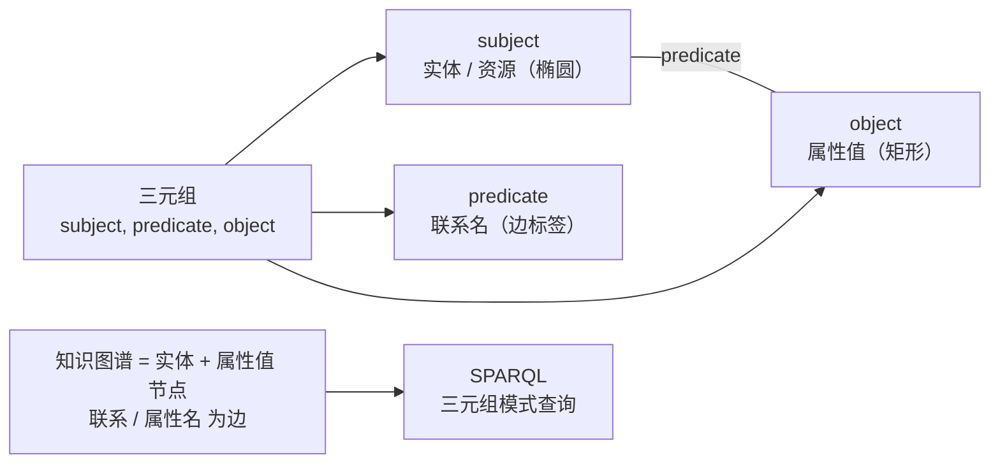
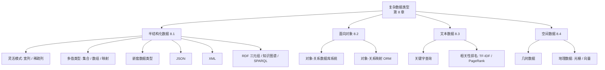
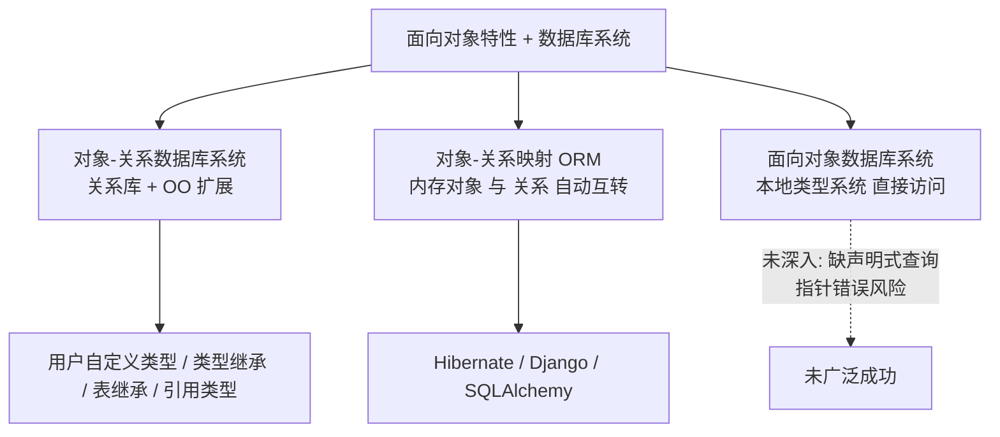

# 第 8 章 复杂数据类型

> [!info] 本章定位
> 关系模型要求数据值是**原子的**（核心模型不允许多值、复合等复杂类型），但在许多应用中这种约束带来的麻烦多于收益。本章讨论四类广泛使用的**非原子数据类型**：半结构化数据、基于对象的数据、文本数据、空间数据。
> - 先修：[[11-数据库]]、[[MOC - 数据库系统概念]]、[[关系模型]]（第 2 章）、[[SQL]]（第 3–5 章）、[[实体-联系模型]]（第 6 章）
> - 后继：[[查询优化]]（第 16 章）、[[存储与文件结构]]（第 13–14 章）、[[空间索引]]（第 14 章）、[[信息检索]]、Web 服务与应用程序开发（第 9 章）、XQuery（第 30 章）

## 8.1 半结构化数据

关系数据库设计要求表带固定数量的属性，每个属性含一个原子值；模式变更（如加属性）很少发生，且可能要改应用代码。这对许多机构应用很合适，但不少领域（如快速演化的 Web 应用、用户配置文件）需要模式频繁变化、含复杂数据的表示。本节研究若干支持半结构化数据表示的数据模型。

半结构化数据的另一大动因是**数据交换**：现代架构常由「检索数据的 Web 服务」+「显示并交互的应用代码（移动 App / 浏览器端 JavaScript）」构成，关键是后端与客户端之间能高效交换、处理复杂数据。JSON 与 XML 即为此而生。

### 8.1.1 半结构化数据模型概述

关系模型已通过多种方式扩展，以支持现代应用的存储与交换需求。

#### 8.1.1.1 灵活模式

> [!definition] 宽列表示（wide column）
> 有些系统允许**每个元组拥有不同的属性集**，属性集不固定，元组可按需新增属性。
>
> [!definition] 稀疏列表示（sparse column）
> 更受限的形式：属性固定但数量很多，每个元组只使用需要的属性，其余置为空值。

#### 8.1.1.2 多值数据类型

许多表示允许属性含非原子值：可将**集合（set）、多重集合（multiset）、数组（array）** 存为属性值。例如把用户兴趣存为集合 `{basketball, La Liga, cooking, anime, Jazz}`，基于用户查找比规范化表示更高效。

有些表示允许属性存**键值映射（key-value map，简称 map）**：一组 `(key, value)` 对，每个键最多出现一次。例如电商产品的明细可表示为映射。

> [!example] 键值映射示例（已修正原书转录笔误）
> 原书示例 `{brand,Apple),(ID,MacBookAir),(size,13),(color,silver}` 缺首元素的左括号且括号不匹配，规范写法应为：
> `{(brand,Apple),(ID,MacBookAir),(size,13),(color,silver)}`
> `put(key,value)` 添加一对，`get(key)` 检索值，`delete(key)` 删除一对。

数组对科学/监测应用很重要（图像即像素二维数组；传感器定期读数可视为数组，空间远小于「(时间,读数)」元组，还可压缩）。

> [!definition] 数组数据库（array database）
> 专为数组提供高效压缩存储与查询语言扩展的数据库，如 Oracle GeoRaster、PostGIS、SciQL、SciDB。

> [!note] 历史与现状
> 早期提出支持多值属性的 **非一范式（non first-normal-form, NFNF）** 数据模型；如今 Oracle、PostgreSQL 等关系库已直接支持集合与数组类型。

#### 8.1.1.3 嵌套数据类型

> [!definition] 嵌套数据类型（nested data type）
> 允许对属性结构化（如 `name` 含 `firstname`/`lastname`），并支持集合/数组/映射等多值类型，形成属性的**层次结构**（对应一棵树），许多数据库把它作为面向对象支持的一部分（见 8.2）。

**JSON** 与 **XML** 是两种广泛使用的灵活结构表示：
- 与宽表类似，它们对「记录含哪些属性、属性类型」提供灵活性；
- 但更进一层：对象可有子对象，每个对象对应一个树结构；
- 因能把关于业务对象的多条信息打包进单个结构，在**应用间数据交换**中广受认可。

如今 JSON 广泛用于后端与移动/Web 前端之间交换数据，也利于把与某用户相关的不同数据收集进一个大型对象（一份文档）中、免连接检索。XML 较旧，常用于配置与数据交换。

#### 8.1.1.4 知识表示

> [!definition] 资源描述框架（RDF，Resource Description Framework）
> 一种被广泛采用的知识表示，特性比早期知识表示少，但更适合处理极大数据量。与 E-R 模型类似，RDF 把数据建模为「有属性、与其他对象有联系的对象」，可看作**三元组集合**或**图**（对象/属性值为节点，联系/属性名为边）。详见 8.1.4。

### 8.1.2 JSON

**JavaScript 对象表示法（JSON）** 是复杂数据类型的文本表示，广泛用于应用间传输与存储复杂数据。它支持整数、浮点、字符串等基础类型，以及数组和「对象」（即 `(属性名, 值)` 对的集合）。

![[Pasted image 20260721214324.png]]

**图 8-1** 展示用 JSON 表示数据的示例。对象不必遵循固定模式，本质上等同于以属性名为键、属性值为关联值的键值映射。示例中的方括号数组可视为「从整数偏移量到值的映射」。

JSON 现已成为应用与 Web 服务间通信的主要表示：应用调用 Web 服务（参数可为简单值或 JSON 复杂对象），Web 服务用 JSON 返回结果（如邮件 UI 分步骤验证身份、获取标题、获取正文、发送邮件等）。

- 许多库能在 JSON 与 JavaScript/Java/Python/PHP 等语言的对象表示间便捷转换，这一便利性助推了 JSON 的普及。
- 与关系表示不同，JSON 较冗长、占空间大，解析文本取字段也耗 CPU；故出现 **BSON（Binary JSON）** 等压缩二进制格式。
- SQL 也已扩展支持 JSON：
  - 可存为 `JSON` 数据类型；
  - 可由关系数据**生成** JSON（如 PostgreSQL `json_build_object('ID',12345,'name','Einstein')` 返回对象；`json_agg` 从行集聚出单个对象；Oracle `json_objectagg`/`json_arrayagg`；SQL Server `FOR JSON AUTO`）；
  - 可用路径结构**提取** JSON 中的值（PostgreSQL `v->'ID'`；Oracle `..`；SQL Server `JSON_VALUE(value, path)`）。

> [!warning] 方言依赖
> 这些扩展的确切语法与语义完全依赖具体数据库系统；详见本章参考文献。

### 8.1.3 XML

**XML** 用尖括号 `<>` 包裹的**标签（tag）** 在文本中标记信息，标签成对 `<tag>` … `</tag>` 界定起止。例如 `<title>Database System Concepts</title>`。把关系名、属性名用作标签即可表示关系数据：

```xml
<course>
  <course_id>CS-101</course_id>
  <title>Intro. to Computer Science</title>
  <dept.name>Comp. Sci.</dept.name>
  <credits>4</credits>
</course>
```

与关系模式不同，新标签易引入，数据「自描述」（人可据名称理解含义）；标签还能创建层次结构（关系模型做不到），对机构间交换的业务对象（账单、购货单等）尤其重要。

![[Pasted image 20260721214334.png]]

**图 8-2** 展示用 XML 表示购货单信息（通常由一机构生成发给另一机构，含各种嵌套信息，单份文档即可自然表达；真实购货单信息远多于该简化示例）。XML 提供标记数据的标准方式，但两机构须就标签及其含义达成一致。

- **XQuery** 为查询 XML 数据而开发（详见第 30 章）；虽有可用实现，但采用相对有限。
- SQL 也已扩展支持 XML：
  - 可存为 `XML` 数据类型；
  - 可由关系数据**生成** XML（如 `XMLAGG` 聚集函数按行构造 XML 文档）；
  - 可用 **XPath** 路径表达式从 XML 中**提取**数据（详见第 30 章）。

### 8.1.4 RDF 和知识图谱

**资源描述框架（RDF）** 是一种基于实体-联系模型的数据表示标准。

#### 8.1.4.1 三元组表示

> [!definition] RDF 三元组（triple）
> RDF 用三元组集合表示数据，三元组为以下两种形式之一：
> 1. `(ID, 属性名, 属性值)`
> 2. `(ID1, 联系名, ID2)`
>
> 其中 `ID`、`ID1`、`ID2` 是实体标识，在 RDF 中称为**资源（resource）**。与 E-R 模型不同，RDF 只支持**二元联系**，不支持更一般的 \(n\) 元联系。三元组的三个分量依次称为**主题（subject）、谓词（predicate）、对象（object）**。

![[Pasted image 20260721214343.png]]

**图 8-3** 展示大学数据库一小部分的三元组表示。属性值加引号，标识不加引号，属性/联系名（谓语）也不加引号。用 `ID` 标识教师/学生、`course_id` 标识课程，每个属性各成一个三元组；对象类型由 `instance-of` 联系给出（如 `10101` 是教师实例，`00128` 是学生实例）。因 `section` 主码复合，创建新标识（如 `sec1`）区分课程段。

实体类型信息用「实体与对象类型间的 `instance-of` 联系」表示，类型-子类型联系表示为类型对象间的 `subtype` 边。与 E-R/关系模式不同，RDF 可为对象轻松添加新属性、创建新联系类型。

#### 8.1.4.2 RDF 的图表示

![[Pasted image 20260721214359.png]]

**图 8-4** 展示图 8-3 数据的图表示：对象用椭圆、属性值用矩形、联系用带标签的边（省略了 `instance-of`）。



> [!definition] 知识图谱（knowledge graph）
> 用 RDF 图模型（或其变体/扩展）表示的信息称为知识图谱，用途广泛，如从维基百科、维基数据、网络等采集事实存储。例如「华盛顿特区是美国的首都」可表示为连接两节点的、带 `capital-of` 标签的边。

关于实体的问题可用含相关信息的知识图谱作答（如「哪个城市是美国的首都？」可查带 `capital-of` 标签且连到美国实体的边，若类型信息可用还可验证 `instance-of` 边）。

#### 8.1.4.3 SPARQL

> [!definition] SPARQL
> 为查询 RDF 数据而设计的查询语言，基于**三元组模式**（形如 RDF 三元组但可含变量）。例如 `?cid title "Intro. to Computer Science"` 匹配谓语为 `title`、对象为该字符串的所有三元组（`?cid` 为可匹配任意值的变量）。

多个三元组模式可共享变量以表达连接。下面两个模式在图 8-3 上：第一匹配 `(CS-101, title, "Intro. to Computer Science")`，第二匹配 `(sec1, course, CS-101)`，共享 `?cid` 即为连接条件。由此可写出完整查询，检索选修过名为「Intro. to Computer Science」课程段的全体学生姓名。

> [!note] 与 SQL 的区别
> 三元组模式中的**谓语也可以是变量**（匹配任意联系/属性名）。SPARQL 还支持聚集、可选连接（类似外连接）、子查询等。

#### 8.1.4.4 \(n\) 元联系的表示

表示为边的联系只能对二元联系建模。知识图谱已扩展以存储更复杂联系（如用时态信息记录事实为真的时间段：若美国首都在 2050 年从华盛顿迁到纽约，则用「截至 2050 华盛顿为首都」与「2050 后」两个事实表示）。

如 6.9.4 节所述，可用「创建人为实体对应 \(n\) 元联系中的元组、再连到各参与实体」的方式以二元联系表示 \(n\) 元联系。例如创建人为实体 \(e_1\) 表示「奥巴马 2008–2016 任美国总统」，把 \(e_1\) 经 `person`/`country` 边连到奥巴马与美国，并经 `president-from`/`president-till` 属性边连到 2008/2016。这种思路类似 E-R 的**聚集**（6.8.5），在 RDF 中称为**实体化（reification）**；额外信息（如有效期）作为基础边的**限定符（qualifier）**。

其他模型向三元组加第四属性——**上下文**，存储**四元组（quad）** 而非三元组；基本联系仍二元，第四属性让上下文实体与联系关联（有效期可作其属性）。

> [!note] 知识库与开放数据
> WikiData、DBPedia、Freebase、Yago 等提供各类知识的 RDF/知识图谱表示；**链接公开数据（linked open data）** 项目旨在开源各知识图谱并在其间建立连接，支持跨图谱查询与推断。

### 8.1 半结构化数据 · 小结图示



## 8.2 面向对象

**对象-关系数据模型（object-relational data model）** 通过更丰富的类型系统（含复杂类型与面向对象）扩展关系模型，关系查询语言（尤 SQL）需相应扩展以处理之，目标是在保持关系基础（尤其声明式访问）的同时增强建模能力。

许多数据库应用用面向对象语言（Java/Python/C++）编写，但需存取数据库；因语言本地类型系统与关系模型存在类型差，每次存取都需两模型间转换。仅扩展数据库类型系统不足以解决，还得用 SQL 等不同于程序语言的语言表达访问，增加程序员负担。故许多应用希望用程序语言结构直接访问库内数据。

集成面向对象特性与数据库系统有三种方式：

> [!example] 三种集成方式
> 1. **对象-关系数据库系统（object-relational database system）**：为关系库添加 OO 特性。
> 2. **对象-关系映射（ORM）**：存储时把程序语言本地 OO 类型自动转为关系表示，检索时转回；由 ORM 具体说明。
> 3. **面向对象数据库系统（object-oriented database system）**：以本地方式支持 OO 类型系统，允许 OO 语言用其本地类型直接访问数据。

本节简介前两种。第三种虽在语言集成上更优，但因（a）声明式查询对高效访问很重要而命令式语言不支持；（b）指针直接访问增加指针错误致库损坏的风险，并未取得太大成功，故不再深入。



### 8.2.1 对象-关系数据库系统

#### 8.2.1.1 用户自定义类型

SQL 的 OO 扩展允许创建结构化**用户自定义类型**、对此类型的引用，以及含此类型元组的表：

```sql
create type Person (
  ID varchar(20) primary key,
  name varchar(20),
  address varchar(20)
) ref from(ID);
create table people of Person;
```

```sql
insert into people (ID, name, address) values ('12345', 'Srinivasan', '23 Coyote Run');
```

许多系统支持数组与表类型，关系/UDT 的属性可声明为数组或表类型；支持与语法因系统差异大。例如 PostgreSQL `integer[]` 表未定大小整数数组，Oracle 用 `varray(10) of integer`，SQL Server 用表值类型：

```sql
create type interest as table (
  topic varchar(20),
  degree_of_interest int
);
create table users (
  ID varchar(20),
  name varchar(20),
  interests interest
);
```

UDT 还可有关联方法（仅少数系统如 Oracle 支持，本书不详述）。

#### 8.2.1.2 类型继承

```sql
create type Student under Person (degree varchar(20));
create type Teacher under Person (salary integer);
```

`Student`/`Teacher` 继承 `Person` 的 `ID`/`name`/`address`（子类型与超类型关系），结构化类型的方法同样被子类型继承，子类型可重定义方法（不详述）。

#### 8.2.1.3 表继承

表继承允许把一表声明为另一表的子表，对应 E-R 的特化/概化。PostgreSQL 中：

```sql
create table students (degree varchar(20)) inherits people;
create table teachers (salary integer) inherits people;
```

`people` 的每个属性都出现在子表中。SQL:1999 需先指定表类型：

```sql
create table people of Person;
create table students of Student under people;
create table teachers of Teacher under people;
```

把 `students`/`teachers` 声明为 `people` 子表后，插入子表的元组隐式也存在于 `people` 中；查 `people` 会找到直接插入及其子表中的元组（但只能访问 `people` 有的属性）。用 `"only people"` 可只查直接插入 `people`、不含子表的元组。

#### 8.2.1.4 SQL 中的引用类型

一些实现（如 Oracle）支持**引用类型**。可在类型定义中加 `ref from(ID)` 用已有主码作引用，默认则由系统分配标识：

```sql
create type Person (
  ID varchar(20) primary key,
  name varchar(20),
  address varchar(20)
) ref from(ID);
create table people of Person;
```

用 `name` 与引用 `Person` 的 `head` 字段定义 `Department` 类型，再建 `departments` 表；`scope` 子句实现了 `departments.head` 到 `people` 的**外码**：

```sql
create type Department (
  dept_name varchar(20),
  head ref(Person) scope people
);
create table departments of Department;
```

插入时可用 `insert into departments values('CS','12345')`（因 `ID` 用作对 `Person` 的引用）。若需子查询取引用，多数系统不允许在 `values` 中嵌套子查询，可用两步：

```sql
insert into departments values('CS',null);
update departments set head = (select ref(p) from people as p where ID = '12345') where dept_name = 'CS';
```

SQL:1999 用 `->` 对引用取内容（**路径表达式 path expression**）：

```sql
select head->name, head->address from departments;
```

`head` 是对 `people` 元组的引用，故 `name` 即该元组属性；引用可取代连接（否则 `head` 须声明为 `people` 的外码并显式连接）。还可用 `deref` 返回引用指向的元组再访问属性：

```sql
select deref(head).name from departments;
```

### 8.2.2 对象-关系映射

> [!definition] 对象-关系映射（ORM, Object-Relational Mapping）
> 允许程序员定义「数据库关系中的元组」与「编程语言中的对象」之间的映射。可基于选择条件检索对象/对象集（由数据按需创建对象），程序更新对象后发保存命令，再由映射更新/插入/删除底层元组。

- **主要目标**：向程序员提供对象模型，同时保留底层鲁棒关系库的好处；操作内存中缓存对象时性能远高于直接访问库。
- 提供对象模型上的查询语言，自动转成底层 SQL 并据结果建对象。
- **额外好处**：同一高级代码可换用多个数据库（ORM 隐藏了 SQL 方言差异），迁移简便。
- **负面影响**：批量更新与用命令式语言写复杂查询时性能显著下降，此时可绕过 ORM 直接用 SQL。
- 利大于弊，近年广泛应用：Java 的 Hibernate、Python 的 Django 与 SQLAlchemy（9.6.2 节详述）。

## 8.3 文本数据

文本数据由非结构化文本组成。**信息检索（information retrieval）** 通常指非结构化文本数据的查询，传统模型把文本组织成**文档（document）**；数据库中文本值属性可视为文档，Web 中每个网页即一份文档。

### 8.3.1 关键字查询

信息检索系统能据所需信息检索文档，所需文档通常用**关键字（keyword）** 集合描述（如「数据库系统」定位相关文档，「股票」+「丑闻」定位股市丑闻文章）。文档本身已与关键字集关联（通常文中所有词皆关键字）。**关键字查询（keyword query）** 检索出关键字集含查询全部关键字的文档。

最简单形式是定位并返回含全部关键字的文档；更复杂系统估计文档与查询的**相关性**并据相关性排序（利用关键字出现信息与超链接信息）。关键字搜索最初用于机构/领域文档库（如研究出版物），如今对库中文档也很重要；还可检索带描述性关键字的其他数据（视频、音频、图片、视频剪辑等）。

网络搜索引擎是信息检索系统的核心：通过**抓取（crawl）** 网络检索存储网页，用户提交关键字查询，检索含所需关键字的网页。现代引擎还判断查询主题、同时呈现相关网页与其他信息（如查「板球」显示比分，查「纽约」显示地图与图片）。

### 8.3.2 相关性排名

含查询关键字的文档集可能极大（Web 上数十亿文档，多数查询找到数十万相关文档），并非全部同等相关，故系统估计相关性、只返回排名靠前者。排名非精密科学，但有公认方法。

#### 8.3.2.1 使用 TF-IDF 的排名

**术语（term）** 指文档中或查询里的关键字。给定术语 \(t\) 与文档 \(d\)，一种相关性度量是文档中该术语出现次数（假设更相关者被提更多次），但仅计数不好：依赖文档长度；出现 10 次未必是 1 次的 10 倍。

> [!definition] 术语频率 TF
> \[
> TF(d,t) = \log \left(1 + \frac{n(d,t)}{n(d)}\right)
> \]
> 其中 \(n(d)\) 为文档中术语总数，\(n(d,t)\) 为 \(t\) 在 \(d\) 中出现次数。公式考虑了文档长度：出现越多相关性越大，但非正比于次数。

许多系统用其他信息改进（如术语出现在标题/作者/摘要中则更相关；首次出现位置靠后则相关性偏小），形式化为对 \(TF(d,t)\) 的扩展。无论实际公式如何，文档与术语的相关性统称**术语频率（Term Frequency, TF）**。

含多关键字的查询，其相关性由各关键字相关性度量结合（简单相加）。但关键字并非等同：高频词（如 `database`）与低频词（如 `Silberschatz`）应区别对待——含 `Silberschatz` 不含 `database` 的文档应排名更前。

> [!definition] 逆文档频率 IDF 与相关性 \(r(d,Q)\)
> \[
> IDF(t) = \frac{1}{n(t)}
> \]
> \(n(t)\) 为含术语 \(t\) 的文档数。文档 \(d\) 与术语集 \(Q\) 的**相关性**：
> \[
> r(d, Q) = \sum_{t \in Q} TF(d, t) \cdot IDF(t)
> \]
> 若用户指定权重 \(w(t)\)，则把 \(TF(d,t)\) 乘 \(w(t)\) 计入。上述利用 TF 与 IDF 的方法称 **TF-IDF 方法**。

- **停用词（stop word）**：如 `and`/`or`/`a` 等逆文档频率极低、对查询无用，约 100 个最常用词，索引时忽略、出现在用户关键字中则去除。
- **接近度（proximity）**：查询含多术语时，术语在文档中彼此靠近则排名更前，可修改 \(r(d,Q)\) 计入。

系统按相关性降序返回文档，通常只返前几份并允许用户请求更多。

#### 8.3.2.2 使用超链接的排名

文档间超链接可用于决定总体重要性（与关键字查询无关）。被许多其他文档链接的文档更重要。

> [!definition] PageRank
> Google 引入，基于「指向某页面的那些页面的流行度」度量被指向页面的流行度，效果大幅优于以往技术。文档 \(d\) 的 PageRank 基于链接到 \(d\) 的其他文档的 PageRank 循环定义：设跳转概率矩阵 \(T\)，\(T[i,j]\) 为从页 \(i\) 沿链接走到页 \(j\) 的概率（\(T[i,j]=1/N_i\)，\(N_i\) 为从 \(i\) 引出链接数），则页 \(j\) 的 PageRank：
> \[
> P[j] = \delta / N + (1 - \delta) \cdot \sum_{i = 1}^{N} (T[i,j] \cdot P[i])
> \]
> \(\delta\) 为 \(0\sim1\) 常数（通常 0.15），\(N\) 为页面数。方程组通常用迭代法求解（初值 \(P[j]=1/N\)，至最大变化低于临界值停止）。PageRank 是与关键字查询无关的静态度量，通常与 TF-IDF 分数结合判断相关性。

其他流行度度量：网站被访问频繁程度、用户点击返回页次数；超链接锚文本中的关键字被赋更高术语频率等。

### 8.3.3 检索有效性的度量

> [!definition] 查准率 / 查全率
> - **查准率（precision）**：检索到的文档中真正相关的百分比。
> - **查全率（recall）**：相关的文档中被检索到的百分比。
>
> 因结果极多、用户常浏览一定数量（如 10/20）后停止，通常按「@K」度量（如 precision@10、recall@20）。

### 8.3.4 结构化数据和知识图谱上的关键字查询

结构化数据查询通常用 SQL，但不知模式/查询语言的用户难从中获信息。受 Web 关键字查询成功启发，已开发支持结构/半结构化数据上关键字查询的技术。

一种方法：用图表示数据（元组为节点，外码/其他连接为边），关键字查询建模为「找含给定关键字的元组及它们之间连接路径」。例如大学库查 `Zhang Katz` 可能找到 `student` 中 `name='Zhang'`、`instructor` 中 `name='Katz'`，以及 `advisor` 中连接二者的路径（或 `Zhang` 选修 `Katz` 讲授课程的路径）。当非专业用户不知准确模式、懒得写 SQL 时，这类查询便于即席浏览。答案须经排名（基于连接路径长度、边方向/权值、外码链接赋予的流行度等）。

知识图谱可与文本信息一起答查询：为文档提及的实体提供唯一标识并注解（如 `Stonebraker developed PostgreSQL` 中 `Stonebraker` 被链到「Michael Stonebraker」实体，图谱还记其获图灵奖，则 `turing award postgresql` 查询可结合文档与图谱作答）。现代搜索引擎除爬文档外，还用大型知识图谱答查询。

## 8.4 空间数据

空间数据的高效存储、索引、查询对基于空间位置数据的应用很重要。

> [!definition] 两类空间数据
> - **地理数据（geographic data）**：道路图、土地使用图、地形海拔图、边界地图、土地所有权图等；**地理信息系统（GIS）** 为存储地理数据而定制的专用库，基于地球圆坐标系（纬度/经度/海拔）。
> - **几何数据（geometric data）**：建筑、汽车、飞机等物体的空间构造信息，基于二维/三维欧几里得空间（\(x\)/\(y\)/\(z\)）。
>
> 许多系统支持二者，如 Oracle Spatial and Graph、PostgreSQL PostGIS、SQL Server、IBM DB2 Spatial Extender。实现技术见第 14–15 章。表示语法因库而异（OGC 标准渐受支持）。

### 8.4.1 几何信息表示

![[Pasted image 20260721214446.png]]

**图 8-5** 以规范化方式表示各种几何结构（仅描述数种）：

- **线段（line segment）**：用端点坐标表示（地图库中点的坐标即纬度/经度）。
- **折线（polyline / line string）**：相连线段序列，用端点坐标有序列表表示；任意曲线可划分成线段序列近似（道路等二维特征适用）。有些系统把**圆弧（circular arc）** 作原语。
- **多边形（polygon）**：按顺序列顶点（图 8-5），顶点列表即区域边界；另一表示把多边形分割成三角形（**三角剖分 triangulation**，任意多边形可三角剖分，复杂多边形带标识，每三角形带该标识）。圆/椭圆可用相应类型或多边形近似。

折线/多边形的列表表示便于查询处理；底层库支持时也可用非一范式表示（固定大小元组以 1NF 表示折线，赋标识，每条线段作带标识的单独元组；三角剖分同理）。

三维点/线段类似二维（多 \(z\) 坐标）；平面图形（三角/矩形/多边形）表示变化不大，四面体/长方体同理；任意多面体可分割成四面体（如多边形三角剖分），或列其面（每面为多边形，须指明哪侧为内侧）。

SQL Server 与 PostGIS 支持几何/地理类型及其子类型（点、线串、曲线、多边形及多点/多线串/多曲线/多多边形），文本表示由 OGC 定义、可用转换函数转内部表示：`LINESTRING(1 1, 2 3, 4 4)`、`POLYGON((1 1, 2 3, 4 4, 1 1))`，`ST_GeometryFromText()`/`ST_GeographyFromText()` 转对象；操作返回同类型对象（如 `ST_Union()`、`ST_Intersection()` 算并集/交集）。函数名与语法因系统而异。

地图数据中道路线段互连构成**空间网络（spatial network / 空间图 spatial graph）**：顶点有空间位置、互连信息成边，边带距离/车道数/分时平均速度等信息。

### 8.4.2 设计数据库

**计算机辅助设计（CAD）** 系统传统上把数据存内存、编辑末写回文件，缺点包括格式转换开销、须整文件读入（大型设计如大规模集成电路/整架飞机可能放不下内存）。面向对象数据库很大程度上受 CAD 对库需求激励：把设计组件表示为对象，对象间连接表明构造方式。

设计库存对象通常是几何对象：二维简单对象（点/线/三角/矩形/多边形）经并/交/差构成复杂二维对象；三维简单对象（球/圆柱/长方体）同理构成复杂三维对象（如图 8-6）。三维表面也可用**线框模型（wireframe model）** 表示为一组相对简单对象（线段/三角/矩形）。

![[Pasted image 20260721214457.png]]

**图 8-6** 复杂三维对象由简单对象（球体、圆柱体、长方体）经并、交、差运算构成。设计库还存非空间信息（如材料），可用标准建模技术。设计中须执行各种空间运算（如检索某区域的设计部分），14.10.1 节的空间索引结构有用（多维、处理二维/三维数据，非 \(B^+\) 树的一维排序）。

**空间完整性约束**（如「两根水管不应在同一位置」）对防接口错误很重要：手工设计常出错、且要等原型构建才检出，修改代价高；库对空间约束的支持可避免错误、保持一致性，同样依赖高效多维索引。

### 8.4.3 地理数据

地理数据本质空间，但与设计数据有异：地图与卫星图像是典型，不仅提供位置（边界/河流/道路），还提供海拔、土壤类型、土地使用、年降雨量等。

#### 8.4.3.1 地理数据的应用

用途包括在线地图与导航服务、公共设施（电话/电力/供水）分布网络、土地使用信息、土地所有权记录等。地下电缆/管道网络的增加使设施地理库很重要（无详细地图施工可能破坏他设施致瘫痪，结合 GPS 精确定位可避免）。

#### 8.4.3.2 地理数据的表示

> [!definition] 光栅数据 vs 向量数据
> - **光栅数据（raster data）**：二维/高维位图或像素图（如地区卫星图像），含位置（角点经纬度）与分辨率（总像素数或每像素覆盖面积）。常用**栅格（tile）** 表示（每栅格覆盖固定区域，不同缩放级别建不同栅格集）；可为三维（如不同海拔温度）、时间可作另一维。
> - **向量数据（vector data）**：由点/线段/折线/三角/二维多边形及圆柱/球/长方体/三维多面体等基本几何对象构成（点用经纬度、相关处用海拔）。地图常以向量表示（道路为折线，湖泊/州/国为复杂多边形，河流为复杂曲线或多边形）。

地区地理信息（如年降雨量）可以光栅数组表示（可压缩，24.4.1 节用**四叉树 quadtree** 研究其另一种表示）；也可向量形式用多边形表示（每多边形代表数组值相同的区域，某些应用更简洁精确，如道路用像素会损精度；但不适合本质光栅的数据如卫星图像）。

**地形信息（topographical information）**（每点海拔）可光栅表示；也可把表面分成近似等高的多边形以向量表示（每多边形对应单海拔值）；或三角剖分（每三角用三角的纬度/经度/海拔表示），称**三角剖分不规则网络（TIN, Triangulated Irregular Network）**，对产生区域三维视图尤有用。

GIS 通常含光栅与向量两种数据，显示时可合并（如卫星图像背景上叠道路信息的混合显示）。地图多由多层自底向上组成；即便以向量存储，发送给 UI（如 Web 浏览器）前也可能转成光栅（原因：禁用 JS 的浏览器也能显示；或防终端用户提取向量数据）。地图服务（Google Maps/Bing Maps）提供 API 允许创建专用显示，把面向应用的数据叠在标准地图数据上（如区域地图叠餐馆信息，可动态构造、按风格筛选、改缩放/平移）。

### 8.4.4 空间查询

> [!example] 常用空间查询类型
> - **区域查询（region query）**：处理空间区域，找部分/全部位于指定区域内的对象。如「给定城镇边界内所有零售店」。PostGIS 支持 `ST_Contains()`/`ST_Overlaps()`/`ST_Disjoint()`/`ST_Touches()` 等谓词；SQL Server 有同名略异函数。
> - **近距查询（nearness query）**：找特定位置附近的对象（如给定点给定距离内所有餐馆）。**最近邻查询（nearest-neighbor query）** 找离特定点最近的对象（如最近加油站，不必指定距离范围）。PostGIS `ST_Distance()` 给最小距离。
> - **空间图查询（spatial graph query）**：基于空间图（如道路/火车网络）求信息（如两位置间最短路径），导航系统常见。

两空间关系的交可看作**空间连接（spatial join）**（如降雨量关系与人口密度关系以位置为连接属性）；一般以空间谓词（`ST_Contains()`/`ST_Overlaps()`）作连接谓词。空间查询常是空间与非空间请求的结合（如「可提供素食、每餐低于 10 美元的最近餐馆」）。

## 8.5 总结

- 许多应用领域需存储比「固定属性简单表」更复杂的数据。
- SQL 标准含数据定义与查询语言的扩展以处理新类型并有 OO 特征：以集合为值的属性、继承、元组引用；试图在扩展建模能力的同时保持关系基础（尤其声明式访问）。
- 半结构化数据：模式常变、数据复杂。现代架构常由「检索数据的 Web 服务」+「显示并交互的应用代码」构成。
- 关系模型以多种方式扩展以支持现代存储与交换需求；一些系统允许每元组有不同属性集；许多表示允许属性取非原子值、对属性结构化（直接建模 E-R 复合属性）。
- JSON 是复杂数据类型文本表示，广泛用于应用间传输与存储；XML 对记录含哪些属性及类型提供灵活性。
- RDF 是基于 E-R 模型的数据表示标准，有自然的图解释（实体/属性值为节点，属性名/联系名为边）；SPARQL 是基于三元组模式的 RDF 查询语言。
- 面向对象提供子类型/子表的继承，以及对象（元组）的引用。
- 对象-关系数据模型以更丰富类型系统（含集合类型与 OO）扩展关系模型；对象-关系数据库系统为想用 OO 特性的关系库用户提供方便迁移途径。
- ORM 为关系库中数据提供对象视图：对象瞬态、无持久对象标识，由关系数据按需创建、更新即通过更新关系数据实现；ORM 广泛采用，而持久化程序语言的采用受限。
- 信息检索系统存储/查询文本数据，用更简单数据模型但提供更强的受限查询能力；关键字查询定位文档，系统基于潜在相关性排序。相关性排名用：术语频率、逆文档频率、流行度排名。
- 空间数据管理对许多应用重要；几何/地理类型获许多系统支持（子类型含点/线串/多边形）；区域查询、最近邻查询、空间图查询是常用空间查询类型。

## 术语表

| 术语 | 英文 | 所在节 | 相关概念 |
| --- | --- | --- | --- |
| 宽列 / 稀疏列 | wide column / sparse column | 8.1.1.1 | [[关系模型]] |
| 多值类型 | set / multiset / array / map | 8.1.1.2 | [[嵌套数据类型]] |
| JSON | JavaScript Object Notation | 8.1.2 | [[半结构化数据模型]] |
| XML / XQuery / XPath | eXtensible Markup Language | 8.1.3 | 第 30 章 |
| RDF 三元组 / 知识图谱 | Resource Description Framework | 8.1.4 | [[实体-联系模型]] |
| SPARQL | SPARQL Protocol/Query | 8.1.4.3 | [[半结构化数据模型]] |
| 对象-关系数据模型 | object-relational data model | 8.2 | [[对象数据模型]] |
| 对象-关系映射 | ORM | 8.2.2 | [[SQL]] |
| TF-IDF | Term Frequency–Inverse Document Frequency | 8.3.2.1 | 信息检索 |
| PageRank | PageRank | 8.3.2.2 | 超链接排名 |
| 查准率 / 查全率 | precision / recall | 8.3.3 | 信息检索 |
| 几何 / 地理数据 | geometric / geographic data | 8.4 | 空间索引 |
| 空间连接 | spatial join | 8.4.4 | [[查询优化]] |

## 相关概念（延伸阅读）

- 数据模型基础：[[关系模型]]（第 2 章）、[[实体-联系模型]]（第 6 章）、[[SQL]]（第 3–5 章）、[[数据库规范化]]（第 7 章）
- 非原子类型：[[半结构化数据模型]]、[[对象数据模型]]、嵌套/多值/数组类型、键值映射
- 查询与语言：SPARQL、XQuery（第 30 章）、[[查询优化]]（第 16 章）
- 存储与索引：[[存储与文件结构]]（第 13–14 章）、空间索引（14.10.1）、四叉树（24.4.1）
- 应用开发：Web 服务（9.5.2）、Hibernate/Django ORM（9.6.2）
- 可靠性与其他：[[事务]]、[[并发控制]]、[[故障恢复]]（第 17–19 章）
