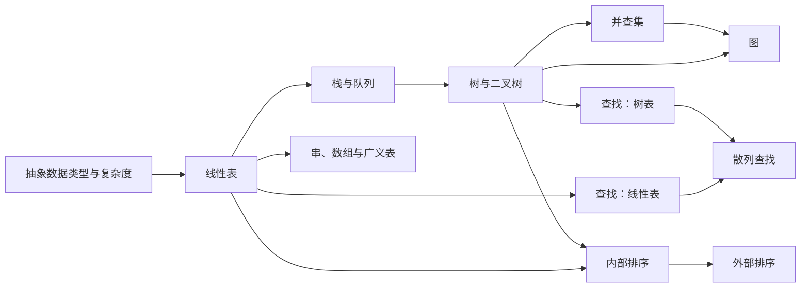

# 数据结构 · 课程地图

数据结构研究如何组织数据、维护数据之间的关系，并在明确的不变量和计算模型下高效完成访问、插入、删除、查找与排序。本 MOC 保留教材的章节入口，同时把分散在各章的“抽象—表示—操作—复杂度—应用”连接成一张可检索的课程地图。

> [!overview] 使用方式
> - 按教材顺序阅读：从[[MOC - 第1章 绪论]]依次进入第八章。
> - 按问题检索：使用下方“按任务选择入口”和“核心比较轴”。
> - 按知识依赖复习：沿课程全景图中的箭头查看先修关系；箭头表达概念依赖，不表示固定学习日程。
> - 集中练习：进入[[习题/习题|数据结构习题集]]，需要核对时查看[[习题/数据结构习题完整解答|完整解答]]。

> [!warning] 代码语境
> 章节中的算法描述以教材类 C 语言为主，部分代码混用 C 与 C++ 的表示习惯，并依赖各章预先定义的数据类型。代码块的语言标记用于语法高亮，不等同于“可独立编译”；除正文明确说明外，不应把这些片段视为已经过统一工具链验证的完整程序。

## 课程全景



图中的主线是：先用抽象数据类型界定接口，再选择逻辑结构与存储结构，最后分析操作的时间和空间代价。查找和排序不是孤立章节，它们会复用线性表、树、堆、链表与外存组织方式。

## 章节入口

| 章节 | 核心问题 | 关键入口 |
| --- | --- | --- |
| [[MOC - 第1章 绪论]] | 如何描述数据结构与评价算法？ | [[1.02.02 数据结构|逻辑结构与存储结构]] · [[1.02.03 数据类型和抽象数据类型|ADT]] · [[1.04.03 算法的时间复杂度|时间复杂度]] · [[1.04.04 算法的空间复杂度|空间复杂度]] |
| [[MOC - 第2章 线性表]] | 连续存储与链式存储如何取舍？ | [[MOC - 第2章 线性表#2.4 线性表的顺序表示和实现|顺序表]] · [[MOC - 第2章 线性表#2.5 线性表的链式表示和实现|链表]] · [[MOC - 第2章 线性表#2.6 顺序表和链表的比较|结构比较]] · [[MOC - 第2章 线性表#2.7 线性表的应用|合并与归并]] |
| [[MOC - 第3章 栈和队列]] | 如何用受限线性表表达顺序约束？ | [[MOC - 第3章 栈和队列#3.3 栈的表示和实现|栈]] · [[MOC - 第3章 栈和队列#3.4 栈与递归|递归工作栈]] · [[MOC - 第3章 栈和队列#3.5 队列的表示和实现|队列]] · [[3.06 案例分析与实现|典型应用]] |
| [[MOC - 第4章 串、数组和广义表]] | 特殊线性结构与多维结构如何表示？ | [[4.03.03 串的模式匹配算法|BF 与 KMP]] · [[4.04.02 数组的顺序存储|数组映像]] · [[4.04.03 特殊矩阵的压缩存储|压缩存储]] · [[MOC - 第4章 串、数组和广义表#4.5 广义表|广义表]] |
| [[MOC - 第5章 树和二叉树]] | 如何表示层次关系并利用递归结构？ | [[MOC - 第5章 树和二叉树#5.4 二叉树的性质和存储结构|性质与存储]] · [[MOC - 第5章 树和二叉树#5.5 遍历二叉树和线索二叉树|遍历与线索化]] · [[MOC - 第5章 树和二叉树#5.7 哈夫曼树及其应用|哈夫曼编码]] · [[MOC - 第5章 树和二叉树#5.8 并查集及其应用|并查集]] |
| [[MOC - 第6章 图|第六章 图]] | 如何处理多对多关系与网络问题？ | [[MOC - 第6章 图#6.4 图的存储结构|图的表示]] · [[MOC - 第6章 图#6.5 图的遍历|DFS 与 BFS]] · [[6.06.01 最小生成树|最小生成树]] · [[6.06.02 最短路径|最短路径]] · [[6.06.03 拓扑排序|拓扑排序]] |
| [[MOC - 第7章 查找|第七章 查找]] | 不同组织方式如何改变查找代价？ | [[MOC - 第7章 查找#7.2 线性表的查找|线性表查找]] · [[MOC - 第7章 查找#7.3 树表的查找|树表查找]] · [[MOC - 第7章 查找#7.4 散列表的查找|散列查找]] · [[7.01 查找的基本概念|平均查找长度]] |
| [[MOC - 第8章 排序]] | 如何按输入特征、稳定性与存储层次选择排序？ | [[MOC - 第8章 排序#8.2 插入排序|插入类]] · [[MOC - 第8章 排序#8.3 交换排序|交换类]] · [[MOC - 第8章 排序#8.4 选择排序|选择类]] · [[MOC - 第8章 排序#8.5 归并排序|归并类]] · [[MOC - 第8章 排序#8.7 外部排序|外部排序]] |

## 与计算机科学引论的衔接

[[MOC - 计算机科学引论]]提供全学科视角，本课程把其中“数据如何组织、算法如何评价”两条主线向下展开。以下入口用于在概览与专业细节之间往返，而不是复制两门课的正文。

| 引论中的入口 | 数据结构课程中的深入内容 | 衔接重点 |
| --- | --- | --- |
| [[14-计算机科学理论基础#5. 数据结构|数据结构概览]] | [[1.02.02 数据结构|逻辑结构与存储结构]] | 从结构类型清单进入统一定义与表示方法 |
| [[14-计算机科学理论基础#6. 复杂度与规模效应|复杂度与规模效应]] | [[1.04.03 算法的时间复杂度|时间复杂度]] · [[1.04.04 算法的空间复杂度|空间复杂度]] | 从数量级直觉进入渐近分析 |
| [[13-编程与语言|编程与语言]] | [[1.02.03 数据类型和抽象数据类型|数据类型与 ADT]] · [[1.03 抽象数据类型的表示与实现|ADT 的实现]] | 从编程流程进入接口、表示和操作 |
| [[11-数据库|数据库]] | [[7.03.05 B+ 树|B+ 树]] · [[MOC - 第7章 查找#7.4 散列表的查找|散列表]] | 从数据模型进入索引结构与查询代价 |
| [[07-二级存储|二级存储]] | [[8.07.01 外部排序的基本方法|外部排序]] | 从介质性能进入以 I/O 次数为核心的算法设计 |

## 贯穿全课的分析框架

每遇到一种新结构，可依次检查以下五个问题；这些问题不会改变各章的原叙述顺序，但能把不同章节放到同一比较框架中。

1. **抽象接口**：数据对象是什么，允许哪些操作？入口：[[1.02.03 数据类型和抽象数据类型|抽象数据类型]]。
2. **逻辑关系**：元素之间是一对一、一对多还是多对多？入口：[[1.02.02 数据结构#1. 逻辑结构|逻辑结构]]。
3. **存储表示**：连续地址、指针链接，还是二者组合？入口：[[1.02.02 数据结构#2. 存储结构|存储结构]]。
4. **结构不变量**：哪些条件必须始终成立，例如栈顶位置、二叉搜索树的有序性、堆序或散列表装填约束？
5. **操作代价**：在同一输入假设下区分最好、平均、最坏、均摊或期望复杂度，并记录辅助空间与外存访问。

## 知识主线

### 线性结构与受限线性结构

- 基础接口与两类表示：[[2.03 线性表的类型定义|线性表 ADT]] → [[MOC - 第2章 线性表#2.4 线性表的顺序表示和实现|顺序表]] / [[MOC - 第2章 线性表#2.5 线性表的链式表示和实现|链表]]。
- 操作受限后的语义：[[3.01.01 栈的定义和特点|栈（LIFO）]]与[[3.01.02 队列的定义和特点|队列（FIFO）]]。
- 内容或维度扩展：[[4.01 串的定义|串]]、[[MOC - 第4章 串、数组和广义表#4.4 数组|数组]]与[[MOC - 第4章 串、数组和广义表#4.5 广义表|广义表]]。

### 非线性结构

- 层次关系：[[MOC - 第5章 树和二叉树#5.1 树和二叉树的定义|树与二叉树]]。
- 多对多关系：[[MOC - 第6章 图#6.1 图的定义和基本术语|图]]。
- 结构转换：[[5.06.02 森林与二叉树的转换|森林与二叉树互转]]把一般树的处理归约到二叉树。
- 遍历范式：树的先序/中序/后序与图的 DFS 共享递归或显式栈思想；树的层次遍历与图的 BFS 共享队列思想。参见[[MOC - 第3章 栈和队列#3.4 栈与递归|栈与递归]]、[[5.05.01 遍历二叉树|二叉树遍历]]和[[MOC - 第6章 图#6.5 图的遍历|图遍历]]。

### 查找与排序

- 静态有序表：[[7.02.02 折半查找|折半查找]]以较低查询代价换取维护有序性的成本。
- 动态有序集合：[[7.03.01 二叉排序树|二叉排序树]]及其平衡变体支持动态查找、插入与删除。
- 直接映射：[[MOC - 第7章 查找#7.4 散列表的查找|散列表]]用空间、装填因子与冲突处理换取期望常数级访问。
- 排序选择：比较[[8.09 小结|内部排序总表]]中的时间、空间与稳定性；数据量超出内存时转向[[MOC - 第8章 排序#8.7 外部排序|外部排序]]。

## 按任务选择入口

| 需求 | 优先查看 | 选择时继续确认 |
| --- | --- | --- |
| 按下标快速访问 | [[MOC - 第2章 线性表#2.4 线性表的顺序表示和实现|顺序表]]、[[4.04.02 数组的顺序存储|数组]] | 是否需要频繁中间插入、删除；容量是否可预估 |
| 频繁局部插入、删除 | [[MOC - 第2章 线性表#2.5 线性表的链式表示和实现|链表]] | 是否已经持有目标结点或前驱；是否需要反向遍历 |
| 最近进入的元素先处理 | [[MOC - 第3章 栈和队列#3.3 栈的表示和实现|栈]] | 是否涉及递归消除、括号匹配或表达式求值 |
| 按到达顺序处理 | [[MOC - 第3章 栈和队列#3.5 队列的表示和实现|队列]] | 有界容量用循环队列；动态增长可用链队列 |
| 表达层级或包含关系 | [[MOC - 第5章 树和二叉树#5.1 树和二叉树的定义|树]] | 是否需要有序查找、优先级或前缀编码 |
| 表达任意连接关系 | [[MOC - 第6章 图#6.4 图的存储结构|图的存储结构]] | 稀疏/稠密、有向/无向、带权/无权 |
| 静态有序数据查找 | [[7.02.02 折半查找|折半查找]] | 是否允许为插入、删除付出维护有序性的代价 |
| 动态有序数据查找 | [[MOC - 第7章 查找#7.3 树表的查找|平衡树或多路查找树]] | 数据在内存还是外存；是否要求严格的最坏界 |
| 精确键值快速访问 | [[MOC - 第7章 查找#7.4 散列表的查找|散列表]] | 散列函数、装填因子、冲突处理与最坏退化 |
| 内存中排序 | [[8.09 小结|内部排序比较]] | 输入规模、初始有序性、稳定性、辅助空间 |
| 超出内存的数据排序 | [[MOC - 第8章 排序#8.7 外部排序|外部排序]] | 归并路数、初始归并段与外存读写次数 |

## 核心比较轴

### 顺序存储与链式存储

| 维度 | 顺序存储 | 链式存储 |
| --- | --- | --- |
| 地址关系 | 逻辑相邻通常映射为物理相邻 | 由指针显式表达关系 |
| 随机访问 | 通常较强 | 通常需要沿链遍历 |
| 插入与删除 | 可能移动后续元素 | 定位后主要修改链接 |
| 空间特征 | 连续空间、较少指针开销 | 动态分配、存在指针开销 |
| 典型入口 | [[MOC - 第2章 线性表#2.4 线性表的顺序表示和实现|顺序表]] | [[MOC - 第2章 线性表#2.5 线性表的链式表示和实现|链表]] |

> [!warning] 比较边界
> “链表插入、删除是 $O(1)$”只在目标位置或所需前驱已经定位时成立；若必须先查找位置，总时间仍可能是 $O(n)$。复杂度结论必须连同前置条件一起使用。

### DFS 与 BFS

| 维度 | DFS | BFS |
| --- | --- | --- |
| 辅助结构 | 递归调用栈或显式栈 | 队列 |
| 扩展方式 | 沿一条路径深入后回溯 | 按距离层次向外扩展 |
| 典型用途 | 连通性、拓扑相关处理、路径枚举 | 无权图最短边数、层次遍历 |
| 入口 | [[6.05.01 深度优先搜索|深度优先搜索]] | [[6.05.02 广度优先搜索|广度优先搜索]] |

### 查找结构

| 组织方式 | 典型查询代价 | 关键前提 | 入口 |
| --- | --- | --- | --- |
| 无序线性表 | $O(n)$ | 几乎无结构要求 | [[7.02.01 顺序查找|顺序查找]] |
| 有序顺序表 | $O(\log n)$ | 可随机访问且保持有序 | [[7.02.02 折半查找|折半查找]] |
| 平衡搜索树 | $O(\log n)$ | 维护树的平衡不变量 | [[MOC - 第7章 查找#7.3 树表的查找|树表查找]] |
| 散列表 | 期望 $O(1)$ | 合理散列与受控装填因子 | [[MOC - 第7章 查找#7.4 散列表的查找|散列查找]] |

## 动态索引

下列 Dataview 查询限定在数据结构课程目录，并按文件路径自动汇总章节属性；新增章节笔记后无需手工维护列表。

```dataview
TABLE chapter AS "章节", section AS "节", status AS "状态", updated AS "最近更新"
FROM "编程与算法/数据结构"
WHERE course = "数据结构" AND type = "课程笔记"
SORT file.path ASC
```

> [!check]- 属性完整性检查
> ```dataview
> TABLE domain, type, status, course, chapter, updated
> FROM "编程与算法/数据结构"
> WHERE type = "课程笔记" AND (!domain OR !status OR !course OR !chapter OR !updated)
> SORT file.path ASC
> ```

## 来源与边界

课程章节主要依据严蔚敏、吴伟民《数据结构（C 语言版）》对应章节整理。各章保留原有教材叙述顺序、案例与代码语境；本 MOC 只提供跨章导航和比较框架，不替代章节中的定义、推导、算法前提与复杂度分析。
