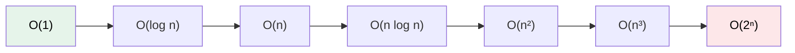

# 1.4.3 算法的时间复杂度

> [!nav] 导航
> 上一知识点：[[1.04.02 评价算法优劣的基本标准]] · [[MOC - 第1章 绪论|本章目录]] · [[MOC - 数据结构|课程总览]] · 下一知识点：[[1.04.04 算法的空间复杂度]]

> [!topic] 所属主题
> [[MOC - 第1章 绪论#1.4 算法和算法分析|1.4 算法和算法分析]]

> [!info] 引论衔接
> [[14-计算机科学理论基础#6. 复杂度与规模效应|计算机科学引论]]用常见数量级建立规模效应的直觉；本节继续给出语句频度、渐近时间复杂度以及最好、最坏和平均情况的分析方法。

衡量算法效率的方法主要有两类：事后统计法和事前分析估算法。事后统计法需要先将算法实现，然后测算其时间和空间开销。这种方法的缺陷很显然，一是必须把算法转换成可执行的程序，二是时空开销的测算结果依赖于计算机的软硬件等环境因素，这容易掩盖算法本身的优劣。所以我们通常采用事前分析估算法，通过计算算法的渐近复杂度来衡量算法的效率。

## 1. 问题规模和语句频度

不考虑计算机的软硬件等环境因素，影响算法时间代价的最主要因素是**问题规模**。问题规模是算法求解问题输入量的多少，是问题大小的本质表示，一般用整数 $n$ 表示。问题规模 $n$ 对不同的问题含义不同，例如，在排序运算中 $n$ 为参加排序的记录数，在矩阵运算中 $n$ 为矩阵的阶数，在多项式运算中 $n$ 为多项式的项数，在集合运算中 $n$ 为集合中元素的个数，在树的有关运算中 $n$ 为树的结点个数，在图的有关运算中 $n$ 为图的顶点数或边数。显然，$n$ 越大算法的执行时间越长。

一个算法的执行时间大致上等于其所有语句执行时间的总和，而语句的执行时间则为该条语句的重复执行次数和执行一次所需时间的乘积。

一条语句的重复执行次数称作**语句频度（Frequency Count）**。

由于语句的执行要由源程序经编译程序翻译成目标代码，目标代码经装配再执行，因此语句执行一次实际所需的具体时间是与机器的软、硬件环境（如机器速度、编译程序质量等）密切相关的。所以，所谓的算法分析并非精确统计算法实际执行所需时间，而是针对算法中语句的执行次数做出估计，从中得到算法执行时间的信息。

设每条语句执行一次所需的时间均是单位时间，则一个算法的执行时间可用该算法中所有语句频度之和来度量。

> [!example] 例 1.4　求两个 $n$ 阶矩阵的乘积
> ```c
> for(i=1; i<=n; i++)                             // 频度为 n+1
>     for(j=1; j<=n; j++)                         // 频度为 n*(n+1)
>     {
>         c[i][j]=0;                              // 频度为 n^2
>         for(k=1; k<=n; k++)                     // 频度为 n^2 * (n+1)
>             c[i][j]=c[i][j]+a[i][k]*b[k][j];    // 频度为 n^3
>     }
> ```
> 该算法中所有语句频度之和，是矩阵阶数 $n$ 的函数，用 $f(n)$ 表示之。换句话说，上例算法的执行时间与 $f(n)$ 成正比。
> $$f(n)=2n^3+3n^2+2n+1$$
> 对于例 1.4 这种较简单的算法，可以直接计算出算法中所有语句的频度；但对于稍微复杂一些的算法，计算所有语句的频度则通常是比较困难的，即便能够计算出，也可能是个非常复杂的函数。因此，为了客观地反映一个算法的执行时间，可以只用算法中的“基本语句”的执行次数来度量算法的工作量。所谓“基本语句”指的是算法中重复执行次数和算法的执行时间成正比的语句，它对算法运行时间的贡献最大。通常，算法的执行时间是随问题规模增长而增长的，因此对算法的评价通常只需考虑其随问题规模增长的趋势。这种情况下，我们只需要考虑当问题规模充分大时，算法中基本语句的执行次数在渐近意义下的阶。如例 1.4 中矩阵的乘积算法，当 $n$ 趋向无穷大时，显然有
> $$\lim_{n \to \infty} f(n)/n^3 = \lim_{n \to \infty} (2n^3 + 3n^2 + 2n + 1)/n^3 = 2$$
> 即当 $n$ 充分大时，$f(n)$ 和 $n^3$ 之比是一个不等于 0 的常数。即 $f(n)$ 和 $n^3$ 是同阶的，或者说 $f(n)$ 和 $n^3$ 的数量级（Order of Magnitude）相同。在这里，我们用“$O$”来表示数量级，记作 $T(n) = O(f(n)) = O(n^3)$。

## 2. 算法的时间复杂度定义

一般情况下，算法中基本语句重复执行的次数是问题规模 $n$ 的某个函数 $f(n)$，算法的时间量度记作：

$$T(n) = O(f(n))$$

它表示随着问题规模 $n$ 的增大，算法执行时间的增长率和 $f(n)$ 的增长率相同，称作算法的**渐近时间复杂度**，简称**时间复杂度（Time Complexity）**。

数学符号“$O$”的严格定义为：

若 $T(n)$ 和 $f(n)$ 是定义在正整数集合上的两个函数，则 $T(n) = O(f(n))$ 表示存在正的常数 $C$ 和 $n_0$，使得当 $n \ge n_0$ 时都满足 $0 \le T(n) \le Cf(n)$。

该定义说明了函数 $T(n)$ 和 $f(n)$ 具有相同的增长趋势，并且 $T(n)$ 的增长至多趋向于函数 $f(n)$ 的增长。符号“$O$”用来描述增长率的上限，它表示当问题规模 $n>n_0$ 时，算法的执行时间不会超过 $f(n)$。
![[Attachments/Pasted image 20260717130524.png|464]]

这意味着，在大“$O$”记号的意义下，函数各项正的常系数可以忽略并等同于 1，多项式中的低次项均可忽略，只需保留最高次项。大“$O$”记号的这些性质体现了对函数总体渐近增长趋势的关注和刻画。

## 3. 算法的时间复杂度分析举例

分析算法时间复杂度的基本方法为：
（1）找出所有语句中语句频度最大的那条语句作为基本语句；
（2）计算基本语句的频度得到问题规模 $n$ 的某个函数 $f(n)$；
（3）$f(n)$ 数量级用符号“$O$”表示即可。

具体计算数量级时，可以遵循以下定理。

> [!note] 定理 1.1
> 若 $f(n) = a_m n^m + a_{m-1} n^{m-1} + \cdots + a_1 n + a_0$ 是一个 $m$ 次多项式，则 $T(n) = O(n^m)$。
> 定理 1.1 说明，在计算算法时间复杂度时，可以忽略所有低次幂项和最高次幂的系数，这样可以简化算法分析，也体现出了增长率含义。

若算法可用递归方法描述，则算法的时间复杂度通常可使用递归方程表示，此时将涉及递归方程求解问题。有关递归算法的时间复杂度分析方法将在第 3 章给出。

下面举例说明如何求非递归算法的时间复杂度。

> [!example] 例 1.5　常量阶示例
> ```c
> {x++; s=0;}
> ```
> 两条语句频度均为 1，算法的执行时间是一个与问题规模 $n$ 无关的常数，所以算法的时间复杂度为 $T(n) = O(1)$，称为常量阶。
> 实际上，如果算法的执行时间不随问题规模 $n$ 的增长而增长，算法中语句频度就是某个常数。即使这个常数再大，算法的时间复杂度都是 $O(1)$。例如，对上面的程序进行如下改动：
> ```c
> for (i=0; i<10000; i++) { x++; s=0; }
> ```
> 算法的时间复杂度仍然为 $O(1)$。

> [!example] 例 1.6　线性阶示例
> ```c
> for(i=0; i<n; i++) { x++; s=0; }
> ```
> 循环体内两条基本语句的频度均为 $f(n)=n$，所以算法的时间复杂度为 $T(n)=O(n)$，称为线性阶。

> [!example] 例 1.7　平方阶示例
> ```c
> (1) x=0; y=0;
> (2) for(k=1; k<=n; k++)
> (3)     x++;
> (4) for(i=1; i<=n; i++)
> (5)     for(j=1; j<=n; j++)
> (6)         y++;
> ```
> 对循环语句只需考虑循环体中语句的执行次数，以上程序段中频度最大的语句是（6），其频度为 $f(n)=n^2$，所以该算法的时间复杂度为 $T(n)=O(n^2)$，称为平方阶。
> 多数情况下，当有若干个循环语句时，算法的时间复杂度是由最深层循环内的基本语句的频度 $f(n)$ 决定的。

> [!example] 例 1.8　立方阶示例
> ```c
> (1) x=1;
> (2) for(i=1; i<=n; i++)
> (3)     for(j=1; j<=i; j++)
> (4)         for(k=1; k<=j; k++)
> (5)             x++;
> ```
> 显而易见，该程序段中频度最大的语句是（5），这条最深层循环内的基本语句的频度，依赖于各层循环变量的取值，由内向外可分析出语句（5）的执行次数为：
> $$\sum_{i=1}^{n} \sum_{j=1}^{i} \sum_{k=1}^{j} 1 = \sum_{i=1}^{n} \sum_{j=1}^{i} j = \sum_{i=1}^{n} \frac{i(i+1)}{2} = \frac{1}{2}\left[\frac{n(n+1)(2n+1)}{6} + \frac{n(n+1)}{2}\right]$$
> 则该算法的时间复杂度为 $T(n)=O(n^3)$，称为立方阶。

> [!example] 例 1.9　对数阶示例
> ```c
> for(i=1; i<=n; i=i*2) { x++; s=0; }
> ```
> 设循环体内两条基本语句的频度为 $f(n)$，则有 $2^{f(n)} \le n$，$f(n) \le \log_2 n$，所以算法的时间复杂度为 $T(n)=O(\log_2 n)$，称为对数阶。

常见的时间复杂度按数量级递增排列依次为：常量阶 $O(1)$、对数阶 $O(\log_2 n)$、线性阶 $O(n)$、线性对数阶 $O(n\log_2 n)$、平方阶 $O(n^2)$、立方阶 $O(n^3)$、$\cdots\cdots$、$k$ 次方阶 $O(n^k)$、指数阶 $O(2^n)$ 等。

![[Attachments/Pasted image 20260717130630.png|437]]

> [!note] 图 1.7　不同数量级的时间复杂度性状
> 一般情况下，随着 $n$ 的增大，$T(n)$ 的增长较慢的算法为较优的算法。显然，时间复杂度为指数阶 $O(2^n)$ 的算法效率极低，当 $n$ 值稍大时就无法应用。应该尽可能选择使用多项式阶 $O(n^k)$ 的算法，而避免使用指数阶的算法。



> 左端效率最高（规模增长时耗时几乎不变），向右端效率递减；到达指数阶 $O(2^n)$ 时已不可实用。

## 4. 最好、最坏和平均时间复杂度

对于某些问题的算法，其基本语句的频度不仅仅与问题的规模相关，还依赖于其他因素。在此仅举一例说明之。

> [!example] 例 1.10　顺序查找
> 在一维数组 `a` 中顺序查找某个值等于 `e` 的元素，并返回其所在位置。
> ```c
> (1) for(i=0; i<n; i++)
> (2)     if(a[i]==e) return i+1;
> (3) return 0;
> ```
> 容易看出，此算法中语句（2）的频度不仅与问题规模 $n$ 有关，还与输入实例中数组 `a[i]` 的各元素值及 `e` 的取值有关。假设在数组 `a[i]` 中必定存在值等于 `e` 的元素，则查找必定成功，且 `for` 循环内的语句的频度将随被找到的元素在数组中出现的位置不同而不同，最好情况是，每次要找的值与 `e` 相同的元素恰好就是数组中的第一个元素，则不论数组的规模多大，语句（2）的频度 $f(n)=1$，最坏情况是，每次待查找的都是数组中最后一个元素，则语句（2）的频度 $f(n)=n$。而对于一个算法来说，需要考虑各种可能出现的情况，以及每一种情况出现的概率。一般情况下，可假设待查找的元素在数组中所有位置上出现的可能性均相同，则可取语句（2）的频度在最好情况与最坏情况下的平均值，即 $f(n)=n/2$，作为它的度量。
> 此例说明，算法的时间复杂度不仅与问题的规模有关，还与问题的其他因素有关。再如某些排序的算法，其执行时间与待排序记录的初始状态有关。因此，有时会对算法有最好、最坏以及平均时间复杂度的评价。

> [!definition] 最好 / 最坏 / 平均时间复杂度
> - **最好时间复杂度**：算法计算量可能达到的最小值；
> - **最坏时间复杂度**：算法计算量可能达到的最大值；
> - **平均时间复杂度**：算法在所有可能情况下，按照输入实例以等概率出现时，算法计算量的加权平均值。

对算法时间复杂度的度量，人们更关心的是最坏情况下和平均情况下的时间复杂度。然而在很多情况下，算法的平均时间复杂度难以确定。因此，通常只讨论算法在最坏情况下的时间复杂度，即分析在最坏情况下，算法执行时间的上界。在本书后面内容中讨论的时间复杂度，除特别指明外，均指最坏情况下的时间复杂度。
