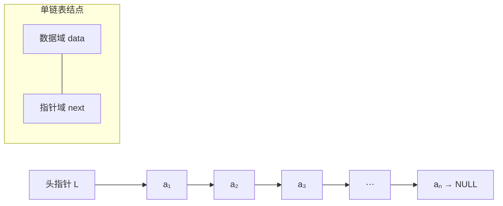
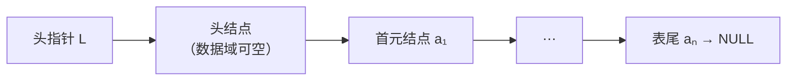

# 2.5.1 单链表的定义和表示

> [!nav] 导航
> 上一知识点：[[2.04.02 顺序表中基本操作的实现]] · [[MOC - 第2章 线性表|本章目录]] · [[MOC - 数据结构|课程总览]] · 下一知识点：[[2.05.02 单链表基本操作的实现]]

> [!topic] 所属主题
> [[MOC - 第2章 线性表#2.5 线性表的链式表示和实现|2.5 线性表的链式表示和实现]]

> [!definition] 单链表 / 线性链表（Singly Linked List）
> 线性表链式存储结构的特点是：用一组**任意的**存储单元存储线性表的数据元素（这组存储单元可以是连续的，也可以是不连续的）。因此，为了表示每个数据元素 $a_i$ 与其直接后继数据元素 $a_{i+1}$ 之间的逻辑关系，对数据元素 $a_i$ 来说，除了存储其本身的信息之外，还需存储一个指示其直接后继的信息（直接后继的存储位置）。这两部分信息组成数据元素 $a_i$ 的存储映像，称为**结点（Node）**。它包括两个域：其中存储数据元素信息的域称为**数据域**；存储直接后继存储位置的域称为**指针域**。指针域中存储的信息称作指针或链。$n$ 个结点链接成一个链表，即为线性表的链式存储结构。
> 又由于此链表的每个结点中只包含一个指针域，故又称**线性链表**或**单链表**。

根据链表结点所含指针个数、指针指向和指针连接方式，可将链表分为单链表、循环链表、双向链表、双向链表、十字链表、邻接表、邻接多重表等。其中单链表、循环链表和双向链表多用于实现线性表的链式存储结构，其他形式多用于实现树和图等非线性结构，最常见链表形式是单链表。

本节先讨论单链表，例如，图 2.7 所示为线性表的单链表存储结构，整个链表的存取必须从头指针开始进行，头指针指示链表中第一个结点（第一个数据元素的存储映像，也称首元结点）的存储位置。同时，由于最后一个数据元素没有直接后继，则单链表中最后一个结点的指针为空（NULL）。
![[Attachments/Pasted image 20260717160433.png|469]]
> 图 2.7 单链表存储结构



用单链表表示线性表时，数据元素之间的逻辑关系是由结点中的指针指示的。换句话说，指针为数据元素之间的逻辑关系的映像，则逻辑上相邻的两个数据元素其存储的物理位置不要求紧邻，由此，这种存储结构为非顺序映像或链式映像。

通常将链表画成用箭头相链接的结点的序列，结点之间的箭头表示链域中的指针。图 2.7 所示的单链表可画成如图 2.8 所示的形式，这是因为在使用链表时，关心的只是它所表示的线性表中数据元素之间的逻辑顺序，而不是每个数据元素在存储器中的实际位置。
![[Attachments/Pasted image 20260717160443.png|548]]
> 图 2.8 单链表的逻辑状态

由上述可见，单链表可由头指针唯一确定。在 C 语言中可用“结构指针”来描述：
```c
// - - - - 单链表的存储结构 - - - -
typedef struct LNode
{
    ElemType data;                // 结点的数据域
    struct LNode *next;           // 结点的指针域
} LNode, *LinkList;               // LinkList 为指向结构体 LNode 的指针类型
```

> [!info] 单链表存储结构的说明
> （1）这里定义的是单链表中每个结点的存储结构，它包括两部分：存储结点的数据域 `data`，其类型用通用类型标识符 `ElemType` 表示（例如，用链表表示案例 2.3 中的图书信息时，只需将 `ElemType` 替换为 2.4.1 定义的 `Book` 数据类型即可）；存储后继结点位置的指针域 `next`，其类型为指向结点的指针类型 `LNode *`。
> （2）为了提高程序的可读性，在此对同一结构体指针类型起了两个名称，`LinkList` 与 `LNode *`，两者本质上是等价的。通常习惯上用 `LinkList` 定义单链表，强调定义的是某个单链表的头指针；用 `LNode *` 定义指向单链表中任意结点的指针变量。例如，若定义 `LinkList L`，则 L 为单链表的头指针，若定义 `LNode *p`，则 p 为指向单链表中某个结点的指针，用 `*p` 代表该结点。当然也可以使用定义 `LinkList p`，这种定义形式完全等价于 `LNode *p`。
> （3）单链表是由表头指针唯一确定的，因此单链表可以用头指针的名字来命名。若头指针名是 L，则简称该链表为表 L。
> （4）注意区分指针变量和结点变量两个不同的概念，若定义 `LinkList p` 或 `LNode *p`，则 p 为指向某结点的指针变量，表示该结点的地址；而 `*p` 为对应的结点变量，表示该结点的名称。

一般情况下，为了处理方便，在单链表的第一个结点之前附设一个结点，称之为**头结点**。图 2.8 所示的单链表增加头结点后如图 2.9 所示。
![[Attachments/Pasted image 20260717160455.png|568]]
> 图 2.9 增加头结点的单链表的逻辑状态

> [!definition] 头结点 / 首元结点 / 头指针
> - **首元结点**：是指链表中存储第一个数据元素 $a_1$ 的结点。如图 2.8 或图 2.9 所示的结点“ZHAO”。
> - **头结点**：是在首元结点之前附设的一个结点，其指针域指向首元结点。头结点的数据域可以不存储任何信息，也可存储与数据元素类型相同的其他附加信息。例如，当数据元素为整型时，头结点的数据域中可存放该线性表的长度。
> - **头指针**：是指向链表中第一个结点的指针。若链表设有头结点，则头指针所指结点为线性表的头结点；若链表不设头结点，则头指针所指结点为该线性表的首元结点。



链表增加头结点的作用如下。
（1）**便于首元结点的处理**：增加了头结点后，首元结点的地址保存在头结点（其“前驱”结点）的指针域中，则对链表的第一个数据元素的操作与其他数据元素的操作相同，无须进行特殊处理。
（2）**便于空表和非空表的统一处理**：当链表不设头结点时，假设 L 为单链表的头指针，它应该指向首元结点，则当单链表为长度 $n$ 为 0 的空表时，L 指针为空（判定空表的条件可记为：`L == NULL`）。增加头结点后，无论链表是否为空，头指针都是指向头结点的非空指针。如图 2.10（a）所示的非空单链表，头指针指向头结点。若为空表，则头结点的指针域为空（判定空表的条件可记为：`L->next == NULL`），如图 2.10（b）所示。
![[Attachments/Pasted image 20260717160508.png|567]]
> 图 2.10 带头结点的单链表

在顺序表中，由于逻辑上相邻的两个元素在物理位置上紧邻，则每个元素的存储位置都可以线性表的起始位置计算得到。而在单链表中，各个元素的存储位置都是随意的。然而，每个元素的存储位置都包含在其直接前驱结点的信息之中。假设 `p` 是指向单链表中第 $i$ 个数据元素（结点 $a_i$，即数据域为 $a_i$ 的结点）的指针，则 `p->next` 是指向第 $i+1$ 个数据元素（结点 $a_{i+1}$）的指针。换句话说，若 `p->data = a_i`，则 `p->next->data = a_{i+1}`。由此，单链表是非随机存取的存储结构，要取得第 $i$ 个数据元素必须从头指针出发顺链进行寻找，也称为**顺序存取**的存储结构。因此，其基本操作的实现不同于顺序表。
