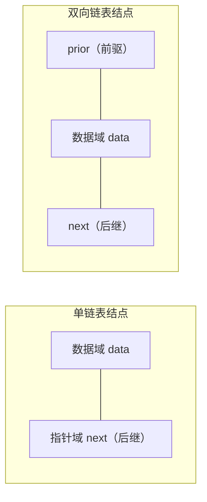

# 2.5.4 双向链表

> [!nav] 导航
> 上一知识点：[[2.05.03 循环链表]] · [[MOC - 第2章 线性表|本章目录]] · [[MOC - 数据结构|课程总览]] · 下一知识点：[[2.06.01 空间性能的比较]]

> [!topic] 所属主题
> [[MOC - 第2章 线性表#2.5 线性表的链式表示和实现|2.5 线性表的链式表示和实现]]

以上讨论的链式存储结构的结点中只有一个指示直接后继的指针域，由此，从某个结点出发只能顺指针向后寻查其他结点。若要寻查结点的直接前驱，则必须从表头指针出发。换句话说，在单链表中，查找直接后继的执行时间为 $O(1)$，而查找直接前驱的执行时间为 $O(n)$。为克服单链表这种单向性的缺点，可利用**双向链表（Double Linked List）**。

> [!definition] 双向链表（Double Linked List）
> 在双向链表的结点中有两个指针域，一个指向直接后继，另一个指向直接前驱。



顾名思义，在双向链表的结点中有两个指针域，一个指向直接后继，另一个指向直接前驱，结点结构如图 2.19（a）所示，在 C 语言中可描述如下：
```c
// - - - - 双向链表的存储结构 - - - -
typedef struct DuLNode
{
    ElemType data;                      // 数据域
    struct DuLNode *prior;              // 指向直接前驱
    struct DuLNode *next;               // 指向直接后继
} DuLNode, *DuLinkList;
```

和单循环链表类似，双向链表也可以有循环表，如图 2.19（c）所示，链表中存有两个环，图 2.19（b）所示为只有一个表头结点的空的双向循环链表。
![[Attachments/Pasted image 20260717160730.png]]
> 图 2.19 双向循环链表示例

在双向链表中，若 `d` 为指向表中某一结点的指针（`d` 为 `DuLinkList` 型变量），则显然有：
`d->next->prior = d->prior->next = d`
这个表示方式恰当地反映了这种结构的特性。

在双向链表中，有些操作（如 `ListLength`、`GetElem` 和 `LocateElem` 等）仅需涉及一个方向的指针，则它们的算法描述和线性链表相同，但在插入、删除时有很大的不同，在双向链表中进行插入、删除时需同时修改两个方向上的指针，图 2.20 和图 2.21 分别显示了插入和删除结点时指针修改的情况。在插入结点时需要修改 4 个指针，在删除结点时需要修改两个指针。它们的实现分别如算法 2.13 和算法 2.14 所示，两者的时间复杂度均为 $O(n)$。
![[Attachments/Pasted image 20260717160745.png]]
![[Attachments/Pasted image 20260717160752.png]]
> 图 2.20 在双向链表中插入结点时指针的变化状况  |  图 2.21 在双向链表中删除结点时指针的变化状况

> [!example] 算法 2.13 双向链表的插入
> 【算法描述】
> ```c
> Status ListInsert_DuL(DuLinkList &L, int i, ElemType e)
> {// 在带头结点的双向链表 L 中第 i 个位置之前插入元素 e
>     if (!(p=GetElem_DuL(L, i)))         // 在 L 中确定第 i 个元素的位置指针 p
>         return ERROR;                   // p 为 NULL 时，第 i 个元素不存在
>     s=new DuLNode;                      // 生成新结点 *s
>     s->data=e;                          // 将结点 *s 数据域置为 e
>     s->prior=p->prior;                  // 将结点 *s 插入 L 中，此步对应图 2.20 ①
>     p->prior->next=s;                   // 对应图 2.20 ②
>     s->next=p;                          // 对应图 2.20 ③
>     p->prior=s;                         // 对应图 2.20 ④
>     return OK;
> }
> ```

> [!example] 算法 2.14 双向链表的删除
> 【算法描述】
> ```c
> Status ListDelete_DuL(DuLinkList &L, int i)
> {// 删除带头结点的双向链表 L 中的第 i 个元素
>     if (!(p=GetElem_DuL(L, i)))         // 在 L 中确定第 i 个元素的位置指针 p
>         return ERROR;                   // p 为 NULL 时，第 i 个元素不存在
>     p->prior->next=p->next;             // 修改被删结点的前驱结点的后继指针，对应图 2.21 ①
>     p->next->prior=p->prior;            // 修改被删结点的后继结点的前驱指针，对应图 2.21 ②
>     delete p;                           // 释放被删结点的空间
>     return OK;
> }
> ```

---
