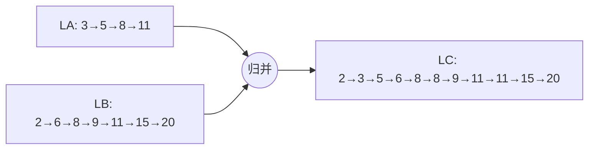

# 2.7.2 有序表的合并

> [!nav] 导航
> 上一知识点：[[2.07.01 线性表的合并]] · [[MOC - 第2章 线性表|本章目录]] · [[MOC - 数据结构|课程总览]] · 下一知识点：[[2.08 案例分析与实现]]

> [!topic] 所属主题
> [[MOC - 第2章 线性表#2.7 线性表的应用|2.7 线性表的应用]]

> [!definition] 有序表（Ordered List）
> 若线性表中的数据元素相互之间可以比较，并且数据元素在线性表中依值非递减或非递增有序排列，则称该线性表为**有序表**。

> [!example] 例 2.2　求解有序集合的并集问题
> 【问题描述】
> **有序集合**是指集合中的元素有序排列。已知两个有序集合 $A$ 和 $B$，数据元素按值非递减有序排列，现要求一个新的集合 $C = A \cup B$，使集合 $C$ 中的数据元素仍按值非递减有序排列。
> 例如，设：
> $$
> A = (3, 5, 8, 11)
> $$
> $$
> B = (2, 6, 8, 9, 11, 15, 20)
> $$
> 则：
> $$
> C = (2, 3, 5, 6, 8, 8, 9, 11, 11, 15, 20)
> $$
>
> 【问题分析】
> 与例 2.1 一样，可以利用两个线性表 LA 和 LB 分别表示集合 $A$ 和 $B$，不同的是，此例中的 LA 和 LB 有序，这样便没有必要从 LB 中依次取得每个数据元素，到 LA 中进行查访。
> 如果 LA 和 LB 两个表长分别记为 $m$ 和 $n$，则合并后的新表 LC 的表长应该为 $m+n$。由于 LC 中的数据元素或是 LA 中的元素，或是 LB 中的元素，因此只要先设 LC 为空表，然后将 LA 或 LB 中的元素逐个插入 LC 中即可。为使 LC 中的元素按值非递减有序排列，可设两个指针 `pa` 和 `pb` 分别指向 LA 和 LB 中的某个元素，若设 `pa` 当前所指的元素为 $a$，`pb` 当前所指的元素为 $b$，则当前应插入到 LC 中的元素 $c$ 为：
> $$
> c = \begin{cases}
> a & a \le b \\
> b & a > b
> \end{cases}
> $$
> 显然，指针 `pa` 和 `pb` 初始时分别指向两个有序表的第一个元素，在所指元素插入 LC 之后，在 LA 或 LB 中顺序后移。
>
> 根据上述分析，分别给出有序表的顺序存储结构和链式存储结构相应合并算法的实现。

## 1. 顺序有序表的合并

> [!example] 算法 2.16 顺序有序表的合并
> 【算法步骤】
> ① 创建一个表长为 $m + n$ 的空表 LC。
> ② 指针 `pc` 初始化，指向 LC 的第一个元素。
> ③ 指针 `pa` 和 `pb` 初始化，分别指向 LA 和 LB 的第一个元素。
> ④ 当指针 `pa` 和 `pb` 均未到达相应表尾时，则依次比较 `pa` 和 `pb` 所指向的元素值，从 LA 或 LB 中“摘取”元素值较小的结点插入 LC 的最后。
> ⑤ 如果 `pb` 已到达 LB 的表尾，依次将 LA 的剩余元素插入 LC 的最后。
> ⑥ 如果 `pa` 已到达 LA 的表尾，依次将 LB 的剩余元素插入 LC 的最后。
>
> 【算法描述】
> ```c
> void MergeList_Sq(SqList LA, SqList LB, SqList &LC)
> {// 已知顺序有序表 LA 和 LB 的元素按值非递减排列
>  // 归并 LA 和 LB 得到新的顺序有序表 LC，LC 的元素也按值非递减排列
>     LC.length=LA.length+LB.length;          // 新表长度为待合并两表的长度之和
>     LC.elem=new ElemType[LC.length];        // 为合并后的新表分配一个数组空间
>     pc=LC.elem;                             // 指针 pc 指向新表的第一个元素
>     pa=LA.elem;  pb=LB.elem;                // 指针 pa 和 pb 的初值分别指向两个表的第一个元素
>     pa_last=LA.elem+LA.length-1;            // 指针 pa_last 指向 LA 的最后一个元素
>     pb_last=LB.elem+LB.length-1;            // 指针 pb_last 指向 LB 的最后一个元素
>     while ((pa<=pa_last) && (pb<=pb_last))  // 未到达 LA 和 LB 的表尾
>     {
>         if (*pa<=*pb)  *pc++=*pa++;         // 依次摘取两表中值较小的结点插入 LC 的最后
>         else  *pc++=*pb++;
>     }
>     while (pa<=pa_last)  *pc++=*pa++;       // 已到达 LB 表尾，依次将 LA 的剩余元素插入 LC 的最后
>     while (pb<=pb_last)  *pc++=*pb++;       // 已到达 LA 表尾，依次将 LB 的剩余元素插入 LC 的最后
> }
> ```
>
> 【算法分析】
> 若对算法 2.16 中第一个循环语句的循环体进行如下修改：分出元素比较的第三种情况，当 `*pa == *pb` 时，只将两者之一插入 LC，则该算法完成的操作和算法 2.15 相同，但时间复杂度却不同。在算法 2.16 中，由于 LA 和 LB 中元素依值非递减，则对 LB 中的每个元素，不需要在 LA 中从表头至表尾进行全程搜索。如果两个表长分别记为 $m$ 和 $n$，则算法 2.16 循环最多执行的总次数为 $m + n$。所以算法的时间复杂度为 $O(m + n)$。
> 此算法在归并时，需要开辟新的辅助空间，所以空间复杂度也为 $O(m + n)$，空间复杂度较高。利用链表来实现上述归并时，不需要开辟新的存储空间，可以使空间复杂度达到最低。



## 2. 链式有序表的合并

假设头指针为 LA 和 LB 的单链表分别为线性表 LA 和 LB 的存储结构，现要归并 LA 和 LB 得到单链表 LC。因为链表结点之间的关系是通过指针指向建立起来的，所以用链表进行合并不需要另外开辟存储空间，合并过程中只需把 LA 和 LB 两个表中的结点重新进行链接即可。

按照例 2.2 给出的合并思想，需设立 3 个指针 `pa`、`pb` 和 `pc`，其中 `pa` 和 `pb` 分别指向 LA 和 LB 中当前待比较插入的结点，而 `pc` 指向 LC 中当前最后一个结点（LC 的表头结点设为 LA 的表头结点）。指针的初值为：`pa` 和 `pb` 分别指向 LA 和 LB 中的第一个结点，`pc` 指向空表 LC 中的头结点。同算法 2.16 一样，通过比较指针 `pa` 和 `pb` 所指向的元素的值，依次从 LA 或 LB 中摘取元素值较小的结点插入到 LC 的最后，当其中一个表变空时，只要将另一个表的剩余段链接在 `pc` 所指结点之后即可。

> [!example] 算法 2.17 链式有序表的合并
> 【算法步骤】
> ① 指针 `pa` 和 `pb` 初始化，分别指向 LA 和 LB 的第一个结点。
> ② LC 的结点取值为 LA 的头结点。
> ③ 指针 `pc` 初始化，指向 LC 的头结点。
> ④ 当指针 `pa` 和 `pb` 均未到达相应表尾时，则依次比较 `pa` 和 `pb` 所指向的元素值，从 LA 或 LB 中摘取元素值较小的结点插入 LC 的最后。
> ⑤ 将非空表的剩余段插入 `pc` 所指结点之后。
> ⑥ 释放 LB 的头结点。
>
> 【算法描述】
> ```c
> void MergeList_L(LinkList &LA, LinkList &LB, LinkList &LC)
> {// 已知单链表 LA 和 LB 的元素按值非递减排列
>  // 归并 LA 和 LB 得到新的单链表 LC，LC 的元素也按值非递减排列
>     pa=LA->next; pb=LB->next;               // pa 和 pb 的初值分别指向两个表的第一个结点
>     LC=LA;                                  // 用 LA 的头结点作为 LC 的头结点
>     pc=LC;                                  // pc 的初值指向 LC 的头结点
>     while (pa && pb)
>     {// LA 和 LB 均未到达表尾，依次“摘取”两表中值较小的结点插入到 LC 的最后
>         if (pa->data <= pb->data)           // 摘取 pa 所指结点
>         {
>             pc->next=pa;                    // 将 pa 所指结点链接到 pc 所指结点之后
>             pc=pa;                          // pc 指向 pa
>             pa=pa->next;                    // pa 指向下一结点
>         }
>         else                                // 摘取 pb 所指结点
>         {
>             pc->next=pb;                    // 将 pb 所指结点链接到 pc 所指结点之后
>             pc=pb;                          // pc 指向 pb
>             pb=pb->next;                    // pb 指向下一结点
>         }
>     }                                       // while
>     pc->next=pa?pa:pb;                      // 将非空表的剩余段插入到 pc 所指结点之后
>     delete LB;                              // 释放 LB 的头结点
> }
> ```
>
> 【算法分析】
> 可以看出，算法 2.17 的时间复杂度和算法 2.16 相同，但空间复杂度不同。在归并两个链表为一个链表时，不需要另建新表的结点空间，而只需将原来两个链表中结点之间的关系解除，重新按元素值非递减的关系将所有结点链接成一个链表即可，所以空间复杂度为 $O(1)$。

---
