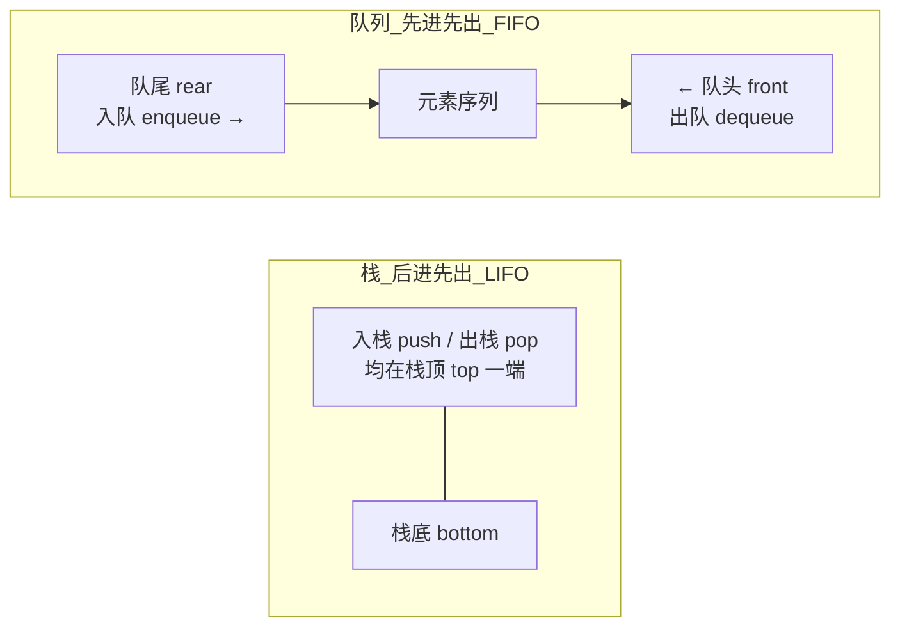

# 3.1.2 队列的定义和特点

> [!nav] 导航
> 上一知识点：[[3.01.01 栈的定义和特点]] · [[MOC - 第3章 栈和队列|本章目录]] · [[MOC - 数据结构|课程总览]] · 下一知识点：[[3.02 案例引入]]

> [!topic] 所属主题
> [[MOC - 第3章 栈和队列#3.1 栈和队列的定义和特点|3.1 栈和队列的定义和特点]]

> [!definition] 队列（Queue）
> 队列是只允许在表的一端插入、另一端删除的线性表。允许插入的一端称为**队尾（rear）**，允许删除的一端称为**队头或队首（front）**。
> 队列的插入操作通常称为**入队或进队（enqueue）**，删除操作称为**出队或离队（dequeue）**。

![[Attachments/Pasted image 20260717163147.png]]

假设队列为 $q=(a_1, a_2, \cdots, a_n)$，则称 $a_1$ 为队头元素，$a_n$ 为队尾元素。元素按 $a_1, a_2, \cdots, a_n$ 的顺序进入，退出也只能按此次序依次退出，因此队列又称**先进先出（First In First Out，FIFO）**的线性表，如图 3.2 所示。

队列在程序设计中很常见。典型例子是操作系统中的作业排队：多道程序运行时，若运行结果都需经通道输出，则按请求输入的先后次序排队，通道传输完毕可接受新任务时，队头作业先退出做输出，凡申请输出的作业都从队尾进入队列。

> [!example] 栈与队列的操作位置对比
> 无论是借助栈还是队列，最基本的操作都是“入”和“出”，但二者受限制的位置不同：

