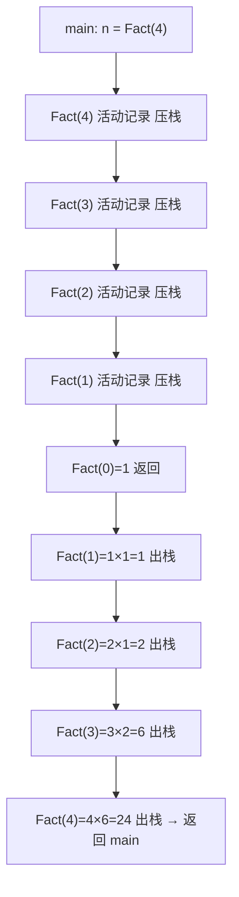

# 3.4.2 递归过程与递归工作栈

> [!nav] 导航
> 上一知识点：[[3.04.01 采用递归算法解决的问题]] · [[MOC - 第3章 栈和队列|本章目录]] · [[MOC - 数据结构|课程总览]] · 下一知识点：[[3.04.03 递归算法的效率分析]]

> [!topic] 所属主题
> [[MOC - 第3章 栈和队列#3.4 栈与递归|3.4 栈与递归]]

递归函数在执行过程中需多次自我调用。与汇编语言中主程序/子程序链接类似，高级语言程序中被调用函数与调用函数之间的链接及信息交换需通过**栈**进行。

通常，一个函数运行期间调用另一个函数时，运行被调用函数前系统需完成 3 件事：
（1）将实参、返回地址等信息传递给被调用函数保存；
（2）为被调用函数的局部变量分配存储区；
（3）将控制转移到被调用函数入口。

而从被调用函数返回前，系统也应完成 3 件事：
（1）保存被调用函数的计算结果；
（2）释放被调用函数的数据区；
（3）按保存的返回地址将控制转移回调用函数。

当多个函数构成嵌套调用时，按“后调用先返回”的原则，信息传递与控制转移必须通过栈实现：系统将整个程序运行所需数据空间安排在栈中，每调用一个函数就在栈顶分配存储区，每退出一个函数就释放其存储区，当前运行函数的数据区必在栈顶。

![[Attachments/Pasted image 20260717163303.png]]

> 图 3.9 主函数 `main()` 中调用 `first()`，`first()` 中又调用 `second()`；图 3.9（a）为正在执行 `second()` 中某语句时栈的状态，图 3.9（b）为从 `second()` 退出后正执行 `first()` 中某语句时栈的状态（图中以语句标号表示返回地址）。

递归函数的运行类似多个函数嵌套调用，只是调用函数与被调用函数是同一个函数，因此引入“层次”概念：调用递归函数的主函数为第 0 层；从主函数调用递归函数进入第 1 层；从第 $i$ 层递归调用本函数进入第 $i+1$ 层；退出第 $i$ 层返回第 $i-1$ 层。系统设立**递归工作栈**作为运行期间的数据存储区，每一层递归所需信息构成一个工作记录（含所有实参、局部变量、上一层返回地址）。每进入一层递归就产生新工作记录压入栈顶；每退出一层就从栈顶弹出一个，当前执行层的工作记录即栈顶的“活动记录”。

![[Attachments/Pasted image 20260717163313.png]]

> 图 3.10 以阶乘函数 `Fact(4)` 为例展示递归工作栈与活动记录的使用：主函数调用 `Fact(4)`，运行结束后控制返回 `RetLoc1`，此处 $n$ 被赋为 24（即 $4!$）。

```c
void main( )
{
    long n;
    n=Fact(4);              // 调用 Fact(4) 时记录进栈
}                           // 返回地址 RetLoc1 在赋值语句
```

为说明方便，将阶乘函数改写为：
```c
long Fact(long n)
{
    long temp;
    if (n==0) return 1;     // 活动记录退栈
    else temp=n*Fact(n-1);  // 活动记录进栈
                            // 返回地址 RetLoc2 在计算语句
    return temp;            // 活动记录退栈
}
```

> [!example] 递归工作栈的活动记录压栈/出栈过程（Fact(4)）
> 主函数执行后依次启动 5 个函数调用，图 3.10 展示每次调用时活动记录的进栈过程（栈底为 `Fact(4)` 的外部调用记录，栈顶为 `Fact(1)` 调用 `Fact(0)` 的记录）。图 3.11 展示退栈过程：递归结束条件出现于 `Fact(0)` 内部，退出栈顶活动记录后返回地址回到上一层 `Fact(1)` 的 `RetLoc2`，执行 `temp=1*1` 后 `return temp` 又引起退栈，直至 `Fact(4)` 执行完毕将控制权交还主函数。

![[Attachments/Pasted image 20260717163327.png]]

> [!note] 递归工作栈可视化（Fact(4)）
> 下图为 `Fact(4)` 递归调用时工作记录的压栈（调用）与出栈（返回求值）顺序示意：


