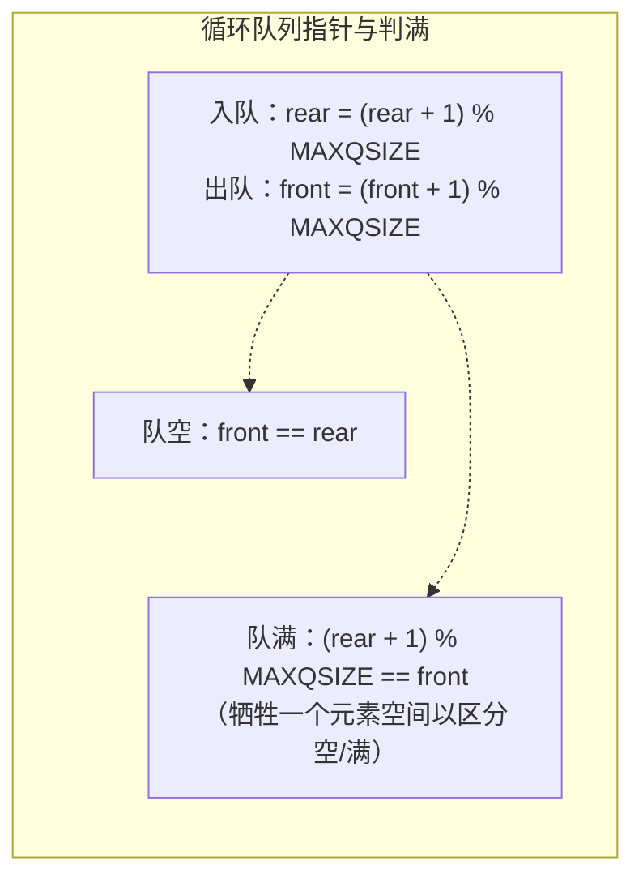

# 3.5.2 顺序队的表示和实现

> [!nav] 导航
> 上一知识点：[[3.05.01 队列的类型定义]] · [[MOC - 第3章 栈和队列|本章目录]] · [[MOC - 数据结构|课程总览]] · 下一知识点：[[3.05.03 链队的表示和实现]]

> [!topic] 所属主题
> [[MOC - 第3章 栈和队列#3.5 队列的表示和实现|3.5 队列的表示和实现]]

采用顺序存储结构实现的队列称为**顺序队**。和顺序栈类似，除用一组地址连续的存储单元依次存放从队头到队尾的元素外，尚需附设两个整型变量 `front` 和 `rear`，分别指示队头元素及队尾元素的位置（分别称为头指针和尾指针）。

> [!info] 队列的顺序存储结构
> ```c
> // - - - - - 队列的顺序存储结构 - - - - -
> #define MAXQSIZE 100          // 队列可能达到的最大长度
> typedef struct
> {
>     QElemType *base;          // 存储空间的基地址
>     int front;                // 头指针
>     int rear;                 // 尾指针
> } SqQueue;
> ```

为描述方便，约定：初始化创建空队列时令 `front = rear = 0`；插入新的队尾元素时尾指针 `rear` 增 1；删除队头元素时头指针 `front` 增 1。因此，在非空队列中，头指针始终指向队头元素，尾指针始终指向队尾元素的下一个位置，如图 3.12 所示。

![[Attachments/Pasted image 20260717163338.png]]

（图 3.12 出入队操作时头、尾指针的移动方式）

假设当前队列分配的最大空间为 6，则当队列处于图 3.12（d）状态时不可再继续插入新的队尾元素，否则会出现溢出现象（因数组越界而导致程序的非法操作错误）。事实上此时队列的实际可用空间并未占满，这种现象称为**"假溢出"**，由"队尾入队、队头出队"这种受限制的操作造成。

> [!definition] 循环队列（Circular Queue）
> 解决"假溢出"的一个巧妙办法是将顺序队列变为一个环状的空间（如图 3.13 所示），称这样的队列为**循环队列**。头、尾指针及队列元素之间的关系不变，只是头、尾指针"依环状增 1"的操作可用"模"运算实现：通过取模，头、尾指针便可在顺序表空间内以头尾衔接的方式"循环"移动。

![[Attachments/Pasted image 20260717163349.png]]

（图 3.13 循环队列示意）

在图 3.14（a）中，队头元素是 $J_5$，在元素 $J_6$ 入队之前 `Q.rear` 的值为 5，当 $J_6$ 入队之后，通过模运算 `Q.rear = (Q.rear + 1) % 6`，得到 `Q.rear` 的值为 0，而不会出现图 3.12（d）中的"假溢出"状态。在图 3.14（b）中，$J_7、J_8、J_9、J_{10}$ 相继入队，队列空间均被占满，此时头、尾指针相同；在图 3.14（c）中，若 $J_5$ 和 $J_6$ 相继出队使队列呈"空"的状态，头、尾指针的值也是相同的。

![[Attachments/Pasted image 20260717163358.png]]

（图 3.14 循环队列中头、尾指针和元素之间的关系）

由此可见，对于循环队列**不能以头、尾指针的值是否相同来判别队列空间是"满"还是"空"**。通常有以下两种处理方法：

> [!note] 循环队列的队空与队满条件
> **方法（1）：少用一个元素空间。** 即当队列空间大小为 $m$ 时，有 $m-1$ 个元素就认为队满。
> - 队空条件：`Q.front == Q.rear`
> - 队满条件：`(Q.rear + 1) % MAXQSIZE == Q.front`
>
> 如图 3.14（d）所示，当 $J_7、J_8、J_9$ 进入图 3.14（a）的队列后，`(Q.rear + 1) % MAXQSIZE` 的值等于 `Q.front`，此时认为队满。
>
> **方法（2）：** 另设一个标志位以区别队列是"空"还是"满"（由读者自行设计，详见本章习题算法设计题（7））。

下面用**方法（1）**实现循环队列的操作，其类型定义同前面给出的顺序队列类型定义。



**1. 初始化**

循环队列的初始化操作就是动态分配一个预定义大小为 `MAXQSIZE` 的数组空间。

> [!example] 算法 3.11 循环队列的初始化
> 【算法步骤】
> ① 为队列分配一个最大容量为 `MAXQSIZE` 的数组空间，`base` 指向数组空间的首地址。
> ② 将头指针和尾指针置为 0，表示队列为空。
> 【算法描述】
> ```c
> Status InitQueue(SqQueue & Q)
> {// 构造一个空队列 Q
>     Q.base=new QElemType[MAXQSIZE];     // 为队列分配一个最大容量为MAXQSIZE的数组空间
>     if(!Q.base) exit(OVERFLOW);         // 存储分配失败
>     Q.front=Q.rear=0;                   // 将头指针和尾指针置为0，队列为空
>     return OK;
> }
> ```

**2. 求队列长度**

对于非循环队列，尾指针和头指针的差值便是队列长度；对于循环队列，差值可能为负数，故需将差值加上 `MAXQSIZE` 再与 `MAXQSIZE` 求余。

> [!example] 算法 3.12 求循环队列的长度
> 【算法描述】
> ```c
> int QueueLength(SqQueue Q)
> {// 返回 Q 的元素个数，即队列的长度
>     return (Q.rear - Q.front + MAXQSIZE) % MAXQSIZE;
> }
> ```

**3. 入队**

入队操作是指在队尾插入一个新的元素。

> [!example] 算法 3.13 循环队列的入队
> 【算法步骤】
> ① 判断队列是否满，若满则返回 `ERROR`。
> ② 将新元素插入队尾。
> ③ 队尾指针加 1。
> 【算法描述】
> ```c
> Status EnQueue(SqQueue & Q, QElemType e)
> {// 插入元素 e 为 Q 的新的队尾元素
>     if ((Q.rear + 1) % MAXQSIZE == Q.front)     // 若尾指针在循环意义上加1后等于头指针，表明队满
>         return ERROR;
>     Q.base[Q.rear]=e;                           // 新元素插入队尾
>     Q.rear=(Q.rear + 1) % MAXQSIZE;             // 队尾指针加 1
>     return OK;
> }
> ```

**4. 出队**

出队操作是指将队头元素删除。

> [!example] 算法 3.14 循环队列的出队
> 【算法步骤】
> ① 判断队列是否为空，若空则返回 `ERROR`。
> ② 保存队头元素。
> ③ 队头指针加 1。
> 【算法描述】
> ```c
> Status DeQueue(SqQueue & Q, QElemType & e)
> {// 删除 Q 的队头元素，用 e 返回其值
>     if (Q.front == Q.rear) return ERROR;        // 队空
>     e=Q.base[Q.front];                          // 保存队头元素
>     Q.front=(Q.front + 1) % MAXQSIZE;           // 队头指针加 1
>     return OK;
> }
> ```

**5. 取队头元素**

当队列非空时，此操作返回当前队头元素的值，队头指针保持不变。

> [!example] 算法 3.15 取循环队列的队头元素
> 【算法描述】
> ```c
> QElemType GetHead(SqQueue Q)
> {// 返回 Q 的队头元素，不修改队头指针
>     if (Q.front != Q.rear)                      // 队列非空
>         return Q.base[Q.front];                 // 返回队头元素的值，队头指针不变
> }
> ```

> [!note] 顺序队 vs 链队的选择
> 如果用户的应用程序中设有循环队列，则必须为它设定一个最大队列长度；若用户无法预估所用队列的最大长度，则**宜采用链队列**。
