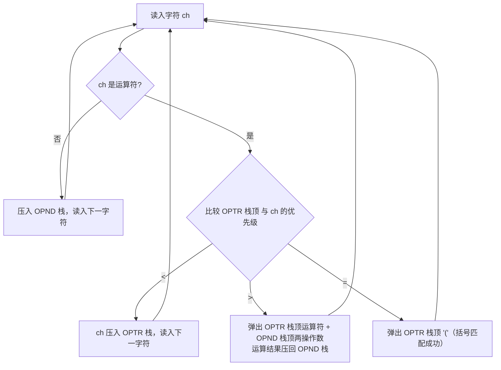

# 3.6 案例分析与实现

> [!nav] 导航
> 上一知识点：[[3.05.03 链队的表示和实现]] · [[MOC - 第3章 栈和队列|本章目录]] · [[MOC - 数据结构|课程总览]] · 下一知识点：[[3.07 LeetCode 算法练习题]]

在 3.2 节我们引入了 3 个有关栈应用的案例和一个有关队列应用的案例。本节对这 4 个案例进一步分析，然后分别利用栈和队列的基本操作给出相关算法的具体实现。

**案例 3.1：数制的转换。**

> [!example] 算法 3.20 数制的转换
> 【案例分析】将一个十进制整数 $N$ 转换为八进制数时，使 $N$ 与 8 求余得到的八进制数各位依次进栈，计算完毕后将栈中的八进制数依次输出，输出结果即待求得的八进制数。
> 【算法步骤】
> ① 初始化空栈 `S`。
> ② 当十进制数 $N$ 非零时，循环执行：把 $N$ 与 8 求余得到的八进制数压入栈 `S`；$N$ 更新为 $N$ 与 8 的商。
> ③ 当栈 `S` 非空时，循环执行：弹出栈顶元素 `e`；输出 `e`。
> 【算法描述】
> ```c
> void Conversion(int N)
> {// 对于任意一个非负十进制数，打印输出与其等值的八进制数
>     InitStack(S);                               // 初始化空栈 S
>     while(N)                                    // 当 N 非零时，循环
>     {
>         Push(S, N % 8);                         // 把 N 与 8 求余得到的八进制数压入栈 S
>         N = N / 8;                              // N 更新为 N 与 8 的商
>     }
>     while(!StackEmpty(S))                       // 当栈 S 非空时，循环
>     {
>         Pop(S, e);                              // 弹出栈顶元素 e
>         cout << e;                              // 输出 e
>     }
> }
> ```
> 【算法分析】该算法的时间和空间复杂度均为 $O(\log n)$。这是利用栈后进先出特性的最简单例子，栈的引入简化了程序设计，划分了不同关注层次，使思考范围缩小。

**案例 3.2：括号匹配的检验。**

> [!example] 算法 3.21 括号的匹配
> 【案例分析】检验算法借助一个栈：每当读入一个左括号则直接入栈，等待相匹配的同类右括号；每当读入一个右括号，若与当前栈顶左括号类型相同则二者匹配，将栈顶左括号出栈，直到表达式读取完毕。若栈已空仍有右括号读入（如 `((()))` 末尾），或读完后栈中仍有左括号（如 `[[()]`），或栈顶与右括号不匹配（如 `(()`），则出错。
> 【算法步骤】
> ① 初始化空栈 `S`。
> ② 设标记变量 `flag`（1 正确 / 0 错误，初值 1）。
> ③ 读入字符 `ch`，若表达式未读完且 `flag` 非零，则循环：若为左括号 `[` 或 `(` 则入栈；若为 `)` 则视栈顶是否为 `(` 决定匹配或 `flag=0`；若为 `]` 则视栈顶是否为 `[` 决定。
> ④ 退出循环后，若栈空且 `flag` 为 1 则匹配成功返回 `true`，否则返回 `false`。
> 【算法描述】
> ```c
> Status Matching()
> {// 检验表达式中所含括号是否正确匹配，如果正确匹配，则返回 true，否则返回 false
>  // 表达式以 "#" 结束
>     InitStack(S);
>     flag=1;                                    // 初始化空栈
>                                                // 标记匹配结果以控制循环及返回结果
>     cin >> ch;                                 // 读入第一个字符
>     while (ch != '#' && flag)                  // 假设表达式以 "#" 结尾
>     {
>         switch (ch)
>         {
>             case '[':
>             case '(':                          // 若是左括号，则将其压入栈
>                 Push(S, ch);
>                 break;
>             case ')':                          // 若是 ")"，则根据当前栈顶元素的值分情况考虑
>                 if (!StackEmpty(S) && GetTop(S)=='(')
>                     Pop(S, x);                 // 若栈非空且栈顶元素是 "("，则正确匹配
>                 else flag=0;                   // 若栈空或栈顶元素不是 "("，则错误匹配
>                 break;
>             case ']':                          // 若是 "]"，则根据当前栈顶元素的值分情况考虑
>                 if (!StackEmpty(S) && GetTop(S)=='[')
>                     Pop(S, x);                 // 若栈非空且栈顶元素是 "["，则正确匹配
>                 else flag=0;                   // 若栈空或栈顶元素不是 "["，则错误匹配
>                 break;
>         }                                      // switch
>         cin >> ch;                             // 继续读入下一个字符
>     }                                          // while
>     if (StackEmpty(S) && flag) return true;    // 匹配成功
>     else return false;                         // 匹配失败
> }
> ```
> 【算法分析】设表达式长度为 $n$，时间复杂度为 $O(n)$；辅助空间主要取决于栈的大小，不会超过 $n$，故空间复杂度也为 $O(n)$。

**案例 3.3：表达式求值。**

> [!note] 算术四则运算的优先规则
> 任何一个表达式由操作数（operand）、运算符（operator）和界限符（delimiter）组成。算术四则运算遵循：
> （1）先乘除，后加减；
> （2）从左算到右；
> （3）先括号内，后括号外。
>
> 任意两个相继出现的算符 $\theta_1$ 和 $\theta_2$ 之间的优先关系，至多是以下 3 种之一：
> $$ \theta_1 < \theta_2,\ \text{即}\ \theta_1\ \text{的优先权低于}\ \theta_2 $$
> $$ \theta_1 = \theta_2,\ \text{即}\ \theta_1\ \text{的优先权等于}\ \theta_2 $$
> $$ \theta_1 > \theta_2,\ \text{即}\ \theta_1\ \text{的优先权高于}\ \theta_2 $$

表 3.1 定义了算符间的优先关系。

表 3.1 算符间的优先关系
| $\theta_1$ \ $\theta_2$ | $+$ | $-$ | $*$ | $/$ | $($ | $)$ | $\#$ |
| :---: | :---: | :---: | :---: | :---: | :---: | :---: | :---: |
| $+$ | $>$ | $>$ | $<$ | $<$ | $<$ | $>$ | $>$ |
| $-$ | $>$ | $>$ | $<$ | $<$ | $<$ | $>$ | $>$ |
| $*$ | $>$ | $>$ | $>$ | $>$ | $<$ | $>$ | $>$ |
| $/$ | $>$ | $>$ | $>$ | $>$ | $<$ | $>$ | $>$ |
| $($ | $<$ | $<$ | $<$ | $<$ | $<$ | $=$ | |
| $)$ | $>$ | $>$ | $>$ | $>$ | | $>$ | $>$ |
| $\#$ | $<$ | $<$ | $<$ | $<$ | $<$ | | $=$ |

表中的 `"="` 表示当左右括号相遇时，括号内的运算已经完成；假设每个表达式均以 `"#"` 开始、以 `"#"` 结束，故 `"#" = "#"` 表示整个表达式求值完毕。）` 与 `"("`、`"#"` 与 `")"`、以及 `"("` 与 `"#"` 之间无优先关系（表达式中不允许它们相继出现，一旦发生即语法错误）。下面的讨论暂假定所输入的表达式不会出现语法错误。

可使用两个工作栈实现表达式求值：一个称作 **OPTR**，寄存运算符；另一个称作 **OPND**，寄存操作数或运算结果。



> [!example] 算法 3.22 表达式求值
> 【算法步骤】
> ① 初始化 `OPTR` 栈和 `OPND` 栈，将表达式起始符 `"#"` 压入 `OPTR` 栈。
> ② 读取表达式，若未读取完毕至 `"#"` 或 `OPTR` 栈顶元素不为 `"#"`，则循环：若 `ch` 不是运算符则压入 `OPND` 栈并读入下一字符；若是运算符，则根据 `OPTR` 栈顶元素与 `ch` 的优先级比较结果处理——小于则将 `ch` 压入 `OPTR` 栈；大于则弹出 `OPTR` 栈顶运算符并从 `OPND` 栈弹出两个数运算后压回 `OPND` 栈；等于则 `OPTR` 栈顶为 `"("` 且 `ch` 为 `")"`，弹出 `OPTR` 栈顶的 `"("`。
> ③ `OPND` 栈顶元素即表达式求值结果，返回此元素。
> 【算法描述】
> ```c
> char EvaluateExpression()
> {// 算术表达式求值的算符优先算法，设 OPTR 和 OPND 分别为运算符栈和操作数栈
>     InitStack(OPND);                       // 初始化 OPND 栈
>     InitStack(OPTR);                       // 初始化 OPTR 栈
>     Push(OPTR, '#');                       // 将表达式起始符 "#" 压入 OPTR 栈
>     cin >> ch;
>     while (ch != '#' || GetTop(OPTR) != '#')   // 表达式未读完或 OPTR 的栈顶元素不为 "#"
>     {
>         if (!In(ch)) { Push(OPND, ch); cin >> ch; }  // ch 不是运算符则进 OPND 栈
>         else
>             switch (Precede(GetTop(OPTR), ch))  // 比较 OPTR 的栈顶元素和 ch 的优先级
>             {
>                 case '<':
>                     Push(OPTR, ch); cin >> ch;   // 当前字符 ch 压入 OPTR 栈，读入下一字符 ch
>                     break;
>                 case '>':
>                     Pop(OPTR, theta);            // 弹出 OPTR 栈顶的运算符
>                     Pop(OPND, b); Pop(OPND, a);  // 弹出 OPND 栈顶的两个运算数
>                     Push(OPND, Operate(a, theta, b)); // 将运算结果压入 OPND 栈
>                     break;
>                 case '=':
>                     Pop(OPTR, x); cin >> ch;     // OPTR 的栈顶元素是 "(" 且 ch 是 ")"
>                                              // 弹出 OPTR 栈顶的 "("，读入下一字符 ch
>                     break;
>             }                                    // switch
>     }                                            // while
>     return GetTop(OPND);                         // OPND 栈顶元素即表达式求值结果
> }
> ```
> 【算法分析】同算法 3.21，时间复杂度为 $O(n)$；辅助空间主要取决于 `OPTR` 栈和 `OPND` 栈大小，二者之和不超过 $n$，空间复杂度同为 $O(n)$。
> 注：上述操作数只能是一位数（OPND 为字符栈）；要进行多位数运算需将 OPND 改为数栈并拼接数字字符。算法调用的 `In()`、`Precede()`、`Operate()` 需自行补充。

**【例 3.2】 算法表达式的求值过程。**

利用算法 3.22 对 `3*(7-2)` 求值，在两端增加 `"#"` 改写为 `#3*(7-2)#`，具体操作过程如表 3.2 所示。

表 3.2 算术表达式 `3*(7-2)` 求值的具体操作过程
| 步骤 | OPTR 栈 | OPND 栈 | 读入字符 | 主要操作 |
| :--- | :--- | :--- | :--- | :--- |
| 1 | # | | `3*(7-2)#` | Push(OPND, '3') |
| 2 | # | 3 | `*(7-2)#` | Push(OPTR, '*') |
| 3 | #* | 3 | `(7-2)#` | Push(OPTR, '(') |
| 4 | #*( | 3 | `7-2)#` | Push(OPND, '7') |
| 5 | #*( | 3 7 | `-2)#` | Push(OPTR, '-') |
| 6 | #*(- | 3 7 | `2)#` | Push(OPND, '2') |
| 7 | #*(- | 3 7 2 | `)#` | Operate('7', '-', '2') → Push(OPND) |
| 8 | #*( | 3 5 | `#` | Pop(OPTR){ 消去一对括号 } |
| 9 | #* | 3 5 | `#` | Operate('3', '*', '5') → Push(OPND) |
| 10 | # | 15 | `#` | return(GetTop(OPND)) |

> [!info] 栈在编译中的应用
> 在高级语言编译处理中，不只是表达式求值可借助栈，一般语法成分的分析也可借助栈来实现（编译原理课程会涉及栈在语法、语义分析算法中的应用）。

**案例 3.4：舞伴问题。**

> [!example] 算法 3.23 舞伴问题
> 【案例分析】先入队的男士或女士先出队配成舞伴，故设置两个队列分别存放男士和女士。将跳舞者记录存入数组，依次读取并按性别入男队或女队；两队列构造完成后，依次使两队列当前队头元素出队来配成舞伴，直至某队列变空。若某队仍有等待者，则输出其队头等待者姓名（下一轮第一个获得舞伴的人）。
> 【数据结构定义】
> ```c
> // - - - - - 跳舞者个人信息 - - - - -
> typedef struct
> {
>     char name[20];                 // 姓名
>     char sex;                      // 性别，'F' 表示女性，'M' 表示男性
> } Person;
> // - - - - - 队列的顺序存储结构 - - - - -
> #define MAXQSIZE 100               // 队列可能达到的最大长度
> typedef struct
> {
>     Person *base;                  // 队列中数据元素类型为 Person
>     int front;                     // 头指针
>     int rear;                      // 尾指针
> } SqQueue;
> SqQueue Mdancers, Fdancers;        // 分别存放男士和女士入队者队列
> ```
> 【算法步骤】
> ① 初始化 `Mdancers` 队列和 `Fdancers` 队列。
> ② 反复循环，依次将跳舞者姓名根据性别插入 `Mdancers` 或 `Fdancers` 队列。
> ③ 当两队列均非空时，反复循环，依次输出男女舞伴的姓名。
> ④ 若 `Mdancers` 空而 `Fdancers` 非空，输出 `Fdancers` 队头女士姓名。
> ⑤ 若 `Fdancers` 空而 `Mdancers` 非空，输出 `Mdancers` 队头男士姓名。
> 【算法描述】
> ```c
> void DancePartner(Person dancer[], int num)
> {// 结构数组 dancer 中存放跳舞的男女姓名和性别，num 是跳舞的人数。
>     InitQueue(Mdancers);             // 男士队列初始化
>     InitQueue(Fdancers);             // 女士队列初始化
>     for (i=0; i<num; i++)            // 依次将跳舞者根据其性别入队
>     {
>         p=dancer[i];
>         if (p.sex=='F') EnQueue(Fdancers, p);    // 插入女队
>         else EnQueue(Mdancers, p);               // 插入男队
>     }
>     cout << "The dancing partners are:\n";
>     while (!QueueEmpty(Fdancers) && !QueueEmpty(Mdancers))
>     {// 依次输出男女舞伴的姓名
>         DeQueue(Fdancers, p);                    // 女士出队
>         cout << p.name << " ";                   // 输出出队女士姓名
>         DeQueue(Mdancers, p);                    // 男士出队
>         cout << p.name << endl;                  // 输出出队男士姓名
>     }
>     if (!QueueEmpty(Fdancers))                   // 女士队列非空，输出队头女士的姓名
>     {
>         p=GetHead(Fdancers);                     // 取女士队头
>         cout << "The first woman to get a partner is: " << p.name << endl;
>     }
>     else if (!QueueEmpty(Mdancers))              // 男士队列非空，输出队头男士的姓名
>     {
>         p=GetHead(Mdancers);                     // 取男士队头
>         cout << "The first man to get a partner is: " << p.name << endl;
>     }
> }
> ```
> 【算法分析】设跳舞者总人数为 $n$，时间复杂度为 $O(n)$；空间复杂度取决于两队列长度，二者之和不超过 $n$，故同为 $O(n)$。

> [!note] 队列的典型应用
> 队列在程序设计中应用广泛，凡是符合先进先出原则的数学模型都可用队列。例如操作系统中用"作业队列"解决主机与外设速度不匹配或多个用户对资源的竞争；以汽车加油站为例，入口排队、加油车道排队、出口排队均为队列结构，模拟所需队列数 = 加油车道数 + 2。
