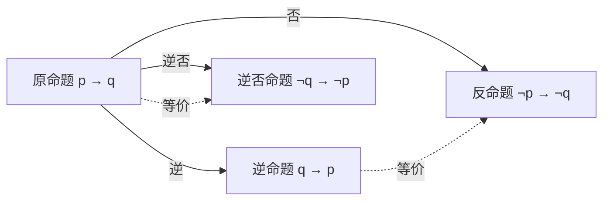

# 1.1 命题逻辑

> [!abstract] 本节概览
> 逻辑规则给出数学语句的准确含义，用来区分数学论证的有效或无效。本节依次介绍命题、一个一元联结词（否定）和五个二元联结词（合取、析取、异或、条件、双条件）、复合命题真值表、运算符优先级，以及逻辑运算到比特运算的对应。

---

## 1.1.1 引言

逻辑规则给出数学语句的准确含义。这些规则可以用来区分数学论证的有效或无效。由于本书的一个主要目的是教会读者如何理解和构造正确的数学论证，所以我们从介绍逻辑开始离散数学的学习。

逻辑不仅对理解数学推理十分重要，而且在计算机科学中有许多应用。这些逻辑规则用于计算机电路设计、计算机程序构造、程序正确性验证以及许多其他方面。而且，已经开发了一些软件系统用于自动构造某些(但不是全部)类型的证明。在随后的几章中将逐一讨论这些应用。

---

## 1.1.2 命题

我们首先介绍逻辑的基本构件——命题。命题是一个陈述语句(即陈述事实的语句)，它或真或假，但不能既真又假。

> [!example] 例1
> 下面的陈述句均为命题。
> 1. 华盛顿特区是美利坚合众国的首都。
> 2. 多伦多是加拿大的首都。
> 3. $1+1=2$。
> 4. $2+2=3$。
> 命题1和3为真，而命题2和4为假。

例2给出了不是命题的若干语句。

> [!example] 例2
> 考虑下述语句。
> 1. 几点了？
> 2. 仔细读这个。
> 3. $x+1=2$。
> 4. $x+y=z$。
> 语句1和2不是命题，因为它们不是陈述句。语句3和4不是命题，因为它们既不为真，也不为假。注意，如果我们给语句3和4中的变量赋值，那么语句3和4可以变成命题。1.4节还将讨论把这一类语句改成命题的其他方法。

我们用字母来表示命题变量(或称为语句变量)，即表示命题的变量，就像用字母表示数值变量那样。习惯上用字母 $p, q, r, s, \dots$ 表示命题变量。如果一个命题是真命题，则它的真值为真，用 T 表示；如果它是假命题，则其真值为假，用 F 表示。不能表示为更简单命题经逻辑联结词组合得到的命题称为原子命题。

涉及命题的逻辑领域称为命题演算或命题逻辑。它最初是2300多年前由古希腊哲学家亚里士多德系统地创建的。

现在我们转而关注从已有命题产生新命题的方法。这些方法由英国数学家布尔在他的名为《The Laws of Thought》(思维定律)的书中讨论过。许多数学陈述都是由一个或多个命题组合而来。由已知命题用逻辑运算符组合而来的新命题也被称为复合命题。

### 否定

> [!definition] 定义1：否定（Negation）
> 令 $p$ 为一命题，则 $p$ 的否定记作 $\neg p$(也可记作 $\bar{p}$)，指"不是 $p$ 所指的情形"。
> 命题 $\neg p$ 读作"非 $p$"。$p$ 的否定($\neg p$)的真值和 $p$ 的真值相反。

> [!note] 评注
> 否定运算符的记号并没有统一标准。尽管 $\neg p$ 和 $\bar{p}$ 是数学中最常用的表示 $p$ 的否定的记号，但你仍有可能会见到其他的记号，如 $\sim p$、$-p$、$p'$、$Np$ 和 $!p$。

> [!example] 例3
> 找出命题"Michael的PC运行Linux"的否定，并用中文表示。
> **解** 否定为"并非Michael的PC运行Linux"，也可以更简单地表达为"Michael的PC并不运行Linux"。

> [!example] 例4
> 找出命题"Vandana的智能手机至少有32GB内存"的否定并用中文表示。

> [!info] 亚里士多德（Aristotle，公元前384—公元前322）
> 生于希腊北部的斯塔基尔地区。他的父亲是马其顿国王的宫廷侍医。亚里士多德年幼时父亲去世，因而没能子承父业。当他的母亲也去世后，年轻的亚里士多德就成了孤儿。他的监护人抚养他长大，并教授他诗歌、修辞艺术和希腊语。在亚里士多德17岁时，监护人将他送到雅典进一步深造。此后20年里亚里士多德在雅典柏拉图学院师从柏拉图学习并进行自己的学术研究。当柏拉图于公元前347年去世时，亚里士多德没有被选中继承师钵，因为他的哲学思想与柏拉图有很大的分歧。亚里士多德来到赫尔墨斯国王的宫廷，在那里供职三年并与国王的侄女结婚。当波斯人打败赫尔墨斯国王后，他前往米蒂利尼，受马其顿国王腓力二世的聘请，担任太子亚历山大(就是后来著名的亚历山大大帝)的老师。亚里士多德教授了亚历山大五年，在腓力二世逝世后，亚里士多德重返雅典并创建了自己的吕克昂学园。
>
> 亚里士多德的追随者通常被称为"逍遥派"，意思是巡游讲学，因为亚里士多德经常在花园中边散步边讨论哲学问题。亚里士多德在吕克昂学园讲学长达到13年，他早上给自己的高才生们讲课，而晚上则给广大听众演讲。当亚历山大皇帝于公元前323年去世后，那里立刻掀起了反亚历山大的狂潮，致使亚里士多德被冠以莫须有的不敬神罪名。亚里士多德逃亡到加而西斯避难。他在加而西斯生活了一年，于公元前322年死于胃病。
>
> 亚里士多德的著作主要分为三类：供普通大众阅读的文集、科学事实的汇编集以及系统的论辩文集。系统的论辩文集涉及逻辑学、哲学、心理学、物理学和自然历史。亚里士多德的著作由一个学生保存并隐藏在一个拱顶中，大约200年后一个富裕的藏书家发现了它。这些著作被送往罗马，在那里学者们研究并发行新版本以流传后世。

> [!example] 例4（解）
> 否定为"并非Vandana的智能手机至少有32GB内存"。在内存容量可比较的前提下，更准确地说是"Vandana的智能手机内存少于32GB"。

> [!note] 表1：命题 $p$ 及其否定的真值表
> 表1是命题 $p$ 及其否定的真值表。此表针对命题 $p$ 的两种可能真值各有一行。每一行显示对应于 $p$ 的真值时 $\neg p$ 的真值。命题的否定也可以看作否定运算作用在命题上的结果。否定运算符从一个已知命题构造出一个新命题。现在我们将引入从两个或多个已知命题构造新命题的逻辑运算符。这些逻辑运算符也称为联结词。

| $p$ | $\neg p$ |
| :---: | :---: |
| T | F |
| F | T |

### 合取

> [!definition] 定义2：合取（Conjunction）
> 令 $p$ 和 $q$ 为命题。$p, q$ 的合取即命题"$p$ 并且 $q$"，记作 $p \land q$。当 $p$ 和 $q$ 都是真时，$p \land q$ 为真，否则为假。

> [!note] 表2
> 表2展示了 $p \land q$ 的真值表。此表每一行对应 $p$ 和 $q$ 真值的4种可能组合之一。4行分别对应真值对 TT、TF、FT 和 FF，其中第一个真值是 $p$ 的真值，第二个真值是 $q$ 的真值。

| $p$ | $q$ | $p \land q$ |
| :---: | :---: | :---: |
| T | T | T |
| T | F | F |
| F | T | F |
| F | F | F |

注意在逻辑中，有时候会用"但是"一词替代"并且"一词来表示合取。比如，语句"阳光灿烂，但是在下雨"是"阳光灿烂并且在下雨"的另一种说法。(在自然语言中，"并且"和"但是"在意思上有微妙的差别，这里我们不关心这个细微差别。)

> [!example] 例5
> 找出命题 $p$ 和 $q$ 的合取，其中 $p$ 为命题"Rebecca的PC至少有16GB空闲磁盘空间"，$q$ 为命题"Rebecca的PC处理器的速度大于1GHz"。
> **解** 这两个命题的合取 $p \land q$ 是命题"Rebecca的PC至少有16GB空闲磁盘空间，并且Rebecca的PC处理器的速度大于1GHz"。这个合取可以更简单地表示成"Rebecca的PC至少有16GB空闲磁盘空间，并且其处理器的速度大于1GHz"。这一命题要想为真，两个给定的条件都必须为真。当其中一个或两个条件为假时，它就是假命题。

### 析取

> [!definition] 定义3：析取（Disjunction）
> 令 $p$ 和 $q$ 为命题。$p$ 和 $q$ 的析取即命题"$p$ 或 $q$"，记作 $p \lor q$。当 $p$ 和 $q$ 均为假时，析取命题 $p \lor q$ 为假，否则为真。

> [!note] 表3
> 表3展示了 $p \lor q$ 的真值表。

| $p$ | $q$ | $p \lor q$ |
| :---: | :---: | :---: |
| T | T | T |
| T | F | T |
| F | T | T |
| F | F | F |

在析取中使用的联结词或(or)对应于在自然语言中使用或字的两种情况之一，即兼或(inclusive or)。析取式为真，只要两个命题之一为真或两者均为真即可。也就是说，当 $p$ 和 $q$ 均为真或者 $p$ 和 $q$ 恰好有一个为真时，$p \lor q$ 为真。

> [!example] 例6
> 令 $p$ 和 $q$ 分别表示命题"选修过微积分课程的学生可以选修本课程"和"选修过计算机科学导论课程的学生可以选修本课程"。在命题逻辑中用这两个命题翻译语句"选修过微积分课程或计算机科学导论课程的学生可以选修本课程"。
> **解** 我们假定这个语句的意思是同时选修过微积分和计算机科学导论课的学生以及只选修过其中一门课的学生都可以选修本课程。故，这个语句可以表达成 $p$ 和 $q$ 的兼或或析取，即 $p \lor q$。

> [!example] 例7
> 如果 $p$ 和 $q$ 就是例5中的两个命题，它们的析取是什么？
> **解** $p$ 和 $q$ 的析取 $p \lor q$ 是命题"Rebecca的PC至少有16GB空闲磁盘空间，或者Rebecca的PC处理器的速度大于1GHz"。
> 当Rebecca的PC至少有16GB空闲磁盘空间时，当Rebecca的PC处理器的速度大于1GHz时，当两个条件都为真时，该命题均为真。当两个条件同时为假时，即当Rebecca的PC少于16GB空闲磁盘空间，并且其处理器的速度小于等于1GHz时，此命题为假。

### 异或

或联结词除了用于表示析取，也可以用来表示异或。与两个命题 $p$ 和 $q$ 的析取不同，当恰好 $p$ 和 $q$ 之一为真时，这两个命题的异或为真；而当 $p$ 和 $q$ 两者均为真(或均为假)时，它就为假。

> [!definition] 定义4：异或（Exclusive Or）
> 令 $p$ 和 $q$ 为命题。$p$ 和 $q$ 的异或(记作 $p \oplus q$)是这样一个命题：当 $p$ 和 $q$ 中恰好只有一个为真时命题为真，否则为假。

> [!note] 表4
> 两个命题异或的真值表如表4所示。

| $p$ | $q$ | $p \oplus q$ |
| :---: | :---: | :---: |
| T | T | F |
| T | F | T |
| F | T | T |
| F | F | F |

> [!example] 例8
> 令 $p$ 和 $q$ 分别表示命题"学生就餐时可以配一份沙拉"和"学生就餐时可以配一份汤"。$p$ 和 $q$ 的异或 $p \oplus q$ 表示什么？
> **解** $p$ 和 $q$ 的异或是当恰好 $p$ 和 $q$ 之一为真时才为真的命题，即 $p \oplus q$ 是语句"学生就餐时可以配一份沙拉或一份汤"，但不能兼得。注意，这样的语句通常表达成"学生就餐时可以配一份沙拉或一份汤"，而不需要明确写上同时拿两份是不允许的。

> [!example] 例9
> 令 $p$ 和 $q$ 分别表示命题"我要用全部积蓄去欧洲旅行"和"我要用全部积蓄买一辆电动车"。在命题逻辑中用这两个命题翻译语句"我要用全部积蓄去欧洲旅行或买一辆电动车"。
> **解** 为了翻译这个语句，我们首先注意到这里的或肯定是异或，因为可以使用全部积蓄去欧洲旅行或者使用全部积蓄买一辆电动车，但不能同时去欧洲旅行和买一辆电动车(这是显然的，因为每个选项都会花掉全部积蓄)，所以这个语句可以表达成 $p \oplus q$。

---

## 1.1.3 条件语句

下面讨论其他几个重要的命题组合方式。

### 条件语句（蕴含）

> [!definition] 定义5：条件语句（Conditional / Implication）
> 令 $p$ 和 $q$ 为命题。条件语句 $p \to q$ 是命题"如果 $p$，则 $q$"。当 $p$ 为真而 $q$ 为假时，条件语句 $p \to q$ 为假，否则为真。在条件语句 $p \to q$ 中，$p$ 称为假设(前件、前提)，$q$ 称为结论(后件)。

语句 $p \to q$ 称为条件语句，因为 $p \to q$ 可以断定在条件 $p$ 成立的时候 $q$ 为真。条件语句也称为蕴含。

> [!info] 乔治·布尔（George Boole, 1815—1864）
> 他是皮匠的儿子，1815年11月生于英格兰的林肯郡。由于家境贫寒，布尔不得不在帮助养家的同时为自己能受教育而奋斗。尽管如此，他依然成为19世纪最重要的数学家之一。尽管他曾考虑过以牧师为业，但最终还是决定从教，并且不久就开办了自己的学校。在备课的时候，布尔不满意当时的数学课本，便决定阅读大数学家的著作。在阅读法国大数学家拉格朗日的论文时，布尔在变分法方面有所发现。变分法是数学分析的一个分支，它通过优化某些参数来求曲线和曲面。
>
> 1848年，布尔出版了《数理逻辑分析》(The Mathematical Analysis of Logic)一书，这是他对符号逻辑诸多贡献中的第一次。1849年，他被任命为位于爱尔兰科克的皇后学院数学教授。1854年，他出版了最著名的著作《思维定律》(The Laws of Thought)。在这本书中布尔引入了现在以他的名字命名的布尔代数。布尔撰写了关于微分方程和差分方程的教科书，这些教科书在英国一直沿用到19世纪末。布尔在1855年结婚，他的妻子是皇后学院一位希腊文教授的侄女。1864年布尔死于肺炎，这是由于在一次暴风雨中尽管已经被淋透了，但他仍坚持上课而引起的。

条件语句 $p \to q$ 的真值表如表5所示。注意，当 $p$ 和 $q$ 都为真，以及当 $p$ 为假(与 $q$ 的真值无关)时，语句 $p \to q$ 为真。

> [!note] 表5
> 表5 条件语句 $p \to q$ 的真值表

| $p$ | $q$ | $p \to q$ |
| :---: | :---: | :---: |
| T | T | T |
| T | F | F |
| F | T | T |
| F | F | T |

由于条件语句在数学推理中具有很重要的作用，所以表达 $p \to q$ 的术语也很多。下表列出常用且等价的说法；其中“充分条件”和“必要条件”尤其容易写反。

| 表述 | 含义 |
|---|---|
| 如果 $p$，则 $q$；$p$ 蕴含 $q$ | $p \to q$ |
| $p$ 仅当 $q$ | $p \to q$ |
| $p$ 是 $q$ 的充分条件；$q$ 是 $p$ 的必要条件 | $p \to q$ |
| $q$ 如果 $p$；$q$ 每当 $p$；$q$ 当 $p$ | $p \to q$ |
| $q$ 除非 $\neg p$；$q$ 假定 $p$ | $p \to q$ |

为了便于理解条件语句的真值表，可以将条件语句想象为义务或合同。例如，许多政治家在竞选时都许诺："如果我当选了，那么我将会减税。"如果这个政治家当选了，选民将期望他能减税。再者，如果这个政治家没有当选，那么选民就无法期望他能减税，尽管这个人也许有足够的影响力可当权者减税。只有在该政治家当选但却没有减税的情况下，选民才能说政治家违背了竞选诺言。这种情况对应于在 $p \to q$ 中 $p$ 为真但 $q$ 为假的情况。

类似地，考虑教授可能做出的如下陈述："如果你在期末考试中得了满分，那么你的成绩将被评定为A。"如果你设法在期末考试中得了满分，那么你可以期望得到A。如果你没得到满分，那么你是否能得到A将取决于其他因素。然而，如果你得到满分，但教授没有给你A，你会有受骗的感觉。

> [!warning] 评注
> 因为蕴含式 $p$ 蕴含 $q$ 的众多表达方式中有些容易引起混淆，这里提供一些消除混淆的建议。记住"$p$ 仅当 $q$"表达了与"如果 $p$，则 $q$"同样的意思，注意"$p$ 仅当 $q$"说的是当 $q$ 不为真时 $p$ 不能为真。也就是说，如果 $p$ 为真但 $q$ 为假，则这个语句为假。当 $p$ 为假时，$q$ 可以为真也可以为假，因为语句并没有谈及 $q$ 的真值。
>
> 例如，假设教授告诉你："你在这门课能获得A，仅当期末考试至少得90分。"那么，如果这门课得了A，你就知道自己期末考试至少得了90分了。如果没有得A，你的期末考试可能至少得了90分也可能没到90分。要小心不要用"$p$ 仅当 $q$"来表达 $p \to q$，因为这是错误的。这里"仅"字起到了关键作用。要明白这一点，请注意当 $p$ 和 $q$ 取不同的真值时，"$q$ 仅当 $p$"和 $p \to q$ 的真值是不同的。为了理解为什么"$q$ 是 $p$ 的必要条件"等价于"如果 $p$，则 $q$"，观察一下，"$q$ 是 $p$ 的必要条件"的意思是 $p$ 不能为真除非 $q$ 为真，或者如果 $q$ 为假，则 $p$ 为假。这就相当于在说：如果 $p$ 为真，则 $q$ 也为真。为了理解为什么"$p$ 是 $q$ 的充分条件"等价于"如果 $p$，则 $q$"，注意"$p$ 是 $q$ 的充分条件"的意思是如果 $p$ 为真，就必须 $q$ 也为真。这就相当于在说：如果 $p$ 为真，则 $q$ 也为真。

为了记住"$q$ 除非 $\neg p$"表达了和 $p \to q$ 条件语句一样的意思，注意"$q$ 除非 $\neg p$"的意思是如果 $p$ 是假的，则 $q$ 必是真的。也就是说，当 $p$ 为真，而 $q$ 为假时，语句"$q$ 除非 $\neg p$"是假的，否则是真的。因此，"$q$ 除非 $\neg p$"与 $p \to q$ 总是具有相同的真值。

例10 说明了条件语句与中文语句之间的转换。

> [!example] 例10
> 令 $p$ 为语句"Maria学习离散数学"，$q$ 为语句"Maria会找到好工作"。用中文表达语句 $p \to q$。
> **解** 从条件语句的定义我们得知，当 $p$ 为语句"Maria学习离散数学"，$q$ 为语句"Maria会找到好工作"时，$p \to q$ 代表语句"如果Maria学习离散数学，那么她会找到好工作"。
>
> 还有许多其他表达方法来表达这个条件语句。其中最自然的表述有"当Maria学习了离散数学，她就会找到一份好工作""Maria想要得到一份好工作，她只要学习离散数学就足够了""Maria会找到一份好工作，除非她没有学习离散数学"。
>
> 注意我们定义条件语句的方法比其中文表达更加通用。例如，例10中的条件语句以及语句"如果今日天晴，那么我们就去海滩"都是日常语言中的语句，其中假设和结论之间都有一定的联系：前者除非Maria学习离散数学但没有找到好工作，否则为真；后者除非今日天晴但我们没有去海滩，否则为真。
>
> 形式逻辑并不要求前件和后件有因果或语义联系。例如，"如果Juan有智能手机，那么 $2+3=5$"总为真，因为后件为真；而"如果Juan有智能手机，那么 $2+3=6$"仅在Juan没有智能手机时为真，因为后件为假。在自然语言中，我们通常不会使用这类缺乏关联的条件句（除非有意讽刺）。命题逻辑是一种人工语言：条件语句的真值由定义决定，而不依赖于自然语言中的因果关系。

许多程序设计语言中使用的if-then结构与逻辑中使用的不同。大部分程序设计语言中都有 `if p then S` 这样的语句，其中 $p$ 是命题而 $S$ 是一个程序段(待执行的一条或多条语句)。当程序的运行遇到这样一条语句时，如果 $p$ 为真，就执行 $S$；但如果 $p$ 为假，则 $S$ 不执行。例如例11所示。

> [!example] 例11
> 如果执行语句 `if 2+2=4 then x := x+1` 之前变量 $x=0$，执行语句之后 $x$ 的值是什么？(符号 `:=` 代表赋值，语句 `x := x+1` 表示将 $x+1$ 的值赋给 $x$。)
> **解** 因为 $2+2=4$ 为真，所以赋值语句 `x := x+1` 会被执行。因此，在执行此语句之后，$x$ 的值是 $0+1=1$。

### 逆命题、逆否命题与反命题

由条件语句 $p \to q$ 可以构成一些新的条件语句。特别是三个常见的相关条件语句还拥有特殊的名称。命题 $q \to p$ 称为 $p \to q$ 的逆命题，而 $p \to q$ 的逆否命题是命题 $\neg q \to \neg p$。命题 $\neg p \to \neg q$ 称为 $p \to q$ 的反命题。我们发现，三个由 $p \to q$ 衍生的条件语句中，只有逆否命题总是和 $p \to q$ 具有相同的真值。

| 名称 | 形式 | 与原命题的关系 |
|---|---|---|
| 原命题 | $p \to q$ | — |
| 逆命题 | $q \to p$ | 一般不等价 |
| 反命题 | $\neg p \to \neg q$ | 一般不等价；与逆命题等价 |
| 逆否命题 | $\neg q \to \neg p$ | 与原命题等价 |

我们首先证明条件命题 $p \to q$ 的逆否命题 $\neg q \to \neg p$ 总是和 $p \to q$ 具有相同的真值。为此，请注意只有当 $\neg p$ 为假且 $\neg q$ 为真，也就是 $p$ 为真且 $q$ 为假时，该逆否命题为假。现在我们来证明，对 $p$ 和 $q$ 的所有可能的真值，逆命题 $q \to p$ 和反命题 $\neg p \to \neg q$ 与 $p \to q$ 都不具有相同的真值。注意，当 $p$ 为真且 $q$ 为假时，原命题为假，而逆命题和反命题都是真的。

当两个复合命题总是具有相同真值时，无论其命题变量的真值是什么，我们称它们是等价的。因此一个条件语句与它的逆否命题是等价的。条件语句的逆与反也是等价的，读者可以验证这一点，但它们都不与原条件语句等价(我们将在1.3节研究等价命题)。请注意一个最常见的逻辑错误是假设条件语句的逆或反等价于这个条件语句。

> [!example] 例12
> 找出语句"每当下雨时，主队就能获胜"的逆否命题、逆命题和反命题。
> **解** 因为"每当 $p$"是表达语句 $p \to q$ 的一种方式，原始语句可以改写为"如果下雨，那么主队就能获胜"。因此，这个条件语句的逆否命题是"如果主队没有获胜，那么没有下雨"。逆命题是"如果主队获胜，那么下雨了"。反命题是"如果没有下雨，那么主队没有获胜"。其中只有逆否命题等价于原始语句。

### 双条件语句

现在我们介绍另外一种命题复合方式来表达两个命题具有相同真值。

> [!definition] 定义6：双条件语句（Biconditional）
> 令 $p$ 和 $q$ 为命题。双条件语句 $p \leftrightarrow q$ 是命题"$p$ 当且仅当 $q$"。当 $p$ 和 $q$ 有同样的真值时，双条件语句为真，否则为假。双条件语句也称为双向蕴含。

$p \leftrightarrow q$ 的真值表如表6所示。注意，当条件语句 $p \to q$ 和 $q \to p$ 均为真时，语句 $p \leftrightarrow q$ 为真，否则为假。这就是为什么我们用"当且仅当"来表示这一逻辑联结词，并且符号的写法就是把符号 $\to$ 和 $\leftarrow$ 结合起来。

> [!note] 表6

| $p$ | $q$ | $p \leftrightarrow q$ |
| :---: | :---: | :---: |
| T | T | T |
| T | F | F |
| F | T | F |
| F | F | T |

表达 $p \leftrightarrow q$ 的一些其他常用方式还有"$p$ 是 $q$ 的充分必要条件""如果 $p$ 那么 $q$，反之亦然""$p$ 当且仅当 $q$""$p$ 恰好当 $q$"。

双条件语句的最后一种表示方式可以用缩写符号"iff"代替"当且仅当"(if and only if)。注意，$p \leftrightarrow q$ 与 $(p \to q) \land (q \to p)$ 有完全相同的真值。

> [!example] 例13
> 令 $p$ 为语句"你可以搭乘该航班"，令 $q$ 为语句"你买了机票"。则 $p \leftrightarrow q$ 为语句"你可以搭乘该航班当且仅当你买了机票"。此语句为真，如果 $p$ 和 $q$ 均为真或均为假，也就是说，如果你买了机票就能搭乘该航班，或者如果你没买机票就不能搭乘该航班。此命题为假，当 $p$ 和 $q$ 有相反真值时，也就是说，当你没买机票但却能搭乘该航班时(比如你获得一次免费旅行)或当你买了机票却不能搭乘该航班时(比如航空公司拒绝你登机)。

### 双条件的隐式使用

自然语言中很少直接使用“当且仅当”。在某些规则、约定或资格条件的语境中，一句“如果，那么”可能暗含逆命题，但这不是其必然含义。例如，“如果你吃完饭了，那么你可以吃餐后甜点”在某个餐厅规则中**可能**意指“只有吃完饭才能吃甜点”，从而构成双条件；但若甜点也可单独购买，则它只表达单向条件。

因此，翻译自然语言时必须依赖上下文，不能自动把条件语句加强为双条件。数学和逻辑注重精确，应始终区分 $p \to q$ 与 $p \leftrightarrow q$。

---

## 1.1.4 复合命题的真值表

我们已经介绍了五个重要的逻辑联结词——合取、析取、异或、蕴含、双条件。此外，我们还介绍了否定。可以用这些联结词来构造含有一些命题变量的结构复杂的复合命题。我们可以用真值表来决定这些复合命题的真值，如例14所示。采用单独的列来找出在这个复合命题构造过程中出现的每个复合表达式的真值。对应于命题变量真值的每种组合，复合命题的真值位于表中最后一列。

> [!example] 例14
> 构造复合命题 $(p \lor \neg q) \to (p \land q)$ 的真值表。
> **解** 因为真值表涉及两个命题变量 $p$ 和 $q$，所以此表有4行，每行对应一对真值TT、TF、FT 和 FF。前两列分别表示 $p$ 和 $q$ 的真值。第3列为 $\neg q$ 的真值，用于计算第4列中 $p \lor \neg q$ 的真值。第5列给出 $p \land q$ 的真值。$(p \lor \neg q) \to (p \land q)$ 的真值在最后一列。最终的真值表如表7所示。

> [!note] 表7
> 表7 复合命题 $(p \lor \neg q) \to (p \land q)$ 的真值表

| $p$ | $q$ | $\neg q$ | $p \lor \neg q$ | $p \land q$ | $(p \lor \neg q) \to (p \land q)$ |
| :---: | :---: | :---: | :---: | :---: | :---: |
| T | T | F | T | T | T |
| T | F | T | T | F | F |
| F | T | F | F | F | T |
| F | F | T | T | F | F |

---

## 1.1.5 逻辑运算符的优先级

我们可以用所定义的否定运算符和逻辑联结词来构造复合命题。我们通常使用括号来规定复合命题中的逻辑运算符的作用顺序。例如，$(p \lor q) \land (\neg r)$ 是 $p \lor q$ 和 $\neg r$ 的合取。然而，为了减少括号的数量，我们规定否定运算符先于所有其他逻辑运算符。这意味着 $\neg p \land q$ 是 $(\neg p) \land q$ 的合取，即 $(\neg p) \land q$，而不是 $p$ 和 $q$ 的合取的否定，即 $\neg (p \land q)$。

另一个常用的优先级规则是合取运算符优先于析取运算符，这样 $p \lor q \land r$ 意思是 $p \lor (q \land r)$，而非 $(p \lor q) \land r$，而 $p \land q \lor r$ 意思是 $(p \land q) \lor r$ 而非 $p \land (q \lor r)$。因为这个规则不太好记，所以我们将继续使用括号以使析取运算符和合取运算符的作用顺序看起来很清晰。

最后，一个已被接受的规则是条件运算符和双条件运算符的优先级低于合取运算符和析取运算符的优先级。因此，$p \to q \lor r$ 意思是 $p \to (q \lor r)$ 而非 $(p \to q) \lor r$，$p \lor q \to r$ 意思是 $(p \lor q) \to r$ 而非 $p \lor (q \to r)$。尽管条件运算符的优先级高于双条件运算符的优先级，但当条件运算符和双条件运算符的作用顺序有歧义时，我们也将使用括号。

表8 展示了逻辑运算符 $\neg$、$\land$、$\lor$、$\to$ 和 $\leftrightarrow$ 的优先级。

> [!note] 表8
> 表8 逻辑运算符的优先级

| 运算符 | 优先级 |
|--------|:---:|
| $\neg$ | 1 |
| $\land$ | 2 |
| $\lor$ | 3 |
| $\to$ | 4 |
| $\leftrightarrow$ | 5 |

---

## 1.1.6 逻辑运算和比特运算

计算机用比特来表示信息。比特是一个具有两个可能值的符号，即0和1。比特一词的含义来自二进制数字(binary digit)，因为0和1是数的二进制表示中用到的数字。1946年，著名的统计学家约翰·图基(John Tukey)引入了这一术语。

> [!info] 约翰·怀尔德·图基（John Wilder Tukey, 1915—2000）
> 图基生于马萨诸塞州新贝德福德，是个独生子。他的双亲都是教师，他们认为家庭教育最适合开发他的潜力。他的正规教育从布朗大学开始，主修数学和化学。他在布朗大学获得化学硕士学位，接着在普林斯顿大学继续深造，研究领域也从化学转向数学。1939年，由于在拓扑学方面的工作，他获得普林斯顿大学博士学位，同时被任命为普林斯顿大学数学讲师。随着第二次世界大战的爆发，他加入了火力控制研究办公室(Fire Control Research Office)，开始了统计学方面的工作。图基发现统计研究很适合他，他的技能给多位有影响力的统计学家留下了深刻印象。1945年，随着战争的结束，图基回到普林斯顿大学数学系担任统计学教授，并在AT&T贝尔实验室兼职。图基于1966年创立了普林斯顿大学统计学系并担任该系首任主任。图基在统计学的许多领域做出了重要贡献，包括方差分析、时间序列的谱估计、关于单次试验所得一组参数值的推断以及统计学原理。不过，他最著名的作品是他与库雷(J.W. Cooley)共同发明的快速傅里叶变换。除了在统计学领域的贡献外，图基还是一位语言大师，术语比特(bit)和软件(software)的创造就是他的贡献。
>
> 图基服务于总统科学顾问委员会，贡献其见解和专业知识。他曾担任过多个重要的委员会主席，涉及环境、教育以及化学与健康。他还服务于与核军相关的委员会。图基得过许多奖项，包括国家科学奖章。

> [!note] 历史注解
> 曾经有过别的词来称呼二进制数字，例如 binit 和 bigit，但从来没有被广泛接受。采用 bit 一词可能是因为它作为英语常用词所具有的含义。要了解图基选用 bit 一词的缘由，请参见《Annals of the History of Computing》1984年4月刊。

> [!note] 译者注
> 符号表示：比特一词是指二进制位或比特，本书中多数情况下翻译为"比特"，只有在少数情况下才翻译为"位"，如 bit operation 译作位运算。——译者注

比特可以用于表示真值，因为只有两个真值，即真与假。习惯上，我们用1表示真，用0表示假。也就是说，1表示T(真)，0表示F(假)。如果一个变量的值或为真或为假，则此变量就称为布尔变量。于是一个布尔变量可以用一个比特表示。

计算机的比特运算(或位运算)对应于逻辑联结词。只要在运算符 $\land$、$\lor$ 和 $\oplus$ 的真值表中用1代替T，用0代替F，就能得到表9各列所对应的位运算表。我们还会用符号 OR、AND 和 XOR 分别表示运算符 $\lor$、$\land$ 和 $\oplus$，许多程序设计语言正是这样表示的。

> [!note] 表9
> 表9 位运算符 OR、AND 和 XOR 的真值表

| $x$ | $y$ | $x \lor y$ | $x \land y$ | $x \oplus y$ |
| :---: | :---: | :---: | :---: | :---: |
| 0 | 0 | 0 | 0 | 0 |
| 0 | 1 | 1 | 0 | 1 |
| 1 | 0 | 1 | 0 | 1 |
| 1 | 1 | 1 | 1 | 0 |

信息一般用比特串(即由0和1构成的序列)表示。这时，对比特串的运算就可用来处理信息。

> [!definition] 定义7：比特串（Bit String）
> 比特串是0比特或多比特的序列。比特串的长度就是它所含比特的数目。

> [!example] 例15
> `101010011` 是一个长度为9的比特串。

可以把位运算扩展到比特串上。我们将两个长度相同的比特串的按位OR、按位AND 和 按位XOR 分别定义为这样的比特串，其中每个比特均由两个比特串的相应比特分别经由 OR、AND 和 XOR 运算而得。我们分别用符号 $\lor$、$\land$ 和 $\oplus$ 表示按位 OR、按位 AND 和按位 XOR 运算。我们用例16来解释比特串的按位运算。

> [!example] 例16
> 求比特串 `01 1011 0110` 和 `11 0001 1101` 的按位OR、按位AND 和 按位 XOR（为了方便阅读，从右向左每四位分组，最高位组可不足四位）。
> **解** 这两个比特串的按位 OR、按位 AND 和 按位 XOR 分别由对应比特的 OR、AND 和 XOR 得到，其结果是
>
> `01 1011 0110`
> `11 0001 1101`
> `------------`
> `11 1011 1111` 按位 OR
> `01 0001 0100` 按位 AND
> `10 1010 1011` 按位 XOR
