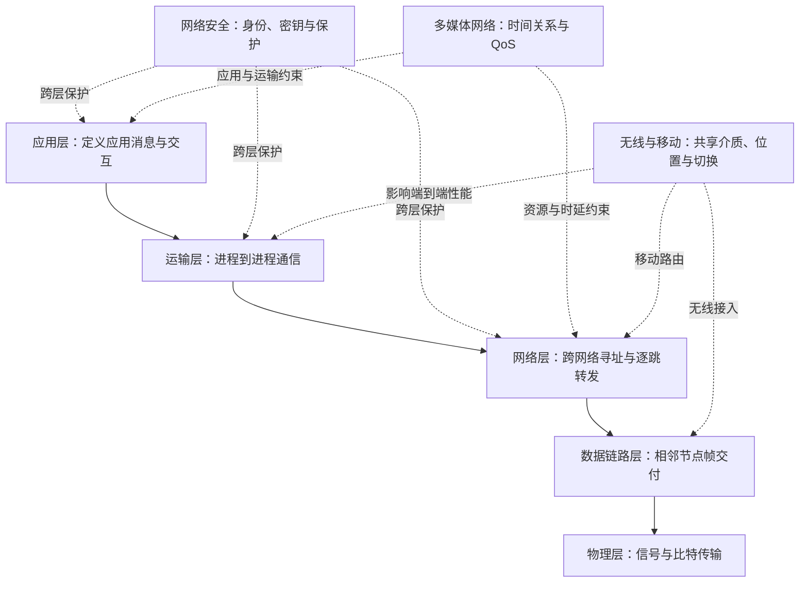
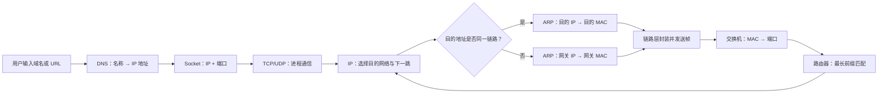
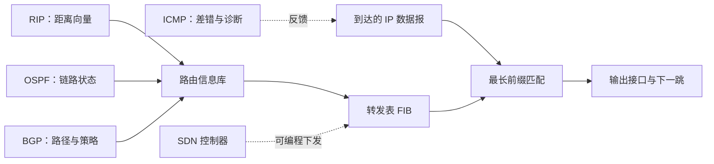

# MOC - 计算机网络

本页是计算机网络知识库的总入口。它把九章课程内容组织为**协议分层、端到端交付、可靠性与性能、网络控制、安全、多媒体、无线与移动**几条相互交叉的主线；章节目录保存课程语境，主题链接负责连接真正相关的知识。

> [!abstract] 核心问题
> 计算机网络研究的是：不同主机上的应用进程，如何经过多种链路与中间系统交换数据，并在寻址、共享、差错、拥塞、移动和攻击等约束下获得可接受的正确性与性能。

> [!important] 范围说明
> - 本 MOC 覆盖课程知识库的**全部九章**。
> - [[知识点/期末考试重点知识|期末考试重点知识]]是单独的复习入口，目前只覆盖第一至第六章；考试范围不会反向限制本知识库收录的完整内容。
> - 本库用于建立稳定知识结构。协议版本、部署参数和安全建议需要在工程使用前另行核实。

> [!info] 与计算机科学引论的关系
> [[MOC - 计算机科学引论]]先建立计算、软硬件、互联网与社会影响的全局图景；其中[[08-通信与网络]]和[[02-互联网、Web与电子商务]]提供网络概览，[[09-隐私、安全与伦理]]建立安全与责任边界。本课程 MOC 在此基础上继续深入协议分层、逐跳转发、端到端可靠性、路由控制、无线移动和多媒体服务。

## 总体知识地图



这张图有两种读法：纵向是一次通信的封装与交付路径；横向是安全、多媒体和移动性对多个协议层的共同约束。

## 九章入口

| 章节入口 | 解决的核心问题 | 关键输出 |
| --- | --- | --- |
| [[知识点/第一章/第一章 计算机网络概述|第一章　计算机网络概述]] | 为什么需要分组交换与协议分层 | 网络组成、性能指标、五层体系 |
| [[知识点/第二章/第二章 物理层|第二章　物理层]] | 如何把比特表现为可传播信号 | 编码、调制、信道容量、复用、媒体 |
| [[知识点/第三章/第三章 数据链路层|第三章　数据链路层]] | 如何在一段链路或二层网络中交付帧 | 成帧、CRC、PPP、以太网、交换、VLAN |
| [[知识点/第四章/第四章 网络层|第四章　网络层]] | 如何跨异构网络寻址和逐跳转发 | IP、ARP、ICMP、路由、NAT、MPLS、SDN |
| [[知识点/第五章/第五章 运输层|第五章　运输层]] | 如何让不同主机上的进程通信 | 端口、UDP、TCP、可靠传输、拥塞控制 |
| [[知识点/第六章/第六章 应用层|第六章　应用层]] | 应用进程交换什么消息、如何解释 | DNS、HTTP、邮件、DHCP、SNMP、Socket、P2P |
| [[知识点/第七章/第七章 网络安全|第七章　网络安全]] | 如何在明确威胁模型下保护数据与身份 | 密码体制、鉴别、PKI、IPsec、TLS、防火墙、IDS |
| [[知识点/第八章/第八章 互联网上的音频视频服务|第八章　音频视频服务]] | 如何维持媒体时间关系并改善服务质量 | 缓存、RTSP、RTP/RTCP、SIP、IntServ、DiffServ |
| [[知识点/第九章/第九章 无线网络和移动网络|第九章　无线与移动网络]] | 链路和位置变化时如何继续通信 | WLAN、WPAN、蜂窝网络、LTE、Mobile IP、5G 场景 |

## 分层主线

| 层次 | 服务对象 | 数据单位 | 主要标识 | 典型设备或端点 | 关键机制 |
| --- | --- | --- | --- | --- | --- |
| 应用层 | 应用进程与用户 | 应用报文 | 域名、URL、应用标识 | 客户端、服务器、对等方 | 请求/响应、命名、状态与数据格式 |
| 运输层 | 应用进程 | TCP 报文段 / UDP 用户数据报 | 端口、套接字 | 操作系统运输层端点 | 复用分用、可靠传输、流量与拥塞控制 |
| 网络层 | 主机或路由器接口 | IP 数据报 | IP 地址、网络前缀 | 主机、路由器 | 路由选择、最长前缀匹配、分片与差错报告 |
| 数据链路层 | 相邻节点或同一二层网络 | 帧 | MAC 地址、VLAN ID | 网卡、交换机、AP | 成帧、透明传输、检错、媒体访问与交换 |
| 物理层 | 相邻物理接口 | 比特 | 信号与接口参数 | 收发器、媒体、中继设备 | 编码、调制、同步、复用与传输 |

> [!tip] 判断协议层次
> 先问“这个机制使用什么标识、在哪些相邻实体之间生效、能否跨越路由器”。MAC 地址通常约束当前链路，IP 地址支持跨网络交付，端口把数据交给主机中的应用进程，应用协议再解释消息语义。

## 一次端到端通信



> [!note] 标识不会互相替代
> DNS 名称便于应用使用，IP 地址确定跨网络目的接口，MAC 地址完成当前链路的下一跳交付，端口号标识主机内的应用端点。每经过一个路由器，链路层帧通常重新封装，而 IP 数据报承担端到端逐跳转发的共同语义。

### 寻址、解析与转发

- 名称到地址：[[知识点/第六章/6.1 域名系统 DNS|DNS]]
- 自动获得网络配置：[[知识点/第六章/6.6 动态主机配置协议 DHCP|DHCP]]
- IPv4 地址、前缀和子网：[[知识点/第四章/4.2.2 IPv4 地址与子网划分|IPv4 地址与子网划分]]
- 当前链路的 IP 到 MAC 映射：[[知识点/第四章/4.2.4 地址解析协议 ARP|ARP]]
- 二层转发：[[知识点/第三章/3.4 以太网交换|以太网交换]]
- 三层转发：[[知识点/第四章/4.3 IP 分组转发|IP 分组转发]]
- 私网到公网的边界转换：[[知识点/第四章/4.8.2 网络地址转换 NAT|NAT]]

## 可靠性、流量与性能

| 范围 | 主要风险 | 发现或反馈机制 | 主要应对方式 |
| --- | --- | --- | --- |
| 物理信道 | 噪声、衰减、带宽受限 | 信号质量与接收判决 | 合适的编码、调制、媒体和速率 |
| 单段链路 | 比特差错、帧边界混淆、介质冲突 | FCS/CRC、载波监听、确认机制 | 检错、填充、重传或退避 |
| 网络路径 | 不可达、环路、拥塞、MTU 不一致 | ICMP、路由协议、队列状态 | 路由收敛、分片/路径 MTU、队列管理 |
| 运输连接 | 丢失、乱序、重复、接收方过载 | 序号、ACK、计时器、接收窗口 | 重传、滑动窗口、流量控制 |
| 整体网络 | 注入速率超过路径容量 | 丢包、ECN、重复 ACK、RTT 变化 | 慢开始、拥塞避免、快重传/恢复、AQM |
| 实时应用 | 时延、抖动、少量丢包 | 时间戳、序号、接收报告 | 播放缓存、编码容错、资源调度与 QoS |

> [!warning] 三个概念不要混淆
> - **差错检测**回答“数据是否可能损坏”，不自动保证可靠交付。
> - **流量控制**保护接收方，避免发送速度超过接收能力。
> - **拥塞控制**保护网络路径，避免过多数据注入网络。

### 核心入口

- 网络性能与四类时延：[[知识点/第一章/1.6 计算机网络的性能|计算机网络的性能]]
- 信道容量边界：[[知识点/第二章/2.2.3 信道的极限容量|奈氏准则与香农公式]]
- 链路检错：[[知识点/第三章/3.1.2 循环冗余检验|循环冗余检验]]
- 共享介质竞争：[[知识点/第三章/3.3 共享以太网与 CSMA-CD|共享以太网与 CSMA/CD]]
- TCP 可靠性：[[知识点/第五章/5.6 TCP 可靠传输机制|TCP 可靠传输机制]]
- 流量与拥塞：[[知识点/第五章/5.7 TCP 流量控制|TCP 流量控制]] · [[知识点/第五章/5.8 TCP 拥塞控制|TCP 拥塞控制]]
- 多媒体性能：[[知识点/第八章/8.1 多媒体网络的性能需求|多媒体网络的性能需求]] · [[知识点/第八章/8.4 服务质量与资源调度|服务质量与资源调度]]

## 控制平面与数据平面



- 路由基础与自治系统：[[知识点/第四章/4.6 路由选择基础|路由选择基础]]
- 内部网关协议：[[知识点/第四章/4.6.2 RIP 路由协议|RIP]] · [[知识点/第四章/4.6.3 OSPF 路由协议|OSPF]]
- 自治系统之间：[[知识点/第四章/4.6.4 BGP 路由协议|BGP]]
- 路由器内部结构：[[知识点/第四章/4.6.5 路由器的构成|路由器的构成]]
- 差错报告与诊断：[[知识点/第四章/4.4 网际控制报文协议 ICMP|ICMP]]
- 可编程控制：[[知识点/第四章/4.10 软件定义网络 SDN|SDN]]

> [!important] 路由与转发
> **路由选择**建立和维护可达信息，属于控制层面的过程；**分组转发**在每个数据报到达时查询转发表并选择输出接口，属于数据层面的高频操作。

## 应用与协议族

### 基础网络服务

- [[知识点/第六章/6.1 域名系统 DNS|DNS]]：域名到资源记录的分布式解析。
- [[知识点/第六章/6.6 动态主机配置协议 DHCP|DHCP]]：自动分配地址、网关和 DNS 等配置。
- [[知识点/第六章/6.7 简单网络管理协议 SNMP|SNMP]]：管理站、代理与 MIB 之间的网络管理。

### 内容与消息传输

- [[知识点/第六章/6.4 万维网与 HTTP|HTTP]]：Web 资源的请求与响应。
- [[知识点/第六章/6.2 文件传送协议 FTP 与 TFTP|FTP 与 TFTP]]：面向连接的文件传输与轻量文件传送。
- [[知识点/第六章/6.5 电子邮件系统|电子邮件系统]]：SMTP 发送，POP3/IMAP 读取，MIME 扩展内容类型。
- [[知识点/第六章/6.8 Socket 与网络编程接口|Socket]]：应用使用运输层服务的编程接口。
- [[知识点/第六章/6.9 P2P 应用与分布式散列表|P2P 与 DHT]]：去中心或弱中心的资源发现与分发。

### 实时媒体

- [[知识点/第八章/8.2 流式存储音频视频与 RTSP|流式媒体与 RTSP]]：播放控制与缓存。
- [[知识点/第八章/8.3 交互式音频视频与实时会话协议|RTP、RTCP 与实时会话]]：媒体承载、反馈与会话建立。
- [[知识点/第八章/8.4 服务质量与资源调度|QoS 与资源调度]]：分类、管制、调度、预留和区分服务。

## 安全主线


- 威胁与目标：[[知识点/第七章/7.1 网络安全目标、威胁与加密模型|网络安全目标、威胁与加密模型]]
- 密码能力：[[知识点/第七章/7.2 对称密码与公钥密码|对称密码与公钥密码]]
- 身份与报文：[[知识点/第七章/7.3 报文鉴别与实体鉴别|报文鉴别与实体鉴别]]
- 信任与密钥：[[知识点/第七章/7.4 密钥分配与公钥基础设施|密钥分配与 PKI]]
- 通信协议：[[知识点/第七章/7.5 互联网安全协议|互联网安全协议]]
- 边界防护与监测：[[知识点/第七章/7.6 防火墙与入侵检测|防火墙与入侵检测]]

> [!warning] “安全”不是单一属性
> 加密、散列、MAC、签名、证书和防火墙解决的问题不同。分析安全机制时应明确资产、攻击者能力、信任边界、安全目标、密钥前提和失败方式。

## 无线与移动主线

- 无线共享介质：[[知识点/第九章/9.1 无线局域网 WLAN 与 802.11|WLAN 与 802.11]]
- 短距离低功耗网络：[[知识点/第九章/9.2 无线个人区域网 WPAN|WPAN]]
- 蜂窝接入与核心网：[[知识点/第九章/9.3 蜂窝移动通信与 LTE|蜂窝移动通信与 LTE]]
- 网络层移动性：[[知识点/第九章/9.4 移动 IP 与传输层影响|移动 IP 与传输层影响]]
- 代际与应用场景：[[知识点/第九章/9.5 移动通信与 5G 场景|移动通信与 5G 场景]]

> [!compare] 三种“移动”不要混淆
> **WLAN 漫游**主要处理同一无线局域网体系中的 AP 关联变化；**蜂窝移动性**由接入网和核心网维护位置、承载与切换；**Mobile IP**尝试在网络层保持归属地址并通过转交地址和隧道支持跨网络移动。

## 计算与推导入口

| 题型 | 入口 | 必查条件 |
| --- | --- | --- |
| 发送、传播、排队与总时延 | [[知识点/第一章/1.6 计算机网络的性能|网络性能]] | 数据长度、速率、距离、传播速度、经过链路数 |
| 奈氏准则与香农公式 | [[知识点/第二章/2.2.3 信道的极限容量|信道极限容量]] | 带宽、码元状态数、$S/N$ 是否为线性值 |
| CDMA 码片相关 | [[知识点/第二章/2.4.3 码分复用|码分复用]] | 码片序列、正交性、归一化内积 |
| CRC 余数与 FCS | [[知识点/第三章/3.1.2 循环冗余检验|循环冗余检验]] | 生成多项式阶数、补零数、模 2 除法 |
| CSMA/CD 争用期与最短帧 | [[知识点/第三章/3.3 共享以太网与 CSMA-CD|共享以太网与 CSMA/CD]] | 单程/往返传播时延、链路速率、帧长 |
| CIDR 与子网划分 | [[知识点/第四章/4.2.2 IPv4 地址与子网划分|IPv4 地址与子网划分]] | 前缀长度、主机位、网络/广播地址 |
| IPv4 分片 | [[知识点/第四章/4.2.5 IPv4 数据报格式|IPv4 数据报格式]] | MTU、首部长度、8 B 片偏移单位、MF |
| 最长前缀匹配 | [[知识点/第四章/4.3 IP 分组转发|IP 分组转发]] | 所有匹配项、前缀长度、默认路由 |
| TCP 窗口与重传 | [[知识点/第五章/5.6 TCP 可靠传输机制|TCP 可靠传输]] | 字节序号、ACK、窗口边界、RTT/RTO |
| TCP 拥塞窗口变化 | [[知识点/第五章/5.8 TCP 拥塞控制|TCP 拥塞控制]] | 算法版本、丢包信号、cwnd、ssthresh |

## 易混关系

> [!question]- MAC 地址、IP 地址和端口号分别回答什么？
> MAC 地址回答当前链路把帧交给谁；IP 地址回答跨网络把数据报送往哪个接口；端口号回答到达主机后交给哪个应用端点。

> [!question]- 带宽、吞吐量和时延是什么关系？
> 带宽描述链路或信道的能力上限，吞吐量是给定条件下实际完成的数据率，时延描述数据经历传输、传播、处理和排队所花的时间。高带宽不自动意味着低时延。

> [!question]- UDP 不可靠是否意味着应用一定不可靠？
> 不意味着。UDP 不提供 TCP 式连接、按序与重传，但应用可按自身需求实现确认、超时、重传或前向纠错；代价与语义由应用承担。

> [!question]- DNS、ARP 与路由协议都是“查地址”吗？
> 不是。DNS 解析应用名称，ARP 解析当前 IPv4 链路上的下一跳 MAC 地址，路由协议交换可达性并建立转发表；三者的层次、参与方和作用范围不同。

## 动态索引

### 章节 MOC

```dataview
TABLE chapter AS "章", aliases AS "别名", status AS "状态", updated AS "更新"
FROM "网络与安全/计算机网络A/知识点"
WHERE course = "计算机网络A" AND type = "MOC" AND chapter >= 1 AND chapter <= 9
SORT order ASC
```

### 各章知识节点

```dataview
TABLE WITHOUT ID chapter AS "章", length(rows) AS "节点数", rows.file.link AS "主题笔记"
FROM "网络与安全/计算机网络A/知识点"
WHERE course = "计算机网络A" AND type = "课程笔记" AND chapter
GROUP BY chapter
SORT chapter ASC
```

> [!info] 维护约定
> 新增稳定主题时优先链接到相应章节 MOC，并在确实跨层或跨章节时补充到本页。动态索引用于发现节点，不替代上面的人工知识关系。
