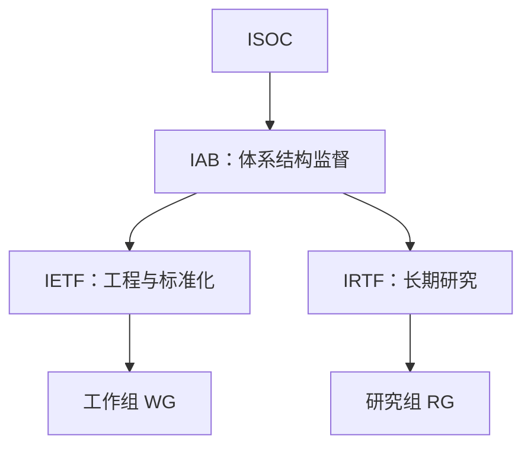
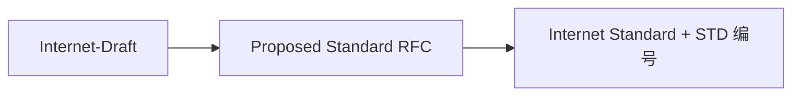

# 1.2 互联网概述

互联网不是一张巨大的单一网络，而是大量异构网络依据共同协议互连形成的“网络之网”。理解它的形成过程，可以解释分组交换、TCP/IP、多层 ISP 与开放标准为何成为互联网的基础。

## internet 与 Internet

> [!definition] 两种写法
> - **internet**：普通名词，泛指多个计算机网络形成的互连网。
> - **Internet**：专有名词，指采用 TCP/IP 协议族、覆盖全球的互联网。

网络由[[1.3.2 互联网的核心部分|路由器]]互连；网络服务最终被端系统上的应用进程使用。互联网因此同时具有“基础设施”和“服务平台”两个观察角度。

## 从单个网络到网络之网

互联网基础设施的形成可概括为三个阶段：

1. **单个分组交换网**：ARPANET 验证了分组交换，但此时仍是一张网络。
2. **三级结构互联网**：TCP/IP 支持异构网络互连，主干网、地区网和校园网形成层次结构。
3. **多层 ISP 互联网**：商业化后，互联网服务提供者（Internet Service Provider, ISP）负责用户接入与网络互连；互联网交换点（Internet Exchange Point, IXP）让网络可以直接交换流量。

![[Pasted image 20260715203942.png]]

> [!note] 图示：网络互连的基本形态
> 路由器连接不同网络，端系统无需知道中间每一张网络的内部实现。

![[Pasted image 20260715203952.png]]

> [!note] 图示：多层 ISP 的抽象结构
> 这里的“层”描述运营和互连关系，不是[[1.7 计算机网络体系结构|协议栈层次]]。现实互连通常不是严格的树形。

## 支撑互联网扩展的设计

- **分组交换**：不同突发数据流动态共享链路，见[[1.3.2 互联网的核心部分#分组交换]]。
- **TCP/IP**：向异构网络提供共同的互连层，见[[1.7 计算机网络体系结构#TCP/IP 的沙漏结构]]。
- **端到端思想**：核心尽量提供通用的数据交付能力，许多复杂功能由端系统实现。
- **开放标准**：不同组织和厂商只要遵循共同协议，就能在不统一内部实现的前提下互操作。

## 互联网标准化

RFC（Request for Comments）是文档系列，而不是“标准”的同义词。RFC 可以是标准轨道、最佳当前实践、信息性、实验性或历史性文档。

> [!warning] 阅读 RFC 时的边界
> Internet-Draft 是可能变化的工作文档；有 RFC 编号也不等于它是互联网标准。还应检查文档类别，以及 `Updates`、`Obsoletes` 和勘误关系。

## 本节小结

- Internet 是采用 TCP/IP 互连大量异构网络形成的全球互联网。
- ISP 与 IXP 描述网络如何接入和互连，不应与协议分层混淆。
- 分组交换、共同互连层、端到端思想和开放标准共同支撑互联网扩展。
- RFC 是文档系列；标准只是其中一类文档。

## 来源说明

- 标准化流程依据 RFC 2026 与 RFC 6410 整理。
- 历史脉络与插图来自原始课程材料；本笔记只保留解释体系结构所需的节点。

> [!info] 章节导航
> 上一节：[[1.1 计算机网络在信息时代中的作用]]　｜　下一节：[[1.3 互联网的组成]]
