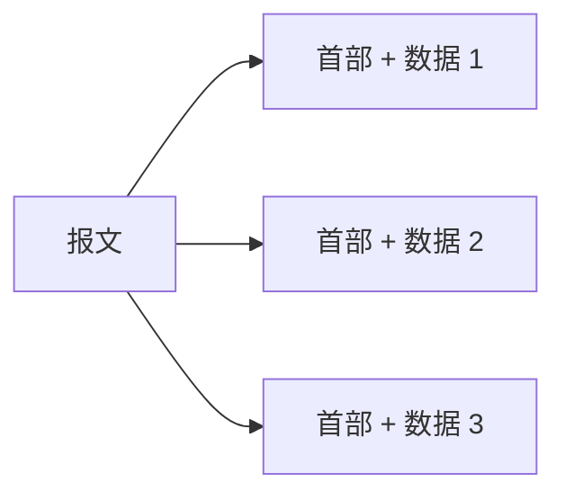

# 1.3.2 互联网的核心部分

网络核心要让大量端系统共享通信资源，并把分组送往正确方向。路由器（router）是其中的关键设备：它接收分组、检查首部、查找转发表，再从合适的接口转发到下一跳。

> [!important] 核心提供什么
> 路由器提供逐跳连通性，但分组交换本身不保证固定带宽、固定时延或可靠交付。可靠性与服务质量需要由具体协议和网络机制实现。
> ^network-core-task

## 为什么需要交换

若 $N$ 个端点全部两两直连，需要的链路数为

$$
\frac{N(N-1)}{2}
$$

链路数随端点数量平方增长，难以扩展。交换设备让端点只需接入网络，再由网络按需分配传输资源。

![[Pasted image 20260715204051.png]]

> [!note] 图示：从两两直连到交换网络
> 交换的本质是按某种规则动态分配链路和节点资源。

## 电路交换

电路交换（circuit switching）在通信前建立一条端到端逻辑通路，并为会话预留资源：

### 特点与边界

- 连接建立后，资源相对确定，适合持续、稳定的数据流。
- 若资源不足，新连接可能被拒绝。
- 即使通信暂时没有数据，已分配资源通常仍不能被其他会话使用。

> [!example] 电话通话
> 传统电话网在拨号后建立通路，通话期间占用话路，挂机后释放。用户线可由单个用户独占，交换机之间的中继线则包含许多可分配话路。

对于突发式计算机数据，发送与思考、处理、等待交替发生，专用资源会在空闲期浪费。因此电路交换并非所有数据通信的理想选择。

## 分组交换

分组交换（packet switching）把较长报文（message）划分为较小的数据段，并给每段加上首部（header），形成分组（packet）。首部包含目的地址等控制信息，使路由器能够独立转发每个分组。

> [!example] 1024 bit 数据段
> 若把报文划分为若干个 $1024\ \mathrm{bit}$ 的数据段，每段都要再加首部。更小的分组可流水转发，但分组越多，首部和处理开销也越大。

### 存储转发

路由器通常按以下过程处理分组：

这种“先接收，再转发”的方式称为存储转发（store and forward）。分组可在多条通信流之间动态共享链路，称为统计复用。

![[Pasted image 20260715204122.png]]

> [!note] 图示：路由器逐跳转发
> 不同分组可经不同路径到达目的地；路由信息用于生成和维护转发表。
### 优势与代价

| 方面 | 机制 | 结果 |
| --- | --- | --- |
| 链路共享 | 按分组逐段占用链路 | 适合突发流量，提高整体利用率 |
| 路径选择 | 分组根据转发表逐跳转发 | 可绕开部分故障或拥塞区域 |
| 快速发送 | 通常无需先建立专用电路 | 首个分组可立即进入网络 |
| 代价 | 排队、首部与控制机制 | 引入可变时延、开销、拥塞和丢包 |

> [!warning] “可靠”不是分组交换的自动保证
> 网状拓扑和动态路由可以提高网络生存性，但单个分组仍可能丢失、重复、失序或损坏。是否恢复这些问题取决于具体协议。

## 报文交换

报文交换（message switching）也采用存储转发，但中间节点要接收并保存**整个报文**后再转发。报文较长时，它占用更多缓冲区，也更晚开始下一跳传输；现代互联网核心采用的是分组交换，而不是以完整报文为单位的交换。

## 三种交换方式的比较

![[Pasted image 20260715204138.png]]

> [!note] 图示：电路、报文与分组交换
> 图中 A、D 是端点，B、C 是中间节点，P1～P4 是四个分组。

| 维度 | 电路交换 | 报文交换 | 分组交换 |
| --- | --- | --- | --- |
| 资源 | 建立连接时预留 | 按报文动态占用 | 按分组动态占用 |
| 中间节点处理单位 | 连续比特流 | 完整报文 | 单个分组 |
| 是否存储转发 | 否 | 是 | 是 |
| 时延特点 | 有建立时延，建立后较稳定 | 报文越长，逐跳等待越明显 | 可流水转发，但存在排队时延 |
| 主要适用性 | 长时间、稳定连续流 | 历史性方式 | 突发数据和共享网络 |

> [!example] 怎样选择
> 若连续传输大量数据，且传输时间远大于连接建立时间，预留资源的电路可能有效；若流量突发、用户众多且需要灵活共享链路，分组交换更合适。选择依据是业务特征和服务要求，而不是简单地把“语音”与“数据”固定对应到某一种交换方式。

## 本节小结

- 交换避免端点两两直连造成的平方级链路增长。
- 电路交换预留端到端资源；报文交换存储完整报文；分组交换存储并转发较小分组。
- 分组交换通过统计复用适应突发流量，代价是排队、首部开销、拥塞和丢包。
- 路由器逐跳转发分组；路由决定可用路径，转发执行本次下一跳选择。

> [!info] 章节导航
> 上一节：[[1.3 互联网的组成]]　｜　下一节：[[1.4 计算机网络在我国的发展]]
