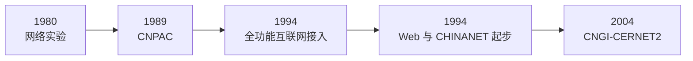

# 1.4 计算机网络在我国的发展

本节以少数基础设施节点说明我国计算机网络如何从专用网络实验发展到互联网接入与下一代网络试验。这里关注技术与组织结构的形成，不保留容易过时的用户规模、带宽排名和企业产品描述。

## 基础设施演进

### 专用网络与局域网

早期网络建设首先服务于铁路、公安、银行等组织的数据传递，同时单位内部局域网逐步普及。这一阶段说明网络可以按[[1.5 计算机网络的类别#按使用边界分类|使用边界]]分为专用网和公用网，也说明局域互连与广域互连是两类不同问题。

### 全功能接入互联网

1994 年 4 月 20 日，我国通过 64 kbit/s 专线实现全功能互联网连接。同年出现首个 Web 服务器，CHINANET 启动。其知识意义在于：网络从相对独立的专用系统转向基于 TCP/IP 的全球互连，开放的应用平台随之形成。

### 全国性骨干网络

原始课程材料列举了 CHINANET、UNINET、CMNET、CERNET 和 CSTNET。这些网络的运营主体和服务对象不同，但都体现了[[1.2 互联网概述#从单个网络到网络之网|ISP 和异构网络互连]]：Internet 并非由单一组织拥有，而是多张网络协同组成。

### 下一代互联网试验

CNGI-CERNET2 等试验网络推动了 IPv6 和更高速骨干技术的部署。这里的重点不是某一时期的链路速率，而是通过试验网验证新协议、设备与运行机制，再逐步进入生产网络。

## 应用生态的意义

门户、搜索、电子邮件、即时通信和电子商务等应用曾推动互联网普及。对知识建模而言，更稳定的结论是：

- 网络基础设施提供通用连通性，新应用可在其上持续出现；
- 应用增长反过来推动接入网、数据中心和骨干网扩容；
- 应用进程的组织方式仍可用[[1.3 互联网的组成#客户—服务器方式|C/S]]与[[1.3 互联网的组成#对等方式|P2P]]等模型分析。

## 本节小结

- 我国网络建设经历了专用网络、公用分组交换网、全功能互联网接入和下一代互联网试验等阶段。
- 关键变化是从独立网络走向基于共同协议的异构网络互连。
- 基础设施与应用相互促进；阶段性规模数据不作为本知识节点的主体。

> [!info] 章节导航
> 上一节：[[1.3.2 互联网的核心部分]]　｜　下一节：[[1.5 计算机网络的类别]]
