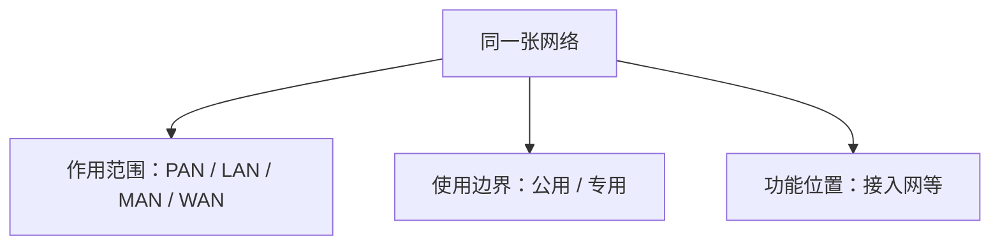

# 1.5 计算机网络的类别

网络可以按覆盖尺度、使用边界和功能位置分类。三种分类回答不同问题，可以同时描述同一张网络；例如，一个企业园区中的专用 LAN 也可以承担接入网功能。

## 计算机网络的工作定义

> [!definition] 计算机网络
> 计算机网络由可编程设备与通信链路互连而成，通过协议交换数据，并支持多种应用与资源共享。

这个定义强调三点：

- 节点不限于传统计算机，也包括手机、服务器、传感器等可编程设备；
- 网络不绑定某一种数据类型，可以承载文本、音频、视频和控制信息；
- 通信是基础能力，应用和资源共享是建立在通信之上的目标。

若处理器之间仅通过同一设备内部的互连紧密协作，通常更适合称为多处理器系统，而不是独立的计算机网络。边界取决于体系结构和管理方式，不能只用物理距离机械判断。

## 按作用范围分类

| 类别 | 英文 | 典型尺度与场景 | 关键认识 |
| --- | --- | --- | --- |
| 个人区域网 | PAN / WPAN | 个人周围，常见为数米到十余米 | 连接个人设备，常使用无线技术 |
| 局域网 | LAN | 房间、楼宇、园区 | 通常由单一组织管理，强调局部高速互连 |
| 城域网 | MAN | 城市范围 | 连接多个局域网，技术上可能采用以太网等方案 |
| 广域网 | WAN | 跨地区、国家或洲 | 通过长距离链路连接分散网络或站点 |

> [!warning] 范围数字不是硬边界
> PAN、LAN、MAN、WAN 的尺度用于建立直觉，不是严格的距离判定公式。管理边界、使用技术和网络用途同样重要。

## 按使用边界分类

- **公用网（public network）**：面向符合接入条件的公众或客户提供服务，通常由运营组织建设和维护。
- **专用网（private network）**：为某个组织或业务系统服务，访问范围受组织策略控制。

“公用/专用”描述谁可以使用和谁负责管理，与 LAN/WAN 的覆盖范围无直接等价关系。专用网可以跨越广域，公用网也可以在局部范围提供服务。

## 接入网是功能分类

接入网（Access Network, AN）把端系统连接到本地 ISP 的第一个路由器。它回答的是“用户怎样进入互联网”，不是“网络覆盖多大”。

接入网可由以太网、Wi-Fi、光纤接入或蜂窝网络实现；某个接入网在覆盖尺度上也可能属于 LAN。不要把“接入网”与“互联网边缘”完全等同：前者是连接路径，后者主要指端系统及其应用。

## 分类之间的正交关系

> [!example] 企业园区网
> 从尺度看，它通常是 LAN；从使用边界看，它是专用网；若员工设备通过它连接 ISP，它的部分链路又承担接入网功能。三个描述并不冲突。

## 本节小结

- 计算机网络通过协议连接可编程设备，支持多类型数据与多种应用。
- PAN、LAN、MAN、WAN 按作用范围分类；公用网与专用网按使用边界分类。
- 接入网按功能位置定义，负责把端系统连接到 ISP 的边缘路由器。
- 多种分类可以同时成立，不能把它们当作互斥的单一目录树。

> [!info] 章节导航
> 上一节：[[1.4 计算机网络在我国的发展]]　｜　下一节：[[1.6 计算机网络的性能]]
