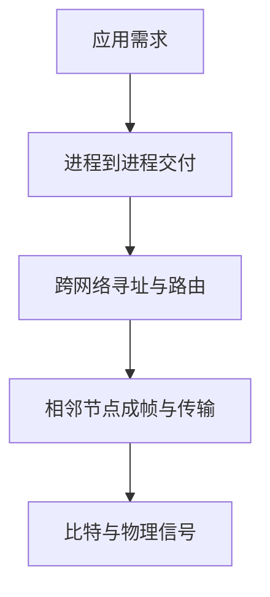

# 1.7 计算机网络体系结构

网络通信同时涉及应用规则、进程交付、跨网寻址、相邻节点传输和物理信号。协议分层把这些职责分解为稳定接口，使各层可以相对独立地设计、实现和替换。

> [!definition] 三个层次的概念
> - **体系结构（architecture）**：系统应具备哪些层次和功能。
> - **协议（protocol）**：对等实体交换信息时遵循的规则。
> - **实现（implementation）**：用哪些程序、数据结构和硬件完成这些功能。

## 为什么需要分层

若把所有通信细节写成一个整体，任何介质、应用或可靠性机制的变化都可能影响全系统。分层把复杂问题拆为模块，并通过层间接口限制依赖。

合理分层通常遵循：

- 每层处理一组内聚职责，并向上层提供明确服务；
- 同层实体遵循共同协议，层间通过接口交互；
- 一层内部实现变化时，尽量不改变对上层暴露的服务；
- 分层不能消除复杂度，只是把复杂度放到可管理的边界中。

> [!note] 分层的代价
> 严格分层可能重复实现功能、增加首部与处理开销，也可能让某层难以利用其他层的信息。实际互联网体系结构允许有限的跨层优化，因此“分层”是工程原则，不是不可突破的物理定律。

## 协议规定什么

网络协议通常包含三个要素：

1. **语法（syntax）**：字段格式、编码和报文结构；
2. **语义（semantics）**：字段含义，以及发送方、接收方应执行的动作；
3. **同步或时序（synchronization/timing）**：事件先后、速度匹配、超时与重传时机。

> [!example] 文件传送的模块化
> 文件传送模块处理文件命令和数据；通信服务模块保证进程间的数据交付；网络接入模块负责把数据送入具体网络。上层复用下层服务，不必把每种链路的细节写入文件传送程序。

![[Pasted image 20260715204239.png]]

> [!note] 图示：分层与对等通信
> 同一主机内是层间服务调用；不同主机的同层实体在逻辑上进行对等通信。

## 三种常见体系结构

| 模型 | 层数 | 主要用途与特点 |
| --- | ---: | --- |
| OSI 参考模型 | 7 | 概念划分细致，适合讨论服务、接口和协议 |
| TCP/IP 体系结构 | 4 | 互联网实际使用的协议族抽象 |
| 教学五层模型 | 5 | 将 TCP/IP 的网络接口层拆为数据链路层与物理层，便于学习原理 |

![[Pasted image 20260715204249.png]]

> [!note] 图示：OSI、TCP/IP 与五层模型
> 不同模型的层次不能仅按编号机械对应，应比较每层实际职责。

## 五层模型

| 层次 | 主要职责 | 典型协议或技术 | 数据单元 |
| --- | --- | --- | --- |
| 应用层 | 定义应用进程交换信息的规则 | HTTP、DNS、SMTP | 报文（message） |
| 运输层 | 为进程提供端到端数据传输，执行复用与分用 | TCP、UDP | TCP 报文段 / UDP 用户数据报 |
| 网络层 | 跨异构网络寻址、路由与分组转发 | IP、路由协议 | IP 数据报（分组） |
| 数据链路层 | 在相邻节点间成帧、介质访问与差错检测 | Ethernet、Wi-Fi 的链路机制 | 帧（frame） |
| 物理层 | 在介质上传送比特，规定信号和物理接口 | 编码、调制、物理接口规范 | 比特（bit） |

### 应用层

应用层协议定义应用进程之间交换报文的格式与行为。它面向具体应用，例如 HTTP 支持 Web 交互，DNS 提供名称解析，SMTP 支持电子邮件传输。

### 运输层

运输层向应用提供通用的进程到进程传输服务，并根据端口等标识完成复用与分用。

- **TCP**：面向连接，提供可靠、有序的字节流服务；数据单元常称报文段（segment）。
- **UDP**：无连接，提供尽最大努力的数据报服务；数据单元称用户数据报（user datagram）。

> [!warning] 两种“数据报”
> UDP 用户数据报属于运输层；IP 数据报属于网络层。名称相似，层次和首部职责不同。

### 网络层

网络层为不同网络中的主机提供分组交付。路由协议帮助路由器生成和维护路由信息，转发过程则依据转发表把 IP 数据报送到下一跳。互联网语境中“网络层”“网际层”“IP 层”常指相近的功能层次。

### 数据链路层

链路层把 IP 数据报封装成帧，在相邻节点之间传送。帧通常包含首部、载荷和必要的尾部，以完成边界识别、链路寻址和差错检测。是否重传损坏帧取决于具体链路协议，不能一概而论。

### 物理层

物理层规定怎样用电、光或无线信号表示比特，以及接口、电气或机械特征。双绞线、光纤和无线频谱是传输介质；它们承载物理层信号，但介质本身不等于一套物理层协议。

## 封装、转发与解封装

发送端把上层数据作为本层载荷并添加控制信息，这一过程称为封装（encapsulation）；接收端按相反方向解析和移除控制信息，称为解封装（decapsulation）。

![[Pasted image 20260715204300.png]]

> [!example] 两台主机经一台路由器通信
> 源主机从应用层逐层封装并发送比特流。中间路由器处理到网络层：移除入站链路的帧，检查 IP 首部并选择下一跳，再用出站链路的新帧封装同一个 IP 数据报。目的主机最终逐层解封装，把应用数据交给目标进程。

> [!tip] 信封类比的边界
> 每层加“信封”有助于理解封装，但现实中各层可能分段、聚合、重传或修改部分字段，链路层帧还会逐跳更换。因此类比不能替代对各层首部职责的理解。

## 对等通信与 PDU

两个同层实体看起来像在直接交换该层数据，实际上数据必须借助下层服务穿过网络。这种水平关系称为对等通信。

第 $n$ 层的协议数据单元（Protocol Data Unit, PDU）通常由本层控制信息和上层交付的数据组成：

$$
\mathrm{PDU}_n=\mathrm{PCI}_n+\mathrm{SDU}_n
$$

- PCI（Protocol Control Information）：本层协议控制信息；
- SDU（Service Data Unit）：上层通过接口交给本层的数据。

一个 SDU 可以被拆成多个 PDU，多个 SDU 也可能被组合，因此两者不必一一对应。

## 协议、服务与接口

> [!warning] 三者不要混淆
> - **协议是水平的**：约束不同系统中对等实体之间的通信。
> - **服务是垂直的**：下层把可见能力提供给上层。
> - **接口位于本机相邻层之间**：规定上层如何访问下层服务。
> ^protocol-service-interface

服务访问点（Service Access Point, SAP）是上层访问下层服务的逻辑位置。上层只需知道服务接口，不必知道下层协议的全部实现细节；这种隐藏称为透明性。

![[Pasted image 20260715204312.png]]

## 经典例题：不可靠信道上的协调

> [!example] 两支蓝军能否保证同时进攻
> 蓝军 1 和蓝军 2 分处两座山，单独进攻会失败，协同进攻才能获胜。通信电文和确认都可能丢失。问题是：能否设计协议，使双方 **100% 确定** 同时进攻？

假设蓝军 1 发出进攻命令，蓝军 2 收到后确认：

1. 蓝军 2 不知道确认是否到达，因此不敢确定蓝军 1 会进攻；
2. 蓝军 1 再发送“确认的确认”，但又不知道这条消息是否到达；
3. 无论增加多少次确认，最后一条消息的发送方都无法确认对方是否收到。

![[Pasted image 20260715204319.png]]

因此，在消息可能丢失且没有其他可靠渠道的前提下，有限次消息交换无法建立双方都知道、并且双方都知道对方知道的共同知识，也就不能保证 100% 协同成功。

> [!important] 例题说明什么
> 协议正确性必须覆盖超时、丢失、重复和故障等异常条件。重传与确认可以把失败概率降得很低，却不能在该模型下把不确定性彻底消除。

## TCP/IP 的沙漏结构

TCP/IP 常抽象为四层：应用层、运输层、网际层和网络接口层。教学五层模型把网络接口层进一步拆成数据链路层与物理层。

![[Pasted image 20260715204340.png]]

TCP/IP 协议族呈“中间窄、上下宽”的沙漏形：

- 多种应用与运输协议都可运行在 IP 之上，即 **everything over IP**；
- IP 又能运行在以太网、Wi-Fi 等多种链路技术之上，即 **IP over everything**。

IP 形成最小的共同互连层，使上层应用和下层网络技术可以相对独立地演进。这也是[[1.2 互联网概述#支撑互联网扩展的设计|异构网络扩展]]的关键。

## 客户—服务器如何穿过协议栈

客户进程向服务器进程发请求时，应用层观察到的是一次逻辑交互；实际数据会使用运输层、网络层、链路层和物理层提供的服务。

![[Pasted image 20260715204347.png]]

> [!example] 多客户并发
> 一台服务器主机可运行多个服务器进程，一个服务器进程也可同时服务许多客户。运输层利用端口等标识进行分用，把到达的数据交给正确进程；服务器进程再按应用协议区分和处理各次交互。

![[Pasted image 20260715204354.png]]

这说明“客户—服务器”是应用进程的关系，而数据交付依赖整套协议栈。相关角色定义见[[1.3 互联网的组成#客户—服务器方式]]。

## 本节小结

- 分层把复杂通信拆成职责明确的模块；体系结构描述功能，协议规定对等通信，实现落实到软硬件。
- 五层模型包括应用层、运输层、网络层、数据链路层和物理层；发送端逐层封装，接收端逐层解封装。
- 协议是水平规则，服务是下层向上层提供的能力，接口是本机相邻层的访问边界。
- 协议必须考虑异常路径；蓝军协调例题说明不可靠信道中有限次确认无法带来绝对确定性。
- TCP/IP 以 IP 作为共同互连层，形成支持多应用与多链路技术的沙漏结构。

> [!info] 章节导航
> 上一节：[[1.6 计算机网络的性能]]　｜　返回：[[1.0 第一章 概述]]
