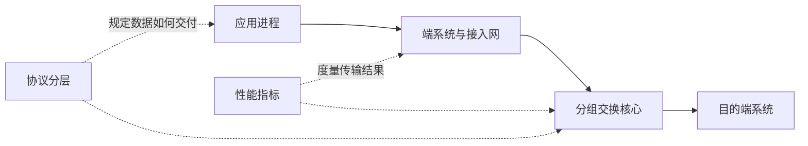

# 1.0 第一章 计算机网络概述

本章回答四个基础问题：互联网由什么组成，数据为何采用分组交换，网络性能如何度量，以及协议分层怎样把复杂通信变成可实现、可互操作的系统。后续章节中的链路、IP、TCP/UDP 与应用协议都建立在这幅整体图景上。

> [!abstract] 一句话主线
> **应用进程在网络边缘产生数据，经协议栈逐层封装，由核心路由器逐跳转发；传输结果受带宽、时延、拥塞和协议机制共同影响。**

> [!info] 与计算机科学引论的联系
> [[01-信息技术、互联网与您]]和[[02-互联网、Web与电子商务]]从用户与应用角度说明互联网价值，[[08-通信与网络]]给出通信系统和网络类型概览；本章进一步把这些现象落实为分组交换、性能指标与协议分层。

## 知识地图



图中实线是数据路径，虚线是理解这条路径的两个视角：体系结构说明“如何协作”，性能指标说明“效果怎样”。

## 概念路径

### 互联网是什么

- [[1.1 计算机网络在信息时代中的作用]]：从信息传递、资源共享和应用承载理解网络的价值。
- [[1.2 互联网概述]]：区分 internet 与 Internet，理解异构网络互连、ISP 与开放标准。
- [[1.4 计算机网络在我国的发展]]：以关键基础设施节点理解我国互联网的形成，不把阶段性统计当作稳定知识。
- [[1.5 计算机网络的类别]]：从作用范围、使用边界和功能位置区分网络。

### 数据怎样穿过互联网

- [[1.3 互联网的组成]]：端系统位于边缘，接入网把边缘连接到核心，路由器构成核心的关键节点。
- [[1.3 互联网的组成#客户—服务器方式|客户—服务器]]与[[1.3 互联网的组成#对等方式|对等通信]]描述应用进程之间的角色关系。
- [[1.3.2 互联网的核心部分]]：比较电路交换、报文交换和分组交换，理解存储转发与统计复用。

### 怎样描述和评价网络

- [[1.6 计算机网络的性能]]：区分速率、带宽与吞吐量，拆解四类时延，并用 BDP、RTT 和利用率解释在途数据与拥塞。
- [[1.7 计算机网络体系结构]]：理解五层模型、封装与解封装，以及协议、服务、接口之间的关系。

## 三组不能混淆的关系

| 容易混淆 | 正确关系 |
| --- | --- |
| 主机通信与进程通信 | 主机提供运行环境；真正使用网络服务的是应用进程 |
| 带宽与吞吐量 | 带宽描述能力上限；吞吐量描述特定条件下的实际结果 |
| 协议与服务 | 协议约束对等实体的水平通信；服务由下层通过接口向上层提供 |

## 动态索引

```dataview
TABLE section AS "节次", aliases AS "主题", prerequisites AS "先修", status AS "状态"
FROM "网络与安全/计算机网络A/知识点/第一章"
WHERE course = "计算机网络A" AND chapter = 1 AND file.name != this.file.name
SORT order ASC
```

> [!info] 课程入口
> 本页是第一章 MOC。各主题笔记保留教材节次，知识关系以链接和上图为准，不把教材顺序等同于唯一的理解顺序。
> 总入口：[[MOC - 计算机网络]]
