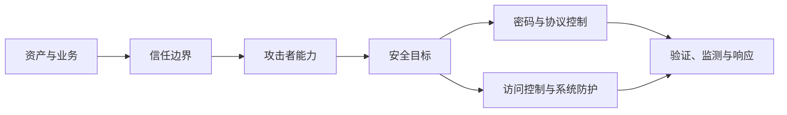

# 7.1 网络安全目标、威胁与加密模型

网络安全不是单一技术，而是在明确资产、攻击者能力和信任边界后，对机密性、完整性、可用性、认证与授权等目标作出组合保证。本节从主动/被动攻击与一般加密模型建立全章语言。

> [!abstract] 一句话主线
> **先说明保护什么、对抗谁、允许谁做什么，再选择密码、协议和系统控制；没有威胁模型就无法判断一个方案是否“安全”。**

> [!tip] 阅读方式
> 先读“核心结构”辨认资产、信任边界、安全目标与失败条件，再在“详细展开”中核对教材图、算法原理和协议历史。

## 核心结构

### 从威胁到控制

| 安全目标 | 要回答的问题 | 典型破坏方式 |
| --- | --- | --- |
| 机密性 | 未授权者能否读到内容或敏感元数据？ | 窃听、流量分析、密钥泄露 |
| 完整性 | 数据或状态是否被未授权修改？ | 篡改、插入、删除、重放 |
| 可用性 | 合法主体能否及时获得服务？ | DoS、资源耗尽、故障 |
| 认证 | 对端或消息来源是否可信？ | 冒充、中间人、凭据盗用 |
| 授权 | 已认证主体允许执行什么？ | 越权、权限提升 |
| 不可否认性 | 能否向第三方证明某项行为？ | 否认签署或提交行为 |

> [!warning] 加密不是完整的安全方案
> 加密可提供特定条件下的机密性或完整性，却不能自动解决恶意终端、错误授权、实现漏洞、密钥泄露、可用性和社会工程问题。

## 详细展开

本节讨论计算机网络面临的安全性威胁、安全的内容和一般的数据加密模型。

## 7.1.1 计算机网络面临的安全性威胁

计算机网络的通信面临两大类威胁，即被动攻击和主动攻击（如图 7-1 所示）。
![[Pasted image 20260716163939.png]]
*图 7-1 对网络的被动攻击和主动攻击*

被动攻击是指攻击者从网络上窃听他人的通信内容。通常把这类攻击称为**截获**。在被动攻击中，攻击者只是观察和分析某一个协议数据单元 PDU（这里使用 PDU 这一名词是考虑到所涉及的可能是不同的层次）而不干扰信息流。即使这些数据对攻击者来说是不易理解的，他也可通过观察 PDU 的协议控制信息部分，了解正在通信的协议实体的地址和身份，研究 PDU 的长度和传输的频度，从而了解所交换的数据的某种性质。这种被动攻击又称为**流量分析** (traffic analysis)。在战争时期，通过分析某处出现大量异常的通信量，往往可以发现敌方指挥所的位置。

主动攻击有如下几种最常见的方式：
**(1) 篡改** 攻击者故意篡改网络上传送的报文。这里也包括彻底中断传送的报文，甚至是把完全伪造的报文传送给接收方。这种攻击方式有时也称为更改报文流。
**(2) 恶意程序** 恶意程序 (rogue program) 种类繁多，对网络安全威胁较大的主要有以下几种：

*   **计算机病毒** (computer virus)，一种会“传染”其他程序的程序，“传染”是通过修改其他程序来把自身或自己的变种复制进去而完成的。
*   **计算机蠕虫** (computer worm)，一种通过网络通信功能将自身从一个节点发送到另一个节点并自动启动运行的程序。
*   **特洛伊木马** (Trojan horse)，一种程序，它执行的功能并非其所声称的功能而是某种恶意功能。如一个编译程序除了执行编译任务以外，还把用户的源程序偷偷地复制下来，那么这种编译程序就是一种特洛伊木马。计算机病毒有时也以特洛伊木马的形式出现。
*   **逻辑炸弹** (logic bomb)，一种当运行环境满足某种特定条件时执行其他特殊功能的程序。如一个编辑程序，平时运行得很好，但当系统时间为 13 日又为星期五时，它会删去系统中所有的文件，这种程序就是一种逻辑炸弹。
*   **后门入侵** (backdoor knocking)，是指利用系统实现中的漏洞通过网络入侵系统。就像一个盗贼在夜晚试图闯入民宅，如果某家住户的房门有缺陷，盗贼就能乘虚而入。索尼游戏网络 (PlayStation Network) 在 2011 年被入侵，导致 7700 万用户的个人信息，诸如姓名、生日、E-mail 地址、密码等被盗 [W-BACKD]。
*   **流氓软件**，一种未经用户允许就在用户计算机上安装运行并损害用户利益的软件，其典型特征是：强制安装、难以卸载、浏览器劫持、广告弹出、恶意收集用户信息、恶意卸载、恶意捆绑等。现在流氓软件的泛滥程度已超过了各种计算机病毒，成为互联网上最大的公害。流氓软件的名字一般都很吸引人，如某某卫士、某某搜霸等，因此要特别小心。

上面所说的计算机病毒是狭义的，也有人把所有的恶意程序泛指为计算机病毒。例如 1988 年 10 月 “Morris 病毒” 入侵美国互联网，舆论说该事件是 “计算机病毒入侵美国计算机网”，而计算机安全专家却称之为 “互联网蠕虫事件”。

**(3) 拒绝服务 DoS** (Denial of Service) 指攻击者向互联网上的某个服务器不停地发送大量分组，使该服务器无法提供正常服务，甚至完全瘫痪。2000 年 2 月 7 日至 9 日美国几个著名网站遭黑客 ① 袭击，使这些网站的服务器一直处于 “忙” 的状态，因而无法向发出请求的客户提供服务。这种攻击称为 **拒绝服务**。又如在 2014 年圣诞节，索尼游戏网 (PlayStation Network) 和微软游戏网 (Microsoft Xbox Live) 被黑客攻击后瘫痪，估计有 1.6 亿用户受到影响 [W-DOS]。

若从互联网上的成百上千个网站集中攻击一个网站，则称为**分布式拒绝服务 DDoS** (Distributed Denial of Service)。有时也把这种攻击称为**网络带宽攻击**或**连通性攻击**。

2018 年 2 月，6 日世界标准时间零时，亚太地区许多计算机同时向根服务器系统发动袭击，企图使之瘫痪。它们每秒发送的数据量相当于服务器每分钟要接收 75 万封电子邮件。结果至少有 6 个根服务器系统受到影响，两个破坏严重。有分析认为攻击来自韩国，但

  ① 注：黑客 (hacker) 是指精通计算机编程的高手，他们能够通过专门的技术手段进入某些据称是相当安全的计算机系统中。黑客一般可分为两大类，一类是蓄意搞破坏或盗窃别人计算机中数据信息的坏人，而另一类则是专门研究计算机系统安全性的好人。例如，银行发行的信用卡必须十分安全，但这种信用卡的安全性在公开发行之前却无从知晓。这时就要请专门研究计算机安全性的黑客对信用卡进行攻击实验。如果黑客在努力尝试后仍无法攻破，则可认为该信用卡至少在目前是相对安全的。

ICANN 不认为黑客一定是韩国人，他可以是任何地点的任何人，只不过是操纵了韩国的计算机而已。

还有其他类似的网络安全问题。例如，在使用以太网交换机的网络中，攻击者向某个以太网交换机发送大量的伪造源 MAC 地址的帧。以太网交换机收到这样的帧，就把这个假的源 MAC 地址写入交换表中（因为交换表中没有这个地址）。由于这种伪造的地址数量太大，因此很快就把交换表填满了，导致以太网交换机无法正常工作（称为**交换机中毒**）。

对于主动攻击，可以采取适当措施加以检测。但对于被动攻击，通常却是检测不出来的。根据这些特点，可得出计算机网络通信安全的目标如下：
1. 防止析出报文内容和流量分析。
2. 防止恶意程序。
3. 检测更改报文流和拒绝服务。

对付被动攻击可采用各种数据加密技术，而对付主动攻击，则需将加密技术与适当的鉴别技术相结合。

## 7.1.2 安全的计算机网络

人们一直希望能设计出一种安全的计算机网络，但不幸的是，网络的安全性是不可判定的 [DENN82]。目前安全协议的设计方面，主要是针对具体的攻击设计安全的通信协议。但如何保证所设计出的协议是安全的？这可以使用两种方法。一种是用形式化方法来证明，另一种是用经验来分析协议的安全性。形式化证明的方法是人们所希望的，但一般意义下的协议安全性也是不可判定的，只能针对某种特定类型的攻击来讨论其安全性。对于复杂的通信协议的安全性，形式化证明比较困难，所以主要采用人工分析的方法来找漏洞。对于简单的协议，可通过限制入侵者的操作（即假定入侵者不会进行某种攻击）来对一些特定情况进行形式化的证明，当然，这种方法有很大的局限性。

根据上一节所述的各种安全性威胁，不难看出，一个安全的计算机网络应设法达到以下四个目标：

**1. 机密性**

机密性（或私密性）就是只有信息的发送方和接收方才能懂得所发送信息的内容，而信息的截获者则看不懂所截获的信息。显然，机密性是网络安全通信最基本的要求，也是对被动攻击所必须具备的功能。通常可简称为**保密**。尽管计算机网络安全并不仅仅依靠机密性，但不能提供机密性的网络肯定是不安全的。为了使网络具有机密性，需要使用各种密码技术。

**2. 端点鉴别**

安全的计算机网络必须能够鉴别信息的发送方和接收方的真实身份。网络通信和面对面的通信差别很大。现在频繁发生的网络诈骗，在许多情况下，就是由于在网络上不能鉴别出对方的真实身份。当我们收到一封电子邮件时，发信人也可能并不是邮件上所署名的那个人。当我们在网上购物时，卖家也有可能是犯罪分子假冒的商家。不能解决这个问题，就不能认为网络是安全的。端点鉴别在对付主动攻击时是非常重要的。

**3. 信息的完整性**

即使能够确认发送方的身份是真实的，并且所发送的信息都是经过加密的，我们依然不能认为网络是安全的。还必须确认所收到的信息都是完整的，也就是信息的内容没有被篡改过。保证信息的完整性在应对主动攻击时也是必不可少的。信息的完整性和机密性是两个不同的概念。例如，商家向公众发布的商品广告当然不需要保密，但如果广告在网上传送时被人恶意删除或添加了一些内容，那么就可能对商家造成很大的损失。

实际上，信息的完整性与端点鉴别往往是不可分割的。假定你准确知道报文发送方的身份没有错（即通过了端点鉴别），但收到的报文却已被人篡改过（即信息不完整），那么这样的报文显然是没有用处的。因此，在谈到“鉴别”时，有时是同时包含了端点鉴别和报文的完整性。也就是说，既鉴别发送方的身份，又鉴别报文的完整性。

**4. 运行的安全性**

现在的机构与计算机网络的关系越密切，就越要重视计算机网络运行的安全性。上一节介绍的恶意程序和拒绝服务的攻击，即使没有窃取到任何有用的信息，也能够使受到攻击的计算机网络不能正常运行，甚至完全瘫痪。因此，确保计算机系统运行的安全性，也是非常重要的工作。对于一些要害部门，这点尤为重要。

访问控制 (access control) 对计算机系统的安全性非常重要。必须对访问网络的权限加以控制，并规定每个用户的访问权限。由于网络是个非常复杂的系统，其访问控制机制比操作系统的访问控制机制更复杂（尽管网络的访问控制机制是建立在操作系统的访问控制机制之上的），尤其在安全要求更高的**多级安全** (multilevel security) 情况下更是如此。

## 7.1.3 数据加密模型

一般的数据加密模型如图 7-2 所示。用户 A 向 B 发送明文 $X$，但通过加密算法 $E$ 运算后，就得出密文 $Y$。
![[Pasted image 20260716163954.png]]
*图 7-2 一般的数据加密模型*

图中所示的加密和解密的密钥 $K$ (key) 是一串秘密的字符串（即比特串）。公式 (7-1) 就是明文通过加密算法变成密文的一般表示方法。

Y = E_K(X) \tag{7-1}

在传送过程中可能出现明文的**截取者**（或攻击者、入侵者）。公式 (7-2) 表示接收端利用**解密算法** $D$ 运算和解密密钥 $K$，解出明文 $X$。解密算法是加密算法的逆运算。在进行解密运算时，如果不使用事先约定好的密钥就无法解出明文。

D_K(Y) = D_K(E_K(X)) = X \tag{7-2}

这里我们假定加密密钥和解密密钥都是一样的。但实际上它们可以是不一样的（即使不一样，这两个密钥也必然有某种相关性）。密钥通常由密钥中心提供。当密钥需要向远地传送时，一定要通过另一个安全信道。

**密码编码学** (cryptology) 是密码体制的设计学，而**密码分析学** (cryptanalysis) 则是在未知密钥的情况下从密文推演出明文或密钥的技术。密码编码学与密码分析学合起来即为**密码学** (cryptology)。

如果不论截取者获得了多少密文，但在密文中都没有足够的信息来唯一地确定出对应的明文，则这一密码体制称为**无条件安全的**，或称为**理论上是不可破的**。在无任何限制的条件下，目前几乎所有实用的密码体制均是可破的。因此，人们关心的是要研制出在**计算上**（而不是在理论上）**是不可破的密码体制**。如果一个密码体制中的密码，不能在一定时间内被可以使用的计算资源破译，则这一密码体制称为在**计算上是安全的**。

早在几千年前人类就已经有了通信保密的思想和方法。直到 1949 年，信息论创始人香农 (C. E. Shannon) 发表著名文章 [SHAN49]，论证了一般经典加密方法得到的密文几乎都是可破的。密码学的研究曾面临着严重的危机。但从 20 世纪 60 年代起，随着电子技术、计算技术的迅速发展以及结构代数、可计算性和计算复杂性理论等学科的研究，密码学又进入了一个新的发展时期。在 20 世纪 70 年代后期，美国的数据加密标准 DES (Data Encryption Standard) 和**公钥密码体制** (public key crypto-system，又称为公开密钥密码体制) 的出现，成为近代密码学发展史上的两个重要里程碑。

---

上一节：[[第七章 网络安全|本章 MOC]]　｜　下一节：[[7.2 对称密码与公钥密码]]　｜　章节入口：[[第七章 网络安全]]
