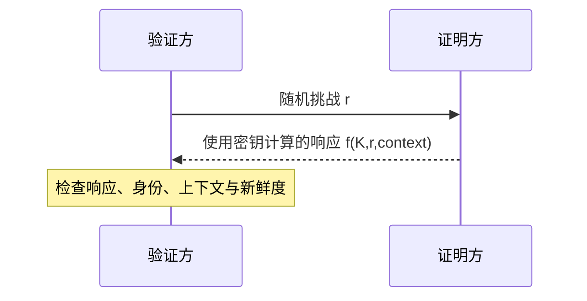

# 7.3 报文鉴别与实体鉴别

报文鉴别关心消息来源与完整性，实体鉴别关心通信对端当前是否确为所声称主体。散列、消息认证码、数字签名、随机数和挑战—响应分别提供不同性质，不能相互随意替代。

> [!abstract] 一句话主线
> **散列只产生摘要；MAC 依赖共享密钥验证消息；数字签名依赖私钥与可信公钥；挑战—响应再用新鲜度抵抗录制后的重放。**

> [!tip] 阅读方式
> 先读“核心结构”辨认资产、信任边界、安全目标与失败条件，再在“详细展开”中核对教材图、算法原理和协议历史。

## 核心结构

### 三类完整性机制

| 机制 | 使用秘密 | 能验证什么 | 能否向第三方证明 |
| --- | --- | --- | --- |
| 普通散列 | 无 | 仅比较摘要，不能证明来源 | 否 |
| MAC / HMAC | 通信方共享密钥 | 完整性与共享密钥持有者来源 | 通常不能区分共享密钥双方 |
| 数字签名 | 签名者私钥 | 完整性与签名者身份绑定 | 在证据与密钥管理条件满足时可以 |

### 挑战—响应

> [!warning] 摘要不等于签名
> 仅把散列值附在报文后，攻击者可以同时替换报文和散列值。要获得来源鉴别，摘要必须进入 MAC、数字签名或其他受密钥保护的构造。

> [!note] 数字签名的教材表达
> “用私钥加密、用公钥解密”只是帮助理解早期 RSA 数学关系的简化说法。标准签名方案有专门的编码、散列与验证过程，不能把任意公钥加密操作倒过来当作安全签名。

## 详细展开

## 7.3.1 报文鉴别

在网络的应用中，**鉴别** (authentication) 是网络安全中一个很重要的问题。鉴别和加密是不相同的概念。鉴别的内容有二。一是要鉴别发信者，即验证通信的对方的确是自己所要通信的对象，而不是其他的冒充者。这就是**实体鉴别**。实体可以是发信的人，也可以是一个进程（客户或服务器）。因此这也常称为**端点鉴别**。二是要鉴别报文的完整性，即对方所传送的报文没有被他人篡改过。至于报文是否需要加密，则是与“鉴别”性质不同的问题。有的报文需要加密（这要另找措施），但许多报文并不需要加密。

请注意，鉴别与**授权** (authorization) 也是不同的概念。授权涉及的问题是：所进行的过程是否被允许（如是否可以对某文件进行读或写）。

不过有时常用**报文鉴别**一词包含上述鉴别的两个内容，既鉴别报文的发送者，也鉴别报文的完整性。

下面分别讨论报文鉴别与实体鉴别的特点。

**1. 用数字签名进行鉴别（原理）**

我们知道，书信或文件可根据亲笔签名或印章来鉴别其真实性。但在计算机网络中传送的报文，则可使用数字签名来鉴别。下面就介绍数字签名的原理。

为了进行**数字签名**，A 用其私钥 $SK_A$ 对报文 $X$ 进行 $D$ 运算（如图 7-4 所示）。$D$ 运算本来叫作解密运算。可是，还没有加密怎么就进行解密呢？其实 $D$ 运算只是把报文变换为某种不可读的密文（因此有时也说成 A 用其私钥对报文加密，但这样说不准确）。在图 7-4 中我们使用“$D$ 运算”而不是“解密运算”，就是为了避免产生这种误解。A 把经过 $D$ 运算得到的密文传送给 B。B 为了核实签名，用 A 的公钥进行 $E$ 运算，还原出明文 $X$。请注意，任何人用 A 的公钥 $PK_A$ 进行 $E$ 运算后都可以得出 A 发送的明文。可见图 7-4 所示的通信方式并非为了保密，而是为了进行签名和核实签名，即确认此明文的确是 A 发送的。
![[Pasted image 20260716164015.png]]
*图 7-4 用数字签名进行鉴别*

下面讨论一下为什么数字签名具有鉴别报文的功能。

因为除 A 外没有人持有 A 的私钥 $SK_A$，所以除 A 外没有别人能产生密文 $D_{SK_A}(X)$。这样，B 确信报文 $X$ 是 A 签名发送的。这就鉴别了报文的发送者。同理，其他人如果篡改过报文，但由于无法得到 A 的私钥 $SK_A$ 对篡改后的报文进行 $D$ 运算，那么 B 对收到的报文进行核实签名的 $E$ 运算后，将会得出不可读的明文，因而不会被欺骗。这样就保证了报文的完整性。

数字签名还有另一功能，就是发送者事后不能抵赖对报文的签名。这叫作**不可否认**。若 A 要抵赖曾发送报文给 B，B 可把 $X$ 及 $D_{SK_A}(X)$ 出示给进行公证的第三者。第三者很容易用 $PK_A$ 去证实 A 确实发送 $X$ 给 B。

以上这三项功能的关键都在于没有其他人能够持有 A 的私钥 $SK_A$。

但数字签名仅对报文进行了签名，对报文 $X$ 本身却未保密。因为截获到密文 $D_{SK_A}(X)$ 并知道发送者身份的任何人都可用某种手段获得了发送者的公钥 $PK_A$，就能解出报文的内容。如果用图 7-5 所示的方法，就可同时实现保密通信和数字签名。图中 $SK_A$ 和 $SK_B$ 分别为 A 和 B 的私钥，而 $PK_A$ 和 $PK_B$ 分别为 A 和 B 的公钥。请注意，在许多情况下，我们往往强调的是使用何种密钥进行运算，这时的表达方式可简单些。例如，“用 A 的私钥对明文 $X$ 进行签名”可记为 $SK_A(X)$。若“再用 B 的公钥对此签名进行加密”，则可记为 $PK_B(SK_A(X))$，而不必深究使用的是 $D$ 运算还是 $E$ 运算。
![[Pasted image 20260716164022.png]]
*图 7-5 可保证机密性的数字签名*

如图 7-5 所示的可保证机密性的数字签名方法，虽然在理论上是正确的，但很难用于现实生活中。因此这一节的小标题后有“原理”二字。这是因为要对报文（可能很长的报文）先后要进行两次 $D$ 运算和两次 $E$ 运算，这种运算量太大，要花费非常多的计算机 CPU 时间，在很多情况下是无法令人接受的。因此目前对网络上传送的大量报文，普遍都使用开销小得多的对称密钥加密。要实现数字签名当然必须使用公钥密码，但一定要设法减小公钥密码算法的开销。这就要使用后面几个小节所讨论的密码散列函数和报文鉴别码。

**2. 密码散列函数**

**散列函数**（又称为杂凑函数，或哈希函数）在计算机领域中使用得很广泛。密码学对散列函数有非常高的要求，因此符合密码学要求的散列函数又常称为**密码散列函数** (cryptographic hash function)。以后在不致产生错误概念时，我们也常把密码散列函数简称为散列函数。具体说来，密码散列函数 $H(X)$ 应具有以下四个特点：
1. 虽然散列函数的输入报文 $X$ 的长度不受限制，但计算出的结果 $H(X)$ 的长度则应是较短的和固定的。散列函数的输出 $H(X)$ 又称为**散列值**，或散列。散列函数采用确定算法，因此相同的输入必定得出相同的输出。虽然密码散列函数相当复杂，但利用计算机，散列函数的运算还是相当快的。
2. 散列函数的输入和输出的关系是**多对一**的。若散列值 $H(X)$ 的长度为 128 位，那么输出散列值只有 $2^{128}$ 个有限多的可能值（$2^{128}$ 与 IPv6 的地址数一样大，是个很大的数值）。然而我们的输入报文 $X$ 却有无限多的取值。可见必然会出现不同输入却产生相同输出的碰撞现象。精心挑选的密码散列函数应当非常不易发生碰撞，即应具有很好的**抗碰撞性**。
3. 若只给出散列值 $H(X)$，在预期计算资源内应难以找到一个对应的输入 $X$。这称为**原像抗性**；“单向”表达的是计算上不可行，而不是数学上不存在输入（如图 7-6 所示）。
![[Pasted image 20260716164029.png]]
*图 7-6 密码散列函数是单向的*

上述特点的另一种表述方法是：
若已知 $X$ 和 $H(X)$，则没有人能够找到 $Y$ ($Y \neq X$)，使得 $H(Y) = H(X)$。

但下面我们要讲到，关于这方面的研究，后来已有了一些新的进展。
4. 好的密码散列函数还具有这样一些特性：散列函数输出的每一个比特，都与输入的每一个比特有关；哪怕仅改动输入的一个比特，输出也会相差极大；散列函数的运算包括许多非线性运算。

通过许多学者的不断努力，已经设计出一些实用的密码散列函数（或称为散列算法），其中最出名的是 **MD5** 和 **SHA-1**。MD 就是 Message Digest 的缩写，意思是**报文摘要**。MD5 是报文摘要的第 5 个版本。

**报文摘要算法 MD5** 公布于 RFC 1321（1991 年），并获得了非常广泛的应用。MD5 的设计者 Rivest 曾提出一个猜想，即根据给定的 MD5 报文摘要代码，要找出一个与原来报文有相同报文摘要的另一报文，其难度在计算上几乎是不可能的。但在 2004 年，中国学者王小云 ① 发表了轰动世界的密码学论文，证明可以用系统的方法找出一对报文，这对报文具有相同的 MD5 报文摘要 [W-WANG]，而这仅需 15 分钟，不到 1 小时。于是，MD5 的安全性就产生了动摇。随后，又有许多学者开发了对 MD5 实际的攻击。于是 MD5 最终被另一种叫作**安全散列算法 SHA** (Secure Hash Algorithm) 的标准所取代。

下面仍以 MD5 为例介绍经典迭代散列函数的分组、填充和压缩过程。MD5 具有历史教学价值，但 SHA-2 不能简单理解为“由 MD5 发展而来”；学习现代散列函数时，应重点区分抗原像、抗第二原像、抗碰撞等安全性质以及不同构造的适用边界。

MD5 算法的大致过程如下：
1. 先把任意长的报文按 $2^{64}$ 计算其余数（64 位），追加在报文的后面。
2. 在报文和余数之间填充 1~512 位，使得填充后的总长度是 512 的整数倍。填充的首位是 1，后面都是 0。
3. 把追加和填充后的报文分割为许多 512 位的数据块，每个 512 位的报文数据再分成 4 个 128 位的数据块依次送到不同的散列函数进行 4 轮计算。每一轮又都按 32 位的小数据块进行复杂的运算。一直到最后计算出 MD5 报文摘要代码（128 位）。

这样得出的 MD5 报文摘要代码中的每一位都与原来报文中的每一位有关。由此可见，像 MD5 这样的密码散列函数实际上已是个相当复杂的算法，而不是简单的函数了。

SHA-1 的散列值为 160 位，内部也按 512 位数据块处理。它在历史上用于替代部分 MD5 场景，但输出更长并不等于今天仍满足抗碰撞要求；这里保留其结构用于理解散列算法演进。

但 SHA-1 后来也被证明其实际安全性并未达到设计要求，并且也曾被王小云教授的研究团队攻破。谷歌也宣布了攻破 SHA-1 的消息。现在 SHA-1 已被另外的两个版本 **SHA-2** [RFC 6234] 和 **SHA-3** [W-SHA3] 所替代。SHA-2 和 SHA-3 都有好几种变型。前者有 SHA-224、SHA-256、SHA-384 和 SHA-512，后者有 SHA3-224、SHA3-256、SHA3-384 和 SHA3-512。在上面名称最后的 3 位数字表示散列的位数。这里需要指出，SHA-3 采用了与 SHA-2 完全不同的散列函数。现在许多组织都已纷纷宣布停用 SHA-1。例如，微软于 2017 年 1 月 1 日起停止支持 SHA-1 证书，而以前签发的 SHA-1 证书也必须更换为 SHA-2 证书。

请注意，“碰撞攻击”与“第二原像攻击”不是同一安全目标：前者寻找任意一对散列相同的不同报文，后者是在给定报文 $X$ 后寻找另一报文 $Y$ 使二者散列相同。MD5 与 SHA-1 的实际碰撞能力已经不足，针对特定格式还可能构造选择前缀碰撞；这不等于所有第二原像问题都同样容易，但已足以使它们不再适合数字签名和新设计中的完整性保护。

**3. 用报文鉴别码实现报文鉴别**

下面进一步讨论怎样使用散列函数来实现报文鉴别。
下面给出的三个简单步骤，给出鉴别报文的初步概念。
1. 用户 A 首先根据自己的明文 $X$ 计算出散列 $H(X)$（例如，使用 MD5）。为简单起见，我们把得出的散列 $H(X)$ 记为 $H$。
2. 用户 A 把散列 $H$ 拼接在明文 $X$ 的后面，生成了扩展的报文 $(X, H)$，然后发送给 B。
3. 用户 B 收到了这个扩展的报文 $(X, H)$。因为散列的长度 $H$ 是早已知道的固定值，因此很容易把收到的散列 $H$ 和明文 $X$ 分开。B 通过散列函数的运算，计算出所收到的明文 $X$ 的散列 $H(X)$。若 $H(X) = H$，则 B 就认为所收到的明文是 A 发送过来的。

但上述做法实际上是**不可行的**。设想某个入侵者创建了一个伪造的报文 $M$，然后也用同样的方法计算出其散列 $H(M)$，并且冒充 A 把拼接有散列的扩展报文发送给 B。B 收到扩展的报文 $(M, H(M))$ 后，按照上面步骤 (3) 的方法进行验证，发现一切都是正常的，就会误认为所收到的伪造报文就是 A 发送的。

因此，必须设法对上述的攻击进行防范。解决的办法可以是：A 把双方共享的**密钥** $K$（$K$ 就是一串不太长的字符串）拼接到报文 $X$ 后，进行散列运算（如图 7-7 所示）。散列运算得出的结果为固定长度的 $H(X + K)$，称为**报文鉴别码 MAC** (Message Authentication Code)。请注意：局域网中使用的媒体接入控制 MAC 正好也使用这三个字母，因此在看到缩写词 MAC 时应注意上下文。A 把报文鉴别码 MAC 拼接在报文 $X$ 后面，得到扩展的报文，发送给 B。我们注意到，共享密钥 $K$ 并没有出现在网上传送的扩展的报文中。

B 收到扩展的报文后，把报文鉴别码 MAC 与报文 $X$ 进行分离。B 再用同样的密钥 $K$ 与报文 $X$ 拼接，进行散列运算，把得出的结果 $H(X + K)$ 与分离出的报文鉴别码 MAC 进行比较。如相等，就可确认收到的报文 $X$ 的确是 A 发送的。只要入侵者不掌握密钥 $K$，就无法伪造 A 的报文鉴别码 MAC，因而无法伪造 A 发送的报文。像这样的报文鉴别码称为**数字签名**，或数字指纹。图 7-7 所示的过程就是 A 对报文进行了签名，而 B 对报文进行了鉴别。
![[Pasted image 20260716164038.png]]
*图 7-7 用报文鉴别码 MAC 鉴别报文*

图 7-7 所示的鉴别过程并没有执行加密算法，只是在计算散列值时在报文后面拼接了密钥，因此这种鉴别报文的方法消耗的计算资源很少，但却能有效地保护报文的完整性。

在许多有关鉴别的文献中，常常看到在 MAC 前面加上一个 H 的写法，即 **HMAC** (Hashed MAC)。MAC 与 HMAC 的区别如图 7-8 所示 [PETE12，第 646 页]。前面图 7-7 所示的 MAC 实际上就是 HMAC。计算 HMAC 是规定把密钥 $K$ 拼接在明文后面，然后使用密码散列算法对其进行运算，得出的散列值就是 MAC。但在计算 MAC 时则不一定这样做。首先，密钥 $K$ 不一定非拼接在明文的后面，只要把密钥 $K$ 作为一个计算 MAC 的参数即可。其次，可以有多种计算 MAC 的算法，不一定非要用非常严格的密码散列算法。在 RFC 2104 中，对各种不同情况下 HMAC 的计算方法都有详细的规定。在本书中，为了方便，对 MAC 和 HMAC 可视作同义词。
![[Pasted image 20260716164046.png]]
*图 7-8 MAC 与 HMAC 的区别*

上述鉴别报文的方法还有一些问题有待解决。例如，采用怎样安全有效的方法来分发通信双方共享的密钥 $K$？另一种可行的方法是采用公钥系统。我们用图 7-9 来说明。
![[Pasted image 20260716164052.png]]
*图 7-9 使用已签名的报文鉴别码对报文鉴别*

用户 A 对报文 $X$ 进行散列运算，得出固定长度的散列 $H(X)$。用自己的私钥对 $H(X)$ 进行 $D$ 运算（也可以说成是用私钥进行加密），得出已签名的**非固定长度**的报文鉴别码 MAC。

请注意，这里没有对报文 $X$ 进行加密，而是对很短的散列 $H(X)$ 进行 $D$ 运算，因此这种运算仍然是很快的。A 把已签名的非固定长度的报文鉴别码 MAC，拼接在报文 $X$ 后面，构成扩展的报文发送给 B。

B 收到扩展的报文后，先进行报文分离。虽然 B 不知道已签名的报文鉴别码的长度，但由于报文 $X$ 是明文，其结束处可以设有标记，因此分离出 MAC 不困难。分离后，B 对报文 $X$ 进行散列函数运算，同时用 A 的公钥对分离出的已签名的报文鉴别码 MAC 进行 $E$ 运算（也可以说成是用公钥进行解密）。最后对这两个运算结果 $H(X)$ 进行比较。如相等，就说明一切正确。由于入侵者没有 A 的私钥，因此不可能伪造 A 发出的报文。这里我们假定 B 事先知道 A 的公钥。

不难看出，采用这种方法得到的扩展的报文，不仅是不可伪造的，也是不可否认的。图 7-9 所示的过程，可简称为：“A 用自己的私钥进行签名，B 用 A 的公钥进行鉴别”。

## 7.3.2 实体鉴别

报文鉴别与实体鉴别不同。报文鉴别是对每一个收到的报文都要鉴别报文的发送者，而实体鉴别是在系统接入的全部持续时间内对和自己通信的对方实体只需验证一次。

最简单的实体鉴别过程如图 7-10 所示。A 向远端的 B 发送带有自己身份 A（例如，A 的姓名）和口令的报文，并且使用双方约定好的共享对称密钥 $K_{AB}$ 进行加密。B 收到此报文后，用共享对称密钥 $K_{AB}$ 进行解密，从而鉴别了实体 A 的身份。
![[Pasted image 20260716164101.png]]
*图 7-10 仅使用对称密钥传送鉴别实体身份的报文*

然而这种简单的鉴别方法具有明显的漏洞。例如，入侵者 C 可以从网络上截获 A 发给 B 的报文，C **并不需要破译这个报文**（因为破译可能很费时间），而是直接把这个由 A 加密的报文发送给 B，使 B 误认为 C 就是 A；然后 B 就向伪装成 A 的 C 发送许多本来应当发给 A 的报文。这就叫作**重放攻击** (replay attack)。C 甚至还可以截获 A 的 IP 地址，然后把 A 的 IP 地址冒充为自己的 IP 地址（这叫**IP 欺骗**），使 B 更加容易受骗。

为了对付重放攻击，可以使用**不重数** (nonce)。不重数就是一个不重复使用的大随机数，即“一次一数”。在鉴别过程中不重数可以使 B 能够把重复的鉴别请求和新的鉴别请求区分开。图 7-11 给出了这个过程。
![[Pasted image 20260716164109.png]]
*图 7-11 使用不重数进行鉴别*

在图 7-11 中，A 首先用明文发送其身份 A 和一个不重数 $R_A$ 给 B。接着，B 响应 A 的查问，用共享的密钥 $K_{AB}$ 对 $R_A$ 加密后发回给 A，同时也给出了自己的不重数 $R_B$。最后，A 再响应 B 的查问，用共享的密钥 $K_{AB}$ 对 $R_B$ 加密后发回给 B。这里很重要的一点是 A 和 B 对不同的会话必须使用不同的不重数集。由于不重数不能重复使用，所以 C 在进行重放攻击时无法重复使用所截获的不重数。

在使用公钥密码体制时，可以对不重数进行签名鉴别。例如在图 7-11 中，B 用其私钥对不重数 $R_A$ 进行签名后发回给 A。A 用 B 的公钥核实签名，如能得出自己原来发送的不重数 $R_A$，就核实了和自己通信的对方的确是 B。同样，A 也用自己的私钥对不重数 $R_B$ 进行签名后发送给 B。B 用 A 的公钥核实签名，鉴别了 A 的身份。

公钥密码体制虽然不必在互相通信的用户之间秘密地分配共享密钥，但仍受到攻击的可能。让我们看下面的例子。

C 冒充是 A，发送报文给 B，说：“我是 A”。
B 选择一个不重数 $R_B$，发送给 A，但被 C 截获了。
C 用自己的私钥 $SK_C$ 冒充是 A 的私钥，对 $R_B$ 加密，并发送给 B。
B 向 A 发送报文，要求对方把解密用的公钥发送过来，但这报文也被 C 截获了。
C 把自己的公钥 $PK_C$ 冒充是 A 的公钥发送给 B。
B 用收到的公钥 $PK_C$ 对收到的加密的 $R_B$ 进行解密，其结果当然正确。于是 B 相信通信的对方是 A，接着就向 A 发送许多敏感数据，但都被 C 截获了。

然而上述这种欺骗手段不够高明，因为 B 只要打电话询问一下 A 就能戳穿骗局，因为 A 根本没有和 B 进行通信。但下面的“**中间人攻击**” (man-in-the-middle attack) 就更加具有欺骗性。图 7-12 是“中间人攻击”的示意图。
![[Pasted image 20260716164118.png]]
*图 7-12 中间人攻击*

从图 7-12 可看出，A 想和 B 通信，向 B 发送“我是 A”的报文，并给出了自己的身份。这个报文被“中间人”C 截获，C 把这个报文原封不动地转发给 B。B 选择一个不重数 $R_B$ 发送给 A，但同样被 C 截获了。

中间人 C 用自己的私钥 $SK_C$ 对 $R_B$ 加密后发回给 B，使 B 误以为是 A 发来的。A 收到 $R_B$ 后也用自己的私钥 $SK_A$ 对 $R_B$ 加密后发回给 B，但中途被 C 截获并丢弃。B 向 A 索取其公钥，这个报文被 C 截获后转发给 A。

C 把自己的公钥 $PK_C$ 冒充是 A 的公钥发送给 B，而 C 也截获到 A 发送给 B 的公钥 $PK_A$。B 用收到的公钥 $PK_C$（以为是 A 的）对数据 DATA 加密，并发送给 A。C 截获后用自已的私钥 $SK_C$ 解密，复制一份留下，然后再用 A 的公钥 $PK_A$ 对数据 DATA 加密后发送给 A。

A 收到数据后，用自己的私钥 $SK_A$ 解密，以为和 B 进行了保密通信。其实，B 发送给 A 的加密数据已被中间人 C 截获并解密了一份，但 A 和 B 却都不知道。

由此可见，公钥的分配以及认证公钥的真实性也是一个非常重要的问题。关于这点我们在后面（7.4.2 节）还要讨论。

---

上一节：[[7.2 对称密码与公钥密码]]　｜　下一节：[[7.4 密钥分配与公钥基础设施]]　｜　章节入口：[[第七章 网络安全]]
