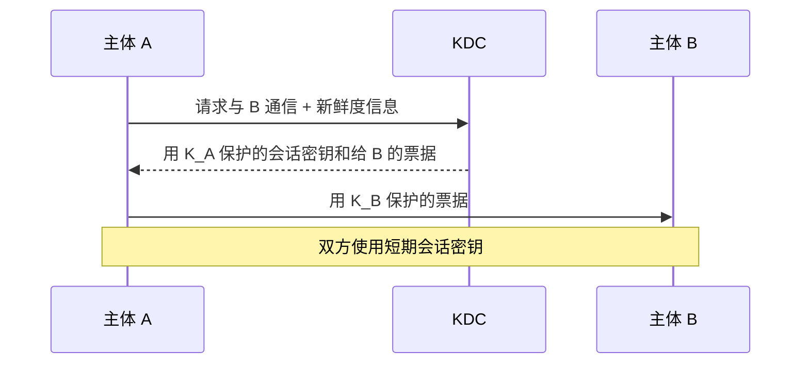
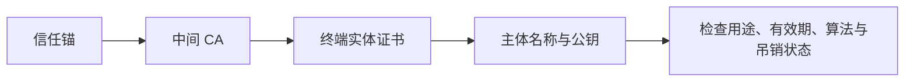

# 7.4 密钥分配与公钥基础设施

密码算法公开后，安全性集中到密钥生命周期：生成、分发、存储、轮换、吊销和销毁。KDC 用受信中心分配对称会话密钥；PKI 用证书把主体身份与公钥绑定，并通过信任链验证。

> [!abstract] 一句话主线
> **KDC 让每个主体与中心共享长期密钥，再签发短期会话密钥；PKI 让 CA 签署公钥绑定，验证者沿信任链检查身份、用途、有效期和吊销状态。**

> [!tip] 阅读方式
> 先读“核心结构”辨认资产、信任边界、安全目标与失败条件，再在“详细展开”中核对教材图、算法原理和协议历史。

## 核心结构

### KDC 会话密钥分配

### 证书验证不是只看“有签名”

| 模型 | 主要信任假设 | 主要风险 |
| --- | --- | --- |
| KDC | 中心在线、可信且长期密钥安全 | 单点故障、中心泄露、重放 |
| PKI / CA | 信任锚和签发流程可信 | 错误签发、私钥泄露、验证不完整 |
| 信任网 | 用户正确判断第三方背书 | 信任路径语义不一致、管理复杂 |

> [!important] 密钥管理大于密钥分发
> 会话建立只是生命周期的一部分；还必须考虑随机数质量、最小权限、硬件/软件存储、轮换、备份、撤销、审计和销毁。

## 详细展开

由于密码算法是公开的，网络的安全性就完全基于密钥的安全保护上。因此在密码学中出现了一个重要的分支——**密钥管理**。密钥管理包括：密钥的产生、分配、注入、验证和使用。本节只讨论密钥的分配。

**密钥分配**（或密钥分发）是密钥管理中最大的问题。密钥必须通过最安全的通路进行分配。例如，可以派非常可靠的信使携带密钥分配给互相通信的各用户。这种方法称为**网外分配方式**。但随着用户的增多和网络流量的增大，密钥更换频繁（密钥必须定期更换才能做到可靠），派信使的办法已不再适用，而应采用**网内分配方式**，即对密钥自动分配。

## 7.4.1 对称密钥的分配

对称密钥分配存在以下两个问题。

第一，如果 $n$ 个人中的每一个需要和其他 $n-1$ 个人通信，就需要 $n(n-1)$ 个密钥。但每两人共享一个密钥，因此密钥数是 $n(n-1)/2$。这常称为 **$n^2$ 问题**。如果 $n$ 是个很大的数，所需要的密钥数量就非常大。

第二，通信的双方怎样才能安全地得到共享的密钥呢？正是因为网络不安全，所以才需要使用加密技术。但密钥又需要怎样传送呢？

一种经典的对称密钥分配方式是设置**密钥分配中心 KDC** (Key Distribution Center)。KDC 是参与者共同信任的第三方，为通信实体签发具有期限和用途范围的会话密钥；“会话密钥”不等于密码学上的一次一密，也不必严格只加密一个报文。在图 7-13 中，用户 A、B 预先分别与 KDC 共享主密钥 $K_A$、$K_B$，再通过三个步骤取得供 A、B 会话使用的密钥。
![[Pasted image 20260716164126.png]]
*图 7-13 KDC 对会话密钥的分配*

❶ 用户 A 向密钥分配中心 KDC 发送时用明文，说明想和用户 B 通信。在明文中给出 A 和 B 在 KDC 登记的身份。

❷ KDC 用随机数产生“一次一密”的会话密钥 $K_{AB}$ 供 A 和 B 的这次会话使用，然后向 A 发送回答报文。这个回答报文用 A 的密钥 $K_A$ 加密。这个报文中包含这次会话使用的密钥 $K_{AB}$ 和请 A 转给 B 的一个**票据** (ticket) ❶。该票据包括 A 和 B 在 KDC 登记的身份，以及这次会话将要使用的密钥 $K_{AB}$。票据用 B 的密钥 $K_B$ 加密，A 无法知道此票据的内容，因为 A 没有 B 的密钥 $K_B$，当然 A 也不需要知道此票据的内容。

❸ 当 B 收到 A 转来的票据并使用自己的密钥 $K_B$ 解密后，就知道 A 要和他通信，同时也知道 KDC 为这次和 A 通信所分配的会话密钥 $K_{AB}$。

此后，A 和 B 就可使用会话密钥 $K_{AB}$ 进行这次通信了。

请注意，在网络上传送密钥时，都是经过加密的。解密用的密钥都不在网上传送。

KDC 还可在报文中加入时间戳，以防止报文的截取者利用以前记录下的报文进行重放攻击。会话密钥 $K_{AB}$ 是一次性的，因此机密性较高。而 KDC 分配给用户的密钥 $K_A$ 和 $K_B$，都应定期更换，以减少攻击者破译密钥的机会。

目前最出名的对称密钥分配协议是 **Kerberos V5** ❷ [RFC 4120, 4121，建议标准]，是美国麻省理工学院 (MIT) 开发的。Kerberos 既是鉴别协议，同时也是 KDC，它已经变得很普及。Kerberos 使用比 DES 更加安全的高级加密标准 AES 进行加密。下面用图 7-14 介绍 Kerberos V4 的大致工作过程（其原理和 V5 大体一样，但稍简单些）。
![[Pasted image 20260716164137.png]]
*图 7-14 Kerberos 的工作原理*

Kerberos 使用两个服务器：**鉴别服务器 AS** (Authentication Server)、**票据授予服务器 TGS** (Ticket-Granting Server)。Kerberos 只用于客户与服务器之间的鉴别，而不用于人对人的鉴别。在图 7-14 中，A 是请求服务的客户，而 B 是被请求的服务器。A 通过 Kerberos 向 B 请求服务。Kerberos 需要通过以下六个步骤鉴别的确 A（而不是其他人冒充 A）向 B 请求服务后，才向 A 和 B 分配会话使用的密钥。下面简单解释各步骤。

❶ A 用明文（包括登记的身份）向鉴别服务器 AS 表明自己的身份。AS 就是 KDC，它掌握各实体登记的身份和相应的口令。AS 对 A 的身份进行验证。只有验证结果正确，才允许 A 和票据授予服务器 TGS 进行联系。

❷ 鉴别服务器 AS 向 A 发送用 A 的对称密钥 $K_A$ 加密的报文，这个报文包含 A 和 TGS 通信的会话密钥 $K_S$ 以及 AS 要发送给 TGS 的票据（这个票据是用 TGS 的对称密钥 $K_{TG}$ 加密的）。A 并不保存密钥 $K_A$，但当这个报文到达 A 时，A 就键入其口令。若口令正确，则该口令和适当的算法一起就能生成密钥 $K_A$。这个口令随即被销毁。密钥 $K_A$ 用来对 AS 发送过来的报文进行解密。这样就提取出会话密钥 $K_S$（这是 A 和 TGS 通信要使用的）以及要转发给 TGS 的票据（这是用密钥 $K_{TG}$ 加密的）。

❸ A 向 TGS 发送三项内容：
* 转发鉴别服务器 AS 发来的票据。
* 服务器 B 的名字。这表明 A 请求 B 的服务。请注意，现在 A 向 TGS 证明自己的身份并非通过键入口令（因为入侵者能够从网上截获明文口令），而是通过转发 AS 发出的票据（只有 A 才能提取出）。票据是加密的，入侵者伪造不了。
* 用 $K_S$ 加密的时间戳 $T$。它用来防止入侵者的重放攻击。

❹ TGS 发送两个票据，每一个都包含 A 和 B 通信的会话密钥 $K_{AB}$。给 A 的票据用 $K_S$ 加密；给 B 的票据用 B 的密钥 $K_B$ 加密。请注意，现在入侵者不能提取 $K_{AB}$，因为不知道 $K_S$ 和 $K_B$。入侵者也不能重放步骤 ❸，因为入侵者不能把时间戳更换为一个新的（因为不知道 $K_S$）。如果入侵者在时间戳到期之前，非常迅速地发送步骤 ❸ 的报文，那么对 TGS 发送过来的两个票据仍然不能解密。

❺ A 向 B 转发 TGS 发来的票据，同时发送用 $K_{AB}$ 加密的时间戳 $T$。

❻ B 把时间戳 $T$ 加 1 来证实收到了票据。B 向 A 发送的报文用密钥 $K_{AB}$ 加密。

以后，A 和 B 就使用 TGS 给出的话会密钥 $K_{AB}$ 进行通信。

顺便指出，Kerberos 要求所有使用 Kerberos 的主机必须在时钟上进行“松散的”同步。所谓“松散的”同步是要求所有主机的时钟误差不能太大，例如，不能超过 5 分钟的数量级。这个要求是为了防止重放攻击。TGS 发出的票据都设置较短的有效期。超过有效期的票据就作废了。因此入侵者即使截获了某个票据，也不能长期保留用来进行以后的重放攻击。

## 7.4.2 公钥的分配

在公钥密码体制中，公钥的分配方法并不简单。本节就讨论这个问题。

我们不妨先假定大家都各自保存有自己的私钥，而把各自的公钥发布在网上。假定 A 和 B 都是公司。有个捣乱者给 A 发送邮件，声称自己是 B，要购买 A 生产的设备，货到付款，并给出了 B 的收货地址。邮件中还附上“B 的公钥”（其实是捣乱者的公钥）。最后用捣乱者的私钥对邮件进行了签名。A 收到邮件后，就用邮件中给出的捣乱者的公钥（A 以为自己使用了 B 的公钥），对邮件中的签名进行了鉴别，就误认为 B 真的是要购买设备。当 A 把生产的设备运到 B 的地址后，B 才知道被愚弄了！捣乱者甚至还可伪造一个冒充 B 的网站，上面有“B 的公钥”（其实是捣乱者的公钥）。

那么，有没有可靠的方法来获得 B 的公钥，并且能确信公钥是真的？

有一种非常可靠的方法，就是公司 A 派人亲自去公司 B，直接向公司 B 索要其公钥。这样拿到的 B 的公钥当然是可信任的。但这种很不方便的办法显然不能普遍推广使用。

公钥基础设施通常引入受信任第三方，为实体与公钥的绑定签发带数字签名的**数字证书** (digital certificate)。签发机构称为**认证机构 CA** (Certification Authority)。证书公开携带主体、公钥、有效期、用途和签发者等信息，CA 对待签名部分计算并生成数字签名。验证者必须从本地信任锚构建并验证证书路径，同时检查名称、有效期、用途、策略和撤销状态。有效签名使伪造证书在所选算法假设下难以成功，但不能保证 CA 不会误签、私钥不会泄露、主体一定可信或终端没有被攻破；对 CA 的信任来自明确的信任库和治理规则，而不是机构名称或“权威性”本身。
![[Pasted image 20260716164145.png]]
*图 7-15 已签名的 B 的数字证书的产生过程*

公司 A 拿到 B 的数字证书后，可以对 B 的数字证书的真实性进行核实。A 使用数字证书上给出的 CA 的公钥，对数字证书中 CA 的数字签名进行 $E$ 运算，得出一个数值。再对 B 的数字证书（把 CA 的数字签名除外的部分）进行散列运算，又得出一个数值。比较这两个数值。若一致，则数字证书是真的。当 A 收到包含有 B 的数字签名的订货单时，也能用类似的方法，对订单的真实性进行核实（使用 B 的数字证书中给出的 B 的公钥）。

为了使 CA 发布的数字证书在各行各业中能够通用，数字证书的格式就必须标准化。ITU-T 制定了 X.509 标准；IETF 的 RFC 5280 则规定了互联网 X.509 公钥基础设施中的证书与证书撤销列表（CRL）配置。X.509 是 PKI 使用的证书框架之一，不能与 **公钥基础设施 PKI** (Public Key Infrastructure) 画等号；PKI 还包括 CA、信任锚、注册与签发、证书路径验证、撤销、策略和运维等环节。

X.509 规定了一个数字证书必须包括以下这些重要字段：
* X.509 的版本
* 数字证书名称及序列号
* 本数字证书所使用的签名算法
* 数字证书签发者的唯一标识符
* 数字证书的有效期（有效期开始到结束的日期范围）
* 主体名（或主题名，公钥和数字证书拥有者的唯一标识符）
* 公钥（数字证书拥有者的公钥和使用算法的标识符，对应的私钥由证书拥有者保存）

X.509 提出把多级认证中心链接起来，构成一个树状的认证系统（如图 7-16(a) 所示）。在多级认证系统的末端就是用户（A ~ E）。在 X.509 中并没有规定这种链接需要多少级，也没有给每一级的认证中心规定统一的名称。但最高一级的认证中心都称为**根认证中心** (Root CA)，即公众可信的认证中心（或无条件信任的），且其公钥是公开的。在这种树状的认证系统中，可以有不正一个根 CA。从根 CA 向下的所有链接都称为**信任链**，表示处在这条链接上的认证机构都是可信的。
![[Pasted image 20260716164152.png]]
*图 7-16 树状结构的多级认证系统(a)和证书链(b)*

图 7-16(a) 最右边的一串链接就是一条信任链的例子：根 CA $\rightarrow$ 中间 CA$_2$ $\rightarrow$ 用户 E。与这条信任链对应的是**证书链**（如图 7-16(b) 所示），通过图中所示的链接，就可以查到此证书的签发者，也可以知道用谁的公钥来验证本证书中的签名。在这条证书链中，根 CA 给中间 CA$_2$ 签发了中间证书，并使用根 CA 的私钥进行数字签名。中间 CA$_2$ 可以用根 CA 的公钥，对证书中的根 CA 签名进行验证。因此中间证书是可信的和不可篡改的。同理，中间 CA$_2$ 给下面的一个用户签发了用户证书，并使用中间 CA$_2$ 的私钥进行数字签名。用户可以用中间 CA$_2$ 的公钥，对用户证书中的中间 CA$_2$ 的签名进行验证。因此，这个用户证书也是可信的和不可篡改的。请注意，最顶层的根证书的数字签名是**自签名**（即自己的私钥给自己签名）。根证书不需要其他的认证机构对其签名，是我们的信任链的起点。

若证书链中的某个认证中心没有严格遵守证书所规定的要求（例如，把证书转让给了其他单位，但并未严格验证其身份），那么这个节点以下的证书是否还可信，就应重新验证。用户若发现私钥被盗或遗失，应及时报告上级 CA，以便撤销证书。每一个 CA 应当有一个公布于众的、用本 CA 的私钥签名证书**撤销名单**，并定期更新。

---

上一节：[[7.3 报文鉴别与实体鉴别]]　｜　下一节：[[7.5 互联网安全协议]]　｜　章节入口：[[第七章 网络安全]]
