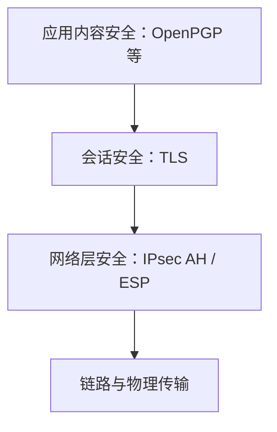

# 7.5 互联网安全协议

安全协议可以部署在不同层次：IPsec 保护 IP 数据报，TLS 在应用与可靠运输服务之间建立安全会话，OpenPGP 一类消息安全机制保护离线存储转发的内容。层次不同意味着身份、覆盖范围和失败边界不同。

> [!abstract] 一句话主线
> **IPsec 面向网络层通信，TLS 面向端到端会话，消息安全面向内容本身；选择哪一层取决于要保护的资产、端点和中间节点。**

> [!tip] 阅读方式
> 先读“核心结构”辨认资产、信任边界、安全目标与失败条件，再在“详细展开”中核对教材图、算法原理和协议历史。

## 核心结构

### 安全机制所在层次

| 机制 | 主要保护对象 | 常见身份材料 | 重要边界 |
| --- | --- | --- | --- |
| IPsec | IP 分组与网络间/主机间通道 | IKE 身份与密钥 | 运输/隧道模式、策略与安全关联 |
| TLS | 客户端与服务器之间的会话数据 | 证书、PSK 等 | 版本、密码套件、名称验证、终端可信 |
| OpenPGP 类消息安全 | 邮件或文件内容 | 公钥、签名与信任关系 | 元数据、密钥发现、长期算法兼容 |

> [!danger] 本节存在明显的教材版本混合
> 详细展开同时包含 SSL、TLS 1.0–1.3 和早期 PGP 的历史叙述，其中“客户端用服务器 RSA 公钥加密主密钥”等流程更接近旧版 TLS，不能当作 TLS 1.3 握手。理解时以“协商参数、认证对端、建立共享秘密、导出流量密钥、保护记录”这条稳定主线为准。

> [!warning] HTTPS 锁标志的边界
> TLS 可认证证书所绑定的服务端身份并保护传输，但不证明网站内容合法、业务可信或终端无恶意软件。名称验证、证书链、私钥保护和应用授权都必须正确。

## 详细展开

前面几节所讨论的网络安全原理都可在互联网中，目前在网络层、运输层和应用层都有相应的网络安全协议。下面分别介绍这些协议的要点。

## 7.5.1 网络层安全协议

**1. IPsec 协议族概述**

我们在第 4 章的 4.8.1 节中讨论虚拟专用网 VPN 时，提到在 VPN 中传送的信息都是经过加密的。现在我们就要求介绍提供这种加密服务的 IPsec。

IPsec 并不是单一的协议，而是能够在 IP 层提供互联网通信安全的**协议族**（不太严格的名词“IPsec 协议”也常见到）。实际上，IPsec 包含了一个通用框架和若干加密算法，具有相当的灵活性和可扩展性。IPsec 允许通信双方从中选择合适的算法和参数（例如，密钥长度），以及是否使用鉴别。为保证互操作性，IPsec 规定其所有的实现都必须包含 IPsec 所推荐的全部加密算法。

IPsec 就是“IP security (security)”的缩写。在很多 RFC 文档中已给出了详细的描述。在这些文档中，最重要的就是描述 IP 安全体系结构的 RFC 4301（目前是建议标准）和提供 IPsec 协议族概述的 RFC 6071。

IPsec 协议族中的协议可划分为以下三个部分：
1. IP 安全数据报格式的两个协议：**鉴别首部 AH** (Authentication Header) 协议和**封装安全有效载荷 ESP** (Encapsulation Security Payload) 协议。
2. 有关加密算法的三个协议。
3. **互联网密钥交换 IKE** (Internet Key Exchange) 协议。

下面我们要重点介绍 IP 安全数据报的格式，以便了解 IPsec 怎样提供网络层的安全通信。AH 协议提供源点鉴别和数据完整性，但不能保密。而 ESP 协议比 AH 协议复杂得多，它提供源点鉴别、数据完整性和保密。IPsec 支持 IPv4 和 IPv6。在 IPv6 中，AH 和 ESP 都是扩展首部的一部分。AH 协议的功能都已包含在 ESP 协议中，因此使用 ESP 协议就可以不使用 AH 协议。下面我们将不再讨论 AH 协议，而只介绍 ESP 协议的要点。

使用 ESP 或 AH 协议的 IP 数据报称为 **IP 安全数据报**（或 IPsec 数据报），它可以在两台主机之间、两个路由器之间或一台主机和一个路由器之间发送。

IP 安全数据报有以下两种不同的工作方式。

第一种工作方式是**运输方式** (transport mode)。运输方式是在整个运输层报文段的前后分别添加若干控制信息，再加上 IP 首部，构成 IP 安全数据报（见图 7-17(a)）。
![[Pasted image 20260716164202.png]]
*图 7-17 IP 安全数据报的两种工作方式*

第二种工作方式是**隧道方式** (tunnel mode)。隧道方式是在原始的 IP 数据报的前后分别添加若干控制信息，再加上新的 IP 首部，构成一个 IP 安全数据报（见图 7-17(b)）。

无论使用哪种方式，最后得出的 IP 安全数据报的 IP 首部都是不加密的。只有使用不加密的 IP 首部，互联网中的各个路由器才能识别 IP 首部中的有关信息，把 IP 安全数据报在不安全的互联网中进行转发，从源点安全地转发到终点。所谓“安全数据报”是指数据报的数据部分是经过加密的，并能够被鉴别的。通常把数据报的数据部分称为数据报的**有效载荷** (payload)。

由于目前使用最多的就是隧道方式，因此下面的讨论只限于隧道方式。

**2. 安全关联**

在发送 IP 安全数据报之前，在源实体和目的实体之间必须创建一条网络层的逻辑连接，即**安全关联 SA** (Security Association)。这样，传统的互联网中无连接的网络层就变为了具有逻辑连接的一个层。安全关联是从源点到终点的单向连接，它能够提供安全服务。如要进行双向安全通信，则两个方向都需要建立安全关联。假定某公司有一个公司总部和一个在外地的分公司。总部需要和这个分公司以及在地出差的 $n$ 个员工进行双向安全通信。在这种情况下，一共需要创建 $(2 + 2n)$ 条安全关联 SA。在这些安全关联 SA 上传送的就是 IP 安全数据报。

图 7-18(a) 是安全关联 SA 的示意图。公司总部和分公司都各有一个负责收发 IP 数据报的路由器 $R_1$ 和 $R_2$（通常就是公司总部和分公司的防火墙中的路由器），而公司总部与分公司之间的安全关联 SA 就是在路由器 $R_1$ 和 $R_2$ 之间建立的。当然，路由器 $R_1$ 和 $R_2$ 都必须预先装有 IPsec。现假定公司总部的主机 $H_1$ 要和分公司的主机 $H_2$ 通过互联网进行安全通信。

公司总部主机 $H_1$ 发送给分公司主机 $H_2$ 的 IP 数据报，必须先经过公司总部的路由器 $R_1$。然后经 IPsec 的加密处理后，成为 IP 安全数据报。这样就把原始的 IP 数据报隐藏在 IP 安全数据报中了。IP 安全数据报经过互联网中很多路由器的转发，最后到达分公司的路由器 $R_2$。路由器 $R_2$ 对 IP 安全数据报解密，还原出原始的数据报，传送到终点主机 $H_2$。从逻辑上看，IP 安全数据报在安全关联 SA 上传送，就好像通过一个安全的隧道。这就是**“隧道方式”**这一名词的来源。如果总部的主机 $H_1$ 要和总部的另一台主机 $H_3$ 通信，由于都在公司内部，不需要加密，因此不需要建立安全关联。$H_1$ 发出的 IP 数据报只需通过总部内部的路由器 $R_1$ 转发一次即可送到 $H_3$。如果 $H_1$ 要上网查看天气预报，同样不需要建立安全关联，而是发送 IP 数据报，经过路由器 $R_1$ 转发到互联网中的下一个路由器，最后到达互联网中预报气象的服务器。
![[Pasted image 20260716164210.png]]
*图 7-18 安全关联 SA 的示意图*

若公司总部的主机 $H_1$ 要和某外地业务员的便携机 $H_2$ 进行安全通信，则情况将稍有不同（如图 7-18(b) 所示）。可以看出，这时公司总部的路由器 $R_1$ 和外地业务员的便携机 $H_2$ 建立安全关联 SA（即路由器和主机之间的安全关联）。公司总部 $H_1$ 发送的 IP 数据报，通过路由器 $R_1$ 后，就变成了 IP 安全数据报。经过互联网中许多路由器的转发，最后到达 $H_2$。可以看出，现在是在路由器 $R_1$ 和业务员的便携机 $H_2$ 之间构成了一个安全隧道。外地业务员利用事先安装在便携机 $H_2$ 中的 IPsec 对 IP 安全数据报进行鉴别和解密，还原 $H_1$ 发来的 IP 数据报。

建立安全关联 SA 的路由器或主机，必须维护这条 SA 的状态信息。我们以图 7-18 中的安全关联 SA 为例，说明其状态信息应包括的项目：
1. 一个 32 位的连接标识符，称为**安全参数索引 SPI** (Security Parameter Index)。
2. 安全关联 SA 的源点和终点的 IP 地址（即路由器 $R_1$ 和 $R_2$ 的 IP 地址）。
3. 所使用的加密类型（例如，DES 或 AES）。
4. 加密的密钥。
5. 完整性检查的类型（例如，使用报文摘要 MD5 或 SHA-1 的报文鉴别码 MAC）。
6. 鉴别使用的密钥。

当路由器 $R_1$ 要通过 SA 发送 IP 安全数据报时，就必须读取 SA 的这些状态信息，以便知道如何把 IP 数据报进行加密和鉴别。

**3. IP 安全数据报的格式**

图 7-19 是 IP 安全数据报的格式。下面以隧道方式为例，结合各字段的作用，讨论一下 IP 安全数据报是怎样构成的。图中的数字 ❶ 至 ❻ 表示 IP 安全数据报构成的先后顺序。
![[Pasted image 20260716164220.png]]
*图 7-19 IP 安全数据报的格式*

❶ 首先在原始的 IP 数据报（也就是 ESP 的有效载荷）后面添加 ESP 尾部。ESP 尾部有三个字段。第一个字段是填充字段，用全 0 填充。第二个字段是填充长度（8 位），指出填充字段的字节数。为什么要进行填充呢？这是因为在进行数据加密时，通常都要求数据块长度是若干字节（例如，4 字节）的整数倍。当 IP 数据报长度不满足此条件时，就必须用 0 进行填充。每个 0 为一个字节长。虽然填充长度（8 位）的最大值是 255，但实际上，填充很少会用到这个最大值。ESP 尾部最后一个字段是“下一个首部”（8 位）。这个字段的值指明，在接收端，ESP 的有效载荷应交给哪个协议来处理。如图 7-19 所示，IP 安全数据报有三个首部。现在 ESP 尾部中的“下一个首部”显然就是指 ESP 的有效载荷中的“原始的 IP 首部”，IP 的协议值是 4，因此“下一个首部”应填入的数值是 4。如果不是隧道方式而是运输方式，则“ESP 的有效载荷”就应当是 TCP 或 UDP 报文段，“下一个首部”的值也要改为另外的数值。

❷ 按照安全关联 SA 指明的加密算法和密钥，对“ESP 的有效载荷（即原始的 IP 数据报）+ ESP 尾部”（见图 7-19 中的“加密的部分”）进行加密。

❸ 对“加密的部分”完成加密后，就添加 ESP 首部。ESP 首部有两个 32 位字段。第一个字段存放安全参数索引 SPI。通过同一个 SA 的所有 IP 安全数据报都使用同样的 SPI 值。第二个字段是序号，鉴别要用到这个序号，它用来防止重放攻击。请注意，当分组重传时序号并不重复。

❹ 按照 SA 指明的算法和密钥，对“ESP 首部 + 加密的部分”（见图 7-19 中的“鉴别的部分”）生成报文鉴别码 MAC。

❺ 把所生成的报文鉴别码 MAC 添加在 ESP 尾部的后面，和 ESP 首部、ESP 的有效载荷、ESP 尾部一起，构成 IP 安全数据报的有效载荷。

❻ 生成新的 IP 首部，通常为 20 字节长，和普通的 IP 数据报的首部的格式是一样的。需要注意的是，首部中的协议字段的值是 50，表明在接收端，首部后面的有效载荷应交给 ESP 协议来处理。

当分公司的路由器 $R_2$ 收到 IP 安全数据报后，先检查首部中的目的地址。发现目的地址就是 $R_2$，于是路由器 $R_2$ 就继续处理这个 IP 安全数据报。

路由器 $R_2$ 找到 IP 首部的协议字段值（现在是 50），就把 IP 首部后面的所有字段（即 IP 安全数据报的有效载荷）都用 ESP 协议进行处理。先检查 ESP 首部中的安全参数索引 SPI，以确定收到的数据报属于哪一个安全关联 SA（因为路由器 $R_2$ 可能有多个安全关联）。路由器 $R_2$ 接着计算报文鉴别码 MAC，看是否和 ESP 尾部后面添加的报文鉴别码 MAC 相符。如是，即知收到的数据报的确是来自路由器 $R_1$。再检验 ESP 首部中的序号，以证实有无被入侵者重放。接着要用和这个安全关联 SA 对应的加密算法和密钥，对已加密的部分进行解密。再根据 ESP 尾部中的填充长度，去除发送端填充的所有 0，还原出加密前的 ESP 有效载荷，也就是 $H_1$ 发送的原始 IP 数据报。

根据解密后得到的 ESP 尾部中“下一个首部”的值（现在是 4），把 ESP 的有效载荷交给 IP 来处理。当找到原始的 IP 首部中的目的地址是主机 $H_2$ 的 IP 地址时，就把整个的 IP 数据报传送给主机 $H_2$。整个 IP 数据报的传送过程到此结束。

请注意，在图 7-19 的“原始的 IP 首部”中，是用主机 $H_1$ 和 $H_2$ 的 IP 地址分别作为源地址和目的地址，而在 IP 安全数据报的“新的 IP 首部”中，是使用路由器 $R_1$ 和 $R_2$ 的 IP 地址分别作为源地址和目的地址（这是图 7-18(a) 所示的情况）。但如果是图 7-18(b) 所示的情况，IP 安全数据报不经过另一个路由器 $R_2$，那么在 IP 安全数据报的“新的 IP 首部”中，要用路由器 $R_1$ 和主机 $H_2$ 的 IP 地址分别作为 IP 安全数据报的源地址和目的地址。

从以上的讨论可以看出，设想有一个 IP 安全数据报在互联网中被某人截获，如果截获者不知道此安全数据报的密码，那么他只能知道这是一个从路由器 $R_1$ 发往路由器 $R_2$ 的 IP 数据报，但却无法看懂其有效载荷中的数据含义。如果截获者篡改了数据报的源地址，那么安全数据报的鉴别功能可以保证源地址的真实性。假定截获者故意删除了安全数据报中的一些字节，但由于接收端的路由器 $R_2$ 能够进行完整性检验，就不会接收这种含有差错的信息。如果截获者试图进行重放攻击，那么由于安全数据报使用了有效的序号，使得重放攻击也无法得逞。

**4. IPsec 的其他构件**

前面已经提到过，发送 IP 安全数据报的实体可能要用到很多条安全关联 SA。那么这些 SA 存放在什么地方呢？这就要提及 IPsec 的一个重要构件，叫作**安全关联数据库 SAD** (Security Association Database)。所有需要运行 IPsec 的站点都必须有 SAD。当主机要发送 IP 安全数据报时，就要在 SAD 中查找相应的 SA，以便获得必要的信息，来对该 IP 安全数据报实施安全保护。同样，当主机要接收 IP 安全数据报时，也要在 SAD 中查找相应的 SA，以便获得信息来检查该分组的安全性。

前面已经提到了，主机所发送的数据报并非都必须进行加密，很多信息使用普通的数据报用明文发送即可。因此，除了安全关联数据库 SAD，还需要另一个数据库，这就是**安全策略数据库 SPD** (Security Policy Database)。SPD 指明什么样的数据报需要进行 IPsec 处理。这取决于源地址、源端口、目的地址、目的端口，以及协议的类型等。因此，当一个 IP 数据报到达时，SPD 指出应当做什么（使用 IP 安全数据报还是不使用），而 SAD 则指出，如果需要使用 IP 安全数据报，应当怎样做（使用哪一个 SA）。

还有一个问题，安全关联数据库 SAD 中存放的许多安全关联 SA 是怎样建立起来的呢？如果一个虚拟专用网 VPN 只有几个路由器和主机，那么用人工键入的方法就可以建立起所需的安全关联数据库 SAD。但如果一个 VPN 有好几百或几千个路由器和主机，人工键入的方法显然是不行的。因此，对于大型的、地理位置分散的系统，为了创建 SAD，我们需要使用自动生成的机制，即使用**互联网密钥交换 IKE** (Internet Key Exchange) 协议。IKE 的用途就是为 IP 安全数据报创建安全关联 SA。

IKE 是个非常复杂的协议，IKEv2 是其新的版本，在 2014 年 10 月已成为互联网的正式标准 [RFC 7296, STD79]。IKEv2 以另外三个协议为基础：
1. Oakley——是个密钥生成协议 [RFC 2412]。
2. **安全密钥交换机制 SKEME** (Secure Key Exchange MEchanism)——是用于密钥交换的协议。它利用公钥加密来实现密钥交换协议中的实体鉴别。
3. **互联网安全关联和密钥管理协议 ISAKMP** (Internet Secure Association and Key Management Protocol)——用于实现 IKE 中定义的密钥交换，使 IKE 的交换能够以标准化、格式化的报文创建安全关联 SA。

关于 IKE 的深入介绍可参阅有关文档，如 RFC 4945 和 RFC 7427（都是建议标准）。

## 7.5.2 运输层安全协议

**1. 协议 TLS 的要点**

当万维网能够提供网上购物时，安全问题就马上被提到桌面上来了。例如，当顾客在不安全的互联网上购物时，他会要求得到下列安全服务：
1. 顾客需要确保服务器属于真正的销售商，而不是某个冒充者。这就是应对身份进行鉴别。
2. 顾客与销售商需要确保报文的内容（例如账单）在传输过程中没有被篡改。这就是应保证通信内容的数据完整性。
3. 顾客与销售商需要确保诸如信用卡上的敏感信息不被泄露。这就是要有机密性。

不仅在电子商务领域，即使在我们日常上网浏览各种信息时，我们所浏览的信息也是属于个人隐私，不应作为网上的公开信息。因此，在很多情况下，客户端（浏览器）与服务器之间的通信需要使用安全的运输层协议。曾经广泛使用的运输层安全协议有两个，即：(1) **安全套接字层 SSL** (Secure Socket Layer)。(2) **运输层安全 TLS** (Transport Layer Security)。

协议 SSL 是 Netscape 公司在 1994 年开发的安全协议，广泛用于基于万维网的各种网络应用（但不限于万维网应用）。SSL 作用在端系统应用层的 HTTP 和运输层之间，在 TCP 之上建立起一个安全通道，为通过 TCP 传输的应用层数据提供安全保障。

1995 年 Netscape 公司把 SSL 交给 IETF 推进标准化；IETF 随后在 SSL 3.0 基础上形成 TLS 1.0，并陆续发布 TLS 1.1、TLS 1.2 与 TLS 1.3。SSL 2.0/3.0 已不应使用，RFC 8996 又正式弃用了 TLS 1.0/1.1。TLS 1.2 在采用合适密码套件、正确证书验证和安全配置时仍可使用；TLS 1.3 [RFC 8446] 删除了大量旧算法与握手分支，通常应优先采用。现实系统能否安全运行不能只看版本号，还取决于密码套件、密钥交换、证书与名称验证、随机数、实现和配置。

协议 TLS 的位置在运输层和应用层之间（如图 7-20 所示）。虽然协议 SSL 2.0/3.0 均已被废弃不用了，但现在还经常能够看到把“SSL/TLS”视为 TLS 的同义词。这是因为协议 TLS 本来就源于 SSL（但并不兼容），而现在旧协议 SSL 被更新为新协议 TLS。
![[Pasted image 20260716164232.png]]
*图 7-20 协议 TLS 位于运输层和应用层之间*

应用层使用协议 TLS 最多的就是 HTTP，但并非仅限于 HTTP。因为协议 TLS 是对 TCP 加密，因此任何在 TCP 之上运行的应用程序都可以使用协议 TLS。例如，用于 IMAP 邮件存取的鉴别和数据加密也可以使用 TLS。TLS 提供了一个简单的带有套接字的应用程序接口 API，这和 TCP 的 API 是相似的。

当不需要运输层安全协议时，HTTP 就直接使用 TCP 连接，这时协议 TLS 不起作用。由于需要使用运输层安全协议的人越来越多，因此现在相当多的网站已是全站使用运输层安全协议。例如，当我们使用百度网站浏览信息时，在浏览器的地址栏键入其官网网址 `www.baidu.com` 后（不必在前面键入 `http://` 或 `https://`），就可以在屏幕上看到这样的响应：
`🔒 https://www.baidu.com`

地址栏中的 `https` 表示 HTTP 运行在 TLS 保护之上，传统 HTTPS 服务通常使用 TCP 端口 443。浏览器在证书链、主机名和有效期等检查通过后，可以确认连接对应于证书所绑定的身份，并获得传输机密性与完整性；这并不自动证明网站业务可信、内容无害或终端没有被控制。

现在我们使用某些主流浏览器访问不安全的网站时，浏览器会向用户发出“不安全”的警告。下面给出当我们键入桔梗网的网址 `shu.jiegeng.com` 后所看到的响应：
谷歌 Chrome 浏览器指出“不安全”
`① 不安全 | shu.jiegeng.com`
火狐 Firefox 浏览器提示无安全锁
`① 🔒 shu.jiegeng.com`
这就提醒我们在上网时要注意信息的安全。

协议 TLS 具有双向鉴别的功能。但大多数情况下使用的是单向鉴别，即客户端（浏览器）需要鉴别服务器。也就是说，浏览器 A 要确信即将访问的网站服务器 B 是安全和可信的。这必须要有两个前提。首先，服务器 B 必须能够证明本身是安全和可信的。因此服务器 B 需要有一个证书来证明自己。现在我们假定服务器 B 已经持有了有效的 CA 证书。这正是运输层安全协议 TLS 的基石。其次，浏览器 A 应具有一些手段来证明服务器 B 是安全和可信的。下面就来讨论这一点。

操作系统或浏览器通常维护受信任的根证书集合。根证书的公钥作为本地**信任锚**，其可信性来自受控的软件分发与信任策略，而不是仅靠“自签名”本身。验证服务器证书时，客户端还需要构建并校验证书链，检查主机名、有效期、用途、算法约束以及适用的吊销信息。

由于浏览器与服务器的通信方式就是以前讲过的“客户-服务器方式”，因此下面就用客户代表浏览器。

如图 7-21 所示，在客户与服务器建立底层连接后，可以开始 TLS 握手，再由记录协议保护应用数据。下面教材图把多代 TLS 的概念放在同一流程中；其中“用服务器 RSA 公钥加密预主密钥”的步骤属于旧式 RSA 密钥交换，**不是 TLS 1.3 握手**。
![[Pasted image 20260716164240.png]]
*图 7-21 TLS 建立安全会话的工作原理*

我们先介绍协议 TLS 的**握手阶段**。握手阶段要验证服务器是安全可信的，同时生成在后面的会话阶段所需的共享密钥，以保证双方交换的数据的私密性和完整性。这里要提醒读者，在刚开始执行协议 TLS 时，通信双方的信道是不安全的。因此要弄清：(1) 双方怎样通过不安全的信道得到会话时所需的共享密钥。这里没有采用密钥分发中心 KDC 来分配密钥，而是采用自己生成共享密钥的方法。(2) 用什么方法保证所传送数据的机密性与完整性。

**(1) 协商参数** 客户端的 ClientHello 提供其支持的协议版本、密码套件、密钥交换参数和扩展；服务器选择双方共同支持的参数，并在需要时发送证书及其持钥证明。TLS 1.3 删除静态 RSA 密钥交换、CBC 类旧套件和多种历史算法，把密码套件限定为 AEAD 与散列组合，并将密钥交换组等参数分离协商。它的新连接握手通常为 1-RTT；这来自握手消息与密钥计划的重新设计，不是客户端只“猜一个算法”让服务器确认。

**(2) 服务器鉴别** ❸ 客户 A 用数字证书中 CA 的公钥对数字证书进行验证鉴别。

**(3) 生成主密钥** ❹ 客户 A 按照双方确定的密钥交换算法生成**主密钥 MS** (Master Secret)。❺ 客户 A 用 B 的公钥 $PK_B$ 对主密钥 MS 加密，得出加密的主密钥 $PK_B(MS)$，发送给服务器 B。请注意，在有关 TLS 的文档中，密钥一词使用的是 Secret，而不是 Key。

**(4) 服务器 B 用自己的私钥把主密钥解密出来：$SK_B(PK_B(MS)) = MS$。这样，客户 A 和服务器 B 都拥有了为后面的数据传输使用的共同的**主密钥 MS**。

**(5) 为了使双方的通信更加安全，客户 A 和服务器 B 最好使用不同的密钥。于是主密钥被分割成 4 个不同的密钥，这就是图 7-21 中的 ❷ 和 ❸：生成会话密钥。在这以后，每一方都拥有这样 4 个密钥（请注意，这些都是对称密钥，即加密和解密用的是同一个密钥）：**
* 客户 A 发送数据时使用的会话密钥 $K_A$
* 客户 A 发送数据时使用的 MAC 密钥 $M_A$
* 服务器 B 发送数据时使用的会话密钥 $K_B$
* 服务器 B 发送数据时使用的 MAC 密钥 $M_B$

会话密钥不使用非对称密钥，因为对称密钥的运行速度快得多（相差 3 个数量级）。

下面讨论协议 TLS 的**会话阶段**。会话阶段要保证传送数据的机密性和完整性。

客户或服务器在发送数据时，都把长的数据划分为较小的数据块，叫作**记录** (record)。然后对每一个记录进行鉴别运算和加密运算。为了防止入侵者截取传输中的记录，或颠倒记录的前后顺序，TLS 的记录协议对每一个记录按发送顺序赋予序号，把每一方发送的第一个记录作为 0 号记录。发送下一个记录时序号就加 1，但序号最大值不得超过 $2^{64} - 1$，且不允许序号绕回。然而此序号并非写在记录之中，而是在进行散列运算时，把序号包含进去。

教材描述的“先计算 MAC，再把明文与 MAC 一起加密”是旧版 TLS 中的一类组合思路，不能直接称为 AEAD。AEAD（Authenticated Encryption with Associated Data）是把加密与完整性保护作为一个标准化构造完成，并可认证不加密的关联数据；TLS 1.3 的记录保护使用 AEAD 密码套件。

实际上，客户 A 所发送的加密的记录的前面，还必须添加三个不加密的字段，图 7-22 给出了这三个字段的位置。类型字段指明所传送的记录是握手阶段的报文，还是应用程序传送的报文，或最后要关闭 TLS 连接的报文（下一小节将要解释）。长度字段给出的字节数可用来从 TCP 报文中提取 TLS 记录。
![[Pasted image 20260716164248.png]]
*图 7-22 TLS 传送的记录格式*

**2. 协议 TLS 必须包含的措施**

以上介绍的只是协议 TLS 的要点。但若仅仅是这些，还不能提供足够的安全。因此，对前面图 7-21 所示的双方的握手阶段，需要补充一些措施。

1. 在客户 A 向服务器 B 发送自己选定的加密算法（包括密钥交换算法）时，还要向服务器 B 发送客户的不同数。服务器 B 从中确认自己所支持的算法，同时把自己的 CA 数字证书和服务器的不重数发送给客户 A。

2. 生成**预主密钥** 客户 A 验证了服务器 B 的数字证书后，生成为下一步生成主密钥使用的**预主密钥 PMS** (Pre-Master Secret)，并用 B 的公钥 $PK_B$ 对预主密钥 PMS 加密，把加密的预主密钥 $PK_B(PMS)$ 发送给服务器 B。B 用其私钥 $SK_B$ 进行解密，得出预主密钥 PMS。这样，客户 A 和服务器 B 都拥有了为后面的数据传输使用的共同的**预主密钥 PMS**。

3. **生成主密钥** 客户 A 和服务器 B 各自使用同样的（已商定的）算法，使用预主密钥 PMS 以及客户的不重数和服务器的不重数，生成主密钥 MS。然后再将其划分为 4 个密钥。于是 A 和 B 各拥有相同的 4 个密钥（每一方在发送数据时使用的会话密钥和 MAC 密钥）。

4. 客户 A 向服务器 B 发送的全部握手阶段报文的 MAC。
5. 服务器 B 向客户 A 发送的全部握手阶段报文的 MAC。

上述最后的 (4) 和 (5) 的作用是这样的。在 A 向 B 发送加密的预主密钥之前的握手信息是没有加密的明文，因此可能受到入侵者的篡改。现在 A 和 B 都各自对全部握手阶段的报文计算了散列值 MAC。如果入侵者篡改了处在传输过程中的某个报文，那么上面 (4) 和 (5) 所得出的 MAC 值必然不一致。这样 A 或 B 就可以立即中止当前的连接。

在 (1) 中客户和服务器各产生一个仅使用一次的不重数，其目的是为了**防止“重放攻击”**。设想在 A 和 B 之间有一个入侵者，他截获了 A 和 B 交互的全部报文。虽然他未能解密 A 和 B 交互的具体内容，但他可以在以后的某日，重新按照原来的顺序依次发送给 B。如果没有使用上述的不重数，那么 B 无法发现这是入侵者重放旧的报文。B 也将和前次的握手过程一样，向 A 发回报文（实际上是发给了中间入侵者）。这样造成的后果是很严重的。但使用了不重数以后，在下一个 TCP 连接中，客户 A 必须使用另一个不同的不重数。这样就有效地防止了重放攻击。

前面曾提到在关闭 TLS 连接之前，A 或 B 应当先发送关闭 TLS 的记录，目的是防止入侵者的**截断攻击** (truncation attack)。所谓截断攻击就是在 A 和 B 正在进行会话时，入侵者突然发送 TCP 的 FIN 报文段来关闭 TCP 连接。但如果 A 或 B 没有事先发送一个要关闭 TLS 的记录，那么 A 或 B 见到 TCP 的 FIN 报文段时，就知道这是入侵者的截断攻击了。入侵者无法伪造关闭 TLS 的记录，因为虽然记录前面的三个字段都是明文，但每个记录的内容是加密的，并有 MAC 保证其完整性的。

TLS 1.3 将密钥交换限定为具有前向保密性的 (EC)DHE 类机制，并将记录保护限定为 AEAD 算法；标准密码套件包括 AES-GCM、AES-CCM 和 ChaCha20-Poly1305，并非只使用“ECC 与 AES”。它简化了握手并通常可在 1-RTT 内建立新会话，但性能提升取决于网络、硬件与实现。恢复会话可选择发送 0-RTT 早期数据；早期数据不具备完整的重放保护，应用只能在能够安全处理重放时使用。

## 7.5.3 应用层安全协议

限于篇幅，我们在这一节仅讨论应用层中有关电子邮件的安全协议。

电子邮件在传送过程中可能要经过许多路由器，其中的任何一个路由器都有可能对转发的邮件进行阅读。从这个意义上讲，电子邮件是没有什么隐私可言的。

电子邮件这种网络应用也有其很特殊的地方，这就是发送电子邮件是个即时行为。这种行为在本质上与我们所前两节所讨论的不同。当我们使用 IPsec 或 SSL 时，我们假设双方在相互之间建立起一个会话并双向地交换数据。而在电子邮件中不会话存在。当 A 向 B 发送一个电子邮件时，A 和 B 并不会为此而建立任何会话。而在此后的某个时间，如果 B 阅读了该邮件，他有可能、也有可能不会回复这个邮件。可见我们所讨论的是**单向报文**的安全问题。

如果说电子邮件是即时的行为，那么发送方与接收方如何才能就用于电子邮件的安全加密算法达成一致意见呢？如果双方之间不存在会话，不存在协商加密/解密所使用的算法，那么接收方如何知道发送方选择了哪种算法呢？

要解决这个问题，电子邮件安全格式需要携带所用算法的标识，使接收方能够选择相应的解密、散列或签名验证过程。例如，报文可以标识所用的对称加密算法和散列算法。教材中的“AES 与 SHA-1”组合仅用于说明算法标识的作用；SHA-1 已不应作为新系统中的签名散列选择，实际可用组合应以所用 OpenPGP 版本和算法配置为准。

加密算法在使用加密密钥时也存在同样的问题。如果没有协商过程，通信的双方如何在彼此之间知道所使用的密钥？目前的电子邮件安全协议要求使用对称密钥算法进行加密和解密，并且这一次性密钥要跟随报文一起发送。发信人 A 可以生成一个密钥并把它与报文一起发送给 B。为了保护密钥不被外人截获，这个密钥需要用收信人 B 的公钥进行加密。总之，这个密钥本身也要被加密。

还有一个问题也需要考虑。很显然，要实现电子邮件的安全就必须使用某些公钥算法。例如，我们需要对密钥加密或者对邮件签名。为了对密钥进行加密，发信人 A 就需要收信人 B 的公钥，同样为了验证被签名的报文，收信人 B 也需要发信人 A 的公钥。因此，为了发送一个具有鉴别和保密的报文，就需要用到两个公钥。但是 A 如何才能确认 B 的公钥，B 又如何才能确认 A 的公钥呢？不同的电子邮件安全协议有不同的方法来验证密钥。

下面我们介绍在应用层为电子邮件提供安全服务的协议 **PGP**。

PGP (Pretty Good Privacy) 是 Zimmermann 开发的历史性消息安全软件，把加密、鉴别、数字签名、压缩和密钥管理组合在一起。早期实现曾使用 RSA、MD5 等算法，这些内容用于理解其设计演进，不代表现代部署选择。应区分具体 PGP 软件与 IETF 标准化的 OpenPGP 消息格式；安全性取决于版本、算法配置、密钥真实性和实现，而不取决于早期网站或用户规模。

后来 PGP 公司与 Zimmermann 同意 IETF 制定 PGP 的公开互联网标准 OpenPGP。2007 年 IETF 发布了 OpenPGP 的建议标准 [RFC 4880]。

PGP 的工作原理并不复杂。它提供电子邮件的安全性、发送方鉴别和报文完整性。

假定 A 向 B 发送电子邮件明文 $X$，现在用 PGP 进行加密。A 有三个密钥：自己的私钥 $SK_A$，B 的公钥 $PK_B$ 和自己生成的一次性密钥 $K$。B 有两个密钥：自己的私钥 $SK_B$ 和 A 的公钥 $PK_A$。

A 需要做以下几件事（如图 7-23 所示）。
![[Pasted image 20260716164256.png]]
*图 7-23 在发送方 A 的 PGP 处理过程*

❶ 用 A 的私钥 $SK_A$ 对明文邮件 $X$ 进行签名。把签名拼接在明文邮件 $X$ 后面。
❷ 利用随机数 A 生成一次性密钥 $K$（共享的对称密钥）。
❸ 用 A 生成的一次性密钥 $K$ 对已签名的邮件加密。
❹ 用 B 的公钥 $PK_B$ 对 A 生成的一次性密钥 $K$ 进行加密。
❺ 把已加密的一次性密钥和已加密的签名邮件，拼接在一起发送给 B。

请注意，图 7-23 中三个“加密”的作用是不同的。第一次加密是用 A 的私钥 $SK_A$ 对明文邮件的报文摘要进行加密，即进行数字签名，目的是保证邮件的完整性。第二次加密是用 A 生成的一次性密钥 $K$ 对已签名的邮件加密，目的是保证邮件的机密性。第三次加密是用 B 的公钥 $PK_B$ 对 A 的一次性密钥 $K$ 加密，目的是保证对称密钥 $K$ 的机密性。

B 收到 A 发过来的报文后要做以下几件事（建议读者自行画出相应的图，这里从略）：
1. 在文档 RFC 4880 中，对加密邮件的各种格式（如仅加密但不鉴别，或仅鉴别但不加密，或加密加上鉴别），均有详细的规定。因此 B 可以根据邮件的种类，准确地把已加密的一次性密钥和已加密的签名报文分离开。
2. 用 B 私钥 $SK_B$ 解出一次性密钥 $K$（这是对称密钥，加密和解密都需要各使用一次）。
3. 用导出的一次性密钥 $K$ 对加密的签名邮件进行解密，分离出明文邮件 $X$ 和 A 的数字签名。
4. 用 B 手中的 A 的公钥 $PK_A$ 对 A 的数字签名进行解密。然后即可接着验证邮件的完整性，具体的做法与前面图 7-9 所述的相似，这里不再重复。

在 PGP 中，发件方和收件方是如何获得对方的公钥呢？当然，最安全的办法是双方面对面直接交换公钥，但在大多数情况下这并不现实。因此可以通过认证中心 CA 签发的证书来验证公钥持有者的合法身份。然而在 PGP 中不要求使用 CA，而是允许用一种第三方签置的方式来解决该问题。例如，如果用户 A 和用户 B 分别和第三方 C 已经确认对方拥有的公钥属实，则 C 可以用其私钥分别对 A 和 B 的公钥进行签名，为这两个公钥进行担保。当 A 得到一个经 C 签名的 B 的公钥时，可以用已确认的 C 的公钥对 B 的公钥进行鉴别。不过，用户发布其公钥的最常见的方式还是把公钥发布在他们的个人网页上，或仅仅通过电子邮件进行分发。

PGP/OpenPGP 的安全性取决于具体版本、算法组合、密钥真实性、私钥保护和实现；不能仅凭协议名称判断“足够安全”。

---

上一节：[[7.4 密钥分配与公钥基础设施]]　｜　下一节：[[7.6 防火墙与入侵检测]]　｜　章节入口：[[第七章 网络安全]]
