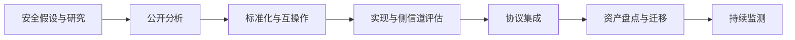

# 7.7 网络安全发展方向

椭圆曲线密码、移动与无线安全、量子通信和后量子密码体现了计算能力、终端形态与攻击模型变化对安全体系的持续影响。判断“未来方向”时，应把数学研究、标准化、实现成熟度和迁移成本分开。

> [!abstract] 一句话主线
> **新算法只有与标准、协议、实现、密钥管理和迁移策略共同落地，才能转化为实际安全能力。**

> [!tip] 阅读方式
> 先读“核心结构”辨认资产、信任边界、安全目标与失败条件，再在“详细展开”中核对教材图、算法原理和协议历史。

## 核心结构

### 从研究到部署

| 方向 | 核心价值 | 不能忽略的问题 |
| --- | --- | --- |
| ECC | 以较短密钥实现公钥密码能力 | 曲线/参数选择、实现与侧信道 |
| 移动与无线安全 | 处理开放介质、漫游和终端丢失 | 身份、基带/系统、无线接入与隐私 |
| 量子密钥分配 | 利用物理性质发现特定窃听行为 | 设备信任、认证、距离、成本与集成 |
| 后量子密码 | 抵抗已知量子算法对传统公钥体制的威胁 | 密钥/签名尺寸、性能、实现与迁移 |

> [!tip] 密码敏捷性
> 长期系统应能识别算法和密钥使用位置，并支持受控升级、双轨兼容、撤销与回退治理；否则即使新算法可用，也难以安全迁移。

## 详细展开

本章介绍了网络安全的主要概念。网络安全是一个很大的领域，无法在这进行深入的探讨。对于有志于这一领域的读者，可在下面几个方向做进一步的研究：

1. **椭圆曲线密码 ECC** 目前椭圆曲线密码已在 TLS 1.3 的握手协议中占据非常重要的地位。此外，在电子护照和金融系统中也大量使用椭圆曲线密码系统。在互联网上已有许多关于椭圆曲线密码的资料。限于篇幅，无法在本书中进行介绍。

2. **移动安全 (Mobile Security)** 移动通信带来的广泛应用（如移动支付，Mobile Payment）向网络安全提出了更高的要求。

3. **量子密码与后量子密码** 量子计算会威胁 RSA、离散对数和椭圆曲线等传统公钥体制，但不会使所有现有密码技术同时失效；对称密码与散列函数受到的影响类型和安全余量不同。后量子密码已从研究阶段进入标准化与迁移部署阶段，工程重点包括算法组合、实现安全、协议集成、资产盘点以及“先收集、后解密”风险下的长期数据保护。

4. **标识密码与 SM9** 标识密码 (Identity-Based Cryptography) 可把用户标识映射为公钥，减少传统证书的分发与验证负担；SM9 是我国的标识密码算法体系。它“不要求为每个公钥申请传统证书”，但并未消除信任与密钥管理：私钥生成机构 PKG 持有主秘密，必须安全完成身份核验、私钥生成与交付，还会引入密钥托管、单点失陷和跨域信任问题。

① 注：2004 年 11 月，联合国总部建立了“互联网治理工作组 WGIG (Working Group on Internet Governance)”，来解决互联网的诚信和安全问题。我国在 2006 年 2 月颁布的《国家中长期科学和技术发展规划纲要（2006—2020 年）》中，提出以发展高可信网络为重点。现在高可信网络已成为研究热点。

---

上一节：[[7.6 防火墙与入侵检测]]　｜　下一章：[[第八章 互联网上的音频视频服务]]　｜　章节入口：[[第七章 网络安全]]
