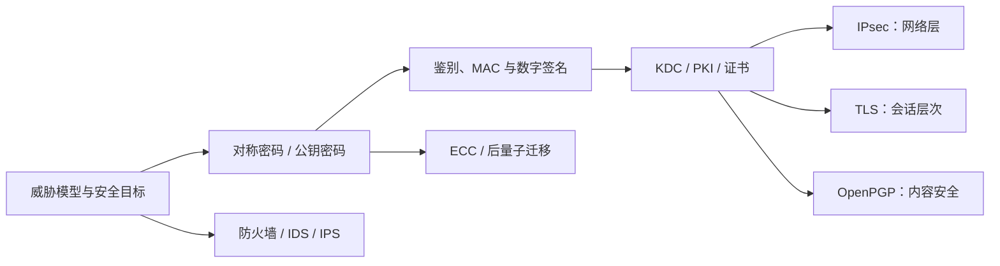

# 7.0 第七章 网络安全

网络安全围绕资产、信任边界、攻击者能力和安全目标建立防护体系。密码学提供机密性、完整性和认证等基础能力，密钥管理建立信任，IPsec、TLS 等协议把能力组合进通信流程，防火墙与入侵检测则从系统和网络边界降低风险。

> [!abstract] 一句话主线
> **先建立威胁模型，再用经过验证的密码构造保护数据和身份，用密钥管理维持信任，用安全协议落实通信保证，最后以访问控制、监测和响应处理密码协议覆盖不到的风险。**

> [!tip] 两种阅读方式
> - **快速复习**：只读各主题“核心结构”，掌握安全目标、机制边界和失败条件。
> - **完整理解**：继续阅读“详细展开”，保留教材的算法史、示意图和经典协议推导。

> [!info] 与计算机科学引论的联系
> [[09-隐私、安全与伦理]]从隐私、组织责任和常见威胁建立安全意识；本章继续深入威胁模型、密码构造、密钥与证书、IPsec/TLS、防火墙和入侵检测的机制边界。

## 知识地图



## 概念入口

1. [[7.1 网络安全目标、威胁与加密模型]]：资产、信任边界、攻击类型与安全目标。
2. [[7.2 对称密码与公钥密码]]：DES/AES、RSA 等经典原理与混合密码体制。
3. [[7.3 报文鉴别与实体鉴别]]：散列、MAC、数字签名、随机数与重放防护。
4. [[7.4 密钥分配与公钥基础设施]]：KDC、会话密钥、证书、CA 与信任链。
5. [[7.5 互联网安全协议]]：IPsec、TLS 与 OpenPGP 的部署层次和机制边界。
6. [[7.6 防火墙与入侵检测]]：边界访问控制、特征/异常检测、漏报与误报。
7. [[7.7 网络安全发展方向]]：ECC、移动安全、量子与后量子迁移。

## 机制与目标映射

| 机制 | 机密性 | 完整性 | 身份认证 | 可用性 | 主要前提 |
| --- | :---: | :---: | :---: | :---: | --- |
| 对称认证加密 | ✓ | ✓ | 共享密钥持有者 | — | 密钥与随机数安全 |
| 数字签名 | — | ✓ | 签名私钥持有者 | — | 公钥绑定可信 |
| TLS / IPsec | ✓ | ✓ | 依配置而定 | 部分 | 版本、算法、证书/密钥正确 |
| 防火墙 | — | 间接 | 依策略与上层身份 | 部分 | 边界覆盖与规则正确 |
| IDS / IPS | — | 间接 | — | 部分 | 可见性、规则和响应流程 |

> [!warning] 教材算法与版本边界
> 本章保留 DES、3DES、MD5、SHA-1、旧版 SSL/TLS、经典 RSA 表达和早期 PGP，目的是解释技术演进，不代表部署推荐。现实系统必须明确算法、协议版本、密钥长度、工作模式、证书验证、随机数、威胁模型和核实日期。

## 动态索引

```dataview
TABLE section AS "节次", aliases AS "别名", prerequisites AS "先修", status AS "状态"
FROM "网络与安全/计算机网络A/知识点/第七章"
WHERE chapter = 7 AND type = "课程笔记"
SORT order ASC
```

---

总入口：[[MOC - 计算机网络]]　｜　上一章：[[第六章 应用层]]　｜　下一章：[[第八章 互联网上的音频视频服务]]
