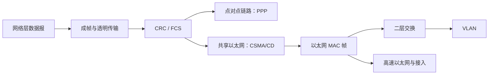

# 3.0 第三章 数据链路层

数据链路层把网络层数据封装成帧，在一段链路或一个二层网络内完成相邻节点交付。它要解决帧边界、透明传输、差错检测、媒体共享和按 MAC 地址转发等问题。

> [!abstract] 一句话主线
> **网络层数据被封装成帧，经点对点链路或以太网传输；接收端用 FCS 检错，交换机根据 MAC 地址选择端口，VLAN 再把同一交换基础设施划分成多个广播域。**

## 知识地图



## 概念入口

1. [[3.1 数据链路层的基本问题]]：链路与数据链路、帧定界、透明传输及可靠性边界。
2. [[3.1.2 循环冗余检验]]：CRC 模 2 除法、FCS 和检错能力。
3. [[3.2 点对点协议 PPP]]：PPP 的组成、帧格式、透明传输和状态机。
4. [[3.3 共享以太网与 CSMA-CD]]：载波监听、碰撞检测、退避、最短帧和信道利用率。
5. [[3.3.5 以太网 MAC 层]]：MAC 地址、适配器过滤和 Ethernet II 帧格式。
6. [[3.4 以太网交换]]：交换机学习、转发、泛洪、老化以及环路与 STP。
7. [[3.4.3 虚拟局域网]]：802.1Q 标签、接入链路、汇聚链路和跨 VLAN 通信。
8. [[3.5 高速以太网与以太网接入]]：速率演进中保持不变与发生变化的部分。

## 两类典型链路

| 场景 | 参与方 | 核心问题 | 典型机制 |
| --- | --- | --- | --- |
| 点对点链路 | 两个直接相邻端点 | 建链、参数协商、成帧、检错 | PPP、LCP、NCP |
| 广播/共享链路 | 多个站共享媒体 | 决定谁能发送，处理碰撞 | 传统以太网、CSMA/CD |
| 交换式以太网 | 主机与交换机端口 | 按 MAC 地址选择输出端口 | 自学习、过滤、泛洪 |

## 四组关键边界

| 容易混淆 | 正确关系 |
| --- | --- |
| 链路与数据链路 | 链路是物理通路；数据链路是链路加上实现通信规则的软硬件 |
| CRC 检错与可靠传输 | CRC 发现部分比特错误；可靠传输还要处理丢失、重复和失序 |
| 集线器与交换机 | 集线器在物理层转发比特；交换机在链路层检查并转发帧 |
| 碰撞域与广播域 | 交换机端口分隔碰撞域；普通二层交换不分隔广播域，VLAN 可以分隔 |

## 动态索引

```dataview
TABLE section AS "节次", aliases AS "主题", prerequisites AS "先修", status AS "状态"
FROM "网络与安全/计算机网络A/知识点/第三章"
WHERE course = "计算机网络A" AND chapter = 3 AND file.name != this.file.name
SORT order ASC
```

> [!info] 课程导航
> 上一章：[[2.0 第二章 物理层]]　｜　本章对应五层模型中的[[1.7 计算机网络体系结构#数据链路层|数据链路层]]。
