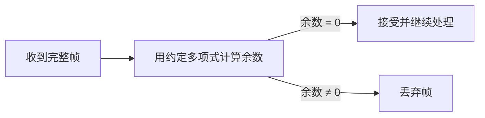

# 3.1.2 循环冗余检验

循环冗余检验（Cyclic Redundancy Check, CRC）把比特串视为二元多项式，用模 2 除法生成冗余校验位。发送端把余数作为 FCS 附在数据后，接收端再除以相同生成多项式，以高概率发现传输错误。

## CRC 与 FCS 的区别

- **CRC**：生成和检验冗余码的方法；
- **FCS**（Frame Check Sequence）：实际附加在帧尾部的冗余比特字段。

FCS 可以由 CRC 生成，但“CRC”和“FCS”不是同一个概念。

## 模 2 运算

CRC 使用模 2 加减法，均等价于逐位异或，不产生进位或借位：

| 运算 | 结果 |
| --- | --- |
| $0\oplus0$ | 0 |
| $0\oplus1$ | 1 |
| $1\oplus0$ | 1 |
| $1\oplus1$ | 0 |

## 生成 FCS

设原始数据为 $M$，长度为 $k$ bit；生成多项式对应的二进制除数为 $P$，最高次数为 $n$。

1. 在 $M$ 后追加 $n$ 个 0，相当于 $M\cdot2^n$；
2. 用模 2 除法计算 $(M\cdot2^n)\bmod P$；
3. 将得到的 $n$ bit 余数 $R$ 作为 FCS；
4. 发送码字 $T=M\cdot2^n+R$。

## 完整例子

取：

$$
M=101001,\qquad P=1101,\qquad n=3
$$

在 $M$ 后补 3 个 0：

```text
101001000
```

用 $1101$ 进行模 2 除法，余数为：

$$
R=001
$$

因此发送比特串为：

$$
T=101001\,001
$$

![[Pasted image 20260715232032.png]]

接收端计算：

$$
T\bmod P=0
$$

若余数非零，判定帧出错并丢弃；若余数为零，则认为帧通过检验。

## 多项式表示

二进制除数 $P=1101$ 对应：

$$
P(x)=x^3+x^2+1
$$

发送码字满足：

$$
T(x)\equiv0\pmod{P(x)}
$$

生成多项式的选择决定可检测的错误模式。工程协议采用经过分析和标准化的多项式，而不是任意选择比特串。

## 能力与边界

CRC 擅长检测突发错误，并能对生成多项式所覆盖的错误模式提供明确保证，但它仍有边界：

- 余数为 0 不代表数学上绝对没有错误，只表示错误未被该多项式检测到的概率很低；
- CRC 通常只检测错误位置，不能指出哪一位错误，也不能自动纠正；
- CRC 不检测未收到的整帧、重复帧或帧顺序变化；
- 若要恢复错误，需要确认、序号和重传，或使用纠错码。

> [!warning] CRC 不提供安全完整性
> CRC 面向随机传输错误，不使用密钥。攻击者可以修改数据并重新计算 CRC，因此它不能替代消息认证码或数字签名。

## 接收处理



是否重传由具体链路协议决定；例如以太网只丢弃无效帧，PPP 也不在基本协议中提供编号和重传。

## 本节小结

- CRC 是检错算法，FCS 是附加在帧中的冗余字段。
- CRC 通过模 2 除法生成余数，接收端用同一除数复检。
- 示例 $M=101001$、$P=1101$ 得到 $R=001$，发送 `101001001`。
- CRC 不能自动纠错，也不能保证可靠传输或抵抗恶意篡改。

> [!info] 章节导航
> 上一节：[[3.1 数据链路层的基本问题]]　｜　下一节：[[3.2 点对点协议 PPP]]
