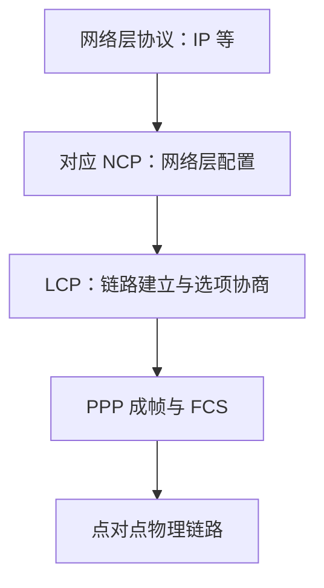
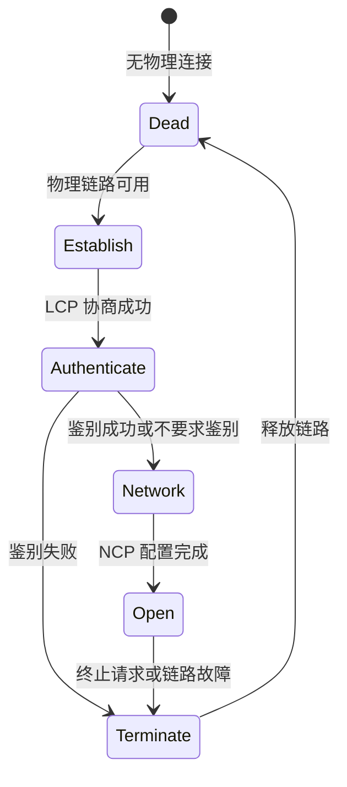

# 3.2 点对点协议 PPP

点对点协议（Point-to-Point Protocol, PPP）在两个直接相邻端点之间封装网络层数据，并通过 LCP 建立、配置和检测链路，再由 NCP 配置具体网络层协议。它追求简单互操作，不在基本链路层中实现编号、确认、流量控制和重传。

## 协议适用范围

| 属性 | PPP 的选择 |
| --- | --- |
| 链路参与方 | 两个端点，不支持多点共享线路 |
| 方向 | 全双工点对点链路 |
| 网络层 | 可承载多种网络层协议 |
| 物理链路 | 可运行在同步/异步、电/光等多种点对点链路上 |
| 差错处理 | FCS 检错，错误帧丢弃；基本 PPP 不重传 |
| 可靠性 | 尽最大努力交付，恢复交给上层或其他机制 |

![[Pasted image 20260715232050.png]]

PPP 曾广泛用于用户到 ISP 的点对点连接；PPPoE 则把 PPP 会话承载在以太网上，见[[3.5 高速以太网与以太网接入#PPPoE：在以太网上承载 PPP]]。

## 三个组成部分

1. **成帧方法**：把 IP 等网络层数据封装到 PPP 帧，支持同步和异步链路；
2. **链路控制协议 LCP**：建立、配置、测试和终止数据链路；
3. **网络控制协议 NCP**：为不同网络层协议进行参数配置，例如 IPCP 配置 IP。



## PPP 帧格式

![[Pasted image 20260715232127.png]]

| 字段 | 长度 | 典型值与作用 |
| --- | ---: | --- |
| Flag | 1 B | `0x7E`，帧定界符 |
| Address | 1 B | `0xFF`，固定地址字段 |
| Control | 1 B | `0x03`，固定控制字段 |
| Protocol | 通常 2 B | 标识信息字段承载的协议 |
| Information | 变长 | 网络层数据或控制分组，受 MRU/MTU 限制 |
| FCS | 2 B 或协商值 | CRC 检错字段 |
| Flag | 1 B | 下一帧可复用同一个标志 |

常见协议字段：

- `0x0021`：IPv4 数据报；
- `0xC021`：LCP 分组；
- `0x8021`：IPCP 分组。

连续两个 Flag 之间没有有效内容时形成空帧，应被丢弃。Address 和 Control 值固定，可通过 LCP 协商压缩；Protocol 字段也存在压缩选项，因此抓包时应结合协商结果解释字段。

## 透明传输

### 异步链路：字节填充

异步 PPP 使用 `0x7D` 作为转义字节。发送端对需要转义的字节加上 `0x7D`，并按协议变换其值；接收端执行相反操作。

典型变换为：

```text
0x7E → 0x7D 0x5E
0x7D → 0x7D 0x5D
```

部分低值控制字符也可通过异步控制字符映射进行转义。填充会增加链路上的字节数，但不改变上层看到的原始数据。

### 同步链路：零比特填充

发送端扫描 Flag 之间的比特流，每出现五个连续 1 就插入一个 0；接收端看到五个连续 1 后删除紧随的填充 0。

![[Pasted image 20260715232138.png]]

这样载荷中不会形成 Flag 的 `01111110` 模式，任意比特组合都能透明传输。

## 链路状态机



![[Pasted image 20260715232159.png]]

### 1. 链路静止与建立

物理链路建立后进入 LCP 协商。发起端发送 Configure-Request，对端可回应：

- **Configure-Ack**：接受全部选项；
- **Configure-Nak**：理解选项但建议其他值；
- **Configure-Reject**：无法识别或不能协商该选项。

选项可以包含最大接收单元、鉴别协议以及字段压缩等。

### 2. 鉴别

若协商要求鉴别，则执行 PAP、CHAP 等机制；失败即进入终止状态。

> [!warning] PPP 鉴别不是端到端加密
> PAP 会传递可直接验证的凭据，CHAP 使用挑战—响应避免直接发送口令，但二者都不为后续业务数据自动提供机密性或完整性。链路鉴别不能替代 TLS、IPsec 等安全机制。

### 3. 网络层配置与开放

NCP 为具体网络层协议配置参数。承载 IP 时，IPCP 可以协商 IP 相关配置。完成后进入 Open 状态，双方交换网络层分组；LCP Echo-Request/Echo-Reply 可用于检测链路存活。

### 4. 终止

一端可发送 Terminate-Request，对端以 Terminate-Ack 确认；物理故障也会触发终止。释放顺序通常是网络层配置、LCP 链路、物理连接。

## 失败处理边界

- FCS 错误：丢弃帧，不由基本 PPP 自动重传；
- 选项不兼容：通过 Nak/Reject 继续协商或终止；
- 鉴别失败：终止链路；
- 链路失活：LCP 检测后进入终止；
- 超过 MRU/MTU：不能作为正常信息字段交付。

## 本节小结

- PPP 由成帧方法、LCP 和一组 NCP 组成，服务于全双工点对点链路。
- PPP 帧用 `0x7E` 定界、协议字段标识载荷、FCS 检测错误。
- 异步链路使用字节填充，同步链路使用零比特填充。
- 状态机依次完成物理连接、LCP、可选鉴别、NCP 配置、数据传输和终止。
- PPP 检错但不提供基本链路层重传，鉴别也不等于加密。

> [!info] 章节导航
> 上一节：[[3.1.2 循环冗余检验]]　｜　下一节：[[3.3 共享以太网与 CSMA-CD]]
