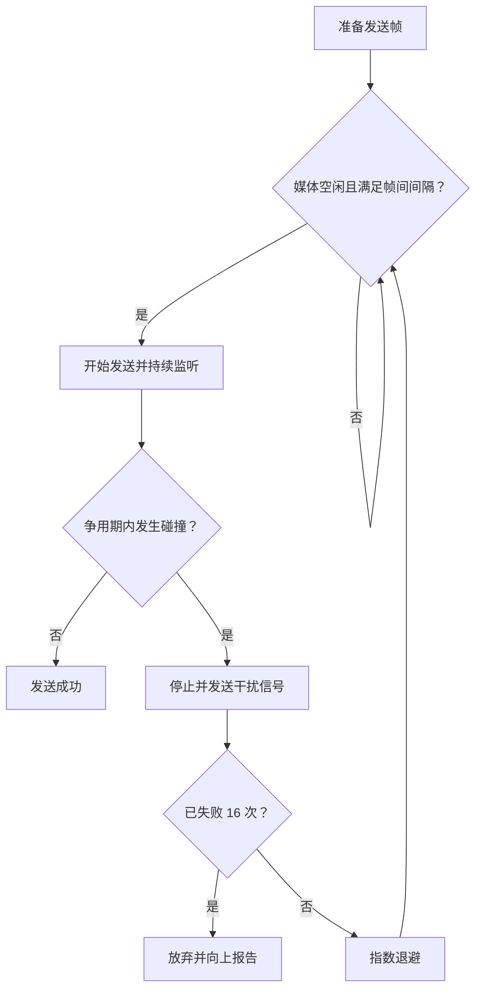

# 3.3 共享以太网与 CSMA/CD

传统共享以太网让多个站使用同一广播媒体。CSMA/CD 规定发送前监听、发送时继续监听、碰撞后停止并随机退避，使无中心调度的站能够竞争信道。

> [!note] 适用范围
> CSMA/CD 属于共享、半双工以太网的媒体接入机制。现代交换式全双工以太网不存在碰撞，不运行 CSMA/CD；理解它主要用于解释最短帧、碰撞域和以太网演进。

## 从共享媒体到动态接入

共享媒体的资源分配可以采用：

- **静态划分**：FDM、TDM、CDM 等预先划分资源；
- **随机接入**：站可竞争发送，碰撞后由协议恢复；
- **受控接入**：通过轮询或令牌决定发送权。

突发局域网流量难以预先固定分配，传统以太网因此采用随机接入。

## CSMA/CD 的含义

- **多点接入（Multiple Access）**：多个站连接同一共享媒体；
- **载波监听（Carrier Sense）**：发送前检查媒体是否空闲；
- **碰撞检测（Collision Detection）**：发送过程中继续监听，一旦发现信号异常就停止发送。

## 为什么监听到空闲仍会碰撞

信号传播速度有限。设总线两端 A、B 的单程传播时延为 $\tau$：

1. $t=0$：A 开始发送；
2. A 的信号尚未到达 B 时，B 仍监听到空闲并开始发送；
3. 两个信号在链路中相遇并碰撞；
4. B 较早检测到碰撞，A 最迟在接近 $2\tau$ 时检测到。

![[Pasted image 20260715232252.png]]

> [!example] 1 km 同轴电缆
> 信号在 1 km 电缆中的传播时延约为 $5\ \mu\mathrm{s}$。即使 A 已开始发送，B 在这 5 μs 内仍可能认为媒体空闲。这是载波监听无法彻底避免碰撞的原因。

## 争用期与最短帧

最坏情况下，发送端必须持续发送至少 $2\tau$，才能在帧结束前发现远端碰撞。$2\tau$ 称为争用期或碰撞窗口。

经典 10 Mbit/s 以太网规定：

$$
\text{slot time}=512\ \text{bit times}=51.2\ \mu\mathrm{s}
$$

因此最短 MAC 帧为：

$$
512\ \mathrm{bit}=64\ \mathrm{B}
$$

若载荷不足，就加入填充。这样发送端在完成最短帧之前仍能检测最远端可能发生的碰撞；共享以太网中收到的小于 64 B 的异常片段通常是碰撞中止的残片，而不是有效帧。

## 截断二进制指数退避

第 $i$ 次碰撞后，令：

$$
k=\min(i,10)
$$

从集合中随机选择：

$$
r\in\{0,1,\ldots,2^k-1\}
$$

等待时间为：

$$
t_{\mathrm{backoff}}=r\times\text{slot time}
$$

- 第 1 次碰撞：$r\in\{0,1\}$；
- 第 2 次碰撞：$r\in\{0,1,2,3\}$；
- 第 3 次碰撞：$r\in\{0,\ldots,7\}$；
- 连续 16 次失败后放弃该帧并向上报告。

窗口随碰撞次数增大，降低多个站再次同时发送的概率；“截断”表示 $k$ 最大为 10。

## 强化碰撞与帧间间隔

检测到碰撞后，站会发送短暂干扰信号（jam signal），确保所有站都能识别碰撞，再进入退避。

![[Pasted image 20260715232308.png]]

经典以太网还要求帧间至少空闲 96 bit times，使接收电路和缓存有时间恢复。bit time 随线路速率改变，因此同样的 96 bit 在不同速率下对应不同实际时间。

## 集线器：物理星形、逻辑总线

集线器（hub）工作在物理层，是多端口比特转发器：一个端口收到的信号会被再生并转发到其他端口。

![[Pasted image 20260715232315.png]]

- 布线拓扑是星形；
- 逻辑上仍是共享总线；
- 所有端口属于同一碰撞域；
- 同一时刻只能有一个站成功发送；
- 集线器不学习 MAC 地址，也不按帧目的地址过滤。

这与[[3.4 以太网交换|交换机]]形成关键对比。

## 信道利用率

设：

- $T_0$：一帧的发送时间；
- $\tau$：单程端到端传播时延；
- $a=\tau/T_0$。

在不发生碰撞且媒体一空闲就立即发送的理想情况下，极限利用率为：

$$
S_{\max}
=\frac{T_0}{T_0+\tau}
=\frac{1}{1+a}
$$

![[Pasted image 20260715232330.png]]

该式是理想上界，不包含实际碰撞与退避损失。$a$ 越小，传播时延相对于帧发送时间越短，碰撞检测浪费的比例越低。提高线路速率会缩短固定长度帧的 $T_0$，因此若仍使用半双工 CSMA/CD，就必须缩短网络直径或采用其他兼容措施。

## 从半双工到全双工

CSMA/CD 要求边发送边监听，因此共享以太网是半双工。交换机把每个点对点端口分成独立碰撞域，并可使用独立收发通路实现全双工：

- 不再竞争共享媒体；
- 不会发生碰撞；
- 不需要争用期、退避和 jam signal；
- 仍保留以太网 MAC 帧格式。

## 本节小结

- CSMA/CD 用“先听再发、边发边听、碰撞停止、随机退避”协调共享以太网。
- 有限传播时延使两个站可能同时判断为空闲，最迟需要 $2\tau$ 才能确认无碰撞。
- 512 bit 争用期解释了经典以太网 64 B 最短帧。
- 指数退避扩大重试窗口，16 次失败后放弃。
- CSMA/CD 只适用于共享半双工以太网；交换式全双工以太网没有碰撞。

> [!info] 章节导航
> 上一节：[[3.2 点对点协议 PPP]]　｜　下一节：[[3.3.5 以太网 MAC 层]]
