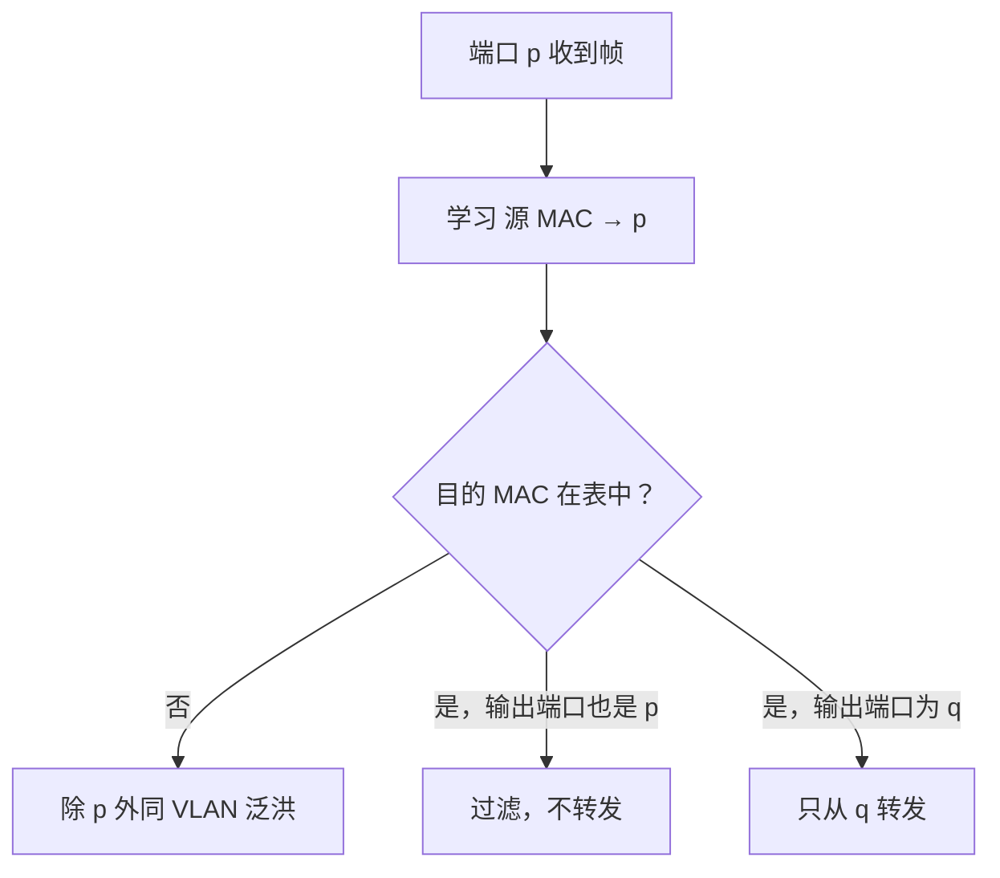

# 3.4 以太网交换

以太网交换机根据目的 MAC 地址选择输出端口，并根据收到帧的源 MAC 地址自动建立转发表。它把每个端口分成独立碰撞域，使多对主机可以并行通信，但默认仍属于同一个广播域。

## 集线器、网桥与交换机

| 设备 | 层次 | 转发单位 | 是否学习 MAC | 碰撞域 |
| --- | --- | --- | --- | --- |
| 集线器 | 物理层 | 比特 | 否 | 所有端口共享一个 |
| 网桥 | 数据链路层 | 帧 | 是 | 每个端口分隔 |
| 以太网交换机 | 数据链路层 | 帧 | 是 | 每个端口独立 |

交换机本质上是多端口、高性能网桥。端口通常以点对点全双工方式连接主机或其他交换机，因此不需要[[3.3 共享以太网与 CSMA-CD|CSMA/CD]]。

## 交换机的能力

- **并行转发**：交换结构可同时连接多对输入、输出端口；
- **帧缓存**：输出端口繁忙时暂存帧，但缓冲区仍可能溢出；
- **速率适配**：不同速率端口之间通过缓存转发；
- **即插即用**：转发表通过源地址学习自动建立；
- **过滤**：目的端与入端口位于同一侧时不必转发。

### 存储转发与直通交换

| 方式 | 决策时机 | 优点 | 代价 |
| --- | --- | --- | --- |
| 存储转发 | 收完整帧并检查后 | 可做 FCS 检查、速率适配和完整处理 | 等待完整帧，时延较高 |
| 直通交换 | 收到目的 MAC 后 | 转发时延低 | 可能把后来才发现有错的帧向前转发 |

实际设备还可能采用碎片隔离或自适应策略，具体行为属于实现选择。

## 自学习算法

交换表至少包含：

```text
MAC 地址 → 输出端口 → 最近更新时间
```

收到帧后执行两步：

1. **学习源地址**：把源 MAC 与入端口写入或刷新交换表；
2. **处理目的地址**：根据目的 MAC 决定转发、过滤或泛洪。



### A、B 通信例子

交换机有四个端口，初始交换表为空：

1. A 从端口 1 向 B 发帧；交换机学习 `A → 1`；
2. B 尚未知，交换机从除端口 1 外的端口泛洪；
3. B 从端口 3 回给 A；交换机学习 `B → 3`；
4. 查到 `A → 1`，只向端口 1 转发；
5. 以后 A、B 之间可直接单播转发。

![[Pasted image 20260715232422.png]]

> [!note] 泛洪不是普通意义的广播帧
> 未知单播帧的目的地址仍是单播地址，只是交换机暂时不知道端口，所以在对应 VLAN 内泛洪。真正的广播帧本来就应发往整个广播域。

## 表项老化与移动

动态表项带有老化时间。长时间未刷新就删除，使端口换线、主机移动或地址变化后能够重新学习。收到同一源 MAC 从新端口进入时，交换机会更新映射。

老化太短会增加未知单播泛洪，太长则可能暂时保留错误路径；具体时间是设备配置和实现参数，不属于以太网帧协议本身。

## 碰撞域与广播域

- 每个全双工交换机端口是独立碰撞域，通常没有实际碰撞；
- 交换机不会默认转发帧到无关端口，但广播和部分多播仍会覆盖整个 VLAN；
- 没有 VLAN 或路由边界时，多台二层交换机连接起来仍构成一个广播域。

这就是交换机提升并行吞吐，却不能单独控制广播规模的原因。

## 二层环路

冗余链路提高物理可用性，但若多个交换机形成二层环路，广播、未知单播等帧可能被反复复制和转发：

![[Pasted image 20260715232431.png]]

可能后果包括：

- 广播风暴占满链路和处理能力；
- 同一帧产生多个副本；
- 同一源 MAC 从不同端口反复出现，导致 MAC 表抖动；
- 以太网帧没有类似 IP TTL 的逐跳寿命字段，无法自行终止循环。

## 生成树协议 STP

生成树协议（Spanning Tree Protocol, STP）在保留物理冗余链路的同时，逻辑阻塞一部分端口，形成无环树结构：


STP 解决二层转发环路，不负责 IP 路由，也不等于把广播域拆分。广播域划分见[[3.4.3 虚拟局域网]]。

## 失败处理

- 输出端口拥塞：缓存排队，缓冲区满后丢帧；
- 未知目的地址：在所属 VLAN 内泛洪；
- 表项失效：等待重新学习；
- 二层环路：依赖 STP 等环路控制机制；
- FCS 错误：存储转发交换机通常丢弃，直通设备可能在错误被发现前已开始转发。

## 本节小结

- 交换机通过源地址学习建立 MAC 表，并按目的地址转发、过滤或泛洪。
- 每个交换端口分隔碰撞域，但普通二层交换不分隔广播域。
- 存储转发能检查完整帧，直通交换以更低时延换取较弱的错误隔离。
- 冗余二层链路会形成转发环路，STP 通过逻辑阻塞构造无环活动拓扑。

> [!info] 章节导航
> 上一节：[[3.3.5 以太网 MAC 层]]　｜　下一节：[[3.4.3 虚拟局域网]]
