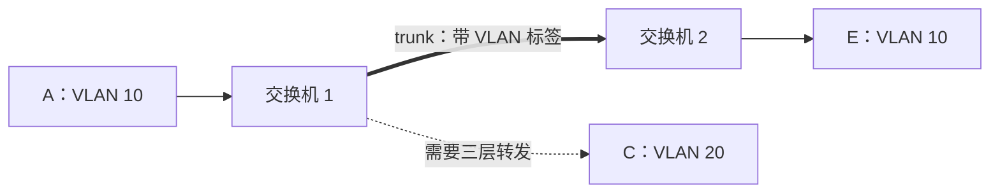

# 3.4.3 虚拟局域网

虚拟局域网（Virtual LAN, VLAN）在同一套交换基础设施上建立多个逻辑二层网络。每个 VLAN 是独立广播域，成员关系可跨越物理位置和交换机。

## VLAN 解决什么

没有 VLAN 时，多台二层交换机连接起来通常构成一个广播域：广播帧、未知单播泛洪和部分多播会扩散到所有端口。VLAN 可以：

- 限制广播传播范围；
- 按部门、业务或管理需求组织二层网络；
- 让同一 VLAN 跨越多台交换机；
- 在不改变物理布线的情况下调整逻辑成员关系。

> [!warning] VLAN 不等于安全加密
> VLAN 提供逻辑隔离和广播边界，但不加密帧，也不能单独抵御错误配置、交换设备失陷或跨 VLAN 路由策略错误。机密性需要加密，访问控制需要防火墙、ACL 和身份策略等机制。

## 802.1Q 标签

跨交换机传递 VLAN 信息时，在源 MAC 与原 EtherType 之间插入 4 B 802.1Q 标签：

![[Pasted image 20260715232439.png]]

```text
目的 MAC | 源 MAC | TPID | TCI | 原 EtherType | 数据 | FCS
  6 B       6 B      2 B   2 B       2 B
```

### 标签字段

- **TPID**：通常为 `0x8100`，表明后面存在 802.1Q 标签；
- **PCP**：3 bit，二层优先级；
- **DEI**：1 bit，拥塞时的丢弃倾向标记；
- **VID**：12 bit，标识 VLAN。

12 bit 可编码 4096 个值，其中 0 和 4095 有特殊用途，通常可配置 VID 为 1～4094。

插入 4 B 标签后，标准最大帧长度从 1518 B 增至 1522 B；帧内容变化后必须重新计算 FCS。

## 接入链路与汇聚链路

| 链路 | 连接对象 | 常见帧形式 | 交换机职责 |
| --- | --- | --- | --- |
| 接入链路（access） | 终端与交换机 | 终端通常发送、接收无标签帧 | 根据端口配置归属 VLAN，进出时关联或移除标签 |
| 汇聚/干线链路（trunk） | 交换机之间或交换机与支持 VLAN 的设备 | 传送多个 VLAN 的带标签帧 | 根据标签保持 VLAN 身份 |

终端通常不知道 VLAN ID；交换机根据接入端口配置把无标签帧归入相应 VLAN。

## 跨交换机示例

交换机 1 与交换机 2 都有 VLAN 10 和 VLAN 20：

![[Pasted image 20260715232445.png]]

1. VLAN 10 内同一交换机的 A→B：可在本交换机内部直接转发；
2. VLAN 10 跨交换机的 A→E：交换机 1 在 trunk 上携带 VLAN 10 标签，交换机 2 根据标签转发到 E 的 access 端口并移除标签；
3. VLAN 10 的 A→VLAN 20 的 C：不能仅靠二层交换直接通信，需要网络层路由。



## 跨 VLAN 通信

不同 VLAN 属于不同二层广播域，通常也对应不同 IP 子网。跨 VLAN 通信必须经过路由器或三层交换机：

- 二层交换根据 MAC 表在 VLAN 内转发；
- 三层设备根据 IP 路由在 VLAN 之间转发；
- 访问控制策略应部署在三层边界或其他安全设备上。

> [!note] 三层交换机仍在执行路由
> “三层交换”通常表示用专用硬件高速完成网络层转发，并不改变跨 VLAN 通信需要网络层决策这一事实。

## 广播域与故障范围

VLAN 缩小广播域，因此广播风暴通常被限制在单个 VLAN 内。但如果 trunk 错误允许过多 VLAN、STP 拓扑异常或 VLAN 配置不一致，故障仍可能跨多台交换机扩散。

配置时需要保持：

- 两端 trunk 允许的 VLAN 集合一致；
- 接入端口归属明确；
- 生成树与 VLAN 拓扑协调；
- 跨 VLAN 路由和访问控制符合信任边界。

## 本节小结

- VLAN 把同一物理交换网络划分为多个逻辑广播域。
- 802.1Q 在以太网帧中插入 TPID 与 TCI，其中 VID 为 12 bit。
- access 端口面向普通终端，trunk 在设备间携带多个 VLAN 的标签帧。
- 同 VLAN 可跨交换机二层转发，不同 VLAN 必须经过网络层路由。
- VLAN 提供逻辑隔离，但不自动提供机密性或完整性。

> [!info] 章节导航
> 上一节：[[3.4 以太网交换]]　｜　下一节：[[3.5 高速以太网与以太网接入]]
