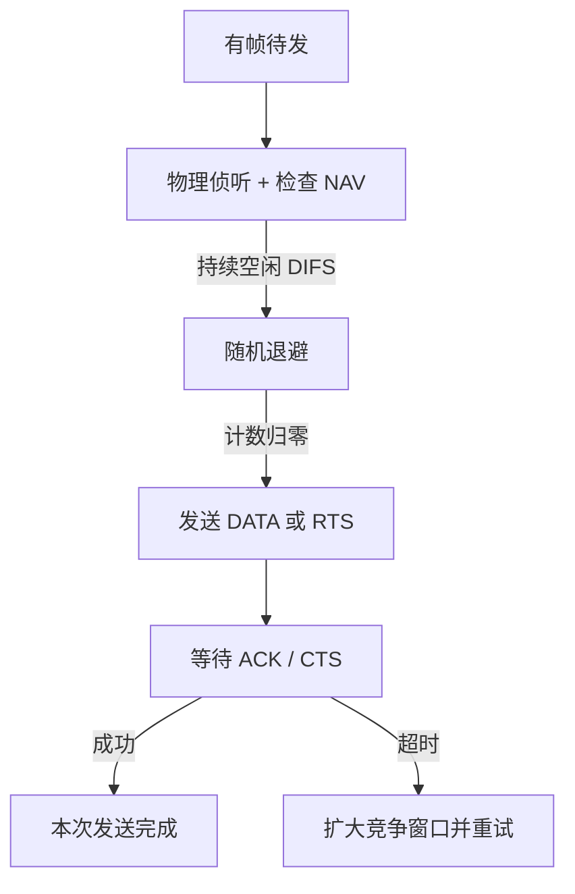

# 9.1 无线局域网 WLAN 与 802.11

IEEE 802.11 无线局域网通过接入点、关联和分布系统组成基础设施网络，并以 CSMA/CA、确认、退避和可选 RTS/CTS 适应共享无线介质。理解 WLAN 的核心，是看清无线侦听的局限以及 802.11 地址字段与分配系统的关系。

> [!abstract] 一句话主线
> **站点先扫描并关联 AP，再以 CSMA/CA 竞争信道；物理载波侦听与 NAV 虚拟侦听共同推迟发送，逐帧 ACK 和退避处理无线碰撞风险。**

> [!tip] 阅读方式
> 先读“核心结构”分清无线介质、接入、移动性与核心网职责，再在“详细展开”中核对教材图、帧字段、信令和历史架构。

## 核心结构

### 基础设施 WLAN

### CSMA/CA 发送主线

| 机制 | 解决的问题 |
| --- | --- |
| DIFS / SIFS | 让 ACK、CTS 等短控制响应优先于新竞争 |
| 随机退避 | 降低多个等待站同时发送的概率 |
| NAV | 根据持续期字段实施虚拟载波侦听 |
| RTS/CTS | 缩短碰撞代价并缓解隐蔽站影响 |
| 逐帧 ACK | 无线发送方不能仅靠监听判断发送成功 |

> [!warning] 关联、认证和获得 IP 是不同阶段
> 802.11 扫描/关联属于链路层；无线接入认证与加密由相应安全机制完成；DHCP 等网络配置通常由网络中的服务器或网关提供，并非每个 AP 必然内置。

## 详细展开

在局域网刚刚问世后的一段时间，无线局域网的发展比较缓慢，原因是价格贵、数据传输速率低、安全性较差，以及使用登记手续复杂（使用无线电频率必须得到有关部门的批准）。但自 20 世纪 80 年代末以来，由于人们工作和生活节奏的加快以及移动通信技术的飞速发展，无线局域网也就逐步进入市场。无线局域网提供了移动接入的功能，这就给许多需要发送数据但又不能坐在办公室的工作人员提供了方便。当一个工厂跨越的面积很大时，若要将各个部门都用电缆连接成网，其费用可能很高；但若使用无线局域网，不仅节省了投资，而且建网的速度也会较快。另外，当大量持有便携式计算机的用户在一个地方同时要求上网时（如在图书馆或股票交易大厅里），若用电缆连网，恐怕连铺设电缆的位置都很难找到。而用无线局域网则比较容易。由于手机普及率日益增高，通过无线局域网接入到互联网已成为当今上网最常用的方式。无线局域网常简写为 WLAN (Wireless Local Area Network)。

请读者注意，便携站(portable station)和移动站(mobile station)表示的意思并不一样。便携站当然是便于移动的，但便携站在工作时其位置是固定不变的。而移动站不仅能够移动，而且还可以在移动的过程中进行通信（正在进行的应用程序感觉不到计算机位置的变化，也不因计算机位置的移动而中断运行）。移动站一般使用电池供电。
## 9.1.1 无线局域网的组成

无线局域网可分为两大类。第一类是有基础设施的，第二类是无基础设施的。本章主要介绍第一类无线局域网。
### 1. IEEE 802.11

对于第一类有基础设施的无线局域网，1997 年 IEEE 制定出无线局域网协议 802.11 系列标准。2003 年 5 月，我国颁布了 WLAN 的国家标准，该标准采用 ISO/IEC 8802-11 系列国际标准，并针对 WLAN 的安全问题，把国家对密码算法和无线电频率的要求纳入了进来。它是基于国际标准的符合我国安全规范的 WLAN 标准，是属于国家强制执行的标准。该国家标准在 2004 年 6 月已经正式执行，不符合此标准的 WLAN 产品将不允许出现在国内市场上。

802.11 是个相当复杂的标准。但简单地说，802.11 就是无线以太网的标准，它使用星形拓扑。无线局域网的中心叫作接入点 AP (Access Point)，它是无线局域网的基础设施，也是一个链路层的设备。接入点 AP 也叫作无线接入点 WAP (Wireless Access Point)。所有在无线局域网中的站点，对网内或网外的通信，都必须通过接入点 AP。现在的无线局域网的接入点 AP 往往具有 100 Mbit/s 或 1 Gbit/s 的端口，用来连接到有线以太网。家庭使用的无线局域网接入点 AP，为了方便居民上网，就把 IP 层的路由器的功能也嵌入进来。因此家用的接入点 AP 往往又称为无线路由器（直接用网线连接到家中墙上的 RJ-45 插孔即可）。但企业或机构使用的接入点 AP 还是和路由器分开的。

802.11 无线局域网的 MAC 层使用 CSMA/CA 协议（在后面的 9.1.3 节讨论）。现在 802.11 系列标准的无线局域网常称为 Wi-Fi。曾经广为流传的“Wi-Fi 是 Wireless-Fidelity 的缩写”其实是错误的（本书的前几个版本也曾这样写过）。这点在 Wi-Fi 的官网可以查到[W-WiFi]。Wi-Fi 是非营利性国际组织 Wi-Fi 联盟(Wi-Fi Alliance)的一个标记。Wi-Fi 联盟对通过其互操作性测试的产品就发给这样的注册商标，表明是经过 Wi-Fi 联盟认证的。从 2000 年起，到 2020 年，全球有 Wi-Fi 注册商标认证的产品已超过 150 亿个。Wi-Fi 的写法并无统一规定，如 WiFi、Wifi、Wi-fi 等都能在文献中见到。

802.11 基础设施网络的基本构件是基本服务集 BSS（Basic Service Set），通常包含一个 AP 和若干站点。管理员为无线网络配置服务集标识符 **SSID**，它是用户可见的网络名称；一个具体 BSS 还由 **BSSID** 标识，基础设施模式下通常对应 AP 无线接口的 MAC 地址。SSID 可以由多个 AP 共同提供，而 BSSID 区分具体无线基本服务集，二者不能混用。

现在简单介绍一下无线局域网所用的信道(channel)的概念。无线局域网通常使用的频段是 2.4 GHz 和 5 GHz 频段。每一个频段又再划分为若干个信道，供各无线局域网使用。例如，在 2.4 GHz 频段中有大约 85 MHz 的带宽可用。802.11b 标准定义了 11 个部分重叠的信道集。相邻信道的中心频率相差 5 MHz，而每个信道的带宽约为 22 MHz。因此，仅当两个信道由四个或更多信道隔开时它们彼此才无重叠。其中，信道 1、6 和 11 的集合是唯一的三个非重叠信道的集合。现在已经广泛使用的无线路由器就是典型的接入点设备，并且在出厂时就预先设置了 SSID 和使用的信道（用户也可以自行更改）。例如，当发现附近的接入点使用的频道对自己有干扰时，就可以重新设置本服务集接入点的工作信道。

一个基本服务集可以是孤立的单个服务集，也可通过接入点 AP 连接到一个分配系统 DS (Distribution System)，然后再连接到另一个基本服务集，这样就构成了一个扩展服务集 ESS (Extended Service Set)。ESS 也有个标识符，是不超过 32 字符的字符串名字而不是地址，叫作扩展服务集标识符 ESSID（如图 9-1 所示）。分配系统的作用就是使扩展的服务集 ESS 对上层 的表现就像一个基本服务集 BSS 一样。分配系统可以使用以太网（这是最常用的）、点对点链路或其他无线网络。扩展服务集 ESS 还可为无线用户提供到 802.x 局域网（也就是非 802.11 无线局域网）的接入。这种接入是通过叫作门户(portal)的设备来实现的。门户是 802.11 定义的新名词，其实它的作用就相当于一个网桥。在一个扩展服务集内几个不同的基本服务集也可能有相交的部分。图 9-1 中的移动站 A 如果要和另一个基本服务集中的移动站 B 通信，就必须经过两个接入点 AP_1 和 AP_2，即 A $\rightarrow$ AP_1 $\rightarrow$ AP_2 $\rightarrow$ B。我们应当注意到，在图 9-1 的例子中，从 AP_1 到 AP_2 的通信是使用有线传输的。
![[Pasted image 20260716172824.png]]
> **[图 9-1 IEEE 802.11 的基本服务集 BSS 和扩展服务集 ESS]**
> *图中有：扩展服务集 ESS，分配系统 DS，门户，互联网，AP_1 (BSSID_1)，AP_2 (BSSID_2)，基本服务集 BSS_1 (SSID_1)，基本服务集 BSS_2 (SSID_2)，移动站 A, B, C, F, E 等。描述了 A 漫游到 AP_2 的过程。*

我们还应当注意到，图 9-1 所示的两个基本服务集的覆盖范围有重合的地方。为了避免在这种重合的地方出现不同信道的相互干扰，这两个接入点所选择的工作信道，必须相隔 5 个或更多的信道。

图 9-1 画出了移动站 A 漫游的情况。但移动站 A 漫游到图中的位置 A_1 时，就能够同时收到两个接入点的信号。这时，移动站 A 可以选择和信号较强的一个接入点联系。当移动站 A 漫游到位置 A_2 时，就只能和接入点 AP_2 联系了。移动站 A 只要能够和其中一个接入点联系上，就一直可保持与另一个移动站 B 的通信。基本服务集的服务范围是由移动站所发射的电磁波的辐射范围确定的。在图 9-1 中用一个虚线椭圆来表示基本服务区的范围。由于实际地形条件可能是多种多样的，一个服务区的覆盖范围可能是很不规则的几何形状。

802.11 标准并没有定义如何实现漫游，但定义了一些基本的工具。例如，一个移动站若要加入一个基本服务集 BSS，就必须先与某个接入点 AP 建立关联(association)。建立关联就表示这个移动站加入了选定的 AP 所属的子网，并和这个接入点 AP 创建了一个虚拟线路。只有已关联的 AP 才向这个移动站发送数据帧，而这个移动站也只有通过关联的 AP 才能向其他站点发送数据帧。这和手机开机后必须和附近的某个基站建立关联的概念是相似的。

移动站与接入点 AP 建立关联的方法有两种。一种是被动扫描（如图 9-2(a)所示），其过程如下：

1. 接入点 AP 周期性发出（例如每秒 10 次）信标帧(beacon frame)，其中包含有若干系统参数（如服务集标识符 SSID 以及支持的速率等）。图 9-2(a)表示移动站 A 收到了两个接入点发出的信标帧。
2. 移动站 A 扫描 11 个信道，选择愿意加入接入点 AP_2 所在的基本服务集 BSS_2，于是向 AP_2 发出关联请求帧(Association Request frame)。
3. 接入点 AP_2 同意移动站 A 发来的关联请求，向移动站 A 发送关联响应帧(Association Response frame)。

这样，移动站 A 就和接入点 AP_2 的关联就建立了。
![[Pasted image 20260716172836.png]]
> **[图 9-2 被动扫描(a)与主动扫描(b)]**
> *(a) 被动扫描：AP_1, AP_2 广播信标帧，A 接收信标帧。
> *(b) 主动扫描：A 发送探测请求帧，AP_1, AP_2 响应探测请求帧。*

另一种建立关联的方法是主动扫描（如图 9-2(b)所示），其步骤如下：

1. 移动站 A 主动发出广播的探测请求帧(Probe Request frame)，让所有能够收到此帧的接入点都能够知道有移动站要求建立关联（见图 9-2(b)中的多个虚线箭头）。
2. 现在两个接入点都回答探测响应帧(Probe Response frame)。
3. 移动站 A 向 AP_2 发出关联请求帧。
4. 接入点 AP_2 向移动站 A 发送关联响应帧，与移动站 A 建立了关联。

为了使一个基本服务集 BSS 能够为更多的移动站提供服务，往往在一个 BSS 内安装有多个接入点 AP。有时一个移动站也可以收到本服务集以外的 AP 信号。移动站只能在多个 AP 中选择一个建立关联。通常可以选择信号最强的一个 AP。但有时也可能该 AP 提供的信道都已被其他移动站占用了。在这种情况下，也只能与信号强度稍差些的 AP 建立关联。

此后，这个移动站就和选定的 AP 互相使用 802.11 关联协议进行对话。移动站还要向该 AP 鉴别自身。关联建立后，移动站可通过 AP 转发 DHCP 发现报文，从网络中的 DHCP 服务器获得配置。家用无线路由器常把 AP、路由和 DHCP 服务集成在一起，但企业 AP 不必承担 DHCP 服务器职责。这时，互联网中的其他部分就把这个移动站当作该 AP 子网中的一台主机。

若移动站使用重关联(reassociation)服务，就可把这种关联转移到另一个接入点。当使用分离(dissociation)服务时，就可终止这种关联。

一个移动站可以同时进行主动扫描和被动扫描，这样可以更加迅速地 和 AP 建立关联。802.11 标准没有规定移动站应选择哪一种扫描方式。但很多移动站愿意使用被动扫描，这样可以节省移动站的电源功率消耗。

现在许多地方，如办公室、机场、快餐店、旅馆、购物中心等都能够向公众提供有偿或无偿接入 Wi-Fi 的服务。这样的地方就叫作热点(hot spot)。由许多热点和接入点 AP 连接起来的区域叫作热区(hot zone)。热点也就是公众无线入网点。

由于无线局域网已非常普及，因此现在无论是智能手机、智能电视机或计算机，其主板上都已经有了内置的无线局域网适配器，能够实现 802.11 的物理层和 MAC 层的功能。只要在无线局域网信号覆盖的地方，用户就能够通过接入点 AP 连接到互联网。

无线网络还需要完成接入认证和链路保护。WEP 存在严重设计缺陷，只应作为历史内容；WPA 是过渡方案，WPA2、WPA3 等后续机制改进了密码与认证能力。家庭预共享口令只是其中一种模式，企业网络还可使用集中认证。能关联 AP、通过身份认证和获得 IP 配置是彼此相关但不同的步骤。
### 2. 移动自组网络

另一类无线局域网是无固定基础设施的无线局域网，它又叫作自组网络(ad hoc network)①。这种自组网络没有上述基本服务集中的接入点 AP，而是由一些处于平等状态的移动站相互通信组成的临时网络（如图 9-3 所示）。图中还画出了当移动站 A 和 E 通信时，经过 A $\rightarrow$ B, B $\rightarrow$ C, C $\rightarrow$ D 和最后 D $\rightarrow$ E 这样一连串的存储转发过程。因此，在从源节点 A 到目的节点 E 的路径中，移动站 B、C 和 D 都是转发节点，这些节点都具有路由器的功能。由于自组网络没有预先建好的网络固定基础设施（基站），因此自组网络的服务范围通常是受限的，而且自组网络一般也不和外界的其他网络相连接（当然也不能接入到互联网）。移动自组网络也就是移动分组无线网络。
![[Pasted image 20260716172845.png]]
> **[图 9-3 由处于平等状态的一些便携机构成的自组网络]**
> *图中显示源节点 A、转发节点 B、转发节点 C、转发节点 D、目的节点 E。节点 F 未参与传输。*

自组网络通常是这样构成的：一些可移动的设备发现在它们附近还有其他的可移动设备，并且要求和其他移动设备进行通信。随着便携式电脑和智能手机的普及，自组网络的组网方式已受到人们的广泛关注。由于在自组网络中的每一个移动站，都要参与到网络中其他移动站的路由的发现和维护，同时由移动站构成的网络拓扑有可能随时间变化得很快，因此在固定网络中行之有效的一些路由选择协议对移动自组网络已不适用。这样，在自组网络中路由选择协议就引起了特别的关注。另一个重要问题是多播。在移动自组网络中往往需要将某个重要信息同时向多个移动站传送。这种多播比固定节点网络的多播要复杂得多，需要有实时性好而效率又高的多播协议。在移动自组网络中，安全问题也是一个更为突出的问题。

移动自组网络在军用和民用领域都有很好的应用前景。在军事领域中，因为战场上往往没有预先建好的固定接入点，其移动站就可以利用临时建立的移动自组网络进行通信。这种组网方式也能够应用到作战的地面车辆群和坦克群，以及海上的舰艇群、空中的机群。由于每一个移动设备都具有路由器转发分组的功能，因此分布式的移动自组网络的生存性非常好。在民用领域，持有笔记本电脑的人可以利用这种移动自组网络方便地交换信息，而不受便携式电脑附近没有电话线插头的限制。当出现自然灾害时，在抢险救灾时利用移动自组网络进行及时通信往往也是很有效的，因为这时事先已建好的网络基础设施（基站）可能都已经被破坏了。

近年来，移动自组网络中的一个子集——无线传感器网络 WSN (Wireless Sensor Network)引起了人们的广泛关注。无线传感器网络是由大量传感器节点通过无线通信技术构成的自组网络。无线传感器网络的应用就是进行各种数据的采集、处理和传输，一般并不需要很高的带宽，但是在大部分时间必须保持低功耗，以节省电池的消耗。由于无线传感器节点的存储容量受限，因此对协议栈的大小有严格的限制。此外，无线传感器网络还对网络安全性、节点自动配置、网络动态重组等方面有一定的要求。

据统计，全球 98% 的处理器并不在传统的计算机中，而是处在各种家电设备、运输工具以及工厂的机器中。如果在这些设备上能够嵌入合适的传感器和无线通信功能，就可能把数量极大的节点连接成分布式的传感器无线网络，因而能够实现连网计算和处理。
![[Pasted image 20260716172852.png]]
> **[图 9-4 是典型的传感器节点的组成]**
> *图中有电池、CPU、存储器、传感器硬件、无线收发器。*

无线传感器网络中的节点基本上是固定不变的，这点和移动自组网络有很大的区别。无线传感器网络的主要应用领域就是组成各种物联网 IoT (Internet of Things)。下面是物联网的一些举例：

1. 环境监测与保护（如洪水预报、动物栖息的监控）；
2. 战争中对敌情的侦查和对兵力、装备、物资等的监控；
3. 医疗中对病房的监测和对患者的护理；
4. 在危险的工业环境（如矿井、核电站等）中的安全监测；
5. 城市交通管理、建筑内的温度/照明/安全控制等。

关于无线传感器网络更详细的内容可参阅[COMM02]。

顺便指出，移动自组网络和移动 IP 并不相同。移动 IP 技术使漫游的主机可以用多种方式连接到互联网。漫游的主机可以直接连接到或通过无线链路连接到固定网络上的另一个子网。支持这种形式的主机移动性需要地址管理和增加协议的互操作性，但移动 IP 的核心网络功能仍然是基于在固定网络中一直在使用的各种路由选择协议。但移动自组网络是把移动性扩展到无线领域中的自治系统，它具有自己特定的路由选择协议，并且可以不和互联网相连。即使在和互联网相连时，移动自组网络也是以末梢网络(stub network)方式工作的。所谓“末梢网络”就是通信量可以进入末梢网络，也可以从末梢网络发出，但不允许外部的通信量穿越末梢网络。

最后需要弄清在文献中经常要遇到的、与接入有关的几个名词。

*   **固定接入(fixed access)**——在作为网络用户期间，用户设置的地理位置保持不变。
*   **移动接入(mobility access)**——用户设备能够以车辆速度（一般取为 120 km/h）移动时进行网络通信。当发生切换（即用户移动到不同蜂窝小区）时，通信仍然是连续的。
*   **便携接入(portable access)**——在受限的网络覆盖面积中，用户设备能够在以步行速度移动时进行网络通信，提供有限的切换能力。
*   **游牧接入(nomadic access)**——用户设备的地理位置至少在进行网络通信时保持不变。如果用户设备移动了位置（改变了蜂窝小区），那么再次进行通信时可能还要寻找最佳的基站。
*   也有的文献把便携接入和游牧接入当作一样的，定义为可以在通信时以步行速度移动。这点在阅读文献时应加以注意。
## 9.1.2 802.11 局域网的物理层

802.11 标准中物理层相当复杂。限于篇幅，这里对无线局域网的物理层不能展开讨论。根据物理层的不同（如工作频段、数据率、调制方法等），对应的标准也不同。最早流行的无线局域网是 802.11b、802.11a 和 802.11g。2009 年以后又公布了新的标准 802.11n、802.11ac 以及 802.11ax（见表 9-1）。为了使无线局域网的适配器能够适应多种标准，很多适配器都做双模的（802.11a/g）或多模的（例如，802.11a/b/g/n/ac）。顺便说一下，“别名”并非一开始就有的。在 802.11 以后的新标准就在原来的 802.11 后面增加一个英文字母。但 26 个英文字母很快就用完了。这时就采用附加两个英文字母的办法。在 2018 年，人们普遍感到无线局域网的名字太难记忆时，Wi-Fi 联盟就决定使用 Wi-Fi 4/5/6 作为 802.11n/ac/ax 的别名。随后也顺便把 Wi-Fi 1/2/3 作为最早流行的三种无线局域网的别名。

**表 9-1 几种常用的 802.11 无线局域网**

| 标准 | 别名 | 频段 | 最高数据率 | 物理层 | 优缺点 |
| :--- | :--- | :--- | :--- | :--- | :--- |
| 802.11b (1999年) | Wi-Fi 1 | 2.4 GHz | 11 Mbit/s | 扩频 | 最高数据率较低，价格最低，信号传播距离最远，且不易受阻碍 |
| 802.11a (1999年) | Wi-Fi 2 | 5 GHz | 54 Mbit/s | OFDM | 最高数据率较高，支持更多用户同时上网，价格最高，信号传播距离较短，且易受阻碍 |
| 802.11g (2003年) | Wi-Fi 3 | 2.4 GHz | 54 Mbit/s | OFDM | 最高数据率较高，支持更多用户同时上网，信号传播距离最远，且不易受阻碍，价格比 802.11b 贵 |
| 802.11n (2009年) | Wi-Fi 4 | 2.4/5 GHz | 600 Mbit/s | MIMO | 使用多个发射和接收天线达到更高的数据传输率，当使用双倍带宽(40 MHz)时速率可达 600 Mbit/s |
| 802.11ac (2014年) | Wi-Fi 5 | 5 GHz | 7 Gbit/s | MIMO | 完全遵循 802.11i 安全标准的所有内容，使得无线连接能够在安全性方面达到企业级用户的需求 |
| 802.11ax (2019年) | Wi-Fi 6 | 2.4/5 GHz | 9.6 Gbit/s | MIMO | 侧重解决密集环境下（如火车站、机场）提高吞吐量密度（即单位面积的吞吐量） |

> [!note] 教材注记
> 在物理层使用的 OFDM 是 Orthogonal Frequency Division Multiplexing (正交频分复用)的缩写。MIMO 是 Multiple Input Multiple Output (多入多出)的缩写，即空间分集，使用多空间通道，即利用物理上完全分离的 4 个发射天线和 4 个接收天线，对不同数据进行不同的调制/解调，因而提高了数据的传输速率。

表 9-1 中 802.11ax 又称高效率无线局域网 HEW (High-Efficiency WLAN)，商业名称为 Wi-Fi 6/6E，重点改善密集环境下的频谱利用、并发和时延表现。表中最高数据率是特定信道宽度、空间流数与调制条件下的理论值，不能直接代表单个终端的实测速率。802.11be 的商业名称为 Wi-Fi 7，面向极高吞吐量 EHT (Extremely High Throughput)，通过更宽信道、多链路操作和更高阶调制等机制提升容量与时延表现；它已不应再表述为“可能在 2024 年完成”的未来研究项目。

2016 年的 802.11ah，工作频段在 900 MHz，最高数据率为 18 Mbit/s，这种无线局域网的功耗低、传输距离长（最长可达 1 km），很适合于物联网设备之间的通信。

无线局域网最初还使用过跳频扩频 FHSS (Frequency Hopping Spread Spectrum)和红外技术 IR (InfraRed)，但现在已经很少使用了。

以上几种标准都使用共同的媒体接入控制协议，都可以用于有固定基础设施的或无固定基础设施的无线局域网。除 IEEE 的 802.11 委员会外，欧洲电信标准协会 ETSI (European Telecommunications Standards Institute)的 RES10 工作组也为欧洲制定无线局域网的标准，他们把这种局域网取名为 HiperLAN。ETSI 和 IEEE 的标准是可以互操作的。

下面我们讨论 802.11 标准的 MAC 层协议。
## 9.1.3 802.11 局域网的 MAC 层协议
### 1. CSMA/CA 协议

虽然 CSMA/CD 协议已成功地应用于使用有线连接的局域网，但无线局域网能不能也使用 CSMA/CD 协议呢？下面我们从无线信道本身的特点出发来详细讨论这个问题。

“碰撞检测”要求一个站点在发送本站数据的同时，还必须不间断地检测信道。一旦检测到碰撞，就立即停止发送。但由于无线信道的传输条件特殊，其信号强度的动态范围非常大，因此在 802.11 适配器上接收到的信号强度往往会远远小于发送信号的强度（信号强度可能相差百万倍）。因此无线局域网的适配器无法实现碰撞检测。

我们知道，无线电波能够向所有的方向传播，其传播距离有限。当电磁波在传播过程中遇到障碍物时，其传播距离就会受到限制。如图 9-5 所示的例子就是无线局域网的隐蔽站问题。我们假定每个移动站的无线电信号传播范围都是以发送站为圆心的一个圆形面积。
![[Pasted image 20260716172900.png]]
> **[图 9-5 A 和 C 同时向 B 发送数据，发生碰撞]**
> *(a) A 的作用范围未覆盖 C，C 的作用范围未覆盖 A。A 和 C 都向 B 发送数据，发生碰撞。*
> *(b) A、B、C 之间有障碍物（例如高山），A 和 C 彼此为隐蔽站，同时向 B 发送数据。*

图 9-5(a)表示站点 A 和 C 都想和 B 通信（这里仅仅是讲解隐蔽站问题的原理，在通信的过程中省略了接入点 AP）。可以把 B 看成是接入点 AP。但 A 和 C 相距较远，彼此都检测不到对方发送的信号。当 A 和 C 检测到信道空闲时，就都向 B 发送数据，结果发生了碰撞，并且无法检测出这种碰撞。这就是**隐蔽站问题**(hidden station problem)。所谓隐蔽站，就是它发送的信号检测不到，但却能产生碰撞。这里 C 是 A 的隐蔽站，A 也是 C 的隐蔽站。

当移动站之间有障碍物时也有可能出现上述问题。例如，图 9-5(b)的三个站点 A、B 和 C 彼此距离都差不多。从距离上看，彼此都应当能够检测到对方发送的信号。但 A 和 C 之间有高楼或高山，因此 A 和 C 都互相成为对方的隐蔽站。若 A 和 C 同时向 B 发送数据就会发生碰撞，使 B 无法正常接收。此时也无法检测出碰撞。

综上所述，在制定无线局域网的协议时，必须考虑以下特点：
1. 无线局域网的适配器无法实现碰撞检测。
2. 检测到信道空闲，其实信道可能并不空闲；
3. 即使我们能够在硬件上实现无线局域网的碰撞检测功能，也无法检测出隐蔽站问题带来的碰撞。

我们知道，CSMA/CD 有两个要点。一是发送前先检测信道，信道忙就不发送。二是边发送边检测信道，一发现碰撞就立即停止发送，并执行退避算法进行重传。因此偶尔发生的碰撞并不会使局域网的运行效率降低很多。无线局域网虽然可以使用 CSMA，但无法使用碰撞检测（由上述无线局域网特点(1)和(3)决定的），一旦开始发送数据，就一定要把整个帧发送完毕；一旦发生碰撞，整个信道资源的浪费就比较严重。

为此，802.11 局域网使用 CSMA/CA 协议①。CA 表示 Collision Avoidance，是碰撞避免的意思，或者说，协议的设计是要尽量减少碰撞发生的概率。这点和使用有线连接的以太网有很大的区别。以太网当然不希望发生碰撞，但并不怕发生碰撞，因为碰撞的影响并不大。

> [!note] 教材注记
> 有的资料称这种协议为具有碰撞避免的多点接入 MACA (Multiple Access with Collision Avoidance)。

802.11 局域网在使用 CSMA/CA 的同时，还使用停止等待协议。这是因为无线信道的通信质量远不如有线信道的，因此无线站点每通过无线局域网发送完一帧后，要等到收到对方的确认帧后才能继续发送下一帧。这就是**链路层确认**。链路层确认也是解决碰撞后重传的手段。

我们在进一步讨论 CSMA/CA 协议之前，先要介绍 802.11 的 MAC 层。

802.11 标准设计了独特的 MAC 层（如图 9-6 所示）。它通过协调功能(Coordination Function)来确定在基本服务集 BSS 中的移动站，在什么时间能发送数据或接收数据。802.11 的 MAC 层在物理层的上面，它包括两个子层。
![[Pasted image 20260716172909.png]]
> **[图 9-6 802.11 的 MAC 层]**
> *图的左侧为 MAC 层，包含点协调功能 PCF（无争用服务，选用）和分布协调功能 DCF（争用服务，必须实现）。右侧为物理层。*

1. **分布协调功能 DCF (Distributed Coordination Function)**。DCF 不采用任何中心控制，而是在每一个节点使用 CSMA 机制的分布式接入算法，让各个站通过争用信道来获取发送权。因此 DCF 向上提供争用服务。802.11 标准规定，所有的实现都必须有 DCF 功能。为此，定义了两个非常重要的时间间隔，即短帧间间隔 SIFS (Short Inter-Frame Spacing)和分布协调功能帧间间隔 DIFS (DCF IFS)。关于这两个时间间隔后面还要讲到。802.11 标准还定义了其他几种时间间隔，这里从略。
2. **点协调功能 PCF (Point Coordination Function)**。PCF 是选项，是用接入点 AP 集中控制整个 BSS 内的活动，因此自组网络就没有 PCF 子层。PCF 使用集中控制的接入算法，用类似于探询的方法把发送数据权轮流交给各个站，从而避免了碰撞的产生。对于时间敏感的业务的，如分组话音，就应使用提供无争用服务的点协调功能 PCF。

我们目前大量使用的无线局域网都是使用上述的分布协调功能 DCF。

CSMA/CA 协议比较复杂。IEEE 的 802.11-2007 标准文档共有 1232 页之多。这里介绍 CSMA/CA 协议的要点如下：
1. 站点若想发送数据必须先监听信道。若信道在时间间隔 DIFS 内均为空闲，则发送整个数据帧。否则，进行(2)。
2. 站点选择一个随机数，设置退避计时器。计时器的运行规则是：若信道忙，则冻结退避计时器，继续等待，直至信道变为空闲（这叫推迟接入）；若信道空闲，并在时间间隔 DIFS 内均为空闲，则开始争用信道，进行倒计时。当退避计时器的时间减到零时（显然这只能发生在信道空闲时），站点就发送数据帧，把一整帧发完。
3. 站点若收到接收方发来的确认帧，且还有后续帧要发送，就转到(2)。若在设定时间内未收到确认，则准备重传，转到(2)，但会在更大的范围内选择一随机数。

下面详细解释上述协议中的内容。
### 2. 时间间隔 DIFS 的重要性

在图 9-7 中，站点 A 要向站点 B 发送数据。A 监听信道。若信道在时间间隔 DIFS 内一直都是空闲的（理由下面将要讲到），A 就可以在 $t_0$ 时间发送数据帧 DATA。B 收到后立即发回确认帧 ACK。B 开始发送确认帧的时刻，实际上必然略滞后于 B 收完 DATA 的时间，滞后 的时间是 SIFS。这是因为 B 收到数据帧后，必须进行 CRC 检验。若检验无差错，再从接收状态转为发送状态，这些动作不可能在瞬间完成。SIFS 值在 802.11 标准中均有规定。因此，从 A 发送数据帧 DATA 开始，到收到确认帧 ACK 为止的这段时间(DATA + SIFS + ACK)，必须不允许任何其他站发送数据，这样才不会发生碰撞。为此，802.11 标准规定了每个站必须同时使用以下的两个方法。
![[Pasted image 20260716172915.png]]
> **[图 9-7 A 向 B 发送数据，B 发回确认]**
> *A 发送 DATA 帧，B 在 SIFS 间隔后回复 ACK。中间包括 DIFS 和 $t_0$、$t_1$、$t_2$ 时刻。信道忙、NAV 置位，其他站在此期间不得发送。*

第一个方法是用软件实现的**虚拟载波监听** (Virtual Carrier Sense) 的机制。这就是让源站 A 把要占用信道的时间（即 DATA + SIFS + ACK），以微秒为单位，写入其数据帧 DATA 的首部（在后面的 9.1.4 节还要介绍首部的各字段）。所有处在站点 A 的广播范围内的各站，都能够收到这一信息，并创建自己的**网络分配向量 NAV** (Network Allocation Vector)。NAV 指出了信道忙的持续时间，意思是：“A 和 B 以外的站点都不能在这段时间发送数据”。

第二个方法是在物理层用硬件实现**载波监听**。每个站检查收到的信号强度是否超过一定的门限数值，用此判断是否有其他移动站在信道上发送数据。任何站要发送数据之前，必须监听信道。只要监听到信道忙，就不能发送数据。

从图 9-7 可以看出，$t_1$ 至 $t_2$ 这段时间 SIFS，信道是空闲的。为了保证在这小段空闲时间不让其他站点发送数据，802.11 标准定义了比 SIFS 更长的时间间隔 DIFS (DCF IFS)，并且规定，凡在空闲时间想发送数据的站点，必须等待时间 DIFS 后才能发送。这就保证了确认帧 ACK 得以优先发送。这个重要措施使得在这段时间(DATA + SIFS + ACK)，整个信道好像是 A 和 B 专用的，因为其他站点暂时都不能发送数据。
### 3. 争用信道的过程

现假定在站点 A 和 B 通信的过程中，站点 C 和 D 也要发送数据（如图 9-8 所示）。但 C 和 D 检测到信道忙，因此必须推迟接入(defer access)，以免发生碰撞。很明显，如果有两个或更多的站，在等待信道进入空闲状态后，大家都经过规定的时间间隔 DIFS 再同时发送数据，那么必然产生碰撞。因此，协议 CSMA/CA 规定，所有推迟接入的站，必须在争用期执行统一的退避算法开始公平地争用信道。
![[Pasted image 20260716172924.png]]
> **[图 9-8 在争用期根据退避算法公平竞争]**
> *图示 A 站使用信道发送完数据帧 B: ACK $\rightarrow$ A。C 和 D 站有数据要发送，它们检测到信道忙，进行推迟接入。当信道空闲并经过 DIFS 后，进入争用期。C 随机选择退避时间 3，D 随机选择 9。C 先退避完，发送数据；D 冻结退避计数器，等待下一次空闲。*

图 9-8 中的争用期也叫作争用窗口 CW (Contention Window)。争用窗口由许多时隙(time slot)组成。例如，争用窗口 CW = 15 表示窗口大小是 15 个时隙。时隙长度是这样确定的：在下一个时隙开始时，每个站点都能检测出在前一个时隙开始时信道是否忙（这样就可采取适当对策）。时隙的长短在不同 802.11 标准中可以有不同的数值。例如，802.11g 规定一个时隙时间为 9 $\mu$s，SIFS = 10 $\mu$s，而 DIFS 应比 SIFS 的长度多两个时隙，因此 DIFS = 28 $\mu$s。

退避算法规定，站点在进入争用期时，在 $0 \sim \text{CW}$ 个时隙中随机生成一个退避时隙数，并设置退避计时器 (backoff timer)。当几个站同时争用信道时，计时器最先降为零的站，就首先接入媒体，发送数据帧。这时信道转为忙，而其他正在退避的站则冻结其计时器，保留计时器的数值不变，推迟在下次争用信道时接着倒计时。这样的规定对所有的站是公平的。

例如，图 9-8 中的站点 C 的退避时隙数为 3，而站点 D 的退避时隙数为 9。当经过 3 个时隙后，站点 C 获得了发送权，立即发送数据帧，信道转为忙状态。站点 D 随即冻结其剩余的 6 个时隙，推迟到下一个争用信道时间的到来。如果此后没有其他站要发送数据，那么经过剩余的 6 个退避时隙，站点 D 就可以发送数据了。

请注意“推迟接入”和“退避(backoff)”的区别。推迟接入发生在信道处于忙的状态，为的是等待争用期的到来，以便执行退避算法来争用信道。而退避是争用期各站点执行的算法，退避计时器进行倒计时。这时信道是空闲的，并且总是出现在时间间隔 DIFS 的后面（如图 9-8 所示）。

802.11 标准并未规定争用窗口 CW 的初始值，但建议 CW 最小值可取为 15，最大值为 1023。

为了减少碰撞的机会，协议 CSMA/CA 规定，如果未收到确认帧（可能是发生碰撞，或数据帧传输出错等），则必须重传。但每重传一次，争用窗口的数值就近似加倍增大。

例如，假定选择初始争用窗口 CW = $2^4 - 1 = 15$，那么首次争用信道时，随机退避时隙数应在 $0 \sim 15$ 之间生成。在进行重传时，第 $i$ 次重传的争用窗口 CW = $2^{i+1} - 1$。

*   第 1 次重传时，随机退避的时隙数应在 $0 \sim 31$ 之间生成。
*   第 2 次重传时，随机退避的时隙数应在 $0 \sim 63$ 之间生成。
*   第 3 次重传时，随机退避的时隙数应在 $0 \sim 127$ 之间生成。
*   第 4 次重传时，随机退避的时隙数应在 $0 \sim 511$ 之间生成。
*   第 5 次以及 5 次以上重传时，随机退避的时隙数应在 $0 \sim 1023$ 之间生成，争用窗口 CW 不再增大了。

采用上面这些措施，发生几个站同时发送数据的概率可以大大减小。

归纳以上的讨论可以得出如下结论：当站点想发送数据，并检测信道连续空闲时间超过 DIFS 时，即可立即发送数据，而不必经过争用期。

在以下几种情况下，发送数据必须经过争用期的公平竞争：
1. 要发送数据时检测到信道忙。
2. 已发出的数据帧未收到确认，重传数据帧。
3. 接着发送后续的数据帧。

上述的(3)是为了防止一个站长期垄断发送权。若一站点要连续发送若干数据帧，则不管有无其他站争用信道，都必须进入争用期（如图 9-9 所示）。
![[Pasted image 20260716172933.png]]
> **[图 9-9 只有 A 站连续发送数据]**
> *A 站发送数据后，进入 DIFS，接着争用期 CW，然后占用信道。持续到后续发送。*

即使有了上述措施，碰撞仍有可能发生。例如，B 站正好在图 9-9 中 A 占用信道时要发送数据。B 检测到信道忙，于是推迟到争用信道时与 A 一起争用信道。但正巧 A 和 B 又生成了同样大小的随机退避时隙数。结果就发生了碰撞，A 和 B 都必须重传。这就浪费了宝贵的信道资源。因此，要进一步减少碰撞的机会，还需要再采用一些措施。这就是下面要介绍的信道预约。
### 4. 对信道进行预约

为了更好地解决隐蔽站带来的碰撞问题，802.11 允许要发送数据的站对信道进行预约。我们假定在图 9-10 中的 A 站要和 B 站通信。显然，A 站和 B 站的通信都必须通过接入点 AP 的转发。在前面图 9-7 和图 9-8 中讲解原理时，我们都把接入点 AP 省略了。下面我们要画出 A 站和 AP 之间交换的信息，但为简单起见，图中省略了 AP 和 B 站之间交换的信息。

我们再假定，A 站或 B 站向接入点 AP 发送数据时，远处的 C 站接收不到这些信号，而 C 站向 AP 发送的信号也传播不到远处的 A 站或 B 站。

在 A 站向 AP 发送数据帧 DATA 之前，先发送一个很短的控制帧，叫作请求发送 RTS (Request To Send)，目的是告诉所有能够收到 RTS 帧的站：“我将要占用信道一段时间：[SIFS + CTS + SIFS + DATA + SIFS + ACK]”。这段时间写在控制帧 RTS 的首部中。A 站发送的 RTS 帧，B 站能够收到，但远处的 C 站收不到。

接入点 AP 若正确收到 RTS 帧，经过最短的时间间隔 SIFS 后，就向 A 站发送一个叫作允许发送 CTS (Clear To Send) 的控制帧，目的不仅仅是告诉 A 站：“你可以发送数据了”，而且也是告诉所有能够收到 CTS 帧的站：“A 站和我通信，要占用信道一段时间：[SIFS + DATA + SIFS + ACK]”。这段时间是写在控制帧 CTS 的首部中。AP 发送的 CTS 帧，A 站和 B 站以及 C 站都能够收到。

在随后 A 站发送的 DATA 帧的首部中，也写入了时间[DATA + SIFS + ACK]。如果有的站没有收到 RTS 和 CTS 帧，那么收到 DATA 帧后，也能设置其 NAV。

以上措施就使得 A 站和接入点 AP（以及 A 站和 B 站）的通信过程中，发生碰撞的概率大大降低，特别是减少了隐蔽站的干扰问题。
![[Pasted image 20260716172940.png]]
> **[图 9-10 发送 RTS 帧和 CTS 帧对信道进行预约]**
> *图示 A 发送 RTS 给 AP，AP 在 SIFS 后回复 CTS，A 在 SIFS 后发送 DATA，AP 在 SIFS 后发送 ACK。C 是隐蔽站。同时显示收到的 RTS、CTS、DATA 帧的站设置 NAV 的时间线。*

显然，增加使用 RTS 帧和 CTS 帧会使整个网络的通信效率有所下降，要多浪费信道的时间[RTS + SIFS + CTS + SIFS]。但由于这两种控制帧都很短，其长度分别为 20 字节和 14 字节，与数据帧（最长可达 2346 字节）相比开销不算大。相反，若不使用这种控制帧，则一旦发生碰撞而导致数据帧重发，浪费的时间就更多了。

从图 9-10 可以看出，即使我们使用 RTS 和 CTS 对信道进行了预约，但碰撞也有可能发生。例如，有的站可能在时间 $t_1$ 或 $t_2$ 就发送了数据（这些站可能是没有收到 RTS 帧或 CTS 帧或 NAV），结果必定与 RTS 帧或 CTS 帧发生碰撞。A 站若收不到 CTS 帧，就不能发送数据帧，而必须重传 RTS 帧。A 站只有正确收到 CTS 帧后才能发送数据帧。但我们可以看出，在使用信道预约的情况下，即使发生了碰撞，信道资源的浪费是很小的。

信道预约不是强制性规定。各站可以自己决定使用或不使用信道预约。看来，只有当数据帧的长度超过某一数值时，使用 RTS 帧和 CTS 帧才比较有利。

因为无线信道的误码率比有线信道的高的多，所以，无线局域网的 MAC 帧长一般应当短些，以便在出错重传时减小开销。这样，有时就必须将太长的帧进行分片。

最后，我们要提一下关于无线局域网的数据发送速率问题。在第 2 章的 2.3.2 节的图 2-13 中，已经指出无线信道中的误码率与信噪比（信道状况）以及所选择的调制技术（包括数据率）有关。802.11 标准并没有对无线局域网数据率的自适应算法有具体的标准或规定。但生产无线局域网适配器的厂商，一般都使自己的产品能够自适应地改变数据率，以便更好地适应信道特性的变化。例如，可以采用这样的算法：如果一连发送两个数据帧但都没有收到确认，就认为信道的质量较差，这时就把数据率调慢一挡。反之，如果此后又能够连续收到 10 个数据帧的确认，那么就可以认为信道质量改善了，因而可以把数据率调快一挡。这与协议 TCP 中的拥塞控制的处理思路是相似的。
## 9.1.4 802.11 局域网的 MAC 帧

为了更好地了解 802.11 局域网的工作原理，我们应当进一步了解 802.11 局域网的 MAC 帧的结构。802.11 帧共有三种类型，即控制帧、数据帧和管理帧。通过图 9-11 所示的 802.11 局域网的数据帧和三种控制帧的主要字段，可以进一步了解 802.11 局域网的 MAC 帧结构。
![[Pasted image 20260716172952.png]]
> **[图 9-11 802.11 局域网的帧格式]**
> *(a) 数据帧格式（帧控制字段中的子类型为0000）：字节 2, 2, 6, 6, 6, 2, 6, 2, 0~2312, 4。字段：帧控制、持续期、地址1、地址2、地址3、序号控制、地址4、帧主体、FCS。下面有帧控制的位级结构：协议版本、类型、子类型、去往AP、来自AP、更多分片、重试、功率管理、更多数据、WEP、顺序。*
> *(b) RTS 帧格式：帧控制、持续期、接收地址、发送地址、FCS。*
> *(c) CTS 和 ACK 帧格式：帧控制、持续期、接收地址、FCS。*

1. MAC 首部，共 30 字节。帧的复杂性都在帧的 MAC 首部。
2. 帧主体，也就是帧的数据部分，不超过 2312 字节。这个数值比以太网的最大长度长很多。不过 802.11 帧的长度通常都小于 1500 字节。
3. 帧检验序列 FCS 是 MAC 尾部，共 4 字节。
### 1. 关于 802.11 数据帧的地址

802.11 数据帧最特殊的地方就是有四个地址字段。这几个地址与帧控制字段中的“去往 AP”（移动站发送到接入点）和“来自 AP”（从接入点发往移动站）这两个子字段的数值有关。

*   地址 1 永远是接收地址（即直接接收数据帧的节点地址）。
*   地址 2 永远是发送地址（即实际发送数据帧的节点地址）。
*   地址 3 和地址 4 取决于数据帧中的“来自 AP”和“去往 AP”这两个字段的数值。

这里要再强调一下，上述地址都是 MAC 地址，即硬件地址（在数据链路层不可能使用 IP 地址），而 AP 的 MAC 地址就是在 9.1.1 节介绍的 BSSID。表 9-2 给出了 802.11 帧的地址字段最常用的两种情况（在有基础设施的网络中一般只使用前三种地址，很少使用仅在自组移动网络中使用的地址 4）。

**表 9-2 802.11 帧的地址字段最常用的两种情况**

| 去往 AP | 来自 AP | 地址 1 | 地址 2 | 地址 3 | 地址 4 |
| :---: | :---: | :--- | :--- | :--- | :--- |
| 0 | 1 | 接收地址 = 目的地址 | 发送地址 = AP 地址 | 源地址 | — |
| 1 | 0 | 接收地址 = AP 地址 | 发送地址 = 源地址 | 目的地址 | — |

> [!note] 教材注记
> 802.11 标准上使用的名词是分配系统 DS，但在解释中，指出这里的 DS 也包含接入点 AP。因此我们在这里使用接入点 AP 代替 DS。

现假定在一个基本服务集中的站点 A 向站点 B 发送数据帧。在站点 A 发往接入点 AP 的数据帧的帧控制字段中，“去往 AP = 1”而“来自 AP = 0”。

**A $\rightarrow$ AP 的数据帧首部：**
*   地址 1：接收地址（不是目的地址）是 AP 的地址 BSSID。
*   地址 2：发送地址，即源地址，也就是站点 A 的地址 MAC$_A$。
*   地址 3：目的地址（不是接收地址）是站点 B 的地址 MAC$_B$。

接入点 AP 收到数据帧后，转发给站点 B，但在数据帧的帧控制字段中，“去往 AP = 0”而“来自 AP = 1”。

**AP $\rightarrow$ B 的数据帧首部：**
*   地址 1：接收地址就是目的地址 MAC$_B$。
*   地址 2：发送地址（不是源地址）是接入点 AP 的地址 BSSID。
*   地址 3：源地址（不是发送地址）是站点 A 的地址 MAC$_A$。

下面讨论另一种稍复杂些的情况，即站点 A 向站点 B 发送数据帧（如图 9-12 所示）。现在 A 和 B 分别处在不同的两个子网 N$_1$ 和 N$_2$ 中，因此在网络层看，是地址为 IP$_A$ 的站点 A，把 IP 数据报从子网 N$_1$ 经过路由器 R 转发到子网 N$_2$。在网络层看不见链路层的接入点 AP$_1$ 和 AP$_2$。IP 数据报必须装入链路层的帧才能在链路层发送。但链路层不认识 IP 地址，只认识 MAC 地址，即硬件地址。站点 A 使用协议 ARP 获得了默认路由器 R 的接口 1 的地址 MAC$_{R-1}$。这样，站点 A 先把 802.11 数据帧发到接入点 AP$_1$，然后 AP$_1$ 把 802.11 帧转换为 802.3 帧，发送到路由器 R 的接口 1。站点 A 发送的 802.11 帧的帧控制字段中，“去往 AP = 1”而“来自 AP = 0”。
![[Pasted image 20260716173000.png]]
> **[图 9-12 链路上的 802.11 帧和 802.3 帧]**
> *A 传输到 AP$_1$，AP$_1$ 转成 802.3 发送给路由器 R 的接口 0，路由器 R 的接口 1 发送给 AP$_2$，AP$_2$ 转换成 802.11 发送给 B。*

**A $\rightarrow$ AP$_1$ 的 802.11 数据帧首部：**
*   地址 1：接收地址（不是目的地址）是 AP$_1$ 的地址 BSSID$_1$。
*   地址 2：发送地址，即源地址，也就是站点 A 的地址 MAC$_A$。
*   地址 3：目的地址（不是接收地址）是本子网中路由器 R 接口 1 的地址 MAC$_{R-1}$。

当接入点 AP$_1$ 收到 802.11 数据帧后，就转换成 802.3 帧（802.3 帧只有两个地址），其目的地址是 MAC$_{R-1}$，而源地址是 MAC$_A$（而不是接入点 AP$_1$ 的地址 BSSID$_1$）。

路由器 R 收到 802.3 帧后，剥去首部和尾部，上交给网络层。网络层根据 IP 数据报首部中的目的地址 IP$_B$ 查找转发表，知道应从接口 2 转发给地址为 IP$_B$ 的设备。再使用协议 ARP，获得此设备的硬件地址是 MAC$_B$，这个地址就是 802.3 帧的目的地址，路由器 R 接口 2 的地址 MAC$_{R-2}$ 是这个 802.3 帧的源地址。

接入点 AP$_2$ 收到 802.3 帧，将其转换为 802.11 帧，其帧控制字段中，“去往 AP = 0”而“来自 AP = 1”。

**AP$_2$ $\rightarrow$ B 的 802.11 帧首部：**
*   地址 1：接收地址（即目的地址）是站点 B 的地址 MAC$_B$。
*   地址 2：发送地址是 AP$_2$ 的地址 BSSID$_2$。
*   地址 3：源地址（不是发送地址）是路由器 R 接口 2 的地址 MAC$_{R-2}$。
### 2. 序号控制字段、持续期字段和帧控制字段

下面再介绍 802.11 数据帧中其他的一些字段。

1. **序号控制字段**共 16 位，其中**序号子字段**占 12 位（从 0 开始，每发送一个新帧就加 1，到 4095 后再回到 0），**分片子字段**占 4 位（不分片则保持为 0。如分片，则帧的序号子字段保持不变，而分片子字段从 0 开始，每个分片加 1，最多到 15）。重传的帧的序号和分片子字段的值都不变。序号控制的作用是使接收方能够区分开是新传送的帧还是因出现差错而重传的帧。这和运输层讨论的序号的概念是相似的。
2. **持续期字段**共 16 位。在 9.1.3 小节第 4 部分“对信道进行预约”中已经讲过 CSMA/CA 协议允许发送数据的站点预约信道一段时间（见前面的图 9-10 的例子），并把这段时间写入到持续期字段中。这个字段有多种用途（这里不对这些用途进行详细的说明），只有最高位为 0 时才表示持续期。这样，持续期不能超过 $2^{15} - 1 = 32767$，单位是微秒。
3. **帧控制字段**共分为 11 个子字段。下面介绍其中较为重要的几个。
    *   协议版本字段现在是 0。
    *   **类型字段**和**子类型字段**用来区分帧的功能。上面已经讲过，802.11 帧共有三种类型：控制帧、数据帧和管理帧，而每一种帧又分为若干种子类型。例如，控制帧有 RTS、CTS 和 ACK 等几种不同的子类型。控制帧的几种常用的帧格式如图 9-11(b)和(c)所示。
    *   **更多分片字段**置为 1 时表明这个帧属于一个帧的多个分片之一。我们知道，无线信道的通信质量是较差的。因此无线局域网的数据帧不宜太长。当帧长为 $n$ 而误比特率 $p = 10^{-4}$ 时，正确收到这个帧的概率 $P = (1 - p)^n$。若 $n = 12144 \text{ bit}$（相当于 1518 字节长的以太网帧），则算出这时 $P = 0.2969$，即正确收到这样的帧的概率还不到 30%。因此，为了提高传输效率，在信道质量较差时，需要把一个较长的帧划分为许多较短的分片。这时可以在一次使用 RTS 和 CTS 帧预约信道后连续发送这些分片。当然这仍然要使用停止等待协议，即发送一个分片，等收到确认后再发送下一个分片，不过后面的分片都不需要用 RTS 和 CTS 帧重新预约信道（如图 9-13 所示）。
![[Pasted image 20260716173010.png]]
> **[图 9-13 分片的发送]**
> *图示：源站发送 RTS，目的站回复 CTS。源站发送分片0，目的站回复 ACK0。源站发送分片1，目的站回复 ACK1。源站发送分片2，目的站回复 ACK2。其他站相应设置 NAV。*

*   **功率管理字段**只有 1 位，用来指示移动站的功率管理模式。我们知道，移动站的功率是其非常宝贵的资源。移动站在活跃状态时（即发送或接收信息）需要消耗功率，而在关机状态虽然不消耗功率，但却可能漏掉重要信息的接收。因此我们需要有第三种状态，这就是**待机状态**，或省电状态。这时移动站不进行任何实质性操作，屏幕也处于断电状态，但并未断开与 AP 的关联，因此这种状态非常省电。若一个移动站在发送给接入点 AP 的 MAC 帧中的功率管理字段置为 0，就表示这个移动站是处于活跃状态。但若把功率管理字段置为 1，则表示在成功发送完这一帧后，即进入待机状态。由于接入点 AP 总是处在活跃状态，因此 AP 发送的 MAC 帧的功率管理字段总是置为 0。

接入点 AP 保存有处在待机状态的移动站的名单。所有要发送给待机状态的移动站的帧，AP 都暂时不发送，而是保存在自己的缓存中。由于 AP 要周期性地向周围的移动站发送信标帧（通常是每隔 100 ms 发送一次），因此每个要转为待机状态的移动站都必须设置一个计时器，为的是在 AP 即将发送信标帧时，把处在待机状态的移动站唤醒，以便接收 AP 发来的信标帧。唤醒时间很短，仅 0.25 ms。AP 发送的信标帧中有帧被缓存在 AP 中的节点列表。若移动站从收到的信标帧中发现有发给自己的帧，就向 AP 发送请求把缓存的帧发过来。反之，若发现没有发给自己的帧，就再返回到待机状态。这样，若移动站既不发送也不接收数据帧，就可以有 99%的时间处在待机状态，因而大大地减少了电池功率的消耗。

*   **WEP 字段**占 1 位。若 WEP = 1，就表明对 MAC 帧的帧主体字段采用了加密算法。我们已经在 9.1.1 节指出，WEP 加密算法有安全漏洞。因此，IEEE 802.11i 就努力解决无线局域网的安全问题。2002 年 Wi-Fi 联盟制定了符合 802.11i 功能的加密方式 WPA。2004 年制定的 WPA2 增加了支持 AES 加密算法，并完全符合 IEEE 802.11i-2004 的安全功能。现在的 Wi-Fi 产品几乎都支持 WPA2。但在 MAC 帧首部的帧控制字段中，WEP 字段的名称仍继续使用（已发现有的文献把 WEP 字段改为被保护帧(Protected Frame)字段，但字段的作用不变）。WPA2 的加密算法相当复杂[KURO17]，限于篇幅，这里从略。

---

上一节：[[第九章 无线网络和移动网络|本章 MOC]]　｜　下一节：[[9.2 无线个人区域网 WPAN]]　｜　章节入口：[[第九章 无线网络和移动网络]]
