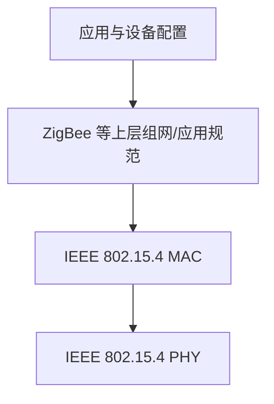

# 9.2 无线个人区域网 WPAN

无线个人区域网（WPAN）面向个人周边设备，以较小覆盖范围、低功耗和低成本替代线缆。蓝牙、IEEE 802.15.4 与 ZigBee 分别展示了短距设备连接、低功耗链路和上层组网协议的不同边界。

> [!abstract] 一句话主线
> **WPAN 不是缩小版 WLAN：它以个人设备和功耗预算为中心，协议会在数据率、覆盖范围、拓扑、睡眠时间和实现成本之间取舍。**

> [!tip] 阅读方式
> 先读“核心结构”分清无线介质、接入、移动性与核心网职责，再在“详细展开”中核对教材图、帧字段、信令和历史架构。

## 核心结构

### 标准职责边界

| 技术 | 主要定位 | 典型取舍 |
| --- | --- | --- |
| 经典蓝牙 | 外设、音频和近距设备互连 | 连接能力与功耗折中 |
| BLE | 低功耗、间歇小数据 | 长休眠、短活动、较小负载 |
| IEEE 802.15.4 | 低速率 WPAN 的 PHY/MAC | 为上层网状或星形协议提供链路基础 |
| ZigBee | 基于 802.15.4 的网络和应用体系 | 低功耗组网、协调器和设备角色 |
| UWB | 宽带短脉冲与精细测距等能力 | 频谱、距离、功耗和设备支持 |

> [!note] 版本与参数
> 蓝牙版本、角色术语、速率、覆盖范围和 ZigBee 设备规模会随标准与实现变化。详细展开保留教材参数用于理解演进，不把它们视为所有设备的固定能力。

## 详细展开

无线个人区域网 WPAN (Wireless Personal Area Network)就是在个人工作的地方把属于个人使用的电子设备（如便携式电脑、平板电脑、便携式打印机以及蜂窝电话等）用无线技术连接起来自组网络，不需要使用接入点 AP，整个网络的范围约为 10 m。WPAN 可以是一个人使用，也可以是若干人共同使用（例如，一个外科手术小组的几位医生把几米范围内使用的一些电子设备组成一个无线个人区域网）。这些电子设备可以很方便地进行通信，就像用普通电缆连接一样。请注意，无线个人区域网 WPAN 和个人区域网 PAN (Personal Area Network)并不完全等同，因为 PAN 不一定都是使用无线连接的。

WPAN 和无线局域网 WLAN 并不一样。WPAN 是以个人为中心来使用的无线个人区域网，它实际上就是一个低功率、小范围、低速率和低价格的电缆替代技术。

WPAN 的 IEEE 标准起初都由 IEEE 的 802.15 工作组制定，这个标准也包括 MAC 层和物理层这两层的标准[W-IEEE802.15]。后来也有其他组织参加了标准的制定。WPAN 都工作在 2.4 GHz 的 ISM 频段。顺便指出，欧洲的 ETSI 标准则把无线个人区域网取名为 HiperPAN。
## 1. 蓝牙系统

最早使用的 WPAN 是 1994 年爱立信公司推出的蓝牙(Bluetooth)系统。IEEE 的 802.15 工作组曾经把蓝牙技术标准化为 IEEE 802.15.1，但此标准现已不再继续使用。目前蓝牙技术由蓝牙技术联盟负责维护和更新其技术标准、认证制造厂商，并授权使用蓝牙技术和蓝牙标志®，但蓝牙技术联盟并不负责蓝牙设备的设计、生产和出售[W-BLUE]。

蓝牙从早期近距、较低速率连接逐步扩展出经典蓝牙和低功耗蓝牙 BLE 等能力。BLE 通过短时活动和长时间休眠服务小数据、低功耗设备。教材列出的版本、速率、距离与电池寿命用于说明演进趋势；实际能力取决于 PHY、发射功率、环境、应用占空比和具体设备。

蓝牙使用 TDM 方式和跳频扩频 FHSS 技术，组成不使用接入点 AP 的皮可网(piconet)。piconet 的意思就是“微微网”，因为前缀 pico- 是微微（$10^{-12}$），表示这种无线网络的覆盖面积非常小。每一个皮可网有一个主设备(Master)和最多 7 个工作的从设备(Slave)。通过共享主设备或从设备，可以把多个皮可网链接起来，形成一个范围更大的散射网(scatternet)。这种主从工作方式的个人区域网实现起来价格就会比较便宜。

图 9-14 给出了蓝牙系统中的皮可网和散射网的概念。图中标有 M 和 S 的小圆圈分别表示主设备和从设备，而标有 P 的小圆圈表示不工作的搁置的(parked)设备。一个皮可网最多可以有 255 个搁置的设备。
![[Pasted image 20260716173020.png]]
> **[图 9-14 蓝牙系统中的皮可网和散射网]**
> *图示皮可网1 (包含 M、S、P)，皮可网2 (包含 M、S)，散射网连接两者。*

蓝牙技术联盟的成员已超过三万，分布在电信、计算机以及消费性电子产品等领域。蓝牙技术现广泛用于计算机与外设（鼠标、键盘、耳机、打印机等）的连接，家居自动化（如室内照明、温度、家用电器的控制等），医疗和保健（如血糖、血氧、心率的监测）以及汽车上的各种蓝牙设备的连接。

为了适应不同用户的需求，WPAN 还定义了另外两种低速 WPAN 和高速 WPAN（下面介绍）。
## 2. 低速 WPAN

低速 WPAN 主要用于工业监控组网、办公自动化与控制等领域，其速率是 2 ~ 250 kbit/s。低速 WPAN 的标准是 IEEE 802.15.4。最近新修订的标准是 IEEE 802.15.4—2006。在低速 WPAN 中最重要的就是 ZigBee。ZigBee 名字来源于蜜蜂群使用的赖以生存和发展的通信方式。蜜蜂通过跳 Z 形（即 ZigZag）的舞蹈，来通知其伙伴所发现的新食物源的位置、距离和方向等信息，因此就把 ZigBee 作为新一代无线通信技术的名称。ZigBee 技术主要用于各种电子设备（固定的、便携的或移动的）之间的无线通信，其主要特点是通信距离短（10 ~ 80 m），传输数据速率低，并且成本低廉。

ZigBee 的另一个特点是功耗非常低。在工作时，信号的收发时间很短；而在非工作时，ZigBee 节点处于休眠状态（处于这种状态的时间一般都远远大于工作时间）。这就使得 ZigBee 节点非常省电，其节点的电池工作时间可以长达 6 个月到 2 年左右。对于某些工作时间和总时间（工作时间+休眠时间）之比小于 1%的情况，电池的寿命甚至可以超过 10 年。

ZigBee 网络容量大。一个 ZigBee 的网络最多包括有 255 个节点，其中一个是主设备(Master)，其余则是从设备(Slave)。若是通过网络协调器(Network Coordinator)，整个网络最多可以支持超过 64000 个节点。

ZigBee 标准是在 IEEE 802.15.4 标准基础上发展而来的。因此，所有 ZigBee 产品也是 802.15.4 产品。虽然人们常常把 ZigBee 和 802.15.4 作为同义词，但它们之间是有区别的。图 9-15 是 ZigBee 的协议栈。可以看出，IEEE 802.15.4 只是定义了 ZigBee 协议栈的最低的两层（物理层和 MAC 层），而上面的两层（网络层和应用层）则是由 ZigBee 联盟①定义的[W-ZigBee]。在一些文献中可以见到“ZigBee/802.15.4”的写法，这就表示 ZigBee 标准是由两个不同的组织制定的。
![[Pasted image 20260716173027.png]]
> **[图 9-15 ZigBee 的协议栈]**
> *左侧为 ZigBee 协议栈，分为应用层、网络层、MAC 层、物理层。其中 MAC 层和物理层由 IEEE 802.15.4 定义，而应用层和网络层由 ZigBee 联盟定义。*

IEEE 802.15.4 的物理层定义了表 9-3 所示的三个频段（都是免费开放的）。

**表 9-3 IEEE 802.15.4 物理层使用的三个频段**

| 频段 | 数据率 | 信道数 |
| :--- | :--- | :--- |
| 2.4 GHz（全球） | 250 kbit/s | 16 |
| 915 MHz（美国） | 40 kbit/s | 10 |
| 868 MHz（欧洲） | 20 kbit/s | 1 |

在 MAC 层，主要沿用 802.11 无线局域网标准的 CSMA/CA 协议。这就是在传输之前会先检查信道是否空闲，若信道空闲，则开始进行数据传输；若没有收到确认，则执行退避算法重传。

在网络层，ZigBee 可采用星形和网状拓扑，或两者的组合（如图 9-16 所示）。一个 ZigBee 网络最多可以有 255 个节点。ZigBee 的节点按功能的强弱可划分为两大类，即全功能设备 FFD (Full-Function Device)和精简功能设备 RFD (Reduced-Function Device)。RFD 节点是 ZigBee 网络中数量最多的端设备（如图 9-16 中的 9 个黑色小圆点），它的电路简单，存储容量较小，因而成本较低。FFD 节点具备控制器(Controller)的功能，能够提供数据交换，是 ZigBee 网络中的路由器。RFD 节点只能与处在它星形网中心的 FFD 节点交换数据。在一个 ZigBee 网络中有一个 FFD 充当该网络的协调器(coordinator)。协调器负责维护整个 ZigBee 网络的节点信息，同时还可以与其他 ZigBee 网络的协调器交换数据。通过各网络协调器的相互通信，可以得到覆盖更大范围、超过 65000 个节点的 ZigBee 网络。
![[Pasted image 20260716173034.png]]
> **[图 9-16 ZigBee 的组网方式]**
> *图示包含了协调器、FFD、RFD、端设备等组成的网络。*
## 3. 高速 WPAN

高速 WPAN 的标准是 IEEE 802.15.3，是专为在便携式多媒体装置之间传送数据而制定的。这个标准支持 11 ~ 55 Mbit/s 的数据率。这在个人使用的数码设备日益增多的情况下特别方便。例如，使用高速 WPAN 可以不用连接线就能把计算机和在同一间屋子里的打印机、扫描仪、外接硬盘，以及各种消费电子设备①连接起来。别人使用数码摄像机拍摄的视频节目，可以不用连接线就能复制到你的数码摄像机的存储卡上。在会议厅中的便携式计算机可以不用连接线就能通过投影机把制作好的幻灯片投影到大屏幕上。IEEE 802.15.3a 工作组还提出了更高数据率的物理层标准的超高速 WPAN。这种网络使用超宽带 UWB (Ultra-Wide Band)技术。根据第 2 章所介绍的香农公式，我们知道信道的极限传输速率与信道的带宽成正比。因此，超宽带技术工作在 3.1 ~ 10.6 GHz 微波频段就是为了得到非常高的信道带宽。现在的超宽带信号的带宽，应超过信号中心频率的 25%以上，或者信号的绝对带宽超过 500 MHz。UWB 规定为：超宽带技术使用了瞬间高速脉冲，因此信号的频带就很宽，就是指可支持 100 ~ 400 Mbit/s 的数据率，可用于小范围内高速传送图像或 DVD 质量的多媒体视频文件。

---

上一节：[[9.1 无线局域网 WLAN 与 802.11]]　｜　下一节：[[9.3 蜂窝移动通信与 LTE]]　｜　章节入口：[[第九章 无线网络和移动网络]]
