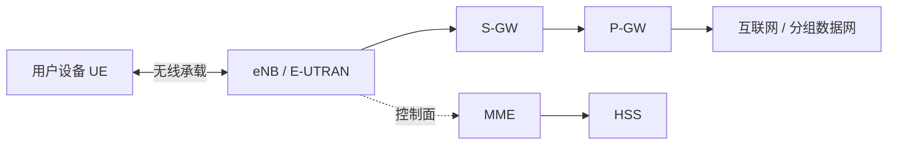

# 9.3 蜂窝移动通信与 LTE

蜂窝网络通过小区和频率复用扩大覆盖，并以无线接入网与核心网共同管理鉴权、承载、位置和切换。LTE 的用户数据经 eNB、S-GW 和 P-GW 等节点形成隧道，控制面与用户面承担不同职责。

> [!abstract] 一句话主线
> **无线接入网维护 UE 与基站的无线连接，核心网建立承载并跟踪位置；用户数据沿隧道转发，控制信令负责登记、鉴权、寻呼和切换。**

> [!tip] 阅读方式
> 先读“核心结构”分清无线介质、接入、移动性与核心网职责，再在“详细展开”中核对教材图、帧字段、信令和历史架构。

## 核心结构

### LTE 教材模型

| 平面 | 主要工作 | 典型状态 |
| --- | --- | --- |
| 用户面 | 承载应用 IP 分组 | GTP-U 隧道、承载与转发路径 |
| 控制面 | 建立/修改承载，鉴权、位置与切换管理 | UE 上下文、位置和安全状态 |

### 位置跟踪的折中

跟踪区过小会增加 UE 移动时的位置更新；跟踪区过大又会扩大寻呼范围。跟踪区列表把多个区域组合起来，在更新信令和寻呼开销之间折中。

> [!warning] 代际名称不是单一技术指标
> 2G/3G/4G/LTE 等名称包含标准、监管和商业语境。教材中的峰值速率与架构图适合解释演进，不能直接代表某个现实网络的覆盖、时延或用户吞吐。

## 详细展开

## 9.3.1 蜂窝无线通信技术的发展简介
### 1. 蜂窝移动通信系统问世

移动通信的种类很多，如蜂窝移动通信、卫星移动通信、集群移动通信、无绳电话通信等，但目前使用最多的是蜂窝移动通信，它又称为小区制移动通信。

蜂窝无线通信网发展非常迅速，其信号的覆盖面已远远超过 Wi-Fi 无线局域网的覆盖面。蜂窝无线通信最初只是用来打电话，这和本书讨论的计算机网络并无关联。但随着技术的发展，原来仅用来进行电话通信的手机，已经发展成为接入到互联网最主要的用户设备。手机之间互相传送的数据（其中大量是视频、音频数据）已构成当今互联网上流量的主要成分。现在若要在移动的环境下接入到互联网已经离不开蜂窝无线通信网了。

蜂窝无线通信技术相当复杂，要深入了解其工作原理，需要学习另外的课程。因此本节的重点仅限于介绍两种网络（蜂窝移动通信网和互联网）怎样相互连接。为此，对蜂窝移动通信网必须有最低限度的入门介绍。初学者往往不熟悉大量的英文缩写词（但这些都是在技术文献中普遍使用的）。在遇到生疏的缩写词时，最好的办法就是反复多看几遍。

最早的第一代(1G)蜂窝移动通信系统于 1978 年底问世，它使用模拟技术和传统的电路交换及频分多址 FDMA 提供电话服务。这里的 G 表示 Generation（代），而不是 Giga（千兆，或吉）。1G 移动通信系统的手机相当笨重（俗称大哥大），且话音质量差，因此不久后就被第二代(2G)蜂窝移动通信系统取代了。
### 2. 2G 蜂窝移动通信系统

1990 年后开始了基于数字技术的第二代(2G)蜂窝移动通信，其代表性体制就是欧洲提出的 GSM 系统。虽然许多国家现在已经停止使用 2G 系统了，但为了更好地了解 3G 和 4G 体制，这里有必要非常简单地介绍一下 GSM 2G 蜂窝通信系统的重要组成构件（还有另外一种也属于 2G 蜂窝移动通信的 CDMA，这里从略）。

如图 9-17 所示，蜂窝移动通信的特点是把整个网络服务区划分成许多小区 (cell，也就是“蜂窝”)，每个小区设置一个基站，负责与本小区各个移动站的联络和控制。小区也就是基站的覆盖区。移动站的发送或接收都必须经过基站完成，因此基站又称为收发基站。每个基站的发射功率既要能够覆盖本小区，又不能太大以致干扰了邻近小区的通信。小区的大小视基站天线高度、增益和信号传播条件以及该小区内的移动用户密度而定，从半径 20 m（移动用户很密集的地方）到 1~25km 不等。采用小区的好处是可以在相隔一定距离的小区中重复使用相同的频率，这称为频率复用。图 9-17 画出了 7 个小区，每个小区的基站使用不同的频率。这样，只要相邻小区采用不同的频率，就可以组成由大量小区构成的蜂窝无线通信系统。实际的小区因受地形的限制，并非严格的六边形。之所以画成六边形的小区是为了更好地说明采用蜂窝技术怎样解决了同频干扰以及频率重复使用的问题。这样，用一个个相互拼接的六边形的小区，就可组成覆盖面积很大的蜂窝无线通信系统。
![[Pasted image 20260716173043.png]]
> **[图 9-17 2G GSM 蜂窝通信系统的重要组成构件]**
> *图示了空中接口、基站子系统（基站、基站控制器 BSC）、网络子系统或核心网（移动交换中心 MSC、网关移动交换中心 GMSC、公用电话网）。*

GSM 系统虽然使用了数字技术，但仍然使用传统的电路交换提供基本的话音通信服务。移动用户到基站之间的空口（即无线空中接口）采用的多址方式是 FDMA/TDMA 的混合系统。这种混合系统先按频分复用方式，把可用频带（上行和下行各占用 25 MHz）划分为 125 个带宽为 200 kHz 的子频带。然后再把每个子频带进行时分复用，每个 TDM 帧划分为 8 个时隙，使每个通话的用户占用一个 TDM 帧中的一个特定时隙。在每个蜂窝内可以从 $125 \times 8$ 个频道中合理地挑选出一些频道，就可以使相隔一定距离的蜂窝能够重复使用相同频率的频道。在移动通信系统中，“上行”是指从移动站到基站，而“下行”是指从基站到移动站。

如图 9-17 所示，GSM 包括基站子系统和网络子系统（常称为核心网）。基站子系统包括几十个基站和一个基站控制器 BSC (Base Station Controller)。基站控制器 BSC 为本基站子系统中的几十个基站服务。当本基站子系统中的移动用户和基站进行通信时，基站控制器 BSC 要负责为其分配无线信道，确定移动用户所在的小区，并当移动用户在本基站子系统内漫游时进行信道的切换。

核心网包括移动交换中心 MSC (Mobile Switching Center)和网关移动交换中心 GMSC (Gateway Mobile Switching Center)。MSC 的重要任务是负责用户的授权和账单（即确定是否允许一个移动设备接入到这个蜂窝网络中），用户呼叫连接的建立和释放，以及当用户在不同的基站子系统之间漫游时的信道切换。通常一个移动交换中心 MSC 可以管理 5 个基站控制器 BSC，而移动通信运营商可以建立很多的 MSC，然后通过网关移动交换中心 GMSC，连接到公用电话网或其他移动通信网。GSM 的数据率仅为 9.6 kbit/s，要连接到互联网浏览网页是很不合适的。不过 GSM 可通过其信令系统提供字数不多的短信服务。

在图 9-17 中，我们省略了相当复杂的信令系统的构件。我们使用手机通话之前的拨号，就是靠信令系统来准确找到被叫用户的。整个蜂窝移动通信系统的管理和维护都要依靠复杂的信令系统。
### 3. 数据通信被引入移动通信系统

GSM 初期以提供话音为主，在中后期为了满足移动数据通信需求，引入通用分组无线服务 GPRS (General Packet Radio Service)（俗称 2.5G）和增强型数据速率 GSM 演进 EDGE (Enhanced Data rate for GSM Evolution)（俗称 2.75G）系统，除了在空口调制方式由高斯最小频移键控 GMSK (Gaussian Minimum Shift Keying)提高到 8PSK 外，网元方面引入了分组控制单元 PCU (Packet Control Unit)，PCU 通常和 BSC 集成在一起，负责处理有关数据通信的业务。PCU 根据用户数据业务的突发性质，动态地分配空口资源给用户，提高了空口资源的利用率，提供的最大速率为 171.2 kbit/s（GPRS）和 384 kbit/s（EDGE）。

引入 GPRS 后的核心网由两个不同性质的域组成，即电路交换域和分组交换域（如图 9-18 所示）。电路交换域就是原来 GSM 的核心网部分，而分组交换域则包括服务 GPRS 支持节点 SGSN (Serving GPRS Support Node)和网关 GPRS 支持节点 GGSN (Gateway GPRS Support Node)。电路交换域负责话音通信，而分组交换域负责数据通信。SGSN 把基站控制器发来的 IP 数据报发送到 GGSN，同时把 GGSN 发来的 IP 数据报转发到基站控制器。SGSN 还要和蜂窝话音核心网的移动交换中心 MSC 交互，以便完成用户的授权、通信的切换，以及维护移动节点的位置信息等功能。GGSN 具有网络接入控制功能，把多个 SGSN 连接起来后接入到互联网。因此 GGSN 又称为 GPRS 路由器，它选择哪些分组可进入 GPRS 网络，以保证 GPRS 网络的安全。
![[Pasted image 20260716173053.png]]
> **[图 9-18 引入 GPRS 后的核心网由电路交换域和分组交换域组成]**
> *图示了基站子系统（基站、BSC/PCU）、核心网（电路交换域：MSC、GMSC、公用电话网；分组交换域：SGSN、GGSN、互联网）。*
### 4. 3G 蜂窝移动通信系统

1996 年国际电联无线电通信部门 ITU-R 把第三代(3G)蜂窝移动通信的正式标准名称定为 IMT-2000，希望全球能够制定出一个统一的标准（但实际上未能统一）。名称中的 2000 表示：这个系统工作在 2000 MHz 频段，支持的数据率可达 2000 kbit/s（固定站）和 384 kbit/s（移动站），并预期在 2000 年左右得到商用。下面介绍 IMT-2000 中最广泛使用的一种标准。

1998 年全球在通信领域最有影响的 7 个组织，其中包括中国通信标准化协会 CCSA (China Communications Standards Association)，成立了第三代移动通信合作伙伴计划 3GPP (3rd Generation Partnership Project)①，以便制定从 2G GSM 平滑过渡到 3G 的端到端标准。3GPP 制定的 3G 标准名称是通用移动通信系统 UMTS (Universal Mobile Telecommunications System)，发布在 3GPP R99 中。R99 (Release 99)表示这是 3GPP 规范的 1999 年版本。但在 2000 年以后，版本的格式改变了，字母 R 后面的数字表示 3GPP 规范的版本顺序号。3GPP R99 版本对 UMTS 的要求是，下行和上行的数据率都要超过 384 kbit/s。

3G UMTS 引入了无线接入网的概念（如图 9-19 所示），其全名是通用移动通信系统陆地无线接入网 UTRAN (UMTS Terrestrial Radio Access Network)，它由多个无线网络系统组成。每个无线网络系统有一个无线网络控制器 RNC (Radio Network Controller)和许多基站，但在 UMTS 中，基站的正式名称是节点 B (Node-B)，简写为 NB。UTRAN 中无线网络控制器 RNC 的作用和 GSM 网络中的基站控制器相似。RNC 一方面通过电路交换域的 MSC 连接到蜂窝话音网络，另一方面通过分组交换域的 SGSN 和 GGSN 连接到分组交换的互联网。3G UMTS 把移动站称为用户设备 UE (User Equipment)。在用户设备 UE 和基站 NB 之间是无线链路，这点和 2G 的情况是相似的。
![[Pasted image 20260716173102.png]]
> **[图 9-19 3G UMTS 蜂窝通信系统的重要组成构件]**
> *图示了无线网络系统（UE、Node-B、RNC）、核心网（MSC、GMSC、公用电话网、SGSN、GGSN、互联网）。*

3G 中的核心网由 GSM 系统中 GPRS 核心网进行平滑演进（软件升级和部分硬件升级）。在实际运营中还采用融合设备实现，例如，SGSN 和 GGSN 设备同时支持 2G/3G 功能。从互联网无法看到 GGSN 以内 3G 节点的移动性，GGSN 把这些对 UMTS 的外部都隐藏了。

3G UMTS 与 2G 的 GSM 的主要区别集中在 UTRAN 侧，在空口使用直接序列宽带码分多址 DS-WCDMA (Direct Sequence Wideband CDMA)，或时分同步码分多址 TD-SCDMA (Time Division-Synchronous Code Division Multiple Access)。这样，每个移动用户使用的带宽比 GSM 的增大很多，因而能以更高的数据率享用多种移动宽带多媒体业务（浏览网页，传送高清图片和视频短片，即时视频通信，进行多方视频会议等）。3G UMTS 也不断提高数据率，例如，WCDMA 引入高速分组接入增强型版本 HSPA+ (High Speed Packet Access+)来传输数据后，其下行数据率可达到 21 Mbit/s（5 MHz 带宽），大大超过了 3G 最初设定的指标。

我国现使用三种 3G 国际标准，即 3GPP 组织中由欧洲提出的宽带码分多址 WCDMA (Wideband CDMA)（UMTS 的标准，中国联通使用），3GPP 组织中由美国提出的 CDMA2000（中国电信使用）和 3GPP 组织中由中国提出的时分同步码分多址 TD-SCDMA (Time Division-Synchronous CDMA)（UMTS 标准，中国移动使用），其中 TD-SCDMA 和 WCDMA 使用相同的 3GPP 规范，仅在接入网空口部分有差异。3GPP 组织的 CDMA2000 系统的核心网及接入网与 TD-SCDMA/WCDMA 的都不同。

3G 蜂窝移动通信是以传输多媒体数据业务为主的通信系统，而且必须兼容 2G 的功能（即能够通电话和发送短信），这就是所谓的向后兼容。
### 5. 4G 蜂窝移动通信系统

ITU-R 于 2008 年把第四代(4G)移动通信的名称为 IMT-Advanced (International Mobile Telecommunications-Advanced)，意思是高级国际移动通信。IMT-Advanced 的一个最重要的特点就是取消了电路交换，无论传送数据还是传送话音，全部使用分组交换技术，或称为全网 IP 化。IMT-Advanced 的目标峰值数据率是：固定的和低速移动通信时应达到 1 Gbit/s，在高速移动通信时（如在火车、汽车上）应达到 100 Mbit/s。不断提高数据率的动力来自客观的需求。智能手机的用户迫切需要利用手机上安装的即时通信应用软件，把他们用手机拍摄的视频短片或高清照片及时分享给自己的亲友，或用视频会议方式和亲友们进行视频交谈。这就要求移动通信系统把网络数据率再提高到新的水平。

ITU-R 的 IMT-Advanced 目标比 3G 显著提高。3GPP Release 8 的初始 LTE 在 20 MHz 信道下给出了约 100 Mbit/s 下行、50 Mbit/s 上行的设计峰值，未完全达到 IMT-Advanced 的峰值目标，因此教材和部分文献曾称其为 3.9G。后来 LTE-Advanced 满足了 IMT-Advanced 要求；商业语境中的“4G”标签覆盖范围通常比严格的代际技术指标更宽。复习时应区分“初始 LTE”“LTE-Advanced”和“市场命名”，不宜简单断言 LTE 不是 4G。
![[Pasted image 20260716173110.png]]
> **[图 9-20 LTE 体系结构的简图]**
> *图示 UE、E-UTRAN（包含 eNB）、EPC（包含 MME、HSS、S-GW、P-GW）、互联网。*

图 9-20 是 LTE 体系结构的最主要部分的简图。下面进行简单的讨论。

LTE 的体系结构由三大部分组成，即用户设备 UE、演进的无线接入网 E-UTRAN (Evolved-UTRAN)和演进的分组核心网 EPC (Evolved Packet Core)。从图 9-20 可看出，核心网 EPC 的用户层面和控制层面的划分非常清晰。图中 EPC 的上半部分是控制层面，下半部分是用户层面。信令的传输在图中用虚线表示，而用户数据的传输用实线表示。在移动通信领域经常提到的“用户层面”，就是我们在第 4 章中介绍的“数据层面”。

为了进一步提高数据率，LTE 采用了以下的一些方法。

我们知道 3G 的 UMTS 的空口使用的是 WCDMA。如果 LTE 继续使用 WCDMA，那么就很难再提高数据传送的速率。现在 LTE 无线接入网的下行信道（eNB $\rightarrow$ UE）与上行信道（UE $\rightarrow$ eNB）采用了不同的复用方式。例如，下行信道采用了频分复用与时分复用相结合的方式，称为正交频分多址 OFDMA。我们知道，在传统的频分复用 FDM 中的各频道必须相隔一定的保护频带，以免相互干扰。但正交频分复用 OFDM 技术采用了多个子载波并行传输的方法，利用各子载波之间的正交性，子信道的频谱可以相互重叠，但在解调时并不产生子载波间干扰。这就大大提高了频谱利用率。OFDM 使每个子信道的数据率降低，因而有效地减少了由多径效应带来的符号间干扰，降低了误比特率。由于每个用户同时采用多个子信道并行传输，因此仍然能够获得较高的数据率。因而现在 LTE 的空口使用的带宽是 20 MHz，比 3G 的 UMTS 空口带宽 5 MHz 提高了很多。LTE 的用户设备发送的帧长为 10 ms，每个帧划分为 20 个时隙。因此一个时隙为 0.5 ms。LTE 每个被激活的用户设备可以被分配到一个或多个信道频率中的一个或多个时隙。用户设备分配到的时隙数越多（不管是在同一频率或在不同频率），就可以获得越高的数据率。在用户设备之间重新分配时隙的频率可以是每毫秒进行一次。

LTE 采用了高阶调制 64QAM，也就是让 1 码元携带 6 bit 的信息量。LTE 还采用了多天线的多入多出 MIMO 技术，这些措施对提高数据率和信道频谱利用率起了重要作用。

演进的无线接入网 E-UTRAN 与 3G 的 UTRAN 有很大的区别。E-UTRAN 取消了无线网络控制器 RNC，并把基站称为演进的节点 B，简写为 eNB (evolved Node-B)。LTE 的基站 eNB 兼有 3G 中的基站 NB 和无线网络控制器 RNC 的功能，是 LTE 中功能最复杂的设备。在 E-UTRAN 中的基站 eNB，通过图 9-20 所示的 X2 接口，与相邻的一些基站相互连接，直接传输数据和信令（在 LTE 中，包括 3G 和 2G 在内，所有需要进行通信的实体之间，都有非常明确的接口规定，上述的 X2 接口仅是许多接口中的一个）。这样就便于用户设备漫游时的信号切换。E-UTRAN 采用这种减少节点层次的扁平结构，是为了简化接入网的结构和降低成本，同时也加快数据的传输。

基站 eNB 有三个主要构件。(1) 天线。(2) 无线模块：对发往空口的信号，或从空口接收的信号，进行调制或解调。(3) 数字模块：作为空口与核心网的接口，对经过此模块的所有信号进行处理。

在控制层面，基站 eNB 负责无线资源的管理，执行由 MME 发起的寻呼信息的调度和传输，并为 UE 发往服务网关 S-GW 的数据选择路由。

在数据层面中，基站 eNB 在用户设备 UE 与核心网之间传送 IP 数据报。

**分组数据网络网关**（简称分组网关）P-GW (Packet Data Network Gateway) 是 EPC 通向外部分组数据网的接口，也是用户数据会话的锚点之一，承担地址分配、策略执行、计费配合和分组转发等职责。用户设备 UE 的数据在 eNB、S-GW 与 P-GW 之间通常通过 GTP-U 承载隧道传送。隧道用于标识和隔离承载，但它本身不自动保证固定时延或丢包率；LTE 可通过承载、QCI、调度和策略机制为不同业务提供差异化 QoS，端到端质量还取决于无线链路、拥塞、核心网与外部网络。LTE 采用全 IP 分组核心网，是其相对于早期电路交换移动网络的重要结构变化。

**服务网关** S-GW (Serving GateWay)是无线接入网与核心网之间的网关路由器，由 SGSN 演进而来。在现实网络中，2G/3G 的 SGSN 和 4G 的 S-GW 是一个融合设备。S-GW 负责用户层面的数据分组的转发和路由选择，起到路由器的作用。S-GW 还负责 eNB 到 S-GW 以及 S-GW 到 P-GW 的隧道管理。S-GW 是数据层面中移动性的锚点。用户设备 UE 在通信过程中，可能会在 LTE 系统不同的 eNB 之间切换或漫游到 3GPP 的不同接入系统中（如 2G 的 GSM 或 3G 的 UMTS），如果这些 eNB 以及 2G/3G 的基站都与某一个 S-GW 连接，这时 UE 所关联的 S-GW 不变，数据流都从同一个 S-GW 流出，再转发到 P-GW。

SGW 和 PGW 可以在同一个物理节点或不同物理节点实现。

**归属用户服务器** HSS (Home Subscriber Server)是一个中心数据库，里面有网络运营商所保存的用户基本数据。

**移动性管理实体** MME (Mobility Management Entity)是一个信令实体，负责基站与核心网之间以及用户与核心网之间的所有信令交换。大的核心网需要有多个 MME 来处理大量的信令交换。当一个用户初次接入到 LTE 网络时，基站 eNB 就要与 MME 通信，以便 MME 和用户能够交换鉴别信息。MME 必须从 HSS 获得用户的有关信息。

在图 9-20 中还省略了一些构件，如策略与计费规则功能 PCRF (Policy and Charging Rules Function)单元等，这里就不进行介绍了。

LTE 部署通常通过多模终端和网络互操作支持向 3G/2G 回落或漫游，因此许多终端曾同时标明 4G/3G/2G 能力。这是终端能力与部署互操作安排，不等于 LTE 空口协议本身必须直接兼容所有 3G/2G 技术；随着旧网络退网，实际可回落范围也由运营商网络决定。

最初 LTE 把电话通信业务转交给原先的 3G UMTS 或 2G GSM 的电路交换网络来处理，以确保电话通信的质量。这叫作电路交换回落 CSFB (Circuit Switched FallBack)，意思是再退回到 3G/2G 的电路交换的网络来处理电话通信业务。但这种处理方法过渡性质的。在 2012 年，基于 IP 的 VoLTE (Voice over LTE)问世了。VoLTE 也叫作高清电话业务，能够提供高质量的电话通信和视频电话，但 VoLTE 的运行要靠与 P-GW 相连的 IP 多媒体子系统 IMS (IP Multimedia Subsystem)。IMS 不属于 LTE，而是属于 IP 服务的范围，是 LTE 之外的另一个分组交换的网络系统。
## 9.3.2 LTE 网络与互联网的连接

下面讨论 LTE 网络怎样连接到互联网，这需要用到 LTE 协议栈的概念。

当用户设备 UE（如手机）开机后，就登记到 LTE 网络，以便使用网络资源来传送 IP 数据业务。在 LTE 网络内的数据路径由两大部分组成，即空口无线链路（UE $\rightarrow$ eNB）和核心网中的隧道（eNB $\rightarrow$ S-GW $\rightarrow$ P-GW）。关于“隧道”下面还要详细讲解。图 9-21 是 LTE 的协议栈（用户层面），上面说到的数据在隧道中的通信使用 **GPRS 隧道协议 GTP** (GPRS Tunneling Protocol)，而 GTP-U 最后的字母 U，表示所传送的是用户层面(User plane)的数据。LTE 还使用另一个控制层面的隧道协议 GTP-C 来传有关的信令（限于篇幅，这部分内容从略）。当上下文意思很明确时，也可把 GTP-U 简写为 GTP。只要用户设备 UE 移动时不超过 P-GW 的覆盖范围，P-GW 分配给 UE 的 IP 地址就不改变。
![[Pasted image 20260716173125.png]]
> **[图 9-21 LTE 的协议栈（用户层面）]**
> *图示了 UE、eNB、S-GW、P-GW、互联网之间的协议栈，以及 GTP 隧道的处理过程。*

当 UE 登记完成后，如果一段时间没有数据业务，网络可释放 UE 与 eNB 之间的无线承载以及相关接入侧用户面资源，使 UE 进入空闲状态，同时保留会话上下文和地址等必要信息。教材中的“10～30 秒”只能视为示例；具体空闲定时器、保留哪些隧道与上下文以及何时重建资源，取决于网络配置、实现和所采用的 EPC 流程。

当 UE 处于空口空闲状态时，有两种不同情况，即 UE 有 IP 分组发往互联网，或互联网有 IP 分组发往 UE。下面分别进行讨论（关于 UE 之间的打电话呼叫过程不在此讨论）。

1. 假定 UE 要访问互联网中的百度网站 BD。

首先，UE 应向所在小区的基站 eNB 发送连接请求。当 eNB 收到连接请求后，就要建立空口链路和 eNB $\rightarrow$ S-GW 之间的 GTP-U 隧道。请注意，S-GW $\rightarrow$ P-GW 之间原有的 GTP-U 隧道仍存在着。然后 UE 就发送 IP 分组，从 IP 层先传送到下面的第 2 层（现在 L2 具有三个子层）。

L2 的最上层是分组数据汇聚协议 PDCP (Packet Data Convergence Protocol)子层。PDCP 子层的主要作用是支持 IP 分组在无线链路更加有效的传输，包括对 IP 首部进行压缩/解压缩。当 UE 发送一连串的 IP 分组时，每个 IP 分组都有 20 字节的 IP 首部。这些首部中的大部分字段是重复的。若采用适当的压缩算法对首部进行压缩，就可在传输时节省大量的无线信道资源。基站 eNB 的 PDCP 子层收到已压缩首部的 IP 分组后，就进行解压缩。

下一个子层是无线链路控制 RLC (Radio Link Control)子层。RLC 子层可提供三种不同可靠性等级的运行方式。例如，对于确认方式 AM (Acknowledged Mode)，在发送数据时，对 PDCP 子层传下来的 PDCP 协议数据单元进行分段或拼接，使其长度适合无线信道的传输。在接收数据时，则进行协议数据单元的重组，再上传到 PDCP 子层。RLC 子层还具有分组重新排序、重复数据检测以及使用差错检测协议 ARQ 进行数据重传的功能。

L2 最下面的是媒体接入控制 MAC 子层，它在 RLC 子层的逻辑信道和下面物理层的传输信道之间，完成复用和分用的功能。在无线信道质量较差的环境下，MAC 子层采用混合自动重传请求 HARQ (Hybrid ARQ)协议，可以有效地减少重传次数①。此外，MAC 子层还按照 eNB 调度程序的安排，把无线资源动态分配给 UE，从而保证了服务质量 QoS。

> [!note] 教材注记
> HARQ 在传统的 ARQ 协议的基础上，增加称为软合并(soft combining)的纠错技术。HARQ 把收到的差错帧不是丢弃而是缓存起来，并请求发方进行重传。如仍有差错，则继续缓存和重传。HARQ 把每次缓存的帧合并起来进行解码，提高了成功解码的概率，因而减少了重传次数。

在发送时，物理层对 MAC 子层传送来的数据进行编码和调制，把比特插入到每一帧中恰当的时隙中，发送出去。在接收时，物理层要进行解调和解码，把收到的比特上传给 MAC 子层。物理层还采用一种自适应调制编码 AMC (Adaptive Modulation and Coding)技术。基站 eNB 根据用户终端反馈的信道状况，动态地调整物理层采用的调制方式（QPSK 或 16QAM 或 64QAM）和编码速率。当无线信道质量较差时，物理信道的传输速率可能会远小于其峰值速率，以保证无线链路的传输质量。

在图 9-21 中，UE 发送的 IP 分组①的目的地址是 BD 的 IP 地址，记为 $\text{IP}_{\text{D}} = \text{BD}$；IP 分组①的源地址是 UE 的 IP 地址，记为 $\text{IP}_{\text{S}} = \text{UE}$（后面也都用这样的简单记法）。

当基站 eNB 的 PDCP 把收到的数据解封后，要用协议 GTP-U 进行封装，并把一个 GTP 隧道端点标识符 TEID (Tunnel Endpoint Identifier)写入到 GTP 首部中，如图中所示的 $\text{TEID}_1$。这时，UE 发送的 IP 分组已经被封装在一个新的 IP 分组②里面，在隧道中传输（eNB $\rightarrow$ S-GW）。IP 分组②的目的地址 $\text{IP}_{\text{D}} = \text{S-GW}$，源地址 $\text{IP}_{\text{S}} = \text{eNB}$。

S-GW 收到 IP 分组后，用同样的方法解封，并再次封装成在 GTP-U 隧道中传送的另一个新的 IP 分组③（S-GW $\rightarrow$ P-GW），把另一个 GTP 隧道端点标识符 $\text{TEID}_2$ 写入 GTP 首部。
IP 分组③的目的地址 $\text{IP}_{\text{D}} = \text{P-GW}$，源地址 $\text{IP}_{\text{S}} = \text{S-GW}$。

我们知道，eNB 和 S-GW 之间以及在 S-GW 和 P-GW 之间，都会有很多 IP 数据报封装在各自的 GTP 隧道中传输。因此，为了标识不同的隧道，对应每一个 UE 发往某个目的地的隧道，必须分配一个 GTP 隧道端点标识符 TEID。这也就是说，给每一个 UE 分配一个不同的隧道。接着，这个 UE 发往同一目的地址的所有 IP 数据报，都封装在这个隧道中传输。对不同的 UE 发送的 IP 数据报，会分配到不同的 GTP 隧道端点标识符 TEID，因而在各自不同的隧道中传送。

最后，P-GW 把从 GTP-U 隧道收到的 IP 分组解封，得到 UE 发送的 IP 分组，就转发到互联网的百度网站。

**为什么 LTE 要使用协议 GTP 把 UE 的 IP 分组再封装到 GTP 隧道中传输呢？** 这是因为 LTE 蜂窝移动通信系统中，用户设备 UE 所关联的基站 eNB，在 UE 漫游时会经常改变。这就是说，同一个 UE 在不同时间可能使用不同的 eNB 或不同的 S-GW。这就使得核心网分组交换域中的 P-GW/GGSN 和 S-GW/SGSN，无法根据 UE 的 IP 地址，用传统的路由选择协议，把 IP 分组转发到 UE。但我们知道，在 LTE 网络中，所有的 eNB、S-GW 和 P-GW 的地理位置都是固定不变的，因而可以让核心网 EPC 只负责核心网内部的路由选择。由于采用了 GTP 隧道方式，UE 发送到互联网的 IP 分组，核心网将其封装为新的 IP 分组，在隧道中传送到 P-GW。以后再由 P-GW 转发给互联网中的其他路由器。同理，从互联网发送给 UE 的 IP 分组，一律先转发到 P-GW，由 P-GW 负责确定从哪个隧道转发到 S-GW 和 eNB，最后再从 eNB 转发到目的 UE。实际上，GTP 隧道早在 2G 的 GSM 引入 GPRS 时就已经使用了。我们为了节省篇幅，就只在讨论 LTE 时才进行介绍。

不难看出，从一个 UE 发送到百度服务器的往返 IP 分组，共通过 4 段隧道，两个上行隧道，两个下行隧道。一共要在 GTP 首部中使用 4 个不同的 GTP 隧道端点标识符 TEID。

2. 百度服务器向用户设备 UE 发送数据。

百度服务器并不知道 UE 的空口状态，而只知道 UE 的 IP 地址。百度服务器以 UE 的 IP 地址为目的地址，构成 IP 分组发送出去。互联网中的路由器根据 IP 分组的目的地址，能够找到 UE 所驻留的 P-GW（因为 UE 的 IP 地址是 P-GW 分配的，因此互联网中的路由器可以根据 UE 的 IP 地址找到 P-GW）。

P-GW 通过 UE 的 IP 地址就能通过对应的 GTP-U 隧道，把 IP 分组封装为 GTP-U 分组，在隧道中转发给 S-GW。再往后就有两种情况：
*   S-GW 和 eNB 之间的 GTP-U 隧道存在。

这时，S-GW 把 GTP-U 分组通过隧道发送给 eNB。eNB 把 GTP-U 分组解封，在空口链路上采用 PDCP/RLC/MAC/PHY 层封装，把数据发送给 UE。

*   SGW 和 eNB 之间的 GTP-U 隧道不存在。

现在 UE 处于空口空闲状态。这种情况要复杂些，因为 LTE 中的所有基站 eNB 都不知道 UE 在什么地方。因此，S-GW 只好先把收到的 IP 分组暂时缓存，并触发移动性管理实体 MME 进行寻呼 UE（有时称为唤醒 UE）。那么，MME 怎样才能寻呼到 UE 呢？

MME 可以在整个 LTE 网络中广播寻呼 UE，但这样付出的代价太大。网络运营商在建造 LTE 网络时，就把整个覆盖范围划分为很多的跟踪区 TA (Tracking Area)，网络运营商赋予每个 TA 一个跟踪区标识符 TAI (Tracking Area Identity)，作为 TA 在全球的唯一标识（这里包括国家代码、网络运营商代码以及 TA 代码）。跟踪区 TA 是 LTE 系统中位置更新和寻呼的基本单位。一个跟踪区 TA 可以覆盖多个小区。当处于待机状态的 UE 必须收听邻近 eNB 的广播，以便知道自己位于哪个 TA 中。UE 必须周期性向核心网的 MME 报告自己的跟踪区标识符 TAI，以便 MME 能够寻呼到自己。为了避免 UE 在 TA 区域间频繁切换时造成核心网信令负荷过重，MME 就把一组（1 ~ 16 个）TA 写入一个跟踪区列表 TAL (Tracking Area List)，发送给 UE。当 UE 在这个 TAL 范围内跨 TA 漫游时，就不必向 MME 发送 TA 更新报文。如果这时 MME 需要寻呼 UE，只需在一个 TAL 的小范围内进行寻呼。图 9-22 说明了 UE 的跟踪区列表 TAL 更新的过程。我们看到，不同的 TA 可以包含不同数量的小区。例如，TA₁ 只包含一个小区，但 TA₄ 则包含 5 个小区。假定最初 UE 在位置 ①，属于跟踪区 TA₁。UE 把这个位置信息报告给 MME，然后 MME 向 UE 发送一个跟踪区列表 TAL₁。图 9-22 指出 TAL₁ 包含 TA₁、TA₂ 和 TA₃ 共三个跟踪区。当 UE 漫游到位置 ② 和 ③ 时，其位置仍在跟踪区列表 TAL₁ 中，因此 UE 不向 MME 发送 TA 更新报文。但当 UE 漫游到位置 ④ 时，发现新到达的 TA₄ 不在自己的跟踪区列表 TAL₁ 中，因此就向 MME 发送 TA 更新报文。MME 接着就把更新的 TAL₂ 发送给 UE。这时只要 UE 在 TAL₂ 内漫游（即在 TA₃ 和 TA₄ 的范围内），就可以不向 MME 发送 TA 更新报文，这样就减小了对核心网的信令压力。请注意，一个跟踪区 TA 可以属于多个跟踪区列表 TAL，例如，TA₃ 既在 TAL₁ 中，也在 TAL₂ 中。
![[Pasted image 20260716173135.png]]
> **[图 9-22 UE 的跟踪区列表的更新]**
> *图示了不同的 TA 区域（TA₁、TA₂、TA₃、TA₄），UE 初始在位置 ①，移到位置 ② ③ ④。以及 TAL₁ 更新为 TAL₂ 的过程。*

因此，MME 对 UE 进行寻呼时，不必在整个 LTE 网络范围内广播，而只需向 UE 所在的跟踪区列表 TAL 内数量不多的基站 eNB 发送寻呼报文。当某个基站 eNB 寻呼到 UE 后，UE 就在小区响应寻呼，触发 eNB 建立与 S-GW 之间的 GTP-U 隧道。之后，S-GW 把刚才缓存的 IP 分组转发给 eNB，再转发给 UE。

由于分组交换流量的突发性，同时为了节省无线空口资源，UE 经常会处于空闲状态，因此可能会发生频繁的寻呼。

当用户设备 UE 在空口链路已建立的情况下进行漫游时，UE 就要在漫游中不断测量小区导频信号强度，并将测量结果上报给基站 eNB。若 eNB 发现有更合适的小区，会触发 UE 进行切换，并在新小区建立空口链路和释放旧小区的空口链路，同时也把 eNB 和 S-GW 之间的 GTP-U 隧道从旧小区切换到新小区。由于 S-GW 覆盖范围很大，通常 S-GW 和 P-GW 之间的 GTP-U 隧道并不会重新建立。在切换过程中，数据通信不会中断。

最后还需要指出，前面所讨论的，仅仅是用户层面中数据传送的过程。在控制层面各节点之间还有非常重要的信令的传送，但这需要使用不同的协议栈。在 eNB 和 MME 之间，在 MME 和 HSS 之间，以及在两个 eNB 之间的信令传送，还要用到运输层的第三个协议，即流控制传输协议 SCTP (Stream Control Transmission Protocol)。协议 SCTP 结合了 UDP 和 TCP 的优点，是面向报文的可靠传输协议[FORO10] [RFC 4960，建议标准]。但我们没有篇幅在此进行介绍了。

关于 LTE 的简单介绍就到此为止。

在 4G 无线网络技术中，还有一个 IEEE 802.16 标准，也就是后来的 WiMAX 标准。WiMAX 是 Worldwide Interoperability for Microwave Access 的缩写（意思是“全球微波接入的互操作性”，缩写中的 AX 表示 Access）。但在流行了若干年后，现在市场上已经很难见到这种 4G 网络了。因此本书的这一版就取消有关 WiMAX 的介绍。

3GPP Release 10 的 LTE-Advanced（LTE-A）满足了 IMT-Advanced 的 4G 要求；Release 13 又形成 LTE-Advanced Pro，引入更多载波聚合、天线、物联网与网络能力。峰值吞吐量依赖聚合带宽、载波数、调制编码、MIMO 层数和终端类别，不能把某一理论峰值直接视为所有商用网络的实际速率。

3GPP 从 Release 15 起持续制定和扩展 5G 系统规范，后续 Release 继续演进无线接入、核心网、物联网、低时延和行业应用。本节以 LTE/EPC 的稳定架构为主；涉及某一 Release 的具体功能与完成状态时，应按 3GPP 当期规范核实，不能再把 Release 17 写成尚未发布的“未来版本”。

---

上一节：[[9.2 无线个人区域网 WPAN]]　｜　下一节：[[9.4 移动 IP 与传输层影响]]　｜　章节入口：[[第九章 无线网络和移动网络]]
