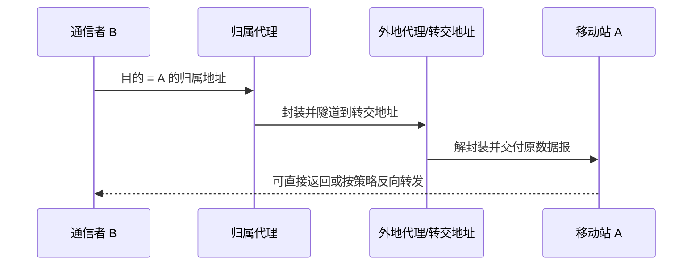

# 9.4 移动 IP 与传输层影响

移动 IP 试图让节点改变接入网络后仍保留归属地址：归属代理截获发往归属地址的数据报，再通过隧道转送到转交地址。移动和无线差错也会影响 TCP，因为传统拥塞控制难以仅凭丢包区分拥塞、切换和链路误码。

> [!abstract] 一句话主线
> **归属地址维持稳定身份，转交地址表示当前位置，归属代理完成绑定与隧道转发；由此产生额外路径、状态、安全验证和三角路由问题。**

> [!tip] 阅读方式
> 先读“核心结构”分清无线介质、接入、移动性与核心网职责，再在“详细展开”中核对教材图、帧字段、信令和历史架构。

## 核心结构

### 间接路由

| 概念 | 作用 |
| --- | --- |
| 归属地址 | 移动期间保持稳定的网络层标识 |
| 转交地址 | 表示移动节点当前可达位置 |
| 绑定 | 归属地址到转交地址的映射及有效期 |
| 归属代理 | 维护绑定、截获并隧道转发数据报 |
| 三角路由 | 通信者到移动站的数据绕经归属网络 |

> [!warning] 移动性绑定必须认证
> 若攻击者能伪造归属地址到转交地址的绑定，就可能劫持流量。移动性管理必须保护登记、更新和隧道端点，而不能只关注可达性。

### 无线丢包与 TCP

链路误码和切换丢包不一定表示路径拥塞，但发送端只观察端到端反馈时很难区分原因。本地恢复、显式反馈或连接拆分各有收益，也可能破坏端到端语义、增加状态或引入代理信任。

## 详细展开

## 9.4.1 移动 IP 的基本概念

我们知道，手机的一个基本功能是能够边移动边进行通信。但计算机则不同。在计算机网络创建时，就默认了所有的计算机的位置都是固定不变的。没有人想让笨重的计算机边移动（如放置在汽车上）边进行通信。

后来，便携式的笔记本电脑出现了。现在就出现一种常见的情况。某用户在家中使用了笔记本电脑上网，然后他关机并把笔记本电脑带到办公室重新上网。这个电脑在地理上更换了位置。但用户在办公室能够很方便地（例如接入到办公室的 Wi-Fi）通过动态主机配置协议 DHCP，自动获取新的 IP 地址。虽然电脑“移动”了，更换了地点以及所接入的网络，但这并不是移动 IP。我们可以看出，这个用户的上网方式，和传统的在固定地点上网相比，并无本质上的差异。用户在不同地点上网使用了不同的 IP 地址，但这对用户来说并不重要，因为在很多情况下，用户并不关心他所使用的具体的 IP 地址是什么。

但是，如果我们需要在移动中浏览网页，那么移动站所建立的 TCP 连接，在移动站漫游时，应当一直保持连接，否则移动站与网站的连接就会变为断断续续的（因为建立 TCP 连接需要时间，不可能瞬间就建立起好）。可见，若要使移动站在移动中的 TCP 连接不中断，就必须使移动站的 IP 地址在移动中保持不变。移动 IP (Mobile IP)就是要研究这个问题。

移动 IP 的经典思路是在节点改变接入网络时仍保留稳定的归属地址，并用绑定和隧道把数据转交到当前位置。教材以 Mobile IPv4/IPv6 的相关 RFC 展示这一模型；具体协议状态与运营商部署不影响下面的核心概念。

移动 IP 使用了一种方法，和我们几十年前怎样联系同学的做法相似。例如，一个班级的大学生在毕业时都将同时走向各自的工作岗位。由于事先并不知道自己未来的工作单位的准确通信地址，那么怎样才能继续和这些同学保持联系呢？实际上，当时使用的方法也很简单，就是彼此都留下各自的家庭地址（即永久地址）。若要和某同学联系，只要写信到该同学的永久地址，请其家长把信件转交一下即可。在得知该同学新的地址后，就可使用这个新地址直接联系了。

移动 IP 使用了如图 9-23 给出的基本概念[KURO17]。首先，移动站 A 必须有一个原始地址（相当于上面提到的家庭地址），即永久地址，或归属地址(home address)。移动站原始连接到的网络 N₁ 叫作归属网络(home network)。永久地址和归属网络的关联是不变的。在图 9-23 中，我们可以看到移动站 A 的永久地址是 131.8.6.7/16，而其归属网络是 131.8.0.0/16。
![[Pasted image 20260716173142.png]]
> **[图 9-23 永久地址与转交地址的作用]**
> *图中有归属网络 131.8.0.0/16、移动站 A（永久地址 131.8.6.7/16）、归属代理、互联网、被访网络 N₂ 15.0.0.0/8、外地代理 15.5.6.7/8、通信者 B。描述了数据包的转发过程。*

为了让地址的改变对互联网的其余部分是透明的，移动 IP 使用了代理。归属代理（home agent）通常位于归属网络并执行移动性绑定、数据报截获和隧道封装；这些属于网络层移动性支持，不是应用层代理。

当移动站 A 移动到另一个地点，所接入的网络 N₂ 称为被访网络(visited network)或外地网络(foreign network)。被访网络中使用的代理叫作外地代理(foreign agent)，它通常就是连接在被访网络上的路由器（当然也充当主机）。假定移动站 A 到达的网络是被访网络 15.0.0.0/8。外地代理的一个任务就是要为移动站 A 创建一个临时地址，叫作转交地址(care-of address)。转交地址的网络号显然必须和被访网络一致。我们假定现在 A 的转交地址是 15.5.6.7/8。外地代理的另一个功能就是及时把移动站 A 的转交地址通知 A 的归属代理。

转交地址主要供移动性协议和代理转发使用，应用通常仍把连接绑定到归属地址。需要区分两种情况：多个移动站可以共享外地代理的转交地址，由代理依据登记状态完成最终交付；同址转交地址则由移动站自身取得并作为其当前可路由地址使用，不能简单概括为“转交地址都不唯一”。

有时，移动站本身也可以充当外地代理，即移动站和外地代理是同一个设备。这时的转交地址叫作同址转交地址(co-located care-of address)。但是，要这样做，移动站必须能够接收发送到转交地址的数据报。使用同址转交地址的好处是移动站可以移动到任何网络，而不必担心外地代理的可用性。但缺点是移动站需要有额外的软件，使之能够充当自己的外地代理。

下面看一个例子。假定在图 9-23 中，通信者 B 要和移动站 A 进行通信。B 并不知道 A 在什么地方。但 B 可以使用 A 的永久地址作为发送的 IP 数据报中的目的地址。图中画出了四个重要步骤：

1. B 发送给 A 的数据报的目的地址是：131.8.6.7。此数据报被 A 的归属代理截获了（只有当 A 离开归属网络时，归属代理才能截获发给 A 的数据报）。
2. 由于归属代理已经知道了 A 的转交地址（后面要讲到），因此归属代理把 B 发来的数据报进行再封装，新的数据报的目的地址是：15.5.6.7，就是 A 现在的转交地址。新封装的数据报发送到被访网络的外地代理。这里使用的就是以前 4.5.3 节或 4.8.1 节讲过的隧道技术或 IP-in-IP。
3. 被访网络中的外地代理把收到的封装的数据报进行拆封，取出 B 发送的原始数据报，然后转发给移动站 A。这个数据报的目的地址是：131.8.6.7，就是 A 的永久地址。A 收到 B 发送的原始数据报后，也得到了 B 的 IP 地址。
4. 如果现在 A 要向 B 发送数据报，那么情况就比较简单。A 仍然使用自己的永久地址作为数据报的源地址，用 B 的 IP 地址作为数据报的目的地址。这个数据报显然没有必要在通过 A 的归属代理进行转发了。

从以上所述可以看出，为了支持移动性，在网络层应当增加以下的一些新功能。
1. 移动站到外地代理的协议。当移动站接入到被访网络时，必须向外地代理进行登记，以获得一个临时的转交地址。同样地，当移动站离开该被访网络时，它要向这个被访网络注销其原来的登记。
2. 外地代理到归属代理的登记协议。外地代理要向移动站的归属代理登记移动站的转交地址。当移动站离开被访网络时，外地代理并不需要注销其在归属代理登记的转交地址。这是因为当移动站接入到另一个网络时，这个新的被访网络的外地代理就会到移动站的归属代理登记该移动站现在的转交地址，这样就取代了原来旧的转交地址。
3. 归属代理数据报封装协议。归属代理收到发送给移动站的数据报后，将其再封装为一个新的数据报，其目的地址为移动站的转交地址，然后转发。
4. 外地代理拆封协议。外地代理收到归属代理封装好的数据报后，取出原始数据报，并将此数据报发送给移动站。

像图 9-23 所示的数据报转发过程，又称为间接路由选择。这是因为源站并不知道移动站的当前地址，而是把数据报发往移动站的归属网络，以后的寻址工作都由归属代理来完成。

现在讨论移动站继续向其他网络移动时所发生的情况。

图 9-23 中移动站 A 原先所接入的网络是 N₁，而现在 A 要从 N₁ 移动到另一个被访网络 N₂ 去。当 A 移动到 N₂ 时，就向 N₂ 的外地代理登记，N₂ 的外地代理把 A 在 N₂ 中的转交地址告诉 A 的归属代理。此后，归属代理就会把收到的发送给 A 的数据报再封装后转发到 N₂ 的外地代理。我们注意到，在 A 的这次移动前后，数据报都是由相同的归属代理转发的。原先转发到 N₁，后来转发到 N₂。

如图 9-23 所示的这种间接路由选择，可能会引起数据报转发的低效，文献中称之为三角路由选择问题(triangle routing problem)。意思是，本来在 B 和 A 之间可能有一条更有效的路由，但现在要走另外两条路：先要把数据报从 B 发送到 A 的归属代理，然后再转发给漫游到被访网络的 A。设想一个极端的例子。如果 B 所在的网络就是 A 到达的被访网络。在这种情况下，B 发送数据报给 A 就是在同一个网络上非常简便的直接交付，根本不需要使用路由器。但由于 B 并不知道 A 的位置，因此只好让发送给 A 的数据报两次穿越广域网，既浪费了时间，也增加了网上不必要的通信量。

解决这个问题的一种方法是使用直接路由选择，但这是以增加复杂性为代价的。这种方法就是让通信者 B 创建一个通信者代理(correspondent agent)，让这个通信者代理向归属代理询问到移动站在被访网络的转交地址，然后由通信者代理（而不是由归属代理）把数据报用隧道技术发送到被访网络的外地代理，最后再由这个外地代理拆封，把数据报转发给移动站。

使用这种方法时必须解决以下两个问题：
1. 增加一个协议，即移动用户定位协议(mobile-user location protocol)，用来使通信者代理向移动站的归属代理查询移动站的转交地址。
2. 当移动站再移动到其他网络时，怎样得到移动站的位置信息？关于这个问题，我们可以用图 9-24 所示的几个重要步骤来说明。
![[Pasted image 20260716173208.png]]
> **[图 9-24 使用直接路由选择向移动站发送数据报]**
> *图中有归属网络、移动站 A、被访网络 N₁、被访网络 N₂、归属代理、广域网、通信者 B、通信者代理、锚外地代理、外地代理等。描述了转交过程。*

1. B 的通信者代理从移动站 A 的归属代理得到 A 所漫游到的被访网络 N₁ 的外地代理。我们把移动站首次漫游到的被访网络的外地代理称为锚外地代理(anchor foreign agent)。
2. 通信者代理把 B 发给 A 的数据报再封装后，发送到 A 的锚外地代理。
3. 锚外地代理把拆封后的数据报发送给 A。
4. A 移动到另一个被访网络 N₂。
5. A 向被访网络 N₂ 的新外地代理登记。
6. 新外地代理把 A 的新转交地址告诉锚外地代理。
7. 当锚外地代理收到发给 A 的封装数据报后，就用 A 的新转交地址对数据报再进行封装，然后发送给被访网络 N₂ 上的新外地代理。在拆封后转发给移动站 A。

同理，如果移动站再漫游到另一个网络，则这个网络的外地代理将仍然要和锚外地代理联系，以便让锚外地代理以后把发给 A 的数据报转发过来。

上面所讨论的许多问题，都是由移动站在移动时仍然要保原来的 IP 地址（永久地址）引起的。我们在文献中常会见到移动性管理(mobility management)这样的术语，这是指上述的这些新增加的措施和协议。但有时大家更愿意使用移动管理这样更加简洁的译名。移动性管理涉及的方面比上面所讨论的问题还要宽些，例如，安全问题也是必须要解决的。绝对不能容许不法分子把别人发送给 A 的数据报，转发到暗中设定的某个伪造的外地代理。

移动 IP 的部署还涉及地址分配、代理发现、反向路径、安全绑定、NAT/防火墙穿越以及与运营商移动核心网的关系。教材模型主要用于解释“身份与位置分离”和隧道转发。
## 9.4.2 移动网络对高层协议的影响

前面讲过的无线网络在移动站漫游时，会经常更换移动用户到无线网络的连接点（即到移动站相关联的基站）。这样，网络的连接就会发生很短时间的中断。那么，这种情况对高层协议有没有影响呢？现在我们简单讨论一下这个问题。

我们知道，在 TCP 连接中，只要发生报文段的丢失或出错，TCP 就要重传这个丢失或出错的报文段。在移动用户的情况下，TCP 报文段的丢失，既可能是由于移动用户切换引起的，也可能是由于网络发生了拥塞。由于移动用户更新相关联的基站需要一定的时间（即不可能在数学上的瞬间完成），这就可能造成 TCP 报文段的丢失。但 TCP 并不知道现在出现的分组丢失的确切原因。只要出现 TCP 报文段频繁丢失，TCP 的拥塞控制就会采取措施，减小其拥塞窗口，从而使 TCP 发送方的报文段发送速率降低。这种措施显然是默认了报文段丢失是由网络拥塞造成的。可见，当无线信道出现严重的比特差错，或由于切换产生了报文段丢失，减小 TCP 发送方的拥塞窗口对改善网络性能并不会有什么好处。

经过研究，发现可以使用三种方法来处理这个问题。
1. 本地恢复。这是指差错在什么地方出现，就在什么地方改正。例如，在无线局域网中使用的自动请求重传 ARQ 协议就属于本地恢复措施。
2. 让 TCP 发送方知道什么地方使用了无线链路。只有当 TCP 能够确信，是有线网络部分发生了拥塞时，TCP 才采用拥塞控制的策略。然而要能够区分是在有线网段还是无线网段出现报文段丢失，还需要一些特殊的技术。
3. 把含有移动用户的端到端 TCP 连接拆成两个互相串接的 TCP 连接。从移动用户到无线接入点是一个 TCP 连接（这部分使用无线信道），而剩下的使用有线网段连接的部分则是另一个 TCP 连接（我们假定 TCP 连接的另一端是有线主机）。已经有人研究过，采用拆分 TCP 连接的方法，在使用无线信道的 TCP 连接上，既可以使用标准的 TCP 协议，也可以使用有选择确认的 TCP 协议，甚至还可以使用专用的、有差错恢复的 UDP 协议。在蜂窝无线通信网中实验的结果表明，采用拆分 TCP 连接的方法可以使整个性能得到明显的改进。

---

上一节：[[9.3 蜂窝移动通信与 LTE]]　｜　下一节：[[9.5 移动通信与 5G 场景]]　｜　章节入口：[[第九章 无线网络和移动网络]]
