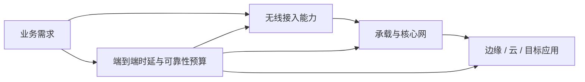

# 9.5 移动通信与 5G 场景

5G 用增强移动宽带、大规模机器类通信和高可靠低时延通信概括三类差异显著的业务目标。无线频谱、编码、波束赋形、大规模天线和密集组网共同提升能力，但实际服务仍受覆盖、负载、终端、核心网和应用路径制约。

> [!abstract] 一句话主线
> **eMBB追求大吞吐，mMTC追求海量低功耗连接，URLLC追求可靠性与低时延；三类目标不能由一个峰值速率概括。**

> [!tip] 阅读方式
> 先读“核心结构”分清无线介质、接入、移动性与核心网职责，再在“详细展开”中核对教材图、帧字段、信令和历史架构。

## 核心结构

### 三类场景

| 场景 | 主要目标 | 典型约束 |
| --- | --- | --- |
| eMBB | 高吞吐和容量 | 频谱、覆盖、热点负载 |
| mMTC | 大量低功耗、低成本终端 | 电池寿命、接入密度、小数据 |
| URLLC | 低时延与高可靠 | 端到端预算、冗余、调度与边缘处理 |

> [!important] 峰值指标不等于端到端体验
> 无线空口只是路径的一段。用户吞吐和时延还取决于信号质量、调度、回传、核心网、服务器位置、并发负载与应用协议。

> [!note] 章节边界
> 本节保留 5G 的经典场景与关键无线技术概念。5.5G、6G、频谱和版本进度具有较强时效性，应在独立的持续更新笔记中维护，而不在课程主线中追逐产品宣传数字。

## 详细展开

前面我们已经介绍了移动通信与计算机网络关系较密切的若干问题。为便于记忆，蜂窝移动通信从 1G 到 4G 的发展规律，可以认为大约是十年更新一代。从最初的 1G（模拟电话），发展到 2G（数字电话），然后演进到具有较强数据传输能力的 3G，再到可支持高质量音频和视频传输和高速率移动互联网业务的 4G（全 IP 网）。现在又发展到了第五代蜂窝移动通信 5G，甚至连 5.5G 或 6G 也被相继提出了。在我国，工信部已于 2019 年 10 月 31 日宣布 5G 的商用正式启动。下面简要地介绍一下 5G 的要点。

从 1G 到 2G，通信主要局限在人与人之间的通信。到了 3G 和 4G 时代，智能手机不仅能够提供人与人之间通信，而且还发展到可以提供多人参加的视频聊天。此外，还增加了人与互联网之间的通信（下载文件、音乐、视频等）。这种通信方式均可称为人联网。

我们在前面 9.1.1 节中曾简单地介绍了物联网 IoT。物联网现在发展很快，在 4G 时代就已经有了一些物联网的应用。但 5G 就非常明确地把物联网作为一个非常重要的应用领域。

现在 5G 标准的制定机构 3GPP 把 5G 的传输业务划分为以下三大类（在 5G 标准中称为三大应用场景），即：
1. 增强型移动宽带 eMBB (enhanced Mobile BroadBand)
2. 大规模机器类型通信 mMTC (massive Machine Type Communication)
3. 超高可靠超低时延通信 uRLLC (ultra Reliable and Low Latency Communication)

第一种应用场景 eMBB 实际上就是 4G LTE 的升级版本，它仍然属于人联网。在这一类应用场景中，5G 要传输的新型业务主要是三维（即 3D）视频和超高清视频等大流量移动宽带业务。3D 视频包括虚拟现实 VR (Virtual Reality)和增强现实 AR (Augmented Reality)。

上面的后两种应用场景 mMTC 和 uRLLC 都属于物联网。mMTC 又称为海量物联网，这种应用场景的数据率较低且时延并不敏感，但其连接的终端种类却非常广泛，不仅要求网络具有超千亿连接的支持能力，而且终端成本必须很低而电池寿命却要求很长，例如 10 年以上。这类应用场景包括智慧城市、智能家居、智能电网、物流跟踪、环境监测等方面。应用场景 uRLLC 则使用在工业控制、交通安全和控制、远程制造、远程手术以及无人驾驶等领域。

为了适应上述三种应用场景，5G 制定的标准规定其下行数据峰值速率为 10 Gbit/s（常规情况下），而在特定场景（VR 和 AR）时数据率可达 20 Gbit/s。5G 还制定了新的空口标准 5GNR (5G New Radio)，使用户层面无线信道的单向时延大大缩短（可小到毫秒级），这就保证了 5G 的整个端到端时延均可满足各种应用场景的需求。5G 还采用了一些比 4G 更高的频率，可使用更大的信道带宽，这有助于提高数据的传输速率。5G 的频谱效率（即在同样带宽下传输的数据量）也比 4G 的增加数倍。因此 5G 的特点可以简单地归纳为：极高的速率，极大的容量，极低的时延。值得注意的是，5G 并非 4G 的简单升级版本，而是在应用方面有许多崭新的领域，具有划时代的意义。

在使用的频谱方面，5G 引入了毫米波，即频率在 30 ~300 GHz 之间的无线电波，其波长为 1~10 mm。这里面还有许多新的技术问题有待于进行研究和解决。5G 还选用了与 4G 不同的信道编码方式。5G 的天线也有多方面的创新。例如，采用天线波束赋形技术，并把多进多出 MIMO 发展到大规模 MIMO 系统和立体三维 MIMO 技术，等等。

在更高的工作频率下，每个基站的覆盖范围就缩小了，因而 5G 所架设的基站必须更加密集。这显然就增加了 5G 网络的复杂性，也增加了网络运营商的投资和运营成本。因此 5G 的发展前景不单纯是个简单的学术性或技术水平问题，而是与未来的商业市场密切相关的。也就是说，上述的三个应用场景今后究竟会发展到何种水平，目前还都是未知。我们在学习 5G 新技术时，对此应有足够的重视。

---

上一节：[[9.4 移动 IP 与传输层影响]]　｜　本章完结　｜　章节入口：[[第九章 无线网络和移动网络]]
