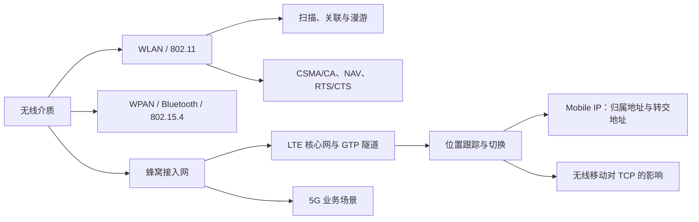

# 9.0 第九章 无线网络和移动网络

无线网络改变了链路的共享与差错特征，移动网络进一步要求连接点、位置和路由随终端移动而更新。802.11、WPAN、蜂窝核心网与 Mobile IP 分别在链路层、短距组网、运营商网络和网络层处理这些问题。

> [!abstract] 一句话主线
> **无线链路用侦听、退避和确认共享易变介质；接入系统维护关联，移动网络跟踪位置并调整转发路径，高层协议还要面对切换、误码与时延变化。**

> [!tip] 两种阅读方式
> - **快速复习**：只读各主题“核心结构”，掌握 CSMA/CA、蜂窝用户/控制面和移动 IP 主线。
> - **完整理解**：继续阅读“详细展开”，结合 24 张教材图理解帧格式、经典蜂窝架构和移动性过程。

> [!info] 与计算机科学引论的联系
> [[08-通信与网络#2. 无线连接 (Wireless Connections)|无线连接]]概览 Wi-Fi、蓝牙和蜂窝网络，[[15-前沿技术与发展趋势]]把移动与泛在连接放入技术演进背景；本章继续分析共享无线介质、关联、切换、移动路由和蜂窝核心网。

## 知识地图



## 概念入口

1. [[9.1 无线局域网 WLAN 与 802.11]]：BSS/ESS、扫描关联、CSMA/CA、帧地址与省电。
2. [[9.2 无线个人区域网 WPAN]]：蓝牙、BLE、IEEE 802.15.4、ZigBee 与 UWB。
3. [[9.3 蜂窝移动通信与 LTE]]：蜂窝演进、E-UTRAN、EPC、GTP 与跟踪区。
4. [[9.4 移动 IP 与传输层影响]]：归属/转交地址、代理、隧道、三角路由和 TCP。
5. [[9.5 移动通信与 5G 场景]]：eMBB、mMTC、URLLC 与端到端能力边界。

## 三种“移动”不要混淆

| 场景 | 主要层次 | 稳定对象 | 变化对象 |
| --- | --- | --- | --- |
| WLAN 漫游 | 链路层 | ESS 内的二层服务 | 关联 AP 与无线信道 |
| 蜂窝移动性 | 接入网与核心网 | 用户/会话上下文 | 小区、承载路径和位置状态 |
| Mobile IP | 网络层 | 归属地址 | 转交地址与隧道端点 |

> [!warning] 教材参数与安全边界
> Wi‑Fi 信道、WPA、蓝牙/ZigBee 参数、蜂窝代际速率和 5G 指标具有版本与部署差异。现实网络还必须明确频段法规、认证加密、终端能力、覆盖、负载和运营商架构；本章以稳定机制和历史演进为主。

## 动态索引

```dataview
TABLE section AS "节次", aliases AS "别名", prerequisites AS "先修", status AS "状态"
FROM "网络与安全/计算机网络A/知识点/第九章"
WHERE chapter = 9 AND type = "课程笔记"
SORT order ASC
```

---

总入口：[[MOC - 计算机网络]]　｜　上一章：[[第八章 互联网上的音频视频服务]]　｜　课程终章
