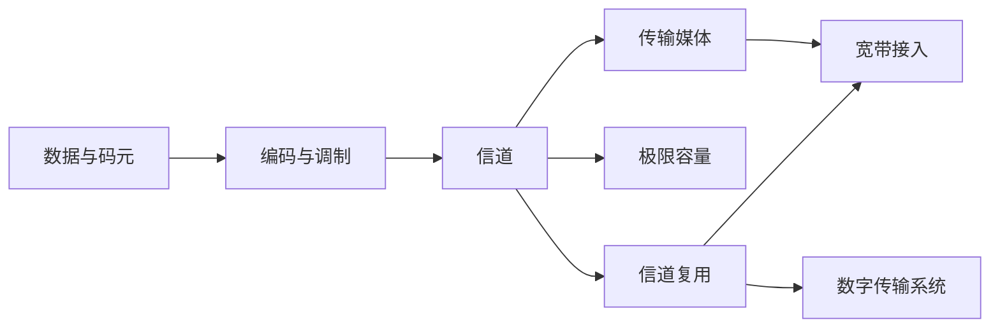

# 2.0 第二章 物理层

物理层解决“怎样把比特可靠地表现为可传播的信号”这一基础问题。它向数据链路层屏蔽介质与通信方式的差异，但不负责帧结构、端到端可靠性或应用语义。

> [!abstract] 一句话主线
> **数据经过编码或调制成为信号，信号受带宽、噪声和介质约束；复用技术让多路通信共享信道，接入技术再把这些原理组合成可部署的网络入口。**

## 知识地图



## 概念入口

1. [[2.1 物理层的基本概念]]：物理层的边界、接口特性和传输方向。
2. [[2.2 数据通信基础]]：通信系统、数据与信号、码元、编码和调制。
3. [[2.2.3 信道的极限容量]]：码间串扰、奈氏准则、信噪比与香农公式。
4. [[2.3 传输媒体]]：双绞线、同轴电缆、光纤、无线、微波与卫星链路。
5. [[2.4 信道复用技术]]：FDM、TDM、STDM 和 WDM 如何共享资源。
6. [[2.4.3 码分复用]]：用正交码片序列区分同时同频的用户。
7. [[2.5 数字传输系统]]：SONET/SDH 如何建立同步光传输等级。
8. [[2.6 宽带接入技术]]：ADSL、HFC 与 FTTx/PON 的结构和共享方式。

## 三条理解路径

### 信号路径

消息 → 数据 → 码元 → 编码/调制 → 信号 → 传输媒体 → 接收判决。

### 容量路径

- 有限带宽导致码间串扰，限制码元速率；
- 噪声限制接收端区分信号状态的能力；
- 多进制调制让一个码元携带多个比特，但状态越多，判决越困难。

### 资源共享路径

- FDM 在频率上分隔用户；
- TDM 在时间上固定分隔用户；
- STDM 按实际需求动态分配时隙；
- WDM 在光纤中按波长分隔光载波；
- CDM 用正交码片序列在同一时间、同一频带区分用户。

## 关键边界

| 容易混淆 | 正确关系 |
| --- | --- |
| 物理层与传输媒体 | 物理层规定怎样使用接口和信号；媒体是其下方的物理通路 |
| 码元速率与比特率 | 一个码元可携带多个比特，两者不必相等 |
| 频率带宽与数据率 | Hz 描述频率范围，bit/s 描述数据传送速率 |
| TDM 帧与链路层帧 | TDM 帧是物理层的周期时隙结构，不是链路层协议数据单元 |
| 复用与多址 | 复用描述资源合并方式；多址强调多个用户如何接入共享信道 |

## 动态索引

```dataview
TABLE section AS "节次", aliases AS "主题", prerequisites AS "先修", status AS "状态"
FROM "网络与安全/计算机网络A/知识点/第二章"
WHERE course = "计算机网络A" AND chapter = 2 AND file.name != this.file.name
SORT order ASC
```

> [!info] 课程导航
> 上一章：[[1.0 第一章 概述]]　｜　本章对应五层模型中的[[1.7 计算机网络体系结构#物理层|物理层]]。
