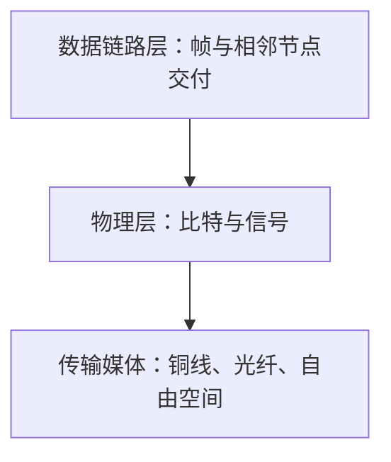

# 2.1 物理层的基本概念

物理层规定设备怎样通过传输媒体发送和接收比特。它把不同接口、介质和信号形式抽象成统一的比特传输服务，使上层无需了解电压、光功率或无线载波的具体实现。

## 层次边界

> [!important] 物理层不是传输媒体
> 物理层描述如何通过接口使用媒体，传输媒体则是电磁波或光波传播的物理通路。把光纤、双绞线直接称为“物理层协议”是不准确的。

物理层的协议也常称为物理层规程（procedure）。这里的“规程”和“协议”指同一类规则。

## 接口的四类特性

| 特性 | 回答的问题 | 示例 |
| --- | --- | --- |
| 机械特性 | 接口物理形态是什么 | 连接器尺寸、引脚排列、固定方式 |
| 电气特性 | 信号的电气范围是什么 | 电压、电流、阻抗范围 |
| 功能特性 | 每条线或每种信号表示什么 | 某引脚用于发送、接收或控制 |
| 过程特性 | 事件按什么顺序发生 | 建立、传输、释放过程中的信号时序 |

四类特性共同决定两个设备能否在物理接口上互操作。接口形状相同，并不自动保证电气、功能和时序兼容。

## 并行与串行

- **并行传输**：多个比特通过多条线路同时传送，常用于设备内部或短距离互连。
- **串行传输**：比特按时间顺序通过一条或少量信号通路传送，线路更少，更适合网络通信。

> [!note] 串行不等于低速
> 长距离并行线路容易出现各比特到达时间不一致、串扰和布线成本问题。高速网络普遍使用串行传输，并通过更高码元速率、多进制调制或多通道并行提高总数据率。

## 物理连接方式

物理层可以服务不同连接形态：

- 点到点连接：两个接口直接共享一条链路；
- 多点连接：多个设备连接到共同媒体；
- 广播媒体：发送信号可能被覆盖范围内多个设备接收。

连接形态会影响同步、复用、介质访问和故障表现，但具体的帧寻址与访问控制通常属于数据链路层。

## 本节小结

- 物理层把比特表示为可通过媒体传播的信号，并向链路层屏蔽实现差异。
- 接口规范包含机械、电气、功能和过程四类特性。
- 传输媒体位于物理层之下；物理层协议规定怎样使用媒体，而不是媒体本身。

> [!info] 章节导航
> 返回：[[2.0 第二章 物理层]]　｜　下一节：[[2.2 数据通信基础]]
