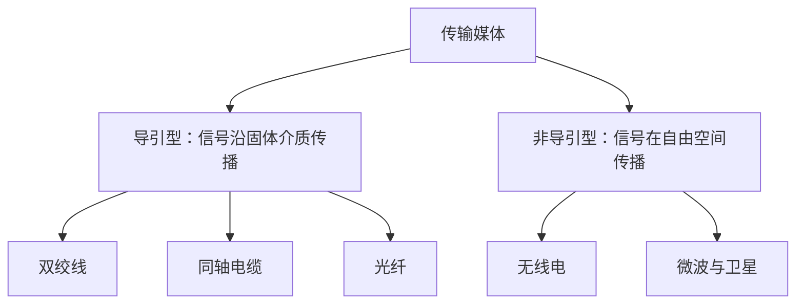

# 2.3 传输媒体

传输媒体是发送器与接收器之间承载信号的物理通路。选型不能只看标称带宽，还要同时考虑距离、衰减、噪声、布线成本、移动性、共享方式和部署环境。

## 分类与评价维度

| 维度 | 说明 |
| --- | --- |
| 频率范围与容量 | 能支持哪些信号频率和数据率 |
| 衰减与距离 | 信号随距离减弱的程度，是否需要中继或放大 |
| 干扰与失真 | 电磁干扰、串扰、色散、多径和噪声 |
| 方向与共享 | 点到点、广播、视距或共享介质 |
| 工程属性 | 成本、重量、弯曲半径、接地、施工和维护 |

![[Pasted image 20260715220717.png]]

> [!note] 图示：电磁波频谱
> 频率 $f$ 与波长 $\lambda$ 满足 $c=f\lambda$；频段名称只是分类，具体可用频率还受传播特性和频谱管理约束。来源：原始课程材料。

## 导引型传输媒体

### 双绞线

双绞线由两根绝缘铜线规则绞合而成。绞合使两根线受到的外部干扰更接近，并减少线对之间的串扰；提高绞合度、改善材料和增加屏蔽可支持更高频率。

- **UTP**（Unshielded Twisted Pair）：无额外金属屏蔽，成本和施工复杂度较低；
- **STP/FTP 等屏蔽结构**：使用编织层或铝箔降低电磁干扰，但需要正确接地和端接；
- 模拟长距离传输可使用放大器，数字传输则使用中继或再生机制恢复波形。

![[Pasted image 20260715220748.png]]

> [!warning] 类别、距离和速率是组合约束
> 双绞线类别不能单独保证某个速率。实际能力还取决于链路长度、连接器、施工质量、串扰、编码方案与设备标准。原稿中的类别表适合查阅具体布线规范，不作为本知识节点的永久速率表。

### 同轴电缆

同轴电缆由内导体、绝缘层、外导体屏蔽层和保护套组成。内外导体共享轴线，屏蔽结构使其抗外部干扰能力通常优于普通双绞线。

![[Pasted image 20260715220801.png]]

同轴电缆曾用于早期局域网，现仍常见于有线电视和[[2.6 宽带接入技术#HFC：共享同轴接入|HFC 接入]]。其可用频带和距离取决于电缆质量、阻抗匹配、放大器与网络拓扑。

### 光纤

光纤以纤芯和包层构成波导。纤芯折射率高于包层，满足条件的光在边界发生全反射，从而沿纤芯传播。

![[Pasted image 20260715220825.png]]

发送端用发光二极管或激光器把电信号转换为光脉冲，接收端用光电检测器恢复电信号。

#### 多模与单模

| 类型 | 传播特征 | 主要取舍 |
| --- | --- | --- |
| 多模光纤 | 多种传播模式同时存在 | 设备成本相对低，但模间色散使脉冲展宽，适合较短距离 |
| 单模光纤 | 主要允许单一传播模式 | 色散更小、距离和容量更高，但光源、连接与施工要求更高 |

![[Pasted image 20260715220844.png]]

光纤常用窗口位于 850 nm、1310 nm 和 1550 nm 附近；具体窗口选择取决于衰减、色散、器件和系统标准。

光纤的主要特点：

- 频带宽、损耗低，适合高速和长距离传输；
- 不受外部电磁干扰，也不会产生铜缆式串扰；
- 体积小、重量轻，但熔接、连接、弯曲和测试需要专用工具；
- 不会向外辐射电磁信号，但这不等于“不可窃听”，安全仍需依靠访问控制和加密。

## 非导引型传输媒体

无线信号在自由空间传播，适合移动终端、难以布线的区域和广播覆盖。共享空间也意味着干扰、衰落、频谱许可与窃听风险需要专门处理。

### 微波与视距传播

微波通常近似直线传播，地面链路常要求视距（Line of Sight, LOS）。地球曲率、建筑物、地形和天气会限制链路；长距离可通过中继站逐段转发。

![[Pasted image 20260715220915.png]]

### 多径效应

同一信号可经直达、反射、绕射等多条路径到达接收端。各路径的时延和相位不同，叠加后可能增强、抵消或造成码间串扰，这称为多径效应。

![[Pasted image 20260715220929.png]]

移动会不断改变路径关系，使信噪比和误码率随时间变化。因此无线物理层常采用自适应调制与编码：信道条件好时提高调制阶数和数据率，条件差时换取更强的抗噪声能力。

> [!note] 数据率、信噪比与误码率
> 在调制方式和数据率相同的条件下，提高信噪比通常降低误码率；在信噪比相同的条件下，追求更高频谱效率通常会提高误码风险。比较时必须固定调制、编码、带宽和信道条件。

### 卫星通信

卫星链路本质上是以卫星作为中继站的无线通信：

- **地球同步轨道卫星**覆盖范围大，但传播路径长；地球站经卫星到另一地球站的单向传播时延常取约 270 ms；
- **低轨卫星**距离较近，单跳传播时延较小，但卫星相对地面移动，需要星座切换和持续覆盖；
- 卫星适合广域覆盖、广播和偏远地区，但终端、链路预算、共享容量和开放空间窃听风险需要权衡。

> [!warning] 传播时延不等于总时延
> 总时延还包括发送、处理和排队时延，见[[1.6 计算机网络的性能#时延的四个组成部分]]。卫星传播时延大，不代表所有卫星数据传输的总完成时间都必然大于其他网络，仍需结合数据量和路径负载分析。

## 介质选择示例

| 场景 | 优先考虑 | 原因 |
| --- | --- | --- |
| 办公楼水平布线 | 双绞线 | 成本低、端接方便、终端接口普及 |
| 园区或数据中心骨干 | 光纤 | 高容量、长距离、抗电磁干扰 |
| 有线电视存量接入 | 同轴电缆/HFC | 可复用既有同轴网络 |
| 移动终端 | 无线 | 支持移动与灵活覆盖 |
| 偏远海洋或陆地区域 | 卫星 | 不依赖连续地面线路 |

## 本节小结

- 导引型媒体沿固体介质传播，非导引型媒体通过自由空间传播。
- 双绞线重视绞合、屏蔽和施工；同轴电缆具有屏蔽结构；光纤依靠波导传播并提供高容量。
- 无线链路受视距、多径、衰落和共享频谱影响，通常需要自适应机制。
- 介质选择是容量、距离、可靠性、成本和部署条件的综合权衡。

> [!info] 章节导航
> 上一节：[[2.2.3 信道的极限容量]]　｜　下一节：[[2.4 信道复用技术]]
